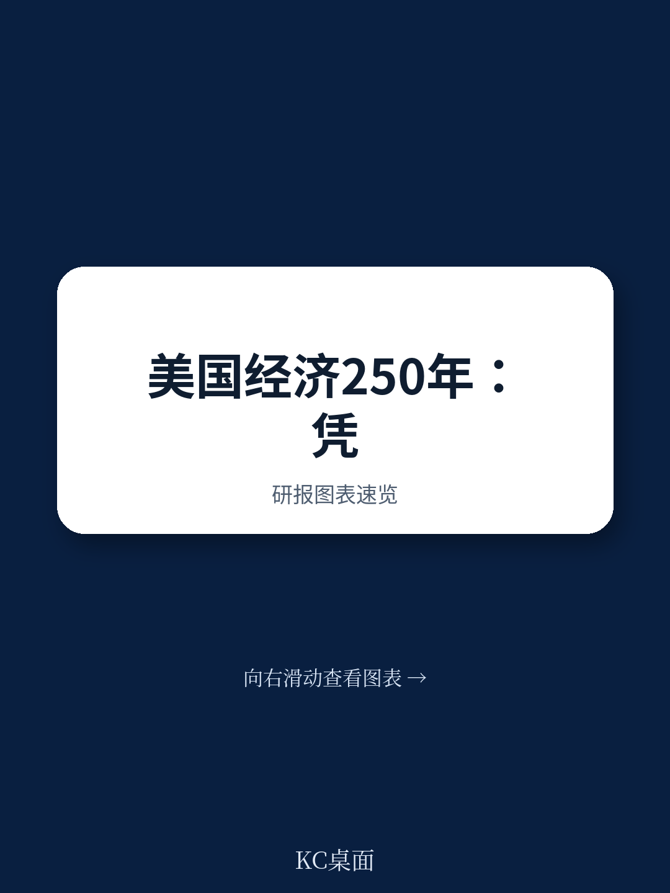

# 麦肯锡：美国250年的竞争力，正被三个“历史负债”侵蚀

美国建国250年，至今仍是全球最具竞争力的经济体。它拥有全球26%的GDP，59家全球百强企业，以及超过一半的全球市值。在AI、生物科技、半导体设计等前沿领域，美国依然牢牢占据制高点。过去几年，美国的生产率增速和宣布的外国直接投资（FDI）流入量，甚至拉大了与其他发达经济体的差距。

这份来自麦肯锡全球研究院（MGI）的250周年纪念报告，本可以是一场盛大的自我庆祝。但它选择了一条更诚实也更尖锐的路径：在肯定成就的同时，明确指出美国正站在一个必须“再次进化”的十字路口。

报告的核心判断是：美国历史上赖以成功的两项基石——创新文化与自然资源禀赋——依然存在，但支撑这些基石的制度、基础设施和人力资本正在老化。一些曾经的竞争优势，正在变成结构性负债。如果美国不能像过去四次那样（农业、工业、科学、数字时代）完成经济模式的又一次转型，其全球竞争力将面临实质性侵蚀。

这不是一个关于“美国衰落”的叙事。这是一份关于“领先者如何失去领先”的冷静预警。

> **KC评论：** 麦肯锡这份报告最有价值的部分，不是它证明了美国有多强，而是它量化了“保持领先需要付出多大代价”。它提出了一个对全球投资者和产业决策者都至关重要的框架：一个经济体的竞争力，不是静态的排名，而是动态的“适应能力”。当AI、地缘冲突和人口结构同时发生巨变时，美国过去四次的成功转型，恰恰是它未来最大的不确定性来源。完整报告里有一张关于“四次历史转型”的详细图表，非常值得仔细看。

## 1. 这轮变化真正考验的是企业能否把规模转化为议价权

美国企业的全球领先地位，是报告首先确认的事实。在全球百强企业（按市值计）中，美国占据了59席。在AI私人投资总额上，美国2024年达到1091亿美元，是第二名中国的近12倍。在“值得关注的AI模型”数量上，美国以48个领先中国的32个。

但这些数字背后，隐藏着一个更深层的结构性问题：规模的效率是否在下降。

报告指出，美国企业在全球市场拥有巨大的规模优势，但这种优势正面临两方面的压力。第一，来自中国的竞争不仅在制造端，更在技术端。中国在制造业产出和出口上已经超过美国，在AI模型数量上也在快速追赶。第二，美国企业自身的“技术护城河”是否足够深，取决于它们能否持续将研发投入转化为真正的市场定价权。

麦肯锡在报告中用了一个关键指标：美国企业的研发支出占GDP的4%，高居全球前列。但问题在于，研发投入的回报率是否在递减？当美国企业在半导体制造、量子计算、生物制药等领域面临来自中国的系统性竞争时，规模本身不再安全。真正的考验是：美国企业能否在保持技术领先的同时，重构全球供应链，以确保在关键领域不被“卡脖子”。

> **KC评论：** 很多读者会关注中美在AI模型数量上的对比（48 vs 32），但报告隐含的判断更值得注意：美国在“基础研究”和“诺贝尔奖级科学突破”上的优势依然巨大，但中国在“应用创新”和“工程化量产”上的追赶速度远超预期。这意味着，未来5-10年的竞争，不是谁发明了更好的算法，而是谁能以更低的成本、更快的速度把技术变成可贸易的商品。完整报告中有对“全球百大创新”的详细历史分析，可以帮助理解这种结构性转变。

## 2. 生产率加速背后，隐藏着“不可持续”的代价

美国近年来的生产率增速令人瞩目。2019至2024年间，美国劳动生产率年均增长1.8%，远超德国的0.7%、英国的0.4%，甚至远高于日本和意大利的负增长。这似乎是竞争力最强的直接证据。

但麦肯锡的深度分析揭示了一个容易被忽视的问题：这种生产率增长，在多大程度上是可持续的？

报告区分了两种生产率增长：一种来自技术进步和资本深化（健康的），另一种来自劳动力市场的结构性变化（例如低生产率的服务业工人被挤出，或者工时延长）。美国近年来的生产率加速，部分受益于AI和数字化投资的爆发，但也部分来自于劳动力市场的“筛选效应”——低技能岗位的减少和高端岗位的集中。

更关键的是，支撑生产率增长的几个基础性要素，正在恶化。基础设施老化、教育质量下滑、制造业技能断层、财政赤字膨胀——这些因素如果得不到纠正，将直接侵蚀未来10-20年的生产率潜力。麦肯锡估算，仅基础设施一项，美国未来10年就需要7.2万亿美元的投资，而目前的投资缺口巨大。

> **KC评论：** 这是一个典型的“合成谬误”问题。单个美国企业的生产率数据非常漂亮，但把这些数据加总后，支撑它们的底层结构却在松动。报告没有直接说“美国生产率会下降”，但它用大量数据暗示：如果基础设施和教育问题不解决，当前的生产率增速是不可持续的。完整报告中有关于“美国基础设施评级”和“PISA分数下滑”的详细图表，可以帮助理解这个判断的严肃性。

## 3. 报告没有完全回答的关键问题：AI是解药还是毒药？

麦肯锡的报告花了大量篇幅讨论AI。美国在AI领域的绝对领先地位是毋庸置疑的：全球最顶尖的AI模型、最大的AI投资、最多的AI论文和专利。报告甚至暗示，AI可能是美国开启“第五次经济转型”的核心引擎。

但报告也留下了一个未完全回答的关键问题：AI对竞争力的影响，是缩小还是放大了美国的内部裂痕？

一方面，AI可以显著提升生产率，尤其是在医疗、教育、制造等长期效率低下的领域。另一方面，AI也可能加剧收入不平等和技能断层。麦肯锡在报告“经济机会”维度中，已经提到了美国收入不平等的严重性：Top 10%与Bottom 50%的税前收入比高达35倍，远高于德国的20倍和英国的17倍。AI的普及，如果缺乏配套的教育和再培训体系，可能会让这个差距进一步拉大。

更值得深思的是，AI本身需要巨大的算力和能源支撑。美国在AI算力上的优势，部分建立在其廉价的能源和丰富的自然资源上。但如果能源基础设施老化、电网不稳定，AI的算力优势也可能被削弱。报告指出，美国在能源自给自足方面有历史优势，但电网老化和清洁能源转型的不确定性，正在挑战这一基础。

> **KC评论：** 报告对AI的态度是审慎乐观的。它承认AI是巨大的机遇，但也暗示：如果没有配套的教育、基础设施和财政改革，AI可能只会让“赢者通吃”的局面更加极端。这其实是一个对投资者的关键提醒：不要只看AI概念股的涨跌，而要关注哪些公司有能力在AI时代修复“社会裂痕”并从中获益。完整报告中有关于“美国教育PISA分数下滑”和“制造业技能断层”的详细数据，这些都是理解AI影响的重要前提。

## 4. 一个更好的观察框架：从“四个维度”看美国竞争力的真实状态

对于希望跟踪美国竞争力的读者，麦肯锡报告提供了一个非常清晰的观察框架。它把竞争力分解为四个维度，每个维度都有可量化的指标：

**第一，全球领先的企业。** 关注市值、营收、FDI流入、制造产出。目前美国在这方面的优势依然巨大，但中国的追赶在制造和出口领域已经形成实质性挑战。

**第二，创新和技术领导力。** 关注R&D支出、AI投资、高被引科学家数量、诺贝尔奖数量。美国在基础研究和尖端技术上的优势依然稳固，但AI领域的“工程化”竞争正在加剧。

**第三，经济机会。** 关注人均GDP、收入不平等、教育水平、技能匹配度。这是美国最脆弱的一环。收入不平等和PISA分数下滑，是长期竞争力的最大隐患。

**第四，基础设施和资源。** 关注能源自给率、电网可靠性、交通基础设施、数字基础设施。美国在能源和自然资源上有历史优势，但基础设施老化问题已经成为制约增长的瓶颈。

这四个维度不是独立的。一个维度的恶化会传导到其他维度。例如，教育下滑会削弱创新基础，收入不平等会削弱消费市场，基础设施老化会削弱企业竞争力。麦肯锡的框架让读者可以系统性地追踪美国竞争力的健康状况，而不是只看GDP或股市的表象。

> **KC评论：** 这个框架对产业决策者尤其有用。如果你在考虑是否要在美国投资建厂，你不能只看劳动力成本或税收优惠，而要看这个地区的教育水平、基础设施质量和供应链韧性。报告没有给出具体的投资建议，但它提供了一个比传统“营商环境”排名更深刻的判断工具。完整报告中有关于“美国各州竞争力差异”的详细分析，可以帮助做更精细的区域投资决策。

## 5. 未来十年的最大变量：财政纪律与政治共识

报告在最后几章，罕见地直接讨论了美国的财政健康问题。它指出，不断膨胀的国债和债务利息支出，正在挤占对基础设施、教育和国防的投资空间。如果财政纪律得不到恢复，美国将面临一个两难选择：要么削减关键公共投资，要么继续推高债务负担。

这不仅是经济问题，更是政治问题。麦肯锡报告隐含了一个判断：美国过去250年的四次成功转型，都依赖于某种程度的“政治共识”和“制度弹性”。从建国初期的农业经济，到19世纪的工业化，再到20世纪的科技革命，每一次转型都伴随着政府的积极角色和社会的广泛参与。

但今天的美国，政治极化程度是历史上罕见的。在医疗改革、移民政策、贸易政策、财政预算等关键议题上，两党几乎无法达成共识。这种政治僵局，可能会阻碍美国做出必要的结构性改革，从而错失第五次转型的窗口期。

报告没有直接说“美国会失败”，但它明确指出了“如果不改变，就会失败”的路径。这种克制而坦诚的表达，恰恰是麦肯锡报告最值得尊敬的地方。

---

这份报告读下来，最大的感受是：美国依然强大，但它的强大正在被自己过去的成功所消耗。那些曾经帮助它领先的制度、基础设施和人力资本，如果不进行系统性更新，就会变成拖累。

报告没有给出简单的答案。它只是提供了一个框架，让读者自己去判断：在AI、地缘冲突和人口结构三重冲击下，美国能否像历史上四次那样，再次完成自我进化？

这个问题，不仅关乎美国的未来，也关乎全球每一个投资者、企业家和政策制定者的决策。如果你想深入理解美国竞争力的真实状态，以及它未来可能面临的转折点，欢迎加入我们的社群。我们每天会由AI agent加上人工review，整理国际顶级投行和咨询机构的最新研报中文摘要，包含完整的数据图表和深度解读。每天更新10-40页，既方便喂给AI做进一步分析，也方便人工快速把握全球市场的动态变化。

你可以在这里，和我们一起，追踪美国竞争力的下一个拐点。

Personal reading notes and learning share only. Not investment advice.

