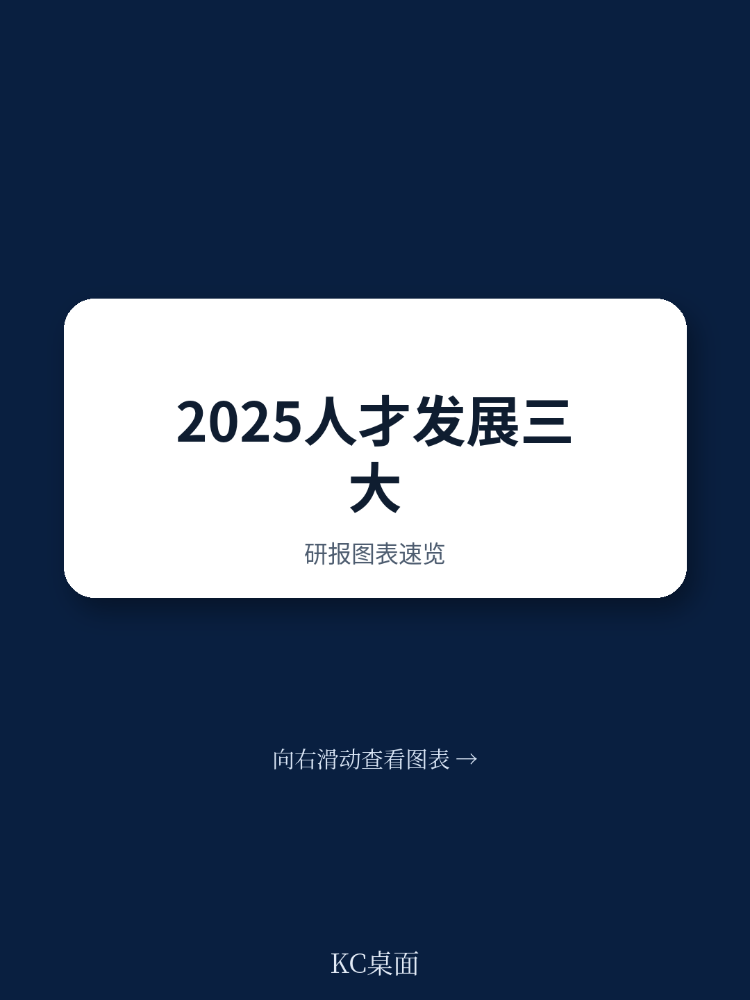
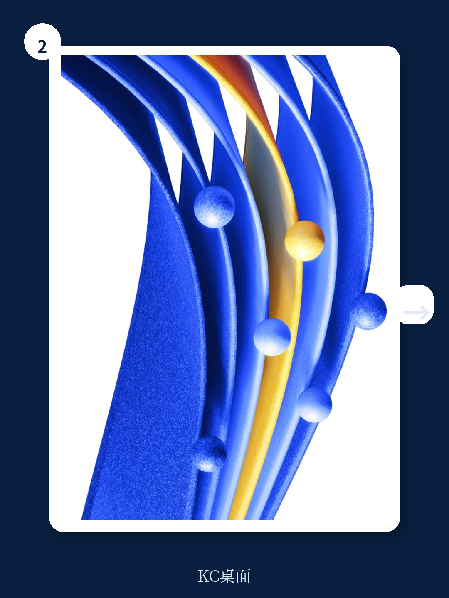

# 麦肯锡：2025年，企业最大的风险不是AI，而是把学习当作“福利”

**主判断：** 麦肯锡最新研报指出，全球企业的学习与发展（L&D）正站在一个“从支持功能到战略引擎”的转折点上。但真正的危机不是技术追赶不上，而是绝大多数组织仍然用过去20年的框架来应对未来5年的变化。报告提出的“流体发展生态系统”不是又一个HR概念，而是决定组织能否在AI时代留住核心人才、实现韧性增长的关键变量。

这份由麦肯锡研究与创新学习实验室发布的2025年趋势报告，基于对45+全球趋势报告的系统分析，给出了一个反直觉的判断：**当AI代理开始扮演实时导师、当技能半衰期缩短至2-3年，企业最大的瓶颈不是技术采购，而是组织内部根深蒂固的职能孤岛和短视的规划周期。**

以下是我们从这份报告中提炼的五个核心洞察，以及它们对产业决策者的实际含义。

> **KC评论：** 很多企业老板现在焦虑的是“AI会不会取代我的员工”，但麦肯锡的结论更尖锐——问题不是AI取代人，而是你的组织根本没有准备好让员工在AI时代持续成长。61%的企业只做一年的人力规划，这本质上是在用“打补丁”的方式应对“换系统”的挑战。

## 1. 学习与工作的边界正在消失，但多数企业还停留在“脱产培训”的旧模式

报告提出了一个关键概念：“流体发展生态系统”。这不是一个学术术语，而是一个操作框架。它的核心主张是：**未来的发展不应该让员工“停下工作去学习”，而是让工作本身成为发展的引擎。**

当前阶段，报告称之为“真实但非激进的进步”。AI代理开始扮演实时指导角色，技能验证正在从自我报告转向更完整的数据画像。但学习仍然被感知为“需要专门抽时间去做的事”，而非自然嵌入工作流的一部分。

真正的问题在于组织结构的惯性。报告引用ATD 2023年调查数据：虽然72%的受访者认同将HR转变为跨职能学科的重要性，但只有11%报告了有意义的进展。这个落差说明，大多数组织知道方向，却没有找到路径。

**对决策者的含义：** 如果你发现员工培训参与率低、学习平台使用率不高，不要归咎于员工“不爱学习”，问题很可能出在你的学习系统与工作系统没有打通。真正有效的学习，应该像呼吸一样自然，而不是像体检一样需要专门安排。

## 2. 技能将成为新“货币”，但61%的企业还在做一年规划

报告引用了世界经济论坛《未来就业报告》的数据：2025年至2030年间，39%的现有技能将发生转变或过时。这是一个惊人的速度。如果按一个技能的生命周期约3-5年计算，企业现在招聘时看重的技能，可能在新员工适应期结束时就已贬值。

然而，61%的企业仍然只做一年的劳动力规划。这意味着大多数组织在用“后视镜”开车——他们看到的不是前方的路，而是已经走过的路。

麦肯锡的解决方案是“基于有意义的前瞻性做出战略决策”。这要求人才发展领导者必须建立从劳动力趋势、技术变革、经济变化、地缘政治等多个来源解读信号的能力，并将这些洞察转化为长期发展策略。

> **KC评论：** 这里有一个容易被忽略的细节：报告强调“前瞻性”不能只在L&D部门内部做。它要求跨职能团队共同监测和解读外部信号。这实际上是在说，传统的“HR看人、业务看业绩、战略看市场”的分工模式已经过时了。未来的竞争力，取决于能否把这三张图叠在一起看。

## 3. AI采用的关键不是技术，而是信任

报告的第二大主题是“负责任的AI采用”。麦肯锡的判断非常明确：**这是一个定义工作与学习新时代的关键时刻，但信任是脆弱的，处理不当可能侵蚀员工信心。**

当前的状态是：人才领导者正在积极实验AI——构建AI代理、建立合作伙伴关系、试点新功能。但这些努力可能给员工带来更多复杂性，而非清晰的价值。

报告提出的路径是“保持员工信任以加速AI采用”。这意味着企业必须向员工传递一个明确信号：领导者关心他们的贡献，并致力于确保AI能帮助他们成功，而不是取代他们。

**对决策者的含义：** AI引入的速度不是越快越好。如果员工感觉AI是来“监控”或“替代”他们的，采用率会断崖式下跌。真正的挑战在于如何在提升效率的同时，让员工感受到被赋能而非被威胁。这需要技术部署与文化建设的同步推进。

## 4. 韧性不是个人特质，而是组织系统设计的结果

报告的第三大主题聚焦“韧性与适应性”。麦肯锡的观点值得所有高管深思：**那些能蓬勃发展的组织，不是抗拒变化或仅仅从挫折中恢复的组织，而是那些能够预见挑战、适应并成长的组织。**

这要求组织重新设计工作环境，建立支持韧性和适应性的结构与文化基础。具体包括三个子方向：

- 释放多元化、多代际劳动力的潜力
- 支持恢复休整以确保持续绩效
- 通过可持续工作流程实现大规模组织韧性

报告特别指出，工作倦怠率在2025年达到66%，这已经不是个别员工的个人问题，而是组织系统的系统性失败。解决路径不是增加更多“员工福利”项目，而是重新设计工作本身——包括节奏、流程、期望值管理。

> **KC评论：** 我特别注意到报告引用了一个数据：虽然83%的领导者认为领导力是技能转型的关键，但只有28%的员工感觉战略被清晰传达。这中间55个百分点的落差，说明的不是沟通问题，而是信任赤字。当员工不信任领导层的方向时，任何培训投入都会变成沉没成本。

## 5. 报告没有完全回答的关键问题：从“知道”到“做到”的鸿沟如何跨越？

尽管这份报告提供了极具洞察力的框架和方向，但它也有一个明显的“未完成”之处：**它没有给出一个清晰的、可操作的变革路径图。**

报告提出了三个宏观趋势领域——流体发展生态系统、负责任的AI采用、韧性与适应性——并强调三者相互强化、不可孤立推进。这种系统性的视角是准确的，但也带来了一个现实困境：对于大多数资源有限、组织文化根深蒂固的企业来说，同时推进三个方向的变革几乎是不可能的。

报告给出了“如何采取行动”的建议，分别针对人才领导者、管理者和个人贡献者。但这些建议更多是方向性的（如“有意组建跨职能团队解决组织范围内的挑战”），而非具体的步骤、时间表或资源分配方案。

**这意味着什么？** 对于读者来说，这份报告最大的价值不是提供“答案”，而是提供一个诊断框架和优先级排序工具。真正的工作——将洞察转化为行动——需要每个组织根据自己的具体情况来完成。而这正是我们社群持续讨论和拆解的核心议题。

## 给读者的观察框架：如何判断你的组织是否走在正确的轨道上

基于报告的框架，我们提炼了三个可以立即使用的自检问题：

**第一，你的学习系统是“脱产”还是“嵌入”的？** 如果员工需要专门请假、离开工作环境去参加培训，说明你的发展系统还停留在旧范式。真正的流体生态系统应该让学习发生在工作流中，通过AI代理、即时反馈、项目实践等方式实现。

**第二，你的数据是“事后统计”还是“前瞻驱动”的？** 如果你只能统计培训完成率、课程满意度，说明你的数据系统还停留在“记分牌”阶段。真正有价值的数据应该能预测技能缺口、识别高潜力人才、动态调整发展路径。

**第三，你的员工是“被动接受”还是“主动选择”发展？** 如果员工的发展路径完全由上级或HR指定，说明组织还没有建立起真正的个人发展主体性。未来的模式应该让员工能够访问自己的发展数据，做出知情决策，并在多路径中进行选择。

**这份报告最值得继续深读的部分**，包括麦肯锡对“技能验证从自我报告转向完整数据画像”的具体方法论、AI代理如何根据绩效和认知负荷实时调整支持程度的架构设计，以及“大规模组织韧性”在跨国企业中的实践案例。这些内容在完整报告中都有详细的图表和案例支撑。

---

这份报告的完整版包含超过40页的详细趋势分析、数据图表和行动框架。我们每天由AI agent+人工review生成的国际投行中文摘要与KC评论中，完整收录了这份报告的原始图表、数据来源和麦肯锡的详细行动建议。同时，我们也补充了来自高盛、摩根士丹利、瑞银等其他机构关于人才趋势的交叉验证数据。

如果你正在思考2025年的人才战略和组织变革方向，这份报告的完整解读能够帮助你节省至少20小时的研读时间，同时获得多个视角的交叉验证。欢迎加入我们的社群，每天获取约10-40页的国际投行中文摘要与数据图表合集，既方便喂给AI进行二次分析，也适合人工快速把握全球市场动态。

Personal reading notes and learning share only. Not investment advice.

