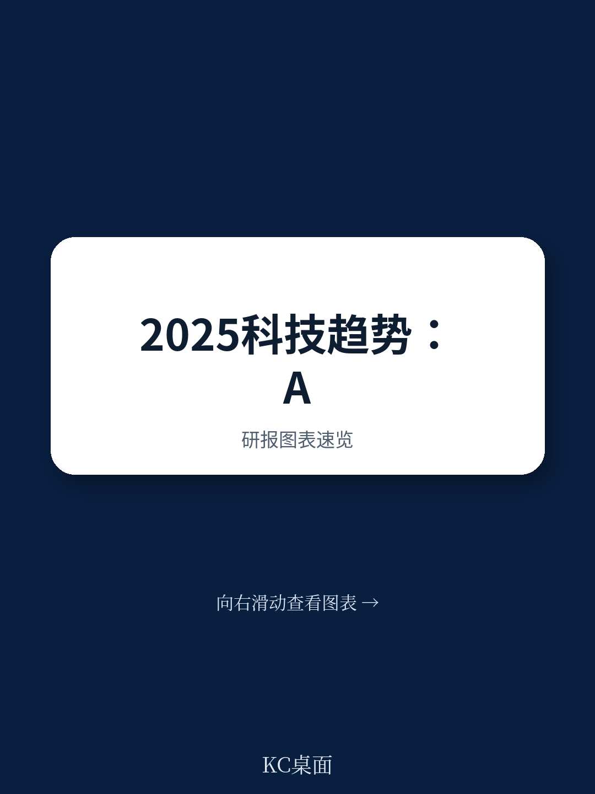
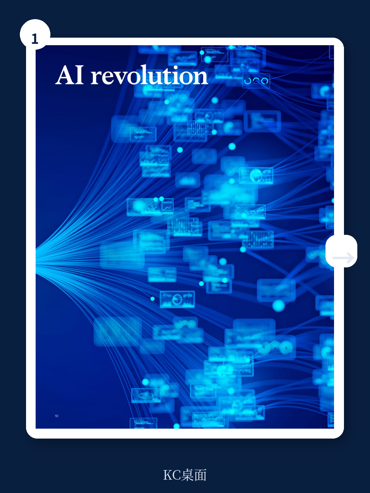
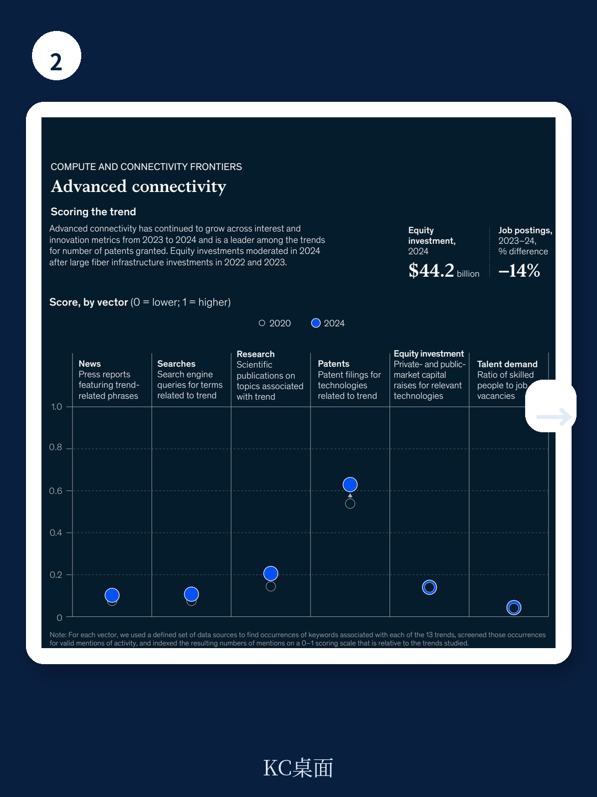

# 麦肯锡：AI不再独自奔跑，2025年最值得关注的不是大模型本身

当全球科技圈还在为GPT-5的参数规模争论不休时，麦肯锡2025年技术趋势报告给出了一个更冷静的判断：**AI的价值正在从“模型有多大”转向“系统有多聪明”。**

这不是一份罗列13项技术的清单。它的核心主张是：2025年，技术竞争的本质不再是单项技术的突破速度，而是不同技术之间的“组合能力”。AI不再是孤立的浪潮，而是成为所有前沿技术的“放大器”——它加速机器人训练、推动生物工程科学发现、优化能源系统，甚至在改变半导体设计的底层逻辑。

这份报告最值得留意的信号，不是哪项技术排名上升，而是**一个全新的技术趋势首次进入麦肯锡的视野，并以“增长最快”的姿态出现**。这个趋势的量化指标在2023到2024年间增长了985%，但很多人对它还停留在概念阶段。

---

## 1. 985%的增长背后，一个“虚拟同事”时代正在开启

2024年，全球对“Agentic AI”的股权投资达到11亿美元。这个数字放在AI领域并不算大——与通用AI动辄数百亿美元的投资相比，它只是冰山一角。但真正值得注意的，是它的增长速度：**同比增长985%**。

麦肯锡将Agentic AI定义为“结合了AI基础模型的灵活性与通用性，同时具备在现实世界中行动能力”的技术。它的核心产品形态是“虚拟同事”——能够自主规划并执行多步骤工作流的AI代理。

这意味着什么？传统的AI应用是“你问它答”，即便是最先进的ChatGPT，本质上也是被动响应。而Agentic AI的突破在于，它开始具备“主动规划”的能力：当一个工厂机器出现故障，AI代理可以自主诊断问题、制定维修计划、协调零部件采购，并监督质量检查——整个过程几乎不需要人类介入。

> **KC评论：** 985%的增长数字本身并不重要，重要的是它揭示了一个拐点：企业从“用AI回答问题”转向“让AI完成任务”。完整报告里对Agentic AI在企业应用场景的拆解非常细致，包括哪些行业最先受益、哪些岗位最容易被替代、以及部署过程中的关键风险。这些内容在公开讨论中很少被系统性地梳理。

---

## 2. 半导体创新的真正驱动力不是摩尔定律，而是AI的“热”与“电”

麦肯锡报告明确指出，半导体领域的创新正在经历一次结构性跃迁。驱动力不再是摩尔定律的传统逻辑——晶体管密度翻倍——而是AI训练和推理对计算能力、内存和网络带宽的指数级需求，以及对成本、散热和功耗管理的现实约束。

这催生了一系列新产品的涌现：专用AI芯片、新型存储架构、以及围绕这些硬件建立的全新生态系统。报告特别指出，半导体领域的专利数量出现了显著增长，这种增长不是线性，而是跳跃式的。

但更值得关注的是，这种创新正在改变竞争格局。过去，芯片行业的领导者是那些能够制造通用处理器的公司。而现在，**为特定AI工作负载设计的专用芯片正在成为新的制高点**。这意味着，传统的“赢家通吃”逻辑正在被“细分市场专业化”所取代。

> **KC评论：** 半导体这部分是报告中最容易被低估的章节。大多数人只关注英伟达的GPU是否继续领先，但麦肯锡的分析框架更值得看——它把芯片创新放在AI、云计算、边缘计算的交叉点上，揭示了一个更复杂的竞争生态。报告里有一张图专门展示了不同技术趋势之间的相互依赖关系，这张图本身就是很好的决策工具。

---

## 3. 投资回暖不等于盲目乐观，三个领域正在发生结构性分化

2024年，13个技术趋势中有10个的股权投资出现增长。经历了2023年的市场低迷后，资本正在重新入场。但麦肯锡的观察不是简单的“回暖”，而是揭示了明显的结构性分化。

两个趋势的投资规模最大：能源与可持续发展技术、以及未来出行技术。这两个领域在2023年经历了整体下滑，但前者在2024年强劲反弹。这意味着，资本并没有从清洁技术和新能源领域撤离，而是在等待更明确的商业路径。

另一个值得关注的趋势是云计算与边缘计算。尽管这个领域已经相对成熟，但2024年的投资依然保持增长。原因在于，AI的爆发式需求正在重塑云计算的架构——通用大模型的训练需要巨型数据中心，而边缘AI应用则需要更小、更高效的分布式计算能力。**这两个方向同时在扩张，而不是此消彼长。**

与此形成对比的是，量子计算虽然获得了更多关注（尤其是科技巨头的公开声明），但麦肯锡的评估显示，其真正的商业影响仍需更长时间。报告对量子计算的定位是“在特定领域具有变革潜力”，但现实世界的影响需要更多技术突破。

---

## 4. 报告没有完全回答的关键问题：规模化的“最后一公里”

麦肯锡的报告在分析每个技术趋势时，都列出了“关键不确定性”。这些不确定性不是泛泛而谈的风险提示，而是真正影响技术落地的瓶颈。

以能源技术为例，报告指出了8个关键不确定性，从电网韧性到供应链约束，从劳动力短缺到宏观经济影响。但最核心的挑战，其实是“规模化的最后一公里”——实验室里的技术突破已经足够多，但如何跨越从示范项目到大规模商业部署的鸿沟，才是真正的难题。

同样的问题也出现在机器人技术和生物工程领域。报告提到了“从试点到实践”的转变，但没有完全展开的是：**为什么很多技术已经证明了可行性，却迟迟无法规模化？** 答案可能不在于技术本身，而在于组织能力、监管框架、以及生态系统的成熟度。

这也是报告最值得深读的地方——它不仅仅是告诉你“有什么技术”，更重要的是告诉你“这些技术什么时候才能真正用得上”。

> **KC评论：** 麦肯锡的这份报告最值钱的部分，其实是每个技术趋势后面的“关键不确定性”和“未来重大问题”。这些不是预测，而是思考框架。如果你正在做技术投资或战略规划，这些问题的优先级可能比技术参数本身更重要。完整报告里对这些不确定性的展开分析，以及对不同行业应采取的策略建议，是平时很难接触到的系统思考。

---

## 5. 一个更实用的观察框架：不要问“该投哪个技术”，而要问“我的行业需要哪组组合”

麦肯锡报告最精妙的设计，不是13个趋势的独立分析，而是它们之间的“组合逻辑”。报告专门用三个案例展示了不同技术如何协同工作：

工厂机器维修，需要AI诊断、Agentic AI规划、以及机器人执行。个性化药物配送，需要生物工程、区块链、以及自主无人机。风电场维护，需要沉浸式现实、先进连接技术、以及能源管理系统的整合。

这些案例揭示了一个核心洞察：**未来的竞争优势，不取决于你掌握了哪一项技术，而取决于你能否将多项技术组合成有效的解决方案。**

对于企业决策者来说，这意味着评估技术时不应该只关注单项技术的成熟度，而应该关注它与你已有能力的匹配度，以及它与其他技术的协同潜力。麦肯锡在报告开篇就明确指出：“成功取决于识别可以应用这些趋势的高影响力领域，投资必要的人才和基础设施，并解决监管变化和生态系统准备等外部因素。”

---

## 6. 真正的挑战不在技术，而在“人”与“信任”

报告在贯穿全文的主题中，特别强调了“负责任的创新”和“信任”的重要性。这不是公关话术，而是基于对技术落地现实的观察。

随着AI变得更加强大和个性化，信任正在成为技术采用的“守门人”。企业面临的压力不仅是技术性能，还包括透明度、公平性和问责制。报告指出：“伦理不再仅仅是正确的事情，而是部署中的战略杠杆——它可以加速或阻碍规模化、投资和长期影响。”

这一判断在AI领域尤为突出。AI的潜力越大，社会对其治理的需求就越紧迫。报告没有回避这个问题，而是将其作为所有技术趋势的共同挑战。这也意味着，**那些能够在技术创新的同时建立信任机制的企业，将获得更快的市场准入和更低的合规成本。**

---

## 读完这份报告，你最应该带走的不是技术清单

麦肯锡这份报告的价值，不在于告诉你“2025年有哪些热门技术”——这类信息在网络上每天都在更新。它的真正价值，在于提供了一个**系统性思考框架**：如何评估技术的成熟度、如何判断技术之间的相互作用、以及如何在不同行业背景下制定差异化策略。

但报告也有它的局限。它没有完全回答的问题包括：哪些组合在哪些行业最先产生商业回报？不同规模的企业应该如何分配资源？以及，在技术加速迭代的环境下，企业如何平衡“抢先布局”与“等待成熟”的风险？

这些正是需要更深入讨论的问题。如果你希望看到完整的技术趋势评分矩阵、每个趋势的详细投资数据、以及针对不同行业的策略建议，欢迎加入我们的社群。每天，我们会通过AI agent加人工审核的方式，整理国际顶级投行和研究机构的最新报告摘要与解读，包含原始图表和数据，方便你在30分钟内把握全球资本市场的技术投资动向。

---

Personal reading notes and learning share only. Not investment advice.

