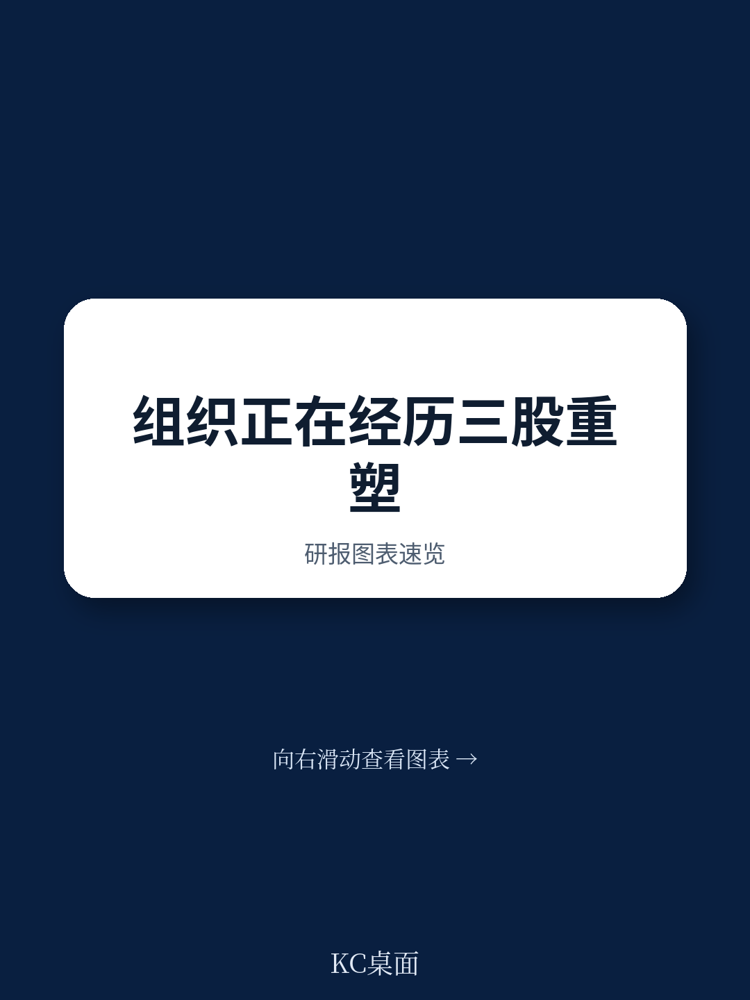
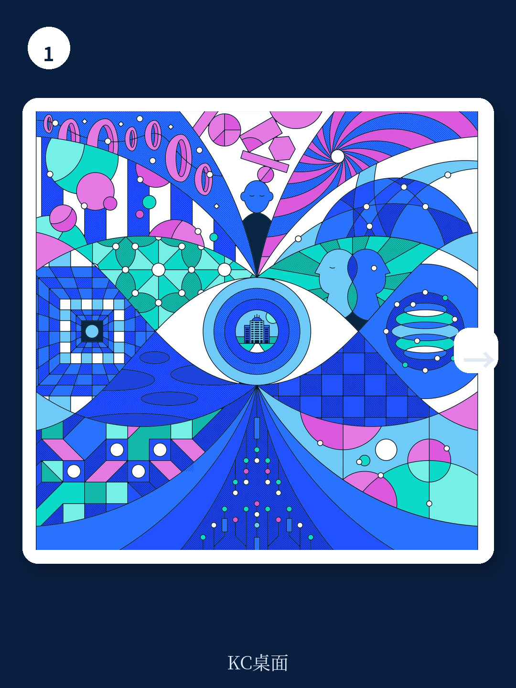

# 麦肯锡：88%企业在试AI，但81%没赚到钱

当全球超过一万名企业高管被问及“你的组织准备好迎接未来变化了吗”，72%的回答是“没有完全准备好”。即使在那些对未来持乐观态度的领导者中，也只有三分之一认为自己做好了准备。

这是麦肯锡在2026年2月发布的《组织现状》报告中揭示的核心矛盾。这份基于15个国家、16个行业、超过10,000名高管反馈的第二版研究，试图回答一个根本问题：在AI、地缘裂变和劳动力结构三重巨变同时发生的时代，什么样的组织才能真正持续创造价值？

答案并不令人意外，但执行路径远比想象中复杂。报告的核心判断是：组织的重心已从短期韧性转向长期生产力与持续价值创造，而AI是这场转型的技术底座。但真正值得关注的不是这个结论本身，而是麦肯锡在数据中发现的巨大落差——88%的组织在尝试AI，81%没有看到有意义的利润改善。这中间的7个百分点，正是当下最值得拆解的谜题。

---

## 1. 技术投入与组织能力之间的错配，才是AI落地最大的隐形障碍

麦肯锡的调查揭示了一个反直觉的现象：AI落地的头号障碍并非技术本身，而是组织层面的挑战。当被问及采用AI的主要障碍时，46%的高管提到对AI本身的担忧，44%提到监管、伦理或法律问题，39%指向包括变革管理在内的组织挑战。

但更深层的数据是：86%的领导者认为自己的组织对在日常运营中采用AI“没有准备好”。更值得注意的是，六分之一的组织没有明确的C级负责人来推动AI采用。只有14%的组织有领导者持续倡导AI采用和实验，并制定了清晰的策略和行动。

这意味着，大多数组织的AI战略停留在“有想法、缺执行”的阶段。技术采购可能已经完成，但谁来推动、如何推动、推动后如何评估效果，这些最基本的组织问题尚未解决。

> **KC评论：** 这张图告诉我们，企业缺的不是AI工具，而是把AI嵌入运营流程的组织能力。麦肯锡在报告中用一个关键数字点明了问题的规模：每花1美元在技术上，需要花5美元在人身上。完整报告里有一张关于AI采用准备度的细分图表，按行业和公司规模拆解了哪些领域最落后，这个拆解值得仔细看。

---

## 2. 从“结构”到“流程”的转变，是打破生产率天花板的关键

麦肯锡在报告中提出了一个可能改变组织设计范式的观点：企业需要从关注“结构”转向关注“流程”。三分之二的领导者认为自己的组织过于复杂和低效，但传统的组织扁平化、成本削减、层级精简等结构变革手段，正在遭遇收益递减。

报告提出的替代方案是“从结构到流程”的转型——将注意力从组织架构图上的方框和连线，转移到工作实际上如何完成。最大的回报在于彻底简化和统一企业内部的流程，消除重复、同步信息流、简化决策流程、在可能的地方实现自动化。

这不是一个温和的建议。它意味着企业需要重新审视那些被组织边界分割的端到端流程，打破部门墙，用工作流而非汇报线来定义组织。对于习惯了矩阵式管理的大型企业，这几乎是一次组织基因的重写。

---

## 3. 地缘政治不确定性正在重塑企业的资产配置逻辑，但多数人反应太慢

报告显示，近四分之三的受访者表示地缘政治不确定性对其组织产生了显著影响。随着贸易向更近的合作伙伴转移，企业需要构建既能保持全球规模优势、又能实现区域适应性的弹性结构。

但最令人警醒的数据是：43%的领导者承认，他们剥离资产的时间太晚，或者根本没有在应该剥离时采取行动。这个数字揭示了一个普遍的组织行为偏差——在面对地缘政治风险时，企业倾向于维持现状，直到损失已经发生。

麦肯锡建议企业利用技术——包括数字平台、数据分析和AI——来预测风险、重新分配资源并保持运营灵活性。但报告没有完全展开的是，这种“预测-响应”机制需要什么样的组织文化和决策流程才能有效运转。

> **KC评论：** 43%的人承认自己该卖没卖，这个数据本身就是一个管理信号。它说明地缘风险不是信息不足的问题，而是决策机制的问题。完整报告里有一个关于地缘风险应对成熟度的矩阵，按行业和地区做了分类，可以帮助读者判断自己的组织处于哪个阶段。

---

## 4. 资源再分配是价值创造的引擎，但七成组织做不到

在“聚焦核心”这一主题下，麦肯锡提出了一个看似简单但执行极其困难的建议：做对的事，并且做得更专注。具体来说，企业需要选择少数几个领域做到卓越，建立治理和能力来执行这些优先事项，并动态地将预算和人才重新分配以支持它们。

但调查数据令人沮丧：只有30%的组织能够实现企业范围内的资源再分配。这意味着大多数组织在战略上声称聚焦，但在实际资源配置上仍然分散。

价值创造取决于如何在企业范围内分配资产。领导者需要具备创新的远见、优先排序的纪律，以及剥离的勇气。但报告暗示，最后一点——剥离的勇气——可能是最稀缺的。这与前面43%的人承认资产剥离太晚的数据形成了呼应。

---

## 5. AI Agent将重新定义“团队”的概念，但组织还没准备好

麦肯锡在报告中用了一个专门的章节讨论“人类与AI Agent：构建新的协作世界”。这是整份报告在概念上最具前瞻性的部分。报告指出，AI要真正发挥作用，远不止是一个即插即用的工具。AI Agent和人类员工需要协作，这意味着需要重新定义能力要求，并建立人类对技术的参与感。

但现状是：只有四分之一的领导者预期AI Agent会在短期内作为自主队友与员工协作。大多数组织仍然将AI视为效率提升工具，而不是工作方式的根本变革者。

报告提到一个来自电信公司的案例：他们创建了一个“下一个最佳体验”引擎，AI模型识别客户何时需要帮助或更优方案，然后通过客户偏好的渠道发送个性化信息，只在需要时才触发人工介入。这个案例展示了AI Agent作为协作伙伴而非替代品的应用场景。

> **KC评论：** “四分之一的领导者预期AI Agent会成为自主队友”这个数字，说明大多数高管对AI的想象还停留在工具层面。但麦肯锡在报告中指出，未来AI Agent可能不仅协作，还能自主设计自己的工作流程。完整报告里有一张关于AI Agent成熟度演进路径的图表，从辅助到协作到自主，每个阶段对应的组织能力要求都不同，这个框架对制定AI战略非常有参考价值。

---

## 6. 报告尚未完全回答的关键问题：组织变革的节奏如何把控

麦肯锡在这份报告中提供了丰富的诊断框架和方向性建议，但有一个关键问题没有充分展开：在技术、经济和劳动力三重巨变同时发生时，组织变革的节奏应该如何把控？

报告承认这些力量是相互依存的——AI可能将组织从物理位置和地缘限制中解放出来，但会带来新的复杂性维度，包括人类与AI Agent如何协作。然而，对于企业管理者来说，最实际的困惑可能是：我应该同时推动九个方向的变革，还是分阶段推进？如果分阶段，优先级如何排序？

报告引用了“每1美元技术投入对应5美元人员投入”的比例，但没有给出这个比例在不同行业、不同规模企业中的适用性判断。对于一家传统制造企业和一家科技公司，这个比例显然应该不同。这些具体问题的解答，可能需要更深入的行业定制化分析。

---

## 7. 对决策者的观察框架：三个信号值得持续跟踪

基于麦肯锡报告的分析逻辑，决策者可以用以下三个维度来持续评估自身组织的健康状况：

第一，AI采用从“实验”到“嵌入”的转化率。如果你的组织还在用AI做碎片化的效率提升，而没有开始重新设计端到端流程，那么你很可能属于那81%——投入了但没有利润改善。关键指标是：是否有明确的C级负责人、是否有跨职能的AI整合计划、是否有从试点到规模化的时间表。

第二，资源再分配的动态性。如果你的预算和人才分配在年度规划后就几乎没有变化，那么你的组织很可能属于那70%——战略上说要聚焦，实际上在分散。关键指标是：资源调整的频率、剥离决策的速度、新业务获得的资源占比。

第三，领导者的自我反思能力。报告发现，30%的“反思型”领导者认为自己的组织能够快速适应变化，而“非反思型”领导者中这个比例只有17%。这个差异表明，领导者的自我认知和组织学习能力可能是变革成功的最强预测因子。

---

这份麦肯锡报告的价值不在于它给出了全新的答案，而在于它用全球最大的高管调研数据，量化了一个许多管理者已经隐约感受到但无法证实的直觉：组织变革的难度正在系统性上升，而传统的管理工具正在失效。

报告中的九个转型方向——从AI赋能组织到领导力重塑，从流程优化到多元包容——每一个都值得单独拆解。但更重要的是，它们之间的相互关联和优先级排序。这正是完整报告中最有价值的部分：麦肯锡不仅给出了诊断，还提供了一套系统性的行动框架。

如果你正在思考如何让组织在2026年真正实现从“尝试AI”到“靠AI赚钱”的跨越，或者想看到报告中按行业、按地区拆分的详细数据图表，欢迎加入我们的社群。我们每天由AI Agent配合人工审核，生成国际顶级投行和咨询机构的中文摘要与深度评论，包含当天最新数据图表合集，既方便喂给AI，也方便人工快速把握市场动态。完整报告解读和原始图表将在社群中分享，我们也会围绕这份报告中未完全解答的变革节奏问题，组织专题讨论。

Personal reading notes and learning share only. Not investment advice.

