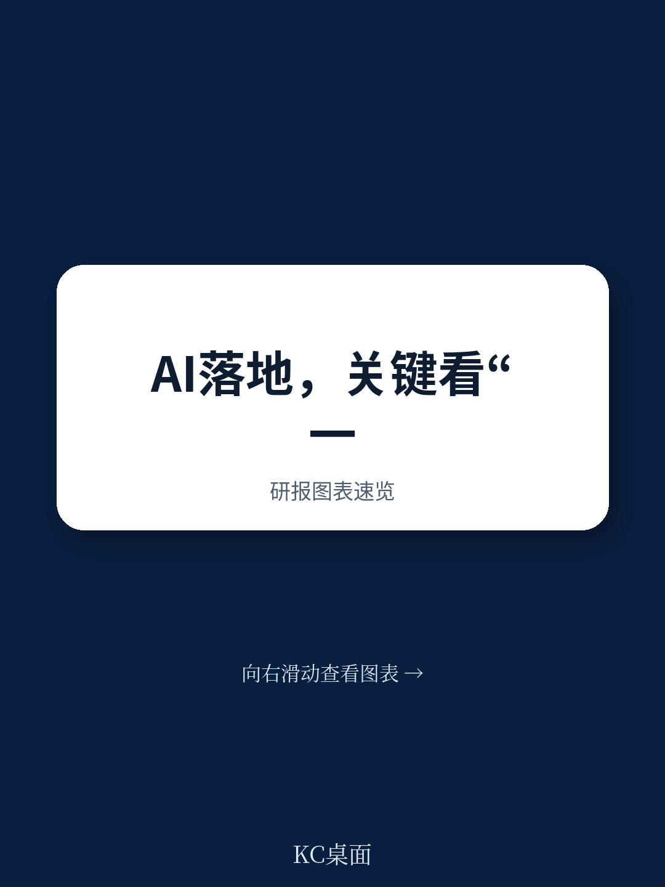

# 麦肯锡：AI不缺技术，缺的是CEO亲自下场

这份2025年3月发布的麦肯锡全球AI调研报告，覆盖1491位来自101个国家的企业管理者，揭示了一个反直觉的核心判断：AI价值落地的最大瓶颈从来不是技术，而是组织治理与流程重构。CEO亲自监督AI治理，是影响企业AI收益的最强单一变量。报告同时指出，超过80%的企业尚未看到AI对整体EBIT的实质性影响——这不是技术问题，是管理问题。

## 1. CEO亲自管AI治理，比任何技术投入都更影响利润

麦肯锡在调研中测试了25项组织属性与AI对EBIT影响的关联度。结果清晰：CEO是否亲自负责AI治理，是企业能否从AI中获取利润的最强预测因子。在年收入超过5亿美元的大型企业中，这一关联度甚至更高。

报告显示，28%的受访者表示其CEO负责AI治理，17%由董事会负责。但多数情况下，AI治理是联合负责——平均两位高管共同承担。这意味着，不少企业仍在将AI治理“外包”给IT或数字化部门，而这恰恰是麦肯锡合伙人Alexander Sukharevsky在评论中明确指出的“失败配方”。

> **KC评论：** 这里的关键不是CEO“挂名”，而是CEO需要真正介入数据治理、风险合规、资源分配等决策。报告没有展开的是：CEO的时间成本极高，如何在不牺牲日常运营的前提下有效监管AI？这需要一套新的治理节奏和汇报机制。完整报告中对25项属性的详细对比表，值得仔细拆解。

## 2. 流程重构比技术部署更值钱，但只有21%的企业做到了

麦肯锡发现，在25项组织属性中，“工作流重新设计”对AI收益的影响最大。然而，仅有21%的受访者表示其企业已对至少部分工作流进行了根本性重构。

这一数字揭示了一个普遍困境：企业倾向于在现有流程上“贴”AI工具，而不是围绕AI能力重新设计流程。例如，将AI生成的营销文案直接融入原有审批流程，而非重新设计一个由AI主导、人工复核的敏捷内容生产闭环。

报告进一步指出，大型企业在流程重构上明显领先于小企业。这并非因为它们有更多技术资源，而是因为它们更愿意投资于组织变革管理——包括建立专门的AI转型办公室、设定清晰的规模化路线图、以及持续追踪KPI。

## 3. AI输出的质量监控正在两极分化：全检或基本不检

报告呈现了一个令人担忧的分化：27%的企业对AI所有输出进行人工审核，而同样约27%的企业只检查20%或更少的AI生成内容。在商业、法律等专业服务行业，全检比例显著更高。

这种分化背后是风险偏好的差异。麦肯锡同时发现，企业正在加速管理更多AI相关风险——与2024年初相比，对不准确性、网络安全和知识产权侵权的主动管理显著增加。大型企业在这方面的投入明显高于小企业，但它们对AI输出的“可解释性”风险并未给予更多关注。

> **KC评论：** 全检模式在低风险场景下可能过度消耗人力，而不检模式在高风险场景下可能引发合规灾难。报告没有完全回答的问题是：什么样的监控密度才是“最优”的？这取决于行业监管环境、AI应用场景的风险等级，以及企业的风险承受能力。完整报告中关于不同行业监控实践的细分数据，能提供更精准的参照系。

## 4. 规模化落地的12项最佳实践，只有不到三分之一的企业在跟进

麦肯锡识别出12项AI采用与规模化最佳实践，每一项都与EBIT提升正相关。其中，“为AI解决方案设定清晰的KPI”对利润影响最大，但仅有不到五分之一的企业在实施。在大企业中，“建立明确的规模化路线图”同样关键。

报告显示，大型企业在几乎所有实践上都领先于小企业——例如，建立专门AI推进团队的比例是小企业的两倍以上，在内部沟通AI价值、建立分层培训体系、以及构建客户信任机制等方面也明显更积极。

但整体来看，进展仍然缓慢。在发达市场的补充调研中，只有1%的企业高管认为自己的AI部署已“成熟”。这印证了麦肯锡合伙人Alex Singla的判断：AI的价值不是来自渐进式改进，而是来自“端到端的全领域转型思维”。

## 5. 报告尚未完全回答的关键问题：AI收益何时能从部门级扩散到企业级

报告最引人注目的数据之一是：在业务单元层面，越来越多的受访者报告AI带来了收入增长和成本下降——在营销、产品开发、服务运营等领域，多数受访者已看到成本削减效果。然而，当问及企业整体EBIT时，超过80%的受访者表示尚未看到实质性影响。

这一“部门热闹、全局冷清”的格局，提出了一个根本性问题：AI的价值究竟能否从局部优化汇聚为系统性竞争力？报告暗示，这可能取决于企业能否从“用例思维”转向“平台思维”——即构建可复用、可扩展的AI基础设施，而非逐个解决孤立的业务问题。

但报告没有给出明确的答案。它指出，AI代理（agentic AI）可能是下一波创新的前沿，但尚未提供足够的数据支撑这一判断。

## 6. 给读者一个观察框架：用四个维度评估企业AI成熟度

基于麦肯锡的发现，我们可以构建一个简化的评估框架，用来判断一家企业是否真正走在AI价值捕获的正确路径上：

**第一，治理维度：AI治理是否由CEO或董事会直接负责？** 如果AI治理被归入IT部门或数字化办公室，大概率意味着企业尚未将其视为战略级议题。

**第二，流程维度：企业是否对核心工作流进行了根本性重构？** 如果只是在现有流程上叠加AI工具，价值将被严重稀释。

**第三，规模化维度：是否建立了清晰的KPI体系和规模化路线图？** 没有KPI的AI项目，本质上仍是实验，而非投资。

**第四，风险维度：对AI输出的监控是否与风险等级匹配？** 过度监控与监控不足同样危险，关键是建立分级管控机制。

这四个维度可以帮助读者快速定位一家企业的AI成熟度，也是判断其是否值得作为投资或合作标的的初步筛选工具。

---

这份麦肯锡报告的核心价值，不在于提供了多少AI技术趋势，而在于它用数据证明了一个朴素的管理真理：技术本身不会创造价值，只有围绕技术重新组织企业，价值才会涌现。CEO亲自下场、流程根本重构、KPI系统追踪——这些看似老生常谈的管理动作，恰恰是AI时代最稀缺的能力。

如果你希望深入理解报告中关于25项组织属性的完整回归分析、12项最佳实践的具体实施路径，以及不同行业、不同规模企业的详细对比数据，欢迎加入我们的社群。每天，我们会通过AI agent结合人工review，生成国际投行和咨询机构的中文摘要与KC评论，每日更新约10-40页，包含最新数据图表合集，既方便喂给AI，也方便人工快速把握市场动态。在社群中，你可以与更多产业决策者一起讨论：AI治理的最佳组织形态是什么？流程重构的ROI如何量化？以及，哪些企业最有可能率先跨越“部门级收益”到“企业级收益”的鸿沟。

Personal reading notes and learning share only. Not investment advice.

