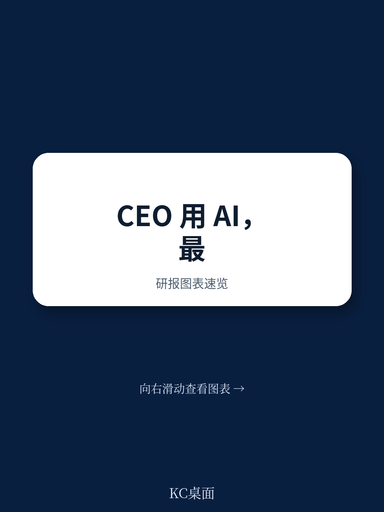
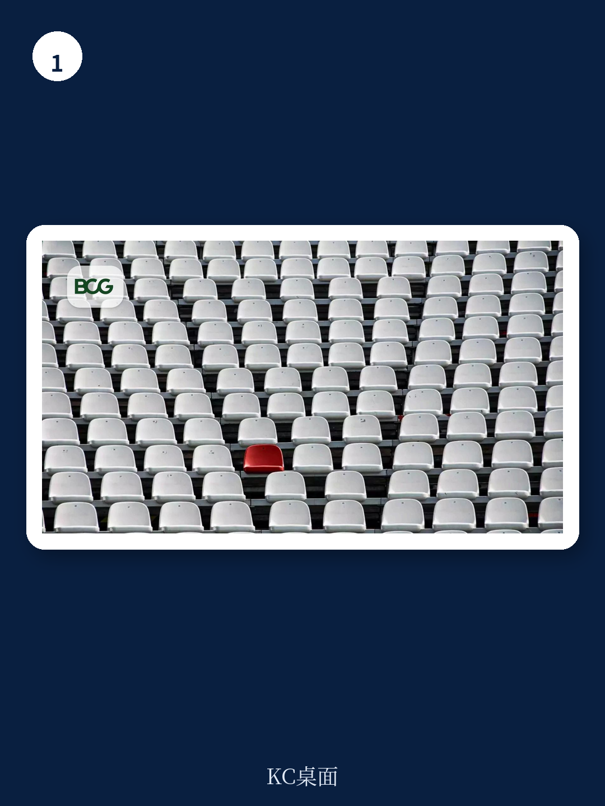

# 波士顿咨询：CEO的AI红利，不在效率，在判断

当一家公司谈论AI转型时，最值得观察的信号不是它的技术路线图，而是CEO本人如何使用AI。

波士顿咨询（BCG）在2026年6月发布的最新报告中，提出了一个被多数企业忽视的判断：AI对企业最高决策层的最大价值，不是节省时间，而是放大CEO及其核心团队的判断力。报告指出，尽管72%的CEO现在直接负责公司的AI决策，但只有15%的人从中获得了有意义的回报。这15%的先行者与落后者的关键区别，不在于他们是否部署了更先进的系统，而在于他们每周至少花8小时亲自使用AI、理解其能力边界，并将其嵌入自己的决策流程。

这个发现颠覆了常见的AI转型叙事。多数企业将AI视为中层和基层的效率工具，用来优化流程、提升生产力。但BCG认为，真正未被开采的金矿在组织顶端——那里做出的决策影响公司未来数年走向，而判断质量的微小提升，都能带来几乎无限的商业价值。

## 1. 先行者CEO已经用AI扮演四种角色，但多数企业仍在观望

BCG通过研究15位高知名度CEO的公开案例，提炼出先行者使用AI的六种常见行为：快速掌握陌生领域知识、预判关键对话、压缩复杂信息、压力测试自身假设、更清晰地表达观点、以及评估自己的时间分配是否匹配战略优先级。

这些行为可以被归纳为四种角色：AI充当“随需导师”，帮助CEO在重大会议前快速建立对新领域的语感；充当“魔鬼代言人”，在决策尚未固化前挑战假设、揭示风险；充当“战略编辑”，将粗糙的想法转化为清晰的沟通；以及充当“反思工具”，通过分析日程和邮件来检验CEO的时间是否真的花在了最重要的事情上。

> **KC评论：** 这些案例听起来像“高级秘书”或“个人助理”的替代品，但重点在于“压力测试”和“反思工具”。当CEO需要下属或董事会提出不同意见时，往往面临人际障碍——没人愿意当面挑战老板。而AI可以毫无负担地扮演这个角色。报告指出，这正是AI在CEO层面最被低估的价值之一：它能够提供人类顾问出于礼貌、偏见或信息距离而不愿提出的风险提示。完整报告中详细拆解了这些案例的具体操作流程，以及先行者CEO如何设计提示词来获得真正有价值的“反对意见”。

但BCG警告，当前多数CEO的AI使用仍然是“即兴的、用胶带拼凑的”，而非系统化的企业级部署。这意味着，先行者与追赶者之间的差距，正在从“是否使用”转向“如何使用”。

## 2. 定制化Agent系统正在成为CEO的“决策前准备室”

报告的核心洞察之一，是AI在CEO层面的应用正从通用工具向定制化Agent系统演进。BCG描绘了一个正在发生的范式转变：传统CEO做出重大战略决策的流程，通常始于一堆零散的预读材料、相互矛盾的备忘录和不一致的假设，随后是漫长的会议，大部分时间花在“对齐信息”上。

定制化AI Agent系统能够从根本上改变这个流程。通过训练在CEO个人的优先事项、决策历史、思维模型和持续变化的战略背景上，这些系统可以在会议开始前完成信息整合、冲突识别、权衡分析和风险预警。CEO走进会议室时，不再是“准备被汇报”，而是“准备做决策”。

> **KC评论：** 这个“决策前准备室”的概念非常关键。它意味着AI的价值不是替代CEO的判断，而是大幅提升判断的质量和速度。BCG举了一个EMESA地区工业公司的案例，该公司正在构建一套定制化Agent系统，旨在为CEO提供实时绩效报告、风险分析、竞争情报和异常预警。当这套系统全面运行时，CEO将拥有组织的“实时脉搏”，能够提前发现潜在危机并将其转化为战略优势。完整报告中包含了这个案例的技术架构细节和初步成效数据，值得关注的是，这种系统如何平衡“信息全面性”与“认知过载”之间的矛盾。

然而，BCG也明确划出了边界：AI可以辅助决策，但不能为决策负责。责任始终在CEO身上。这也引出了下一个关键问题——当CEO越来越依赖AI时，如何避免被误导。

## 3. 四种AI误导风险，CEO及其核心团队必须警惕

BCG用一整节篇幅警告了AI可能误导领导者的四种方式，每一种都直指CEO决策链条上的薄弱环节。

第一种风险是“将流畅等同于专业”。AI能够用自信而流畅的语言解释任何陌生领域，但这不意味着CEO真正掌握了背后的复杂性。一个看似完美的答案可能隐藏着脆弱的假设、缺失的上下文或低置信度的结论。BCG早期关于生成式AI的研究发现，用户往往在AI能力较弱的领域反而更信任它。

第二种风险是“将速度等同于更好的判断”。AI压缩了从提问到回答的时间，但CEO仍然需要时间吸收、质疑和决策。如果速度替代了思考，那么原本帮助CEO摆脱信息过载的工具，反而可能让糟糕的合成结论显得权威。

第三种风险是“让AI窄化对话范围”。相同的工具、相同的数据和相同的提示词，会强化相同的假设。BCG的研究发现，生成式AI的通用化输出会使团队的思维多样性降低41%。这意味着一群聪明人可能更快、更一致地走向一个错误的共识，而人类的不同意见变得更加不可或缺。

第四种风险是“制造认知过载”。AI能够生成更多信息、观点和合成见解，但人的认知容量是有限的。BCG对美国1488名全职工作者的研究发现，14%的AI用户报告了“AI脑疲劳”现象——因过度使用或监督AI而超出认知能力导致的疲惫。

> **KC评论：** 这四种风险中，“思维多样性降低41%”这个数据尤其值得警惕。它揭示了一个反直觉的困境：当所有人都使用相同的AI工具时，组织的集体智慧可能不是提升，而是下降。CEO需要主动设计“异议机制”——比如让另一个模型来批判第一个答案，或者在核心团队中指定一个“挑战者”角色。完整报告对这四种风险都给出了具体的应对框架，但最核心的建议是：CEO不能成为对抗误导性AI的最后一道防线，整个高层团队都需要具备“质疑AI答案”的纪律。

## 4. 报告尚未完全回答的关键问题：CEO的“AI判断力”如何衡量？

BCG在报告中提出了一个极具前瞻性但尚未完全解答的问题：CEO如何知道自己是否因为AI而变得更好了？

在呼叫中心，绩效可以快速量化。但对于CEO而言，一项决策的价值可能需要数月甚至数年才能显现。BCG承认，衡量AI对CEO判断力的影响“并不容易”，但强调建立这种纪律仍然至关重要。

这是报告最引人深思的伏笔之一。如果AI的价值在于放大判断力，但判断力的提升本身难以量化，那么企业如何判断对CEO层AI工具的投资是否有效？如何避免“感觉变好了”但实际决策质量并未提升的陷阱？

报告提出了一个方向性的框架：CEO应该追问AI推荐的质量、推荐所支撑的决策质量，以及决策做出的速度。但具体到如何操作，报告没有给出成熟的答案。这恰恰是当前企业实践中最需要探索的领域——也是加入社群继续讨论的最大动力所在。

## 5. 对产业决策者的观察框架：从三个维度检验CEO的AI成熟度

基于BCG报告的逻辑，我们可以提炼出一个检验CEO AI成熟度的框架，供产业决策者参考：

第一，看CEO的AI使用是否从“效率工具”升级为“判断放大器”。如果CEO只把AI用于摘要邮件、起草文档这类事务性工作，说明AI尚未触及决策核心。真正的信号是CEO是否在用AI挑战自己的假设、测试战略决策、并要求AI揭示“不愉快的事实”。

第二，看组织的“异议机制”是否嵌入AI工作流。一个健康的AI部署应该包含多重校验：是否有另一个模型或另一个人负责批判AI的输出？团队是否习惯于追问“这个回答缺少了什么？”“这个推荐基于哪些假设？”“我们是否太容易相信了？”

第三，看CEO是否在主动构建自己的AI能力。BCG的数据表明，先行者每周至少花8小时亲自使用AI。这不是为了“跟上潮流”，而是为了建立对AI能力边界的直觉，区分真正的潜力与过度的炒作或恐惧。没有这种亲身体验，CEO很难在战略层面做出关于AI投资的正确判断。

---

BCG这篇报告最终指向一个深刻的结论：AI不会保证伟大的领导力，但它可以成为CEO的“正向力量放大器”——前提是CEO以纪律、好奇心和谦逊来使用它。

对于中国企业决策者而言，当前最大的机会窗口可能不是再去拼底层技术投入，而是率先完成“CEO层AI能力的个人转型”。当多数CEO还在把AI当作效率工具时，那些率先将其用于放大判断力的领导者，将获得不对称的竞争优势。

这份报告还包含了许多未完全展开的分析：定制化Agent系统的具体实施路径、不同行业CEO使用AI的差异、以及“AI脑疲劳”的深层机制。这些内容在完整报告中都有更详细的图表和数据支撑。

如果你希望获取BCG这份报告的完整中文解读和原始图表，欢迎加入我们的社群。每天，我们会通过AI agent与人工审核相结合的方式，精选并解读国际顶级投行的最新研报，形成约10至40页的中文摘要与评论合集。这些内容既方便你快速抓取市场动态，也适合直接喂给AI工具进行二次分析。我们会在社群中继续讨论今天留下的未解问题：CEO的AI判断力究竟如何衡量？定制化Agent系统的ROI如何计算？以及，当AI成为CEO的“标配”后，竞争壁垒会转移到哪里？

Personal reading notes and learning share only. Not investment advice.

