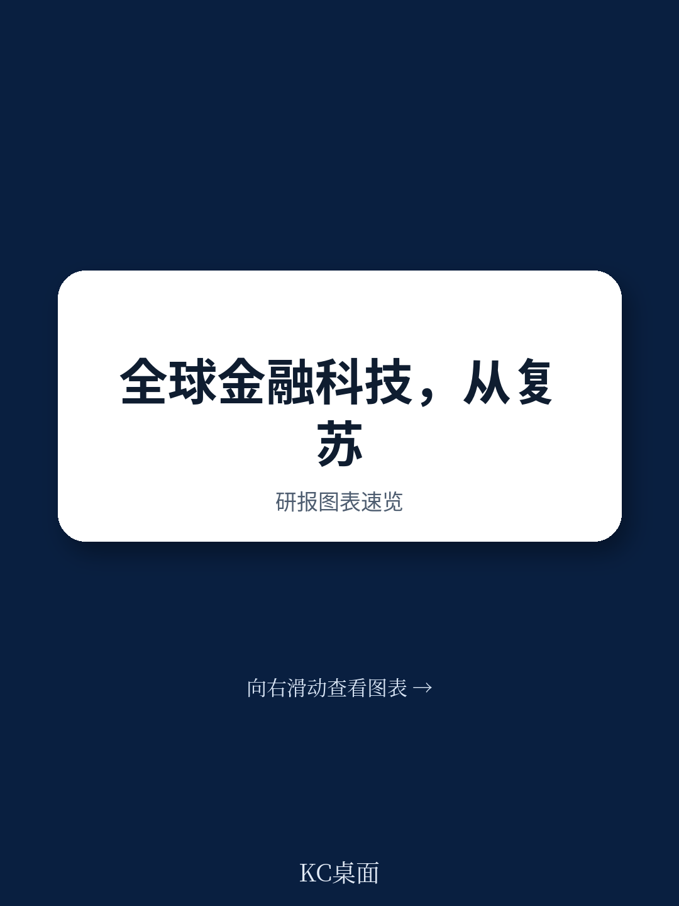
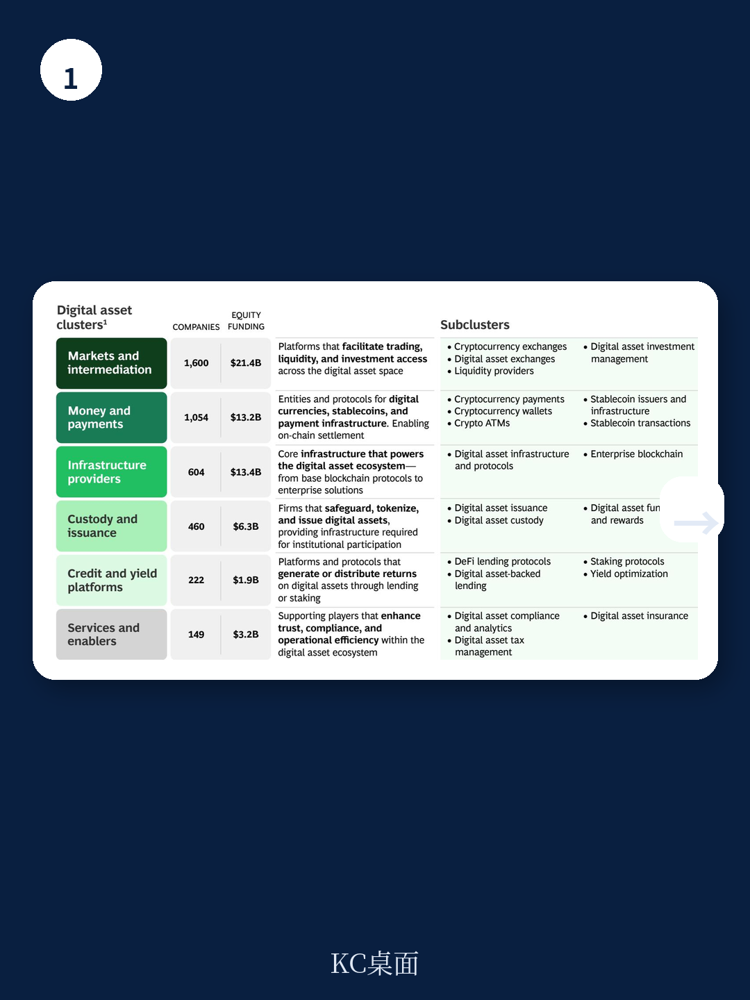
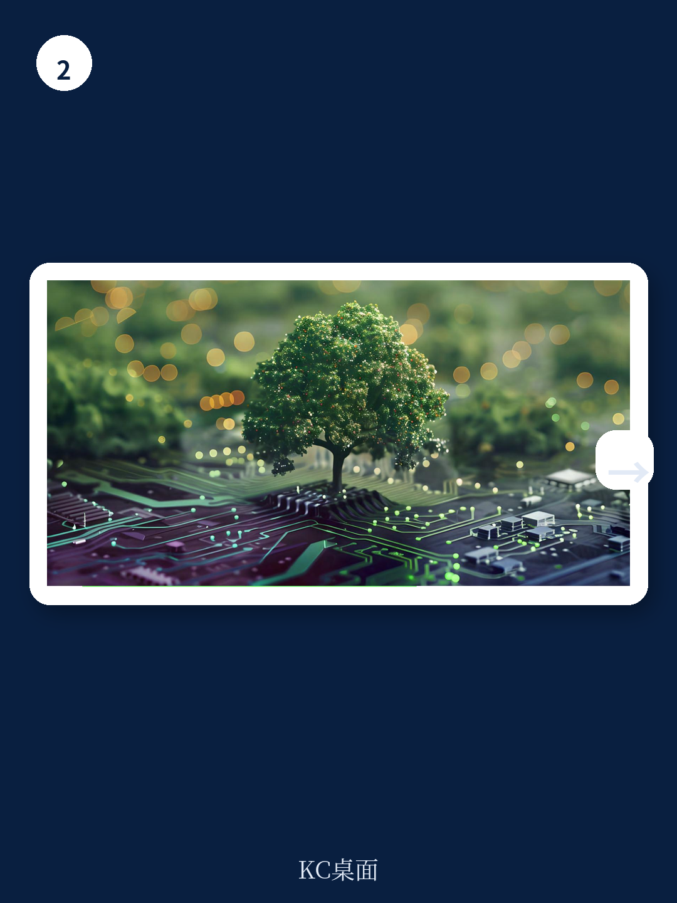

# 波士顿咨询：金融科技重回增长，但赢家的门槛已经变了

金融科技行业在经历2023至2024年的估值修正与资本寒冬后，2025年交出了一份出人意料的成绩单。全球金融科技总收入突破5000亿美元，同比增长22%，增速是传统金融机构的四倍以上。但这份波士顿咨询与FT Partners联合发布的《2026年全球金融科技报告》传递的核心信号，并非简单的“行业复苏”。真正值得关注的判断是：金融科技已经从一个靠烧钱换增长的赛道，进入了一个利润与规模必须同时兑现的新阶段。行业没有回到2021年的狂热，而是进入了一个更成熟、但竞争门槛更高的“选择性繁荣”时期。

这份报告之所以重要，是因为它系统性地回答了三个投资者最关心的问题：增长是否可持续？哪些细分领域真正跑出来了？以及，AI和数字资产到底是泡沫还是下一波基础设施？在行业情绪从悲观转向谨慎乐观的当下，波士顿咨询的判断为决策者提供了一个难得的全局视角。

## 1. 这轮增长的本质是盈利能力的修复，而非估值的泡沫重来

报告中最具说服力的数据，不是总收入的增长，而是运营质量的改善。全球最大的85家上市金融科技公司，2025年平均EBITDA利润率提升了4个百分点，达到20%。更关键的是，74%的公司已经实现盈利，而2024年这一比例是68%。同时，符合“40法则”（收入增速加利润率超过40%）的公司占比也在提高。

这意味着什么？2025年的增长不是靠烧钱买来的，而是靠真实的运营效率提升。资本市场的态度也印证了这一点：虽然股权融资总额回升至580亿美元，同比增长53%，但资金高度集中在后期轮次。2023至2025年间，E轮及以后的融资额增长了超过210%，而种子轮和天使轮则收缩了约10%。投资者不再为故事买单，他们只愿意为已经证明有规模化路径和清晰经济模型的公司加注。

> **KC评论：** 金融科技行业正在经历一个残酷但必要的“优胜劣汰”。2021年那种只要沾上“数字”概念就能拿到大额融资的时代已经彻底结束。今天，投资者要求的是可验证的利润路径，而不是PPT上的TAM（潜在市场规模）。对于产业决策者而言，这意味着并购整合的窗口已经打开——那些仍在亏损但拥有技术或客户基础的尾部公司，正在成为头部玩家低成本获取能力的标的。

## 2. 交易与投资、存款是增速最快的两极，但支付仍是绝对主航道

报告将金融科技收入按垂直领域拆解，揭示了明显的分化。交易与投资板块以38%的同比增速领跑，存款紧随其后，增速达30%。这两个板块的爆发，与2025年全球数字资产市场的回暖密切相关——加密市值重回约3万亿美元，稳定币市值约3000亿美元，代币化现实世界资产也达到约300亿美元。

但报告也提醒，支付依然是金融科技收入的绝对主力。在年收入超过5亿美元的大型金融科技公司中，支付板块的占比遥遥领先。这意味着，虽然新兴赛道在快速增长，但行业的基本盘依然建立在最传统的支付基础设施之上。这背后是一个尚未被充分打开的B2B机会：金融科技目前仅渗透了全球银行与保险收入池的4%，而在B2B垂直领域，渗透率更低。

> **KC评论：** 交易与投资的高增长，很大程度上是数字资产市场情绪修复的映射。但报告也明确指出，目前65%的稳定币持仓仍与加密交易挂钩，数字资产的应用场景依然高度集中。这提示我们，如果剔除交易和投机需求，数字资产在支付、汇款等实体经济场景中的落地，距离规模化还有相当距离。完整报告中对代币化资产和稳定币的深入分析，值得所有关注Web3金融的读者细读。

## 3. AI的落地正在从“可能性”转向“可验证”，但赢家可能不是所有人想象的那样

AI是这份报告中最受关注的主题之一。波士顿咨询的结论是：AI确实在重塑金融服务，但当前的价值兑现集中在运营和工作流密集型领域，而非面向消费者的全自动体验。在承保、反欺诈、反洗钱、KYC、文档提取、客服、软件开发以及合规和财务工作流中，AI已经带来了可测量的效率提升。报告特别提到，使用AI的金融科技公司，开发者生产力提升了5倍。

但报告也提出了一个关键的警示：AI本身不会成为持久的竞争壁垒。巴西金融科技Creditas的创始人Sergio Furio在报告中的评论非常精辟——“长期来看，每个人都能接触到同样的技术，今天的优势明天可能消失。执行速度可能是少数几个真正持久的护城河之一。”这意味着，率先采用AI的公司可能在短期内获得成本或速度优势，但一旦技术普及，竞争将重新回到产品设计、客户信任和监管合规能力上。

这份报告尚未完全回答的一个关键问题是：AI驱动的金融科技公司，是否会像上一代“数字原生”公司一样，在规模扩张后遭遇相似的合规和资本效率瓶颈？AI能否让金融科技在盈利性上真正超越传统银行？这需要更长时间的观察，也是加入社群讨论后可以进一步追踪的话题。

## 4. 区域分化加剧：亚太领跑，但监管环境正在重塑竞争格局

从区域来看，亚太地区以25%的增速成为全球增长最快的金融科技市场，日本和韩国的数字银行与加密交易平台是主要驱动力，东南亚的新加坡和印尼也贡献显著。欧洲以24%的增速紧随其后，受益于监管环境的改善和新型银行向相邻产品与地理区域的扩张。

但报告也指出，区域间的分化不仅取决于需求，更取决于监管。在美国，大型金融科技公司正在积极寻求通过货币监理署获得联邦直接监管，以绕过合作银行的中间成本，实现更快的产品创新。类似趋势在欧洲也已出现。而在中国、印度和海湾部分地区，严格的监管环境仍使金融科技规模化面临更大挑战。

这种监管分化，正在重塑全球金融科技的竞争格局。那些能够在更复杂监管环境中运营的公司，反而可能获得更持久的竞争优势。

## 5. 公共市场仍对金融科技心存疑虑，这是行业最大的未解之谜

尽管金融科技在运营层面表现亮眼，但公共市场尚未给予充分认可。报告披露了一个令人警醒的数据：过去五年全球最大的30家金融科技IPO，其年化股东总回报落后金融服务业整体约24个百分点。这意味着，即便运营指标在改善，公共投资者仍在追问：这些公司的客户集中度、合规成熟度、增长的可持续性，是否真的经得起周期考验？

IPO数量虽然在2025年增长了50%（从28家增至42家），但M&A交易量的增长更为显著——从2023年的1050亿美元飙升至2025年的2510亿美元。这表明，越来越多的金融科技公司选择了被收购而非独立上市。这本身就是市场对行业成熟度的一种投票：在公共市场估值逻辑尚未彻底转变之前，通过并购实现整合和退出，可能是更理性的选择。

> **KC评论：** 金融科技公司IPO后的股价表现落后于传统金融，这其实是一个值得深思的信号。它意味着，市场对“科技+金融”的定价逻辑，可能正在从“科技溢价”向“金融估值”回归。如果这一趋势延续，金融科技公司的估值中枢可能进一步下移，而这将反过来影响一级市场的融资定价。完整报告中对IPO表现和估值倍数的详细拆解，是理解这一趋势的关键。

## 6. 下一步的观察框架：三个维度的竞争分化

基于波士顿咨询的分析，我们可以建立一个观察金融科技行业未来走向的简单框架。第一，看盈利能力的持续性。2025年的利润率改善，有多少是来自一次性成本削减，多少是来自真正的规模效应和运营杠杆？第二，看AI从工作流到运营模式的跃迁。目前AI的价值集中在“做同样的事更快更便宜”，但真正的颠覆可能来自“做完全不同的事”——比如完全自动化的信贷决策或个性化的财富管理。第三，看B2B渗透的加速度。如果金融科技要突破4%的全球收入渗透率天花板，B2B领域是必须攻克的高地，而这需要完全不同的产品能力和销售模式。

这些维度本身都是开放性问题，波士顿咨询的报告提供了扎实的数据和案例分析，但并未给出确定性答案。这恰恰是这份报告的价值所在——它不是一本预言书，而是一张地图。

## 7. 报告尚未完全回答的关键问题：AI的护城河在哪里？数字资产何时走出交易场景？

在阅读完整报告后，有两个问题值得进一步追问。第一，AI带来的效率优势，在技术普及后是否会迅速消失？如果所有金融科技公司都使用同样的底层模型和工具，竞争将重新回到数据规模、风险定价能力和品牌信任上——而这些都是传统银行的传统优势。第二，数字资产的应用，何时能从“交易工具”真正变为“价值存储”或“支付媒介”？65%的稳定币仍用于加密交易，这一比例若不下降，数字资产金融科技的增长将始终与加密市场的周期高度绑定。

这两个问题，也是我们将在社群中持续追踪和讨论的重点。每天，我们的AI agent会结合人工审核，生成国际投行最新研报的中文摘要与深度评论，涵盖当天最新数据图表合集，既方便喂给AI模型，也方便人类读者快速把握市场动态。

Personal reading notes and learning share only. Not investment advice.

