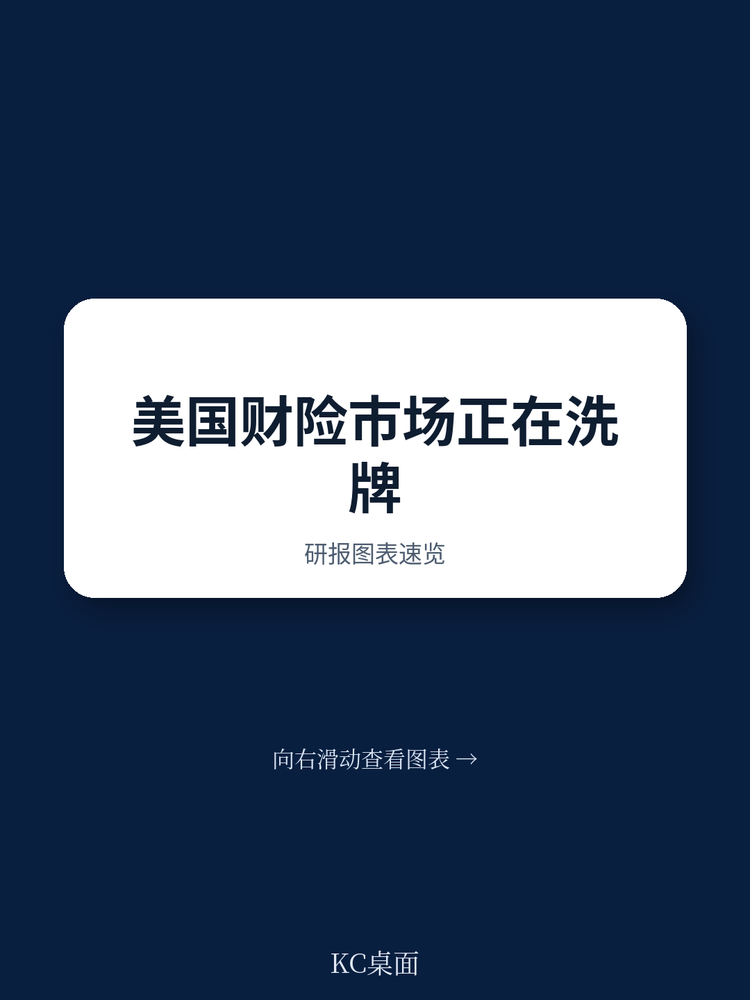
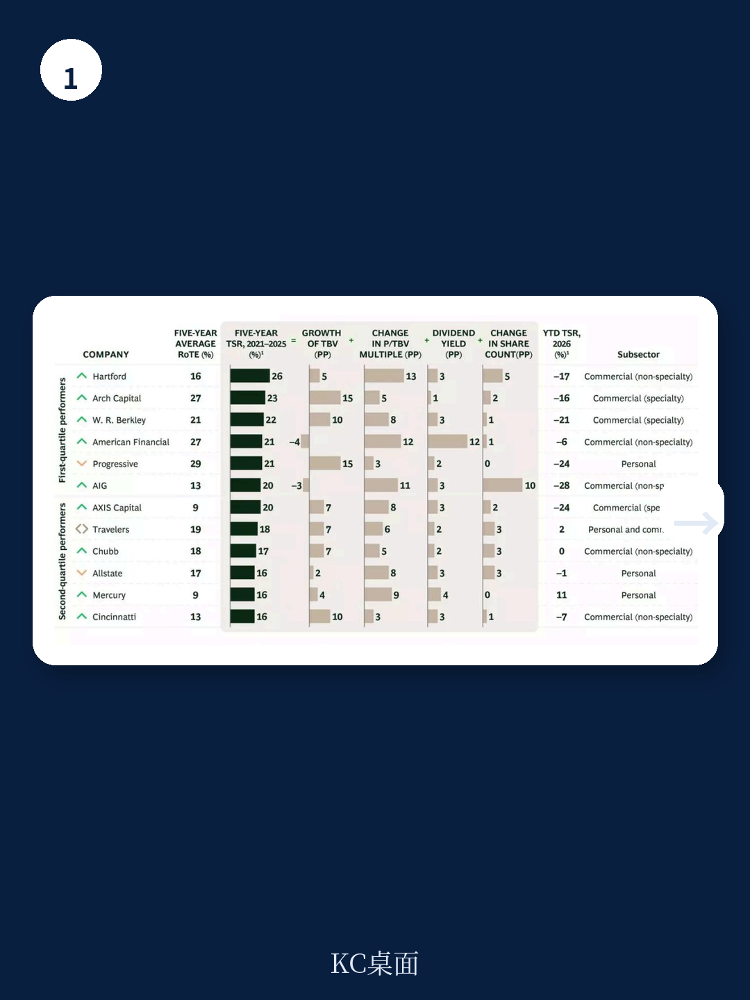
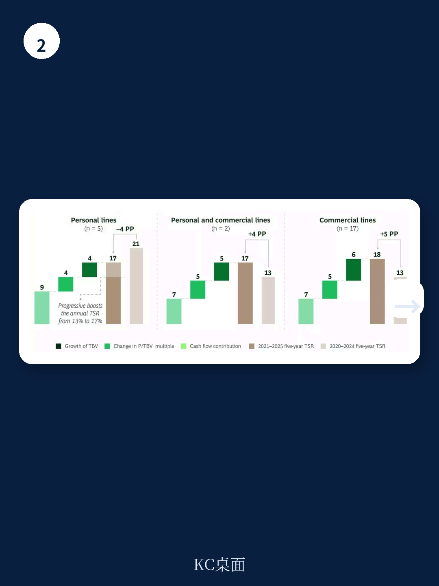

# 波士顿咨询：美国P&C保险的“好日子”结束了，但赢家还没定

美国财产与意外险（P&C）市场正在经历一个关键的转折点。波士顿咨询（BCG）在最新发布的《2026保险价值创造者报告》中给出一个核心判断：支撑过去几年行业高回报的“硬市场”红利正在消退，费率走软与结构性风险上升正在重塑竞争格局。这不是一次周期性的小波动，而是一次市场底层逻辑的切换。

报告显示，2021至2025年间，美国P&C保险公司实现了约18%的年化总股东回报率（TSR），跑赢全球保险业平均水平的15%，也跑赢了大多数其他行业。但进入2025年，这一势头明显放缓。更值得关注的是，行业内头部与尾部公司的差距正在拉大，这种分化在历史上往往预示着一次市场洗牌的开始。

对于产业决策者和投资者而言，当下最需要回答的问题不是“市场会怎么走”，而是“在费率走软、风险复杂化的新环境下，什么样的公司能持续创造价值”。BCG的报告给出了一个清晰的答案框架，但其中的细节和隐含判断，值得逐层拆解。

> **KC评论：** 波士顿咨询这份报告的价值不在于告诉你市场在变——这已经是共识。它的真正贡献在于，用五年期的TSR数据和承保利润率拆解，量化了“赢家”和“输家”之间的差距究竟来自哪里。读完你会发现，承保能力才是唯一的护城河，投资收入只是止痛药。

## 1. 承保利润是分水岭，投资收益只是止痛药

BCG报告中最具冲击力的图表之一，是不同分位保险公司对有形股本回报率（RoTE）的贡献拆解。在2021至2025年间，前四分之一的P&C公司，其承保业务对RoTE的贡献约为11个百分点；而尾部公司的承保贡献为负值。

这意味着什么？在硬市场周期中，行业整体看起来都在赚钱，但利润来源完全不同。头部公司靠的是承保纪律——更低的综合成本率、更精准的风险定价；而尾部公司很大程度上依赖投资收益来掩盖承保端的亏损。

报告特别指出，2024至2025年间高企的净投资收益部分掩盖了弱势公司的承保恶化。随着利率正常化、投资收入回落，承保质量将成为区分盈利能力的唯一标尺。那些在硬市场期间投资于定价精细化和风险分层的公司，在费率走软的环境中更有能力捍卫利润率。

这是一个残酷的筛选机制：当潮水退去，裸泳者将无所遁形。对于投资者而言，判断一家P&C公司的未来表现，不应看其当期利润，而应穿透利润结构，看其承保端是否真正具备定价权和风控能力。

## 2. 车险市场从“防守”转向“进攻”，但并非所有人都有资格

美国个人车险市场是这份报告中最生动的案例。2022年，行业综合成本率飙升至112%；到2025年，这一数字已改善至92%——这是自2020年以来的最佳表现，也是2004年以来首次低于95%的年份。修复速度之快，令人侧目。

但修复的成果分配极不均衡。报告点名了Progressive：这家公司率先、也最果断地重新定价其保单组合，2025年个人车险综合成本率降至约88%，并实现了显著的保费增长，目前已成为美国个人车险市场的第一名。而其他公司则经历了更长时间的修复期——放弃保单、恢复利润率——之后才将综合成本率降至90%出头。

现在，随着盈利能力基本恢复，竞争态势正在转变。保险公司正从“防守”转向“进攻”，重新进入此前退出的州和细分市场，重新启动增长杠杆，并更积极地竞争新业务。但BCG同时提醒，这种转变伴随着几个风险：索赔频率正从疫情低点回升，损失严重程度因车辆复杂性、维修成本和医疗费用通胀而持续上升；行业精算师估计的年损失成本增长率为6%至8%，在一些州已超过费率上涨速度；大型互助保险公司的竞争压力依然显著。

> **KC评论：** Progressive的案例说明一个道理：在周期转换中，先动手、下重手的公司能获得结构性的市场地位提升。那些“等等看”的公司，即使最终也修复了利润率，却失去了市场份额。这份报告里的Progressive数据曲线和图表演示了“先发优势”在保险业中的具体形态，完整报告里有更详细的各公司对比图表。

对于车险市场的下一步，关键在于：当所有人都开始争夺新业务时，定价纪律能否维持？历史经验表明，软市场中最大的风险不是费率下降本身，而是保险公司为了抢份额而放松承保标准。那些在修复期建立了数据驱动定价能力的公司，将更有底气在竞争中保持理性。

## 3. 房屋险成了“战略重镇”，但2025年的好业绩是假象

如果说车险市场是周期性的修复，那么房屋险市场则透露出更深层的结构性变化。2025年，美国房屋险市场交出了一份令人瞩目的成绩单：综合成本率88%，是2006年以来的最佳表现。但BCG明确指出，这一结果反映的是“有利因素的巧合，而非结构性重置”。

推动这一结果的关键因素是大飓风未登陆美国本土。即便2025年仍有帕利塞兹和伊顿山火等重大灾害，以及持续的对流风暴（SCS）损失，但缺少一次飓风登陆足以让行业整体数据看起来光鲜。报告警告，随着费率充分性在各州恢复，费率上涨动能将减速；损失成本通胀仍然活跃；山火和其他非模型化灾害预计将继续对损失率施压。

真正值得关注的是SCS风险的变化。根据Verisk和慕尼黑再保险的数据，2023、2024、2025年每年由SCS事件导致的保险损失均超过500亿美元，而此前十年的年均水平约为300亿美元。这些损失在地理上是分散的，使得投资组合管理和再保险结构比传统的沿海飓风损失管理更为复杂。

这意味着，房屋险市场的未来将出现明显的分化：拥有卓越巨灾模型、严格的敞口管理和充足定价能力的保险公司将获得强劲回报，而其他公司的业绩将被未来的自然灾害事件侵蚀。规模正在成为护城河——前五大个人险公司的市场份额优势持续扩大，而小型公司在理赔处理、分销和技术上的固定成本劣势日益凸显。

## 4. 社会通胀是“房间里的大象”，但多数公司还没真正面对

BCG报告中着墨最多、也最令人不安的一个结构性风险，是社会通胀（social inflation）对长尾责任险的影响。这可能是美国P&C行业当前最大的未解问题。

数据令人震惊。根据Marathon Strategies的统计，2024年全美共发生135起“核裁决”（即赔偿金额超过1000万美元的判决），是自2009年该机构开始追踪以来的最高值，且自2020年以来持续增长。瑞士再保险研究所估计，第三方诉讼融资市场（对冲基金、家族办公室等投资者为原告支付法律费用以换取赔偿分成）已增长至约150亿至180亿美元。

这些动态推高了损失成本、延长了和解时间线，并给准备金充足性带来了不确定性。瑞士再保险的数据显示，2015至2024年间，美国保险公司在商业责任险（不含医疗职业责任险）上经历了总计620亿美元的不利准备金发展。这与美国P&C市场整体连续19年的有利准备金积累形成了鲜明对比。

> **KC评论：** 620亿美元的不利发展是一个惊人的数字。它意味着，对于商业责任险，过去十年行业一直在“错判”风险——不是一次两次，而是系统性的低估。报告中有一张关于核裁决趋势的图表，展示了自2019年以来的急剧攀升曲线，这是完整报告中最值得仔细研究的数据之一。

对于保险公司而言，这意味着几个必须面对的问题：持有大量商业责任险和车险敞口的公司面临潜在的不利发展；分析师和评级机构正在加大对准备金充足性的审查力度；领先的保险公司正在将承保能力转向短尾敞口和超额与剩余市场（E&S），后者提供更灵活的保单条款和定价。即使财产险费率走软，责任险定价预计仍将保持坚挺，这将在商业险组合中创造一个二元化的费率环境。

## 5. AI正从实验走向竞争优势，但新风险也在同时诞生

BCG报告将AI定位为P&C行业的“新风险类别”，这一视角颇具前瞻性。报告指出，保险公司正在对AI系统采用“一揽子排除条款”，但创新保单的设计明显滞后。核心问题在于缺乏精算数据——AI技术太新，公司没有损失历史，而精算数据的形成需要五到七年，但新AI模型几个月就会上市。

报告以网络保险市场的发展路径作为参照：从早期的临时限额保单演变为全面的第一方和第三方保障。先行投资于损失数据和早期产品开发的保险公司将领导一个不断扩大的市场，而依赖排除条款的公司则可能将市场拱手让人。

同时，AI本身也在成为竞争优势的来源。领先的保险公司正在承保、理赔和定价工作流程中大规模部署AI，既获得运营效率，也获取更精细的风险洞察，这些洞察正在转化为可量化的竞争优势。BCG认为，最好的承保组织正在将深厚的领域专长与AI工具、实时数据和严格的投资组合管理流程相结合——这与十年前的模式截然不同。

## 6. 报告没有完全回答的三个关键问题

尽管BCG报告提供了丰富的分析和判断，但仍有几个关键问题留待进一步探讨。

第一，社会通胀的演变轨迹。报告用数据展示了核裁决的增长趋势和第三方诉讼融资的规模，但没有深入分析这一趋势是否会因监管或司法改革而逆转。如果美国部分州出台侵权法改革，或者联邦层面加强对第三方诉讼融资的监管，这一风险的演变路径将完全不同。但报告对此着墨不多。

第二，再保险市场的结构性变化。报告提到再保险定价在2025年续转时有所松动（主要保险公司报告约15%至20%的降幅），但条款和条件仍比2022年前更为严格。再保险成本的变化将如何传导至保险公司的定价能力和利润率？报告没有展开量化分析。

第三，AI保险产品的具体发展路径。报告提出网络保险的演进路径可以作为参考，但AI风险的性质与网络风险有本质区别——AI系统的故障可能同时触发责任险、财产险和营业中断险的多个条款。新的保险产品结构如何设计、定价模型如何建立，这些问题仍处于非常早期的探索阶段。

## 7. 在分化加剧的市场中，投资者应该关注什么

BCG报告给出的结论是清晰且一贯的：做好基本功的公司——严格的承保纪律、审慎的资本配置、持续的能力投资——在任何市场周期中都能跑赢。但新的挑战在于执行这些基本功所需的复杂程度已经大幅提升。

对于产业决策者和投资者而言，以下几个观察框架可能比追逐短期费率走势更有价值：

第一，穿透利润看结构。一家P&C公司的利润中，承保利润和投资收益各占多少？承保利润是否来自稳定的定价优势和风险分层能力，还是来自周期性的费率上涨？在费率走软的环境下，后者的可持续性存疑。

第二，关注准备金质量。社会通胀对长尾责任险的影响仍在发酵，持有大量商业责任险敞口的公司面临潜在的不利发展。评级机构和分析师对准备金的审查正在加强，这可能成为区分公司质量的重要维度。

第三，评估科技投入的真实回报。AI和数据分析能力正在成为新的竞争壁垒，但投入是否真正转化为承保决策的改善和运营效率的提升，需要持续跟踪。那些只是“为了AI而AI”的公司，可能无法获得真正的竞争优势。

第四，观察并购信号。BCG报告指出，随着行业盈余处于历史高位，并购的战略理由正在增强。规模经济、能力获取和跨境活动都可能推动新一轮整合。那些拥有独特数据资产、管理总代理平台或前沿技术的目标公司，可能获得估值溢价。

波士顿咨询的这份报告没有给出简单的“买入”或“卖出”信号，但它提供了一个清晰的判断框架：在周期转换的节点，真正能持续创造价值的公司，是那些在承保纪律、风险管理和技术能力上同时做到领先的公司。其他公司——无论它们过去几年赚了多少——都可能在这一轮洗牌中被拉开距离。

对于希望深入了解这份报告完整数据的读者，我们准备了包含原始图表、细分公司对比和更多行业数据的解读版本。这些内容将帮助你在当前市场环境下做出更精准的判断。

Personal reading notes and learning share only. Not investment advice.

