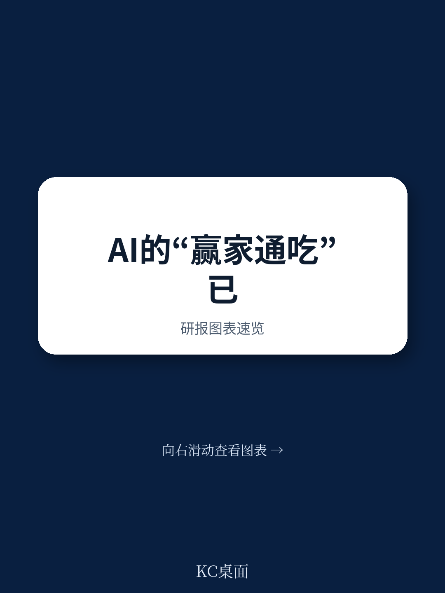
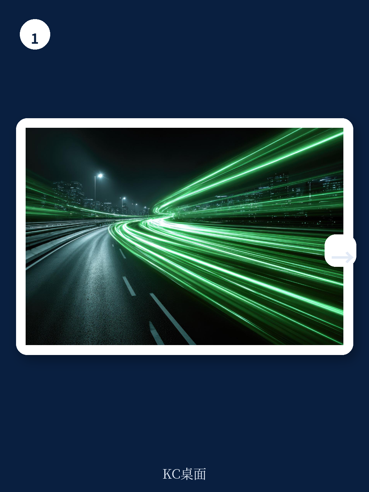
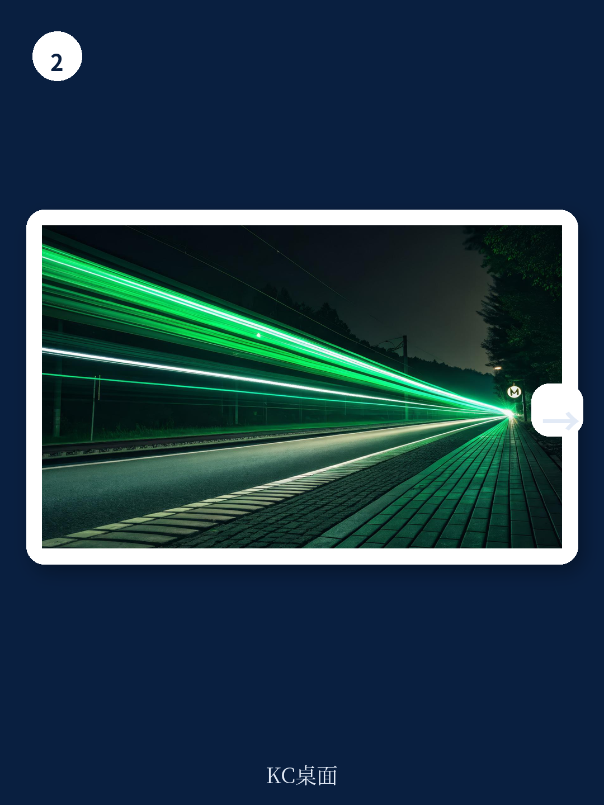

# 波士顿咨询：95%的公司正在错过AI真正的价值拐点

一份覆盖全球1,250家企业的实证研究给出了一个令人不安的判断：只有5%的公司真正从AI中获得了可量化的商业价值。这5%的企业——波士顿咨询称之为“未来型公司”——不仅跑赢了同行，而且正在加速拉开差距。它们的收入增速是落后者的1.7倍，三年股东总回报是后者的3.6倍，投入资本回报率高出2.7倍。

这份报告的核心洞察并不在于“AI有用”，而在于“AI的价值分配已经出现结构性断裂”。60%的企业虽然持续投入，但几乎没有获得任何实质性回报。真正的问题不是技术不够好，而是大多数公司用错了策略框架——它们在做自动化，而领先者在做再造。

这个差距不是暂时的。它正在自我强化。

## 1. 5%的公司正在构筑一条AI价值护城河，而60%的公司正在被反向锁定

波士顿咨询的研究将企业按AI成熟度分为四类：未来型（5%）、规模化中（35%）、新兴型（46%）和停滞型（14%）。后三类合计95%的企业，构成了“追赶者”阵营。

最关键的数字不是5%这个比例，而是这些未来型公司正在创造一种“复合效应”。它们将AI产生的利润重新投入技术基础设施和人才，形成正向循环。2025年，这些公司计划将IT预算中高达64%的份额投入AI，而追赶者这一比例不足其一半。结果是，未来型公司预期在AI应用领域实现双倍于追赶者的收入增长，成本降幅也高出1.4倍。

对于那60%几乎没有回报的公司来说，问题出在顶层。波士顿咨询指出，这些公司的管理层往往“口头上重视AI，但没有明确的量化目标，也没有定期追踪进度的机制”。他们将AI决策下放到中层或基层，导致资源分散在数十个孤立的试点项目中，无法形成规模价值。

> **KC评论：** 这份报告揭示了一个被低估的风险——AI投资正在变成一种“富者愈富”的游戏。未来型公司每赚1块钱的AI回报，就会再投1.26元去巩固优势。而落后者的困境在于：它们越不投入，就越看不到效果；越看不到效果，就越难说服管理层继续投入。这不是技术问题，是战略节奏问题。报告中对不同区域和行业的成熟度对比，以及具体的投资回报率数据，是理解这个循环的关键——完整版有更详细的行业拆解和区域差异图表。

## 2. AI价值高度集中在核心业务职能，但IT的占比正在意外跃升

报告给出了一个清晰的职能价值分布：70%的AI价值潜力集中在销售与营销、制造、供应链、定价等核心业务职能。研发与创新单独贡献了15%。这一趋势与2024年的发现一致。

但有一个意外的变化：IT职能的AI价值占比从2024年的7%跃升至2025年的13%，增加了6个百分点。波士顿咨询的解释是，随着AI从预测性向生成式和代理式演进，IT部门正在从“支持角色”转变为“价值创造中心”。尤其是代理式AI的部署，对数据基础、系统架构和治理能力提出了更高要求，这些恰恰是IT的核心能力域。

在具体工作流层面，报告给出了可量化的案例：能源公司通过AI驱动的预测性维护，在全面部署后可避免30%的可控成本；一家全球美妆公司通过引入AI虚拟美容顾问，预期在12个月内获得1亿美元的增量收入，ROI是传统电商路径的两倍。

这些数字表明，AI价值不是均匀分布的，而是集中在少数几个经过精心选择的工作流中。未来型公司的做法是“端到端重塑”而非“点状优化”。

## 3. 代理式AI正在成为加速差距扩大的核心变量，但部署顺序决定成败

报告中最具前瞻性的部分是关于代理式AI的分析。这类AI结合了预测性和生成式能力，能够自主推理、学习和执行任务。2024年几乎无人提及的代理式AI，在2025年已占AI总价值的17%，预计到2028年将升至29%。

但波士顿咨询给出了一个重要的警示：代理式AI不是AI部署的起点，而是进阶阶段。其前提条件包括强大的数据基础、已规模化的AI能力、清晰的治理框架。最成功的案例是将代理嵌入整个工作流，而不是作为孤立的试点运行。

一家全球电子设备制造商的实践提供了参照：该公司建立了一个“代理中心”，集中治理、扩展和监控AI用例，覆盖超过200家工厂。通过使用可复用的核心代理，该公司在缺陷诊断等复杂运营工作流中实现了80%的自动化率。

> **KC评论：** 代理式AI是2025年最被高估也最被低估的概念。被高估是因为很多公司以为买几个Agent工具就能解决问题；被低估是因为它真正需要的是组织流程的重新设计。报告中没有完全展开的一个问题是：代理式AI的“治理成本”和“协调成本”如何量化？一家公司需要多少代理，代理之间的冲突如何裁决，失败责任如何归属——这些是完整报告里值得细看的附录内容。

## 4. 未来型公司的五步策略并不神秘，但执行门槛极高

波士顿咨询明确指出，未来型公司的策略是可复制的，不是黑箱。它们遵循五个相互关联的策略：设定多年度战略AI愿景、重塑并创造端到端影响、采用AI优先的运营模式、保障并赋能必要人才、使用适配的技术与数据架构。

听起来不复杂。但问题出在“同时做到”。报告的数据显示，追赶者中最常见的失败模式是：管理层有愿景但没有量化目标，IT部门有工具但没有业务部门的协同，员工有AI工具但没有足够的培训。超过50%的未来型公司计划在未来一年内对内部员工进行大规模技能提升，而落后行业的这一比例不到15%。

区域差异也值得关注。亚太地区的公司在IT预算中分配给AI的比例最高（5.2%），并预期到2028年实现10%的收入增长和12%的成本降低，均高于北美和欧洲。但在代理式AI的采用率上，北美领先（51%），亚太次之（45%），欧洲落后（41%）。这暗示了一个有趣的动态：亚太在“投入意愿”上更激进，但在“先进工具采用”上仍有差距。

## 5. 报告没有完全回答的一个关键问题：追赶者是否有足够的时间窗口

波士顿咨询的基调是乐观的——它认为未来型公司的策略是“清晰的路线图，可供其他95%的公司使用”。但报告中的数据也暗示了一个更严峻的可能性：差距扩大的速度可能快于追赶者的学习速度。

未来型公司已经在2021年就将预测性AI纳入CEO议程，而追赶者中仍有约三分之一承认“没有任何进展”。当领先者已经开始部署代理式AI、构建可复用代理库时，追赶者还在为数据基础架构和治理框架挣扎。波士顿咨询自己承认，AI变革的速度“远超此前的数字颠覆浪潮”。

这引出了一个报告尚未深入展开的问题：追赶者是否还有足够的时间窗口？如果领先者的复合效应继续加速，追赶者的“学习曲线”能否跑赢领先者的“经验曲线”？对于不同行业而言，这个窗口期可能差异巨大——软件和电信行业已经领先，而化工、奢侈品和房地产行业仍处于低成熟度阶段。

> **KC评论：** 报告给了追赶者一个“路线图”，但没有给出“时间表”。这是读者最需要自己判断的部分。你的公司所在的行业，AI成熟度处于什么位置？领先者已经跑了多远？你的竞争对手在哪个象限？这些判断需要更细粒度的行业对标数据——完整报告中的附录提供了按行业和区域的AI成熟度指数，以及41个维度的评估框架，可以用来做自评。

---

这份波士顿咨询的报告提供了2025年关于AI商业价值最系统的实证研究。它的核心价值不在于“AI很重要”这个结论，而在于给出了一个可量化的差距分析框架，以及一套可执行的行动指南。

但正如报告自己承认的，差距正在扩大，而且速度很快。对于95%的公司来说，真正的挑战不是“要不要做AI”，而是“在资源有限的情况下，如何选择正确的少数工作流，用端到端重塑而非点状优化的方式，在窗口期关闭之前完成转型”。

如果你正在评估自己公司的AI策略，或者想看到报告中没有完全展开的行业成熟度对比、代理式AI的治理框架细节、以及41个维度评估工具的具体应用方式，欢迎加入我们的社群。我们会每天由AI agent加人工review，生成国际投行和咨询机构的中文摘要与KC评论，daily更新，约10-40页，也包含当天最新的数据图表合集——既方便喂给AI，也方便人工快速把握market dynamics。完整版报告解读和原始图表已同步上传。

Personal reading notes and learning share only. Not investment advice.

