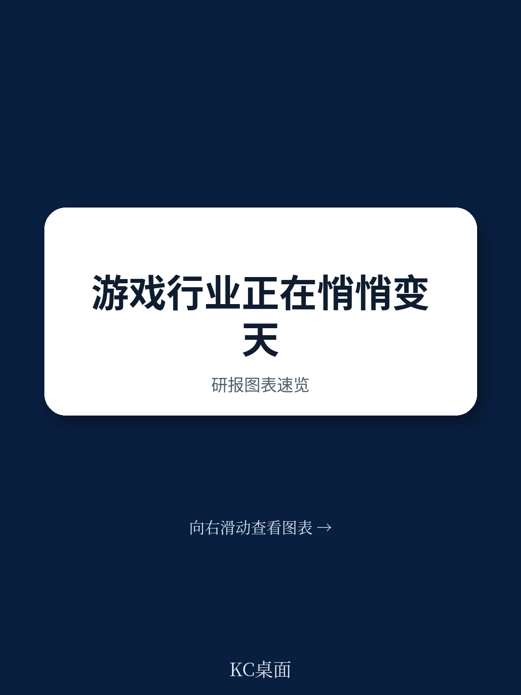
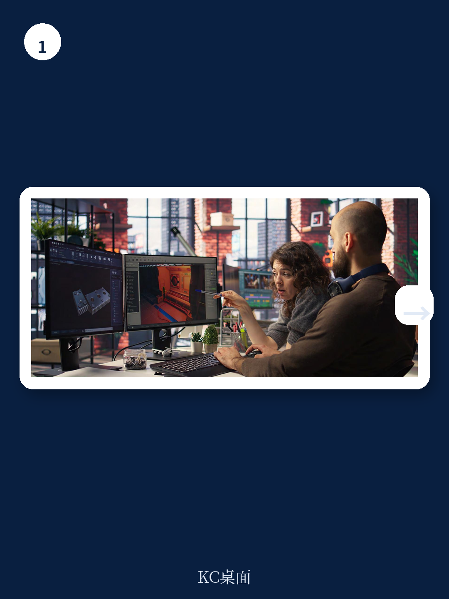
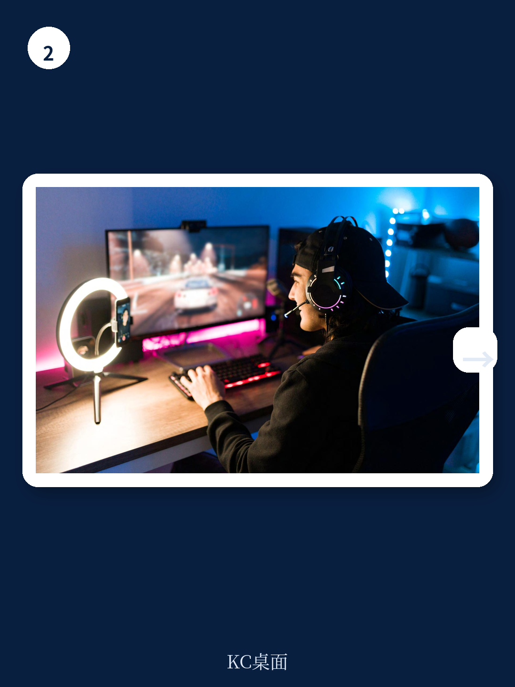

# 波士顿咨询：游戏行业的下一个增长引擎不是硬件，是平台碰撞

游戏行业正在走出“三年寒冬”。这不是一个模糊的乐观预期，而是波士顿咨询（BCG）在最新发布的《Video Gaming Report 2026》中给出的明确判断。这份基于近3000名全球玩家调研和行业深度分析的报告，核心结论只有一个：游戏行业的下一轮增长，不会来自新一代主机或更快的芯片，而是来自四大趋势的“碰撞”——生成式AI、用户生成内容（UGC）、云游戏和开放应用商店。当这些趋势同时发生，传统的“主机战争”将让位于“生态战争”，而赢家将是那些重新定义分发、发现和变现逻辑的公司。

报告预测，全球游戏收入将从2025年的约2600亿美元增长至2030年的约3300亿美元，复合年增长率约为5%。这个数字远低于2010年代行业规模翻倍的速度，但BCG认为，这是更健康、更可持续的增长模式。更重要的是，增长的结构正在发生根本性变化：云游戏收入将从2025年的约15亿美元飙升至2030年的约300亿美元，UGC创作者经济仅Fortnite和Roblox两个平台在2025年的分成就将超过15亿美元，而应用商店的开放将重塑移动游戏50%全球收入的分发逻辑。

以下是这份报告最值得关注的五个核心判断。

## 1. 云游戏终于不再是一个概念，2025年是进入主流的分水岭

过去十年，云游戏一直被贴上“未来技术”的标签，但BCG的调研数据表明，这个未来已经到来。全球范围内，60%的玩家尝试过云游戏，其中80%给出了正面体验反馈。这个数字远超行业预期。

更关键的是，云游戏正在改变“平台”的定义。传统的主机战争——PlayStation vs Xbox vs Nintendo——本质上是对客厅硬件的争夺。但云游戏让硬件变得无关紧要。玩家可以在手机、平板、PC、智能电视甚至汽车屏幕上无缝游玩3A大作。BCG报告明确写道：“主机战争将变得越来越无关紧要，竞争正在转向由全屏云游戏技术支撑的生态系统。”

这意味着什么？对于硬件厂商，未来五年的投资逻辑必须从“卖更多主机”转向“运营更好的云平台”。对于游戏开发者，不再需要为不同平台做大量适配工作，分发成本将大幅下降。对于投资者，那些在云基础设施、流媒体技术和跨平台中间件上布局的公司，将获得超越行业平均的回报。

> **KC评论：** 云游戏的普及速度比大多数人想象的要快。80%的正面体验率说明技术瓶颈正在被突破。但报告没有完全展开的是：云游戏的商业模型仍然不清晰——是订阅制、按小时计费还是广告支持？这个问题将直接影响平台方的利润率和竞争格局。完整报告中有详细的云游戏收入分拆和三种商业模型对比，值得细读。

## 2. UGC正在从“儿童玩具”变成全年龄段的增长引擎

UGC（用户生成内容）在过去几年被很多人视为“小孩子玩的东西”——Minecraft和Roblox的典型用户是8-12岁的儿童。但BCG的调研揭示了一个更重要的趋势：UGC正在渗透到所有年龄段。

报告数据显示，40%的玩家表示他们消费的UGC内容比一年前更多。更重要的是，UGC正在成为新一代玩家的“第一入口”。大约44%的玩家父母表示，他们的孩子在5岁之前就开始玩电子游戏，而孩子玩的最多的前三款游戏中，有两款是UGC游戏：Minecraft和Roblox。

这意味着UGC不仅是内容形式，更是一种用户获取渠道。当新一代玩家从小就在UGC生态中长大，他们对“什么是游戏”的定义将与上一代完全不同。他们不关心画质有多好、剧情有多复杂，他们关心的是能否创造、能否分享、能否与朋友一起玩。

> **KC评论：** 这是一个代际转换的信号。如果UGC成为主流游戏体验，那么传统的“卖拷贝”模式将面临根本性挑战。未来的游戏公司可能更像内容平台——核心能力不是开发，而是运营创作者生态和分发网络。报告中有关于Fortnite和Roblox创作者经济的具体数字，以及UGC如何影响游戏设计原则的分析，这些细节在完整报告中才有。

## 3. 应用商店的开放是一场“地震”，但震中在移动端，余波会波及整个行业

欧盟的《数字市场法案》正在改变游戏规则。苹果和谷歌被迫开放其应用商店，允许第三方支付和侧载。BCG报告将此描述为“移动游戏的地震”。

移动游戏占全球游戏收入的50%以上，而应用商店抽成（通常30%）一直是开发者最大的成本之一。开放意味着开发者可以绕开高额抽成，直接与用户建立支付关系。BCG估算，仅此一项就可能为开发者节省数十亿美元的成本。

但影响远不止于成本。开放应用商店意味着开发者可以控制自己的分发渠道，不再完全依赖苹果和谷歌的推荐算法。这将催生新的分发模式和用户获取策略。对于小型独立开发者，这是前所未有的机遇；对于大型发行商，这意味着需要重新思考市场推广预算的分配。

报告同时也指出，这种开放不会一蹴而就。监管的推进速度、用户支付习惯的改变、以及平台方的反制措施，都将影响最终格局。但方向是确定的：应用商店的围墙花园正在倒塌。

## 4. AI不是成本削减工具，而是内容爆炸的导火索

BCG报告对AI的讨论非常务实。它没有陷入“AI是否取代人类开发者”的争论，而是聚焦于一个更关键的问题：AI将如何改变游戏市场的供给结构。

报告引用Steam数据，截至2025年中期，约20%的新游戏披露使用了AI，这个比例是一年前的两倍。BCG估计约50%的工作室已经在使用AI工具。更值得关注的是，AI-native工作室正在崛起——例如BitMagic和Series Entertainment，它们声称可以加速游戏开发90%。

但BCG同时发出了一个重要的警告：AI会催生大量低质量内容，报告称之为“gameslop”。当AI可以快速生成大量平庸游戏时，发现和策展将成为平台的核心竞争力。玩家不会缺少游戏，但会缺少值得花时间的游戏。

这意味着什么？对于大型发行商，品牌和IP的价值将进一步提升。在一个内容泛滥的市场，只有真正高品质或具有独特情感连接的游戏才能脱颖而出。对于平台方，算法推荐和社区运营将成为比游戏数量更重要的竞争壁垒。

## 5. 报告没有完全回答的关键问题：AAA模式还能撑多久？

BCG报告在多个地方暗示了AAA游戏商业模式的压力，但并未给出明确的结论。AAA游戏开发成本已高达3亿美元，开发周期长达5-7年，但市场反馈却越来越不可预测。与此同时，UGC游戏和AI生成内容正在以更低的成本、更快的速度争夺玩家的时间。

报告提到“AAA商业模式将面临持续压力”，顶级开发者需要投资于品牌、IP、平台策展、订阅和窗口化策略。但这更像是一个“应该做什么”的建议，而不是一个“会发生什么”的预测。

真正的关键问题是：如果UGC和AI内容的质量持续提升，玩家是否还愿意为3A大作支付70美元？如果云游戏让硬件不再重要，索尼和微软的护城河在哪里？如果应用商店开放，苹果和谷歌的游戏收入会下降多少？

这些问题的答案，决定了未来五年游戏行业的投资方向。

## 观察框架：如何判断一个游戏公司是否具备“平台碰撞”时代的竞争力

基于BCG报告的框架，投资者和决策者可以从以下三个维度评估游戏公司的前景：

第一，内容发现能力。在内容爆炸的时代，谁能帮助玩家找到他们想玩的游戏，谁就掌握了分发权。这需要强大的算法推荐、活跃的社区和有效的策展机制。

第二，跨平台能力。云游戏让硬件壁垒消失，玩家期望在任何设备上拥有相同的进度和体验。那些能够提供真正“全平台”体验的公司将获得用户忠诚度。

第三，变现多样性。BCG报告指出，76%的玩家表示价格会影响购买决策。单纯依赖“卖拷贝”的模式正在失效。订阅制、微交易、广告、创作者分成——能够灵活运用多种变现方式的公司将更具韧性。

## 为什么这份报告值得你花时间读完

BCG的这份报告不是一篇行业综述，而是一份战略路线图。它识别了四个正在发生的结构性变化，并指出它们的“碰撞”将如何重塑行业。但报告本身有80多页，包含大量的数据图表、细分市场预测和案例分析。

我们每天会由AI agent和人工审核，从国际投行最新报告中摘取核心判断，并附上KC评论，生成约10-40页的中文摘要与数据图表合集。这些内容既方便喂给AI进行二次分析，也方便人工快速把握市场动态。如果你希望获得BCG这份报告的完整解读、原始图表和更多未在本文展开的分析，欢迎加入社群继续讨论。

---

Personal reading notes and learning share only. Not investment advice.

