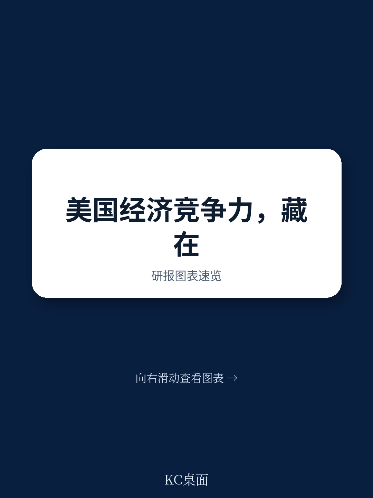

# 麦肯锡：美国250年竞争力未断，但真正考验的是“下一章”能否续写

美国建国250年之际，麦肯锡全球研究院发布了一份罕见的全景式报告，回顾美国经济竞争力的历史弧线，并前瞻下一阶段的挑战。这份报告的核心判断出人意料地清醒：美国目前仍是全球最具竞争力的经济体，但多个历史优势正在变成负债。真正的问题不是庆祝过去，而是能否再次找到资源、雄心、制度与政策的新对齐，以续写下一个章节。

这份报告的价值不在于罗列美国有多强，而在于它提供了一个少见的、长周期的分析框架，把AI、地缘政治、人口结构、财政健康、教育衰退、基础设施老化等看似分散的变量，统一到一个“竞争力演化”的叙事中。对于关注全球资产配置、产业趋势与中美竞争格局的读者，这是一份值得细读的底层框架。

## 1. 美国竞争力的“账面”依然强劲，但结构性的裂缝已经清晰可见

报告开篇即点明：美国以全球4%的人口，创造了26%的全球GDP，贡献了超过50%的全球市值。在全球前100强企业中，美国占据了59席。过去几年，美国的生产率增速在主要经济体中领先，宣布的绿地外商直接投资流入也比疫情前翻了一番。

这些数字固然亮眼，但麦肯锡并不满足于复述成就。报告在第一章就引入了“竞争力”的三维定义：全球领先的企业、创新与技术领导力、个人经济机会与繁荣。前两个维度美国表现突出，但第三个维度——经济机会——已经出现明显裂痕。收入不平等、教育水平下滑、基础设施评级仅为C级，这些都被报告明确列为“需要反思的理由”。

> **KC评论：** 这份报告最值得注意的不是美国有多强，而是它把“竞争力”定义为一个包含社会包容性的概念。如果只看GDP和市值，美国依然遥遥领先；但如果把教育、基建、财政可持续性纳入，画面就复杂得多。完整报告中有几十个横向对比图表，覆盖G7国家与中国，值得逐一对照。

## 2. 历史不是线性进步，而是四次“模式切换”的叠加

报告把美国250年的经济史划分为四个章节：农业时代、工业时代、科学时代、数字时代。每一章都对应一次经济模式的根本性重构。美国之所以能持续领先，不是因为固守某种优势，而是因为它能够反复“破坏并重建”自己的经济基础。

这一分析框架的洞察力在于，它解释了为什么简单的“美国衰落论”或“美国例外论”都过于粗糙。真正的竞争不是看某一年GDP增速的对比，而是看一个国家能否在技术范式转换时，快速重组制度、人力资本和基础设施。麦肯锡指出，美国在每一次转型中都依靠了两个深层基础：创新文化与自然禀赋。但这两个基础本身不会自动保证成功，它们需要被“集体行动”激活——也就是报告反复强调的“We the people”。

> **KC评论：** 这段历史分期是报告最精彩的部分之一。它提供了一个理解“为什么美国能反复反弹”的框架，同时也暗示了下一个章节可能需要的条件。完整报告中有专门章节拆解每一次转型的关键驱动因素和政策选择，对于思考当前AI转型的投资者来说，非常有参考价值。

## 3. 曾经的竞争优势，正在变成结构性负债

报告在第三章和第四章详细拆解了美国当前面临的五个核心挑战：财政健康恶化、基础设施老化、教育成绩下滑、制造业专长流失、收入与财富持续不平等。

以财政为例，报告指出，美国国债占GDP的比例已超过100%，且利息支出正在挤占其他公共投资。基础设施方面，美国土木工程师学会给出的评级是C级，这意味着未来十年需要约7.2万亿美元的投资。教育方面，PISA成绩在发达国家中排名中游，且过去十年没有明显改善。制造业方面，尽管美国仍保留超过50%的全球半导体收入份额，但制造产能已从1990年的37%降至2022年的10%。

这些挑战并非新问题，但麦肯锡的独特之处在于，它把这些“存量问题”与“增量变量”联系在一起：AI正在打开新的可能性空间，地缘政治竞争正在加剧，生育率正在下降。换句话说，美国不仅要解决旧账，还要同时应对新环境。

> **KC评论：** 报告没有给出简单的“政策建议清单”，而是提醒读者：这些挑战是相互关联的。比如，教育下滑会影响AI时代的人才供给，财政恶化会限制政府对基础设施和研发的投入。完整报告中有详细的量化测算，展示了不同假设下美国竞争力的演化路径，这些图表是决策者最值得花时间看的部分。

## 4. 报告没有完全回答的关键问题：AI能否成为“下一章”的引擎

麦肯锡明确指出，美国正站在“下一章”的起点。AI、能源转型、地缘重构正在重塑全球竞争格局。但报告在这一点上保持了克制：它没有断言AI会自动成为美国的优势，而是提出了一个开放性问题——美国目前拥有全球27%的研发支出和48个“值得注意的AI模型”，但这些能否支撑其维持59%的全球顶级企业份额？

这是一个非常聪明的设问。它暗示了三个尚未回答的子问题：第一，AI的产业化能力是否足够快，以弥补制造业外流带来的就业和技能缺口？第二，美国的教育体系能否培养出足够多的AI时代人才，还是将继续依赖移民？第三，财政和地缘政治压力会不会压缩政府和企业在AI基础设施上的投资空间？

这些问题的答案，将决定美国能否像前四次转型一样，成功进入下一个增长周期。报告没有提供确定答案，但提供了一个清晰的“追问框架”。

## 5. 对读者的观察框架：从“账面数据”转向“转型能力”

基于这份报告，我们可以提炼出一个更实用的观察框架。对于关注美国经济与全球市场的读者，不必过度纠结于季度GDP或通胀数据，而应该关注以下几个长期信号：

第一，美国能否在AI领域保持“从研究到产业化的完整闭环”？这需要关注研发投入结构、人才流动、以及联邦政府对AI基础设施的支持力度。第二，美国能否在基础设施和制造业回流上取得实质性进展，而不仅仅是宣布投资计划。第三，教育体系能否在下一个十年内出现明显改善，尤其是STEM领域的成绩和技能培训。第四，财政可持续性是否会被纳入政策优先级，还是继续被短期政治博弈拖延。

这些变量不会在一两个季度内见效，但它们决定了未来五到十年美国竞争力的真正走向。

---

这份麦肯锡报告全文超过200页，包含大量历史数据图表、国家间对比、以及不同情景下的前瞻性测算。以上只是基于报告核心逻辑的导读和初步解读。报告中还有更多值得深挖的内容，例如美国在关键矿产、半导体、制药等领域的供应链脆弱性分析，以及“集体行动”框架下企业、政府、个人各自应扮演的角色。

如果你希望获取完整报告的原始图表、数据表格，以及我们基于报告做的进一步拆解和每日更新，欢迎加入我们的社群。每天，我们会通过AI agent加人工审核的方式，筛选和解读国际投行与咨询机构的最新报告，生成10到40页的中文摘要与评论，既适合直接喂给AI工具，也方便人工快速把握全球市场的核心动态。这些未在本文中展开的图表和假设，正是社群中持续讨论的内容。

Personal reading notes and learning share only. Not investment advice.

