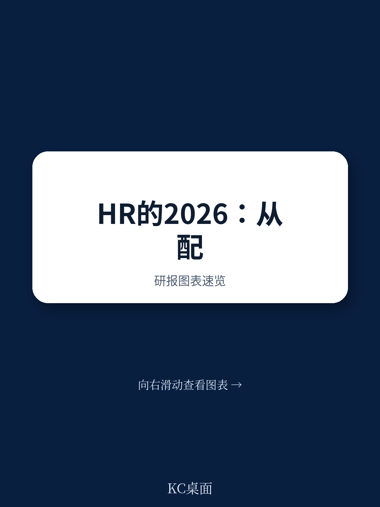
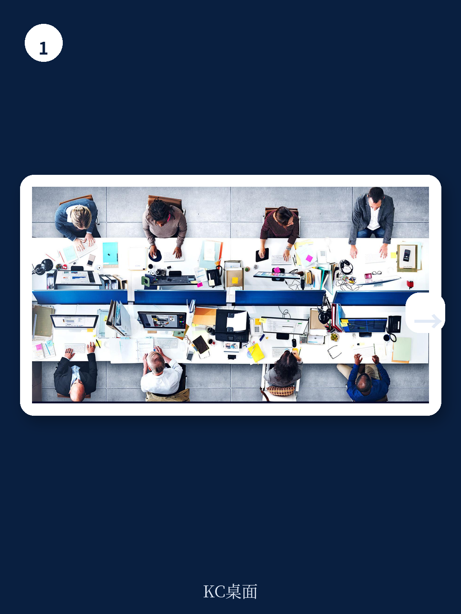

# 麦肯锡：HR正站在“被IT吞噬”与“重塑组织”的分叉口

2026年，全球劳动力市场正在经历一个微妙的转折点。宏观经济的不确定性让员工流动率下降，AI的渗透让技能需求结构发生根本性位移，而HR部门自身的变革速度却远远落后于外部环境的变化。

麦肯锡最新发布的《HR Monitor 2026》报告，基于对全球10个国家、1300名HR专业人士和5500名员工的调研，给出了一个清晰的判断：HR职能正站在一个分叉路口。一条路是继续维持现状，让日益复杂的技术变革超出自身能力边界，最终导致HR的核心职责被IT或数字化部门逐步蚕食。另一条路则是主动重塑，成为AI时代组织转型的架构师和领航员。

这份报告最值得关注的判断并非关于某个具体的HR流程改进，而是一个系统性的警示：**如果HR不能在战略规划、技能管理、运营模式这三个维度上完成从“职能卓越”到“系统级变革”的跃迁，它在未来三到五年内面临的根本不是地位提升问题，而是职能边界被重新定义的问题。**

> **KC评论：** 麦肯锡的这份报告本质上是在说，HR的“舒适区”正在消失。过去几年，HR在流程优化、招聘效率、员工体验等方面取得了不少进步，但这些进步大多是在既定框架内的改良。现在，AI带来的任务重组和组织形态变化，要求HR必须跳出“管人”的旧角色，去思考“人和智能体如何协作”的新命题。报告中的关键数据——比如只有11%的企业在做三年以上的战略性人力规划——暴露了多数组织在这方面的准备严重不足。

## 1. 战略规划的最大盲区：11%的企业在做长期规划，而技能缺口正在加速扩大

麦肯锡的报告揭示了一个核心矛盾：几乎所有企业都在做人力规划，但绝大多数是短期的、运营性的。数据显示，62%的受访企业会进行组织层面的人力规划，但只有11%的企业将规划视野延伸至三年以上，而近三分之二的企业规划周期不超过12个月。

这种短视在AI加速渗透的背景下尤为危险。根据麦肯锡全球研究院的分析，如果AI以中等速度被采用，到2030年，欧美30%的当前工时可能被自动化。与此同时，超过70%的当前技能预计仍将保持相关，但这并不意味着岗位本身不会发生变化。几乎每个职业都将经历技能结构的重组。

报告中的一组数据值得注意：HR专业人士认为23%的员工缺乏当前岗位所需的技能，这一比例同比下降了9个百分点。但22%的员工自己表示，怀疑自己在未来五年内能否具备留在当前岗位的技能。这两个数据都在下降，但方向值得警惕——HR似乎比员工更乐观。更关键的是，HR专业人士对未来技能变化的程度可能仍然低估了。

> **KC评论：** 这里有一个容易被忽视的“乐观偏差”。当HR认为技能缺口在缩小，而员工自己的信心也在回升时，很容易让人觉得“问题没那么严重”。但麦肯锡的报告暗示，这种乐观可能是基于对AI影响速度的低估。真正的风险不在于当前缺口的大小，而在于未来技能需求变化的节奏。如果规划周期只有12个月，而技能结构在3年内可能发生30%的重组，那么大多数企业实际上是在“边开车边换轮胎”。

## 2. 技能需求正在发生结构性位移：软件开发者不再是香饽饽，数字素养和推理能力在崛起

报告对未来技能需求的排序变化提供了一个极具洞察力的窗口。2026年的调查显示，问题解决能力仍然是最受重视的未来技能，44%的HR将其列入前五。创造力从去年的第五位跃升至第二位。数据分析和AI继续稳居前三。

但真正值得关注的是那些排名大幅变化的技能。**数字素养**从2025年的第20位飙升至今年的第6位，成为上升最快的技能。**推理能力**从第12位升至第9位。与此同时，**软件开发**和其他高度专业化的技术执行技能的重要性在下降。

这个变化背后的逻辑很清晰：AI系统正在越来越多地承担具体的执行任务，包括编写代码。因此，人类需要的能力正在从“如何做”转向“如何用、如何判断”。数字素养不再是IT部门的专属技能，而成为所有知识工作者的基础能力。推理能力和创造力之所以重要，是因为它们是人类在与AI协作时最难以被替代的价值。

> **KC评论：** 这是一个对个人和组织都极具指导意义的信号。如果你是一个软件工程师，单纯写代码的能力可能正在贬值，但结合业务理解、数据判断和AI工具调用的能力正在升值。对于企业来说，如果培训预算仍然大量集中在“教员工如何使用某个软件”上，而忽略了“教员工如何与AI协作、如何验证AI输出”的能力，那么培训投入的回报率会越来越低。

## 3. 招聘市场的“新常态”：雇主占优，但效率瓶颈在内部

全球劳动力市场正在进入一个“雇主友好型”阶段。报告数据显示，录用接受率同比上升了3个百分点，整体招聘成功率上升了4个百分点。员工自愿离职率同比下降了2个百分点，即便员工满意度整体保持稳定。

这听起来是HR的好消息——招人更容易，留人压力更小。但报告同时指出，招聘效率问题并未因此缓解。企业面临的一个新矛盾是：虽然候选人的竞争烈度下降，但招聘流程的复杂性和周期长度并未改善。更长的招聘周期意味着，即便市场偏向雇主，那些最优秀的候选人仍然可能因为等待时间过长而流失。

AI在招聘领域的应用潜力巨大，但报告发现，多数企业仍然停留在将AI“叠加”到现有复杂流程上，而非用AI重新设计流程本身。比如，AI可以大幅提高简历筛选和面试安排的效率，但如果企业的招聘流程本身就是一个多环节、多审批、多轮面试的“长链条”，AI只能加速其中某个环节，而无法解决整体效率问题。

> **KC评论：** 这其实是一个很典型的“数字化悖论”。企业在引入AI时，往往选择在现有流程上做“加法”，而不是做“减法”。结果就是，流程变得更复杂而非更简单。麦肯锡报告隐含的提醒是：AI的价值不在于让一个糟糕的流程跑得更快，而在于让你有机会重新思考这个流程是否必要。

## 4. 员工体验的底层逻辑变了：补偿成为第一驱动力，但企业回应不足

在宏观经济不确定的背景下，员工流动性的下降并不意味着忠诚度的上升。报告显示，员工决定留任的核心驱动力正在变得更加“硬核”：**补偿（52%）、工作生活平衡（46%）、工作稳定性（45%）**。补偿首次成为最核心的因素。

与此同时，员工对薪酬的满意度并未同步提升。报告暗示了一个值得警惕的“错位”：企业受益于雇主友好型市场，外部机会减少，因此缺乏调整薪酬的紧迫感；但员工对薪酬的关注度在上升，而企业的回应不足可能埋下未来离职潮的隐患。

对于HR来说，这意味着在当前的“稳定期”内，提升员工体验的重点可能不是推出更多福利项目，而是回归到更基础的问题：薪酬的公平性、透明度和可持续的工作负荷模型。报告的数据显示，员工对工作负荷和压力的关注度在上升，而这些往往比额外的福利更能影响留任意愿。

> **KC评论：** 这里有一个容易被企业忽视的“时间差”。当前的低离职率不是因为员工满意，而是因为外部机会减少。一旦宏观经济环境改善、劳动力市场重新活跃，那些“被压抑”的离职需求可能会集中释放。如果企业现在不解决薪酬公平性和工作负荷问题，等到市场回暖时再应对，可能已经晚了。

## 5. 报告没有完全回答的关键问题：AI时代HR的“护城河”到底是什么？

麦肯锡的报告提出了一个令人不安的前景：如果HR不能跟上技术变革的速度，其核心职责可能会被IT或数字化部门接管。这个判断很有冲击力，但报告本身并未完全展开一个关键问题——**HR的“护城河”到底是什么？**

从报告的逻辑来看，HR的独特价值不应该仅仅在于“懂人”，因为AI和数据分析工具正在让“懂人”这件事变得更加可量化、可预测。HR的真正护城河，可能在于它对“组织系统”的理解——即如何将人的动机、能力、文化与业务流程、技术架构、激励机制整合成一个有机的整体。这不是一个单纯的“技术问题”，也不是一个单纯的“人性问题”，而是一个“系统设计问题”。

但报告在这一点上着墨不多。它更多地聚焦于HR需要做什么（比如建立技能智能、转向场景化规划、重塑运营模式），而没有深入探讨在这些变革之后，HR作为一个职能的“不可替代性”究竟在哪里。这是一个值得所有HR从业者独立思考的问题。

## 6. 给读者的观察框架：如何判断一家公司的HR是否走在正确的轨道上

基于麦肯锡报告的数据和判断，我们可以提炼出一个简单的观察框架，用于评估一家公司的人力资源管理是否真正在“系统级变革”而非“职能改进”：

**第一，看规划视野。** 如果一家公司的人力规划周期超过三年，并且包含多场景模拟（而非单一预测），那么它可能已经走在了前面。如果规划仍然以年度预算和岗位编制为核心，那么它大概率还在原地踏步。

**第二，看技能管理深度。** 是否建立了系统化的技能分类体系？这个体系是否被用于实际的人才配置和培训决策？报告显示85%的企业声称有技能分类，但只有57%将其用于规划。真正的差距在于“用”而非“有”。

**第三，看AI在HR流程中的角色。** AI是被当作一个“加速现有流程”的工具，还是被用来“重新设计流程”？前者的效果有限，后者的潜力巨大。报告中的数据显示，AI在HR领域的规模化采用仍然很慢，这本身就是一个值得关注的信号。

**第四，看员工体验的“硬指标”。** 在补偿、工作负荷、晋升公平性这些基础问题上，企业是否在主动改善，还是在等待市场压力消失？当前的“稳定期”是检验企业是否真正重视员工的最佳窗口。

---

麦肯锡的这份报告提供了一个扎实的基准，但它也留下了一些未解的问题：AI时代HR的“护城河”究竟是什么？当组织越来越像“人机混合系统”时，HR的边界应该划在哪里？技能智能和场景化规划听起来很美好，但多数企业是否有足够的组织能力和数据基础来落地？

这些问题，恰恰是我们在日常的研报解读和数据追踪中持续关注的。每天，我们通过AI agent和人工review的方式，从国际投行的最新研报中提取关键信号，生成中文摘要和深度评论，帮助读者在信息过载中抓住真正重要的变化。这些内容既适合直接阅读，也适合作为AI模型的输入素材。

如果你希望看到这份麦肯锡报告中的完整图表、分行业数据，以及我们对其未解问题的进一步拆解，欢迎加入社群。我们会持续更新最新的研报解读与数据合集，帮助你在市场变化中保持信息优势。

Personal reading notes and learning share only. Not investment advice.

