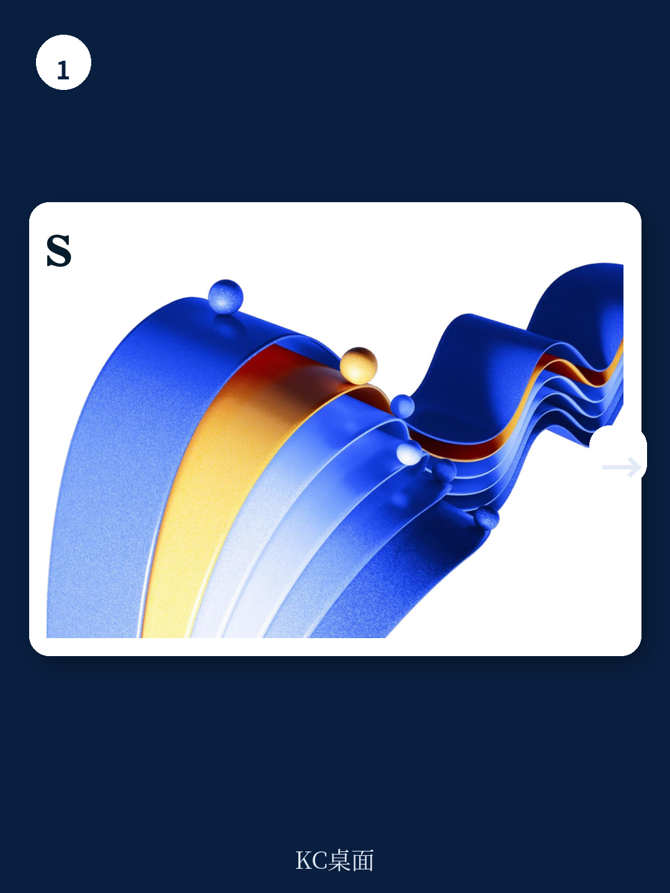

# 麦肯锡：2025年，企业最大的风险不是AI，而是把学习当成福利

2025年，企业面临的最大挑战不是技术选型，不是成本控制，而是如何让组织在持续动荡中保持“学习能力”这一核心资产。麦肯锡研究与创新学习实验室最新发布的《2025学习趋势展望》给出了一个反直觉的判断：当大多数企业还在纠结“要不要用AI替代员工”时，真正领先的组织已经在问一个更根本的问题——如何让工作本身变成发展的引擎。

这份报告不是一份趋势清单。麦肯锡明确将其定义为“导航工具”，而非“趋势摘要”。报告的核心主张是：未来三年，企业的人才发展必须从“支持功能”升级为“战略驱动力”，而实现这一转变的钥匙，藏在三个相互强化的趋势中——流动的发展生态系统、负责任的AI采纳、以及组织韧性的系统性构建。

报告中最值得关注的信号不是某个新技术，而是一个认知转折：**发展不再是一项福利，而是一种“关怀行为”（act of care）**。这个表述听起来温和，但其商业含义极为锋利——那些把员工发展当作福利来做的企业，将在人才争夺战中系统性落后。

> **KC评论：** 这份报告最值得反复咀嚼的不是它列出的趋势，而是它提出的底层逻辑。麦肯锡明确说，三个宏观趋势——流动生态、负责任的AI、韧性——不是独立话题，而是“相互强化、无法孤立成功”的系统。这意味着，过去那种“今年主推AI培训、明年主抓员工幸福感”的碎片化策略，已经行不通了。完整报告里有一张非常清晰的系统互动图，值得仔细研究。

## 1. 流动发展生态：从“碎片化学习”到“工作即发展”的范式转换

报告的第一大趋势直指一个长期痛点：企业的人才发展职能仍然处于“被动支撑”状态。2023年ATD调查显示，虽然72%的受访者认识到将HR转型为跨职能学科的重要性，但只有11%报告了有意义的进展。这个数字本身就说明问题——认知与执行之间存在巨大鸿沟。

麦肯锡认为，未来的发展方向是“流动的发展生态系统”（fluid development ecosystems）。这不是一个模糊的概念，而是三个具体动作的组合：去孤岛化的人才职能、数据驱动的发展生态、以及基于前瞻性洞察的战略决策。

最值得关注的是“去孤岛化”这一条。报告指出，尽管L&D、HR、人才等职能之间的协作意愿在增强，但“结构性和决策权仍在强化旧的边界。围栏没有倒下，只是移动了位置。”这意味着，真正的变革不是组织架构调整，而是权力结构和决策逻辑的重塑。

数据方面，报告引用了世界经济论坛《未来就业报告》的数据：2025年至2030年间，39%的现有技能将被转化或过时。但更关键的是，61%的企业仍然只做一年期的人力规划。这个对比揭示了企业面临的真实困境——明知技能在快速贬值，却缺乏改变的战略耐心。

> **KC评论：** 这里有一个容易被忽略的细节。报告提到“技能验证”正在从自我报告数据转向更完整的验证体系，但没有展开。完整报告里有一张关于“技能数据生态”的图，展示了从数据采集到预测建模的完整链路。对于正在搭建人才数据体系的企业来说，这张图本身就是一套很好的架构参考。

## 2. 负责任的AI采纳：信任比技术更稀缺

第二大趋势“负责任的AI采纳”可能是这份报告中最具紧迫感的部分。麦肯锡的判断是：“信任是脆弱的，处理不当可能会侵蚀员工的信心。”这个表述背后有一个被很多企业忽视的现实——员工对AI的焦虑正在上升，而企业对此的沟通和引导严重不足。

报告指出，尽管人们领导者正在积极实验AI——构建AI Agent、建立合作伙伴关系、试点新功能——但这些努力“可能给员工带来更多复杂性，而不是明确的价值”。这是一个尖锐的批评：企业AI战略最大的风险不是技术失败，而是信任破裂。

麦肯锡给出的方向是：负责任地采纳AI，必须向员工传递一个明确信号——领导者关心他们的贡献，并致力于确保AI帮助他们成功。这听起来像是常识，但实践中极少有企业做到了。大多数AI转型沟通仍然停留在“效率提升”“降本增效”的叙事上，而不是“如何帮助你变得更好”。

> **KC评论：** 报告的完整版包含一个关于“AI Agent团队”的案例，展示了AI如何作为“思想伙伴”而非替代者参与工作。这个案例的细节——包括人类和AI各自承担什么角色、如何分工——对于正在设计人机协作流程的企业非常有参考价值。

## 3. 韧性不是个人品质，是组织能力

第三大趋势“韧性与适应性”可能是三个趋势中最容易被误解的。很多企业把韧性等同于“员工抗压能力”，然后推出各种心理健康项目。但麦肯锡的视角完全不同：韧性是组织的系统性能力，而不是个人的心理素质。

报告区分了两个层次：个体韧性和组织韧性。个体韧性强调的是“恢复能力”，而组织韧性是“预期挑战、适应并成长”的能力。这个区分非常关键——前者是被动的，后者是主动的。

数据方面，报告引用了一个令人警醒的数字：2025年，66%的员工报告工作倦怠。这个数字来自2025年2月的最新研究。在员工倦怠率持续攀升的背景下，仅仅提供“减压课程”已经不够。企业需要重新设计工作流本身——包括如何分配任务、如何设置目标、如何提供恢复时间。

报告特别提到“支持恢复以确保持续绩效”，并强调这需要“可持续的工作流”。这意味着，韧性建设不是HR部门的专项活动，而是一场涉及组织设计、流程再造和文化重塑的系统工程。

## 4. 报告没有完全回答的关键问题：谁来买单？

尽管这份报告提供了极具洞察力的框架，但有两个关键问题没有被充分回答。

第一，成本与回报的量化。报告提到“发展是最大的关怀行为”，但没有给出企业投入产出比的测算。对于CFO来说，“关怀”不是预算科目。当企业面临成本压力时，这类投入往往首当其冲。报告没有提供一个可量化的商业案例，这可能会限制其说服力。

第二，实施路径的差异化。报告提出的三个趋势框架是普适性的，但不同行业、不同规模企业的实施路径必然不同。一家科技初创公司和一家传统制造业巨头，面对同样的趋势，应该采取完全不同的策略。报告没有给出这种差异化指导。

> **KC评论：** 报告提到“83%的领导者认为领导力是技能转型的关键，但只有28%的员工认为战略被清晰传达”。这个差距本身就指向了一个未解问题：如何弥合领导层与执行层之间的认知鸿沟？完整报告中有关于“管理者角色”的详细建议，但具体的沟通框架和变革管理工具仍然需要读者自己推导。

## 5. 给决策者的观察框架：三个问题检验你的组织准备度

基于这份报告的框架，决策者可以用三个问题来快速评估自己组织的准备度：

**问题一：你的发展体系是“事件驱动”还是“工作嵌入”？** 如果员工需要“停下来去学习”，说明学习还没有融入工作流。真正的标志是：员工在日常工作中自然获得成长，而不需要专门安排学习时间。

**问题二：你的AI战略是“技术优先”还是“信任优先”？** 如果AI部署的沟通重点在效率提升上，说明你还没有理解信任的价值。检验标准是：员工是否认为AI是在帮助他们，而不是威胁他们。

**问题三：你的韧性建设是“补救型”还是“前置型”？** 如果主要投入是EAP计划和减压课程，说明你还在做“事后补救”。真正的韧性建设应该体现在工作设计、目标设置和流程再造中。

---

这份报告的价值不在于告诉你“趋势是什么”，而在于提供了一个判断框架：当所有企业都在面对同样的外部冲击时，真正拉开差距的，是你如何定义“发展”这件事。是把发展看作成本项，还是看作战略资产？是把AI看作替代者，还是看作协作伙伴？是把韧性看作个人品质，还是看作组织能力？

这些问题的答案，决定了你的组织在未来三年的竞争位置。

报告中的大量细节——包括技能数据生态的构建路径、AI Agent的协作模式设计、跨代际团队的管理策略——都值得深入拆解。但受限于篇幅，本文只能触及表层。如果你想获得完整报告解读和原始图表，加入我们的社群，每天由AI agent配合人工review生成国际投行中文摘要与KC评论，涵盖当天最新数据图表合集，既方便喂给AI，也方便快速把握市场动态。我们会在社群中继续探讨那些报告没有完全展开的关键问题。

Personal reading notes and learning share only. Not investment advice.

