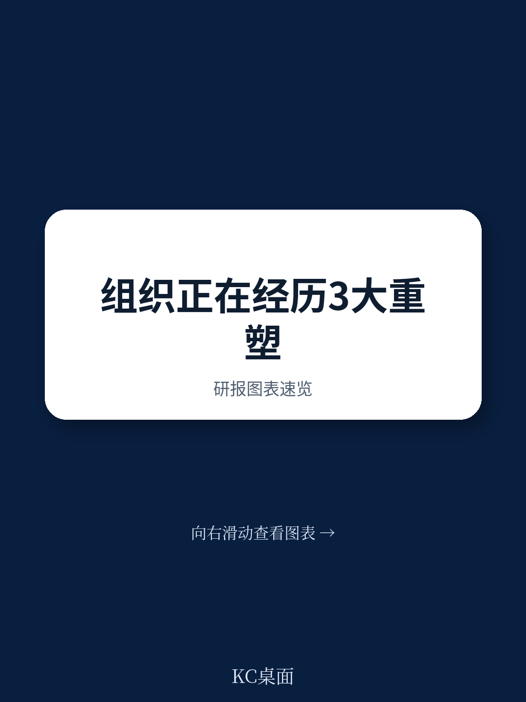
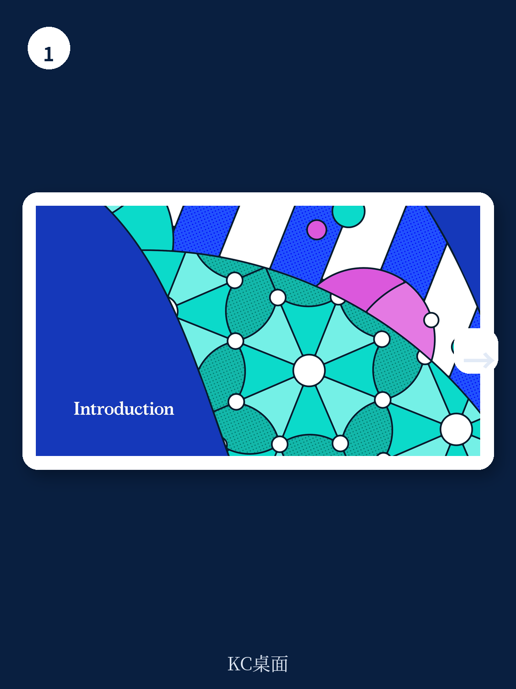
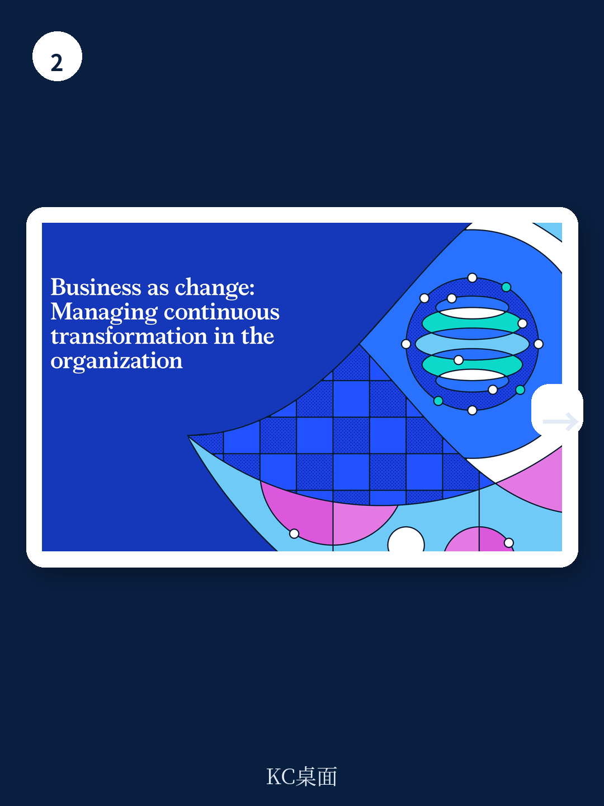

# 麦肯锡：88%企业在试AI，但81%未见到利润

麦肯锡在2026年2月发布的《组织状态》报告中，抛出了一个让企业决策者无法回避的核心矛盾：绝大多数组织已经开始拥抱人工智能，但绝大多数组织也并未因此获得可观的财务回报。88%的受访组织正在以某种形式试验AI，然而81%的受访者坦言，这些尝试并未对利润产生实质性的影响。这不是一个关于技术是否有效的疑问，而是一个关于组织是否准备好迎接技术的问题。

这份报告基于对全球超过10,000名高管和领导者的调研，覆盖15个国家与16个行业。它试图回答一个根本性的追问：在技术、经济和劳动力三大结构性力量同时重塑商业环境的今天，组织如何才能从短期的韧性转向持续的生产力与长期的价值创造？

报告得出的结论清晰且尖锐：那些只将AI视为效率工具、在现有流程上做局部修补的组织，注定与真正的价值增长无缘。真正的赢家，将是那些敢于推动“双重转型”——同时改造技术与组织——的企业。它们需要重新想象工作如何完成，重新定义职能与端到端流程，并从根本上重塑传统结构。

> **KC评论：** 这个数据点值得所有管理者停下来思考。88%的试验率与81%的无利润结果之间，存在一个巨大的“价值黑洞”。报告暗示，这个黑洞并非技术本身，而是组织层面的障碍——缺乏清晰的所有权、缺乏系统性的流程重构、以及缺乏对员工能力的同步投入。这意味着，企业现在面临的不是“要不要用AI”的选择，而是“如何用组织变革来兑现AI承诺”的紧迫命题。

---

## 1. 86%的领导者承认组织尚未准备好日常运营中融入AI

麦肯锡的调研揭示了一个令人不安的认知鸿沟：高达86%的领导者认为，自己的组织在将AI融入日常运营方面准备不足。更值得警惕的是，每六家组织中就有一家没有明确的C级负责人来推动AI采纳。这意味着，在许多企业中，AI战略要么沦为空谈，要么被降级为某个部门的技术实验，缺乏自上而下的系统推动。

报告指出，当前大多数AI整合努力都集中在碎片化的用例上，旨在提升个体贡献者的效率。那些试图将AI智能体嵌入现有流程以驱动生产力的更实质性努力，要么仍处于规划阶段，要么正在试点项目中测试。这种“头痛医头”的路径，恰恰是导致81%的企业无法看到利润增长的根本原因。

麦肯锡的研究表明，那些真正成功的组织，其AI转型并非始于技术采购，而是始于对工作流程的端到端重构。它们不满足于用AI加速现有步骤，而是重新思考哪些步骤应该存在、哪些可以合并、哪些可以由AI智能体自主完成。这种系统性思维，才是从效率提升跨越到价值创造的关键。

> **KC评论：** 86%这个数字本身就是一个信号。它意味着大多数组织在AI转型的起跑线上就已经落后。而“没有C级负责人”这一发现尤其关键——它说明在许多企业里，AI仍然被视为IT部门的职能，而非CEO或COO的战略议程。报告后续章节对“人机协作”和“共享服务中心重构”的深入分析，正是为了回答“组织准备度”这个核心问题。这些内容在完整报告中配有详细的案例拆解和操作框架。

---

## 2. AI智能体不是工具，而是“同事”——但只有四分之一的领导者这么认为

麦肯锡的报告将AI智能体的角色定位提升到了一个全新的层次。它指出，AI智能体不仅仅是更聪明的工具，它们应该成为人类员工的“自主队友”——能够被插入公司工作流程，自主完成任务，甚至在多智能体协同的场景下，它们可以组成团队并设计自己的工作流。

然而，受访领导者的认知显然滞后于这一愿景。只有四分之一的领导者预期，在短期内AI智能体将作为员工的自主队友发挥作用。这种认知落差，直接阻碍了组织对AI潜力的释放。

报告引用了一个来自电信公司的案例：该公司构建了一个“下一个最佳体验”引擎。AI模型识别客户何时可能需要帮助或更优的报价，然后通过客户偏好的渠道发送个性化信息。只有当需要时，才会触发人工介入。这一系统降低了客户流失率，改善了利润率，并显著提升了客户参与度。这个案例的关键在于，AI并非替代了人类，而是重新定义了人类介入的时机和方式。

> **KC评论：** “四分之一”这个比例说明，大多数领导者仍然在用“工具”的思维框架来理解AI智能体。但报告暗示，真正的价值创造恰恰来自将AI智能体视为“队友”——这意味着需要重新设计汇报关系、绩效考核、甚至组织架构。完整报告中有一整节专门讨论“人机协作的新世界”，其中包含了如何重新定义能力要求、如何建立员工对技术的信任、以及如何设计新的协作流程。这些内容对于正在制定AI战略的决策者来说，是绕不开的功课。

---

## 3. 共享服务中心正在从成本中心变为“AI优先的创新引擎”

一个被大多数企业忽视的AI应用沃土，是共享服务中心。麦肯锡的报告指出，随着技术重塑工作方式，传统的共享服务中心正在从交易处理中心演变为全球业务服务中心。84%的领导者计划在未来一到两年内扩大其共享服务中心的范围。然而，超过40%的受访者尚未开始系统性地采纳所需的技术。

报告描绘的愿景是：这些中心将“AI优先”地设计，从物理中心变为虚拟中心，在人类与AI智能体之间编排工作，解锁端到端的自动化，并在规模上驱动创新和洞察。这意味着，财务、人力资源、IT支持等后台职能，将不再仅仅是成本优化的对象，而可能成为整个企业AI转型的试验场和动力源。

> **KC评论：** 84%的计划扩张率与40%以上的技术采用滞后率之间，存在一个明显的“执行缺口”。报告暗示，那些率先完成共享服务中心AI化改造的企业，不仅能够获得成本优势，更可能建立起竞争对手难以复制的运营敏捷性。完整报告对共享服务中心的转型路径、技术选择和组织设计有更详细的拆解，包括具体的企业案例和投资回报测算。

---

## 4. 报告尚未完全回答的关键问题：AI转型的“人”的账怎么算？

麦肯锡的报告在多个地方提到了一个令人印象深刻的数字：一位受访高管指出，在AI转型中，每在技术上投入1美元，就应该在人员上投入5美元。这个5：1的比例，是报告中最具冲击力的洞察之一，但它也留下了一个尚未完全回答的问题：这5美元具体应该花在哪些地方？

报告提到了需要重新定义能力要求、建立员工对技术的信任、以及培养领导者从“由外而内”转向“由内而外”的领导方式。但这些建议仍然停留在原则层面。对于正在制定预算和转型路线图的企业决策者来说，他们需要更具体的指导：如何量化员工技能提升的投资回报？如何设计人机协作的绩效考核体系？如何在组织内部建立对AI的信任文化？

另一个报告尚未充分展开的问题是：AI转型对不同规模、不同行业的企业意味着完全不同的路径。一家拥有10万名员工的跨国制造企业，与一家拥有1000名员工的专业服务公司，其AI转型的节奏、重点和挑战显然不同。报告基于全球超过10,000份问卷的丰富数据，但如何在行业和规模维度上进行更精细的解读，仍留给了读者自己去探索。

> **KC评论：** 5：1这个比例是报告中最值得反复咀嚼的数字之一。它揭示了AI转型的本质：技术成本只是冰山一角，真正的投资在于组织能力、文化变革和人才培养。但报告没有展开的是，这5美元在不同行业、不同转型阶段应该如何分配。这些“如何做”的细节，恰恰是完整报告中最有价值的部分——它包含了多个行业的具体案例、调研数据的交叉分析、以及可操作的行动框架。

---

## 5. 领导者需要一个新的观察框架：从“结构”转向“流动”

麦肯锡的报告提出了一个对组织设计具有颠覆性意义的概念：从“结构”转向“流动”。报告指出，三分之二的领导者认为自己的组织过于复杂且效率低下，但传统的补救措施——依靠结构重组、成本削减和扁平化——正在产生递减的回报。

真正的突破口，在于将注意力从“组织架构是什么样子”转向“工作实际上如何完成”。这意味着从根本上简化和统一跨企业的流程：消除重复、同步信息流、精简决策程序、并在可能的地方实现自动化。报告将这一转变称为“达到下一个生产力前沿”的关键。

这一框架对投资者的启示同样深刻：在评估一家企业的竞争力时，传统的组织架构图可能已经过时。真正需要关注的，是这家企业的信息流、决策流和资金流是否足够敏捷、是否能够被AI增强。那些能够在“流动”层面进行优化的企业，更有可能在AI时代获得持续的生产力溢价。

> **KC评论：** “从结构到流动”是一个强大的分析工具，但它也是一个需要大量数据支撑的判断。报告中的调研数据揭示了哪些企业在“流动”方面做得更好、哪些行业领先、以及具体的改进路径。这些内容在完整报告中以图表和案例的形式呈现，对于希望将这一框架应用于自身组织的读者来说，是不可或缺的参考。

---

## 结语：顺着这些未解问题，继续深入

麦肯锡这份2026年的《组织状态》报告，既是一份诊断书，也是一张路线图。它清晰地指出了绝大多数企业在AI转型中面临的困境——试验多、利润少、准备不足——但也提供了从困境中突围的方向：双重转型、人机协作、共享服务中心升级、以及从结构到流动的思维转变。

然而，真正有价值的信息往往隐藏在细节中。5：1的人员投入比例如何落地？不同行业的最佳实践有何差异？86%的“准备不足”具体体现在哪些维度？那些已经看到AI利润增长的企业，它们做了什么与别人不同的事情？这些问题，在报告中都有更深入的数据支撑和案例分析。

我们每天会由AI agent结合人工review，生成国际投行与顶级咨询机构的中文摘要与KC评论，更新频率为daily，内容量约10到40页，包含当天最新数据图表合集。这份材料既方便喂给AI进行二次分析，也方便人工快速把握市场动态。如果你希望获取麦肯锡这份报告的完整解读与原始图表，或者希望加入我们的讨论社群，欢迎通过下方图片加入。

Personal reading notes and learning share only. Not investment advice.

