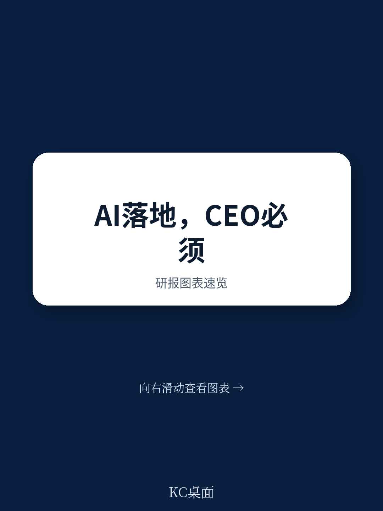
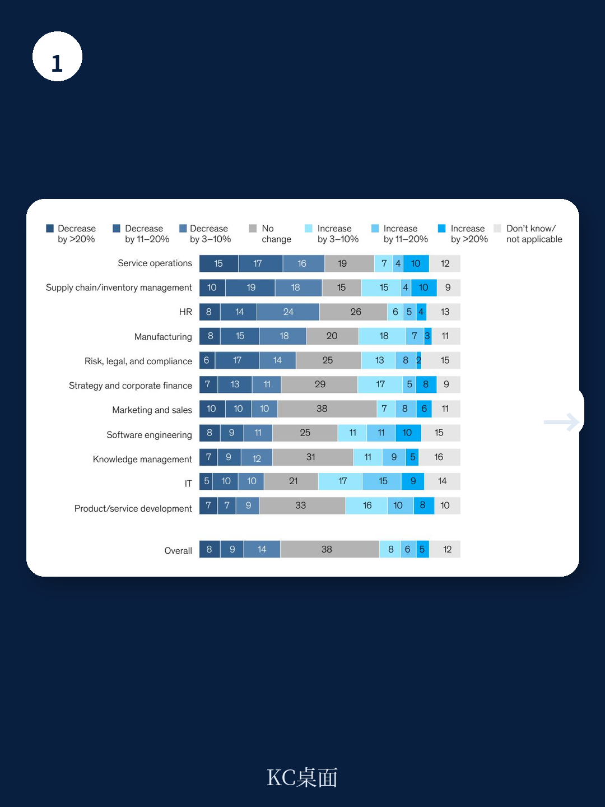
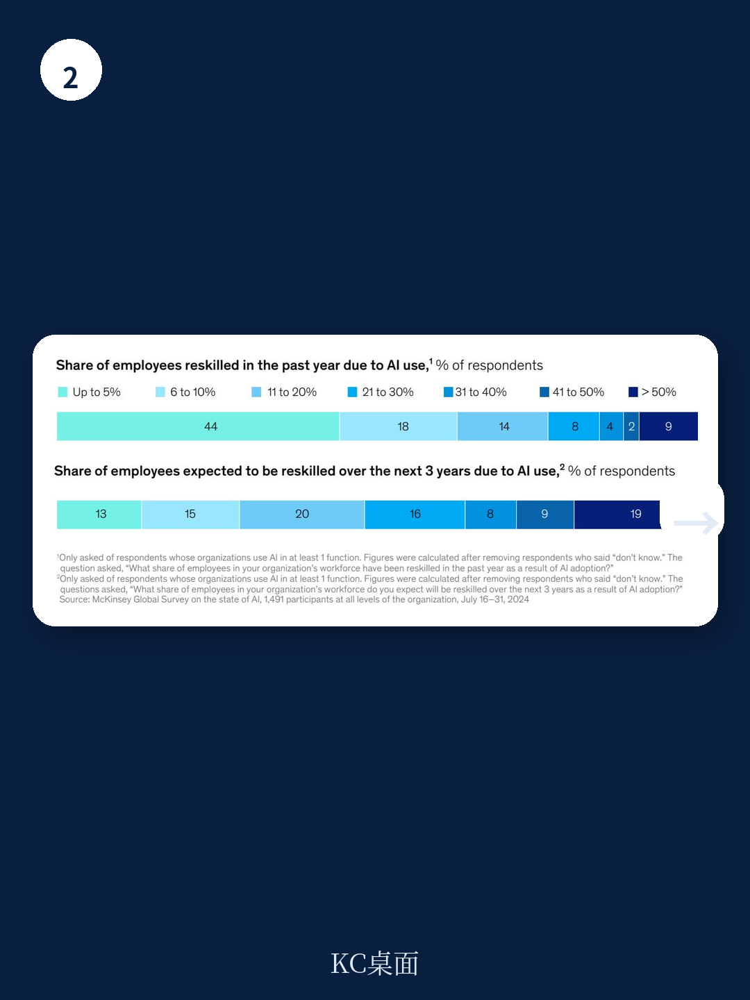

# 麦肯锡：CEO不下场，AI永远只是成本

这份报告最值得看的判断不是“AI使用率又创新高”，而是：**真正从AI中拿到利润的公司，正在做三件大多数企业还没做的事——把CEO拉进治理、重新设计工作流、以及用KPI而不是讲故事来管理AI项目。**

麦肯锡2025年3月发布的《The State of AI》全球调查，覆盖1491位来自101个国家的企业受访者。报告试图回答一个核心问题：当几乎所有公司都在用AI时，为什么只有极少数看到了真实的利润影响？

答案不是技术选型，不是算力投入，而是组织架构的“重布线”。这份报告提供了迄今为止最系统的证据，说明企业需要做出哪些结构性的改变，才能把AI从“实验工具”变成“利润引擎”。

以下是我们从这份报告中提炼出的六个核心洞察，以及一个报告没有完全回答的关键追问。

## 1. 这轮变化真正考验的是企业能否把规模转化为议价权

报告最反常识的发现是：年收入超过5亿美元的大型企业，在AI部署上正在加速拉开与中小企业的差距。这不是简单的“大公司更有钱”，而是大公司在治理结构、风险管理和人才配置上采取了完全不同的路径。

大型企业更倾向于让CEO亲自监督AI治理，而中小型企业更多把这事交给IT或数字部门。报告通过相关性分析发现，CEO对AI治理的参与度，是所有25个测试属性中，与企业EBIT影响相关度最高的因素之一。在大公司样本中，这个相关性甚至更强。

> **KC评论：** 这意味着AI不是“买了工具就完事”的IT项目，而是一场需要CEO亲自拉动的组织变革。报告没有明说但数据暗示的是：如果CEO不参与，AI项目大概率会变成“成本中心”而非“利润中心”。完整报告里有一张25个属性的相关性排序图，值得仔细看——它揭示了哪些投入真正能转化为利润。

## 2. 重新设计工作流比任何技术选型都重要

报告测试了25个属性对企业EBIT影响的相关性，结果排名第一的是“是否重新设计了工作流”。不是买了多少GPU，不是用了哪个模型，而是企业是否真正改变了“人+AI”协同的方式。

目前只有21%的受访者表示，他们的组织已经对至少部分工作流进行了根本性重新设计。这个数字本身就说明问题：大多数企业还是在“旧流程上贴AI标签”，而不是重新思考“这件事应该怎么做”。

报告引用了麦肯锡合伙人Alex Singla的评论：那些从AI中建立持久竞争优势的企业，思考的是“彻底的转型变革”，而不是“一个接一个的用例”。这种端到端的思维方式，决定了你是把AI当作修补工具，还是当作重塑商业模式的杠杆。

## 3. AI治理正在从“谁负责”变成“谁不负责”

报告显示，28%的受访者表示CEO负责AI治理，17%表示由董事会负责。但更值得注意的是：平均而言，每个组织有两位领导共同负责AI治理。这不是“责任分散”，而是“风险共担”的信号。

在风险缓解方面，报告发现企业正在加速应对三类风险：不准确性、网络安全和知识产权侵权。与2024年初的调查相比，这三类风险的缓解措施都在显著增加。大型企业尤其积极，在网络安全和隐私风险方面投入明显更多。

但报告也揭示了一个值得警惕的差异：大型企业在处理“可解释性”和“准确性”风险上，并没有比小企业更积极。这暗示了一个潜在盲区——规模越大，AI输出的“黑箱问题”可能越被忽视。

> **KC评论：** 这里有一个值得追问的伏笔：当AI输出的审查比例差异巨大时（27%的企业审查全部输出，同样27%的企业只审查20%或更少），不同企业的“AI事故容忍度”可能完全不一样。完整报告里有一张按行业细分的审查比例图，能帮你判断自己所在行业处于哪个区间。

## 4. 采用和规模化不是“自然发生”，而是“管理出来”

报告列出了12项AI采用与规模化的最佳实践，从“建立专门的AI推进团队”到“追踪明确定义的KPI”。相关性分析显示，每一项实践都与更高的EBIT影响正相关。

但现实是：不到三分之一的受访者表示他们的组织在遵循大多数实践。只有不到五分之一的企业在追踪AI项目的KPI。这意味着，大多数企业还在“凭感觉”管理AI投入。

最有趣的是，不同规模企业的差距：大型企业在“建立明确的规模化路线图”上的概率是中小企业的两倍以上。它们也更可能“通过内部沟通建立AI价值认知”和“为不同层级员工设计角色化培训”。

这些看起来是“管理常识”，但报告的数据表明，正是这些“常识”区分了AI投入是“成本”还是“投资”。

## 5. 报告尚未完全回答的关键问题：KPI到底应该怎么设？

报告明确指出“追踪明确定义的KPI”是所有12项实践中与EBIT影响相关度最高的。但它没有深入回答：什么样的KPI是有效的？是“AI使用率”“自动化率”还是“决策准确率”？不同行业、不同职能的KPI应该怎么差异化设计？

这可能是报告有意留下的“未完成讨论”。因为从麦肯锡的咨询实践来看，KPI设计恰恰是大多数企业最头疼的问题——设错了，AI项目就会变成“为了用AI而用AI”的表演。

另一个报告没有完全展开的问题是：当AI输出审查比例差异巨大时，不同企业的“风险-效率”平衡点在哪里？是“全部审查”更安全，还是“重点审查”更高效？报告给出了现状数据，但没有给出“最佳实践”建议。

> **KC评论：** 这两个未解问题恰恰是这份报告最有价值的“后续阅读入口”。如果你正负责推动AI项目，完整报告里有12项实践的详细定义和按行业/规模的交叉分析，能直接帮你对照自己组织的成熟度。

## 6. 对读者的观察框架：从“三个维度”判断企业AI成熟度

基于报告数据，我们建议读者用以下三个维度来观察一家企业的AI成熟度，而不是只看“有没有用AI”：

**第一个维度：治理结构。** CEO是否亲自参与AI治理？董事会是否有AI监督机制？如果AI治理被下放到IT部门，大概率还处于“实验阶段”。

**第二个维度：工作流设计。** 企业是否重新设计了至少部分工作流？还是只是在旧流程上叠加AI工具？工作流重新设计的比例，是比任何“AI使用率”更真实的成熟度指标。

**第三个维度：KPI管理。** 企业是否在追踪AI项目的明确KPI？这些KPI是否与业务结果（收入、成本、客户满意度）挂钩，还是只关注“技术指标”？

这三个维度组合起来，基本能判断一家企业是“真在做AI”还是“在表演做AI”。

---

这份报告的核心价值，不是告诉你“AI很重要”——这已经是常识。它的价值在于提供了系统性的证据，说明**从AI中获取真实利润需要什么样的组织变革**。但正如报告自己承认的，超过80%的受访者表示他们的组织还没有看到AI对整体EBIT的实质性影响。

这意味着，大多数企业还在“从0到1”的路上。而这条路的关键，不是技术，是组织。

如果你正在思考自己组织的AI战略，或者想对比自己所在行业的最佳实践，这份报告的完整版本（包含全部25个属性的相关性分析、12项实践的行业分布、以及按收入规模的详细交叉表）值得深入阅读。我们每天会由AI agent和人工review团队，把国际投行和咨询机构的最新报告转化为中文摘要和评论，同时附上原始图表和PDF，既方便喂给AI做进一步分析，也方便人工快速把握市场动态。

如果你想获取这份报告的完整解读和原始图表，或者想加入一个每天讨论这些报告结论的社群，欢迎扫码加入。

Personal reading notes and learning share only. Not investment advice.

