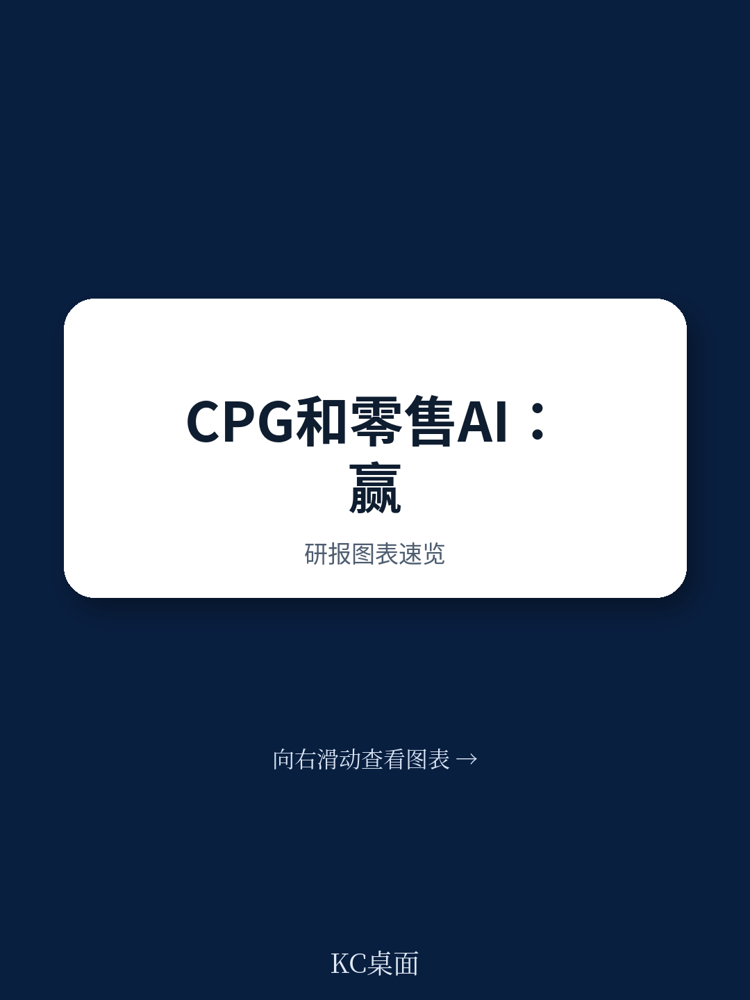
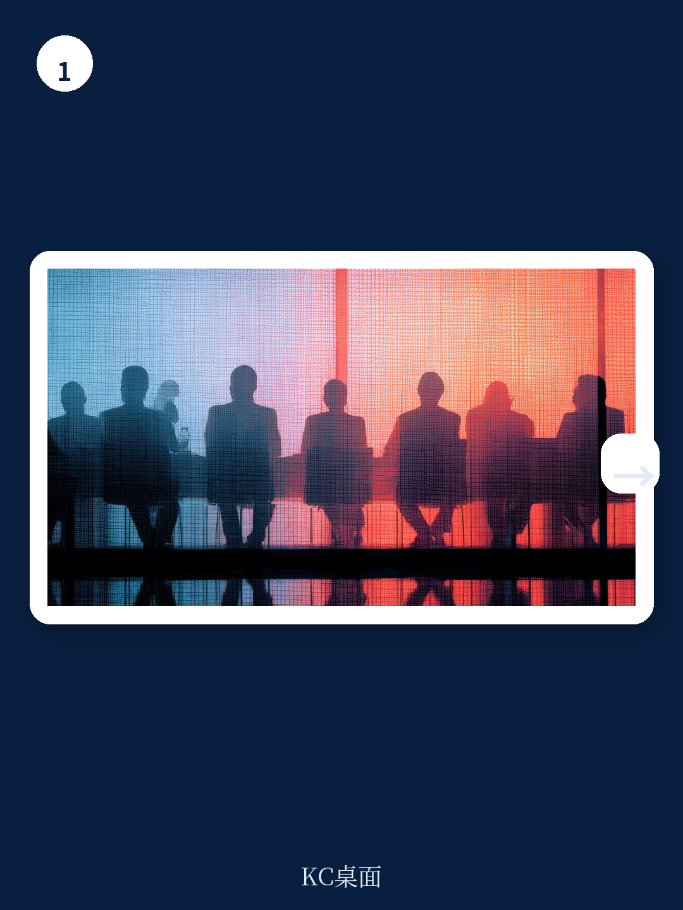
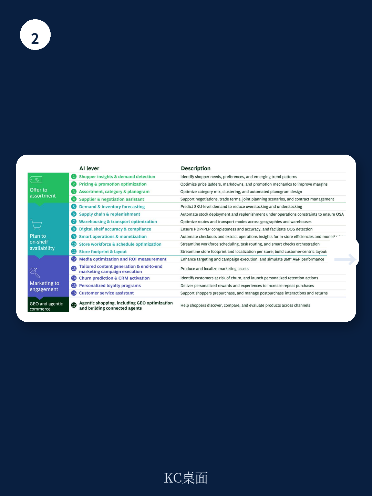

# 波士顿咨询：CPG与零售的AI竞赛，赢家已经拉开差距

AI在消费行业的渗透已经不是新闻。真正值得关注的问题是：为什么有些公司已经将AI转化为实实在在的利润率提升，而绝大多数还在“试点泥潭”里打转？

波士顿咨询与消费品论坛联合发布的最新报告，基于对39位CPG和零售高管的调研，给出了一个方向性的判断：**行业正在加速分化，赢家与追赶者的差距不是由技术投入规模决定的，而是由“AI能否嵌入核心商业决策流程”决定的。**

这份报告最值得关注的信号不是AI的应用场景清单，而是两个关键数字：**CPG公司如果规模化部署全部相关AI应用，可以带来220至350个基点的EBIT提升；零售商对应的数字是180至360个基点。** 在消费行业利润率普遍承压的当下，这个量级意味着AI不再是锦上添花的效率工具，而是决定未来5年竞争格局的结构性变量。

问题是，大多数公司离这个价值池还很远。

> **KC评论：** 报告给出的EBIT提升区间是“假设所有相关AI应用都规模化部署”的理论值。现实是，75%的CPG公司仍停留在试点阶段。这意味着，率先突破规模化瓶颈的公司将获得不对称的竞争优势，而追赶者会陷入“越试点越焦虑”的困境。完整报告中有这些价值池的详细拆解，包括每个AI应用的具体EBIT贡献测算，值得仔细研究。

## 1. 零售业已出现“两速世界”，CPG还在试点泥潭中挣扎

报告最直观的发现是行业成熟度的严重分化。

在零售样本中，45%的公司已经进入规模化部署阶段，但同样有40%的公司几乎还没开始。这种“两头大、中间小”的分布说明零售业已经形成了清晰的分水岭。领先者没有在所有领域平均用力，而是集中资源在需求预测、补货、定价和运输优化这几个价值最容易验证的环节。

CPG的情况更令人担忧。**76%的受访公司仍处于探索和试点阶段，只有18%实现了规模化影响。** 这组数字揭示了一个结构性矛盾：CPG公司的品牌和品类结构通常比零售商更复杂，AI应用场景更多元，但这也意味着他们更容易陷入“到处试点、处处难规模化”的困境。

报告没有直接点明，但我们可以推断：**CPG的规模化瓶颈可能比零售更严重，因为CPG的商业决策链条更长，涉及研发、供应链、营销、渠道等多个环节的协同。**

> **KC评论：** 报告样本量有限，但方向性信号很清晰。零售业之所以领先，部分原因是零售的决策场景更标准化（补货、定价、库存管理），AI更容易嵌入。CPG的创新流程、品牌建设、渠道管理更加碎片化，这是规模化更难的根本原因。完整报告中有CPG和零售的AI应用全景图，分别列出了17个具体应用场景及描述，可以帮助你对照判断自己公司在哪些环节有差距。

## 2. 价值最大的地方，投入反而最少——战略错配是最大障碍

报告揭示了一个令人不安的错配：**公司认为最重要的战略流程，恰恰是AI投入最少的环节。**

在CPG受访者中，几乎一半将“从概念到上市”列为首要战略流程，但只有11%在创新领域部署了AI。零售商同样如此：46%认为“从选品到品类规划”最关键，但只有34%在该领域实现了AI规模化。

这种错配有合理的解释。早期AI项目通常选择数据最丰富、流程最标准化、风险最可控的领域。但久而久之，就会形成一个“容易做”的AI项目组合，而不是“应该做”的战略性组合。

报告给出的建议很直接：**赢家会先收窄议程，再加速执行。** 他们不会试图在所有环节同时推进AI，而是聚焦于少数几个公司决心要赢的核心商业流程——比如更快的创新、更精准的需求感知、更好的货架可得性、更相关的品类组合。

这个建议听起来简单，但执行起来极其困难。因为它要求CEO和领导层做出明确的取舍：哪些流程是“必须赢”的，哪些可以暂时放一放。在AI热潮中，敢于说“不”的公司反而更容易跑出来。

## 3. 从“副驾驶”到“自动驾驶”：赢家的野心跑在能力前面

报告使用了一个形象的比喻来区分AI的应用深度：**copilot（副驾驶）和autopilot（自动驾驶）。** 在copilot模式下，AI提供洞察，人类做最终决策；在autopilot模式下，AI在预设的护栏内自主执行，人类只负责管理例外情况。

目前，67%的受访公司仍停留在copilot模式，只有9%进入了autopilot。报告认为，**需求预测等部分流程已经具备autopilot的条件。** 领先者会主动将野心设定在当前能力之上：如果今天只能实现20%的改善，他们就会测试需要什么样的数据、流程和组织变革才能在未来18到24个月内达到30%到40%。

这里有一个容易被忽视的洞察：**野心本身是一个竞争变量。** 当大多数公司还在“根据现有能力设定目标”时，那些“根据目标倒推能力建设”的公司会获得先发优势。报告没有明说，但我们可以推断：在AI能力快速迭代的阶段，保守的ROI测算方法可能会让公司错失窗口期。

> **KC评论：** 从copilot到autopilot的跨越，本质上是信任机制的建立。这需要数据质量、模型可靠性、异常处理流程都达到一定标准。报告提到只有9%的公司进入了autopilot，说明绝大多数公司还在解决“让AI可信”的问题。完整报告中有关于如何建立AI治理框架的建议，包括风险控制、成本管理和合规要求，这些是进入autopilot的前提条件。

## 4. 测量是最大的薄弱环节，也是破局的关键

报告揭示了一个反常识的现象：**超过一半的受访公司没有正式衡量AI投资的ROI。** 而衡量了ROI的公司中，表现最好的实现了2到5倍的回报。

没有测量，就没有规模化。这是报告传递的核心逻辑。

为什么测量这么难？报告给出了两个结构性原因。第一，在真实的商业环境中，AI改善的决策同时受到季节性、供应约束、竞争对手行动和消费者需求变化的影响，很难将AI的贡献单独剥离出来。第二，很多试点只跟踪活动指标（比如使用率、采纳率），而不建立清晰的基线和规模化阈值。

报告提供了一个值得借鉴的做法：**一家领先公司在试点启动前，就让财务和业务团队共同构建了完整的商业案例，包括价值规模、ROI和关键领先指标。** 关键在于对现状的深度量化——团队绘制了当前工作流程，量化了时间和精力在整个过程中的分布，以此作为衡量改善的基线。这创造了一个“信心循环”：基线让测量可信，试点证据优化了价值判断，每个阶段更新都增强了规模化决策的信心。

这个案例说明，**测量的难点不在于技术，而在于治理。** 谁在试点启动前就建立了测量框架，谁就能在规模化决策时拥有主动权。

## 5. 报告没有完全回答的问题：跨企业协作的“最后一公里”

报告提出了一个前瞻性的判断：**AI的下一个价值前沿可能需要合法的、自愿的、适当治理的跨企业协作。** 更好的补货、更智能的促销规划、更相关的个性化推荐，都可以通过CPG、零售商和平台之间在合法框架下的数据共享来实现。

但报告也坦诚，受访高管对AI是否会创造协作机会、还是会加剧竞争、还是不确定性太大，观点存在明显分歧。

这可能是整份报告中最值得关注的未解问题。**跨企业数据共享的法律框架、利益分配机制、信任建立过程，这些都不是纯技术问题，而是商业设计和治理能力的问题。** 目前，大多数公司连内部的数据孤岛都没打通，更不用说与外部合作伙伴共享数据了。

> **KC评论：** 报告提到“自愿的、合法的、适当治理的跨企业协作”，但实操层面的挑战远超技术范围。比如，数据共享的价值如何量化？利益如何分配？一方投入数据后，另一方是否有动机“搭便车”？这些问题在完整报告中没有展开，但恰恰是决定AI能否从“企业内部效率工具”进化为“行业级价值创造引擎”的关键。加入社群后，我们会持续跟踪这个方向的进展，包括BCG后续可能发布的相关研究。

## 结语：AI竞赛的核心不是技术，而是选择

这份报告最值得记住的结论是：**AI的竞争壁垒不在技术本身，而在“选择”的能力。** 选择聚焦哪个商业流程，选择设定多高的野心，选择如何测量价值，选择与谁协作——这些战略选择的质量，决定了AI投入最终是变成成本中心还是利润引擎。

对于消费行业的决策者来说，现在需要回答的不是“我们要不要用AI”，而是“我们要在哪几个环节用AI，以及我们愿意为规模化付出什么代价”。

**报告中没有完全展开的，是这些选择背后的组织变革成本。** 从copilot到autopilot，从单点试点到全链条部署，从内部优化到跨企业协作——每一步都涉及工作方式的根本改变。这些改变的成本和风险，可能比技术投入本身更大。而这，正是我们在社群中持续探讨的方向。

---

``

Personal reading notes and learning share only. Not investment advice.

