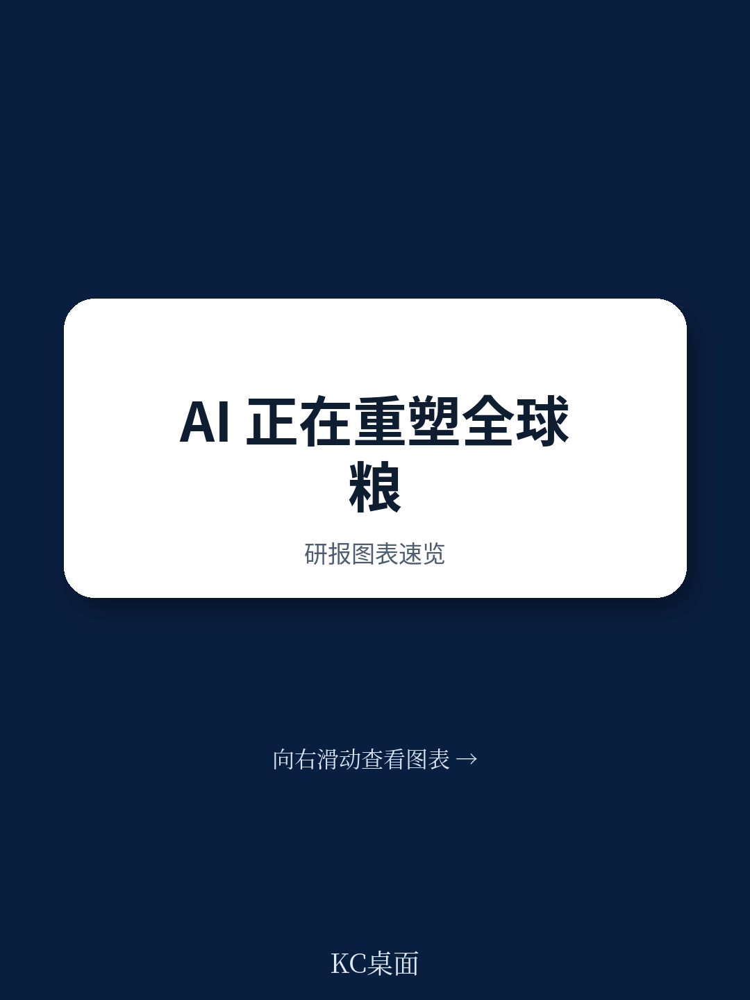
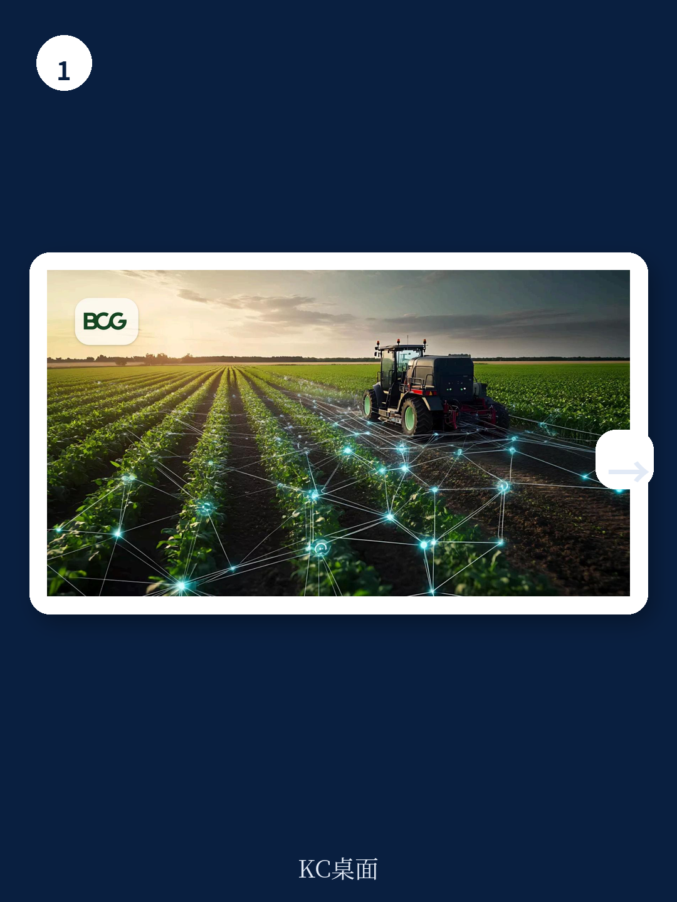

# 波士顿咨询：农业AI不是新工具，而是新氮气时刻

当1898年英国科学家克鲁克斯爵士警告世界氮肥即将枯竭时，他预言的是农业的一场硬约束危机。11年后哈伯找到了从空气中固氮的方法，博世将其工业化。那一次技术突破之所以重塑了全球食物体系，不是因为解决了一个具体问题，而是因为它解除了农业增长的上限，引发了一整条创新链的连锁反应：种子遗传学、机械化、农艺学，每一层都在前一层的基础上叠加，最终改变了人类如何种地、如何交易、如何吃饭。

波士顿咨询在2026年6月发布的最新研报中提出了一个判断：今天我们正在面对农业的第二个“氮气时刻”。但这一次的上限不是化学元素，而是信息与决策的密度。农业智能——即AI在从育种到零售的全链条上的自主决策能力——正在以同样的方式解除农业增长的另一重硬约束。

**这份报告最值得看的判断是：农业AI压缩的不是成本，而是信息不对称和专家溢价。过去一百多年支撑农业价值链上各环节利润来源的核心资产——谁更懂、谁先知道、谁能判断——正在被重新定价。这不是效率改进，是竞争基础的重写。**

## 1. 农业面临的三重威胁中，AI是唯一同时回应三者的变量

波士顿咨询将当前全球农业食物体系面临的威胁归纳为三类：气候波动性、地缘政治重组、以及监管范式转移。这三者不是独立的风险清单，它们共同指向同一个问题：农业的生产函数正在变得不可预测。

气候让降水、温度和季节规律变得不可靠。地缘政治让供应链冲击从偶发事件变成永久特征——中美关税、乌克兰战争、霍尔木兹海峡的化肥供应中断，这些不再是黑天鹅，而是新常态。监管则要求整个行业建立一个从未有过的数据基础设施：欧盟的森林砍伐规则、Scope 3碳报告、碳市场协议，都在要求企业精确、可验证地回答“每一粒粮食从哪里来、在什么条件下种出来的、用了什么方法”。

这三个威胁有一个共同点：它们都需要更快的感知、更准的判断、更自动化的执行。而这正是农业智能能够提供的。波士顿咨询把农业智能定义为“使用代理型AI在每一个环节自主决策，最小化人工交接”。它不是过去二十年精准农业的升级版，而是让系统在田间、在交易台、在育种实验室里代替人类行动。

> **KC评论：** 把农业AI理解为“帮农民省点化肥”或者“提高产量5%”是错的。波士顿咨询的框架告诉我们，AI解决的根本问题是：在气候、地缘、监管三重不确定性叠加的环境下，过去靠经验、靠关系、靠信息差建立的竞争优势还能维持多久？答案是不久了。完整报告里有一张图清晰地展示了每个环节的竞争溢价正在被压缩的速度——那个图值得每一个农业决策者仔细看。

## 2. 信息不对称的溢价正在以肉眼可见的速度消失

波士顿咨询在报告中描绘了一个核心图景：农业智能正在从六个方向改变竞争格局，而每一个方向上，压缩得最快的是“建议溢价”。

以农民端为例。过去，一个农民要获得顶级的田间管理建议，需要依赖农技推广员或作物科学家。这种面对面服务每次的成本大约是35美元。现在，AI工具FarmerChat已经在非洲、印度和巴西服务了超过83万农民，回答了500万个问题，单次交互成本降至35美分。这不是渐进式改进，是两个数量级的压缩。

更关键的是，当AI建议的质量已经可以匹敌最好的作物科学家时，农民不再需要为“专家的时间”付费。他们只需要一个智能手机和一个基础订阅。这意味着过去依赖专业知识和地域覆盖建立壁垒的农业服务商，其核心护城河正在消融。

波士顿咨询还点出了一个更微妙的动态：农民正在迅速意识到自己的数据值多少钱。他们既是气候波动最直接的暴露者，也是新传感基础设施最密集的监视对象。当农民自己可以通过AI工具直接从自己的数据中获得价值时，他们为什么还要把数据免费交给上游企业？

> **KC评论：** 很多农业科技公司都在讲“帮农民做决策”，但波士顿咨询的洞察是：谁先帮农民自己用好自己的数据，谁就赢了数据基础设施的竞赛。农民不是不会用数据，而是过去没有工具。现在AI给了他们工具，问题变成了：你是在帮他们建工具，还是在等着收他们的数据租？报告里对“农民数据问题”的分析非常透彻——它本质上是一个信任问题，不是技术问题。

## 3. 每个环节的“赢家逻辑”都在被重写

波士顿咨询对价值链上六个环节的逐一分析，是这份报告最值得反复读的部分。它不是在讲“AI会改变农业”这种空话，而是具体到每一个角色的利润来源正在被什么力量侵蚀、以及新的竞争优势可能从哪里长出来。

**种子和投入品公司**的利润来自专利保护的知识产权和农艺建议。波士顿咨询认为，专利分子本身可能仍然安全，但AI正在打开性状发现和研发的新战场——拜耳在2025年提交登记的Icafolin除草剂，就是第一个完全用AI设计候选分子、而不是筛选数千种化合物的作物保护产品。这意味着研发的“速度溢价”正在从大公司向更灵活的AI驱动者转移。

**农机设备制造商**的资产是每台拖拉机、收割机产生的运营数据。波士顿咨询的判断是：这些数据是真实且可防御的资产，但风险在于，过去锁定客户的切换成本正在从硬件迁移到AI驱动的软件上。当作物洞察越来越独立于拖拉机品牌时，农民为什么要忠于某个颜色的铁皮？

**贸易商和交易商**是信息不对称的最大受益者。他们知道哪个农民有粮、有多少粮，同时拥有全球供需流动的视野。但波士顿咨询的警告很直接：这种溢价正在被压缩，因为实时市场数据、AI生成的分析和卫星监测正在深入到系统的每一个角落。最敏锐的玩家已经在用AI把自己推到情报链条的上游。

**食品公司和零售商**过去靠需求信号不对称赚钱——知道消费者想要什么，上游却看不到。现在，农业智能让每一层价值链都拥有了更好的预测能力、更细粒度的供应链可见性、以及验证食品安全和来源的新工具。同时，AI加速的替代蛋白和精密发酵，可能在中长期重塑大宗商品加工依赖的原材料经济。

## 4. 报告没有完全回答的问题：谁将组装“闭环智能”

波士顿咨询提出了农业智能的四个维度：感知、决策、行动、创造。它强调这不是一个层级结构，而是一个网络——感知的数据基础设施让决策更准，决策的质量让行动更有效，行动产生的数据又反过来增强感知和创造。

但报告对于“谁将组装这个闭环”的问题，保持了谨慎。它指出，当前农民从一家买田间侦察服务，从另一家买肥料和植保，从第三家买种子建议——这种碎片化模式正在受到两股力量的挤压：一是AI采购系统会透明地跨供应商比价，压缩批发到零售的利润；二是可能出现整合的、全季节的智能系统，把感知、决策、行动打包成一个闭环。

**谁先组装出这个闭环，谁就能重新定义价值主张。** 但报告没有明确说这个角色会是谁。可能是农机公司（因为他们离物理操作最近），可能是投入品公司（因为他们有最深的数据积累），也可能是完全新进入的科技平台。

> **KC评论：** 这是整份报告最值得追问的问题。波士顿咨询给出了一个清晰的框架，但没有给出答案——因为它确实还没有答案。谁能先解决“农民数据问题”，谁能把四个维度真正打通，谁就能在下一轮竞争中占据结构性优势。完整报告里有关于每个维度的具体案例和失败教训，这些细节对于判断谁更有机会组装闭环至关重要。

## 5. 决策者应该问自己的三个问题

波士顿咨询在报告末尾给出了三个问题，表面上是在问“你的领导团队应该问什么”，实际上是在定义下一轮竞争的门槛。

**战略问题：** 你商业模式中哪一部分是建立在“你知道但对手不知道”的基础上的？不要说“关系”或“规模”，要精确说出那个具体的信息或专业优势。然后诚实地回答：当AI民主化知识层、气候波动侵蚀历史模式、地缘政治惩罚最慢的替代者时，这个优势还在吗？

**数据问题：** 你解决了农民数据问题吗，还是假设别人会解决？当前系统是碎片化的、小规模的。这本质上是一个信任问题。农民已经可以直接从自己的数据中获得价值，你还在等什么？

**运营问题：** 你把农业智能当作一个漂亮的功能，还是正在围绕它重构核心运营？你的公司里有没有人能清楚地看到这个时刻意味着什么？

这三个问题指向同一个核心判断：农业的“新氮气窗口”已经打开，但它不会一直开着。那些先行动的人将获得复合优势，后来者可能无法抄近路。

---

波士顿咨询的报告提供了一个少见的、结构清晰的战略框架。它没有回避不确定性，而是把不确定性转化为可追问的问题。对于农业价值链上的每一个决策者来说，真正的问题不是“AI会不会改变农业”，而是“当改变发生时，你是在重组者一边，还是在被重组者一边”。

这份报告对每个环节的利润来源、AI对每个角色的具体影响、以及四个维度的互动机制都有更详细的图表和案例分析。加入社群，每天由AI agent和人工review生成国际投行中文摘要与KC评论，daily更新，约10-40页，包含当天最新数据图表合集，既方便喂给AI，也方便人工快速把握市场动态。我们将针对波士顿咨询这份报告进行深度拆解，包括所有原始图表和未在本文中展开的竞争分析细节。

Personal reading notes and learning share only. Not investment advice.

