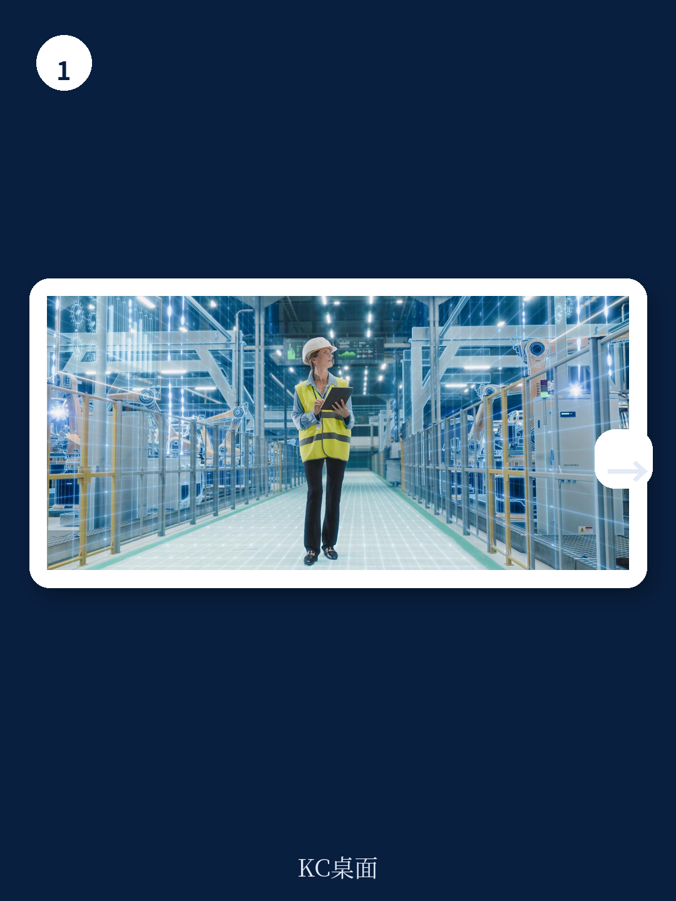
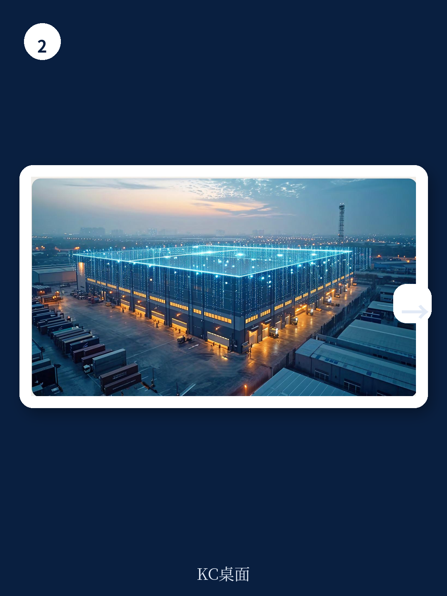

# 波士顿咨询：AI正在重置全球制造业的选址逻辑，高成本国家并非必然输家

当全球制造业CEO们还在争论“要不要把工厂搬出中国”时，一份来自波士顿咨询（BCG）的最新研报提出了一个更具颠覆性的判断：真正决定制造业竞争力的变量，已经从“哪里劳动力最便宜”变成了“哪里能最快部署未来工厂”。

这不是一个渐进式的优化建议。BCG的量化模型显示，在食品加工领域，一家德国工厂通过部署未来工厂（FoF）能力，可以比搬到中国获得高达14个百分点的成本优势。而在电子行业，即便完成同样的智能化改造，留在德国依然比搬到中国贵15个百分点。

差异如此悬殊，意味着过去二十年支撑全球供应链布局的底层逻辑——劳动力成本套利——正在被改写。未来工厂不是锦上添花的效率工具，而是重新划分全球制造业版图的力量。

BCG这份报告基于对1000家制造商的全球调研、42个成本与定性因素的复合指数，以及横跨54个国家、47个行业的竞争力评分模型。它给出的不是笼统的“回岸制造”或“AI赋能”口号，而是一套可量化的决策框架：哪些行业、哪些地区、在什么条件下，升级工厂能打败搬迁。

以下是这份报告最值得关注的五个核心洞察。

## 1. 未来工厂对高成本地区的成本压缩幅度，远超多数CEO的预期

BCG的三个典型案例揭示了未来工厂的真实威力。一家德国咖啡烘焙包装公司，通过自动化、智能过程控制、预测性维护和集中数据协调，劳动力成本下降近60%，总转换成本下降超过40个百分点。一家美国制药公司，在片剂和胶囊制造中整合数字过程控制、物联网监控、高级分析和数字质量管控，劳动力成本降低超过60%，总转换成本下降30个百分点。一家韩国电池制造公司，通过连续混合、优化涂布和AI质量控制，劳动力成本降低约30%，转换成本下降超过25个百分点。

这些数字意味着什么？未来工厂不是在现有生产线上叠加几个AI用例，而是从端到端重新设计生产流程，让自动化、AI、模拟仿真三者形成叠加效应。当一个环节的效率提升会放大另一个环节的收益时，成本结构就发生了质变。

> **KC评论：** 这些案例对读者的启示是，未来工厂的成本节省并非均匀分布。劳动力成本越高的地区，自动化带来的绝对节省越大。这正是高成本国家可以反击低劳动力成本国家的底层逻辑。完整报告中还包含了按行业、按地区细分的成本压缩对比图表，能帮你判断自己所在的赛道是否具备这种“逆袭”潜力。

## 2. 关税不是护城河，真正的护城河是能否把规模转化为议价权

BCG的全球调研揭示了一个关键阈值：25%的关税足以让90%制造商的出口业务不经济。这听起来像是贸易保护主义为本地制造商赢得了喘息空间。

但报告的警示更具深意：关税保护不是竞争力的替代品。它可能延迟投资先进生产系统的压力，但不会消除这种压力。依赖关税保护却不升级运营的企业，面临一个复合风险——生产成本持续高于那些在其他地方投资未来工厂的同行。一旦贸易政策条件变化，这种成本劣势会瞬间暴露，几乎没有时间应对。

换句话说，关税是缓冲垫，不是增长引擎。真正决定长期竞争力的，是企业能否把规模优势转化为议价权——对供应商的议价权、对客户的议价权、对人才的议价权。未来工厂恰恰是放大这种转化效率的工具。

## 3. 投资回收期的地域差异，正在改变“在哪里建厂”的决策逻辑

BCG的一个测算可能让很多CEO重新审视选址：在汽车行业，部署未来工厂自动化后，高成本国家的投资回收期显著短于低成本国家。以美国为基准，其他高成本国家的回收期大致相当，而在低成本市场，同样的部署可能需要2到8倍的时间才能收回投资。

原因并不复杂。自动化减少的是绝对劳动力成本，而非比例。在高工资国家，每减少一个单位劳动力，产生的绝对节省更大。因此，同样的自动化投资，在高成本地区的财务回报更快。

但这并不意味着工资最高的地区总是最优选择。报告指出，在欧洲部分地区，较高的劳动力重组成本——如遣散费、通知期和实施摩擦——会部分抵消相对于美国的优势。企业犹豫投资，因为减少劳动力会立即产生真实的、可见的成本，抵消了未来的节省。

> **KC评论：** 投资回收期的差异是这份报告中最具实操价值的数据之一。它直接回答了CEO们最关心的问题：“我花这笔钱，多久能赚回来？”完整报告中包含了按国家、按行业的回收期对比表，以及考虑劳动力重组成本后的调整模型。这些数据对于正在做资本支出预算的决策者来说，几乎是必读的。

## 4. 中国的位置比多数人想象的更复杂——不是单纯的“成本优势消失”

在BCG的分析框架中，中国的角色并非简单的“成本优势正在消失”。报告指出，未来工厂为中国提供了捍卫其竞争地位的显著机会。虽然自动化缩小了中国相对于高成本地区的成本优势——特别是在物流、关税和需求邻近性起更大作用的行业，如食品——但在其他行业，中国的优势得以维持。这在设备制造和电气电子设备领域尤为显著。

此外，未来工厂通过缩小劳动力成本差距，增强了中国相对于南亚和东南亚的竞争地位。中国已经在大力投资未来工厂技术，以维持其在全球制造网络中的核心角色。

这意味着，中国面临的是双重挤压：来自高成本地区的“回岸制造”压力，以及来自南亚和东南亚的“成本替代”压力。但未来工厂是中国应对这两种压力的工具，而非威胁。

## 5. 报告尚未完全回答的关键问题：未来工厂的“软实力”差距如何弥合

BCG对各国未来工厂部署的“定性准备度”进行了评分，结果并不令人意外：美国领先，德国紧随其后，日韩紧随其后，中国和西欧国家处于中游，而墨西哥、印度、摩洛哥等国得分较低。

但报告承认，这些定性因素——特别是人才和数字基础设施——是未来工厂能否真正转化为竞争优势的前提。87%的受访制造商表示，获取人才和技能对未来工厂部署变得更为关键。69%表示基础设施同样重要，其中数字基础设施被视为最关键的部分。

这里存在一个尚未被充分回答的问题：对于定性准备度较低的国家，未来工厂的投资回报是否会被人才和基础设施瓶颈所抵消？BCG的模型假设这些因素可以被克服，但现实中，培养一支能够操作AI驱动生产线的劳动力队伍，可能需要5到10年。在这期间，先行者的优势可能已经固化为不可逾越的壁垒。

## 如何用这份报告更新你的观察框架

对于制造业CEO和产业决策者，这份报告提供了三个可以立即使用的决策维度：

第一，重新定义“低成本”。不要只看劳动力成本，要看“总转换成本+物流+关税”的完整公式。未来工厂可能让高成本地区的总成本变得有竞争力。

第二，区分“可自动化”与“不可自动化”的价值链环节。报告中的行业差异表明，自动化潜力越高的行业，高成本地区的反击机会越大。劳动密集型、物流成本占比高的行业，邻近市场的优势更显著。

第三，关注“投资回收期”而非“初始投资额”。同样一笔自动化投资，在不同地区的回收期可能相差数倍。这直接决定了资本配置的效率。

这份报告的完整版包含了54个国家的制造业竞争力指数、47个行业的具体评分、以及按资产类型（新建工厂 vs 现有工厂）和投资类型（绿地投资 vs 棕地投资）细分的决策树。这些数据对于正在制定全球产能布局的企业来说，几乎是一套可操作的地图。

但报告也有其局限性。它没有充分展开的是：未来工厂的部署速度如何受制于组织变革能力？在人才短缺的背景下，企业如何确保投资不被“人”的瓶颈所拖累？这些问题的答案，可能比技术本身更能决定谁是赢家。

我们会在社群中继续讨论这些未解问题。每天，我们的AI agent会结合人工review，从BCG、麦肯锡、高盛等国际投行和咨询机构的最新报告中提取核心判断，生成约10-40页的中文摘要与KC评论。这些内容既方便喂给AI做二次分析，也方便人工快速把握市场动态。加入社群，你可以获取这份报告的完整解读与原始图表，以及每日更新的国际投行研报精华。

Personal reading notes and learning share only. Not investment advice.

