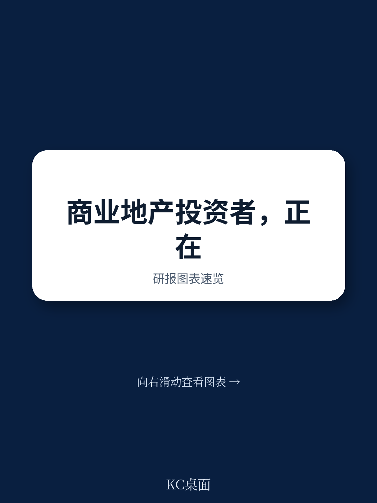
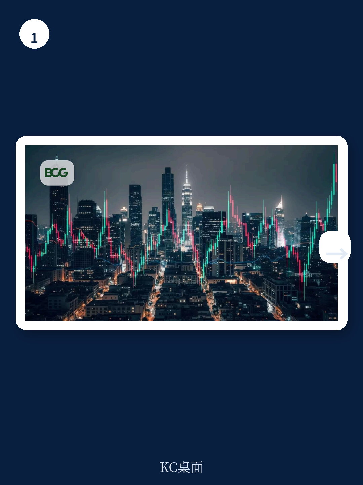
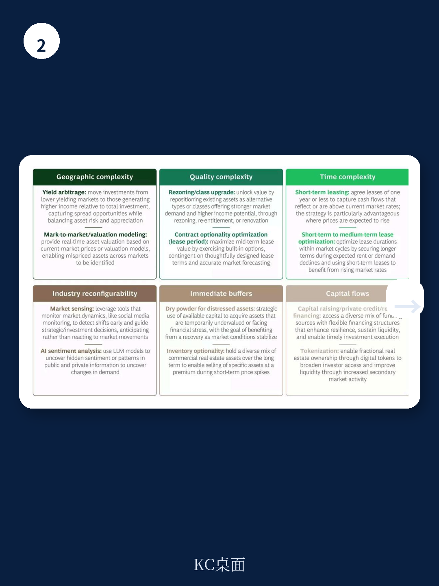

# 波士顿咨询：商业地产正在错过每年2000亿美元的“暗价值”

商业地产行业正站在一个十字路口。一边是延续数十年的“买入并持有”传统模式，另一边是每年高达2000亿美元的潜在收益增量——相当于行业年回报率提升三分之一。波士顿咨询(BCG)在最新发布的研报中提出了一个尖锐的判断：大部分商业地产投资者正在系统性地错过短中期优化带来的价值，而问题不在于信息不足，而在于思维方式与运营模式的代际落后。

这份报告的核心洞察，用一个物理学比喻来概括——“暗价值”。就像暗物质无法被直接观测但其引力效应真实存在一样，商业地产中因僵化的持有策略而损失的价值也无法被传统报表捕捉，但它正在每年吞噬2000亿美元。BCG的结论是：学会像大宗商品交易商那样思考，是解锁这笔价值的关键。

为什么是现在？因为AI正在以前所未有的速度降低数据分析和市场扫描的成本。那些曾经只有顶级对冲基金才能负担的实时定价模型、套利识别工具和供需预测系统，如今已经变得触手可及。但行业的态度却远远落后于技术的变化。

## 1. 行业最大的敌人不是市场波动，而是根深蒂固的“持有惰性”

商业地产的长期持有模式并非没有道理。对于养老基金、保险公司等机构投资者而言，稳定的现金流、通胀对冲和分散化配置是核心诉求。BCG的数据显示，即便是在流动性最好的美国市场，自2000年以来，54%的投资者平均持有资产超过五年。在欧洲和亚洲，这一比例更高。全球约60%的商业地产资本配置在“核心”或“核心+”策略上，目标就是可预测的长期收益。

但这种合理性正在变成一种“持有惰性”。问题不在于长期持有本身，而在于持有期间几乎完全放弃了主动管理的机会。报告指出，大多数投资者仍然以年度为单位进行资产估值，决策流程缓慢且层级化，面对市场信号的反应周期以季度甚至年度计算。这种节奏在利率稳定、资产价格单边上涨的环境下或许可行，但在一个利率波动加剧、资产价格分化、技术驱动的套利窗口转瞬即逝的时代，这种模式正在产生巨大的隐性成本。

> **KC评论：** 这里的关键不是否定长期持有，而是指出“持有期间不管理”的损失。BCG的测算表明，如果投资者在持有期内引入更动态的估值频率和策略调整，年化回报可以提升3到5个百分点。对于平均回报率约9%的商业地产而言，这意味着回报率跳升三分之一。这个数字本身就是一个强有力的行动信号。完整报告中包含按地区和资产类别拆分的回报提升潜力图表，值得仔细对照自身持仓。

## 2. 三分之二的行业高管承认，他们几乎没有使用优化策略

BCG对全球约500名高管进行的调查揭示了行业现状与潜力之间的巨大鸿沟。在商业地产领域，67%的高管表示，他们的组织只是“偶尔”或“从不”使用优化策略。这组数据与行业自我认知形成了鲜明反差——许多投资者认为自己已经在“积极管理”，但实际操作仍停留在“买入、持有、等待升值”的层面。

报告将“暗价值捕获”分为三个阶段：从第一阶段的“传统长期持有”（年度估值、被动等待），到第二阶段的“机会性捕获”（偶尔的资产翻转、月度估值尝试），再到第三阶段的“系统性捕获”（AI驱动的实时扫描、动态配置、多策略并行）。BCG的判断是，目前大部分参与者仍处于第一阶段或刚踏入第二阶段，而少数领先者已经接近第三阶段，并开始拉开差距。

值得注意的是，BCG明确指出，即使那些投资结构受限（例如开放式基金）的玩家，无法完全实现第三阶段的系统性捕获，也可以通过增加对“期权性”和“套利”的关注，在第二阶段就获得显著收益。这意味着，暗价值的捕获并非只有“全有或全无”两种选择。

## 3. 六大驱动因子：商业地产的“摩擦”正在变成套利机会

报告识别了六个可以驱动暗价值创造的领域，它们共同构成了一个新分析框架。这六个因子并非孤立存在，而是相互关联，形成一个系统性的价值捕获网络。

**地理套利**：同一类资产在不同区域市场表现迥异，这源于本地需求、定价权和竞争格局的差异。能够识别并快速配置资本到被低估或表现超预期的市场的投资者，可以获得地理层面的超额收益。

**质量套利**：商业地产的异质性——每一处物业的租户组合、租约条款、设施配置和风险特征都不同——使得资产间比较困难，估值也更为复杂。但对于拥有深度资产层面信息的投资者而言，这种异质性本身就是套利来源。能够比市场更准确评估资产真实质量的玩家，可以在定价错误时介入。

**时间套利**：长期租约锁定了未来数年的现金流，这限制了短期价格调整的灵活性。但通过将期权性嵌入租约结构——例如使用短期租约或优化租约条款——并预判市场周期，运营商可以捕获时间层面的套利机会。BCG特别提醒，长期租约提供了可预测的、可融资的收入，因此更短或更灵活的条款应当有选择性地评估，而非全面替代。

**行业可重构性**：高交易成本、复杂监管、长开发周期和信息不对称，使得商业地产参与者对供需信号的反应极为迟缓。这种“弱可重构性”在短期冲击（如利率急升）时会加剧资产价格波动，因为供给无法快速调整。但反过来，它也创造了利润机会——那些能够比市场更快重新配置资本或资产的玩家，可以在波动中获利。

**即时缓冲**：保留空间或资本作为缓冲的玩家可以捕获显著价值。报告举了一个数据中心的例子：当需求激增但超过90%的在建产能已被预订时，能够立即提供空间的玩家处于极其有利的位置。同样，积累了大量“干火药”的玩家，可以在资产折价出售时快速出手。

**资本流动**：商业地产通常有较强的融资渠道，特别是对于数据中心等新兴高需求资产。但资本的可获得性并不自动转化为竞争优势。真正的差异化在于资金来源的多元化，以及利用二级市场的部分所有权交易来改善流动性，从而在快速增长领域更快行动。

> **KC评论：** 这六个因子中，最容易被忽视的是“行业可重构性”和“即时缓冲”。多数投资者只关注资产本身的质量和地理位置，却很少思考“当市场出现短期冲击时，我的组织能否比别人快一步反应？”BCG在完整报告中提供了针对每个因子的具体杠杆清单和案例研究，包括如何构建缓冲资本、如何设计期权性租约等实操细节。这些内容对于希望从第一阶段跃升到第二阶段的投资者尤其有价值。

## 4. 报告没有完全回答的关键问题：文化变革的代价与路径

BCG坦率地指出了捕获暗价值的三大障碍：工具不足、文化保守、治理僵化。报告建议引入实时估值工具、改变风险态度、将决策权下放到一线团队，甚至建议设立一个“平行运作”的独立单元来承担短中期优化任务。

但这里存在一个报告没有完全展开的深层矛盾：商业地产的核心客户——机构投资者——之所以选择这个资产类别，恰恰是因为其“慢”和“稳”。如果基金开始像对冲基金那样频繁交易、快速调仓，是否会动摇LP（有限合伙人）对资产配置的信任？更关键的是，这种文化变革的代价是什么？引入AI工具、重建治理结构、重新设计激励机制，都需要巨大的前期投入和组织震荡。对于管理规模数百亿美元的机构而言，试错成本极高。

报告提到了“平行运作”作为解决方案，但没有深入讨论这种双轨制在实际运营中可能产生的内部摩擦：传统团队与暗价值团队如何分配资本？如何避免内部竞争导致整体回报被稀释？这些问题的答案，可能决定了这个策略是“真正的创新”还是“组织的负担”。

## 5. 一个实用观察框架：用三个问题重新审视你的投资组合

基于BCG的分析框架，投资者可以建立一个简单的自我诊断模型，快速评估自身捕获暗价值的潜力。

第一个问题：你的资产估值频率有多高？如果仍然按年度估值，那么你几乎一定在错过至少一个完整市场周期的套利窗口。月度估值是进入第二阶段的起点。

第二个问题：你的投资决策链条有多长？如果一个套利机会从识别到执行需要超过两周，那么你的组织架构可能已经构成了主要障碍。报告指出，决策权需要更靠近一线，暗价值团队应当作为独立的利润中心运作。

第三个问题：你拥有的数据是否在转化为竞争优势？大多数投资者拥有大量关于资产价值和收入流的数据，但这些数据往往分散在不同系统中，没有被整合和分析。AI降低了工具开发成本，但前提是组织愿意投入建立整合的数据基础设施。

这三个问题看似简单，但BCG的调查显示，大部分高管对前两个问题的回答是“否”，第三个问题的回答是“正在尝试”。这正是2000亿美元暗价值存在的根本原因。

## 6. 一个未被充分探讨的伏笔：AI究竟是赋能还是加剧竞争？

报告将AI视为降低工具成本、使暗价值捕获变得可行的关键因素。但一个更深层的问题浮现出来：当所有主要玩家都开始使用AI驱动的实时估值和套利识别工具时，套利空间本身会不会迅速消失？换句话说，暗价值的捕获窗口可能比预期更短。

大宗商品交易市场的发展历程提供了一个参照：高频交易和算法套利使得传统套利空间急剧压缩，最终只有拥有最快系统和最低延迟的玩家才能获利。商业地产的资产异质性和高交易成本可能在短期内保护套利空间，但随着AI工具的普及，这种保护不会持久。

BCG在报告中暗示，数据将成为新的差异化因素——谁拥有更独特、更细颗粒度的资产层面数据，谁就能在AI竞争中保持优势。但报告没有展开的是，这种数据优势的构建需要多长时间，以及是否已经被少数领先者锁定。

这些未解问题，恰恰是这篇报告最值得继续深读的部分。完整的BCG报告包含了按资产类别和地区拆分的回报提升潜力模型、六大驱动因子的具体操作杠杆清单，以及三个阶段的详细转型路线图。对于正在思考如何调整商业地产投资策略的决策者而言，这些细节比结论本身更有价值。

---

如果你想获得这份BCG报告的完整中文解读、原始图表，以及每日更新的国际投行研报摘要与KC评论，欢迎加入我们的社群。每天，我们通过AI agent与人工review结合的方式，精选并解读高盛、摩根士丹利、摩根大通、波士顿咨询等顶级机构的研报，生成约10-40页的中文摘要与数据合集。这些内容既方便喂给AI进行二次分析，也方便你快速把握全球市场的动态变化。在社群中，我们还会对这篇报告中未完全展开的“文化变革代价”“AI竞争加剧”等问题进行持续讨论。

Personal reading notes and learning share only. Not investment advice.

