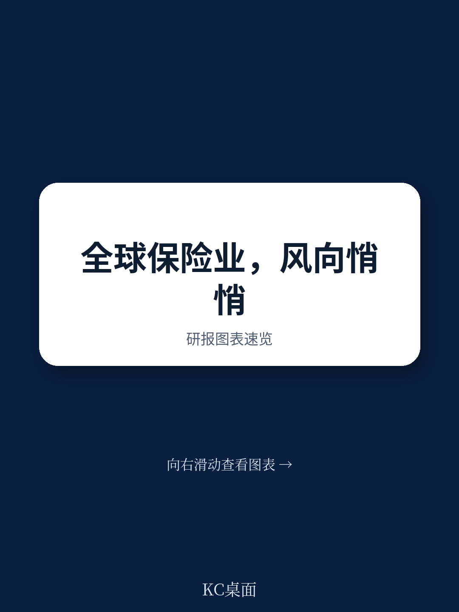

# 波士顿咨询：保险业正在经历一次投资者偏好的结构性转向

全球保险业在过去五年里交出了一份让股东满意的答卷。15%的年化总股东回报率，自2017年以来首次超过了行业自身的股权成本。这组数据本身并不令人意外，毕竟疫情后的复苏、利率环境的改善都在推高收益。但波士顿咨询在刚刚发布的《2026保险价值创造者报告》中揭示了一个更值得关注的变化：投资者正在系统性地从财产与意外险和再保险转向人寿与健康和综合险，同时将资金从美国市场向欧洲和亚太迁移。

这不是一次短期的板块轮动。它背后是保险行业底层逻辑的松动——定价周期的拐点、技术渗透的加速、以及全球资本对“确定性”的重新定价。对于保险公司的管理层、投资者以及关注金融行业趋势的决策者而言，理解这个转向的驱动力和持续时间，比跟踪季度保费数字重要得多。

## 1. 行业整体回报改善背后，是“质”而非“量”的驱动

过去五年，全球保险业的年化TSR达到15%，高于整体市场平均水平。但波士顿咨询的这份早期报告明确指出，这个数字并非来自保费规模的扩张，而是来自两个结构性因素的叠加：疫情冲击逐步消退带来的赔付正常化，以及净投资收益率的显著提升。

这意味着行业增长的可持续性取决于利率环境和承保纪律。如果利率进入下行通道，而定价竞争重新加剧，15%的TSR可能难以维持。报告已经给出了一个早期信号：商业财产险的费率正在松动，这将在未来几年内压缩财产险公司的股本回报率。

> **KC评论：** 对于关注保险板块的投资者来说，核心问题不是“保险股还能不能涨”，而是“哪些细分赛道在利率下行周期中依然能维持回报率”。波士顿咨询的后续报告将提供区域和细分市场的详细拆解，这是完整报告的核心价值所在。

## 2. 财产险的定价周期拐点已至，但结构性风险更值得警惕

财产与意外险在过去五年是TSR表现最强的板块，这主要得益于疫情期间及之后多个险种费率持续攀升。但波士顿咨询观察到，费率动量正在减弱，尤其是美国个人车险市场已经出现竞争加剧的迹象。

更值得关注的不是短期的价格波动，而是两个长期结构性风险：一是责任险（casualty）中持续存在的承保损失压力，二是全球贸易流变化带来的风险敞口重塑。贸易摩擦、供应链重组正在改变企业财产险和货运险的风险分布，这对习惯于基于历史数据定价的传统保险公司构成了根本性挑战。

报告还提到，在费率走软的环境下，并购将成为保险公司提升回报的重要手段。这意味着未来几年行业集中度可能进一步上升，具备规模优势和管理能力的公司将在整合中占据主动。

## 3. 人寿与健康险正在成为新的“价值洼地”

如果说财产险是“利润正在被压缩的过去”，那么人寿与健康险可能就是“回报正在改善的未来”。波士顿咨询的数据显示，尽管L&H板块过去五年的TSR表现落后于P&C和再保险，但在2025年单年维度上，L&H和综合险已经实现了反超。

驱动因素主要有两个：一是净投资收入的强劲增长。利率上升的环境下，L&H公司持有的大量固定收益资产带来了更高的投资收益。二是产品结构的优化。老龄化社会和消费者偏好的变化，正在推动对带有保证收益和附加生活福利的混合型产品的需求增长。

> **KC评论：** 这个转向的逻辑很清晰——利率上升时，L&H公司的利差收益改善；利率下降时，其长期负债的折现率下降，准备金压力减轻。关键在于，利率变化对不同产品线的影响幅度和时滞不同。波士顿咨询报告中关于各区域L&H市场产品渗透率和利润率的数据图表，是理解这一转向深度的关键素材。

## 4. 欧洲和亚太正在承接从美国流出的“质量偏好”资金

波士顿咨询的报告揭示了一个显著的地理迁移：欧洲以20.3%的五年年化TSR成为表现最佳的区域，亚太和欧洲在2025年单年TSR分别达到35.3%和39.8%。报告将这一现象归因于投资者在美国宏观不确定性和股市波动背景下，寻求稳定回报的“质量偏好”迁移。

这种迁移并非盲目避险。欧洲保险公司在偿付能力监管框架下普遍维持了较高的资本充足率，而亚太市场受益于保险渗透率提升和中产阶级增长带来的长期需求。美国市场虽然规模最大，但贸易政策不确定性、通胀粘性以及责任险的诉讼环境恶化，正在削弱其吸引力。

> **KC评论：** 对于全球资产配置者来说，这个趋势意味着保险板块的投资逻辑正在从“选股”转向“选区域”。欧洲和亚太的保险股估值折价可能正在收窄，而美国P&C公司需要证明自己能在费率走软和风险上升的环境下维持回报率。波士顿咨询后续的亚太和再保险专题报告将提供更细致的区域竞争格局分析。

## 5. 报告尚未完全回答的关键问题：AI对承保利润率的影响有多深？

波士顿咨询指出，AI和AI代理的广泛应用将在承保、理赔、劳动力规划等核心功能上产生深远影响。但这份早期报告并未给出具体的量化分析——比如，AI能否真正降低损失率？自动化理赔能在多大程度上削减运营成本？这些问题的答案将决定下一轮行业竞争的分水岭。

目前来看，大型保险公司在数据和模型能力上的投入明显高于中小型公司，AI可能加速行业的两极分化。但承保本质上是对风险的定价，如果AI只是让所有公司都能更快地做出相同的定价决策，那么竞争反而会加剧，利润率可能进一步压缩。这一悖论值得所有从业者深思。

## 6. 投资者的观察框架：从“选公司”升级为“选赛道、选区域、选周期”

基于波士顿咨询这份报告的分析框架，决策者应该建立三个维度的观察体系：

第一，赛道维度：P&C的定价周期正在见顶，L&H的收益改善正在发生，再保险的资本回报在承保纪律松动前仍有支撑。不同赛道的回报拐点时间不同，需要动态调整配置。

第二，区域维度：欧洲和亚太的“质量溢价”能否持续，取决于这些市场的利率环境和监管稳定性。美国市场的吸引力恢复需要看到宏观不确定性降低和责任险改革取得进展。

第三，技术维度：AI的渗透速度将决定行业成本曲线的斜率。具备数据优势和模型能力的公司，将在承保利润率上拉开与同业的差距。

这三个维度不是孤立的，它们之间的交叉点才是真正的价值所在——比如，欧洲的L&H公司是否比美国的P&C公司更受益于AI？亚太的再保险公司是否能在贸易流变化中抓住新的定价机会？波士顿咨询的后续报告将逐一展开这些深度分析。

---

这份《2026保险价值创造者报告》只是系列的开篇。波士顿咨询在报告中预告，后续将发布美国P&C市场深度分析、亚太行业表现专题以及再保险趋势报告。这些内容将提供更细颗粒度的数据、案例和竞争格局拆解。

我们每天会由AI agent加上人工review，筛选和解读全球顶级投行和咨询机构的最新报告，生成中文摘要与KC评论，包含当天最新数据图表合集。这些材料既方便喂给AI做进一步分析，也方便人工快速把握市场动态。如果你希望获取完整报告原文、原始图表，或者想就保险行业的结构性转向做更深入的讨论，欢迎加入社群，我们每天都会更新国际投行和咨询机构的中文解读与原始数据图表。
