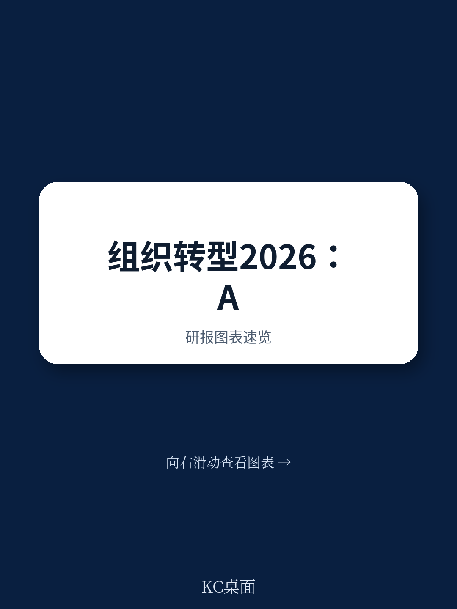
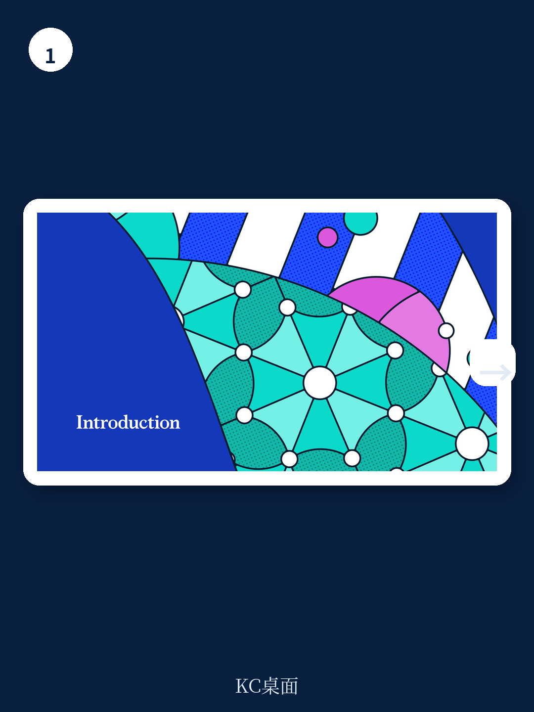
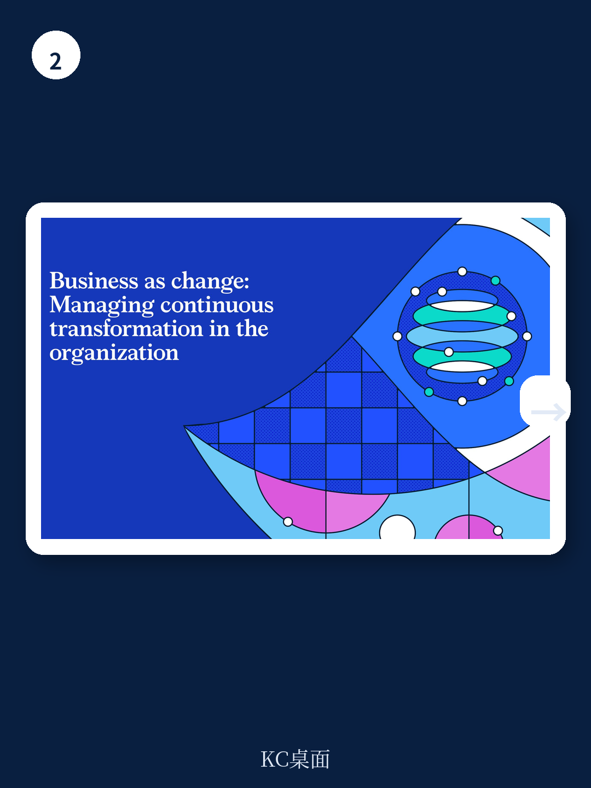

# 麦肯锡：88%企业试了AI，81%没赚到钱

2026年2月，麦肯锡发布了第二版《组织状态报告》（The State of Organizations 2026），基于对全球15个国家、16个行业、超过10,000名高管的调研。这份报告的核心判断，值得每一个产业决策者认真对待：**企业正面临技术、经济和劳动力三大结构性力量的叠加冲击，但绝大多数组织尚未准备好应对。**

报告最引人注目的数据是：88%的组织正在实验AI，但81%没有报告任何有意义的利润改善。这组数字背后，不是AI本身的问题，而是组织转型的滞后。麦肯锡的结论很直白——企业需要的不是“插电即用”的AI工具，而是一场“双重转型”：技术转型与组织转型同步推进。

这不仅仅是AI的问题。地缘政治碎片化、贸易格局重组、劳动力期望变化，都在迫使企业重新思考“如何组织工作”这个根本问题。报告提出了九大组织变革方向，但核心主线只有一个：**在不确定的世界里，持续绩效和价值创造，比短期收益更重要。**

---

## 1. AI落地的真正瓶颈不是技术，是组织

报告揭示了一个反直觉的事实：企业对AI的投入热情很高，但转化率极低。86%的领导者认为自己的组织在将AI融入日常运营方面准备不足。更关键的是，六分之一的组织没有明确的C级负责人来推动AI落地。

这意味着什么？AI战略在多数企业里仍处于“散点实验”阶段——某个团队用AI做客服，另一个团队用AI写报告，但没有人从全局视角重新设计端到端的业务流程。

> **KC评论：** 麦肯锡的报告里有一个值得反复咀嚼的细节——一位高管提到，在AI上每花1美元技术投入，就需要花5美元在“人”上。这5美元不是培训费，而是组织重构的成本。完整报告里有一张关于“AI代理如何与人类协作”的图表，展示了不同协作模式下的效率差异，值得仔细研究。

---

## 2. 地缘政治冲击下，企业需要“弹性向前”而非“弹性回归”

报告调查显示，近四分之三的受访者表示地缘政治不确定性对其组织产生了显著影响。43%的领导者承认，他们在资产剥离上“做得太晚或根本不该做却没做”。

麦肯锡提出的框架是“弹性向前”（bounce forward），而不是“弹性回归”（bounce back）。这意味着企业不能只想着恢复到过去的稳定状态，而要在新的地缘政治格局中找到新的竞争优势来源。贸易正在向更近的伙伴转移，企业需要在保持全球规模的同时，建立区域适应能力。

报告特别强调了技术在这方面的作用：数字平台、数据分析和AI可以帮助预测风险、重新分配资源、维持运营灵活性。但关键问题是——多数企业在这方面的能力建设才刚刚开始。

---

## 3. 生产力瓶颈的真正解法不在组织结构图里

三分之二的领导者认为自己的组织过于复杂和低效，但传统的应对方式——结构重组、成本削减、扁平化——正在产生递减的回报。麦肯锡的洞察是：**真正需要改变的，不是“谁向谁汇报”，而是“工作如何流动”。**

报告提出了“从结构到流程”（From structure to flow）的框架。企业需要从根本上简化和统一跨部门的流程，消除重复工作，同步信息流，精简决策流程，并尽可能实现自动化。这听起来像是常识，但报告数据显示，只有30%的组织能够实现企业范围内的资源重新配置。

> **KC评论：** 麦肯锡这里点出了一个很现实的矛盾——多数企业知道自己的流程有问题，但解决问题的工具（结构重组）已经失效了。完整报告里有一个关于“流程简化如何影响生产力”的详细拆解，包括具体的操作步骤和案例，对正在做组织优化的管理者有直接参考价值。

---

## 4. 可持续绩效的密码：关注核心，敢于放弃

报告指出，为了驱动增长，组织需要识别出能产生超常规影响的战略组合和绩效举措。这意味着要选择少数几个领域去做到极致，建立相应的治理和能力来执行这些优先事项，并动态地重新配置预算和人才。

但执行层面存在巨大落差：只有30%的组织能够实现企业范围内的资源重新配置。报告特别强调了“敢于放弃”的重要性——领导者需要创新的远见、优先级的纪律，以及剥离非核心业务的勇气。

这与麦肯锡一贯的“聚焦核心”主张一脉相承，但报告提供的新数据值得关注：那些成功实现资源重新配置的企业，其绩效优势正在扩大，而犹豫不决的企业正在被拉开差距。

---

## 5. 领导力正在被重新定义：从“向外指挥”到“向内生长”

报告中最具人文洞察的部分，是领导力章节。麦肯锡发现，在AI时代，领导者的角色正在发生根本性转变——领导他人意味着先领导自己。

数据显示，30%的“反思型领导者”认为自己的组织能够快速适应变化，而在“非反思型领导者”中，这一比例仅为17%。报告提出的“由内而外”（inside out）的领导力框架，强调领导者需要更多关注个人成长、自我认知和“为什么”的追问。

> **KC评论：** 这个数据点很有意思——反思型领导者的组织适应能力几乎是非反思型的两倍。但报告没有完全展开的问题是：如何培养这种反思能力？在绩效压力巨大的商业环境中，领导者如何找到时间进行深度反思？完整报告里有一个关于“领导力发展路径”的框架图，对正在搭建高管培养体系的企业有参考价值。

---

## 报告尚未完全回答的关键问题

尽管麦肯锡的这份报告数据扎实、框架清晰，但它也留下了一些值得继续追问的问题：

**第一，AI落地的“组织成本”究竟有多高？** 报告提到了每1美元技术投入对应5美元人员投入的观察，但没有给出具体的成本模型或ROI计算框架。对于正在制定AI预算的决策者来说，这仍然是一个模糊地带。

**第二，资源重新配置的“政治阻力”如何克服？** 报告强调了聚焦核心和敢于放弃的重要性，但企业内部的利益格局、文化惯性、权力分配，往往是阻碍资源重新配置的真正障碍。报告对此着墨不多。

**第三，区域化与全球化的平衡点在哪里？** 报告提出了“平衡全球规模与区域适应能力”的方向，但没有给出具体的判断框架。在哪些业务上应该保持全球统一，在哪些领域需要区域自主？这需要结合行业特性和企业阶段来判断。

---

这些问题，恰恰是这份完整报告值得深入阅读的原因。麦肯锡的调研方法论、九大变革方向的详细拆解、以及各章节中的具体案例和数据图表，都提供了比这篇导读更丰富的决策参考。

在我们的社群里，每天会由AI agent加人工review，生成国际投行和咨询机构的中文摘要与KC评论，每天更新约10-40页，包含当天最新的数据图表合集。既方便喂给AI做进一步分析，也方便人工快速把握市场动态。如果你对这份报告的完整解读、原始图表、以及与其他机构观点的对比分析感兴趣，欢迎加入社群继续讨论。

Personal reading notes and learning share only. Not investment advice.

