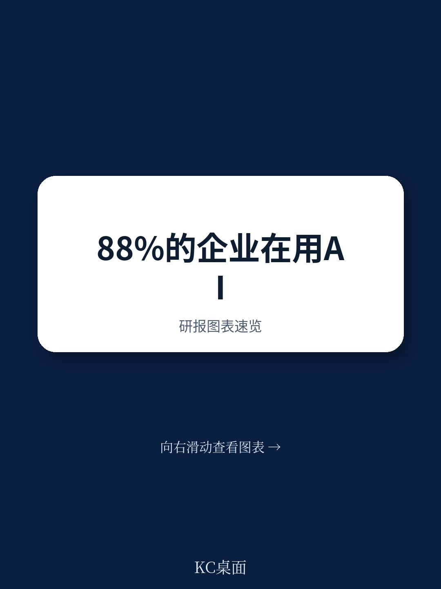
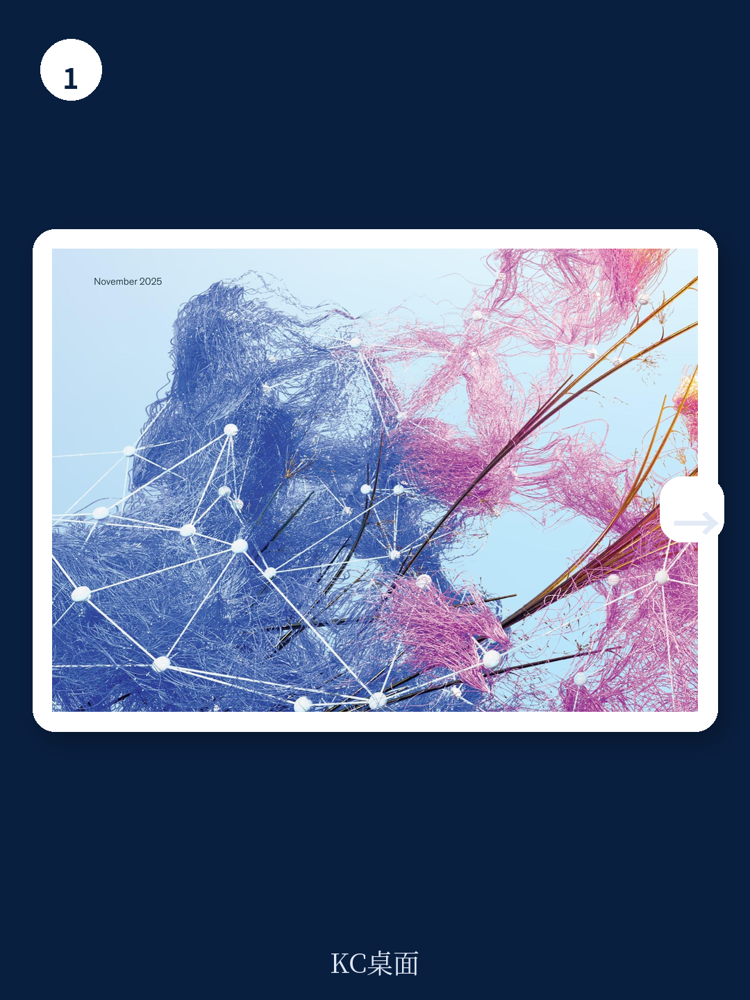
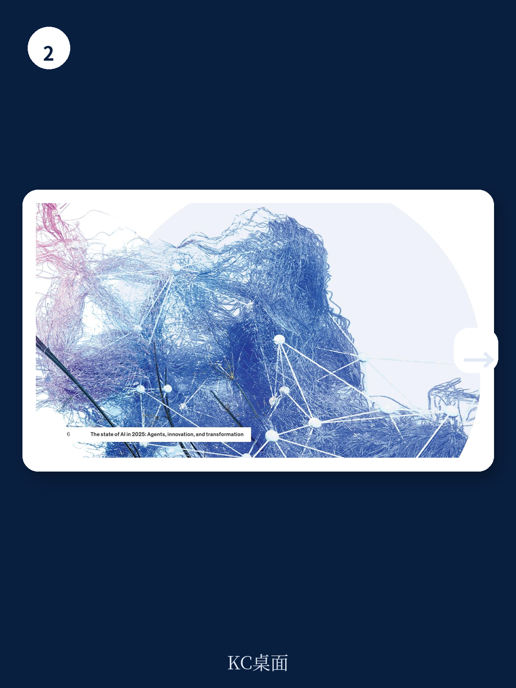

# 麦肯锡：AI已铺开，但企业级价值仍卡在“最后一公里”

三年前，生成式AI引爆了新一轮人工智能浪潮。三年后的今天，麦肯锡2025年全球AI调研给出了一个看似矛盾但意味深长的画面：88%的受访者表示其所在组织已在至少一个业务职能中常规使用AI，这一比例较去年的78%显著上升。然而，近三分之二的受访者坦言，他们的组织尚未开始将AI规模化推广至企业全境。

这意味着什么？AI工具已从实验室进入办公室，但从“用起来”到“产生企业级价值”，中间横亘着一道尚未被多数企业跨越的鸿沟。这道鸿沟不是技术问题，而是组织能力、战略定力和工作流重构的问题。

麦肯锡这份基于近2000名全球受访者的调研报告，揭示了一个正在形成但尚未定型的新竞争格局：谁先跨越这道鸿沟，谁就可能在下一轮产业洗牌中占据结构性优势。

## 1. AI使用广度在扩大，但深度仍然有限——多数企业停留在“多点开花”而非“系统性嵌入”

88%的AI使用率听起来很高，但这更像是一个“广度指标”。麦肯锡的调研进一步追问了AI在组织内的渗透深度，结果并不乐观：只有约三分之一的企业进入了规模化阶段，其余企业仍处于实验或试点状态。

一个更值得关注的信号是：AI正在向更多业务职能扩散。超过三分之二的受访者表示其组织在超过一个职能中使用AI，一半的受访者报告在三个或更多职能中使用AI。从职能分布看，IT、营销与销售、知识管理是AI使用最密集的前三大领域。

但“用得多”不等于“用得深”。麦肯锡指出，多数企业尚未将AI深度嵌入工作流和业务流程中，因此难以实现企业层面的实质性收益。这就像一家工厂采购了大量先进设备，但只把它们摆放在车间角落，而未重新设计生产线。

> **KC评论：** 对投资者和产业决策者而言，真正需要关注的不是“有多少企业在用AI”，而是“有多少企业正在围绕AI重构业务流程”。调研显示，那些将AI嵌入工作流的企业，其价值捕获能力远高于仅将AI作为辅助工具的企业。完整报告中有按行业、按企业规模拆分的详细数据，这些细分数据往往能揭示哪些赛道正在发生真实的结构性变化。

## 2. AI Agent成为新热点，但规模化部署仍高度集中——62%企业已开始实验，但真正落地的不足四分之一

如果说2024年是“AI应用元年”，那么2025年无疑是“AI Agent元年”。麦肯锡调研显示，62%的受访者表示其组织正在至少实验AI Agent，其中23%已进入规模化阶段。

但同样需要冷静看待的是：在任何一个单一业务职能中，规模化部署AI Agent的企业比例都不超过10%。这意味着Agent的应用仍高度分散，尚未形成系统性渗透。

从行业分布看，科技、媒体与电信、医疗健康是Agent应用最靠前的三个领域。从职能看，IT和知识管理是Agent落地最快的领域——服务台管理、深度研究等用例已快速成型。这并不意外，因为这些领域的工作流相对标准化，Agent的“感知-规划-执行”能力可以较为直接地替代或增强人工流程。

> **KC评论：** AI Agent的“实验率高、规模化率低”是一个典型的早期市场信号。麦肯锡的Michael Chui在报告评论中直言：“Agent做得好需要艰苦的工作。”对投资者而言，这意味着Agent基础设施层（如编排框架、监控工具、安全层）可能比应用层更具确定性机会。完整报告中包含按行业、按职能的Agent部署热力图，这些数据可以帮助判断哪些垂直领域即将进入Agent的规模化拐点。

## 3. 企业级财务影响仍然有限——但“创新”和“客户满意度”的改善已开始被感知

麦肯锡调研中最令人清醒的数据是：只有39%的受访者认为AI对其企业的EBIT产生了任何程度的影响，且其中多数人认为这一影响不足5%。

但与此同时，64%的受访者表示AI正在提升其组织的创新能力，近一半报告了客户满意度和竞争差异化方面的改善。这两个数据放在一起看，揭示了一个重要信号：AI的财务回报可能正在“潜伏期”——先通过非财务指标释放价值，再逐步传导至利润表。

从成本端看，软件工程、制造和IT是AI带来成本下降最明显的职能领域。从收入端看，营销与销售、产品与服务开发是AI贡献收入增长最突出的领域。这种“成本降在后台，收入增在前台”的分布特征，说明AI的价值捕获正在从效率导向向增长导向转移。

> **KC评论：** 39%的EBIT影响率确实不高，但这恰恰可能是当前最大的认知差。历史上每一次通用技术的渗透都遵循“J曲线”——初期投入大于产出，随后价值释放加速。报告中有按企业规模、按行业拆分的EBIT影响分布图，这些图表可以帮助判断哪些细分领域可能率先跨越盈亏平衡点。完整报告中的这些图表，值得仔细研读。

## 4. 高绩效企业的共同特征：不以效率为唯一目标，而是用AI驱动创新和转型

麦肯锡将那些从AI中捕获更高价值的企业定义为“AI高绩效者”。这些企业有哪些共性？

首先，它们的目标更宏大。80%的高绩效者将“效率提升”列为AI目标，这与其他企业并无不同。但区别在于，高绩效者同时将“增长”和“创新”作为AI的核心目标。它们不满足于用AI“省钱”，而是追求用AI“赚钱”和“创造新可能”。

其次，它们更愿意重构工作流。半数高绩效者表示计划用AI彻底改造其业务模式，大多数正在重新设计工作流。这意味着它们不是在现有流程上“贴AI补丁”，而是围绕AI重新设计流程本身。

第三，它们更愿意承担风险——也更能管理风险。高绩效者报告了更多的负面后果（如知识产权侵权、合规问题），但它们同时也在更积极地管理这些风险。这并非矛盾，而是“进取型风险管理”的体现：因为做得更多、走得更远，所以暴露的风险点自然更多。

> **KC评论：** 高绩效者的特征揭示了一个关键洞察：AI的价值不在于“优化现有系统”，而在于“创造新系统”。那些将AI视为成本削减工具的企业，可能正在错过真正的机会窗口。报告中对高绩效者的完整画像——包括它们的组织架构、人才策略、治理模式——是这份报告中最具战略参考价值的部分。完整报告中有详细的对比分析。

## 5. 报告尚未完全回答的关键问题：规模化的真正瓶颈是技术还是组织？

麦肯锡的调研数据清晰地描绘了“AI采用”的现状，但有一个问题值得追问：为什么近三分之二的企业无法从试点走向规模化？

报告给出了部分线索：工作流重构不足、目标设定过于狭窄、风险管理能力不匹配。但这些更多是“症状”而非“病因”。更深层的问题可能在于：

第一，组织惯性。AI的规模化部署要求打破部门墙、重新定义角色和职责、调整激励机制。这些变革的难度远大于技术选型本身。

第二，人才缺口。调研显示，AI高绩效者在人才策略上与其他企业存在显著差异，但报告并未深入拆解“什么样的AI人才结构是有效的”。

第三，治理框架的缺失。虽然报告提到风险管理正在加强，但多数企业仍处于“被动响应”而非“主动设计”阶段。当AI从辅助工具变为决策核心时，治理框架的缺失将成为规模化最大的阻力。

这些未解问题，恰恰是下一个阶段最值得研究的课题。

## 6. 给决策者的观察框架：从四个维度判断AI战略的成熟度

基于麦肯锡这份调研，我们提炼出一个观察企业AI战略成熟度的四维框架：

**第一维度：目标结构。** 企业的AI目标是否超越了“效率”？是否同时包含了增长、创新和转型目标？目标越多元，价值捕获潜力越大。

**第二维度：嵌入深度。** AI是作为“附加工具”存在，还是已经嵌入核心工作流？是否围绕AI重新设计了业务流程？嵌入越深，护城河越宽。

**第三维度：风险姿态。** 企业是回避风险还是主动管理风险？是否建立了与AI使用规模相匹配的治理体系？风险姿态决定了企业能够走多远。

**第四维度：规模化节奏。** 企业是否在多个职能中同步推进AI？是否建立了跨职能的AI能力中心？规模化节奏决定了先发优势的可持续性。

这四个维度相互关联、彼此强化。一个只在单一维度上表现突出的企业，很难真正实现AI驱动的转型。而在这四个维度上同步推进的企业，才更有可能从“AI使用者”进化成“AI驱动者”。

---

麦肯锡这份报告的核心判断可以浓缩为一句话：AI的普及已成定局，但企业级价值的释放才刚刚开始。当前的市场格局中，绝大多数企业仍处于“工具层面”的AI使用阶段，只有少数先行者开始向“战略层面”的AI转型迈进。这种分化，正在重塑产业竞争的底层逻辑。

对于那些希望进一步了解这份报告完整数据——包括按行业、按企业规模、按职能的详细拆解，以及AI高绩效者的完整画像——的读者，我们会在社群中每日更新国际顶尖投行和咨询机构的研报中文摘要与KC评论。这些内容由AI Agent初筛、人工review精修，每日约10-40页，既适合喂给AI模型做进一步分析，也方便人工快速把握全球市场的动态变化。欢迎加入社群，领取完整研报解读与原始图表，继续探讨那些尚未完全回答的问题。

Personal reading notes and learning share only. Not investment advice.

