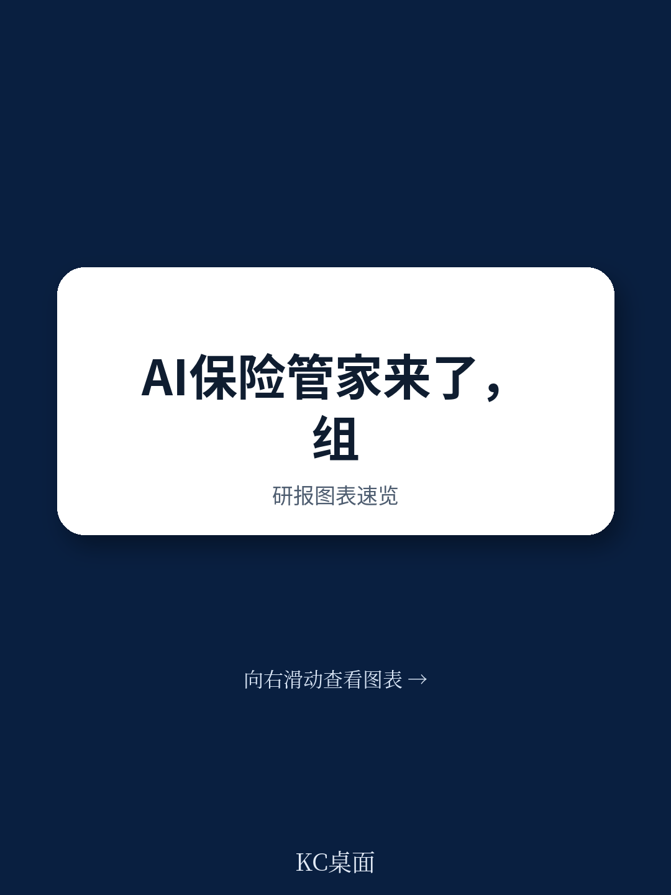
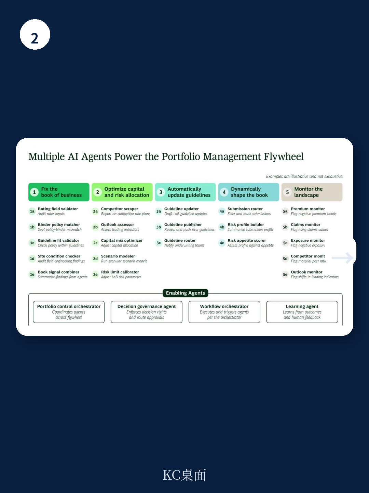

# 波士顿咨询：商业财产险的下一场战役，不在承保，在组合管理

财产与意外险（P&C）公司正站在一个关键的十字路口。当整个行业的目光都集中在生成式AI如何改造核保和理赔流程时，波士顿咨询（BCG）在2026年6月发布的一份报告中提出了一个更尖锐的判断：真正未被开采的、能带来持续竞争优势的富矿，位于组织金字塔的顶端——组合管理（Portfolio Management）。

这不是一个关于技术替代人的故事。这是一个关于“速度”和“粒度”如何重构保险业竞争壁垒的故事。BCG基于对超过50位P&C商业保险高管的调研，给出了一个具体的量化信号：率先拥抱智能体AI（Agentic AI）进行组合管理的公司，有望实现毛保费增长1%-3%，综合成本率改善1%-2.5%，股本回报率提升1%-2%。在承保周期趋紧、波动性加剧的当下，这些数字足以拉开一个身位。

但真正值得决策者关注的，不是这些数字本身，而是其背后的逻辑：为什么传统的组合管理在今天失效了？智能体AI提供的究竟是一个新工具，还是一种新的管理范式？

## 1. 传统组合管理的四个死穴，正在侵蚀保险公司的风险调整后回报

BCG的报告直指核心：当前大多数商业P&C公司的组合管理，本质上是一套“后视镜系统”。它擅长解释过去，却无力预测和塑造未来。报告归纳了四个相互关联的致命弱点。

第一，可见性碎片化且浅薄。核保、理赔、风险工程和再保险数据各自为政，沉没在不同的系统中。管理层看到的报告是按险种和区域汇总的宏观视图，缺乏识别边际变化或风险集中度早期信号的颗粒度。当一个客户的财产险和意外险组合出现风险偏移时，系统无法在它造成实际损失前发出预警。

第二，组合再平衡是向后看的。CFO和CRO可以测试主要的资本和再保险情景，但无法模拟增长、风险暴露和资本配置之间完整的权衡关系。决策本质上是对已发生趋势的被动反应，而非对未来的主动塑造。

第三，调整指令到达一线时已经过时。由中央制定的组合调整策略，在层层传递到一线核保人时，往往已经失去了速度和清晰度。核保人的工具、队列和转介门槛，依然反映着过时的风险偏好和指引。结果是，组合策略在不同区域、产品和业务线之间的执行严重不一致。

第四，风险质量问题直到大额损失发生才被发现。审计能捕捉流程错误，但很少能识别与风险相关的疏忽，比如错误定价的保障、遗漏的除外责任或恶化的风险暴露概况。这些错误在没有持续监控的情况下，会在组合中无声累积，直到以损失的形式爆发。

> **KC评论：** 这四个问题叠加，意味着保险公司的“风险调整后回报”其实是一个被高估的数字。管理层看到的季度报告是平滑后的结果，而真正的风险成本正在组合深处悄然积累。完整报告中包含了BCG对每一环节的更详细诊断和具体数据，值得对照自己公司的运营痛点逐一审视。

## 2. 智能体AI飞轮：从“季度会议”到“持续优化”的管理范式跃迁

BCG提出的解决方案，是一个由智能体AI驱动的五步飞轮。这不是一个线性流程，而是一个持续循环、自我强化的系统。它的核心价值在于将组合管理从“定期体检”升级为“持续监测和即时干预”。

第一步，修复业务账簿。AI智能体能够大规模、细颗粒度地审查保单数据，包括投保书、损失历史、风险工程、费率输入、报价、保单和理赔。在财产险中，它能详细审查价值明细表、限额、免赔额、占用情况和屋顶状况；在意外险中，它能评估理赔、法律和准备金模式，提示续保行动或条款调整。关键的是，人类仍在决策环中，智能体只是诊断工具，触发审查的权限由角色控制。

第二步，优化资本和风险配置。智能体整合来自三个来源的信号：实时组合数据、来自外部系统（如SERFF备案）的竞争对手数据，以及第三方和内部风险数据的领先指标。领导者可以测试资本配置、风险参数和再保险支持对组合KPI的模拟影响。

第三步，自动更新指引。一旦组合调整和风险偏好变更确定，智能体自动更新核保指引，包括转介门槛、免赔额下限、起赔点和文件要求。经审批后，更新直接发布到指引库、保单管理系统和下游系统，并通知一线核保人。

第四步，动态塑造业务组合。智能体通过刷新优先级排序、购买倾向模型、投保书路由逻辑、续保分类规则和转介矩阵，持续重塑业务组合。符合目标风险特征的投保书在核保人队列中上升，不再匹配目标组合的风险则进入转介路径。

第五步，持续监测环境。智能体持续追踪外部信号，并将组合表现与先前情景模拟的预测结果进行比较。当发现负面趋势或异常模式时，立即触发警报，促使管理层及时审查，而不是等待季度报告。

> **KC评论：** 这个飞轮最反常识的地方在于，它没有试图用AI替代核保人的判断力，而是用AI来确保核保人的判断力始终被用在正确的地方。它解决的是“执行偏差”问题——这是传统管理中最难量化和纠正的成本。完整报告中的Exhibit 1和Exhibit 2以图示方式展示了这个飞轮的运转逻辑，非常直观，建议仔细研读。

## 3. 报告尚未完全回答的关键问题：数据治理的隐性成本与组织惯性

尽管BCG的框架逻辑清晰，但报告本身也留下了几个值得深思的缺口。

第一个缺口是数据治理的隐性成本。报告提到“这不是一个多年的数据转型项目”，而是一个“集中精力连接现有系统”的举措。但现实是，对于大多数大型商业保险公司而言，连接现有系统本身就是一场硬仗。数据定义不一致、系统架构老化、数据质量参差不齐，这些问题的解决需要投入的不仅是技术成本，更是组织协调成本和政治智慧。BCG的框架假设了数据基础是可解决的，但这个“假设”本身可能正是很多公司无法迈出的第一步。

第二个缺口是组织惯性的挑战。报告描述了智能体如何更新指引、路由投保书，但并未深入探讨一线核保人如何接受并信任这些由AI驱动的变化。当核保人的自主权被系统规则压缩时，可能出现的抵制、规避或消极执行，是任何技术方案都必须面对的人性问题。报告提到了“人类仍在决策环中”，但“环”的边界和权力分配，恰恰是最微妙也最容易被低估的设计挑战。

第三个缺口是竞争动态的非对称性。报告指出“先发优势”，但未充分展开一个可能性：如果多家竞争对手同时建立类似能力，这场军备竞赛是否会迅速将超额收益压缩为行业标配？更关键的是，小型的、更灵活的保险公司是否可能以更低的成本实现“弯道超车”，而大型老牌保险公司则因系统包袱和组织复杂度而步履蹒跚？

## 4. 给决策者的观察框架：三个追问判断真伪

面对这样一份前瞻性报告，决策者不应盲目跟进，而应建立自己的判断框架。以下三个追问，或许能帮助你评估BCG的论点在自身组织中的适用性。

第一个追问：你的数据负债有多深？BCG的飞轮建立在“统一数据层”之上。如果你的公司连“什么是标准风险暴露”这样的定义都尚未统一，那么“连接现有系统”的第一步可能就需要12-18个月。这个时间成本需要被明确计算，而不是被乐观地忽略。

第二个追问：你的组织能承受多快的决策速度？智能体AI的核心价值是“速度”——将决策周期从季度压缩到天甚至小时。但你的组织架构、审批流程和风险文化是否支持这种速度？如果CEO和CRO仍然习惯于在季度会议上做决策，那么即使技术到位，管理范式也无法切换。

第三个追问：你的竞争优势来源是什么？如果所有同行都拥有类似的AI组合管理能力，你的差异化来自哪里？是更独特的数据源？更优秀的核保模型？还是更紧密的客户关系？AI是放大器，不是替代品。它放大的是你已有的优势，而不是凭空创造一个新的。

---

BCG的这份报告为商业P&C行业描绘了一幅清晰的未来图景：组合管理将从一项被动的、回顾性的财务职能，转变为一套主动的、持续优化的战略能力。但通往这个未来的路径，远比技术本身复杂。它涉及数据、组织、文化和战略的四重对齐。

报告中的许多关键细节——如量子启发式张量网络如何用于建模多维数据、具体的角色权限控制设计、以及不同险种的诊断案例——都因其篇幅限制而未能完全展开。这些细节恰恰是判断这套方法论是否适用于你所在公司的关键。

如果你希望深入了解BCG提出的完整飞轮模型、具体的实施路径图，以及报告中引用的50位高管调研数据细节，欢迎加入我们的社群。我们每天会由AI agent结合人工review，生成国际顶级投行和咨询机构的中文摘要与深度评论，日更约10-40页，包含当天最新数据图表合集，既方便喂给AI，也方便你快速把握市场动态。

在这个信息过载的时代，真正的竞争优势不在于拥有更多信息，而在于更高效地理解信息。我们试图帮你做到这一点。

Personal reading notes and learning share only. Not investment advice.

