BCG

Executive Perspectives

## How AI-First Banks Are Rewriting the Rules of Retail Banking

Banking

June 2026

## Introduction

Retail banks are poised to unlock significant value from GenAI and Agentic AI. They are best positioned with relatively higher levels of digitization, rich data (albeit legacy bound), and higher customer adoption of GenAI applications.

AI-first retail banks are driving transformation through decisive AI investments and are capturing value at scale across business functions. However, for other banks, value remains limited to select pockets.

In this edition, we explore the impact of GenAI and Agentic AI in retail banking and the approach followed to deliver impact. We address key questions faced by bank executives:

\- Why are GenAI and Agentic AI imperatives, yet why is at-scale value elusive?

\- Which functions are realizing measurable impact?

\- What approach are AI-first banks taking across customer discovery & onboarding, service & engagement, and fulfilment in ops, credit & collections?

• How are banks building an AI-first mindset across the organization?

In this BCG Executive Perspective, we articulate a vision for transformative GenAI and Agentic AI deployment in retail banking

## Executive summary | Retail banks are poised to derive significant value from GenAI and Agentic AI (1/2)

## WHY

GenAI and Agentic AI in retail banking are imperatives but with current under-realized value

\- Structurally primed for GenAI and Agentic AI: Retail banks have seen higher levels of digitization and a richer data repository (albeit, within legacy systems); they are more ready to augment intelligence and create new experiences for customers

\- Value scale-up has been limited: Six key challenges addressed by AI-first retail banks- a) Moving beyond micro use cases, b) Upfront linkage of initiatives with value metrics, c) CEO involvement to drive accountability, d) Lead with products, build for re-use, e) Building GenAI fluency for change-the-bank roles, f) Design risk controls and processes from Day 1

\- Direct comparison with other retail experiences: Retail consumers compare banking experiences with AI-native experiences in other sectors, such as shopping, travel, and digital media; with AI tech advancing ever more quickly, banks need to move faster

\- Step-change in marketing maturity with higher precision in acquisition: Over $40\%$ sales uplift in new-to-bank products

\- Synthetic customer personas created using GenAI to sharpen proposition design, targeting, and channel choices

\- Improved visibility in generative search engine and driving acquisition at lower CACs

## WHAT

key skills are being adopted by AI-first retail banks (1/2)

\- Agentic interventions in media allocation optimization to reduce the number of low and non-performing channels; high-velocity funnel experimentation to apply best CRO practices to improve journey conversions

\- Customer service is changing from reactive support to insight-driven, personalized & proactive engagement

\- Human-like conversational assistance in service, reminders, and collections by agentic bots; 70%+ of human call volumes are enabled with voice bots at about one-fifth the cost of traditional assistance

\- Always-on personal RM for every customer that captures context from every interaction, proactively engages customers, and provides contextual solutions; deepen customer relationships by 20%-40% through meaningful cross-sell

\- Step change in frontline RM productivity across cross-sell, upsell, engagement, and customer service. Bankers augmented with customer-level agenda, personalized pitches, and knowledge assistance have engaged 50% of clients weekly (from \~15% of clients). 5-6x conversions observed for select products

## Executive summary | Retail banks are poised to derive significant value from GenAI and Agentic AI (2/2)

## - Operating models and workflows are redefined in fulfillment channels between agentic bots and human experts:

\- Invisible operations or zero human-operations swim lane is increasing by enabling the processing of non-standard files. Partial STP and non-STP cases are handled differently, with human experts engaged only where needed, while agentic execution and monitoring help ensure guaranteed SLAs; observed impact includes 70% lower turnaround time

## WHAT

key skills are being adopted by AI-first retail banks (2/2)

\- Credit processing is becoming faster and smarter: Bot agent-enabled underwriting engine is compressing decision cycles and follow-up communication, delivering 5x-10x faster time to quote

\- Smart anti-financial crime processes reimagined with agentic bots driving customer identification and screening to onboarding and perpetual KYC monitoring; up to 50% financial crime cost savings observed

\- Smart collections: Unstructured interaction data leveraged to understand customers' reasons for bounce, to personalize outreach strategy, and enable higher resolution; \~50% reduction in collections operating costs

\- Harness engineering to accelerate product and software delivery; 50% faster time to market (BRD to deploy)

\- Employee alter-ego or bot agents to perform role-specific activities and other enabling tasks

## - Prioritize 3-4 chosen areas of transformation that amplify the bank's strategy in market with a focus on business outcomes, instead of chasing many micro use cases

## HOW

banks should set themselves up for a successful AI-led transformation

\- For each prioritized functional reimagination, identify opportunities by focusing on nature of job instead of number of people - structurally reallocating toil/repetitive tasks and reasoning tasks to AI and augmenting humans for expertise

\- Build reusable products while transforming business function, rather than adopting a GenAI platform-first approach

\- Design structured AI risk and compliance processes from Day 1, not as an afterthought during launches

\- At early-stage maturity, GenAI requires centralized focus; GenAI products can evolve to more federated structures in the future once core capabilities stabilize

\- Invest in GenAI upskilling across the org, spanning individual productivity improvements to building function-specific capabilities

## AI-first retail banks are addressing six key challenges to scaling GenAI initiatives

## Approaching transformation through use cases

Isolated use cases with limited value; e.g., tool for branch staff to answer product FAQs, auto-generation of call summaries in contact centers, etc.

## Building solutions, looking for problems

Insufficient focus on solving a real problem vs. just showcasing the art of the possible; e.g., in-call real-time nudges for human callers, video avatars for engagement, etc.

## Creating clear accountability

Without clear ownership GenAI initiatives get lost in the complex coordination between business, channel, tech, AI, compliance, risk and third parties

## Balancing product vs. platform objectives

Pressure to deliver
immediate value leads
teams to build point
solutions that do not scale
horizontally, e.g., RM
intelligence that can not
scale to D2C

## Slower adoption of GenAI fluency across teams

Concentration of
knowledge in specialist
teams including Data
Science and Engineering,
with checkered
understanding across
other functions

## Solving risk as an afterthought

Speed-to-market becomes unpredictable without institutional knowledge to navigate risk and compliance decisions

## What AI-first banks are doing differently

## Fewer but deeper functional reimaginations

Focus on a few priorities aligned with overall strategic agenda; e.g., reimagined frontline sales and customer service

## Upfront linkage of initiatives with value metrics

Embed targets in AOPs with clear value measurement and roadmap

CEO involvement to drive joint accountability

Note: FAQ = Frequently Asked Question; D2C = Direct to Customer; AOP = Annual Operating Plan

Drive GenAI agenda from the top of the house to eliminate ambiguous accountability, with strong execution discipline

## Lead with products, build for reuse

Banks that exercise patience to get foundations right, unlock exponentially faster value across initiatives through reuse

## Invest in GenAI upskilling for change- the-bank roles

Invest in upskilling, so that change can be driven bottom up as well; encourage organization-wide ideation

## Build in risk controls and processes

Build risk controls and new AI governance by design from day one to avoid retrofitting. Set up an accelerated approval committee to expedite decisions on architecture, security, risk, and compliance

<table><tr><td rowspan="3">5</td><td colspan="2">Invisible Operations:</td></tr><tr><td colspan="2">• Instant and autonomous handling of nonstandard requests (no human touch or queue)• Full-context routing to right human skill; guaranteed SLAs</td></tr><tr><td>40% Higher operations efficiency</td><td>70% Lower turnaround time</td></tr><tr><td rowspan="3">6</td><td colspan="2">Smart Credit Engine:</td></tr><tr><td colspan="2">• Agentic underwriting to augment loan decision making• Iterative learning from portfolio outcomes; make policy smarter over time</td></tr><tr><td>100% Review coverage for all submissions</td><td>5x-10x Faster time to quote</td></tr><tr><td rowspan="2">7</td><td colspan="2">Smart Anti-Financial Crime: AI-led CDD/EDD, AML, screening, onboarding, and monitoring with humans as needed</td></tr><tr><td colspan="2">50% Lower financial crime costs</td></tr><tr><td rowspan="2">8</td><td colspan="2">Smart Collections: Boost share of digital collections using personalization and voice agents</td></tr><tr><td>~50% Reduction in collections operating costs</td><td>10%-20% Net charge-off reduction</td></tr></table>

# AI-first retail banks are investing in ten key skills

## Attract and Acquire

1 A. Customer Intelligence and Proposition Design: Persona agents built using real customer behavior data create a captive testing ground to validate propositions, sharpen customer targeting, and de-risk new product launches before spending even a dollar

B. Growth Marketing and Conversion:

\- AEO- and GEO-ready search: Optimized discovery across answer and generative search engines

\- Conversational Acquisition: Embedded chat in popular chat engine interfaces, e.g., ChatGPT and Claude

\- Agentic Media Optimization: Autonomous real-time media buying and targeting to maximize reach and ROI

\- Agentic CRO: Intense agent-driven customer journey funnel experimentation to boost conversions

## Serve and Engage

\- Agentic bot-led engagement, inbound service, outbound collections, and reminders (voice and chat)

\- Persuasion by agentic bots via customer-level contextual pitches and arguments

70%+ Human call volume handled by voice bot

1/5th Cost of assistance with human-like efficacy

## 3 Always-on Personal RM for Every Customer: Always-on agent that is proactive, provides contextual engagement, and is always available

+40% $^{1}$ Sales uplift in NTB products

60% Increase in activation rate for NTB customers

4 Banker Productivity: Augment bankers with contextual pitches, personalized collaterals, and process knowledge for cross-sell, upsell, and service

Wealth illustration

50% Clients engaged weekly \~20% Increase in AUM from 15% starting point

## Fulfill and Execute

<table><tr><td colspan="2">Harness Engineering</td><td>Employee Alter-Ego</td></tr><tr><td colspan="2">9 Using Harness Engineering across every stage of product and software delivery to accelerate idea to impact for business</td><td>10 Employee Alter-Ego to augment role-specific tasks, minimize toil for other enabling tasks, and provide personalized coaching</td></tr><tr><td>+50% Faster time to market (BRD to deploy)</td><td>3x Engineering throughput</td><td>Early adoption stage, at-scale impact to be realized</td></tr></table>

1. Up to three times digital sales uplift in early-maturity functions

## Brilliant Basics: Building the foundation for Agentic Implementation

Segment-centric beyond P&L

From contextual to data-driven decision-making

Close collaboration across teams $^{1}$

Test-and-learn mindset

Ownership of media channels

E2E measurement and tracking

## 1 A push toward advanced capabilities without core foundations sets banks back by \~15% in marketing maturity

With GenAI, the time to build foundations is shrinking from about five years to under one year

Foundational capabilities

## GenAI Initiatives: Early efforts that banks can start from Day 1

GenAI-powered process and knowledge base

GenAI content creation

Customer digital twin and synthetic persona

AEO/GEO-Ready Search

3 To unlock early value, invest in quick-win GenAI initiatives in parallel to building brilliant basics

Customer intelligence and proposition design

Growth marketing and conversion

## Agentic Capabilities

Deploy bank app in generative search engines

Agentic media optimization

Agentic experimentation and CRO

## Layer agentic capabilities once foundations are in place to sustain advantage as market rapidly evolves

## Attract and Acquire | Five key capabilities are providing significant sales uplift

<table><tr><td>Customer digital twin and synthetic persona</td><td>Learn fast without spending real resources or taking real riskValidate messaging with simulated buyers before spending a single dollar on mediaStress-test pricing and product features against real client profiles without real-world risk</td><td rowspan="5">40%</td><td rowspan="2">Sales uplift in NTB products(up to three times digital sales uplift in early-maturity functions)</td></tr><tr><td>AEO/ GEO-Ready Search</td><td>Be found where customers are already decidingGenerative search engine-based acquisition at lower CACs; 64% of users using AI for purchasing decisions. Companies with GEO see ~7x higher AI visibility, with users spending 30%+ more time on site with lower bounce from sites</td></tr><tr><td>Agentic media optimization</td><td>Always-on Agent that makes every ad dollar work harderDaily agentic optimizer to enforce cross-channel best practices and eliminates non-converting media spend. Marketers-in-the-loop steer strategy while the bot agents handle executionDelivering up to 20% revenue uplift and 25% efficiency gain</td><td>30%</td></tr><tr><td>Agentic experimentation and CRO</td><td>Scale experimentation from a handful of tests to hundredsAgents rapidly generate and test variants at volume while humans lead the &quot;big bets&quot; that reshape core journeys; a Latin American bank using this dual approach, scaled to 5x more experiments per month and delivered 20% sales uplift</td><td>60%</td></tr><tr><td>Deploy bank app in generative search engines</td><td>Improve funnel conversions in GEO-led acquisitionsConversational assistance of bank-specific information by integrating bank app/ website with generative search engines like ChatGPT. A European bank has implemented a highly integrated banking experience with personalized answers based on in-app information</td><td>40%</td></tr></table>

## Conversational Customer Assistance | Significant value is realized from relationship deepening, outbound reminders, and inbound customer service

## A

## Relationship deepening

Revenue lift: Increase in customer-to-RM ratio, at enhanced revenue per customer

  
Intent and
readiness identified  
B

## Role of AI-enabled agent

• AI agents reach out to customers at scale to identify interest

\- Personalized bot-led engagement to validate customer intent

\- Qualify high-intent leads and schedule RM engagement to deepen relationship

## Outbound reminders

Higher resolutions with proactive outreach and higher NPS

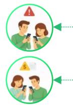

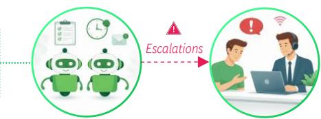  
Conversational agents handle follow-ups and reminders

• AI agents proactively trigger service and payment reminders to drive timely customer action

\- Bot-led conversations convince customers and enable query resolution

• Human handoff is triggered only for true exceptions and escalations

## C

## Inbound customer service

Lower operating cost: Lower need for human higher NPS

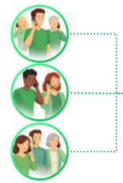

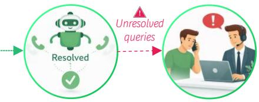  
Conversational agents resolve most queries

\- Chat & voice AI agents answer all inbound calls

\- Bot agents resolve most simple, complex, and routine queries

\- Escalations and exceptions are routed to human agents

## Impact

2x-3x

Customers per field RM

8x-10x

Customers per virtual RM

Note: NPS = Net Promoter Score

1/5th

Cost to serve at human resolution efficiency

70%+

Conversation volumes handled by voice bots

Lower cost to serve

## 75%-90%

90%-95%

Lower wait time

## Conversational Customer Assistance | Investments in traditional call centers should be reconsidered, given high opportunity to reduce call volumes

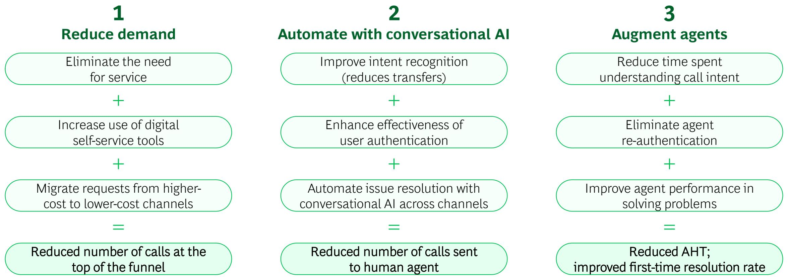

## Additional enablers to realize value include improving agent utilization, demand forecasting, and scheduling and training

## Conversational Customer Assistance | Newer capabilities are required across the channel, experience, intelligence, and handling layers

## Traditional digital journeys

Assisted
journeys

IVR

Work apps and portals (RM, virtual RM)

DIY journeys

Field agent app

App

Website

Social media

## Multi-channel experience

## Intelligence

## Based on shared data and common CRM

## Traditional AI and ML models

## Hyper-personalization

Customer persona

Risk analytics

Next-best action

Propensity analytics

## APIs for COTS systems for happy and a few unhappy swim lanes

## Additional services for conversational engagement

## New machine voice, text chats, and multimodal interfaces across all channels

Agentic orchestration to enable:

\- Long-term context

• Curated customer-level agenda

• Personalized pitches

• Follow-up loops for closure

Power conversational experience with knowledge graphs:

\- Customer context

• Bank's process and policy context across scenarios

\- Ensure deterministic execution of operating process flows for secured banking (cannot be autonomous)

\- Support full spectrum of scenarios, well beyond traditional digital journeys. Requires tooling layer of APIs (incl. new integrations), data integration, and purpose-built tools (e.g., calculators, schedulers)

## Agentic RM for Every Customer | Proactive signals and hypercontextual customer engagement are powered by six capability layers

Six new-age capability layers to change the way banks activate customers and engage with them to ensure business impact. Significant improvement seen in customer activation (60% increase in NTB customers) and relationship deepening, with 20%-40% improved cross-sell

## ORCHESTRATION LAYER

## Orchestrates customer campaigns, engagement, and channel routing by coordinating services across the six layers

## SENSE

Never misses a moment, every event trigger captured instantly

## KNOW

Rich customer context unified across profile data, holdings, and preferences from interactions

## DECIDE

Focused customer targeting by optimizing propensity and margin

## ENGAGE

Right pitch, hook, channel, and timing for every interaction

## ACT

Execute actions on behalf of customers

## LEARN

Continuously improves every model through feedback from attribution and KPIs

Note: NTB = New To Bank

## Event monitor

Captures every event trigger in real time (bank and customer initiated)

## Customer profile

20,000+ customer DNA features; memory updated on every event

## Customer-level propensity engine

Campaign combination (e.g., mode, hook, and channel) scored for every event trigger

## Emotional IQ

Reads sentiment; suppresses sending and escalates when needed

## Deterministic execution

Handles and resolves customer queries as per bank's processes (deterministic flows)

Attribution agents
Channel attribution for single touch vs. multi-touch; channel optimization feedback

## Customer behavioral signal

Provides customer intent before a discussion based on previous interactions

## Customer context graph

Unified graph linking signals, offers, responses, and outcomes

## Offer relevance

Reranks products vs. latest context on every update

## Treatment optimizer

Selects winning campaign and calibrates incentive to maximize margin and propensity

## Hook and timing

Personalizes hook to capture customer attention in first 10 seconds; times discussion

## Action looper

Drives actions to closure by monitoring open actions and sending reminders

Model update
Automated retraining based on recent data; model drift detection triggers

## Market context

Market and competitor triggers to rescore customer intent in real time

## Offer context and message

Customer-specific brief per

offer, channel-ready message

## Guardrail agent

Complies with anti-repetition, consent, do-not-disturb, and regulatory requirements, etc

## Contextual pitch

Convinces customers to take action, in a human-like manner, and handles rebuttals

## Handoff agent

Customer handoff to relevant channel; schedules RM meeting and provides context

KPI monitor
Tracks conversion and channel ROI in real time; alerts on deviations

## Banker Productivity | Enable bankers to cross-sell, upsell, and service clients

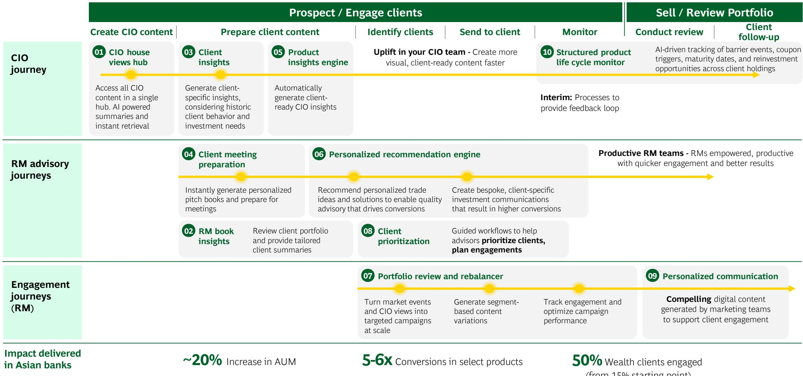

## Invisible Operations | From cost center to competitive moat; AI-led operations deliver speed, differentiation, and customer outcomes

## Swim lane engine

Identify degree of human intervention needed and ZeroOps suitability based on:

\- Client consent and history

\- Risk and compliance

• Data structure and quality

Digital KYC

Digital repayment

Digital lending

Fraud check

## ZeroOps

Zero-touch swim lane is expanding to cover non-standard documents and complex cases with GenAI

\- Agentic AI bot for automated document recognition, data extraction, processing, and plausibility and fraud checks

Note: TAT = Turnaround Time

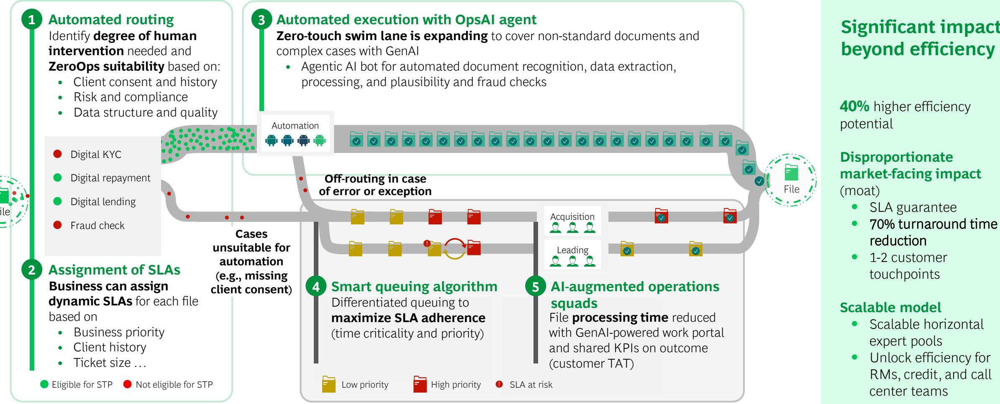  
Programmable back-office with smart queuing and AI-augmented operations squads

## Significant impact beyond efficiency

40% higher efficiency potential

Disproportionate market-facing impact (moat)

• SLA guarantee

\- 70% turnaround time reduction

• 1-2 customer touchpoints

## Scalable model

\- Scalable horizontal expert pools

\- Unlock efficiency for RMs, credit, and call center teams

## Smart Credit Engine | Step change in speed and scale of credit decision-making through AI agents across underwriting

## Key pain points addressed

01 Manual data extraction
Time-consuming extraction from applications, financials, income proofs and third-party reports

02 Inconsistent risk assessment
Subjective interpretation and variation in underwriter judgment leads to policy drift

03 Fragmented data sources
Hard to compile a full applicant view across bureau, income, collateral and behavioral data

04 Inefficient triage and prioritization
Suboptimal allocation of senior underwriter time across simple and complex cases

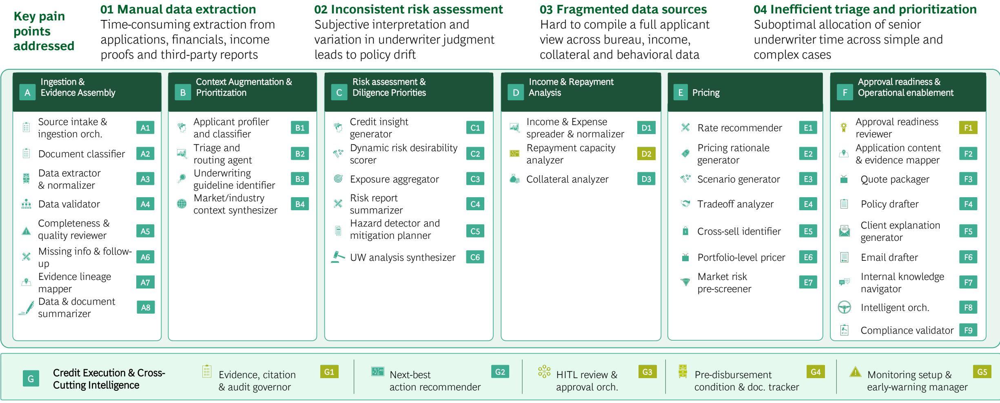

Submission coverage full review of all submissions received

Note: UW = Underwriting; HITL = Human in the loop
Source: All impact numbers based on value delivered from production-grade implementations at retail banks

AI / Agentic AI capabilities

## Smart Anti-Financial Crime | Agent bots leveraged in KYC onboarding and monitoring to realize significant cost save

## Customer Identification

I. Validation Agent

II. Fraud Detection Agent

\- Agentic bot validates customer identity details and flags mismatches, missing documents, or duplicates

\- Biometric and data checks within seconds for AML and fraud risks

• Verifies KYC data for AML through trusted sources

## Due Diligence and Financial Screening

III. Request for Information Agent

IV. Screening Agent

• Automatically screen risks (AML, PEP, and sanctions)

• Streamline customer follow-up: Define required documents, identify missing information, and handle follow-up communication

\- Escalate only genuine high-risk cases to human review; risk rating created

## Onboarding Decision and Control Setup

V. KYC File Assistant

VI. Admin and Pre-approval Agents

• KYC assistant analyses and synthesizes the KYC file per regulatory requirements

\- Customer account created in minutes, not days, with AI quality controls

\- Automated onboarding: product activated, account type & limits configured, tailored terms set for high-risk clients

## Perpetual KYC Monitoring

VII. Perpetual KYC Agent

• Continuous KYC updates as life and ownership change

\- Agentic bot detects anomalies, fraud, and emerging risks instantly

## Up to 50% cost savings realized in preventing financial crime in a European bank

## Smart Collections | Key building blocks for best-in-class collections

## Segmentation and models

\- Getting to the true "n of a few" using general AI orchestrator, which is replacing previous, more granular models

## Up to 50% Reduction in collections operating costs

10%-20% Net charge-off reduction and/or increase in amount recovered

## Increase in NPS and customer retention

## Proactive outreach and messaging

\- Use of unstructured data to trigger messages

\- Customized copy based on holistic knowledge of customer

## Offers and treatment

\- Offers based on customer's real ability to pay, not broad segments or waterfalls

## Engagement channels

\- Customer choice and agency in offer selection

## Digital channels

• Hyper-personalized digital journeys in app and web

\- AI orchestration across channels to ensure context moves with the customer

## Traditional channels

\- AI voice bots capable of taking 70%+ of collections calls

\- In-the-moment nudges for subset of calls that still require human agents

# Harness Engineering | Transform digital builds from human-dependent manual processes to end-to-end agentic production

Harness engineering goes far beyond coding co-pilots into building production-grade systems end-to-end using AI agents. AI agents leverage existing enterprise context on tech architecture and systems, validate their own work, recover from failures, and work within defined constraints

## Requirements

From

To

## Manual BRD writing

Manual
requirement
documentation

BRD and
user stories

AI-generated
requirements
and backlog

## Design

## Manual design specifications

Architects handcraft
specs; no
consistency, no
traceability

Functional and design specs.

Build

AI-drafted
functional specs.
and API contracts

Individual
development
effort

Developers hand-
craft every feature
from scratch

Agent-native
build

Agent-native
specification-driven
development

Guardrails and traceability

Individual
development
effort

Ensure sufficient
guardrails and build
in observability

Agent-native
build

Agent-native
specification-driven
development

Test

Individual
development
effort

Inconsistent test
case documentation

Test artifact generation

Agentic test case
generation and QA

## Deployment

Risky manual
releases

High-ceremony,
manual approvals,
rollback fears

Intelligent
deployment

Autonomous
release
orchestration

## Operations

Reactive incident response

Manual runbooks,
tribal knowledge,
high MTTR

## Proactive AI-Ops

Anomaly detection and automated remediation

## Result

## 50%+

Faster Time-to-market (BRD to Deploy)

Note: QA = Quality Assurance; MTTR = Mean Time to Recovery

90%+

Automated Test Coverage

3x

Engineering Throughput

## 70%

Reduced Toil

## 99%+

Deployment
Reliability

## Future employees to have “Employee Alter-Ego” to perform all core and enabling tasks

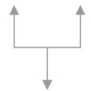

Employee
Alter-Ego
for each
employee to
perform all
on-job activities

## Fulfill role- specific activities

## Product and COE Teams

## Continuous, metric-driven innovation

\- Design agent: BRDs, user stories, and A/B tests

\- Product persona agent: Iterate product solutions and propositions

## Credit and Ops Teams

Process files with accuracy and efficiency.
Fast, high-quality credit decisions

\- Document intelligence: extract, validate, and reconcile

• Credit analyst agent: auto scoring and decision-making

## Frontline Teams

Personalized pitches, quality service, and collections

• AI banker: personalized pitches and next-best action

\- Query bots: voice agents for inbound and outbound

## Tech and Build Teams

Reimagined SDLC with high-quality code; builds, runs, and maintains tech stack

• Architecture review agents

• Coding agents by skill type

• QA and testing agent

\- Tech debt scanner

## 5

## Support Function Teams

High efficiency and efficacy across HR, finance, marketing, and admin

• Live interview assistants

• AI marketeer: content generation and channel selection

\- Procurement agent

## Policy and Control Teams

Monitor and act on credit and fraud risk. Ensure regulatory and legal compliance

• Regulatory agent: policy querying

\- Fraud agent: real-time monitoring and alerts

• Compliance agent

## Perform other enabling tasks

Note: COE = Center of Excellence; SDLC = Software Development Lifecycle

HR

• Career navigator: growth path mapping

\- Time, leave, and attendance agent

\- Attrition-risk agent: early disengagement signals

## Travel and Admin

\- Travel manager: policy-compliant bookings and claims

\- Meeting scheduler: slots, rooms, and automated notes

\- Service bot: laptop and access card requests

## Finance

\- Budget agent: spend tracking and overrun alerts

\- Payment agent: invoice tracking and claim processing

## IT

\- IT help desk: L1 query resolution and ticketing

\- Access provisioning: role-based setup and approvals

## Shift from micro use cases to value-backed end-to-end function redesign

## Use case centric design approach

## Capability-first solutioning

Focus is on building GenAI capabilities/applications, rather than redesigning business or customer experience (“hammer looking for a nail”)

## Current tasks/ workflows automated

Legacy workflows and human tasks optimized. This restricts the opportunity to fundamentally rethink the business function

## Solves multiple micro-problems

Focus is on automating multiple micro-problems. Tends to limit the impact on business function

## End-to-end function reimagination

## Value-based function redesign

Retail functions (e.g., service, credit, risk) are redesigned end-to-end with the focus on business outcomes

## AI vs human roles and operating model

Re-define roles and operating model on what AI executes independently or with humans in the loop vs what humans execute.

## Less is more

Focus is placed on fewer foundational redesigns, taken end-to-end to value, instead of many small use cases or GenAI tool implementations

AI delivers step-change value when it reshapes the function end-to-end

## HOW

## While redesigning a function, reorganize work of AI and humans based on the level of toil, reasoning, and expertise

## Toil

Routine, repetitive tasks with high amounts of manual labor adding limited value

E.g., document completeness checks, system entries based on document (KYC forms, income proofs, and address proof)

## Reasoning

Tasks requiring contextual interpretation and decision-making

E.g., process-based decisions on query resolution

## 70%-80%

Complex tasks leveraging deep domain knowledge and specialized skills

## Expertise

E.g., fraud investigations and customer negotiations

Share of toil has the potential to be eliminated with AI

Retail banks must actively decide which functions belong to AI, which require oversight, and which must remain with humans to eliminate toil, automate reasoning, and augment expertise

## 30%-50%

Share of reasoning
has the potential to
be automated

AI can play the role of an enabler and augment expertise

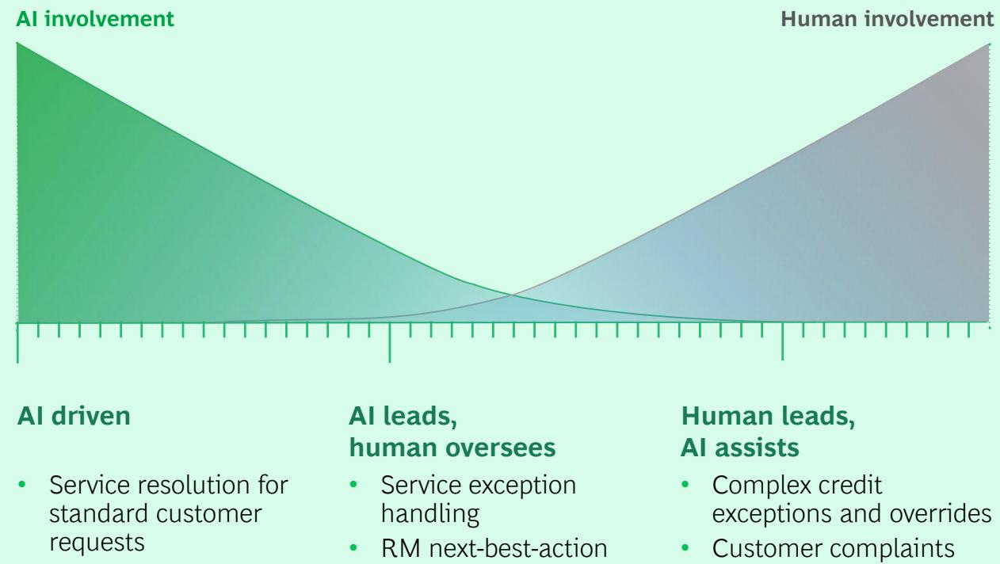

## AI driven

• Service resolution for standard customer requests

• KYC data ingestion and validation

• Service exception handling

• RM next-best-action execution

Human leads, AI assists

• Complex credit exceptions and overrides

\- Customer complaints and dispute resolution

## Invest in cross-functional capabilities to power GenAI and Agentic AI

The age-old debate is back for GenAI

## Product

VS.

## Interaction insights

Enriches customer, agent, or interaction data

\- Customer DNA

• Agent quality assessment

\- Interaction disposition

## Knowledge management system

Augments employees on bank-specific knowledge

• Product and onboarding queries by customers

• Service process queries by service agents

## Document insight extraction

Enables job functions that require manual document analytics (e.g., operations)

• Document summarization

\- Insight extraction from documents

## Platform

## Start with a product approach

• Focus on a business function to build the right capabilities

\- Ensure every capability is built for re-usability

## Process intelligence engine

Captures fragmented
human intelligence to
power agentic use cases

\- Process automatically captures all service scenarios (via screen recording and call analytics)

## Tooling

Enables agentic action execution

• Integrations with internal systems

\- Embedded functions (e.g., calculators and schedulers)

## Content generation

Automates creation of content to boost productivity and efficiency

• Marketing collaterals creation

• Report generation (e.g., KYC and CDD)

## Manage AI risk and compliance from Day 1 by design, not as an afterthought

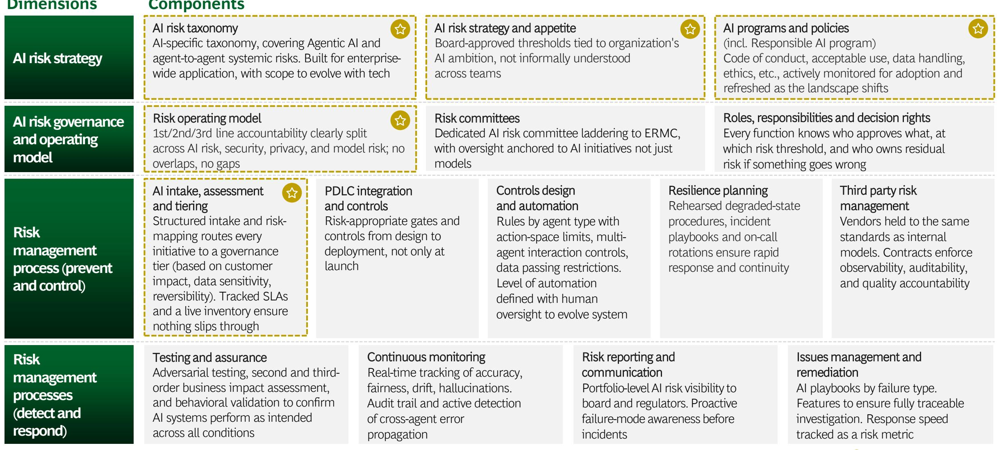

## Organization-wide skilling and adoption to be at 3 levels, from individual productivity to function-specific capabilities

## LEVEL 1

## Individual Productivity Tool

## (e.g., ChatGPT Enterprise, Microsoft Copilot, Github co-pilot)

• Democratized, entry-level access for all employees irrespective of role

\- Uplifts individual productivity by solving micro-problems e.g., research, summarize/ draft report, code writing

## LEVEL 2

## Micro Utility Applications

## (e.g., Micro-applications to auto-read documents, conduct call analytics, auto-generate reports)

\- Build small apps with integrations to internal/ external systems to solve for limited user groups (e.g.,15–20 FTEs)

## LEVEL 3

## Function-specific Capabilities

## (e.g., Customer service redesigned with voice-bot-led intent routing, resolution orchestration, and human escalation for complex cases.)

\- Large-scale, integrated solutions covering full workflows and transformation programs for a business function

\- Requires investment, governance, and ownership to meet business targets

## Many Users

## Boost individual productivity metrics

## Capture usage data to power future function redesigns

## Few Builders

## Higher no. of Builders

## Solve for smaller job functions via micro-utilities

## Users across select LoBs

## Function-specific skilling on refined roles post AI automation and augmentation

## Start with a centralized tech COE before moving to a more federated structure for function-specific transformations

## Owns HOW to deliver

• Makes build vs. buy decisions

\- Owns reusable foundational capabilities

\- Owns the model and vendor strategy

\- Ensures platform and model performance

## Platform delivery

Value delivery

Business and product Function 1

Business and product Function 2

Business and product Function 3

## Owns WHAT to deliver

\- Defines priorities

\- Redesigns business function

\- Drives on-ground business value post implementation

Dedicated SPOCs
innovate and deliver
value

## At all points in time, both the GenAI platform and business function need to co-own the business impact

At early GenAI-maturity levels, centralizing GenAI tech is a good starting point:

\- Builds reusable GenAI capabilities in parallel, accelerating functional scale and overall maturity

\- Establishes enterprise-grade standards across models, security, and risk to enable safe scaling

• Concentrates scarce GenAI talent to drive depth, quality, and repeatable excellence

As GenAI maturity increases, the product tech must progressively evolve toward a more federated structure, with stronger functional domain autonomy

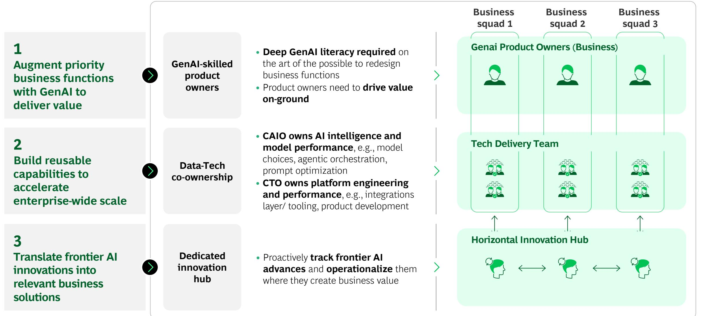

## Set up a GenAI COE for three key purposes

## Augment priority business functions with GenAI to deliver value

## Build reusable capabilities to accelerate enterprise-wide scale

## Translate frontier AI innovations into relevant business solutions

## GenAI-skilled product owners

\- Deep GenAI literacy required on the art of the possible to redesign business functions

• Product owners need to drive value on-ground

## Data-Tech co-ownership

\- CAIO owns AI intelligence and model performance, e.g., model choices, agentic orchestration, prompt optimization

\- CTO owns platform engineering and performance, e.g., integrations layer/ tooling, product development

Dedicated
innovation
hub

• Proactively track frontier AI advances and operationalize them where they create business value

## BCG experts Key contacts for AI-First Retail Banks

## Key BCG experts for AI in Financial Institutions

## Bharat Poddar

MD & Sr. Partner
Retail Banking
Global Lead
New York

## Aparna Kapoor

MD & Partner
AI in Wealth
Singapore

## Lorenzo Fantini

MD & Sr. Partner
Al in Fin Crime
Milan

## Peshotan Kapadia

MD & Partner
Conversational Banking
Mumbai

## Author Team

Nipun Kalra
Kalra.Nipun@bcg.com

## Nipun Kalra

MD & Sr. Partner,
AI @ FI Global Lead-
Retail Banking
Mumbai

## Anne Kleppe

MD & Partner
AI in Compliance
Berlin

## Lukas Haider

MD & Sr. Partner
AI in Operations
Vienna

## Semih Durmus

MD & Partner
AI in Credit
Minneapolis

## Stiene Riemer

MD & Partner
AI @ FI Global Lead-
Wholesale Banking
Munich

## Javier Perez Moino

MD & Partner
AI in Customer Acquisition
Madrid

## Matthew Barton

MD & Partner
AI in Collections
Philadelphia

## Yogesh Mishra

MD & Sr. Partner
AI in Tech
Dallas

## BOG