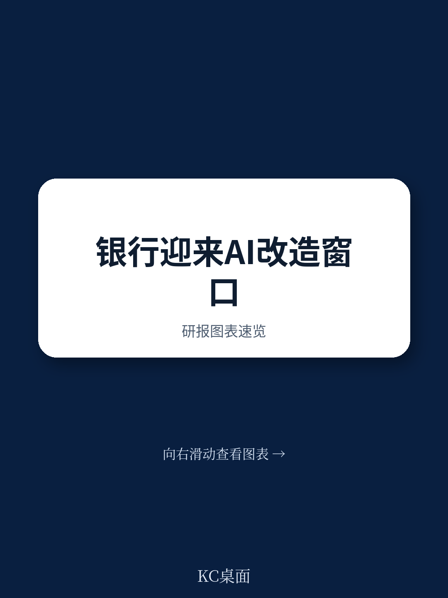
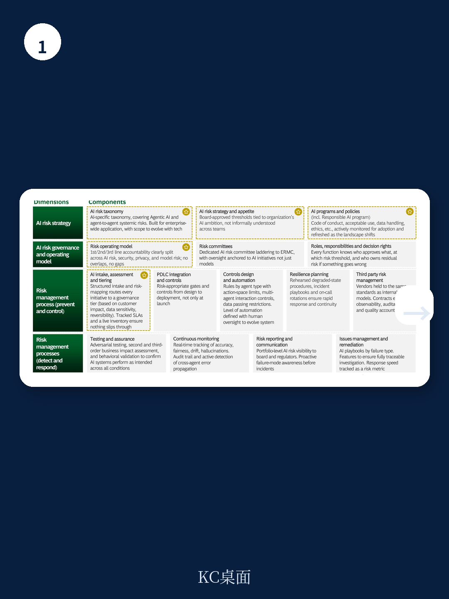
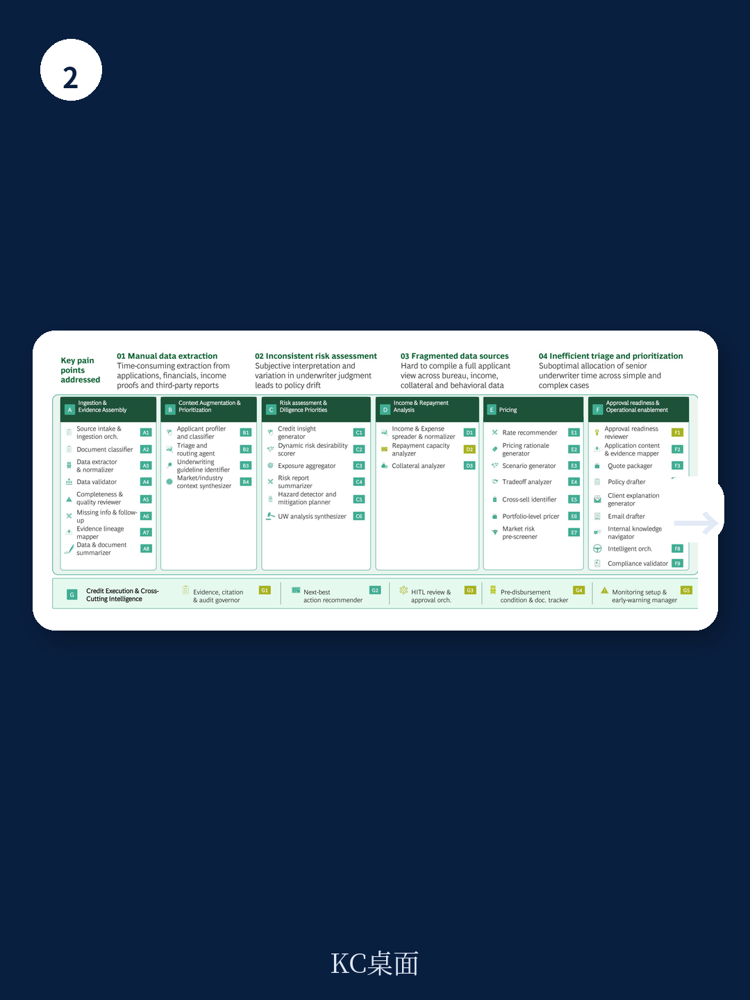

# 波士顿咨询：零售银行真正的AI红利，不在降本，而在重新定义客户关系

过去两年，几乎每一家零售银行都在谈生成式AI。但波士顿咨询这份题为《AI-First Banks Are Rewriting the Rules of Retail Banking》的研报，给出了一个值得所有银行决策者停下来思考的判断：真正拉开差距的，不是谁先用上了大模型，而是谁能把AI嵌入到“获取客户、服务客户、执行交易”三大核心流程中，并以此重构银行与客户之间的关系。

这不是一份罗列技术趋势的报告。它更像一份“AI-first银行”的作战手册：哪些投入真正产生了可量化的业务结果，哪些做法只是“拿着锤子找钉子”，以及最关键的一点——为什么大部分银行的AI价值仍然停留在零散用例，而少数银行已经开始在营收、成本、客户深度上实现系统性跃迁。

以下是我们基于这份报告的核心提炼与解读。

## 1. 零售银行的结构性优势，正在被消费端的AI体验倒逼

零售银行之所以被波士顿咨询视为AI部署的“天然沃土”，有三个结构性原因：数字化程度相对较高、数据资产丰富（尽管被遗留系统束缚）、以及客户对AI应用的接受度正在快速提升。

但报告同时点出一个令人不安的现实：零售消费者正在用“购物、旅行、数字媒体”领域的AI原生体验来对标银行服务。当ChatGPT可以在几秒内给出投资建议，当电商平台可以基于用户行为实时调整推荐，银行如果还在用“我们正在测试AI客服”来回应，客户耐心正在快速耗尽。

> **KC评论：** 这其实是零售银行目前最容易被低估的风险。消费者不会因为你是银行就降低预期。波士顿咨询的数据显示，64%的用户已经在用AI做购买决策。这意味着，如果银行在搜索、推荐、交互体验上无法达到“AI原生”水准，用户流失可能不是渐进式的，而是断崖式的。

## 2. 六个“规模化陷阱”，解释了为什么大部分银行被困在POC阶段

报告明确指出，虽然零售银行在AI部署上具备先天优势，但价值的规模化远未实现。波士顿咨询总结了六个关键障碍，这些障碍不是技术问题，而是组织与战略问题：

第一，停留在微用例层面。很多银行做了几十个“AI小工具”——智能FAQ、通话摘要生成——但每个用例带来的价值微乎其微，且无法形成系统效应。

第二，缺乏与价值指标的预先挂钩。AI项目启动时没有明确对应到营收、成本、客户留存等核心KPI，导致后期无法判断是否值得继续投入。

第三，CEO参与度不足。AI转型如果只是CTO或CDO的事，跨部门协调必然陷入僵局。

第四，急于交付短期价值，导致建设了大量不可复用的点状方案。

第五，GenAI能力集中在数据科学团队，业务部门对AI的理解参差不齐。

第六，风控与合规流程在项目后期才介入，导致上线节奏不可预测。

> **KC评论：** 这六点其实揭示了同一个核心问题——很多银行把AI当作“技术项目”来管理，而不是“业务转型”来驱动。波士顿咨询的潜台词很明确：AI-first银行的真正门槛不在算法，而在组织能否把AI议题提升到CEO桌面上，并从一开始就建立“价值导向、产品思维、风险内嵌”的治理框架。

## 3. AI-first银行正在兑现的量化回报：从获客到服务到运营

报告用大量数据展示了“AI-first银行”在三个核心环节的实际回报，这些数字值得仔细拆解。

在获客端，AI-first银行实现了超过40%的新客销售提升。关键在于它们不是简单地用AI做广告投放优化，而是构建了一整套“客户智能与增长引擎”：用合成客户画像验证产品设计、用生成式搜索引擎优化可见性、用智能代理自动优化媒体投放、用AI驱动的实验框架将每月测试量提升5倍。

在服务端，最引人注目的变化是“语音机器人处理了超过70%的人工通话量，成本仅为传统方式的五分之一”。但报告强调，这不仅仅是降本故事。AI-first银行正在从“被动响应”转向“主动洞察与个性化互动”——每个客户都拥有一个“永远在线的个人客户经理”，能够捕捉每一次交互上下文，主动提供解决方案，将客户关系深度提升20%-40%。

在运营端，报告提到的“隐形运营”概念值得关注。通过智能代理处理非标准化文件、自动路由、实时监控，银行实现了70%的周转时间缩短、5-10倍的报价速度提升、以及最高50%的金融犯罪合规成本下降。

## 4. 真正稀缺的能力：不是技术，而是“业务功能的重构”

波士顿咨询在报告中反复强调一个观点：AI-first银行不是在做“AI+银行”，而是在做“银行功能的AI化重构”。

这意味着，银行需要从“工作性质”而非“人数”出发来重新设计流程。重复性任务交给AI，推理任务由AI辅助，人类专家只介入真正需要判断力的环节。报告举了一个生动的例子：在信贷审核中，AI驱动的承保引擎不仅压缩了决策周期，还能从组合结果中迭代学习，让信贷政策本身变得更聪明。

但报告也坦诚指出，这种重构需要银行同时具备两个条件：一是“产品思维优先于平台思维”——先定义可复用的AI产品能力，再考虑技术平台；二是“从Day 1就设计风险控制流程”，而不是等产品上线前才补课。

## 5. 一个尚未完全回答的问题：AI-first银行的护城河到底在哪里？

读完整份报告，一个关键问题仍然悬而未决：如果所有银行都开始复制这些做法，AI-first银行的竞争优势能持续多久？

报告提供了部分答案。它强调“基础能力”的重要性——包括数据驱动决策、跨团队协作、测试学习文化、端到端测量跟踪——并指出没有这些基础，直接追求高级AI能力会让银行倒退约15%的营销成熟度。但报告也承认，借助GenAI，打好这些基础的时间已经从五年缩短到一年以内。

这意味着，早期的窗口期正在收窄。如果所有银行都能在一年内补齐基础，真正的差异化将来自两个层面：一是“业务重构的深度”——谁能把AI嵌入到最核心的信贷、风控、产品设计流程中；二是“组织学习的速度”——谁能更快地让业务团队掌握AI能力，形成自下而上的创新动力。

> **KC评论：** 这也正是我们每天在跟踪的关键变量。AI在零售银行业的应用正在从“技术竞赛”演变为“执行竞赛”。波士顿咨询的报告给出了路线图，但每家银行的起点、组织文化、监管环境不同，最终的落地路径和速度也会截然不同。哪些假设正在被验证，哪些还未被验证，需要持续跟踪。

---

这份波士顿咨询的研报，为我们提供了一个审视零售银行AI转型的完整框架：从为什么必须做，到怎么做，再到哪些环节已经产生可量化的回报。但它也留下了一些值得持续追问的问题——比如，中国零售银行在数据生态、监管框架、客户行为上与欧美市场的差异，是否会改变这些结论的适用性？

我们每天会由AI agent与人工review相结合，生成国际投行与顶级咨询机构的中文摘要与KC评论，daily更新，约10-40页，同时包含当天最新数据图表合集。既方便喂给AI，也方便人工快速把握global market dynamics。如果你希望获得完整研报解读与原始图表，欢迎加入我们的社群继续讨论。

Personal reading notes and learning share only. Not investment advice.

