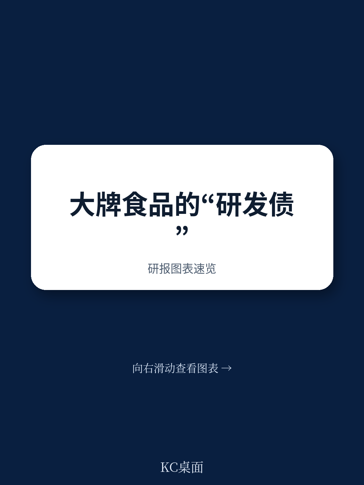
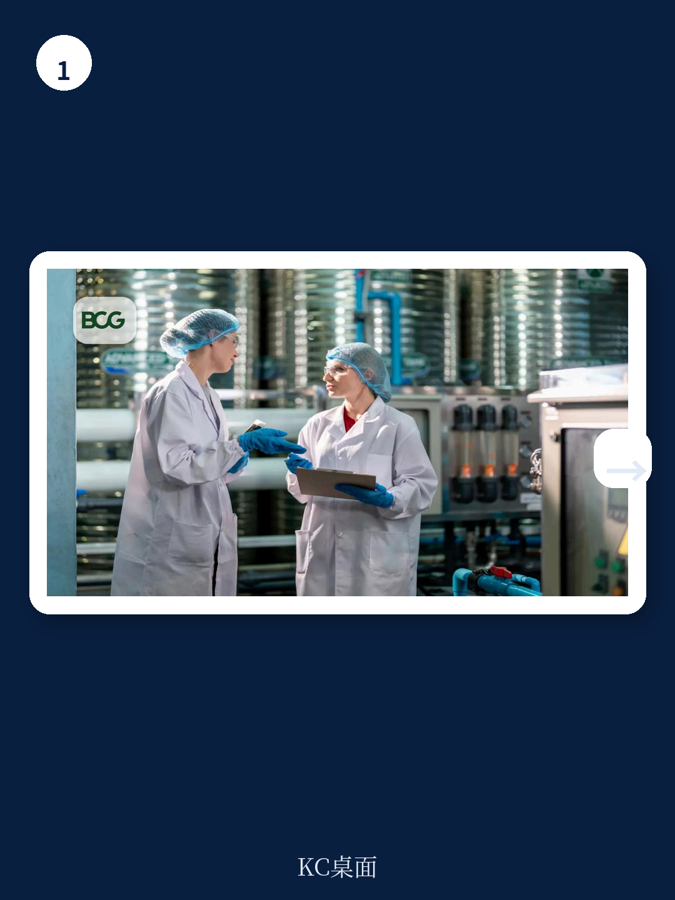
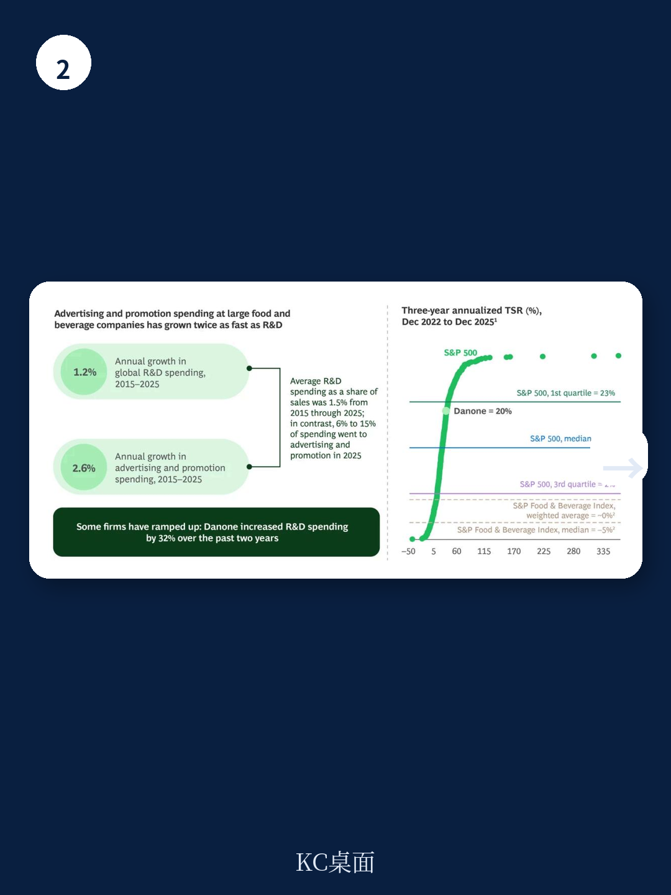

# 波士顿咨询：CPG巨头正在为“研发失落的十年”买单

大型消费品公司过去十年把6%到15%的营收投入广告，却只拿出1.5%做研发。这个战略选择，正在变成一场估值灾难。波士顿咨询（BCG）最新研报指出，从2022年底到2025年底，大型食品饮料公司的三年累计股东总回报中位数约为-5%，而同期标普500的累计总回报接近90%。表现最差的CPG公司，累计股东回报甚至低于-20%。

这不是周期性的业绩波动。这是结构性的战略清算。

BCG的报告标题直截了当：“Processed and Pressured: CPG's Lost Decade of R&D”。核心判断只有一个：消费者向更健康、更简单产品的结构性迁移，已经暴露了CPG巨头至少十年的研发投入不足。而过去依赖规模和营销肌肉的成功公式，正在加速瓦解。

> **KC评论：** 这份报告最有冲击力的不是数据本身，而是它把“研发投入不足”从一个财务指标提升到了战略清算的高度。它回答了一个关键问题：为什么CPG巨头在通胀、供应链危机等外部冲击过去后，仍然无法恢复增长？答案藏在1.5%的研发占比里。完整报告提供了跨行业对比图表，以及达能、雀巢等公司的具体案例拆解。

## 1. 1.5%的研发投入与6-15%的广告支出，这个剪刀差已经维持了十年

BCG的数据显示，从2015年到2025年，全球CPG行业平均研发投入仅占营收的1.5%。同期，广告和促销支出占比高达6%到15%。更关键的是，这期间全球CPG研发支出年均增速仅为1.2%，而广告和促销支出增速为2.6%，是研发的两倍多。

这不是某个季度的偏差，而是一个持续十年的战略选择。

对比其他行业，这个差距更加刺眼。根据纽约大学斯特恩商学院2026年1月的数据，制药行业研发投入占比21%，消费电子18%，软件16%至20%。行业比较或许不完全公平，但量级的差异无法回避。

BCG的言外之意很明确：CPG巨头不是在“投入不够”，而是在“用错资源”。它们把资金押注在维持品牌认知度上，而不是创造真正满足消费者新需求的产品。当预生物苏打水、植物基乳制品、GLP-1友好型零食等品类爆发时，创新者几乎全是挑战者和新进入者，而非在位巨头。

## 2. 超加工食品正在经历“三重打击”：消费者转向、监管收紧、渠道革命

BCG识别出三个正在加速的结构性趋势，每一个都在侵蚀CPG巨头的传统护城河。

第一，消费者健康意识觉醒，GLP-1药物的普及正在加速这一进程。BCG估计，目前美国有1600万GLP-1用户，到2030年将超过3000万。这些用户的卡路里摄入减少约30%，超加工食品的零食消费下降40%，约三分之一的食品支出转向营养补充剂、健身和美容。更关键的是，约70%的GLP-1用户家庭遵循相同的消费模式，这意味着需求变化的实际影响是用户基数的1.5倍。

第二，监管正在从警告走向行动。美国政府已推出新的膳食金字塔，不鼓励消费超加工食品和精制谷物。BCG预计这只是一系列政策干预的开始，包括强制食品标签、将超加工食品从SNAP等政府食品援助项目中移除。在州层面，近20个州提出了超过130项相关法案。

第三，AI驱动的数字化正在重塑消费者的选择方式。Yuka等食品健康评分应用在美国已有2500万用户，每月新增60万，且没有花一分钱广告费。当消费者可以即时获取产品的营养成分、添加剂信息和健康评分时，品牌溢价的空间被急剧压缩。

> **KC评论：** 这三点放在一起看，结论非常清晰：CPG巨头过去依赖的“品牌认知+渠道覆盖”模式，正在被“透明信息+消费者自主选择”的新范式取代。报告中有详细的品类市场份额变化图表，展示了从2021到2025年，大品牌在谷物棒、即食麦片等超加工食品类别中持续失守，份额流向小品牌和自有品牌。这些数据在完整报告中有更细分的拆解。

## 3. 多达1000亿美元的美国超加工食品收入面临颠覆风险

BCG给出了一个令人警醒的量化判断：美国超加工食品市场中，高达1000亿美元的收入可能因消费者行为变化、食品援助计划支出限制和政府机构采购变化而面临颠覆。

这个数字的构成包括：消费者购买行为的直接转变、SNAP项目中超过1000亿美元的超加工食品支出可能被重新配置、以及政府机构食品采购标准的改变。

与此同时，制造商的成本将增加5%到25%，原因包括：配方改良所需的研发投入增加、转向更昂贵的清洁标签原料、以及不断上升的营销和法律合规成本。

这是一个典型的“收入端承压、成本端上升”的双重挤压。BCG没有明说，但逻辑推演的结果是：利润率将面临系统性压缩，估值模型需要重新定价。

## 4. 报告没有完全回答的关键问题：这轮调整需要多长时间，最终格局会是什么样？

BCG的研报在诊断和方向性建议上非常扎实，但有一个关键问题没有完全展开：这场调整的时间表和最终格局。

报告提到了达能这个正面案例——过去两年研发支出增加约32%，实现了4.3%至4.5%的营收增长，ROIC重回两位数。但达能是一个特例，还是一个可以复制的模板？其他巨头如雀巢、百事、卡夫亨氏能否在3到5年内完成类似的转型？

另一个未解问题是：当所有巨头都开始增加研发投入、收购健康品牌、推出清洁标签产品时，竞争格局会如何演变？BCG指出百事以19.5亿美元收购了预生物饮料公司Poppi，雀巢启动了“Fuel for Growth”计划。但这些行动本身会推高优质标的的收购价格，也可能导致“清洁标签”变成又一个红海。

> **KC评论：** 报告的真正价值不在于给出确定答案，而在于提供了一个分析框架。它把“研发投入”从一个财务指标提升到了战略核心的位置。对于投资者和产业决策者来说，关键不是看公司说了什么，而是看它把多少自由现金流重新配置到研发上。完整报告中有更详细的“企业适应框架”图表，以及AI工具如何帮助公司评估品牌暴露度的具体方法。

## 5. 投资者的观察框架：从三个维度重新评估CPG公司的价值

基于BCG的分析逻辑，可以提炼出三个评估维度：

第一，研发投入的“质”与“量”。不仅要看研发占营收的比例，还要看这些投入流向了哪里：是防御性的配方微调，还是真正的新品类创造？是内部创新，还是高价收购外部品牌？收购后的整合能否保留被收购品牌的敏捷性和文化？

第二，产品组合的结构性风险敞口。BCG建议公司做“痛苦的诚实诊断”，在几周内而非几个季度内完成所有SKU的分类，评估每个产品对结构性格局的暴露程度。对于投资者来说，这意味着需要识别哪些品牌和品类面临消费者或监管的质疑，哪些可能受益于需求变化。

第三，资本配置的优先级变化。过去十年，通过分红和回购向股东返还自由现金流是CPG公司的主流价值创造工具。但现在，董事会讨论的核心变成了：如何在股东回报与研发、新能力和并购所需的再投资之间取得平衡。这个“平衡”的决策本身，就是判断管理层战略视野的最直接信号。

## 6. 下一步：从诊断到行动，但时间窗口正在收窄

BCG的建议路径很清晰：先做诚实的投资组合诊断，然后通过两条腿走路——一方面通过内部创新或并购进入高潜力新领域，另一方面对核心产品进行系统性配方改良。报告强调，这不是一个季度或一年的工作，而是需要“数年而非数季度”的持续投入。

但报告也隐含了一个紧迫的时间窗口：当更多公司开始行动，当监管加速推进，当消费者习惯已经形成，晚一步就意味着永久性的份额损失和利润率压缩。

对于那些还在等待“更多确定性”的公司，BCG的警告很直接：在预期比传统产品组合变化更快的市场中，延迟适应会迅速转化为份额损失和利润率侵蚀。

---

这份研报的价值在于，它不仅仅是对CPG行业的诊断，更是对“规模迷信”的一次解构。当消费者手中的信息工具越来越强大，当监管从建议走向强制，当GLP-1等外部变量开始系统性地重塑需求结构，规模不再自动等同于护城河。那些真正把研发从“成本项”重新定义为“增长引擎”的公司，才有机会在下一个十年重新定义竞争格局。

但BCG报告里还有很多没有展开的内容：比如不同品类之间风险暴露度的具体差异、AI工具在具体公司中的应用案例、以及那些“弱信号”如何被识别和放大。

Personal reading notes and learning share only. Not investment advice.

