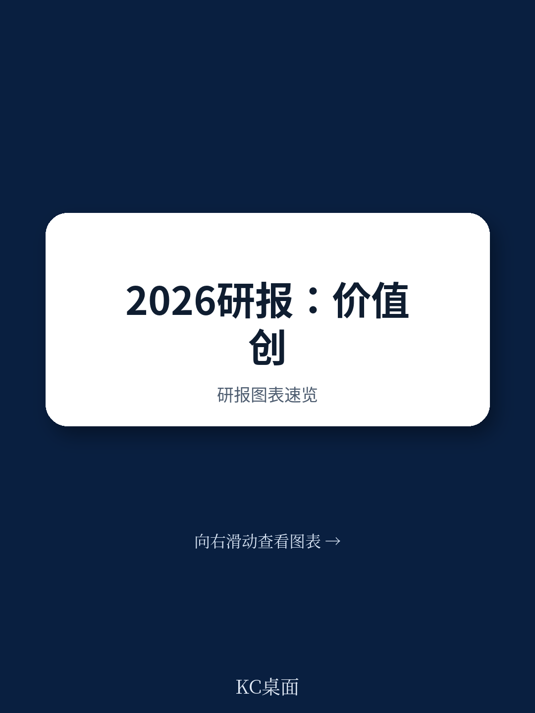
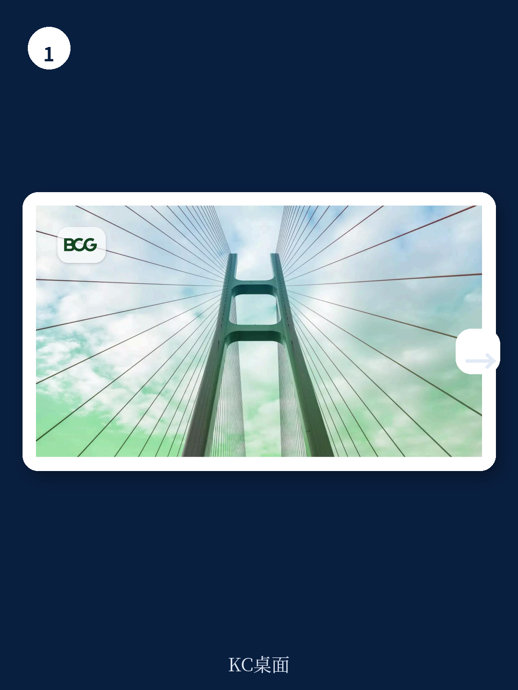
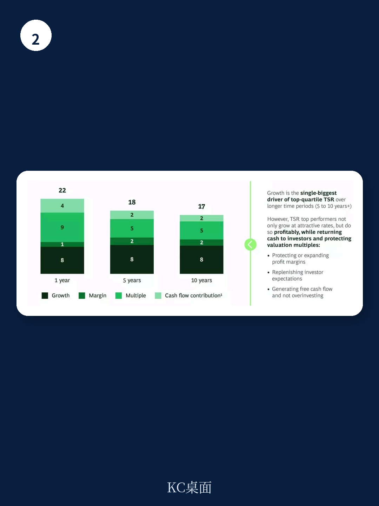

# 波士顿咨询：价值创造领导力已从科技转向重资产，这不是短期波动

全球股票市场在过去五年间实现了年均约12%的总股东回报（TSR），市场韧性超出多数投资者预期。但波士顿咨询（BCG）最新发布的2026年价值创造者排名揭示了一个更值得关注的结构性变化：引领市场回报的行业和公司，已经不再是过去十年投资者所习惯的那些。

这不是一次简单的板块轮动，也不是市场情绪的短期切换。BCG的报告明确指出，这是一场由AI部署阶段、地缘政治重构和资本成本重置共同驱动的价值创造领导力转移。对于产业决策者和长期投资者而言，理解这一转移的内在逻辑，比预测下一个季度的市场方向更为重要。

**这份报告最值得关注的判断是：资产密集型行业（矿业、油气、航空航天与国防、建筑、银行）已取代科技驱动型行业，占据了价值创造排名的顶端。而在科技板块内部，硬件和电子元件持续跑赢，软件与IT服务则从去年排名的第四位骤降至第31位。**

## 1. 这轮变化真正考验的是企业能否把规模转化为议价权

BCG的排名基于2021至2025年五年间的年均TSR，样本覆盖全球35个行业的2368家公司。报告发现，资产密集型行业的中位数TSR显著领先。技术硬件以20%的年均TSR位居榜首，建筑业16%、矿业15.8%紧随其后。相比之下，软件与IT服务的中位数TSR虽仍有15.7%，但排名从去年的第四位跌至第31位，降幅高达27个位次。

这一排名的剧烈变动，其背后力量并非市场情绪的随机漂移。BCG将其归因于三个结构性驱动力：

第一，AI价值当前正加速向物理基础设施层集中。AI部署的现阶段是资本密集型的，需要芯片、数据中心、电力基础设施和物理连接。硬件制造商、电子元件生产商和能源供应商是直接受益者。而软件公司面临的货币化路径则更为不确定——许多投资者预期的AI驱动收入增长尚未大规模实现，AI本身反而开始颠覆软件价值链的某些环节。

第二，地缘政治和贸易政策正在将资本引向有形资产。欧洲和亚洲的国防开支加速，能源安全成为战略优先事项，石油及其他原材料价格大幅上涨，供应链碎片化推动基础设施投资增加。这些趋势直接利好航空航天与国防、油气、矿业、金属和建筑行业——它们目前占据着前六大表现最佳行业中的五个席位。

第三，银行受益于高利率环境。持续的加息周期改善了金融机构的净息差，推动银行股估值上升。在通胀未回归至疫情前低位的背景下，投资者似乎预期这些顺风因素将超过对私人信贷风险的担忧。

> **KC评论：** 这三个驱动力并不是孤立的。它们共同指向一个核心逻辑：过去十年由“轻资产+高估值倍数”驱动的价值创造模式，正在被“重资产+现金流可见性”的模式部分替代。这对投资者的启示是，不应简单地将重资产行业视为“防御性”配置，它们当前具备的结构性顺风可能比许多成长型行业更可持续。完整报告中的TSR分解图表，详细展示了每个行业价值创造的具体来源——销售增长、利润率变化、估值倍数变化、股息、股份回购和净债务变化的贡献百分比，这些数据对于判断当前轮动的可持续性至关重要。

## 2. 软件行业的27位落差揭示AI货币化的真实瓶颈

软件与IT服务行业从第4位跌至第31位，是今年排名中最大的单一变动。这一变化值得深入审视，因为它触及当前市场最核心的叙事分歧：AI究竟在创造价值，还是在摧毁既有价值？

BCG的报告虽然没有直接给出结论，但其数据提供了重要线索。在TSR分解框架下，软件行业估值倍数变化的贡献正在收窄。这意味着，即便收入仍在增长，市场已经不愿意为同样的增长故事支付同样的溢价。

更深层的原因在于，AI对软件行业的冲击是双重的。一方面，生成式AI正在降低软件开发和维护的门槛，可能侵蚀传统软件公司的定价权和客户粘性。另一方面，AI部署所必需的算力、数据和基础设施成本，正在挤压软件公司的利润率空间。当投资者意识到，软件公司的AI故事更多是成本驱动而非收入驱动时，估值倍数的收缩就不可避免。

与此形成对照的是，技术硬件和电子元件行业的表现则说明，在AI的“军备竞赛”阶段，卖铲子的人比淘金者更早看到回报。芯片制造商、数据中心设备供应商、电力基础设施公司，这些处于AI供应链上游的企业，其收入可见性和现金流质量明显优于下游的软件应用层。

## 3. 行业排名不决定公司命运，但宏观环境确实在挑选赢家

BCG的报告有一个重要但容易被忽略的发现：在35个研究行业中，有32个行业的头部公司（前25%）实现了超过市场中位数12%的年均TSR。这意味着，即使处于排名垫底的行业，优秀公司依然能够创造超额回报。

这一发现对投资者的启示是双重的。一方面，它验证了“行业不是命运”这一经典命题——公司层面的战略选择、资本配置能力和运营执行力，始终是价值创造的核心变量。另一方面，它也提醒我们，宏观环境虽然不决定具体哪家公司胜出，但它确实在改变“赢家”的定义。

在一个价值创造领导力从科技转向重资产的环境中，过去被认为“笨重”的行业，其竞争壁垒和现金流稳定性反而成为稀缺资产。而过去被认为“轻巧”的科技行业，其增长故事的可信度正在受到质疑。这种环境变化，要求投资者和企业管理者重新审视自己的分析框架。

> **KC评论：** 这一发现对资产配置的意义在于：不要因为某个行业排名靠后就完全回避，也不要因为某个行业排名靠前就盲目追入。关键在于识别行业内头部公司相对于同行的竞争优势来源。BCG报告中的TSR分解工具，可以帮助投资者拆解每家公司的价值创造来源——是来自收入增长、利润率改善、估值倍数扩张，还是来自资本回报（股息和回购）？这种拆解能力，是判断公司价值创造可持续性的基础。完整报告中的交互式图表允许读者按行业、地区和公司规模进行筛选，这种颗粒度的数据是公开渠道难以获得的。

## 4. 当前市场最大的风险不是估值过高，而是“预期溢价”的不可持续

BCG的报告提出了一个令所有投资者都必须正视的数据：对于美国非金融公司而言，当前市场价值与基础基本面价值之间的“预期溢价”已达到1926年以来的最高水平，甚至超过了2000年互联网泡沫的峰值。

这一发现直接挑战了当前市场的主流叙事。尽管市场参与者普遍意识到估值偏高，但许多人将其解释为“AI革命带来的合理溢价”或“低利率环境的滞后效应”。BCG的数据则提供了另一种解读：这种溢价已经达到历史极端水平，而支撑它的假设——AI收入大规模兑现、利率持续下行、地缘政治风险可控——每一个都存在显著的不确定性。

对于企业管理者而言，这意味着一个两难选择：一方面，必须满足短期业绩预期以维持当前估值；另一方面，必须投资于长期机会以确保持续增长。两者之间的平衡，在当前的高预期环境下变得异常脆弱。

## 5. 报告尚未完全回答的关键问题：AI收入兑现的时点与路径

尽管BCG的报告对当前价值创造格局的变化提供了深刻洞察，但它也留下了一个关键问题没有完全展开：AI的收入兑现究竟何时会发生，以及会以何种路径实现？

报告指出，AI驱动的收入增长尚未大规模实现，但并未给出具体的时间预期或条件分析。这一不确定性恰恰是当前市场分歧的核心。如果AI收入在12-18个月内开始大规模兑现，那么当前软件行业的估值收缩可能只是暂时的调整。如果AI收入兑现需要更长时间，或者其收入规模远低于市场预期，那么软件行业可能面临更严重的价值毁灭。

这个问题的答案，将决定当前价值创造领导力转移是短期现象还是长期趋势。如果AI的货币化路径最终被证明是可行的，那么科技行业可能在未来几年重新夺回价值创造领导地位。如果AI的货币化持续低于预期，那么当前重资产行业的领先地位可能会进一步巩固。

> **KC评论：** 这是投资者当前最需要持续跟踪的问题。BCG的报告提供了一个分析框架，但没有给出答案。要回答这个问题，需要持续跟踪AI公司的收入结构变化、企业客户的AI投资回报率数据、以及AI基础设施的利用率指标。这些数据每周都在变化，但公开渠道的更新往往滞后。在我们的社群中，每天会由AI agent结合人工review，生成国际投行最新研报的中文摘要与KC评论，包含当天最新的行业数据和图表合集，既方便喂给AI模型，也方便人工快速把握市场动态。对于关注AI投资兑现节奏的读者，这种高频更新的信息流是不可替代的。

## 6. 决策者需要重新构建的观察框架：从“赛道”到“节奏”

基于BCG报告的分析，当前环境下决策者需要调整自己的观察框架。传统的“赛道思维”——选择一个高增长行业，然后买入行业龙头——在当前环境下可能失效。更具操作性的框架应该关注三个维度：

第一，价值创造来源的可持续性。使用TSR分解工具，识别公司价值创造的真正来源。是来自收入增长、利润率改善、估值倍数扩张，还是资本回报？每一种来源的可持续性不同，对应的风险特征也不同。

第二，资本配置的纪律性。在高预期环境下，能够克制冲动、不过度投资于低回报项目的公司，往往比那些试图“抓住每一个机会”的公司更值得关注。BCG的报告特别强调，当前环境下，公司需要像激进投资者一样思考——果断削减成本、调整资本配置优先级、重塑投资组合（包括通过剥离资产）。

第三，投资者基础的匹配度。BCG的报告提出了一个少有人讨论的观点：在预期溢价极高的市场中，投资者基础的质量本身就是一项战略资产。能够吸引并留住长期投资者的公司，其估值稳定性远高于依赖短期交易型投资者的公司。

**这三个维度共同构成一个更完整的分析框架。它不追求预测下一个赢家行业，而是帮助决策者在不确定性中识别那些具备“反脆弱”特征的公司——无论宏观环境如何变化，它们都有能力创造超额回报。**

---

BCG的2026年价值创造者排名揭示了当前市场最深刻的矛盾：市场整体是强劲的，但创造价值的逻辑正在发生根本性转变。那些能够理解这一转变、并据此调整战略的公司和投资者，将在下一轮竞争中占据有利位置。

然而，这份报告也留下了一系列未解问题：AI的货币化路径何时清晰？预期溢价何时会回归均值？地缘政治和贸易政策的演变将如何进一步重塑行业格局？这些问题没有标准答案，但持续跟踪和讨论是应对不确定性的唯一方法。

如果你想继续深入阅读BCG这份报告的完整解读，包括35个行业的详细排名、TSR分解数据、以及历史对比图表，欢迎加入我们的社群。每天，我们会由AI agent结合人工review，生成国际投行最新研报的中文摘要与KC评论，包含当天最新的数据图表合集，约10-40页，既方便喂给AI，也方便人工快速把握市场动态。在信息密度和时效性上，这是一个传统研究报告无法替代的工具。

Personal reading notes and learning share only. Not investment advice.

