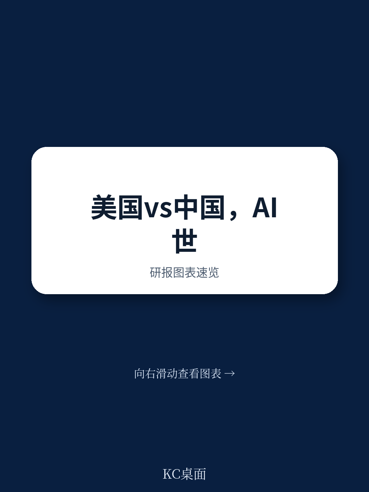
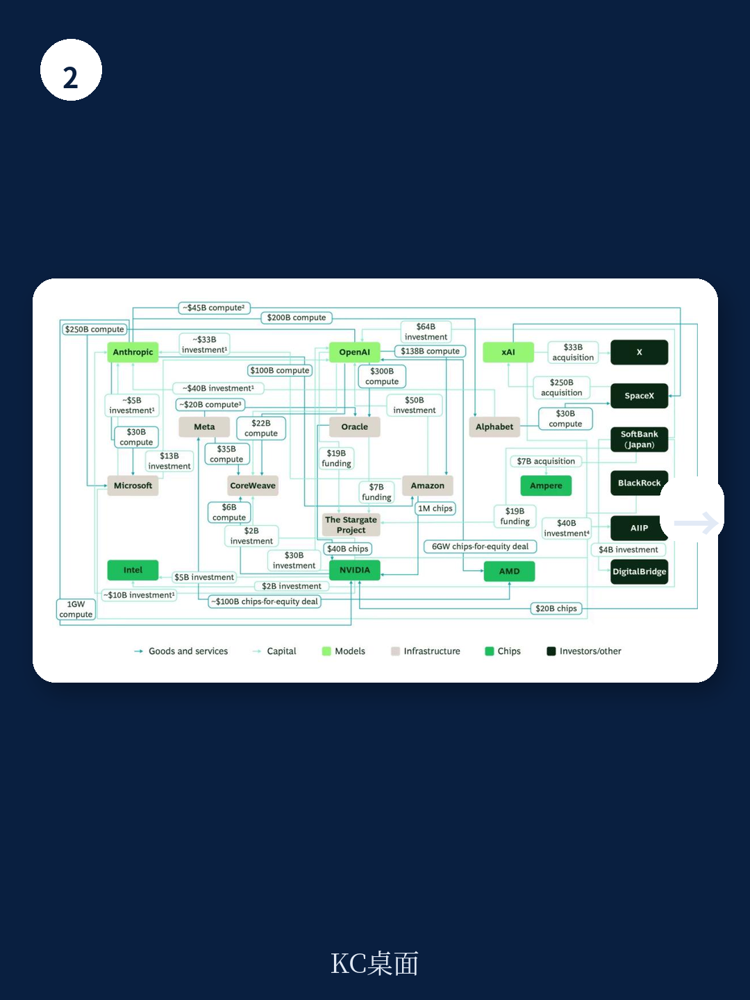

# 波士顿咨询：中美AI正在分裂世界，企业必须选边站

2026年6月，波士顿咨询发布了一份长达15页的研报，标题直白得有些残酷：“The Great Divide: How the US and China Are Splitting the AI World”。这不是关于技术路线差异的温和讨论，而是一份关于“技术主权”如何重塑全球商业格局的硬核分析。

报告最值得关注的判断只有一个：中美AI技术栈正在从“可兼容”走向“不可兼容”。2024年，企业还能在两个生态之间灵活切换；到了2026年，这种中立空间正在急剧收窄。对于全球CEO和政策制定者而言，选边站的时间窗口正在关闭。

这份报告的核心证据来自六个维度的量化对比——资本、人才、知识产权、数据、能源、算力。波士顿咨询的结论是：美国在资本部署和人才密度上保持领先，中国在算力追赶和实体经济渗透上加速逼近。但真正重要的不是谁领先，而是两个生态正在各自形成闭环，彼此依赖度持续下降。

> **KC评论：** 波士顿咨询这份报告的价值不在于告诉你“美国领先还是中国领先”，而在于它用数据证明了“两个生态正在互斥”。对于企业来说，这意味着过去那种“在美国买芯片、在中国做应用、在东南亚部署”的全球化AI策略，可能很快就不成立了。完整报告里有一张非常关键的“生态系统互锁图”，展示了美国科技巨头之间超过1.5万亿美元的交叉投资和商业承诺，这张图值得仔细看。

## 1. 美国策略：用资本堆出规模，但系统性风险正在累积

美国AI策略的核心逻辑是“赢在规模”。这听起来像一句口号，但波士顿咨询用数字给出了具体定义：2025年美国前20大科技公司的资本支出超过4000亿美元，2026年预计突破8000亿美元。相比之下，中国同口径的数字是630亿美元和预计增长后的规模。

这种资本密度在全球是独一无二的。美国AI创业公司自2023年以来累计获得约3800亿美元的VC投资，科技巨头2024年单年研发投入超过3000亿美元。这些钱主要流向两个方向：前沿模型开发和数据中心基础设施。

但报告揭示了一个容易被忽视的结构性特征：美国AI生态正在形成一个“自我强化的闭环”。自2024年以来，美国AI实验室、芯片设计公司、云服务商和资本方之间，已经宣布了超过1.5万亿美元的交叉投资和商业承诺——包括股权、多年算力合同、芯片采购协议等。这种深度绑定让生态系统内部高度协同，但也意味着系统性风险高度集中：任何一家主要参与者的违约、减记或供应中断，都可能迅速传导至整个生态。

> **KC评论：** 波士顿咨询在这里点出了一个反常识的判断：美国AI生态看似强大，但它的“互锁结构”可能比表面看起来更脆弱。完整报告里有一张非穷尽性的生态系统图，列出了OpenAI、微软、英伟达、甲骨文等公司之间的具体交易金额和结构。如果你正在评估对美股AI产业链的投资，这张图是必读的。

## 2. 中国策略：用成本优势跑通“快速跟随”路径

与美国“堆资本”的路径不同，中国AI策略的核心是“降成本、促采用”。这个策略的起点是2025年1月DeepSeek R1模型的发布——一个在算力受限条件下、以极低成本实现接近前沿性能的模型。

波士顿咨询的数据显示，2025-2026年，中国前沿模型的推理成本已经降至美国的约十分之一。这种成本优势不是偶然的，而是系统性的：中国在芯片设计上加速国产替代，在模型架构上追求效率优化，在应用层面则全力推动AI向实体经济渗透。

报告特别指出，中国在“知识产权”维度上已经形成了一套系统性的“快速跟随”能力。这不是简单的模仿，而是通过大量专利积累和高质量论文产出，建立了一个可以快速吸收、消化并再创新的技术底座。在波士顿咨询的评估框架中，中国在AI专利数量和质量上都已经接近美国水平。

> **KC评论：** 中国策略的核心优势不是“追赶”，而是“差异化”。美国在追求“最强模型”，中国在追求“最便宜可用模型”。这种差异意味着，未来可能会出现两个并行的AI生态：一个服务于高价值、高成本容忍度的应用场景，另一个服务于大规模、成本敏感的应用场景。完整报告对这两个生态的成本结构有详细拆解，值得细读。

## 3. 算力：真正的瓶颈不是芯片，是电力和时间

报告中最值得关注的细节之一，是对“算力”维度的拆解。波士顿咨询将算力分解为两个指标：现有数据中心容量（以GW计）和获取最先进芯片的能力。

截至2025年底，美国数据中心容量超过50GW，中国31GW，欧盟12GW。表面上看，美国优势明显。但报告指出，真正的瓶颈不是芯片供应，而是电力基础设施的交付时间。在美国，新建一个50MW数据中心从申请到并网的平均等待时间正在拉长；日本等国家甚至因为电网容量不足而面临更严重的延迟。

这意味着，即便资金充裕，算力扩张也有物理上限。波士顿咨询的判断是：未来2-3年，全球算力供给的增速可能会低于市场预期，这将对所有依赖大规模算力的商业模式形成约束。

> **KC评论：** 这里有一个容易被忽略的投资含义：如果算力扩张受限于电力基础设施，那么电力设备和电网改造相关公司可能会成为AI产业链中更具确定性的受益者。完整报告对各国电力成本和并网时间有详细的对比数据，这些数据对于判断不同地区的算力部署节奏非常关键。

## 4. 报告没有完全回答的问题：技术栈分叉的速度和深度

波士顿咨询的这份报告在逻辑上是完整的，但它留下了一个关键问题没有充分回答：中美技术栈的“分叉”会以多快的速度、多深的程度发生？

报告提到，2024年时企业还能在两个生态之间“混搭”，但到了2026年，这种中立空间正在收窄。然而，报告并没有给出一个明确的时间表。是2年、5年还是10年？这个速度取决于多个变量：出口管制政策的演变、技术突破的节奏、以及第三方国家（如欧盟、日本、印度）是否能够建立自己的“第三极”AI生态。

报告在方法论部分承认，其分析框架主要聚焦于“AI供给”的六个维度，而没有深入评估“需求侧”的分化——即不同国家和地区对AI应用的实际需求差异。这意味着，技术栈的分叉可能比供给侧的量化指标所暗示的更快或更慢。

> **KC评论：** 这是报告最值得追问的地方。如果技术栈分叉的速度比预期快，那么企业的“选边站”决策窗口可能只有12-18个月。完整报告中有一个关于“非超级大国替代方案”的讨论，分析了欧盟、日本、印度等地区是否可能成为第三极——这个判断对于跨国公司的供应链布局至关重要。

## 5. 给决策者的三个观察框架

基于波士顿咨询的分析，对于正在制定AI战略的企业决策者，有三个观察维度值得持续关注：

第一，你的AI技术栈是否具备“冗余性”？报告提出了三个原则：冗余（有备选方案）、模块化（单层冲击不传导）、异质性（备选方案不暴露在同一风险下）。这听起来像是IT架构原则，但在中美技术栈分叉的背景下，它已经变成了地缘政治风险管理工具。

第二，你的AI应用场景对“成本”和“性能”的敏感度如何？如果你的业务对模型性能要求极高、成本容忍度也高，那么美国生态可能是唯一选择。如果你的业务需要大规模部署、成本敏感，那么中国生态的成本优势可能更具吸引力。

第三，你的业务地理分布是否与AI技术栈的地理来源匹配？如果你在中国市场运营，使用美国云服务商可能会面临数据合规和供应链风险；反之亦然。报告明确指出，“选择哪个AI技术栈，越来越意味着决定公司能在哪里运营”。

> **KC评论：** 这三个框架中，第三个可能是最容易被低估的。波士顿咨询在报告中没有展开讨论的是：如果一家跨国公司在多个市场运营，它可能需要同时维护两套AI技术栈——这不是成本问题，而是合规和运营连续性问题。完整报告对“如何建立AI韧性”有更具体的操作建议，包括如何评估不同技术栈层的暴露度。

## 6. 未解问题与持续跟踪

波士顿咨询的这份报告为理解中美AI分化提供了一个扎实的分析框架，但它也留下了几个需要持续跟踪的问题：

第一，美国生态的“系统性风险”是否会触发连锁反应？报告提到，美国AI生态系统内部超过1.5万亿美元的交叉投资和商业承诺，构成了一个高度互锁的结构。如果某个环节出现意外（例如，一家主要AI实验室的估值大幅回调，或一家芯片供应商的供应中断），这个结构会如何反应？目前没有历史参照。

第二，中国的“成本优势”能否持续？DeepSeek R1的成功部分得益于特殊的模型架构优化，但这种优化是否有天花板？如果美国在模型效率上也取得突破，中国的成本优势可能会被侵蚀。

第三，第三方国家会如何选择？欧盟、日本、印度、东南亚国家都在制定自己的AI战略。它们是否会选择“站队”，还是会尝试建立“第三极”？这个选择将直接影响全球AI生态的最终格局。

这些问题的答案，可能在未来12-18个月内逐步显现。对于企业决策者而言，现在需要做的不是“预测”，而是“准备”——建立冗余、保持模块化、确保异质性。

---

以上分析基于波士顿咨询2026年6月发布的研报《The Great Divide: How the US and China Are Splitting the AI World》。完整报告包含更多关键图表：六维度量化对比雷达图、中美科技公司资本支出趋势对比、美国AI生态系统互锁图、以及各国数据中心容量和电力成本对比数据。

我们每天会由AI agent+人工review生成国际投行中文摘要与KC评论，daily更新，约10-40页，也包含当天最新数据图表合集，既方便喂给AI，也方便人工快速把握market dynamics。如果你对这份报告的完整解读和原始图表感兴趣，欢迎加入社群，获取完整的研报解读与持续跟踪。

Personal reading notes and learning share only. Not investment advice.

