## Cybersecurity in the Age of AI

Building a Synchronous BFSI Enterprise

MAY 2026

## BCG

Boston Consulting Group partners with leaders in business and society to tackle their most important challenges and capture their greatest opportunities. BCG was the pioneer in business strategy when it was founded in 1963. Today, we work closely with clients to embrace a transformational approach aimed at benefiting all stakeholders— empowering organizations to grow, build sustainable competitive advantage, and drive positive societal impact.

Our diverse, global teams bring deep industry and functional expertise and a range of perspectives that question the status quo and spark change. BCG delivers solutions through leading-edge management consulting, technology and design, and corporate and digital ventures. We work in a uniquely collaborative model across the firm and throughout all levels of the client organization, fueled by the goal of helping our clients thrive and enabling them to make the world a better place.

## DSCI PROMOTING DATA PROTECTION

Data Security Council of India (DSCI) is a not-for-profit, think tank on data protection, cyber security and critical technologies in India, setup by Nasscom, committed towards making the cyberspace safe, secure and trusted by establishing best practices, standards and initiatives in cyber security and privacy. DSCI works together with the Government, law enforcement agencies, defense, industry sectors including IT-BPM, BFSI, CII, Telecom, and other think tanks for public advocacy, thought leadership, capacity building and outreach initiatives.

<table><tr><td colspan="2">Cybersecurity in the Age of AI</td></tr><tr><td colspan="2">Foreword</td></tr><tr><td></td><td>Vinayak GodseChief Executive Officer, Data Security Council of India</td></tr></table>

Cybersecurity in the Age of AI

## Foreword

## Nisha Bachani

Managing Director and Partner, Boston Consulting Group

India's BFSI sector has been at the forefront of digital and technology adoption. Digital channels now mediate majority of customer interactions across banking, insurance and capital markets, and the operational transformation in this sector has seen material advancements in the last decade. Few sectors operate at this scale, velocity, and with this density of interconnections.

Into this landscape, artificial intelligence has arrived as the defining force and is reshaping cybersecurity fundamentally on both sides of the line. It is putting sophisticated defense capabilities within reach of any institution that chooses to adopt them, while simultaneously collapsing the cost, skill and time required to mount sophisticated attacks. Exploit windows that once ran into months are being measured in days. For the first time, the offensive side of the cyber curve is scaling faster than the defensive side, and adversaries are deploying the same frontier capabilities

Indian BFSI faces a sharper version of this challenge than almost any peer – due to the nature of data, complex web of related parties, impact of breach and potential losses that will emerge. Attack intensity is materially higher in Indian BFSI than in global markets, the ecosystem is more interconnected, and risks are rising fast - the opportunity cost and losses due to cyber attacks now materially outweigh the investments and effort in planning the defense. While AI adoption is picking pace, AI-specific security controls still have some ground to cover. The strategy cannot be more compliance, it has to be stronger capabilities, better governance and controls.

We are delighted to launch this report as a product of the partnership between BCG and the Data Security Council of India. It draws on a survey of Indian and Global CISOs, structured conversations with senior leaders across BFSI, and BCG's broader experience in cyber and financial services.

Our study shows Indian BFSI's technical foundations have strengthened, but the threat environment has outpaced them. Cyber leaders remain deliberate about many initiatives and rightly maintain human-in-the-loop governance even as AI-native defense becomes essential. However, few structural gaps still remain - spanning risk quantification with a business & customer impact lens, third-party linked resilience, recovery readiness, talent and others. These risks need to be addressed in a coordinated rather than siloed way. The new operating model will be a lot more “synchronous” with Cyber defense aligned across stakeholders and not just limited to CISO/CIO.

For boards and chief executives, investments in this space are going to be more crucial than ever before and will differentiate the leaders & build greater customer confidence. Institutions that move decisively over the next twelve to eighteen months will define how the rest of the decade plays out, and will be positioned to lead in an AI-driven financial system.

We are grateful to the industry leaders who gave us their valuable inputs in shaping these perspectives and to DSCI for partnering to bring this to light. We look forward to your engagement on this and hope you find it an insightful read!

<table><tr><td colspan="2">Cybersecurity in the Age of AI</td></tr><tr><td colspan="2">Executive Summary (I/II)</td></tr><tr><td>Indian BFSI is at a cyber inflection point – and the gap is widening faster than most organizations are recognizing.</td><td rowspan="2">76% of Indian BFSI CISOs rank AI-enabled attacks as a top-4 priority.69% expect significant impact within 12 months. However, no single control area in our survey crossed the 50% confidence threshold for readiness against an AI-enabled breach.71% of Indian BFSI firms have already reached AI-assisted SOC maturity or higher43% of Indian CISOs say attackers are already moving faster than their defenses – but only 19% have increased cyber budgets by more than 10% to respond</td></tr><tr><td>India’s BFSI is attacked 1.6x more intensely than the global average. Cyber incidents have more than doubled in four years – 1.4 million (2021) to 2.9 million (2025). Breach costs are rising +7% YoY to USD 2.5 million and at the same time, mean time to contain a breach in India is at 263 days and still climbing. The mid-tier Indian BFSI sits in the most exposed position: they have digitized aggressively, are deeply interconnected, but their cyber investments are much smaller than larger players</td></tr><tr><td>The biggest shift is on the attackers’ side. AI has rewritten the economics of offense:Time to exploit: 745 days → 44 days (-94%)Cost of attack: down by 70%+</td><td>To be truly ready, every BFSI institution must now simultaneously curb AI-powered attacks, deploy AI for defense, and secure its own AI systems – as one unified effort.</td></tr><tr><td>Our survey of 40+ Indian BFSI CISOs and multiple direct interactions with the relevant stakeholders revealed a strong intent to action on the AI-oriented cybersecurity agenda, but with some gaps in policy and execution</td><td>AI, however, is only the accelerant. Foundational cyber resilience in Indian BFSI is finding it difficult to keep pace with the digital scale of operations</td></tr></table>

## Executive Summary (II/II)

<table><tr><td>Indian BFSI has built strong digital foundations. The institutions that act decisively on the remaining gaps over the next 12–18 months will define the sector&#x27;s resilience posture for the rest of the decade.
Our survey identified four areas where targeted action can deliver the highest risk-buydown:
• Investment headroom exists: 60%+ Indian BFSI currently directs less than 10% of IT spend to cyber - need to review cyber defense capabilities to ensure exposures are well-managed and within risk appetite
• Third-party risk is manageable with the right model: 55% cite it as a top concern, yet only 49% already have mature controls. Currently the gap is governance and continuity
• AI governance needs a boost: Only 29% have both an AI security owner and a defined policy
The path forward is not more controls – it is synchronicity. Indian BFSI&#x27;s next cyber operating model must shift from a security-function agenda to a synchronized resilience system across five fronts:</td><td>Business: Cyber priorities aligned with business priorities and risk – not an afterthought
Cross-functional teams: Business, Risk, Legal, IT and Security operating as one accountable unit – not serial handoffs
Vendors: Third parties governed as extensions of the enterprise, not managed annually at procurement
Humans: The attack surface inside and outside the bank defended as a single discipline – insider risk and customer fraud as one program
Ecosystem: Threat intelligence shared across peers, regulators and industry bodies – not captured in siloes
Attackers already operate as a coordinated economy. The institutions that match that coordination – synchronizing defense across all five fronts – will be the ones that turn cyber resilience into competitive advantage. Those that don&#x27;t will remain permanently reactive, defending yesterday&#x27;s perimeter against tomorrow&#x27;s threat.</td></tr></table>

## Table of contents

The Cybersecurity Imperative Scaling Threats and elevating 'Unknowns'

Reflection on Our Position
Voice of Global and Indian CISOs

Page 22

Path Forward
Five Fronts where Indian BFSI must Synchronize for a stronger Cyber Defense

## The Cybersecurity Imperative Scaling Threats and elevating 'Unknowns'

1. UK NCSC (April 2026)
Source: Information Security Incorporated, BCG analysis

Frontier AI can attempt a full enterprise network attack for \~USD 80 $^{1}$

## Cyber attacks have evolved over last 4 decades and AI is accelerating the sophistication

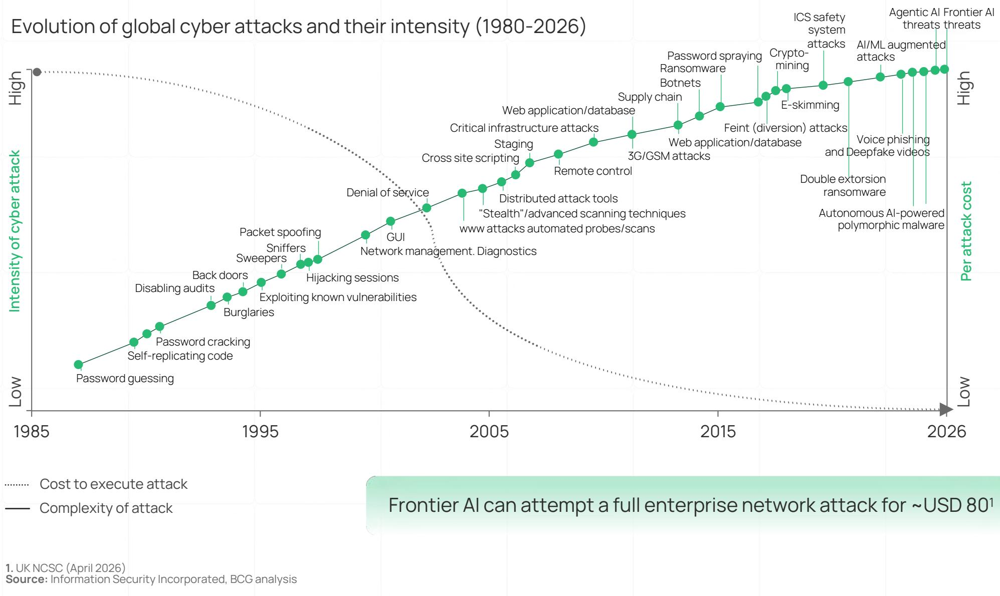

## India BFSI faces a steep challenge on managing cyber attack intensity

<table><tr><td></td><td></td><td></td><td>Global</td><td>India</td></tr><tr><td>Intensity</td><td colspan="2">Cyber attacks per organization (2025)1</td><td>1x</td><td>1.6x</td></tr><tr><td rowspan="3">Impact</td><td colspan="2">YoY change in average cost of a data breach (2024-25)2</td><td>-9% (to USD 4.4 Mn)</td><td>+7% (to USD 2.5 Mn)</td></tr><tr><td colspan="2">Mean time to identify and contain a data breach (March 2025)2</td><td>241 days</td><td>263 days</td></tr><tr><td colspan="2">Share of total attacks in BFSI sector (2025)3,4</td><td>27%</td><td>17%</td></tr><tr><td rowspan="2">Preparedness</td><td colspan="2">Percentage of BFSI leaders who consider AI related attacks as a top issue (2026)5,6</td><td>61%</td><td>76%</td></tr><tr><td colspan="2">Percentage of BFSI organizations investing &gt; 10% of IT spend on cybersecurity (2025)5,6</td><td>76%</td><td>38%</td></tr></table>

Source: 1. Check Point Cyber Security Report 2026 (Jan '25 – Dec'25); 2. IBM Cost of a Data Breach Report 2025 (Apr'24 – Mar'25); 3. IBM X-Force Threat Intelligence Index; 4. DSCI x Seqrite India Cyber Threat Report 2025/6; 5. BCG x GLG Global CISO Survey 2026, Banking and Securities + Insurance excl. health subset (N=53); 6. BCG x DSCI India CISO Survey (N=42); BCG analysis

## Cyber incidents in India have doubled in last 4 years BFSI has seen significant breaches

## Cyber incidents handled by CERT-In per year doubled in last four years in India (Mn / year) $^{1}$

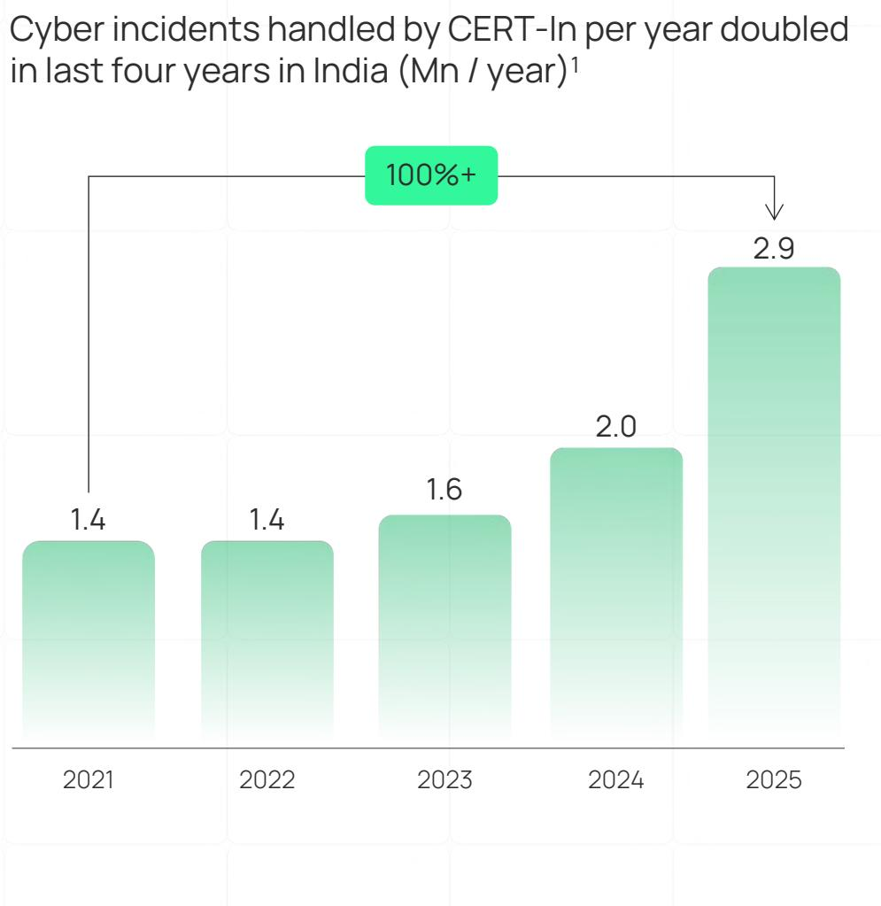

## Few Indian BFSI breaches in last 24 months

## Cloud misconfiguration exposes client data at top-3 retail brokers (February 2025) $^{4}$

Environment managed by a leading global cloud services provider was compromised, exposing client data on the dark web; huge erosion in market cap post event.

## Ransomware on shared tech vendor freezes 300 banks (July 2024) $^{4}$

A ransomware group exploited an unpatched DevOps automation server at a shared technology service provider, disrupting payment services for approximately 300 cooperative and regional rural banks.

## Sophisticated heist drains INR 2K Cr from one of India's largest crypto exchange (July 2024) $^{5}$

A multi-sig wallet was breached in a single coordinated attack, attributed to a state-sponsored threat actor, with funds laundered globally through crypto mixers.

The mid-tier in Indian BFSI — mid-size private banks, small finance banks, NBFCs, urban cooperative banks — sits in the most exposed position: they have digitized aggressively (and therefore have valuable data and payment rails) and are deeply interconnected through shared infrastructure. But their cyber budgets are a fraction of the large players

Note: CERT-In: Indian Computer Emergency Response Team

1. Cert-In Annual Report 2021, 2022, 2023, 2024, 2025; 3. Business Standard ( $3^{rd}$ March 2025); 4. Deccan Herald ( $31^{st}$ July 2024); 5. Business Today ( $14^{th}$ January 2025);

Source: Press releases and articles; BCG analysis

## 8 structural forces are raising BFSI cyber risk in India (I/II) Span across an increased attack surface, AI driven threats and other structural issues

## Digital Scale and Expanding Attack Surface

India's financial attack surface has expanded faster than any comparable economy. Over 1 billion Indians are now online, with 660 million smartphone users, a base that nearly doubled in six years.

## Surge in AI Driven Threats

AI tools have collapsed the barrier to entry for cyber attacks. Malicious LLMs enable low-cost, highly targeted attacks. The attacker advantage has shifted: speed of exploitation now outpaces speed of defense.

## Excessive Third Party Reliance

Indian financial institutions increasingly rely on shared 3 $^{rd}$ party technology providers for core operations.

A single vendor compromise can cascade across the entire chain.

## Legacy Systems

Legacy core systems running on extended patch cycles are structurally unable to respond to shorter exploit timelines.

Legacy systems typically are more exposed as well.

## >1 Bn

Internet users in India by end-2025 $^{1}$

## 90%+

Reduction in Time-to-Exploit with emergence of Al $^{2}$

Reduction in cost of attacks with Al $^{3}$

## 50%+

Of BFSI leaders report 3 $^{rd}$ party and supply chain risk management remains ad hoc or reactive $^{4}$

## <15%

Of BFSI CISOs report high confidence in managing unpatchable legacy and embedded systems $^{4}$

1. DataReportal Digital 2026: India; 2. Flashpoint 2026 Global Threat Intelligence Report; 3. Proxied on decrease in annual subscription cost of WormGPT; 4. BCG x DSCI India CISO Survey 2026 (N=42)
Source: BCG analysis

# 8 structural forces are raising BFSI cyber risk in India (II/II) Span across an increased attack surface, AI driven threats and other structural issues

## Talent Scarcity

There is a growing shortage of cybersecurity talent in both India and globally, driven not only by insufficient workforce capacity but also by a widening gap between skills and expertise needed.

## Limited Leadership Focus and Investment

Cyber is governed as an IT and compliance issue at several Indian financial institutions, rather than as an enterprise-wide risk.

Indian BFSI's cyber spend lags global peers, reinforcing the gap.

## Software Visibility Bottleneck

With 70–90% of modern software built on open-source libraries, vendor sub-dependencies and legacy systems, even mature Financial institutions find it difficult to maintain a complete, real-time inventory of what they run.

## Geopolitical Landscape

State-aligned threat groups and hacktivist networks escalate sharply around every flashpoint, and BFSI sits adjacent to the government and infrastructure they target.

## 90%+

Of organizations in India report cybersecurity talent gaps $^{1}$

## 40%+

BFSI CXOs report board oversight, cyber risk appetite measurement and reporting is ad hoc or reactive $^{2}$

## <17%

Of BFSI CISOs report high confidence visibility into third party and open-source dependency exposure $^{2}$

## 1.5 Mn+

Cyber attacks on Indian websites in a single fortnight after the May 2025 geopolitical flashpoint $^{3}$

1. DSCI Report – Indian Cybersecurity Product Landscape 3.0.; 2. BCG x DSCI India CISO Survey 2026 (N=42); 3. Road of Sindoor Report by Maharashtra Cyber Police Source: BCG analysis

## Vulnerability disclosures have grown 1.5x since 2024 with AI increasing the threat

Vulnerability disclosures have doubled since 2020, with the steepest acceleration in the last 24 months $^{1}$

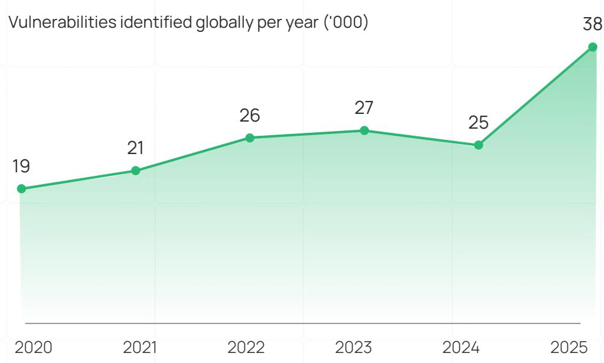

of these vulnerabilities could be exploited without authentication, significantly increasing the attack surface $^{1}$

## According to Indian CXOs, threat from AI-led attacks is real and fast evolving $^{2}$

Of Indian BFSI CISOs rank AI-enabled attacks as a top-4 priority for 2026

Believe AI-powered threats will have significant impact in next 12 months

## Third party and supply chain risks are now “first party” risks – AI increasing the potential risk of breach and impact

Supply chain risk is a growing priority for BFSIs....

\- Sophisticated financial players are increasingly relying on high levels of external FTEs and outsourced services (especially in cloud and data storage)

\- Even if an org is not the direct target of an attack, it can still be adversely affected by vulnerabilities introduced by $3^{rd}$ parties

• AI increases the risk of exploiting vulnerabilities and breach

...However complex challenges faced in managing these risks

## 1 Maintaining continuous visibility into third-party vendors and interdependencies

2 Assessing risk levels by vendor, small but highly connected vendors may pose significant risk

3 Managing access controls for third-party employees effectively

Securing cloud environments without over-reliance on providers

5 Strengthening threat intelligence for early detection and rapid response to third-party risks

6 Designing resilient processes, SLAs and architectures to build operations resilience against third-party risks

7 Effective incident response management to attacks

## 55%

Indian BFSI CXOs report third-party and supply chain risk as a top issue of focus $^{1}$

Concentration risk in Indian BFSI is no longer hypothetical — In a single incident, 300 banks went dark from a single shared-vendor breach in July 2024.

The discipline now has to shift from vendor-by-vendor diligence to systemic mapping of shared dependencies.

## Attack economics are changing fast – Time and cost to exploit has reduced materially

Shifting "bottleneck" - Time to exploit has reduced 90%+, collapsing available patching window for defenders $^{1}$

Average days from first disclosure to exploit

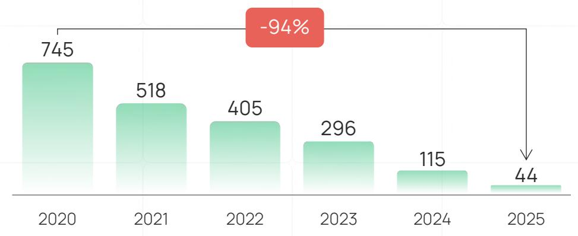

Cost of attack has reduced by 70%+, making attacks 'accessible'

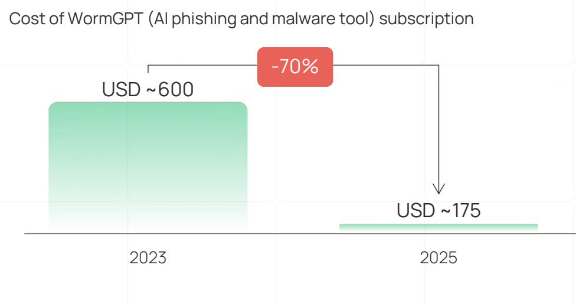

## “

While attacks can be done in days and hours now, our change & patch management still take 1-3 months. That speed asymmetry is the biggest battle.

CISO, Indian Mid-Sized Private Bank

## USD 80

Frontier AI can attempt a full enterprise network attack for USD \~80. $^{2}$

## USD 0.11

A small 3.6 Bn open-weight model, costing USD 0.11 per Mn tokens to run, successfully replicated the FreeBSD exploit. $^{3}$

1. Flashpoint 2026 Global Threat Intelligence Report; 2. UK NCSC (April 2026); 3. AISLE research (April 2026)  
Source: BCG analysis

## Example I Emerging frontier AI models can now find a 27-year-old zero-day at significantly low costs

<table><tr><td>Discovery is now faster, broader, and cheaper</td><td>Zero-day discovery has shifted from slow and specialized to fast and scalableWith new frontier models, vulnerabilities that survived decades of human security review can be identified for under USD ~50 in computeEngineers with no formal security training can now generate complete, working exploits from a simple prompt</td><td rowspan="4">Frontier models such as Claude Mythos and OpenAI GPT 5.5-Cyber are a potential step-change in how quickly vulnerabilities are identified and weaponized.When these capabilities reach open-source models, the risk becomes structural - guardrails fall away, access becomes universal and any attacker can run them without restriction.This introduces additional pressure on existing security fundamentals, which must be strengthened and operated in parallel.</td></tr><tr><td>Exploitation has become autonomous</td><td>While previous models had a &lt;1% success rate at autonomously developing exploits, frontier models now reportedly generated exploits in over 70% of trials including chaining low-severity vulnerabilities without human interventionAutomation is even exposing legacy systems and software maintained by small teams</td></tr><tr><td>Third party risk is amplified</td><td>AI-assisted reconnaissance can map institutional dependencies and identify the weakest vendor at a scale and speed no human team could matchA single compromised technology provider can cascade simultaneously across hundreds of institutions</td></tr><tr><td>Capability will rapidly diffuse</td><td>Capabilities emerged from broader improvements in coding and reasoning, suggesting a convergent trajectory across frontier labs and open-source ecosystems, rather than a single-vendor breakthroughComparable vulnerability-finding capabilities are expected to diffuse rapidly, with open-weight models estimated to reach parity within months</td></tr><tr><td colspan="3">Source: Anthropic announcements, press reports and articles and BCG analysis</td></tr></table>

Highly confident (tested, proven, would hold) Not Confident to Partially Confident

# Indian BFSI leaders show limited confidence in readiness for AI-enabled cyber incidents

Confidence in controls and operational capabilities to withstand an AI-enabled attack

Q. If your organization is attacked by a severe AI-enabled cyber incident in the next 6 months, how confident are you that each of the following controls and operational capabilities would hold?

<table><tr><td>Sandbox, container, and privilege boundary integrity</td><td>71%</td><td>29%</td></tr><tr><td>Non human identity controls (service accounts, API keys, agentic credentials)</td><td>66%</td><td>34%</td></tr><tr><td>Forensic evidence capture and preservation</td><td>63%</td><td>37%</td></tr><tr><td>Data protection and leakage controls</td><td>51%</td><td>49%</td></tr><tr><td>Containment and lateral movement prevention</td><td>54%</td><td>46%</td></tr><tr><td>Detection and investigation speed</td><td>61%</td><td>39%</td></tr><tr><td>Workforce identity and access controls</td><td>50%</td><td>50%</td></tr></table>

Indian BFSI's cyber defenses were built for human-paced threats and have not yet been tested against AI-enabled adversaries and in many cases, the impact is still unknown.

Recovery Time Objective (RTO), Recovery Point Objective (RPO) and the true blast radius of an Al-enabled incident need to be better quantified.

## Cybersecurity talent is a critical constraint, with AI widening the advanced skills gap

## The Global Story

## 4.8 Mn

Unfilled cybersecurity job positions globally in 2024, up 19% YoY, outpacing 0.1% YoY active workforce growth $^{1}$

## 95%

Of cybersecurity professionals report at least one identified skills gap in their organization $^{3}$

## 83%

Of global banking leaders report challenges in finding the cyber talent they need $^{2}$

## 88%

Have experienced at least one cybersecurity incident in their organization due to a skills shortage $^{3}$

## The India Story

Sourcing remains a challenge, with demand outpacing supply for cybersecurity roles viz. AI security, cloud security, threat intelligence and incident response

More than 95% organizations in India report cybersecurity talent gaps $^{4}$

Cyber hiring remains heavily dependent on lateral talent ( $\sim$ 45%). Learning curve for young professionals is steep with limited courses especially for cyber in age of AI

60K+ cybersecurity professionals $^{4}$ currently employed by cybersecurity product companies, with plans to grow 25% Y-o-Y. Even though India has emerged as one of the fastest-growing talent pools, it may still not be enough to cover the demand, especially in AI age

## Significant business implications & cost incurred in managing an attack

Organizational risk & loss materially high compared to investments to build defense

Global Auto OEM

Major UK Retailer

Major LATAM Bank

US Retail Brokerage

Global Crypto Platform

4 Major European Banks

USD 2.5 Bn

Economic loss in UK from a 5-week production halt

USD 400 Mn

Lost from a 46-day online sales suspension

4+

\~7 Mn

Days services disruption

Consumer
records
disclosed

USD 600 Mn

Stolen from cross chain DeFi bridge

Customers' PII leaked after an attack of a third-party service provider

The implications are often visible, before they become headlines. The gap is not awareness; it is quantification.

Board level accountability has far-reaching implications - leaders have taken drastic steps including stepping down from the roles

Indian BFSI boards need to learn to measure cyber risk in the language of business impact.

US Big-Box Retailer

Cybersecurity Firm

UK Telecom Operator

Global Media Studio

EU Aerospace Supplier

President and CEO

CEO

Co-Chairman

CEO

CEO and CFO

It is imperative to build strong capabilities on Cyber Resilience and Risk Management with a structured approach for Risk Quantification

1. Static Application Security Testing/Dynamic Application Security Testing; 2. Web Application Firewall; 3. Endpoint Detection and Response; Source: BCG analysis

## AI to defend against AI: Need to implement robust AI-driven security controls across Cyber architecture

Non-exhaustive

## Shrink the Surface

\- Enhance attack surface management: Discover true cyber exposure of internet-facing assets, shadow IT and vendors

\- Code-base testing for business-logic exploits: Use AI testing to surface exploitation paths that traditional SAST/DAST $^{1}$ & WAFs $^{2}$ cannot catch

\- Vulnerability prioritization: Risk ranked patch queues by business impact, asset criticality and exploitability status to focus on the 1–2% that matter

\- Shadow AI detection: Continuous detection and monitoring of unsanctioned GenAI usage and data exfiltration

## Harden the Identities

\- Micro-segmentation: Enforce identity-aware, ML-tuned segments at workload and API edges to contain intrusion escalation

• Non-human identity governance: Discover, scope and revoke AI agents, service accounts, API keys and sub-agent credentials

\- Strengthen compensating controls: Vulnerabilities that cannot be patched immediately, harden controls such as virtual patching, configuration hardening, access restrictions, EDR $^{3}$ tuning and heightened monitoring

\- Runtime guardrails for AI agents: Monitor autonomous agent actions, permissions and data access in real time through AI-based runtime controls

## Sever the Paths

• Autonomous containment (AI SOC): Trigger auto-isolation, credential reset and config rollback through high-confidence ML detections

\- Lateral movement detection: Detect anomalies via ML on credential misuse, privilege escalation and east-west traffic

\- Behavioral analytics and adaptive authentication: Detect and trigger step-up authentication through ML-based per-user behavior models on deviation

\- Patching to AI-speed: Automate patching and remediation, using live asset inventory, continuous vulnerability scanning and threat intelligence

## Reflection on Our Position Voice of Global and Indian CISOs

## Five themes shaping the Cybersecurity space in Indian BFSI in 2026

<table><tr><td></td><td>Cyber spend and maturityBudgets are growing; most incremental budgets directed to AI</td><td>62% of Indian BFSI spend less than 10% of IT on cyber, vs 76% globally spending more than 10%67% direct incremental cyber spend to AI tools, but only 19% have raised budgets by more than 10%Indian BFSI is funding AI defense through product consolidation, rather than budget inflationCompliance load consumes the cyber budget significantly, leaving little headroom for capability building</td></tr><tr><td></td><td>Security for AIAI deployment races ahead of AI-specific security controls</td><td>Enterprise AI adoption slower than Global - 60% in India are at pilot or below vs 43% globallyLess than 30% have at least one AI security capability deployed in production</td></tr><tr><td></td><td>AI-enabled threatsFear is high and CISOs perceive the gap is widening</td><td>69% of CISOs are &#x27;very&#x27; or &#x27;extremely&#x27; concerned43% say attackers are moving faster vs. defense64% identify deepfake and AI social engineering as the top defense priority</td></tr><tr><td>◆</td><td>Using AI for securitySOC modernization is the biggest near-term AI bet, but autonomy is gated by trust</td><td>60% are integrating AI into Security Information and Event Management (SIEM)/Security Orchestration Automation and Response (SOAR)55% expect AI agents to handle 25%+ of Tier-1 work within 2-3 years</td></tr><tr><td>◆</td><td>Platform consolidationIndian BFSI is consolidating selectively, and rewarding India-fit</td><td>57% will expand with existing providersConsolidation runs deepest in SIEM/SOAR, Data Security and Application securityRegulatory alignment ties with detection accuracy as the top driver</td></tr><tr><td colspan="3">Source: BCG x DSCI India CISO Survey 2026 (N=42), BCG x GLG Global CISO Survey 2026, Banking and Securities + Insurance excl. health subset (N=53)</td></tr></table>

## 76% of BFSI CISOs cite AI-enabled attacks as the top concern, with regulatory complexity and ecosystem risks close behind

## Cybersecurity Priorities Shaping the Indian BFSI Agenda

Q. As a cybersecurity leader, what are the top issues / challenges you are focused on? (Select top 4)

## T I E R 1 Defining the cyber agenda

Shadow AI and unsanctioned tool usage

## TIER 2 Structural ecosystem risks

Third-party and supply-chain cyber risk

Regulatory complexity

## TIER 3 Emerging and operational

Data privacy and sovereignty

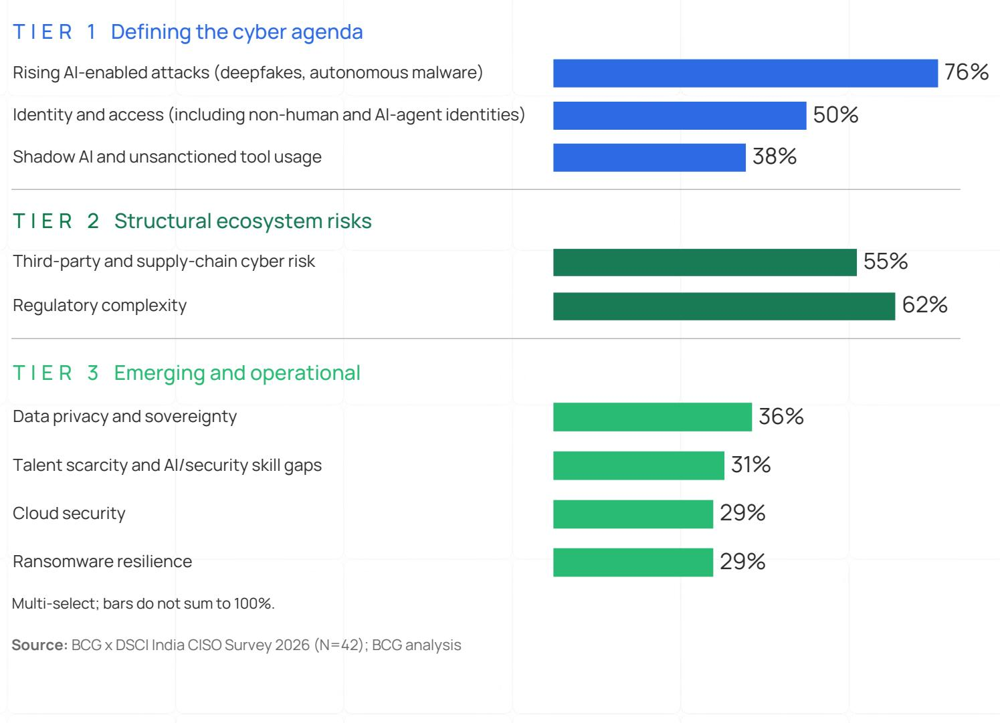

Cloud security

Ransomware resilience

Source: BCG x DSCI India CISO Survey 2026 (N=42); BCG analysis

## Why it Matters

The leading concern is structurally underfunded

76% of CISOs place AI-enabled attacks among their top four concerns, yet only 19% have increased cyber budgets by more than 10% to address them.

## Ecosystem-level risks outweigh any individual attack vector

Third-party risk (55%), identity and AI-agent access (50%), and Shadow AI usage (38%) collectively show that CISOs are prioritizing interconnected operational and ecosystem vulnerabilities alongside direct attacks.

## Cyber Maturity and Spend I 70%+ report mature capabilities in data protection and monitoring, while governance and third-party risk lag behind

Maturity levels across key cybersecurity practices in Indian BFSI Q. Which best describes the state of each cybersecurity practice in your organization?

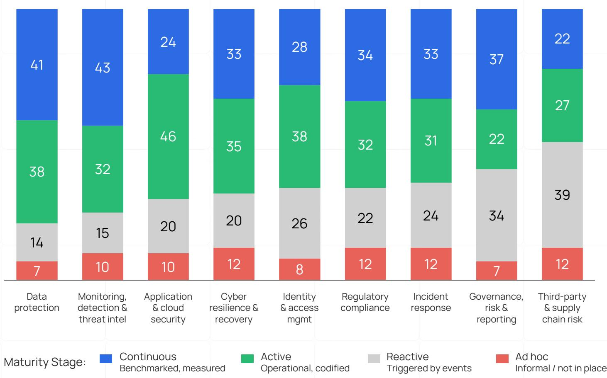  
Source: BCG x DSCI India CISO Survey 2026 (N=42); BCG analysis  
Key Takeaways

Regulator-driven maturity
Survey results indicate that data protection is the most mature cybersecurity capability – 79% of firms operate it at Active or Continuous maturity stages. Domains subject to the longest-standing regulatory pressure show the highest maturity.

Third-party risk is a structural gap

Only $49\%$ have reached mature practice on third-party and supply-chain risk, where the pace of threat evolution outpaces existing controls. Given Indian BFSI's extensive third-party exposure, this becomes a critical area of concern.

## Cyber Maturity and Spend I AI threats are reshaping cyber investment priorities, but budget expansion remains measured across Indian BFSI

## AI dominates incremental spend but absolute budget still has room for ramp up

Q. Has the rise of AI-based threats influenced your cyber spending?

“ Overall, I would not say my budgets are increasing drastically. The increase is hardly around 10% year on year.

CISO, Leading Indian Mid-Tier Private Bank

## Incremental spend is skewed towards AI powered security tools and existing vendors

Q. As you increase cybersecurity spend over the next 12 months, how do you expect that to be allocated (multi-select)

AI-powered security tools emerge as top incremental spend priority for Indian BFSI CISOs

“ Much of the security spend is going into meeting compliance asks – that leaves limited room for capability building.
CISO, Leading Indian Life Insurer say AI threats have influenced cyber spending against 74% for global BFSI, however cyber spend as a % of tech spend lower than Global peers

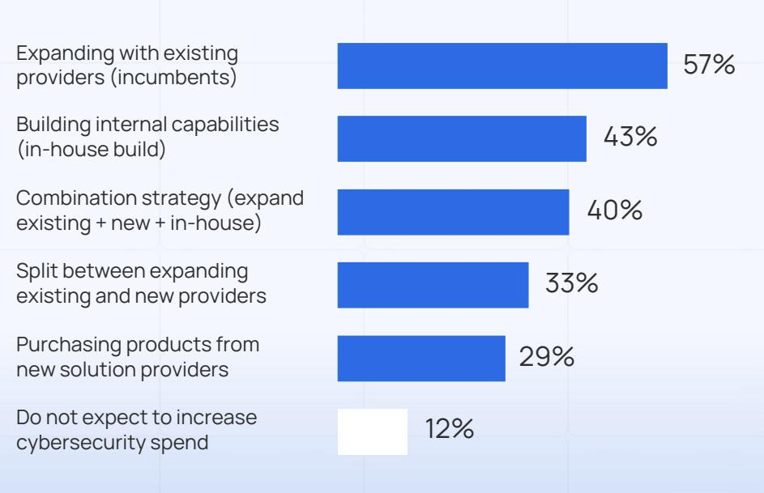  
Source: BCG x DSCI India CISO Survey 2026 (N=42), BCG x GLG Global CISO Survey 2026, Banking and Securities + Insurance excl. health subset (N=53); BCG analysis

## AI and cybersecurity intersects in three ways - each demanding a holistic action plan

## Security of AI

## 79%

Have formally assessed AI model security risks (prompt injection, model poisoning, training data poisoning etc.) in the past 12 months

## 43%

Cite embedding of AI in enterprise workflows as a top driver of AI based attacks

## Builders

Use of AI applications and technology create a new source of cyber and data privacy risk, expanding the digital attack surface

## Security against AI

## Attackers

AI is part of the hacker toolkit, accelerating and commoditizing attacks

## Defenders

To keep pace with threats and address the new attack surface, organizations are deploying AI powered cyber capabilities

## AI for Security

## 83%

Are actively embedding AI solutions into their operations, with 67% investing in AI solutions in next 12 months

## 69%

Are seriously exploring or actively deploying AI based SOC into their operations

## 76%

Rank AI enabled attacks as a top-4 priority for 2026

Source: BCG x DSCI India CISO Survey 2026 (N=42); BCG analysis

## 69%

Believe that AI-powered threats will have a significant impact on their organizations over the next 12 months and beyond

## Security Against AI 169% of Indian CISOs are highly concerned about AI- enabled cyberattacks

## Concern levels around AI-enabled cyber threats

Q. How concerned are you about the rise of AI-based cyberattacks targeting your organization over the next 12 months?

of Indian BFSI CISOs are 'very' or 'extremely' concerned about AI-based cyberattacks over the next 12 months

## Voice of the Industry

## “

## Growth in sophistication

The kind of technology in the market now, the kind of attack path it generates, just needs an opening to exploit. The path of attack defines itself. If your door is open, this kind of technology will find a way in.

Leading Indian Asset Management Firm

## Distribution across the five concern levels

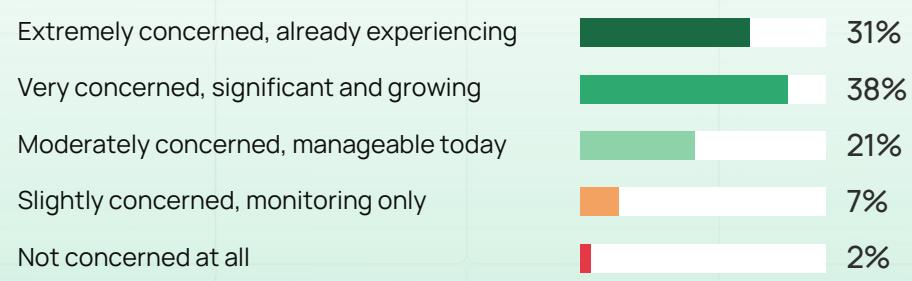

## “

## Growth in pace

Earlier we talked about a cyber-attack taking 100 days to recon and act. Then 50. Then 30. Up to last year, four to five days. Today, if these [AI] tools are being employed effectively, you have the vulnerability and you are exploited immediately

Indian Public Sector Bank

Source: BCG x DSCI India CISO Survey 2026 (N=42); BCG analysis

## Security Against AI I AI-enabled social engineering and identity attacks now dominate the BFSI threat agenda

Top AI-enabled attack scenarios driving defensive investment in India Q. What types of security incidents/attacks are you worried about / actively working to build capability towards?

64% AI / deepfake social engineering
Synthetic voice/video, AI-personalized BEC

50% Identity / credential attack
Credential stuffing, token theft, MFA bypass

50% Third-party / supply chain compromise Vendor compromise, malicious dependencies

45% Data leakage via GenAI tool usage
Sensitive data to external AI tools, RAG misconfiguration, shadow AI

45% Traditional social engineering Phishing, BEC, pretexting

Source: BCG x DSCI India CISO Survey 2026 (N=42); BCG analysis

AI-driven threats now dominate Indian BFSI's defensive priorities. Deepfake social engineering and GenAI data leakage together signal the shift from "AI as a future threat" to "AI as a present defensive priority". Denial of service, historically a top concern in Indian banking, has fallen to 17%, displaced by these newer threats.

## “

A <global hyperscaler> [sanitized] came out with 169 vulnerabilities. Assume 50 apply to my platforms across 5K assets - that is 250K identified vulnerabilities. Patch velocity is exceeding patching capability.

CISO
Indian Public Sector Bank

## Security Against AI On vulnerability defense, third-party blind spots are the weakest link — only 45% are confident of diagnosing risk

## Confidence levels in response to frontier AI-identified vulnerabilities (India)

Q: If a frontier AI capability were used to disclose a surge of high-severity vulnerabilities across the software your organization depends on, how confident are you in each of the following?

Third-party / open-source dependency visibility

Speed of triage and severity assessment

Patch deployment velocity

Compensating controls where patches unavailable

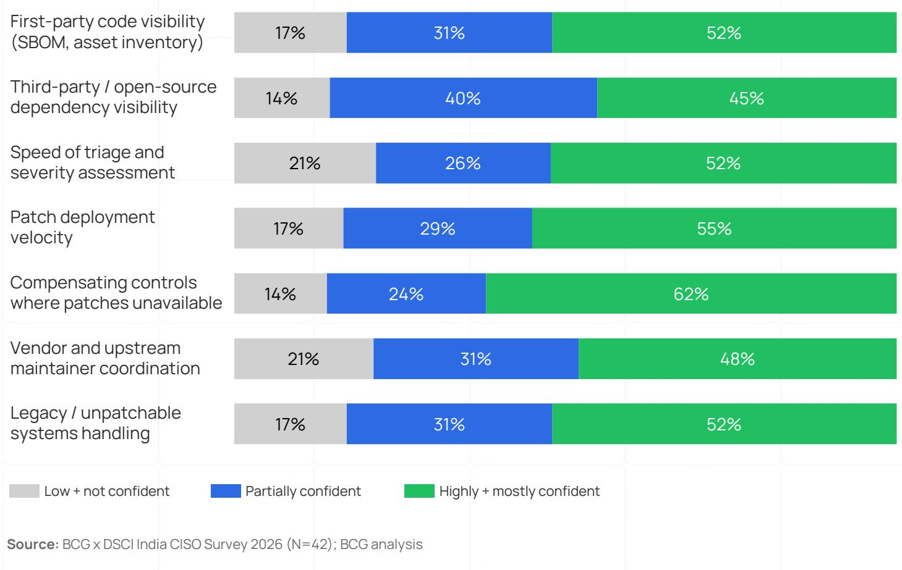  
Source: BCG x DSCI India CISO Survey 2026 (N=42); BCG analysis

Indian BFSI feels strongest about compensating controls when patches aren't available (62% confident) — a muscle built from years of running legacy estates — but weakest about knowing what third-party code its systems actually depend on (45% confident).

The implication: Indian BFSI is poorly equipped to anticipate which disclosures will hit them.

## Security for AI Leading financial institutions are at par with global peers on AI adoption, but 60% remain at pilot stage or below

## Organizations' maturity level in AI Adoption

Q. How would you describe your organization's overall maturity in adopting AI (including GenAI and agentic AI) across business functions?

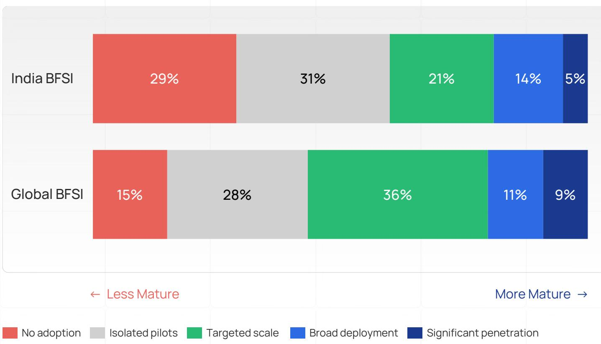  
Source: BCG x DSCI India CISO Survey 2026 (N=42), BCG x GLG Global CISO Survey 2026, Banking and Securities + Insurance excluding health subset (N=53); BCG analysis

The gap at the bottom
More Indian firms are behind

60%

India BFSI at pilot or below vs Global BFSI: 43%

No gap at the top
The leading firms have caught up

19%

India BFSI at Broad deployment and significant penetration vs Global BFSI: 20%

The gap reflects deliberate, cyber-risk-driven caution. It protects the institution today but increases exposure once scale-up accelerates

Source: BCG x DSCI India CISO Survey 2026 (N=42); BCG Analysis;

## Security for AI 24% of Indian BFSI firms have not formally assessed any major AI security risks

## AI model security risks assessed by firms

Q. Which of the following AI model security risks have you formally assessed in the past 12 months? (multi-select)

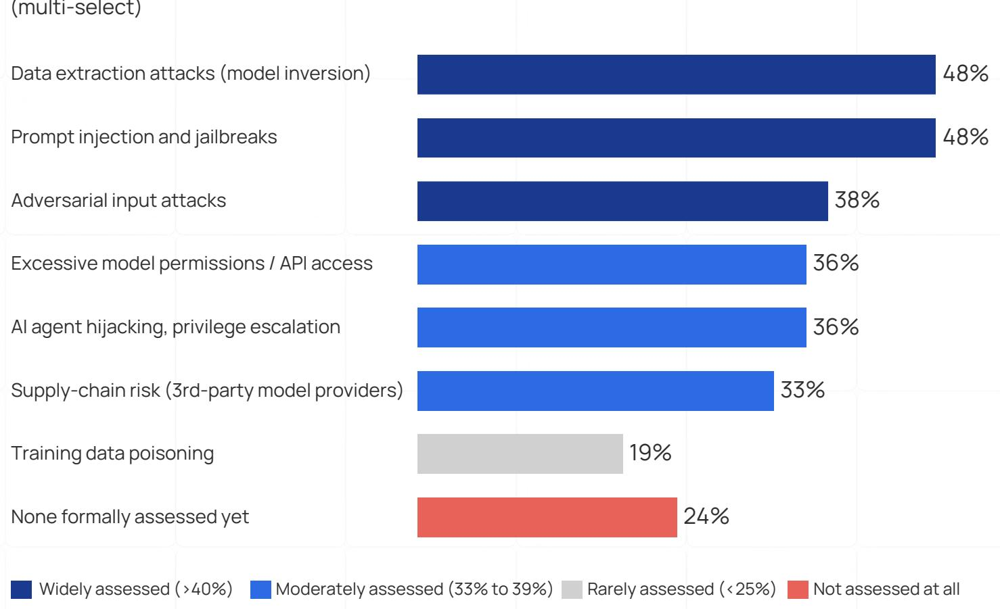  
Methodology: Percentages represent the share of organizations reporting formal assessment of each AI model security risk within the past 12 months. "None formally assessed yet" reflects respondents indicating no formal assessment activity across the listed AI risk categories. Multi-select responses; percentages do not sum to $100\%$ .

## Voice of the Industry

## “

[The frontier-AI threat] is a lot of hype at the moment. We haven't seen organizations getting impacted because of it yet.

Leading Indian Life Insurer

## “

Every bank has a policy for third-party risk management. But what has happened recently has literally rattled that part. Supply chain is one of the weakest links in cybersecurity, we all know that.

## Security for AI I Less than one-third of Indian BFSI firms have deployed core AI security controls at scale

## Adoption of AI security capabilities across Indian BFSI

Q. Which of the following capabilities is your organization actively applying to secure AI systems, AI agents, or non-human identities? (Top two box: Deployed + Piloting)

Shadow AI monitoring

Secrets management and token rotation

Prompt injection / model abuse detection

Formal AI governance processes

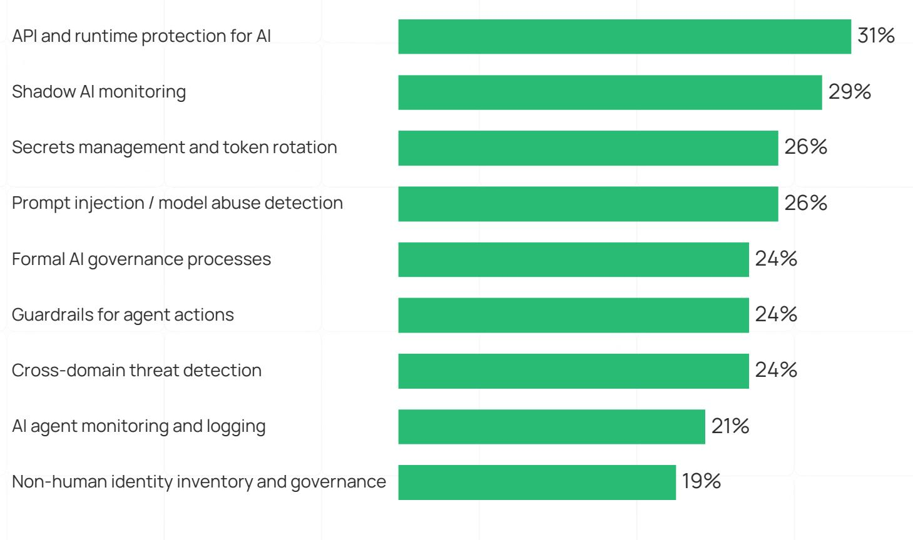

AI agent monitoring and logging

Non-human identity inventory and governance

Source: BCG x DSCI India CISO Survey 2026 (N=42), BCG x GLG Global CISO Survey 2026, Banking and Securities + Insurance excl. health subset (N=53); BCG analysis; Methodology: Percentages represent organizations reporting AI security capabilities as either deployed in production or currently in piloting/POC stages (“top-two-box”). Global benchmark reflects organizations reporting capabilities as in use or in piloting stages. Due to limited BFSI sample sizes in the global benchmark, the cross-industry global sample is used as the comparison baseline.

India Vs Global
Where the gap to
Global is widest

Formal AI governance India 24% / Global 73%

AI agent monitoring India 21% / Global 60%

Guardrails for agent actions India 24% / Global 51%

## Security for AI Only 29% of Indian BFSI have both, an AI security owner and a defined AI policy

## AI security owner--

Has owner

AI agent policy

Has policy

No owner

No policy

0%

33% Vacuum

29% Mature

38% Owner without policy rules

## “

Adoption became very fast. First it was business: 'everyone is doing it, we also have to do something.' So without thinking too much, they started using whatever AI they came across. The governance had not yet been established, and meanwhile the usage was already spreading everywhere.

CISO, Leading India Asset Management Firm

## Key Takeaways

• Accountability without rules is the dominant operating state (38%). Organizations should prioritize establishing formal AI governance frameworks and policy guardrails.

\- The structural exposure remains significant.
The combined “no owner, no policy” segment (33%) together with the 38% “owner without policy” cohort leaves 71% of Indian BFSI organizations without both foundational AI governance elements in place.

## AI for Security I For 50%+ of Indian CISOs, speed and automation are emerging as the primary drivers of AI-for-security adoption

## Reasons for AI/ML adoption in cyber

Q. What are the primary objectives of your organization for AI/ML adoption within cybersecurity functions?

Faster threat detection,
lower Mean-Time-to-Detect
and Mean-Time-to-Respond

Automated triage and alert enrichment

Fraud detection at scale

## AI for security ROI metrics

Q. How do you measure or expect to measure ROI on AI-enabled cybersecurity investments?

Reduction in Mean-Time-to-Detect and Mean-Time-to-Respond

Decrease in confirmed
incidents or breaches

Cost avoidance: fraud and breach costs

## 7% have no formal AI/ML objectives for cyber

## 12% have no plan to measure AI-security ROI

## AI for Security I 60% of Indian BFSI firms are embedding AI into core detection and response operations

## Areas where AI is being embedded in cyber operations in Indian BFSI

Q. How is AI being embedded in your cybersecurity operations and architecture? (multi-select)

Integrating AI analytics into SIEM/SOAR for real-time threat correlation

Leveraging AI for fraud detection and financial crime investigation

Embedding AI-powered anomaly detection across network, endpoint, and cloud environments

Using AI to automate vulnerability prioritisation and patch management

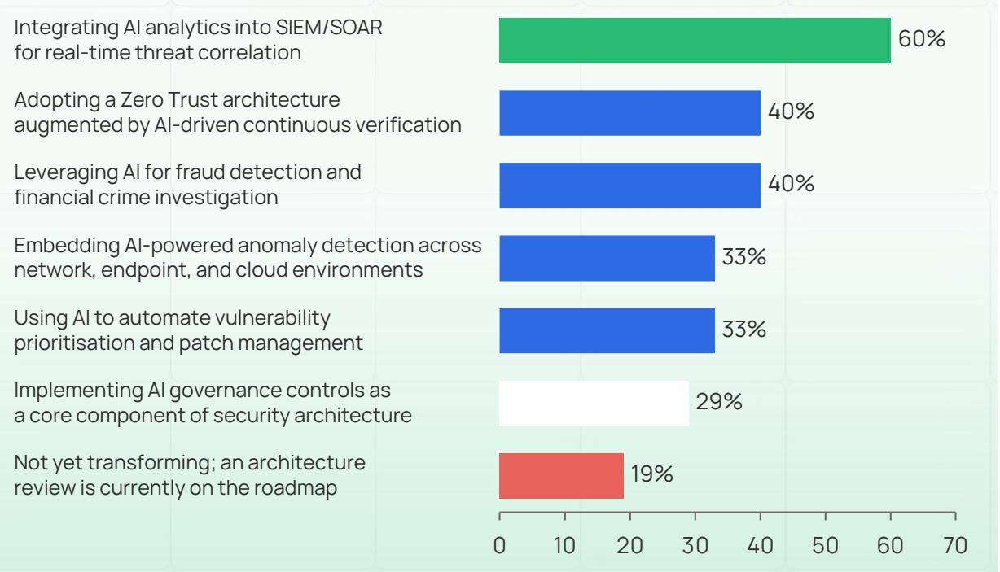  
Implementing AI governance controls as a core component of security architecture  
Not yet transforming; an architecture review is currently on the roadmap  
Source: BCG x DSCI India CISO Survey 2026 (N=42); BCG analysis  
Methodology: Data is drawn from a single multi-select survey question; multi-select percentages do not sum to 100%

## Where the opportunity lies

## Zero Trust and fraud detection are under-deployed

Despite strong interest, only $40\%$ of organizations report active deployment of AI-augmented Zero Trust or fraud detection capabilities.

## Vulnerability and anomaly automation is still emerging

AI-led vulnerability prioritization and anomaly detection remain early-stage, with only one-third of firms reporting active deployment.

## AI for Security I 71% of Indian BFSI firms have reached AI-assisted SOC maturity or higher

## Where Indian BFSI sits on the SOC maturity ladder

Q. How would you assess your organization's current adoption of a 'SOC of the future' operating model? (single select)

Level 4 Fully agentic, autonomous SOC

Level 3 Trust in autonomous decisions

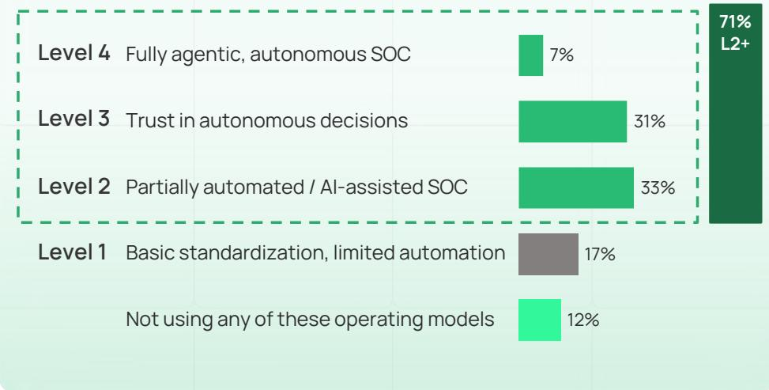  
Level 2 Partially automated / AI-assisted SOC  
Level 1 Basic standardization, limited automation  
Not using any of these operating models

Autonomous SOC is desired, but it's more like a WordPress thing: packaged and sold. It's more selling jargon than reality. we're only trusting AI with low-criticality items.

CISO, Leading Indian Life Insurer

## Can AI agents autonomously handle SOC analyst work?

Q. Over the next 2–3 years, what proportion of Tier 1 and Tier 2 SOC analyst work do you expect to be handled by AI agents autonomously?

Tier 1: Alert triage, initial investigation

\- 55% of CISOs expect AI agents to handle more than 25% of Tier-1 work

• 24% still expect less than 10% automation

Tier 2: Incident correlation, escalation decisions

\- 54% of CISOs expect AI agents to handle more than 25% of Tier-2 work

\- 21% still expect less than 10% automation, the trust gap is narrower than expected

## We have already gone ahead with deploying the autonomous SOC. That was a learning from a real incident

CISO, Indian Public Sector Bank

<table><tr><td>Identity and Access Management (IAM)</td><td>45</td><td>10</td><td>10</td><td>35</td></tr><tr><td>Data Security</td><td>41</td><td>13</td><td>23</td><td>23</td></tr><tr><td>Threat Intelligence</td><td>41</td><td>10</td><td>18</td><td>31</td></tr><tr><td>Security information and Event Management /SOAR (SIEM/SOAR)</td><td>38</td><td>23</td><td>8</td><td>31</td></tr><tr><td>Application Security</td><td>38</td><td>18</td><td>10</td><td>33</td></tr><tr><td>Governance, Risk and Compliance (GRC)</td><td>38</td><td>13</td><td>18</td><td>31</td></tr><tr><td>Vulnerability Assessment and Management</td><td>33</td><td>15</td><td>15</td><td>36</td></tr><tr><td>Network and Edge Security</td><td>30</td><td>15</td><td>13</td><td>43</td></tr><tr><td>Cloud Security</td><td>29</td><td>16</td><td>13</td><td>42</td></tr><tr><td>Endpoint Security</td><td>28</td><td>15</td><td>10</td><td>46</td></tr><tr><td>SaaS Security Posture Management (SSPM)</td><td>26</td><td>21</td><td>13</td><td>41</td></tr></table>

Source: BCG x DSCI India CISO Survey 2026 (N=42); BCG analysis  
Methodology: Analysis reflects expected vendor strategy across cybersecurity solution categories over the next 12 months. Results are shown across the four displayed response options, excluding “Don’t know / not applicable” selections. Categories are ranked by overall consolidation intent.

## Platform consolidation I Indian BFSI favors platform consolidation, with expansion focused on evolving AI-era capabilities

Cybersecurity strategy for next 12 months, by solution category

Q. For each of the following 12 cybersecurity solution categories, what is your strategy over the next 12 months?

## Key Takeaways

• CISOs are actively consolidating in two categories where regulation and AI are forcing the move: IAM (45%) and Data Security (41%) onto a respective single major platforms.

• CISOs are aggressively rationalizing the SOC stack: SIEM/SOAR carries the highest combined consolidation appetite at 61% (38% + 23%), driven by SIEM market consolidation and the data plane requirements of an agentic SOC.

• CISOs have already consolidated in two categories where the platform play was won in prior cycles: Endpoint (46% no change) and Network and Edge (43% no change) reflect mature single vendor stacks.

## Platform consolidation I BFSI CISOs are consolidating for integration, not cost- raising the bar for vendor relevance

## Reasons for consolidation for Indian BFSI CISOs

Q. For tools where you intend to consolidate, what is your top reason for doing so? (single-select)

1

## Tighter integration/single pane of glass

CISOs are consolidating to reduce fragmentation and improve cross-domain visibility across security operations.

2

## Reduce number of tools and vendors

Tool sprawl is creating operational complexity, making vendor simplification a priority for security teams.

3

## Reduce cost

Cost remains a consideration, but is secondary to integration and operational efficiency in consolidation decisions.

## Key Takeaways

\- Tighter integration emerges as the top reason for consolidation, ahead of tool reduction and cost savings

\- .The push to reduce tools and vendors reflects the growing burden of fragmented security stacks, alert fatigue, and integration overhead.

\- Vendors providing solutions to Indian BFSI must demonstrate seamless integration with existing stacks, measurable operating efficiency, and strong compliance alignment. Point solutions will need a clear interoperability story to stay relevant.

Path Forward
Five Fronts where Indian BFSI must
Synchronize for a Stronger Cyber Defense

## The Synchronicity Imperative

<table><tr><td>Indian BFSI is operating on cyber models designed for the past - where threats evolved over months, vendors were easier to track, digital journeys were simpler, and the CISO could largely coordinate the response from within the security function.</td></tr><tr><td>That world has changed.</td></tr><tr><td>In an increasingly AI-enabled environment, risk can move faster than traditional governance. Controls that are not seen at the same level of importance as business releases, aligned with technology modernization agenda, and built with a deep understanding of third-party dependencies will not be effective anymore. Employee awareness, customer actions for secure behaviours, and ecosystem syndicated intelligence will need to be strengthened to hold up at scale.</td></tr><tr><td>Cyber resilience can no longer be managed as a security-function agenda.</td></tr><tr><td>The attack surface has become too distributed for any single function to defend. When business, IT, risk, compliance, and security move at different speeds, digital and AI-led innovation can outpace the safeguards designed to protect it.</td></tr><tr><td>The next cyber operating model for Indian BFSI must therefore shift from a control-led function to a synchronized resilience system. It must be aligned to business value, built into day-to-day execution, extended to partners, understood by employees and customers, and strengthened through ecosystem collaboration.</td></tr></table>

## Synchronicity is the operating model for cybersecurity in the age of AI

The Five Fronts for building a synchronized Enterprise  
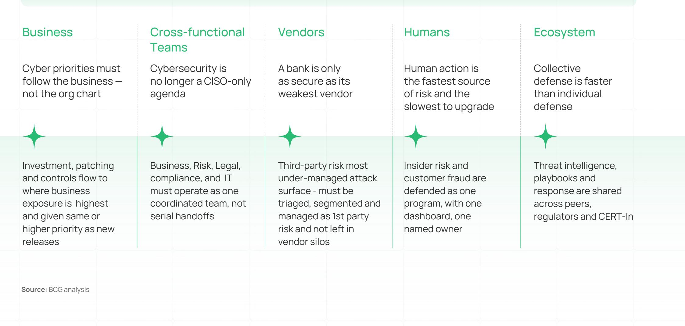

<table><tr><td colspan="2">Cybersecurity in the Age of AI</td></tr><tr><td colspan="2">Pillar 1Cyber risk lives where business risk lives</td></tr><tr><td>In Indian BFSI, cybersecurity is still treated as an IT risk function with a compliance overlay. A posture that worked when threats moved in months and regulators rewarded audit closure. With India now the second-most-attacked BFSI sector, the risk has become too distributed for this model. The gap is not an investment or technical problem. It is a governance problem.The launch of a new digital lending product, digital rail expansion, or an Account Aggregator integration each carries cyber exposure that only the business owner can quantify, yet at Indian BFSI cybersecurity decisions and funding are not synchronized with where the business is taking risk. Business releases are prioritized over patching and security updates, without considering the massive downside &amp; cost of poor security management – with significant business and reputation at risk if these attack scenarios materialize.Regulators have recognized this faster than most boards. The RBI’s 2025 Cybersecurity Mandates make board accountability explicit and require quantified risk appetite, a signal that cyber is no longer an IT problem to delegate, but a business risk to govern. However, 40% of BFSI CXOs still report board oversight, cyber risk appetite measurement and reporting is ad hoc or reactive.</td><td>In Indian BFSI, cybersecurity must be synchronized with where the business is taking risk. Growth without alignment with cybersecurity scales fragility, not resilience.</td></tr><tr><td colspan="2">Source: BCG x DSCI India CISO Survey 2026 (N=42)</td></tr></table>

Key actions
to achieve
Synchronicity
with Business

Adopt a board-approved cyber risk appetite statement with monetary loss tolerance, defined at critical business service, product, channel and customer journey, not just at enterprise level.

Quantify cyber loss exposure and set explicit risk-weighted capital reserves against quantified cyber loss tolerance.

Reframe annual cyber reporting from controls coverage to business-loss-avoided and integrate cyber risk into the enterprise risk dashboard alongside credit, market, and operational risk.

Tie every digital release gate to a quantified and measured cyber risk score and build cyber loss tolerance into product-level business cases before approval.

Prioritize “high risk” business domains – to identify the finite set of components where damages can be prohibitive for business, and create capacity for security updates in tandem with business releases to avoid exposure.

## Pillar 2

## Make cyber a cross-functional management system, not a CISO workload

<table><tr><td></td><td>In Indian BFSI, most institutions still approach cybersecurity and IT disruptions as isolated technical failures rather than as fundamental business risks. IT teams, security experts, and business leaders work with different goals, different processes, different vocabularies, and most discover the gap only after an incident exposes it.Indian BFSI should consider establishing a CEO reporting CXO-level cybersecurity operating model with clear decision rights and a board-visible discipline with named owners across Business, Technology, Risk, Legal, and Operations.A realistic simulation is a litmus test. A bank can publish a perfect cyber strategy and still fail the first time a real incident demands cross-functional coordination.Run a CEO-chaired cyber simulation with CSO, CIO, CRO, General Counsel, COO, and the heads of Retail and Wholesale in the room, with an unscripted Indian-context scenario, such as UPI outage, account aggregator compromise. The roles people cannot fill, the decisions that stall, and the questions that go unanswered are the synchronization backlog.This is not a Cybersecurity project – it is an organization-wide capability that spans every function touching the software.</td><td>Your cyber strategy looks flawless on paper. However, it may fail the first time it needs a CFO and COO to agree in under an hour.</td></tr><tr><td></td><td>Sources: BCG x DSCI India CISO Survey 2026 (N=42)</td><td></td></tr></table>

Key actions to achieve cross-functional Synchronicity

Create a CEO-chaired Cyber Resilience Group with clear decision rights across Business, Technology, Risk, Legal, Compliance, Operations and Communications.

Run a CXO cyber extreme event simulation with an unscripted scenario, and convert every failed decision or unclear ownership into a tracked remediation backlog.

Embed security leaders into each business unit building cyber fluency into Business Units, and set shared cross-functional KPIs across Business, Tech, Risk, Legal, Operations.

Define one enterprise RACI for product launch, cloud onboarding, patch exceptions, AI use cases, breach response and regulator or customer communication.

Build playbooks for Cyber resilience and material vulnerability event management with enterprise-wide coordination, and embed defensive automation to manage the scale and complexity.

## Pillar 3

## Vendor risk is now a “first party” and systemic risk

Indian BFSI's vendor ecosystem is uniquely concentrated. A handful of providers support various digital journeys – e.g., UPI and the payments which, Aggregator network, shared core banking platforms, large LOS Platforms and third-party KYC and AML providers. A single failure now halts dozens of institutions simultaneously.

The breach of a leading sales engagement platform in August 2025, which cascaded across 700-plus organizations in ten days through a single AI integration, was a demonstration of the new playbook. $95\%$ of India's top financial institutions were linked to a third-party breach in the past year $^{1}$ .

Indian regulation has caught up faster than most others. The RBI's 2025 outsourcing directions for NBFCs require vendors to meet the same resilience standards as banks.

Regulation alone does not create synchronicity. Most Indian BFSI institutions still treat it as an annual onboarding exercise, risk assessed at procurement, then reviewed six to twelve months later, with little visibility into what changed in between.

The shift required is from annual to continuous, risk-tiered orchestration.

Third parties are no longer outside the enterprise. They are part of the cyber operating model and must be governed as extensions of business risk.

Key actions
to achieve
third party
Synchronicity

Build a live critical-vendor dashboard and dependency maps that shows which vendor failure halts business line, customer journeys, control gaps, incidents, subcontractors ( $4^{th}$ parties), and exit readiness.

Replace annual vendor reviews with continuous monitoring, using threat intelligence, external exposure signals and remediation tracking.

Rewrite critical vendor contracts to include patch SLAs, breach notification timelines, audit rights, subcontractor approval, log support and joint recovery testing.

Run joint failure simulations with the critical vendors, covering ransomware, cloud outage, API compromise, data breach and payment disruption scenarios.

## Pillar 4

# The human attack surface, inside the bank and outside

In Indian BFSI, employees and customers are now targeted by the same threat actors, the same AI tools, and the same playbook. The fastest-growing cyber risk is the gap between human behavior and the controls designed to govern it on both sides of the counter.

Inside the bank, shadow AI has tripled in twelve months: 15% of employees used corporate AI tools in 2025; 45% do today $^{1}$ . Outside the bank, the same AI tools are being weaponized against customers. The RBI Annual Report 2023-24 logged INR 13K Cr in fraud losses across 36,075 cases, with roughly 40% digital or cyber-related $^{2}$ .

Most Indian banks defend the inside and outside as separate programs, insider risk owned by security and HR, customer fraud owned by branch operations and customer experience.

The threat actors do not see the distinction. The same generative AI tools that enable an employee to leak data to a public LLM also enable a fraudster to impersonate a relationship manager to that same customer.

The attacker sees one target. Your organization chart sees two teams. That gap is the vulnerability.

Key actions
to achieve
human
Synchronicity

Set up an insider-risk cell across HR, Legal, Compliance, IT and Security to triage negligent, compromised and malicious employee behavior.

Integrate cyber, fraud and customer operations to detect AI-assisted impersonation, mule accounts, remote access scams and social engineering patterns.

Give customers real-time journey warnings, one-click freeze and reporting options, and plain-language guidance at high-risk transaction moments.

Establish a unified human-risk control view across employees and customers, correlating access, data, device and transaction signals to detect insider misuse, impersonation, mule activity, remote-access scams and unusual behavior early.

Build advanced cyber awareness and AI-savviness amongst employees and customers to avoid risk due to human behaviors, and as AI adoption grows treat AI Agents as extended humans and high-risk vectors.

## Pillar 5

## Collective defense is faster than individual defense

Cybersecurity is one of the few domains where rivals share, because the threat actor does not care which bank's logo is on the phishing email.

Indian BFSI has the rails. Most banks ride them passively. CERT-In was established to coordinate sector incident response and intelligence sharing.

What is missing is consistent, active participation. Most banks consume intelligence without contributing to it, and most institutions treat sector drills as compliance events rather than strategic capability tests.

Attackers operate as a coordinated economy, dark-web marketplaces, exploit-as-a-service offerings, shared infrastructure, common playbooks. By contrast, defenders still organize firm-by-firm.

The economics of collective defense are compelling: a single bank's threat intelligence might catch the second attack, while a shared sector view catches the first.

The weakest link gets most targeted - Syndicated response architecture and mechanisms will be an important defense move for the “middle Indian BFSIs” where attacks can create material losses, however defense investments and sophistication will still lag best-in-class peers.

Attackers share infrastructure, playbooks, and intel. Defenders still compete. That asymmetry is why offense wins.

Key actions to achieve Ecosystem Synchronicity

Create a threat intelligence cell that both consumes and contributes intelligence through IB-CART, FS-ISAC, CERT-In and relevant regulators.

Make ecosystem contribution a board KPI, e.g. Indicators of Compromise (IOCs) submitted per quarter, incidents disclosed within mandated windows, cross-sector exercises completed.

Run regular sector or consortium cyber drills with banks, insurers, payment entities, cloud providers, critical vendors, regulators and law enforcement.

Build harmonized reporting frameworks and shared playbooks for sector-wide scenarios such as payment disruption, common vendor compromise, malicious apps, credential leaks and mule networks.

## Action agenda I Path forward for industry leaders (I/II)

## CEO and The Board

• Charter a CEO-chaired Cyber Resilience Council with named CXO decision rights

\- Mandate annual CEO-led cyber stress test with board -tracked remediation actions

• Measure cyber performance through business-loss avoided, replacing controls coverage

\- Approve a multi-year path to the 1.4-1.6 percent of revenue cyber spend benchmark

\- Review vendor concentration risks quarterly

## CIO, CTO & CDO

\- Gate major digital releases (UPI, AA, digital lending) using quantified cyber risk assessments

\- Adopt Zero Trust across identity, network, endpoint and application

\- Compress patching cycles based on business-critical risk exposure

\- Jointly govern AI deployment readiness with the CISO

\- Treat every API and shared service as a monitored and tested control point

## CISO

• Translate cyber risk into measurable financial business impact

\- Embed security into operating models, not just technology stacks

\- Replace annual vendor reviews with continuous monitoring and failure simulations

\- Consolidate identity risk and fraud monitoring into a unified enterprise view

\- Shift organization from passive threat consumption to active cyber defense contribution

## Action agenda I Path forward for industry leaders (II/II)

## CRO & CFO

\- Define board-approved cyber risk appetite across products, channels and customer journeys

\- Elevate cyber to the enterprise risk dashboard alongside credit and market risk

• Quantify cyber risk exposure by business line and scenario

\- Stress-test critical vendors against outage and ransomware disruption scenarios

\- Link cyber investment, insurance and ecosystem exposure to quantified risk outcomes

## Business, Operations & Legal

\- Assign quantified cyber loss tolerance to each business unit

\- Embed cyber reviews into all products and business approvals

\- Integrate insider risk, fraud and workforce awareness into a unified human-risk program

\- Build customer trust programs around awareness & real-time fraud alerts

\- Align legal, operational and business teams on incident response accountability

Cybersecurity in the Age of AI

## Authors

Boston Consulting Group

Nisha Bachani

Managing Director & Partner
Bachani.Nisha@bcg.com

Ayush Kanwar
Partner
Kanwar.Ayush@bcg.com

## Anand Raman

Senior Analyst
Raman2.Anand@bcg.com

## Vijay Pasupathinathan

Principal Pasupathinathan.Vijay@bcg.com

Hardik Jain
Principal
Jain.Hardik@bcg.com

Anirudh Gupta
Senior Associate
Kanwar.Ayush@bcg.com

## Data Security Council of India

Vinayak Godse CEO

Neha Mishra
Lead – Insights and Research

Priya Sharma Senior Associate, Strategy & Insights,

# Acknowledgements

We would like to express our sincere gratitude to the teams at BCG and DSCI for their invaluable contributions, collaboration, and support in developing this report. We also thank the CISOs and CXOs who filled the survey and gave their valuable insights in face-to-face interviews. Their expertise, guidance, research support, and efforts across content development, analytics, marketing, editorial review, and production were instrumental in bringing this publication to completion.

Strategic Guidance

Research and Analytical Support

Editorial and Legal Review

Vanessa Lyon
Managing Director and Senior Partner, BCG

Design and Production

Alex Asen
Senior Director - Cyber and Digital Risk, BCG Vantage

Eric Gregoire
Global Media Relations
Director, BCG

Sujatha Moraes
Creative Manager,
BCG Design Studios

Sean Mitchell
Senior Manager,
BCG Vantage

Massimiliano Merlini
Managing Director and
Senior Partner, BCG

Amit Ghosh
Associate Director Marketing and Communications Data Security Council of India

Eshita Bhargava
Senior Designer,
BCG Design Studios

Karan Bhardwaj
Manager, BCG Vantage

Courtney Fears
Senior Legal Counsel,
BCG

Or Klier
Managing Director and
Partner, BCG

Jasper Christy  
Senior Designer, BCG Design Studios

Bhumika Gupta
Team Leader – Marketing,
BCG

Nadya Bartol  
Platinion Managing Director, BCG

Nihar Mehta
Designer,
BCG Design Studios

Jose Qian
Asia Pacific Managing Editor,
BCG

Preet Nair
Designer,
BCG Design Studios

Sanya Jain
Marketing Graduate Trainee,
BCG

The images across the report have been generated using AI

## Disclaimer

This document has been prepared in good faith on the basis of information available at the date of publication without any independent verification. BCG and DSCI ('we/us') do not guarantee or make any representation or warranty as to the accuracy, reliability or completeness, of the information in this document nor its usefulness in achieving any purpose. Readers are responsible for assessing the relevance and accuracy of the content of this document. It is unreasonable for any party to rely on this document for any purpose, and we will not be liable for any loss, damage, cost, or expense incurred or arising by reason of any person using or relying on information in this document. To the fullest extent permitted by law (and except to the extent otherwise agreed in a signed writing), we shall have no liability whatsoever to any party, and any person using this document hereby waives any rights and claims it may have at any time against BCG and DSCI with regard to the document. Receipt and review of this document shall be deemed agreement with and consideration for the foregoing. This document is based on a primary qualitative and quantitative research. BCG does not provide legal, accounting, or tax advice. Parties are responsible for obtaining independent advice concerning these matters. This advice may affect the guidance in the document. Further, we have made no undertaking to update the document after the date hereof, notwithstanding that such information may become outdated or inaccurate. BCG does not provide fairness opinions or valuations of market transactions, and this document should not be relied on or construed as such. Further, any evaluations, projected market information, and conclusions contained in this document are based upon standard valuation methodologies, are not definitive forecasts, and are not guaranteed by us. We have used data from various sources and assumptions provided to us from other sources. We have not independently verified the data and assumptions from these sources used in these analyses. Changes in the underlying data or operating assumptions will clearly impact the analyses and conclusions. This document is not intended to make or influence any recommendation and should not be construed as such by the reader or any other entity. This document does not purport to represent the views of the companies mentioned in the document. Reference herein to any specific commercial product, process, or service by trade name, trademark, manufacturer, or otherwise, does not necessarily constitute or imply its endorsement, recommendation, or favoring by us. No part of this report can be reproduced for commercial purposes either on paper or electronic media without permission. Any reproduction, distribution, or reuse of this material requires prior consent from DSCI and, where applicable, Boston Consulting Group.

## BCG | DSCI PROMOTING DATA PROTECTION