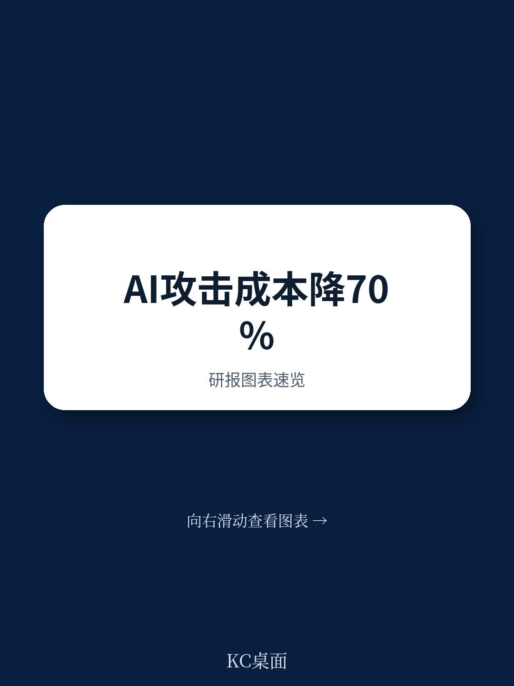

# 波士顿咨询：印度BFSI的AI安全缺口，不是技术问题，是同步问题

印度金融业的数字化扩张速度，正在被AI加速的攻防失衡所反噬。波士顿咨询与印度数据安全委员会联合发布的这份报告，提出了一个核心判断：印度BFSI（银行、金融服务与保险）行业正处于一个危险的拐点——攻击者的速度已经系统性快于防御者，而绝大多数机构的应对策略仍然停留在“增加更多合规控制”的旧范式里。

这份报告基于对40多位印度BFSI首席信息安全官的调研，以及全球CISO调查的横向对比。结论是清晰的：印度BFSI遭受的网络攻击强度是全球平均水平的1.6倍，过去四年间网络事件从140万起翻倍至290万起。但更值得关注的，不是这些数字本身，而是它们背后一个更深层的结构性变化——AI已经重写了网络攻击的经济账。

攻击者利用AI，将漏洞利用时间从745天压缩至44天，降幅超过94%；攻击成本下降超过70%。英国国家网络安全中心的数据显示，前沿AI模型可以用大约80美元的成本发起一次完整的企业网络攻击。当攻击的门槛降到这个量级，传统的“发现-响应-修复”周期就从根本上失效了。

报告指出，76%的印度BFSI首席信息安全官已将AI驱动的攻击列为2026年的前四优先级，69%的人认为AI威胁将在12个月内产生重大影响。然而，在调查覆盖的所有安全控制领域中，没有任何一个领域的受访者对“自己是否准备好应对AI驱动的攻击”给出了超过50%的信心。这是一个危险的信号：认知与准备之间的差距，正在成为机构最脆弱的环节。

> **KC评论：** 这份报告最有价值的洞察不在于“AI攻击变多了”，而在于它揭示了印度BFSI面临一个“双重不对称”——攻击者利用AI降低成本、缩短周期，而防御者却在用传统方法应对。更关键的是，报告点出了印度市场的特殊性：因为数字化程度高、第三方依赖深、共享基础设施广泛，这里的连锁反应风险远高于其他市场。完整报告中的8个结构性风险因素分析，值得每一个关注新兴市场金融科技的人细读。

## 1. 威胁环境已超越技术基础，但投资节奏没有跟上

印度BFSI在技术基础设施上的投入并不少。报告显示，71%的机构已经达到了AI辅助安全运营中心级别或更高水平。但问题在于，威胁环境的进化速度更快。IBM的数据显示，印度数据泄露的平均成本同比上升7%，达到250万美元，而全球平均水平下降了9%。同时，印度机构的平均“识别并控制泄露”时间为263天，比全球平均的241天更长，且仍在延长。

更令人担忧的是投入结构。全球BFSI机构中，76%会将超过10%的IT预算用于网络安全；而印度这一比例仅为38%。60%以上的印度BFSI机构，网络安全支出不到IT预算的10%。在攻击强度已经是全球1.6倍的情况下，这样的投资水平意味着机构正在用更少的资源应对更大的威胁。

报告特别指出，最脆弱的是印度BFSI的“腰部”机构——中型私人银行、小型金融银行、非银行金融公司和城市合作银行。它们同样进行了激进的数字化，同样拥有高价值数据和支付通道，同样深度嵌入共享基础设施，但网络安全预算只有大型机构的零头。这些机构一旦被攻破，影响往往不是孤立的——一次共享技术供应商的勒索软件攻击，就曾在2024年7月导致约300家合作银行和地区农村银行的支付服务中断。

## 2. 第三方风险已经从供应链问题变成了第一方责任

报告将“过度依赖第三方”列为8个结构性风险因素之一。超过50%的BFSI领导者承认，其第三方和供应链风险管理仍然处于临时或被动状态。而只有不到17%的首席信息安全官表示，他们对第三方和开源依赖的可见性有高度信心。

这个问题的严重性在于，印度金融体系的基础设施高度共享。核心银行系统、支付网关、云服务、数据分析平台，往往由少数几家技术供应商提供。一旦供应商被攻破，风险会像多米诺骨牌一样沿整个链条传导。2025年2月，一家顶级全球云服务提供商的环境被攻破，导致印度排名前三的零售券商客户数据泄露到暗网，事件后市值大幅蒸发。

报告提出的判断是：第三方风险已经变成了第一方风险。过去，金融机构可以认为“这是供应商的安全问题”；现在，任何发生在供应商端的泄露，最终都会被市场和监管归责到金融机构自身。而AI的加入，正在让这种风险的传导速度更快、破坏力更大。

> **KC评论：** 第三方风险管理是这份报告中最容易被低估的部分。很多读者看到“第三方风险”会本能地认为这是采购部门的事。但报告揭示了一个重要区别：印度BFSI的第三方风险不是“选错供应商”的风险，而是“供应商被攻破后，你无法切断关联”的风险。完整的报告对“共享基础设施”和“供应商级联效应”有更详细的案例拆解，这些是理解印度金融体系脆弱性的关键。

## 3. AI治理的盲区：29%的机构同时拥有AI安全负责人和明确政策

报告调查显示，只有29%的印度BFSI机构同时设立了AI安全负责人并制定了明确的AI安全政策。这意味着超过70%的机构在AI安全治理上存在明显缺口——要么没有专人负责，要么没有政策依据，或者两者皆无。

这个数字之所以值得警惕，是因为机构在积极部署AI的同时，往往忽视了AI系统本身的安全。AI模型面临的攻击向量与传统系统完全不同——数据投毒、模型逆向、提示注入、对抗性样本——这些都需要全新的检测和防御能力。而当机构将AI用于客户服务、风控、反欺诈等核心业务时，这些系统的安全性就直接关系到业务连续性。

报告指出，AI既是防御工具，也是攻击武器，更是需要被保护的对象。这三个维度必须作为一个整体来管理。但目前印度BFSI的现实是：AI在进攻端的应用已经相当成熟，在防御端的部署正在加速，但在“保护AI系统自身安全”这一环上，明显滞后。

## 4. 报告尚未完全回答的关键问题：人才缺口如何跨越“技能鸿沟”

报告将人才短缺列为8个结构性风险之一，指出超过90%的印度机构报告了网络安全人才缺口。但报告也坦诚地指出，这个问题的复杂性超出了简单的“招聘更多人才”。

真正的挑战在于技能错配。传统的安全运营中心分析师擅长处理已知模式的告警，但AI驱动的攻击往往没有固定模式。攻击者利用AI生成的恶意软件可以实时变异，绕过基于签名的检测。这要求防御团队具备机器学习、数据科学、对抗性AI等新技能——而这些技能在市场上极度稀缺，价格也远高于传统安全岗位。

报告没有给出这个问题的明确答案，只是指出“人才短缺不仅是数量问题，更是技能和专业知识之间的鸿沟”。这实际上是一个比投资缺口更难解决的问题。因为增加预算可以购买工具和服务，但技能提升需要时间，而攻击者不会等待。

## 5. 真正的解药不是更多控制，而是“同步性”

报告的核心主张是：印度BFSI的下一代网络安全运营模式，必须从“安全功能议程”转向“同步化韧性系统”。这个“同步”涵盖五个维度：业务与安全的对齐、跨职能团队的整合、第三方治理的嵌入、人机协同的防御、以及生态系统的情报共享。

报告用了一个非常贴切的比喻：攻击者已经作为一个协调的经济体在运作，他们共享工具、情报和基础设施。而防御者却仍然各自为政——安全团队在防，业务团队在推，供应商在跑，监管在看。这种碎片化的防御，在面对一个高度协调的攻击体系时，几乎没有胜算。

“同步性”的本质，是让防御体系像攻击体系一样协调运作。这意味着安全不再是首席信息安全官一个人的事，而是业务、风险、法务、IT和合规部门的共同责任。意味着第三方供应商必须被当作企业的延伸来管理，而不是每年采购时审核一次。意味着威胁情报必须在同行、监管机构和行业组织之间共享，而不是锁在各自的系统里。

报告认为，未来12到18个月将决定印度BFSI接下来五年的安全格局。那些在“同步性”上行动果断的机构，将把网络安全从成本中心转化为竞争优势。而那些继续在旧范式里打补丁的机构，将永远处于被动反应的状态。

---

这份报告的价值，在于它没有停留在“AI带来新威胁”的泛泛之谈，而是深入到了印度BFSI这个具体场景中，揭示了威胁环境、投资结构、治理成熟度和组织协作之间的系统性失衡。报告中的调查数据和案例细节，为理解新兴市场金融科技的安全挑战提供了难得的实证基础。

但报告也留下了几个值得继续追问的问题：AI防御工具本身的安全性如何保障？“同步性”在组织层面如何落地，尤其是在权力结构分散的金融机构中？人才缺口的“技能鸿沟”有没有可能通过AI本身来弥合？这些问题的答案，可能需要结合更多行业实践和持续追踪才能形成判断。

如果你想深入这份报告的原始图表、调查数据和BCG的完整分析框架，欢迎加入我们的社群。每天，我们会通过AI agent和人工review，整理国际投行的中文摘要与关键评论，包含当天最新的数据图表合集，约10-40页，既方便喂给AI做进一步分析，也方便人工快速把握市场动态。这些未解问题，也正是我们每天在社群中持续讨论的议题。

Personal reading notes and learning share only. Not investment advice.

