FINANCIAL INSTITUTIONS
GLOBAL ASSET MANAGEMENT REPORT 2026
24TH EDITION

# An Imperative for Growth

April 2026

By Renaud Fages, Johannes Burkhardt, Edoardo Palmisani, Joppe Bijlsma, Peter Czerepak, Matt Egler, Dean Frankle, Kwonyoung Jang, Mayank Jha, Katsuyoshi Kurihara, Kedra Newsom Reeves, Neil Pardasani, Maël Robin, George Rudolph, Philippe Soussan, Matt Sweeny, Tjun Tang, Charles-Antoine Wallaert, André Xavier, and Ivana Zupa

## Contents

03 The New Economics of Asset Management
13 Distribution Is the New Source of Advantage in Asset Management
19 Rebuilding Asset Management for an AI-First World
25 Appendix
29 About the Authors

# The New Economics of Asset Management

For more than a decade, rising markets did most of the work. Assets grew, and revenues followed. This dynamic may not be over, but it will no longer carry the industry.

Global assets under management (AuM) reached \$147 trillion in 2025, up 11% year over year, while aggregate profit margins held above 30%. The industry appears resilient. But more than 80% of gross revenue growth in 2025 was driven by market appreciation, underscoring its continued reliance on external forces. (See Exhibit 1.)

This reliance is not new. What is changing is where growth comes from and who captures it. Capital is redistributing across regions, vehicles, and client segments. New gatekeepers are emerging, distribution is evolving, and technological forces—particularly AI—are reshaping the economics of asset management. As a result, market tailwinds no longer benefit incumbents by default. Capturing net new flows is now the central competitive differentiator.

This will require asset managers to operate differently. Firms that align with the next sources of capital and adapt how they compete will capture a disproportionate share of future growth.

## EXHIBIT 1

# Market Performance Drove Over 80% of Gross Revenue Growth Between 2024 and 2025

CHANGE IN REVENUE, 2024–2025 (%)

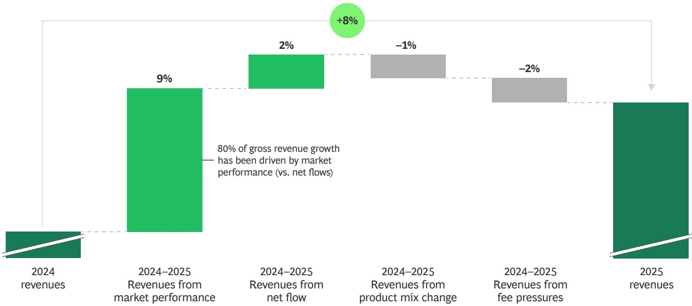  
Sources: BCG EXPAND Global Asset Management Market Sizing 2026; BCG EXPAND Global Asset Management Benchmarking 2026.
Note: Scope of analysis is active core, active specialties, solutions, and passives and alternatives. Values differ from those in prior studies due to exchange rate fluctuations, revised methodology, and changes in source data.

## A Growth Formula Under Pressure

Industry assets continue to expand, but the benefits are increasingly uneven. This reflects changes in where demand is coming from, how it is captured, and how it translates into profitability.

## Sources of Growth Are Shifting

Retail investors are now the primary driver of AuM growth, accounting for 61% of global expansion between 2020 and 2025. Retirement systems are increasingly redirecting flows as defined contribution plans expand and defined benefit pools mature. Growth is also becoming more dispersed geographically, with Asia-Pacific posting the fastest gains at 9% annually over the same period, supported by strong net inflows. (See Exhibit 2.)

These patterns are also visible across asset classes. Retail investors dominate much of the traditional product landscape, including active equity, fixed income, exchange-traded funds (ETFs), and money market funds, while institutional investors remain the primary allocators to alternatives. As a result, the market is becoming more segmented, with client channel and product strategy increasingly intertwined. New distribution

channels are also emerging, with insurance likely to become a particularly important channel for private credit. (See "Private Credit's Insurance Opportunity.")

## Capturing Growth Is More Complex

In US passive mutual funds and ETFs, flows are highly concentrated among a small number of firms, with the top ten providers capturing more than 90% of net inflows since 2015. Active strategies show a different pattern. In the US, the top ten active managers' share of net inflows has fallen from 63% in 2015 to 56% in 2025 as flows spread across a larger number of competitors. In Europe and Asia-Pacific, both active and passive markets are becoming less concentrated, indicating increasingly competitive environments.

In private markets, investors continue to allocate significant capital to the asset class, but they are doing so with fewer managers. The top 50 private equity firms captured 37% of global fundraising in 2024, compared with a ten-year average of 22%, according to Preqin. Taken together, and as access to distribution increasingly determines which managers are even considered for shelf space, these shifts point to a more demanding growth environment.

# Private Credit's Insurance Opportunity

For asset managers looking to scale private credit distribution, insurers represent one of the most attractive and underpenetrated channels. The role insurers play varies by region. In the US and Asia, they act primarily as institutional allocators. In Europe, they also serve as a retail distribution wrapper. Public credit no longer provides meaningful differentiation, leaving insurers with fewer ways to stand out in an increasingly crowded market. Private credit fills that gap.

Many insurers lack the capability to access private credit at scale on their own. That's where asset managers come in. Through sub-advisory mandates, joint ventures, or captive platforms, these partnerships create value on both sides. They bring the origination networks, structuring expertise, and portfolio capabilities that insurers need, while providing asset managers with seed capital, long-term institutional allocations, and shared marketing costs.

Over time, platforms are integrated into insurers' investment processes, aligned with asset-liability management frameworks, and connected to core operations. Asset managers are also engineering exposures directly, using rated notes and other capital-efficient vehicles to fit insurance capital frameworks. Early movers can build these capabilities into their product architecture. Once in place, that integration is difficult to unwind, making the asset managers that enable it hard to displace. As these structures scale, they become a more central part of capital deployment, effectively turning private credit into insurance-compatible instruments.

But executing these shifts well requires more than a compelling strategy. Retail clients have different liquidity expectations than institutional ones, and client segmentation across mass-affluent, high net worth, and institutional tiers needs to be rigorous. Any arrangement has to sit comfortably within the insurer's broader balance sheet logic, including asset-liability management constraints, duration matching, risk appetite, and solvency capital requirements. Getting this right requires optimizing capital efficiency, which introduces additional complexity in structuring, valuation, and risk management.

Some asset managers have begun building their insurance product portfolios, but the opportunity remains significant, and the market is still early. Here's how to get started.

Choose the right partnership model. Distribution-only arrangements, where an insurer offers an existing fund through its platform, are the natural starting point. Co-designed products, developed jointly within a unit-linked wrapper, require greater capability but deliver stronger economics and defensibility through deeper product integration and balance sheet commitment. Strategic capital partnerships—where the insurer provides seed capital or a balance sheet allocation—are the most ambitious and the hardest to replicate once established, given the depth of financial alignment and integration.

Secure your structural position. Access to an insurer's product shelf is not the same thing as being embedded in its core unit-linked platform. Formal inclusion determines volume steering, margin capture, and long-term defensibility. For managers still building their private credit offering, the priority is an anchor insurer relationship with genuine alignment on client base and scale ambition. Managers with more established offerings should diversify across insurers to broaden reach and reduce concentration risk.

Design the product for the insurance wrapper. Wealth accumulation and retirement income products have materially different portfolio construction and liquidity requirements, so the choice of use case matters. Asset duration needs to match insurance liabilities, enabling hold-to-maturity strategies rather than mark-to-market sensitivity. Returns expectations should be framed around stable spread generation and downside protection, not high internal rates of return. Liquidity mechanics, including evergreen formats and defined withdrawal windows, must map to underlying loan cash flows. Risk allocation also needs to be set upfront, including whether retail investors access only senior exposure and whether the insurer retains the junior or first-loss layer. Where capital-efficient structures are used, transparency, governance, and regulatory alignment become critical, as increasing scrutiny may shape how these solutions evolve.

Sources: BCG EXPAND Global Asset Management Market Sizing 2026; BCG analysis.

Note: AuM market sizing corresponds to assets sourced from each region and professionally managed in exchange for management fees. It includes captive AuM of insurance groups or pension funds where AuM is delegated to asset management entities with fees paid. Overall, 44 markets are covered globally, including offshore AuM (which is not included in any region). For all markets where the currency is not US dollar, end-of-year 2025 exchange rate is applied to all years to synchronize current and historic data. AuM = assets under management. $^{1}$ Represents each core client segment's contribution to net global AuM increase from 2020 to 2025. $^{2}$ Institutional (other) comprises corporate, bank, endowment, foundation and other non-profit, sovereign wealth fund, and government.

# Opportunity Size Varies by Region and Core Client Segment

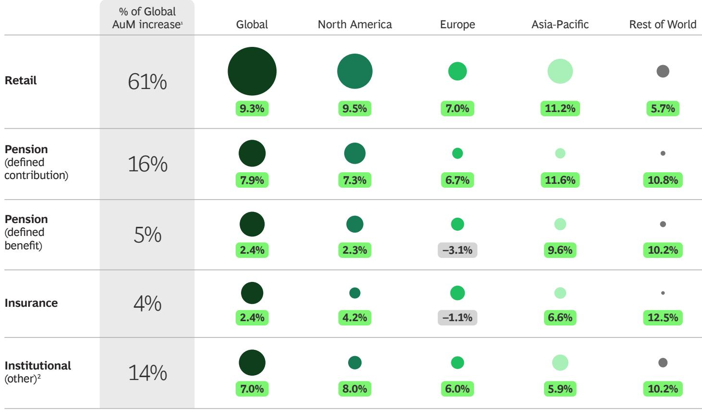

## Rising AuM No Longer Translates into Higher Profitability

Global AuM has more than tripled and revenue more than doubled over the past 15 years. Yet industry profit margins remain close to 30%, roughly where they stood in 2010. Between 2010 and 2025, revenues grew at 5.1% annually while costs rose slightly faster at 5.4%, producing negative operating leverage.

Several forces are driving this dynamic. Institutional fees have declined by 3% annually, passive funds and ETFs now dominate net inflows, and active ETFs are gaining share at fee levels below the vehicles they are replacing. Each incremental dollar of AuM therefore carries a lower average fee.

Costs add to the pressure. Some expenses decline as firms scale, particularly investment management and support functions that benefit from operating leverage. However, technology investment is rising as a share of the cost base as firms build scalable infrastructure and advanced capabilities. These offsetting forces limit the margin benefits traditionally associated with scale. (See Exhibit 3.)

# AuM Nearly Tripled Since 2010 While Margins Barely Moved

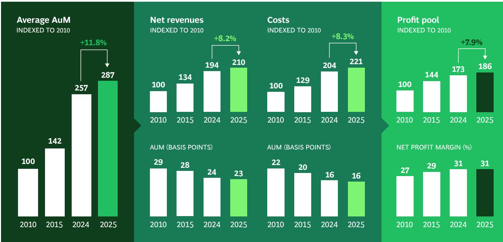  
Sources: BCG EXPAND Global Asset Management Benchmarking Database, 2026; BCG analysis.
Note: Analysis is based on a global benchmarking study of 98 leading asset managers, representing \$86 trillion in AuM, or about 59% of global AuM. Sample is primarily composed of traditional asset managers and excludes pure alternative players, as those economics are not comparable with total asset management revenues based on the global product trend analysis. AuM = assets under management.

## Three Structural Demand Shifts

Looking ahead, control of capital, retirement savings, and geopolitical confidence will determine where future flows originate.

## The Generational Succession

An unprecedented transfer of wealth is reshaping the retail investment landscape. It is estimated that nearly \$124 trillion will move between generations in the US through 2048. The recipients of that capital are increasingly digital-native investors whose relationship with financial services looks very different from their predecessors.

Digital-native investors enter markets earlier—30% of Gen Z begin investing in early adulthood versus 6% of Baby Boomers, according to a World Economic Forum investor survey. They expect integrated digital experiences and show greater openness to alternatives, including private markets and digital assets. They are also reached through fundamentally different channels. BCG research shows that comparison websites, social media, and YouTube now rank among the most influential sources shaping retail investment decisions—channels where the asset management industry has almost no meaningful presence.

Control of the investor relationship is also shifting. In Europe, neobroker assets surpassed €150 billion in 2023. In the US, retail investors now account for roughly 20% to 25% of daily equity trading volume, much of it intermediated through digital platforms. Across Asia-Pacific, retail investors are entering markets through digital channels, using mobile wallets and cash management products as primary entry points.

The rise of digital-native investors is concentrating flows in a smaller set of platforms that act as gatekeepers to capital. For asset managers, success will depend on being embedded in these ecosystems, with products and capabilities designed for how capital is allocated within them.

## Retirement System Transformation

Retirement systems are steadily moving away from defined benefit (DB) and pay-as-you-go structures toward funded defined contribution (DC) models, following a transition the US began several decades ago. The shift comes in response to two parallel structural pressures: a growing pension cliff as obligations outpace funded assets—and a rising demographic cliff driven by aging populations, shrinking workforces, and rapidly rising old-age dependency ratios. (See Exhibit 4.)

## Retirement Systems Face a Demographic and Pension Cliff

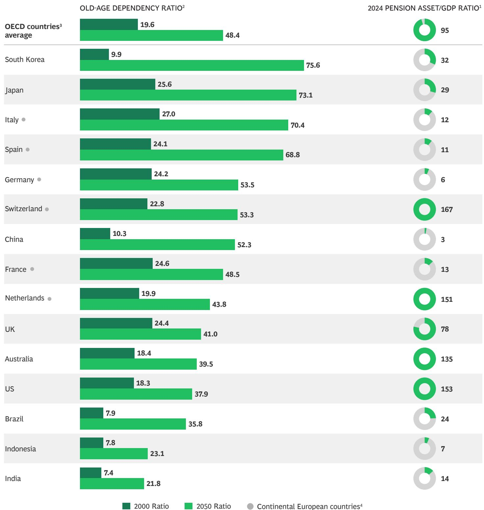  
Sources: United Nations; Organisation for Economic Co-operation and Development; government websites; BCG analysis.  
$^{1}$ Pension asset refers to all pension savings managed by pension providers. They can be either public or private, and occupational or personal, managed by banks or investment funds.  
$^{2}$ Ratio of people over 65 years old versus those 15–64 years old.  
$^{3}$ OECD countries do not include Brazil, China, India, Indonesia, South Africa.  
$^{4}$ Continental Europe average pension asset/GDP ratio is 33%. Countries include Austria, Belgium, the Czech Republic, Denmark, Estonia, Finland, France, Germany, Greece, Hungary, Italy, Latvia, Lithuania, Luxembourg, Netherlands, Norway, Poland, Portugal, Slovak Republic, Slovenia, Spain, Sweden, Switzerland, and Turkey.

# Nearly half of global investors plan to increase geographic diversification, with Europe (46%), Asia-Pacific (44%), and Emerging Asia (42%) the primary intended destinations.

The implications vary by region.

\- United States. The US system is already DC-led: DC accounts for over 50% of pension assets, with total pension assets at around 153% of GDP. Growth will center on income solutions, advice integration, personalization, and the ability to compete within workplace plans and retirement platforms that serve as primary distribution channels. A potential frontier is the inclusion of private market allocations within DC plans, though regulatory, liquidity, and operational hurdles mean adoption will be gradual.

\- Europe. Europe presents greater catch-up potential, albeit with significant variation across markets. Funded pension assets average roughly 33% of GDP across Continental Europe, with Germany, Italy, and Spain still in the low double digits. At the same time, many European systems face some of the steepest increases in old-age dependency ratios globally, intensifying pressure to shift toward funded and DC-style structures. The Netherlands offers a current illustration. Its Future Pensions Act requires the EU’s largest pension system—€1.8 trillion in assets—to transition from DB to DC by 2028, with the bulk of large funds moving through 2026 and 2027.

\- Asia-Pacific and emerging markets. Demographic pressure is acute across much of Asia and many emerging economies, though the development of funded retirement systems remains uneven and policy-driven. Where DC frameworks expand, retirement pools can scale quickly. Where reform is slower, savings tend to accumulate through wealth management, insurance products, and occupational arrangements.

Across markets, the shift from DB to DC is changing the structure of retirement investing. Assets that once flowed through a small number of institutional mandates are increasingly held in millions of individual accounts, raising customer acquisition costs, increasing service complexity, and placing greater emphasis on scale and distribution.

## The Geographic Confidence Shift

Geopolitical and policy uncertainty have introduced volatility into capital allocation decisions. Questions around US Federal Reserve independence, fiscal sustainability, trade policy, and political stability have moved from background considerations to active inputs in how investors think about geographic exposure. The US remains the world's dominant investment market, but that dominance is now being scrutinized in ways it has not been for a generation.

The sentiment shift is measurable. A Natixis Investment Managers survey found that $63\%$ of global investors believe the politicization of US institutions weakens the country's investment case, a view shared by more than half of US investors themselves. Nearly half of global investors plan to increase geographic diversification, with Europe $(46\%)$ , Asia-Pacific $(44\%)$ , and Emerging Asia $(42\%)$ the primary intended destinations, compared with just $25\%$ that intend to increase US exposure. Actual portfolio allocations, however, don't yet reflect that shift.

Whether these changes prove structural or cyclical remains an open question. What is becoming clearer is that the forces behind them are broader than a simple US versus rest-of-world rotation. Shifting trade relationships, rising barriers to cross-border capital flows, nationalist policies directing investment toward domestic infrastructure, and a broader retreat from globalization all point toward a higher-friction environment for global capital allocation.

For asset managers, geographic diversification is becoming a baseline requirement. Competing effectively requires local distribution capability, locally relevant products, and the ability to intermediate cross-border flows across an increasingly fragmented regulatory landscape.

## Technology and the Changing Basis of Competition

Technology underlies many of the structural shifts shaping the industry. Most immediately, AI is raising the competitive bar while shortening the time firms have to respond.

For more than a decade, asset managers have invested heavily in technology, often layering new systems onto already complex architectures rather than simplifying. As firms scale from \$50 billion to more than \$1 trillion in AuM, technology spending rises from roughly 5% to 15% of total costs. Yet that investment, combined with the shift toward lower-fee products, has failed to deliver margin expansion.

AI will change that equation across the value chain. It compresses the information and cost advantages that have historically separated firms, while enabling non-linear scalability that decouples AuM growth from headcount. It will also transform traditional retail distribution and marketing and change what asset managers can demand from third-party providers in both capability and cost.

Our baseline estimates suggest that asset managers could see cost reductions of 25% to 35% over three to five years, a two-to-five-fold expansion in research coverage, and a three-to-five-fold increase in client coverage per relationship manager. Capturing that upside requires structural redesign of operating models, data infrastructure, and talent, rather than continuing reliance on pilots and incremental productivity gains. Without it, AI-native operators will pull further ahead.

Tokenization and digital assets represent a different, less predictable technological force. Deeper disruption may come from the convergence of tokenization with stablecoin adoption, new regulatory clarity including MiCA in Europe and the GENIUS Act in the US, and the development of tokenized infrastructure that could enable real-time settlement and programmable assets. These developments are still taking shape, but rising adoption could reshape settlement processes, product design, and competitive dynamics across the investment management landscape. (See “Tokenization Is Gaining Momentum.”)

## The Path Forward

Profitable growth depends on deliberate choices about where to compete and how to build structural advantage. Here's where to play and how to win.

## Go where the flows are and build distribution

that scales. Concentrate resources where capital is structurally moving and where the firm has a clear advantage. Build a systematic distribution engine, segmenting with precision, aligning coverage to opportunity, and embedding into the client workflows and platforms that shape how capital is allocated. Layer AI on top of the engine to scale reach across channels without proportionally scaling cost.

## Hone wrapper capabilities to compete where

capital is moving. Deploy investment capabilities across a range of structures, choosing the right wrapper for the right exposure and client need. Capital is shifting toward vehicles that offer lower cost, greater customization, and broader access to private markets, including active ETFs, separately managed accounts, direct indexing, and hybrid public-private vehicles. Tokenization is also opening new rails, enabling instant settlement, programmability, and fractionalized cross-border access.

Integrate into client value chains. Move beyond selling products to become part of how clients invest—as a portfolio construction partner in institutional channels and an infrastructure layer in wealth ecosystems. Different clients require different approaches. In insurance, asset managers that bring private credit capabilities and wire them directly into insurers' investment platforms and product architecture can build durable distribution positions.

Create operating leverage before scale. Simplify operating models and retire legacy systems to reset the cost base with AI at the center. A redesigned platform absorbs more AuM, products, and clients at lower marginal cost, making M&A and partnerships genuinely accretive when they reinforce priority segments or unlock capabilities. Without that foundation, scale adds complexity, not advantage.

Build toward an AI-first asset manager. Across each of these choices, the firms that win will be those that go all in, embedding AI not as a layer of tools, but as the foundation of how they invest, distribute, and operate. This requires a unified data architecture, AI-fluent talent, and governance designed for speed. These are the building blocks that determine whether AI compounds advantage. Over time, this capability allows structural differentiation—enabling faster decision making, scalable personalization, and sustained operating leverage that competitors cannot easily replicate.

Market performance drove industry growth for more than a decade. That formula is changing. Structural demand shifts are reshaping where capital flows, while technology is redefining how firms compete. The imperative now is to build profitable growth that does not solely rely on markets through the disciplined deployment of AI and distribution designed to scale. We discuss these issues in the following chapters.

# Tokenization Is Gaining Momentum

Tokenized US Treasuries reached \$13.6 billion in April 2026, up 170% year-on-year, with tokenized money market fund AuM roughly doubling over the course of 2025. While still nascent, these assets sit within a much larger digital asset ecosystem. Stablecoins alone exceed \$300 billion, with a single issuer holding over \$120 billion in US Treasuries as collateral—underscoring the growing link between traditional finance and blockchain-based markets. Taken together, digital assets have a total market capitalization of approximately \$2.3 trillion as of April 2026, spanning Bitcoin, tokenized assets, and stablecoins.

Regulatory frameworks are evolving, though unevenly. In several jurisdictions, including Europe, Asia, and the UAE, clear foundations have existed for years. More recently, additional guidance has focused on tokenized assets specifically. In the US, clarity is gradually improving, while initiatives such as Singapore’s Project Guardian and Hong Kong’s Project Ensemble are enabling products within existing frameworks.

Stablecoins and on-chain treasury products and repos are already used at scale, with activity in the hundreds of billions. By contrast, tokenized real-world assets (excluding stablecoins and repos) remain under \$25 billion, but the market is expected to expand rapidly. Despite uncertainty and a range of possible outcomes, BCG's middle-of-the-road scenario estimates that the total value of tokenized real-world assets could reach \$14 trillion by 2030 and \$55 trillion by 2035. (See the exhibit.)

Real-World Asset Tokenization Adoption Is Likely to See Strong Growth

MARKET CAPITALIZATION PROJECTION (\$T)

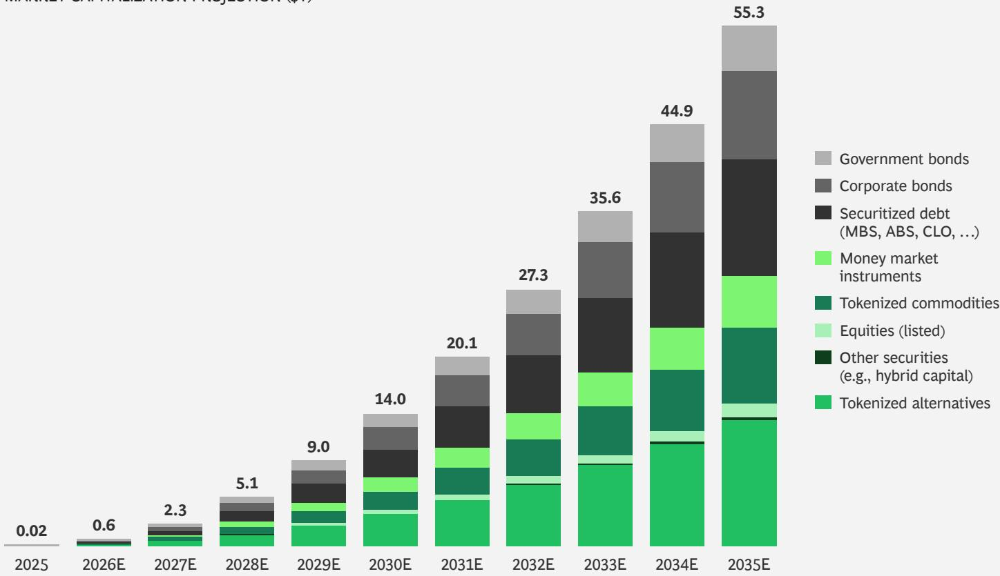  
Source: BCG analysis.  
Note: The \$55.3T figure represents the average of four scenarios, each built bottom-up by applying estimated 2035 tokenization penetration rates against projected total investable assets by asset class. The most progressive scenario projects \$88.2T by 2035. Sizing excludes real estate and tokenized money/stablecoin. MBS = mortgage-backed securities, ABS = asset-backed securities, CLO = collateralized loan obligations.

The appeal is clear. Transactions settle near instantly. Trading runs continuously, and ownership and transfer can be programmed. As these capabilities scale, tokenized funds could become the next major wrapper following the path set by ETFs. One leading North American asset manager's tokenized liquidity fund charges roughly three times the fee of traditional money market products and has still scaled rapidly.

Adoption is likely to broaden in stages, starting with money-like exposures where settlement and liquidity benefits are clearest, then extending into more complex markets as regulatory and operating conditions mature. Tokenized funds could evolve into a winner-take-most market, as passive ETFs did. But new rails could also weaken some traditional sources of scale and distribution strength, opening access to a broader set of players, including non-traditional entrants.

Scaling depends on regulatory alignment, credible secondary markets, and institutional-grade controls that are not yet standardized. If those pieces come together, adoption could accelerate quickly. Here's how asset managers can make that happen.

Set a strategy before the window closes. Managers need to determine which exposures become more accessible, liquid, or usable across platforms through tokenization. Money market funds are the natural starting point, with a path into private credit, private equity, and real estate as structures mature. Advantage will come from trust, distribution, and operational capability.

Treat distribution as the core battleground. In tokenized markets, distribution is closely linked to how products are held, transferred, serviced, and monetized, defining economics and client portability. It also creates switching costs that can be hard to unwind. Asset managers should make a small number of scaled bets in the most promising channels to build credibility and capability, while negotiating portability, data rights, and commercial terms up front and preserving flexibility as the market evolves.

Build a repeatable launch capability. Tokenization will reward speed and consistency. Firms need standard processes for onboarding and eligibility, embedded governance and controls, and a focus on jurisdictions where the rules are clear. Taking this approach will provide leaders with structural advantage as the market scales, allowing them to launch products quickly as regulation advances and demand shifts.

# Distribution Is the New Source of Advantage in Asset Management

The asset management industry is undergoing a structural shift.

Shelf space is tightening, product performance alone is no longer enough to win flows, and many elements of product manufacturing are becoming commoditized. The moat has moved. Distribution now determines who captures flows.

Wealth and asset management are also converging. Asset managers are moving closer to the end client, with some acquiring advisory firms, building wealth platforms, and investing in advisor-facing capabilities, while wealth managers are building in-house investment capabilities and competing directly on product manufacturing.

Ownership of the client relationship now defines advantage. Yet distribution models across the industry remain artisanal, under-instrumented, and difficult to scale.

Leading firms extend segmentation to reflect a client's position in the investment value chain, prioritizing by size, influence over allocation decisions, and the ability to shape portfolio construction, platform design, and advisory workflows.

## Most Firms Are Not Set Up to Compete on Distribution

In our work with asset managers, we've seen the same challenges appear in how firms define client segments, deploy coverage, and manage sales activity.

Prioritization often fails to shape the client base. Most firms define target segments based on size and revenue potential, yet much of the client base sits below them, diluting focus and salesforce effectiveness.

Similarly, coverage is rarely calibrated to value. Resources remain tied to legacy relationships rather than forward-looking potential. Senior time, level of coverage, and investment team access are not scaled based on account size or likelihood to convert. Keeping pace with product complexity is also becoming more challenging. As shelves expand into alternatives and solutions, generalist teams struggle to cover the full range. Investment teams are often drawn into client discussions that should sit within distribution, diverting attention from their core responsibilities.

Execution remains dependent on individuals rather than on a system. Client acquisition, account management, and cross-sell are not consistently defined or managed, and governance and incentives do not reinforce the desired behaviors, leaving outcomes uneven. On top of this, core workflows remain manual and market intelligence fragmented. Proposal drafting, pitch preparation, outreach, and follow-ups consume time that should go to higher-value engagement, while insights like share-of-wallet analysis remain disconnected from CRM systems.

Addressing these gaps requires more than incremental changes to the sales team. It calls for a redesign of the commercial model, built around a distribution engine that drives consistent execution across channels and supported by an AI layer that allows it to scale.

Within this model, product becomes the link between investment capability and distribution. It turns strategies into solutions that fit client portfolios, channels, and platforms, aligning what is built with how capital is allocated. This is a more strategic role, shaping priorities, packaging, and partnerships, and grounding distribution in solutions that reflect client needs rather than product push.

## Keys to Developing an Effective Distribution Model

Building an effective distribution model requires a system, not a set of activities. Product sets the terms—what gets built, for whom, and in what form. Distribution then executes. Four interlocking pillars define the architecture.

## Segmentation and Targeting

The client portfolio should be managed with the same discipline as investments. Leading firms extend segmentation to reflect a client's position in the investment value chain, prioritizing by size, influence over allocation decisions, and the ability to shape portfolio construction, platform design, and advisory workflows. (See Exhibit 5.)

## Tier Coverage by Client Value

<table><tr><td colspan="2">#OF CLIENTS</td><td rowspan="2" colspan="4">Asset manager&#x27;s share of revenue</td></tr><tr><td>High</td><td>Potential share of revenue</td></tr><tr><td>Low</td><td>Low</td><td colspan="3">AuM PER CLIENT</td><td>High</td></tr><tr><td></td><td>Small clientsDifferent model</td><td>BronzeMinimal and automated</td><td>SilverRegular and standardized</td><td>GoldFrequent and tailored</td><td>PlatinumContinuous and highly tailored</td></tr><tr><td>Number of clients per manager</td><td rowspan="6">Scalable coverage leveraging AI for standardized products, automated servicing, and collective account planning1</td><td>Very High</td><td>High</td><td>Moderate</td><td>Low</td></tr><tr><td>Time budget per client</td><td>Minimal</td><td>Moderate</td><td>High</td><td>Very High</td></tr><tr><td>Response time</td><td>~72h</td><td>~48h</td><td>~24h</td><td>&lt;24h (hotline)</td></tr><tr><td>Outreach cadence</td><td>1x</td><td>2x</td><td>2-4x</td><td>3-5x</td></tr><tr><td>Product customization</td><td>None</td><td>None</td><td>Early integration with product specialists</td><td>Embed into client workflow to shape customization</td></tr><tr><td>Expected AuM per manager</td><td colspan="4">Tier cut-offs set where marginal revenue per additional distribution capacity is similar across tiers</td></tr></table>

Source: BCG analysis.  
Note: Segmentation logic and service tiers are equally applicable to retail client portfolios; AuM = assets under management. $^{1}$ Materially higher expected revenue per distribution manager capacity vs. Bronze-Platinum distribution manager.

## Key elements include:

\- A full view of the addressable investor base, with wallet sizing that captures total assets, fee potential, and growth.

\- Clear target segments defined by revenue potential and thresholds, not just AuM.

\- Service levels that vary by tier, with coverage aligned, such as due diligence questionnaire response times.

Segmentation differs by channel. In institutional channels, firms layer forward-looking signals such as rebalancing cycles, consultant search activity, and asset allocation shifts onto wallet sizing. Consultants form a distinct segment, with their own prioritization and engagement model. In wealth channels, segmentation spans both platforms and advisors, reflecting differences in sophistication, growth trajectory, and allocation behavior. As firms move to AI-first models, segmentation becomes the control layer, determining where human-led engagement is required and where coverage can be scaled through AI.

## Coverage Model and Role Design

Coverage should be allocated based on opportunity, not history. Senior, client-facing time is scarce and should be concentrated where it drives incremental flows. This requires a different approach.

\- A coverage model matched to scale, with senior distribution professionals focused on higher-tier investors and coverage time aligned to revenue potential. Our experience shows limited correlation between seniority and client time or volume.

\- A dedicated “small-client desk” for accounts that are often overlooked and that competitors ignore, but represent significant addressable revenue. Historically constrained by cost to serve, this segment can now be covered at scale using AI.

\- Specialist overlays for complex asset classes such as alternatives, private markets, and multiasset solutions, embedded alongside generalist teams to support cross-sell. Most firms fall short of the 2.5 products per account benchmark; as sales teams default to familiar products, incentives and governance must actively reinforce multi-product engagement.

Coverage operates across centralized and field roles for both institutional and wealth channels. Leading firms differentiate roles and align coverage intensity, incentives, and performance metrics to opportunity size, rather than distributing resources evenly across accounts.

## Sales needs to run as a managed system where every client interaction is tier-appropriate, tracked, and actively steered.

## Sales Motion and Governance

Sales needs to run as a managed system where every client interaction is tier-appropriate, tracked, and actively steered. Top firms embed research, portfolio construction support, and decision tools into client workflows, shaping how capital is allocated rather than simply managing interactions. Governance and incentives reinforce this, ensuring consistent execution across teams. A well-functioning model has two defining characteristics.

\- A defined sales system with clear ownership, cadence, and performance metrics across the full client lifecycle. It enforces account planning quality and data hygiene, monitors pipeline development by interaction volume and time allocated by tier, and measures inflows, margins, and cross-sell. The system also ensures next steps are consistently captured so that activity gaps are visible before they become outcome gaps.

\- Account management intensity that is deliberately calibrated, with enforced distinctions between top-tier and lower-tier coverage. In practice this means coverage models designed around client economics and channel dynamics. How that structure is maintained shapes the depth and longevity of client relationships.

Institutional sales cycles are longer and multi-stakeholder driven, requiring structured proposal processes and consultant engagement. In wealth, coverage splits between centralized home-office teams managing platform access and due diligence and field roles (wholesalers) that engage advisors on an ongoing basis, with activity tied to product positioning and flow generation rather than discrete sales cycles.

Marketing supports this model as the scaled engine for demand and content, enabling targeted outreach, reinforcing positioning, and supporting personalization across segments and channels.

## Data Infrastructure and Tools

Data infrastructure determines whether distribution operates as a system. The aim is a shared, current view of clients, pipeline, and performance so that sales teams act on the same information and leadership can steer the business in real time. These are some of the best practices we’ve observed.

\- A CRM that serves as the central system of record, is cloud-based, consistently populated, and integrated with market intelligence and wallet data. It should be positioned as a value-creation tool, not a compliance task, with CRM quality treated as an explicit governance metric.

\- Real-time analytics that allow leaders to track performance across periods, segments, teams, and individuals, and to move from overview to root cause in a single drill-down.

\- A clean, integrated data foundation that enables AI-driven targeting, preparation, execution, and retention.

These capabilities need to operate across institutional and wealth channels, integrating CRM, consultant, proposal, platform, and advisor-level data into a unified intelligence layer.

## AI Is the Force Multiplier

AI strengthens distribution by changing what the model can do. It redeploys human effort toward the decisions and relationships that matter most.

This shows up across how coverage is planned, executed, and scaled.

\- Firms shift from intuition-driven territory planning to ongoing opportunity mapping, identifying whitespace, share-of-wallet gaps, and forward-looking flow signals to prioritize accounts based on revenue potential and likelihood to convert.

\- Coverage is no longer fixed. Firms can continuously rebalance how time is deployed, aligning senior attention to the most valuable opportunities as the pipeline evolves.

\- Preparation becomes faster and more consistent. AI synthesizes account history, surfaces portfolio exposures and competitive context, and supports the development of client materials, reducing time spent on routine work and allowing teams to focus on higher-stakes interactions.

\- Client engagement becomes more targeted. Content, messaging, and positioning can be tailored to specific decision makers, mandates, and portfolio gaps, improving the relevance and quality of each interaction.

\- Firms can extend consistent coverage across smaller accounts that have historically been underserved. Routine engagement and servicing can be handled at scale, allowing broader coverage without diluting focus on higher-value relationships.

Leading firms embed these changes across the distribution journey. (See Exhibit 6.)

AI only delivers if the underlying model is sound. Asset managers need to get the four interlocking pillars of distribution right before deploying it. Layering AI on top of a broken or undefined sales model automates existing inefficiencies. AI is the accelerant, not the architecture.

## EXHIBIT 6

AI Is a Force Multiplier Across the Distribution Journey  
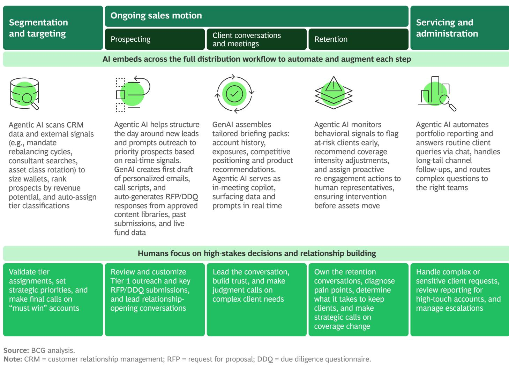  
Source: BCG analysis.
Note: CRM = customer relationship management; RFP = request for proposal; DDQ = due diligence questionnaire.

## Where to Act Now

The next era of asset management will be won by firms that invest in commercial infrastructure with the same conviction they have historically reserved for investment talent and technology. Here's where to start.

Lead with segmentation—and treat it as strategy. A complete, dynamic view of the client universe is the foundation everything else depends on. Without it, coverage defaults to history and AI has nothing meaningful to optimize. Get this right first.

Coverage aligned to opportunity rather than legacy relationships is one of the highest-return changes a firm can make. It’s also one of the hardest to sustain without explicit governance. The goal is deliberate imbalance in favor of accounts that move the business.

Build a sales system, leveraging a sales culture.
Culture matters, but it does not scale on its own.
Consistent execution requires clear ownership, cadence,
KPIs, and incentives. Governance is what sustains that
system and prevents it from reverting.

Deploy AI and widen the gap. Coverage can extend to clients that were previously uneconomical to serve, while preparation and targeting improve across accounts. Over time, this raises productivity and allows the model to scale more effectively. (See Exhibit 7.)

## EXHIBIT 7

## AI Drives Value Creation in Distribution

Illustrative, firm-level economics in 3 to 5 year view; outcomes depend on market position and reinvestment choices  
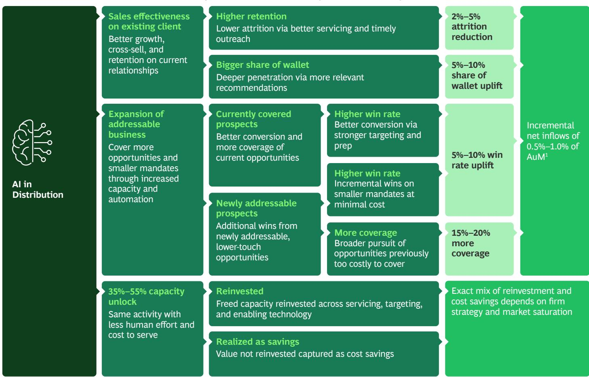  
Sources: AMplify AI by BCG; BCG analysis.
Note: AuM = assets under management. $^{1}$ \~65% of uplift in net flows driven by win rate and coverage gains.

# Rebuilding Asset Management for an AI-First World

The asset management industry has spent the past several years experimenting with artificial intelligence through pilots and productivity tools.

The next phase is more consequential as agentic AI systems change how asset managers generate insight, serve clients, and run their platforms. The result is an emerging AI-first model.

The implications extend beyond efficiency. AI expands analytical capacity, lowers the cost of personalization, and allows firms to scale operations with fewer constraints. These shifts erode many traditional sources of advantage in asset management, from information edge to analytical differentiation to the sheer coverage that scale once bought—with implications that fundamentally change the basis of competition.

Note: The asset manager category primarily encompasses traditional players and excludes pure alternative asset managers.

Yet the industry remains early in the transition. Asset managers trail banks and fintech firms in scaling AI across core processes. (See Exhibit 8.) Most are still focused on pilots and incremental productivity gains. That approach is no longer sufficient.

Real advantage will come from a strategic playbook built on three imperatives:

\- Be bold. Stop optimizing at the margins. An order-of-magnitude AI advantage requires structural redesign, not incremental tools.

\- Focus. Back a small number of transformative programs that can deliver clear P&L impact.

\- Go deep. Set a top-down ambition, but rewire the business bottom-up. Lasting agentic advantage primarily requires changes to the operating model, talent, and processes that embed AI into how work gets done, not by data and technology alone.

Asset managers trail banks and fintech firms in scaling AI across core processes, with most still focused on pilots and incremental productivity gains.

## EXHIBIT 8

Asset Managers Lag in AI Maturity  
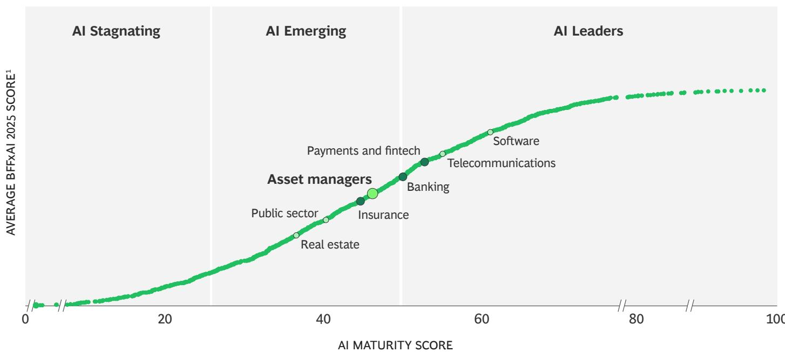  
Sources: BCG Build for the Future 2026 Global Study (n=1,250); BCG analysis.

## Transforming the Value Chain

As AI becomes embedded in client, investment, trading, and operational workflows, its effects are beginning to appear across the asset-management value chain. The following sections show how this is playing out. (See Exhibit 9.)

## EXHIBIT 9

## An AI-First Operating Model Transforms Workflows

Illustrative and not comprehensive: 3 to 5 year view; varies by asset class and operating model

Sales
Up to 45%
capacity unlock

Marketing
Up to 55%
capacity unlock

Product strategy and management
Up to 40%
capacity unlock

Client prospecting

Investment operations
Up to 60%
capacity unlock
unlock

Digital marketing optimization and personalization

Market/client/competitors insight scanning

Data/document ingestion and signal discovery

Constraint and guideline checking/portfolio monitoring

Pre-trade compliance checks

Reconciliation, breaks triage, NAV oversight

Client servicing and admin

RFP and DDQ creation

Product design and economics

Opportunity identification (e.g., cross-sell, attrition), prep and closing

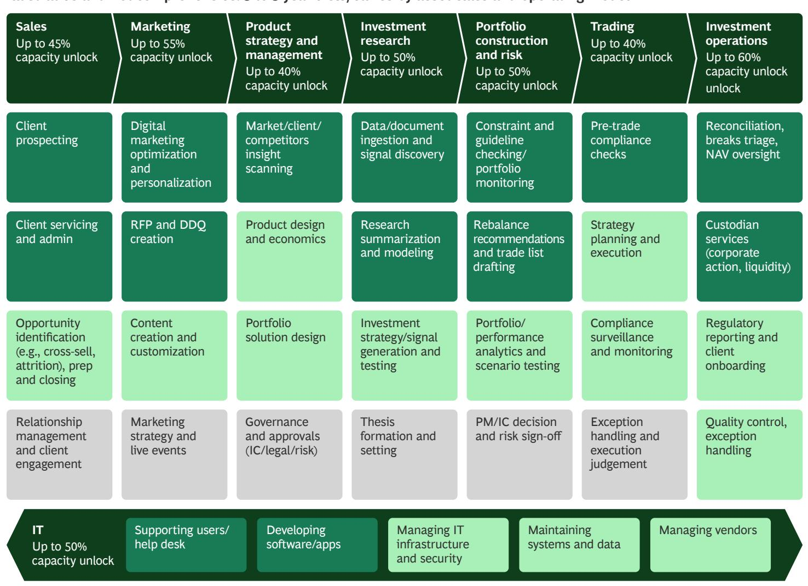

Research summarization and modeling

Content creation and customization

Marketing strategy and live events

Relationship management and client engagement

Portfolio solution design

Governance and approvals (IC/legal/risk)

Investment strategy/signal generation and testing

Rebalance recommendations and trade list drafting

Thesis formation and setting

Portfolio/ performance analytics and scenario testing

PM/IC decision and risk sign-off

Strategy planning and execution

Compliance surveillance and monitoring

Exception handling and execution judgement

Custodian services (corporate action, liquidity)

Regulatory reporting and client onboarding

Quality control, exception handling

IT
Up to 50%
capacity unlock

Supporting users/help desk

Developing software/apps

Managing IT infrastructure and security

Maintaining systems and data

Managing vendors

■ AI-autonomous (90%+ AI)
Automated execution with human review/sign-off as required

AI-augmented (50%+ AI)
Human-led with AI drafting, retrieval, summarization, or decision support

Human-led, AI supported (10–20% AI)
Primarily judgement/relationship work;
AI plays limited role

Sources: AMplify AI by BCG; BCG experience; BCG analysis.
Note: Business management and support functions (e.g., HR, finance, legal, compliance, procurement, etc.) not included in view, but all have significant AI efficiency opportunities; RFP = request for proposal, DDQ = due diligence questionnaire, IC = investment committee, PM = portfolio manager, NAV = net asset value.

## Client Coverage and Product Customization

AI changes the economics of client coverage. Agentic systems can handle much of the administrative load around acquisition, onboarding, reporting, and routine client requests, with the potential to free capacity by 35% to 50%. But the more important shift is how that capacity is used.

With effective deployment, firms can deliver deeper service at scale, allowing relationship managers to spend less time on meeting preparation, requests for proposal, due diligence questionnaires, and servicing workflows, and more time on mandate design, interpretation, and trust-building. Algorithms can construct and manage portfolios tailored to client-specific objectives—such as tax optimization, sustainability preferences, or risk constraints—making customization more scalable than before.

The result is a different client model—one that can deliver stronger satisfaction and retention, faster expansion into adjacent mandates and segments, and broader coverage without a proportional increase in headcount.

## Investment Research and Portfolio Construction

AI can increase the scope and speed of investment work. It can help teams broaden coverage within their existing remit, expanding the opportunity set by assessing more companies, themes, signals, instruments, and trade expressions without diluting attention. Research cycles will speed up, allowing hypotheses to be tested and refined more quickly, while continuous data streams support ongoing reassessment of positions and risks.

These changes will lead to higher throughput and improved decision quality. Coverage diversifies, signals strengthen, and risk can be managed more dynamically. The result is better risk-adjusted performance. AI has the potential to improve Sharpe ratio for managers by 5% to 20%, though the gains will not be evenly distributed. As baseline analytical capabilities commoditize, firms that have stronger judgment, differentiated data, and superior portfolio construction and risk management will win.

## Trading and Execution

In liquid markets, AI can build on the electronic trading stack, optimizing routing, algorithm selection, timing, market impact management, and real-time control checks. As AI automates manual workflows—by 70% to 80%—human traders can focus more on execution strategy, exception handling, block trades, and other high-value decisions.

In less liquid or less electronic markets, AI will play a broader role by reducing friction across request-for-quote handling, negotiation support, mandate interpretation, documentation review, compliance checks, and transaction workflow management. For a typical multiasset manager with significant equity exposure, this could affect roughly 30% to 40% of desk volume, where execution remains more manual.

## Investment Operations

Investment operations are evolving toward agentic systems that coordinate fund accounting, reconciliations, portfolio analytics, corporate actions, and reporting. In private markets, AI agents can process capital calls, interpret unstructured documents, and calculate and validate waterfall distributions autonomously. In public markets, they can reconcile net asset values across custodians, process corporate actions, and differentiate true exceptions for escalation.

These advances will shift investment operations from a linear support function to a scalable platform for growth. Firms can absorb greater AuM, product complexity, and customization without corresponding increases in headcount. Agentic workflows can increase capacity by 55% to 65% and reduce operational costs by around 40%. Human effort can be redeployed to designing the exception-handling logic that makes the autonomous layer smarter over time.

## Rewriting the Operating and Talent Model

AI will enable an order-of-magnitude expansion in coverage and speed, more continuous decision making, and far greater operational scalability. Those developments will reshape competition in three ways.

First, judgment can move up a level. The edge will no longer come from producing analysis but from deciding what to do with it. In some cases, firms will generate alpha by going against AI-driven consensus. Leaders, however, will have to decide which models to use, how to combine them, and when to challenge them—and then translate those choices into better portfolio construction and performance. Firms that do this well will command a premium.

Second, distribution and relationships will become the primary battleground. Technology will create scale, but relationships, credibility, and fiduciary confidence will determine who captures value. Trust is paramount. Clients will choose firms they trust to interpret complexity, exercise judgment when the system is uncertain, and stand behind outcomes.

Third, mass customization will create new business model opportunities. As AI lowers the cost of tailoring portfolios, capabilities once reserved for the largest mandates can be extended far more broadly. Firms can deliver highly customized portfolios across public and private assets to address tax and liquidity needs and mandate constraints at a cost that works beyond the top tier of clients. For those that can scale personalization, these capabilities will open new segments, product forms, and revenue models.

Together, these shifts will change how teams are built. (See Exhibit 10.)

## EXHIBIT 10

## An AI-First Asset Manager Generates Significant Upside

Revenue and alpha upside

<table><tr><td colspan="2">Revenue and alpha upside</td></tr><tr><td>Research coverage</td><td>2–5x</td></tr><tr><td>Potential Sharpe ratio improvement</td><td>5%–20%1</td></tr><tr><td>RFP response capacity / speed</td><td>5–10x</td></tr><tr><td>Client coverage per RM</td><td>3–5x</td></tr><tr><td>Trade error reduction</td><td>50%–70%</td></tr><tr><td>Speed to market2 for new products</td><td>2–3x</td></tr></table>

3 to 5 year cost reduction opportunity
Assumes human sign-off remains for regulated/client-facing output

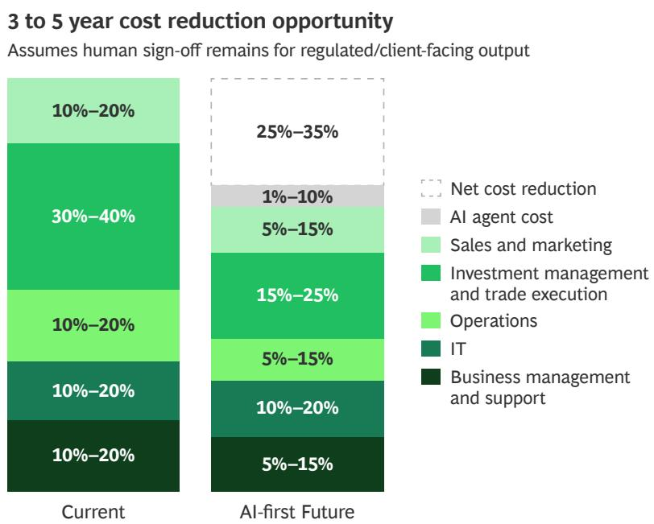  
Sources: AMplify AI by BCG; BCG analysis.  
Note: RFP = request for proposal.  
$^{1}$ Driven by broader research coverage and faster iteration, advantage likely compresses as adoption broadens. $^{2}$ Where regulations permit.

# With AI, as much as 70% to 80% of standard execution flow—including prechecks, order management, and fill monitoring—will be able to run autonomously.

In investment, judgment can take the place of analysis as the primary source of value. Portfolio managers will be able to redirect 5% to 10% of time saved from analytics toward higher-order decisions. Analysts can move from data gathering and first-pass modeling toward management engagement and differentiated insight, with 50% to 65% of traditional junior-heavy analyst capacity redeployed. As much as 70% to 80% of standard execution flow—including prechecks, order management, and fill monitoring—will be able to run autonomously, allowing traders to shift from managing routine orders to shaping execution strategy, handling exceptions, and managing illiquid or stressed situations.

The distribution role can center increasingly on commercial judgment rather than service administration. Automation will redirect 35% to 50% of capacity toward AI-enhanced mandate design, client interpretation, and high-stakes dialogue. Coverage can scale more easily, and the human contribution will become relational and advisory.

In operations, automation can handle the execution. The function can shift to oversight, focused on exceptions, controls, regulatory interpretation, and continuous improvement.

In technology, support will give way to strategy. Technology teams will be charged with building and governing the AI, data, and control infrastructure. The emphasis will be on agentic architecture, orchestration, and resilience rather than maintenance.

## Navigating to the AI-First State

Moving to an AI-first state requires reconceiving how the firm operates, not simply adding new tools to existing structures. Here's where to focus.

Redesign the operating model for AI-native scale.
Update core processes end to end, reducing layers, decision paths, and redundant review loops. Rebuild workflows around agentic AI and cross-functional teams to solve problems holistically. Embed governance into the operating architecture from the outset to ensure auditability, model traceability, and clear accountability. Retrofitting control at scale is much more challenging than building it right from the beginning.

Establish AI agents and systems as a cohesive stack. Prioritize scalable agentic architecture—including shared model environments, orchestration layers, modular compute infrastructure, and a unified data architecture. Invest heavily in agents that have the context, tooling, memory, and governance to automate workflows end to end. Reaching 80% automation is not enough to capture real gains. Design agents for continuous improvement through structured feedback loops and define a clear path toward recursive self-improvement as technology matures.

Build the skill premium. Recruit bridge leaders who combine AI fluency with market expertise and systems thinking. Embed AI literacy into hiring, promotion, and performance frameworks from the C-suite down. Systematically upskill the workforce in human-agent collaboration so they know what models can and cannot do and how to prompt, verify, and improve them to continuously expand automation and value.

Hardware transformation into governance and incentives. Lead AI transformation from the top, with clear sponsorship and capital behind it. Tie incentives and accountability to measurable AI outcomes, including performance scorecards and compensation. Sequence the transformation by starting with high-impact, low-resistance areas that deliver visible savings and build confidence.

## Appendix

APPENDIX 1

Global AuM Grew by 11% to \$147 Trillion in 2025

GLOBAL AUM (\$T)

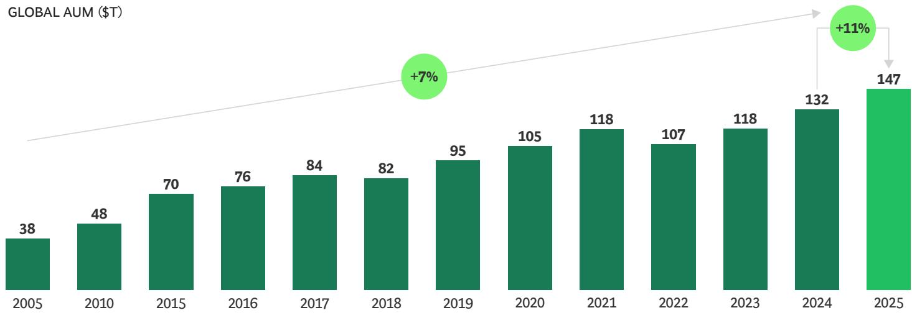

NET FLOWS AS A SHARE OF BEGINNING-OF-YEAR AUM (%)

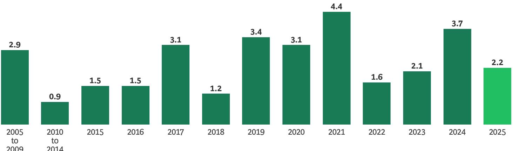

Sources: BCG EXPAND Global Asset Management Market Sizing Database, 2026; BCG EXPAND Global Asset Management Benchmarking Database, 2026. Note: Market sizing corresponds to assets sourced from each region and professionally managed in exchange for management fees. It includes captive AuM of insurance groups or pension funds where AuM is delegated to asset management entities with fees paid. Overall, 44 markets are covered globally, including offshore AuM. Net flow rates for 2005–2009 and 2010–2014 represent annual averages for their respective periods. For all countries where the currency is not US dollar, end-of-year 2025 exchange rate is applied to all years to synchronize current and historic data. Values differ from those in prior studies due to exchange rate fluctuations, revised methodology, and changes in source data. AuM = assets under management.

## APPENDIX 2

# All Regions Participated in Positive AuM Growth

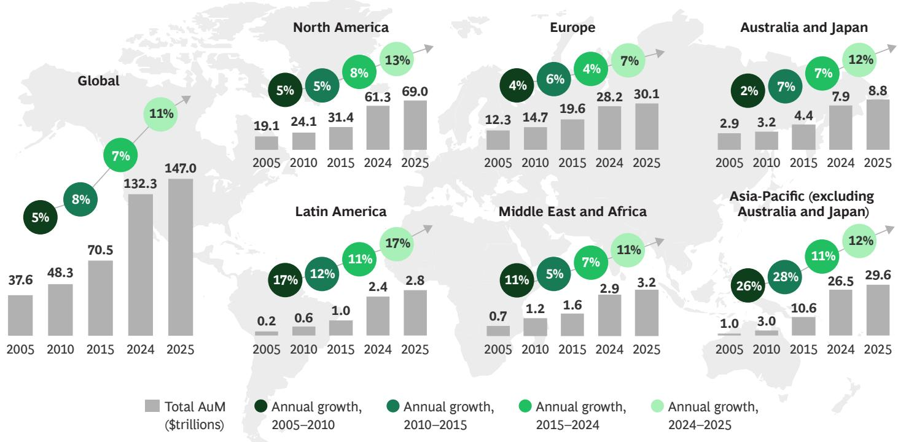

## Source: BCG EXPAND Global Asset Management Market Sizing Database, 2026.

Note: Market sizing corresponds to assets sourced from each region and professionally managed in exchange for management fees. It includes captive AuM of insurance groups or pension funds where AuM is delegated to asset management entities with fees paid. Globally, 44 markets are covered, including offshore AuM (which is not included in the six regions). North America comprises Canada and the US. Europe comprises Austria, Belgium, the Czech Republic, Denmark, Finland, France, Germany, Greece, Hungary, Ireland, Italy, Luxembourg, the Netherlands, Norway, Poland, Portugal, Russia, Spain, Sweden, Switzerland, Turkey, and the UK. Asia-Pacific (excluding Australia and Japan) comprises mainland China, Hong Kong, India, Indonesia, Malaysia, Singapore, South Korea, Taiwan, and Thailand. Middle East and Africa comprises selected sovereign wealth funds and pension funds of the region and mutual funds, plus Morocco and South Africa. Latin America comprises Argentina, Brazil, Chile, Colombia, and Mexico. For all markets where the currency is not the US dollar, the end-of-year 2025 exchange rate is applied to all years to synchronize current and historical data. Values differ from those in prior studies due to exchange rate fluctuations, revised methodology, and changes in source data.

# Alternative Investments Generate \~50% of Global Revenues Despite Representing Less than 20% of Total AuM

GLOBAL AuM SPLIT BY PRODUCT (% | \$T)

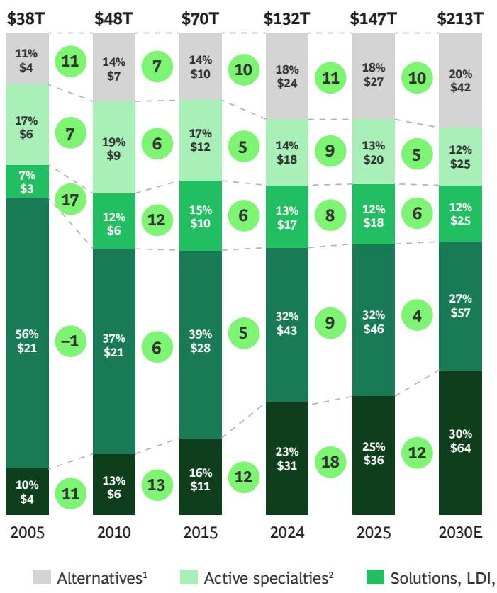  
GLOBAL REVENUE SPLIT BY PRODUCT (% | \$B)

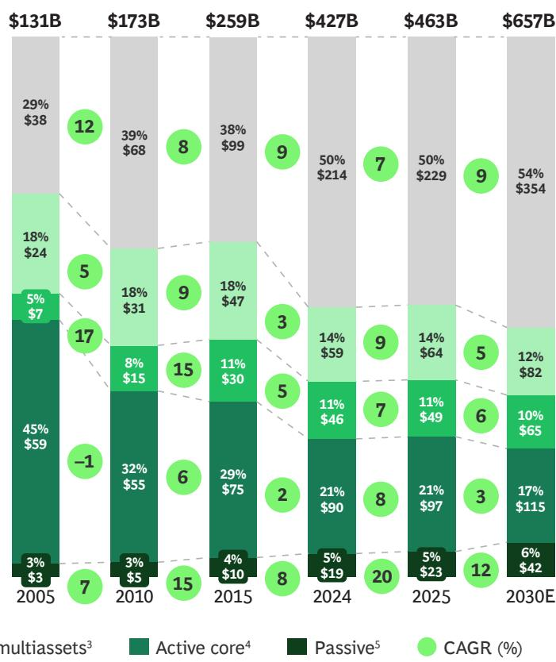

Source: BCG EXPAND Global Asset Management Market Sizing Database, 2026.

Note: Not all values add up to 100% or to the specified sum due to rounding; LDI = liability-driven investment.

$^{1}$ Includes these instruments: hedge funds, private equity, real estate, infrastructure, commodities, private debt, and liquid alternative mutual funds (such as absolute return, long/short, market neutral, and trading oriented). Private equity and hedge fund revenues do not include performance fees.

$^{2}$ Includes these actively managed instruments: equity specialties (global equities [excluding US], emerging market, all sector and thematic, and undefined [if market is not known]) and fixed-income specialties (emerging-markets fixed income, high yield, convertible, inflation linked, and global [excluding US] and undefined [if market is not known]).

$^{3}$ Includes these instruments: target date, target maturity, liability driven, outsourced chief investment officer, multiasset balanced, and multiasset allocation. $^{4}$ Includes these actively managed instruments: developed-market and global equity, developed-market government and corporate fixed income, global fixed income, money market, and structured products.

$^{5}$ Includes ETFs and passively managed equity and fixed income instruments.

## APPENDIX 4

## ETFs and Select Alternative Products Will Lead Growth Through 2030

AUM GROWTH (%), 2025–2030 E

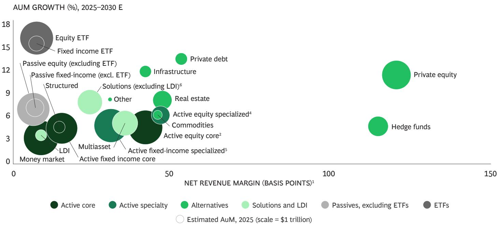

Source: BCG EXPAND Global Asset Management Market-Sizing Database, 2026.

Note: ETF = exchange-traded fund; LDI = liability-driven investment.

$^{1}$ Management fees net of distribution costs.

$^{2}$ Includes actively managed equity instruments: developed market and global.

$^{4}$ Includes actively managed equity instruments: global (excluding US), emerging market, all sector and thematic, and undefined if market is not known.

$^{5}$ Includes these actively managed fixed-income instruments: global (excluding US), emerging market, high yield, convertible, inflation linked, and undefined if market is not known.

$^{6}$ Includes these instruments: target date funds, target maturity, and outsourced chief investment officer.

$^{7}$ Includes these instruments: absolute return, long/short, market neutral, and trading-oriented mutual funds.

## About the Authors

Renaud Fages is a managing director and partner in the Los Angeles office of BCG. You may contact him by email at fages.renaud@bcg.com.

Johannes Burkhardt is a managing director and partner in BCG's Munich office. You may contact him by email at burkhardt.johannes@bcg.com.

Edoardo Palmisani is a managing director and partner in the Rome office of BCG. You may contact him by email at palmisani.edoardo@bcg.com.

Joppe Bijlsma is a managing director and partner in BCG's New York office. You may contact him by email at bijlsma.joppe@bcg.com.

Peter Czerepak is a managing director and senior partner in the Boston office of BCG. You may contact him by email at czerepak.peter@bcg.com.

Matt Egler is a managing director and partner in BCG's Sydney office. You may contact him by email at egler.matthias@bcg.com.

Dean Frankle is a managing director and partner in BCG's London office. You may contact him by email at frankle.dean@bcg.com.

Kwonyoung Jang is a managing director and partner in the Seoul office of BCG. You may contact him by email at jang.kwonyoung@bcg.com.

Mayank Jha is a managing director and partner in the Mumbai office of BCG. You may contact him by email at jha.mayank@bcg.com.

Katsuyoshi Kurihara is a managing director and partner in BCG's Tokyo office. You may contact him by email at kurihara.katsuyoshi@bcg.com.

## For Further Contact

If you would like to discuss this report, please contact the authors.

Kedra Newsom Reeves is a managing director and partner in the Chicago office of BCG. You may contact her by email at newsom.kedra@bcg.com.

Neil Pardasani is a managing director and senior partner in BCG's Los Angeles office. You may contact him by email at pardasani.neil@bcg.com.

Maël Robin is a managing director and partner in the Paris office of BCG. You may contact him by email at robin.mael@bcg.com.

George Rudolph is a managing director and partner in BCG's New York office. You may contact him by email at rudolph.george@bcg.com.

Philippe Soussan is a managing director and senior partner in BCG's Paris office. You may contact him by email at soussan.philippe@bcg.com.

Matt Sweeny is a managing director and partner in the Tokyo office of BCG. You may contact him by email at sweeny.matt@bcg.com.

Tjun Tang is a managing director and senior partner in the Hong Kong office of BCG. You may contact him by email at tang.tjun@BCG.com.

Charles-Antoine Wallaert is a managing director and partner in BCG's Paris office. You may contact him by email at wallaert.charles-antoine@bcg.com.

André Xavier is a managing director and senior partner in the Sao Paulo office of BCG. You may contact him by email at xavier.andre@bcg.com.

Ivana Zupa is a managing director and partner in BCG's Zurich office. You may contact her by email at zupa.ivana@bcg.com.

## Acknowledgments

The authors would like to thank the core team for their contributions to this work, including Kyle Johnson, Sam Kittross-Schnell, Rae Liu, Michele Millosevich, Eva Niadi, Claire Song, and Andrea Walbaum.

In addition, the authors extend the appreciation to Jatin Bajwa, Lorenzo Girardi, Mukul Gupta, Christopher Hill, Teddy Hung, Bernhard Kronfellner, Sonali Maheshwari, Bas NieuweWeme, Daniel Ollgaard, Christian Schmid, and Himakshi Srivastava. This year's report was enriched with data and insights provided by the BCG Henderson Institute and Expand Research, a wholly owned subsidiary of Boston Consulting Group.

## BCG

Boston Consulting Group partners with leaders in business and society to tackle their most important challenges and capture their greatest opportunities. BCG was the pioneer in business strategy when it was founded in 1963. Today, we work closely with clients to embrace a transformational approach aimed at benefiting all stakeholders—empowering organizations to grow, build sustainable competitive advantage, and drive positive societal impact.

Our diverse, global teams bring deep industry and functional expertise and a range of perspectives that question the status quo and spark change. BCG delivers solutions through leading-edge management consulting, technology and design, and corporate and digital ventures. We work in a uniquely collaborative model across the firm and throughout all levels of the client organization, fueled by the goal of helping our clients thrive and enabling them to make the world a better place.

For information or permission to reprint, please contact BCG at permissions@bcg.com. To find the latest BCG content and register to receive e-alerts on this topic or others, please visit bcg.com. Follow Boston Consulting Group on LinkedIn, Facebook, and X.

