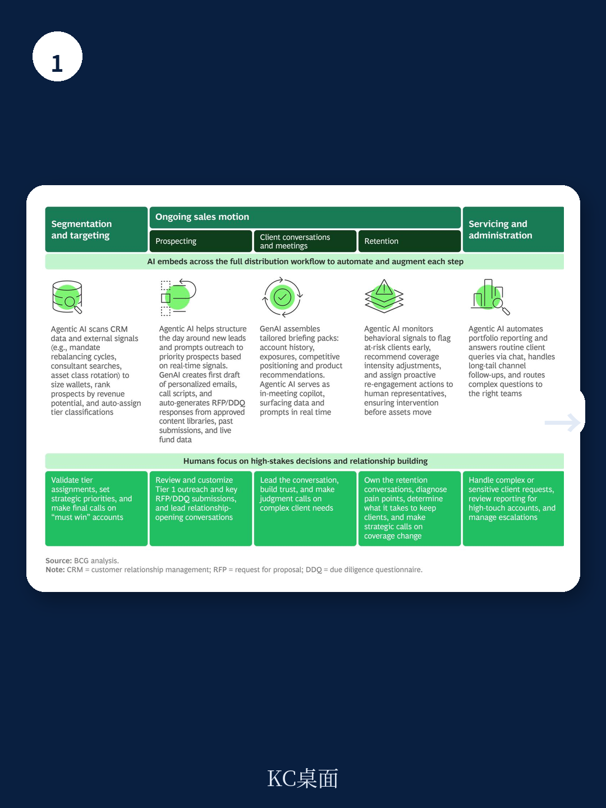
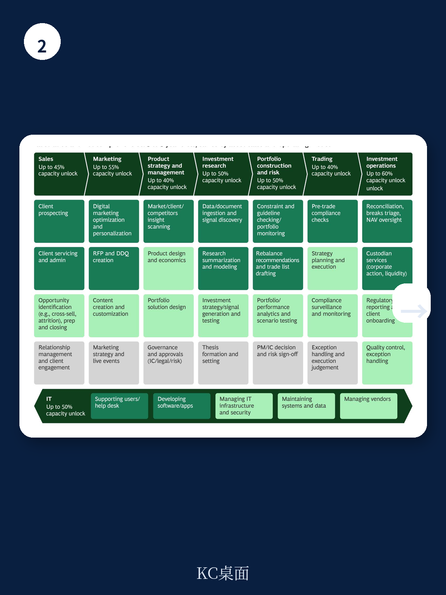

# 波士顿咨询：资管行业告别“市场躺赢”，净流入能力成为唯一护城河

全球资管行业正站在一个微妙的分水岭上。2025年，全球资产管理规模（AuM）达到147万亿美元，同比增长11%，行业利润率仍维持在30%以上。表面看，这是一份健康的成绩单。但波士顿咨询（BCG）在最新发布的《2026年全球资产管理报告》中，给出了一个与行业体感高度吻合却更为严峻的判断：超过80%的收入增长来自市场上涨本身，而非管理人的主动能力。换言之，过去十五年“水涨船高”的黄金时代，正在不可逆转地终结。

这份报告的核心主张清晰而锐利：市场顺风不再默认惠及在位者，捕获净流入的能力——而非管理规模——正在成为衡量资管机构竞争力的唯一标准。对于中国读者和产业决策者而言，这一判断的冲击力尤为直接。无论你是配置全球资产的机构投资者，还是关注本土竞争的基金公司高管，BCG的这份报告都提供了一个重新审视行业底层逻辑的框架。

> **KC评论：** 这句话值得反复咀嚼——“捕获净流入”取代“管理规模”成为新标尺。这意味着，过去靠牛市坐享其成的商业模式已经失效。未来，谁能在零售、养老金、保险等渠道中精准获取增量资金，谁才是真正的赢家。报告中的图表和数据，比如不同渠道的净流入集中度变化，值得仔细拆解。

### 1. 规模不再等于护城河：AuM翻三倍，利润率原地踏步

报告揭示了一个令人不安的长期趋势：全球AuM在过去十五年间增长超过三倍，收入增长超过两倍，但行业利润率始终徘徊在30%左右。2010年至2025年，收入年均增长5.1%，而成本增速为5.4%，形成了负的运营杠杆。

这并非偶然。几个结构性力量正在同时发力：机构端费率以每年3%的速度下降；被动产品和ETF持续吞噬净流入；主动型ETF虽然增长迅速，但其费率水平低于所替代的传统产品。每增加一美元的管理规模，带来的平均费率都在降低。

成本端同样承压。虽然部分费用随着规模扩大而摊薄，但技术投资占成本基数的比重正在持续上升。这些力量相互抵消，使得传统意义上的“规模效应”在资管行业中的边际价值越来越低。

对中国公募基金和券商资管而言，这一趋势尤为值得警惕。国内被动产品规模快速膨胀、管理费费率下行、科技投入持续加码，与全球趋势高度同步。若无法在成本控制和收入结构上找到新的平衡点，利润率的下行压力可能比预期来得更快。

### 2. 零售崛起与代际财富转移：新的资本流向正在重塑行业版图

BCG报告指出，零售投资者已成为AuM增长的主要驱动力，2020年至2025年间贡献了全球增长的61%。这一趋势背后，是一场前所未有的代际财富转移。据估算，到2048年，美国将有近124万亿美元的财富在代际间流动。

接收这笔财富的“数字原生代”投资者，其行为模式与前辈截然不同。报告引用世界经济论坛的调查数据：30%的Z世代在成年早期就开始投资，而婴儿潮一代的这一比例仅为6%。他们通过整合的数字体验、社交媒体和YouTube等渠道获取信息并做出决策——而这些渠道，恰恰是传统资管行业几乎毫无影响力的领域。

在欧洲，新经纪商（neobroker）资产在2023年已超过1500亿欧元；在美国，零售投资者贡献了约20%至25%的日交易量；在亚太，零售投资者正通过移动钱包和现金管理产品作为入口进入市场。

> **KC评论：** 代际转移不是远景，而是正在发生的现实。对于中国的财富管理行业，这意味着传统的银行理财渠道和线下销售模式将面临根本性挑战。谁能在支付宝、微信、抖音等超级APP中嵌入产品和服务，谁才能真正触达新一代投资者。报告中对不同渠道影响力的量化分析，是决策者必读的部分。

### 3. 养老金转型：从DB到DC的结构性巨变，欧洲是下一个主战场

退休制度从固定收益（DB）向固定缴款（DC）的转型，是BCG报告重点分析的第二个结构性需求变化。这一转型在美国已进行数十年，但报告指出，欧洲正迎来“追赶潜力”最大的窗口期。

以荷兰为例，其《未来养老金法案》要求欧盟最大的养老金体系——1.8万亿欧元资产——在2028年前完成从DB到DC的过渡，其中大部分大型基金的转换将在2026至2027年完成。这意味着一场规模空前的资产再配置。

对亚洲和新兴市场而言，人口老龄化带来的压力同样巨大，但退休体系的发展仍不均衡。在DC框架扩展的市场，养老金池可以迅速增长；在改革较慢的地区，储蓄则通过财富管理、保险产品和职业安排等渠道积累。

这一转型对资管行业的意义在于：过去通过少量机构委托配置的资产，正变成数以百万计的个人账户。获客成本上升、服务复杂度增加，规模和渠道能力的重要性被空前放大。

> **KC评论：** 荷兰的案例是一个值得深度研究的“压力测试”。中国第三支柱个人养老金制度刚刚起步，虽然体量尚小，但发展方向与全球趋势一致。报告中对不同市场养老金转型路径的对比分析，对于理解中国市场的潜在路径和时机选择，具有直接参考价值。

### 4. 地理信心漂移：美国不再是默认选项，欧洲和亚洲迎来资本再配置

BCG报告捕捉到一个重要的情绪变化：地缘政治和政策不确定性正在影响资本配置决策。美国联邦储备独立性、财政可持续性、贸易政策以及政治稳定性，这些过去被视为背景因素的问题，正成为投资者考虑地理敞口时的主动输入变量。

报告引用了Natixis投资经理的调查数据：63%的全球投资者认为美国机构的“政治化”削弱了其投资吸引力，超过一半的美国投资者也持相同观点。近半数全球投资者计划增加地理分散化，欧洲（46%）、亚太（44%）和新兴亚洲（42%）是其首选目的地，而仅有25%的投资者计划增加美国敞口。

不过，实际组合配置尚未完全反映这一情绪变化。这意味着，如果这一趋势从“意向”变为“行动”，全球资本流动格局可能发生显著调整。对于中国资管机构和全球配置的投资者而言，这既是风险，也是机遇。

### 5. 报告尚未完全回答的关键问题：AI将如何重塑资管行业的成本曲线与竞争格局

BCG报告在技术部分着重讨论了AI对资管行业的影响，但一个关键问题并未得到充分展开：AI导致的成本结构变化，是否足以打破当前“规模不经济”的僵局？

报告指出，技术投资正在成为成本基数的上升部分，但并未量化AI在投资管理、运营、合规和分销等环节的潜在降本效应。如果AI能够显著降低主动管理成本，那么主动管理产品的费率下行空间可能被重新打开，从而改变被动与主动之间的竞争天平。反之，如果AI带来的成本节约被行业竞争完全侵蚀，那么利润率压力将持续存在。

这一问题的答案，将直接影响未来五年资管行业的竞争格局。不同规模、不同策略的机构，在AI投入上的回报差异，可能是下一个周期的核心分化因子。

### 6. 给决策者的观察框架：三个需要持续追踪的指标

基于BCG报告的核心逻辑，我们建议投资者和产业决策者建立一个简洁的观察框架，用以判断行业走向：

**第一，净流入集中度的变化。** 报告显示，美国被动产品的前十大管理人占据了超过90%的净流入；主动管理领域，前十大管理人的份额从2015年的63%下降至2025年的56%。这一指标的持续变化，直接反映渠道权力和品牌护城河的变化。

**第二，保险渠道在私人信贷中的渗透率。** BCG报告专门分析了“私人信贷的保险机遇”，指出保险公司是最具吸引力但渗透率最低的渠道之一。谁能率先建立深度嵌入保险公司资产负债表的合作模式，谁就能在私人信贷领域占据不可逆的先发优势。

**第三，代际投资者的渠道偏好迁移速度。** 数字原生代投资者通过社交媒体和比较网站获取信息，而资管行业在这些渠道的布局仍然薄弱。这一迁移速度的快慢，将决定传统分销模式何时迎来临界点。

---

BCG的这份报告提供了一个完整且自洽的分析框架，但正如我们在上文中提到的，AI对成本结构的深层影响、保险渠道渗透的具体路径、以及代际迁移的实际速度，都是报告未能完全展开的领域。这些问题的答案，将决定未来五年谁是赢家、谁是输家。

在我们的社群中，我们每天通过AI agent和人工review，将包括BCG、高盛、摩根士丹利等国际投行的最新研报，转化为10至40页的中文摘要与数据图表合集。这不仅方便您快速把握全球市场动态，也适合直接喂给AI进行二次分析。如果您希望获取这份报告的完整解读、原始图表，以及我们对上述未解问题的持续跟踪分析，欢迎加入社群，与我们一同深入讨论。

Personal reading notes and learning share only. Not investment advice.

