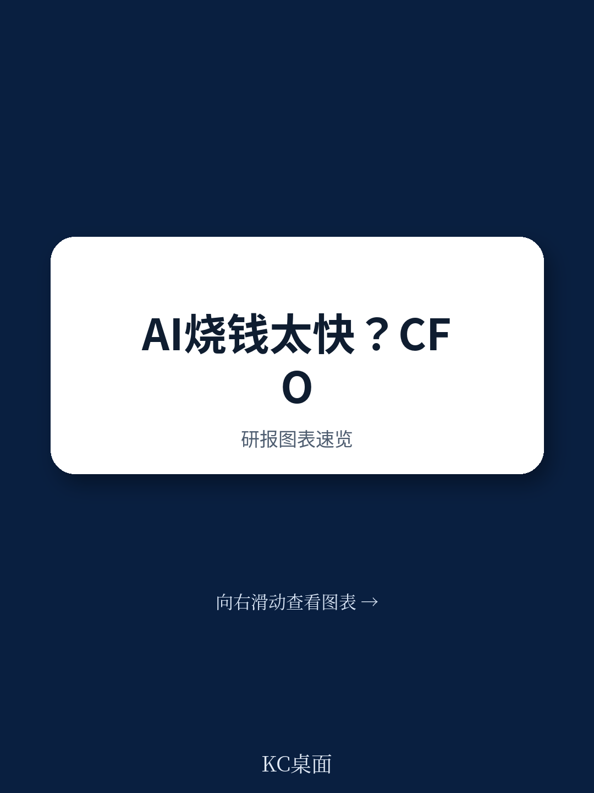
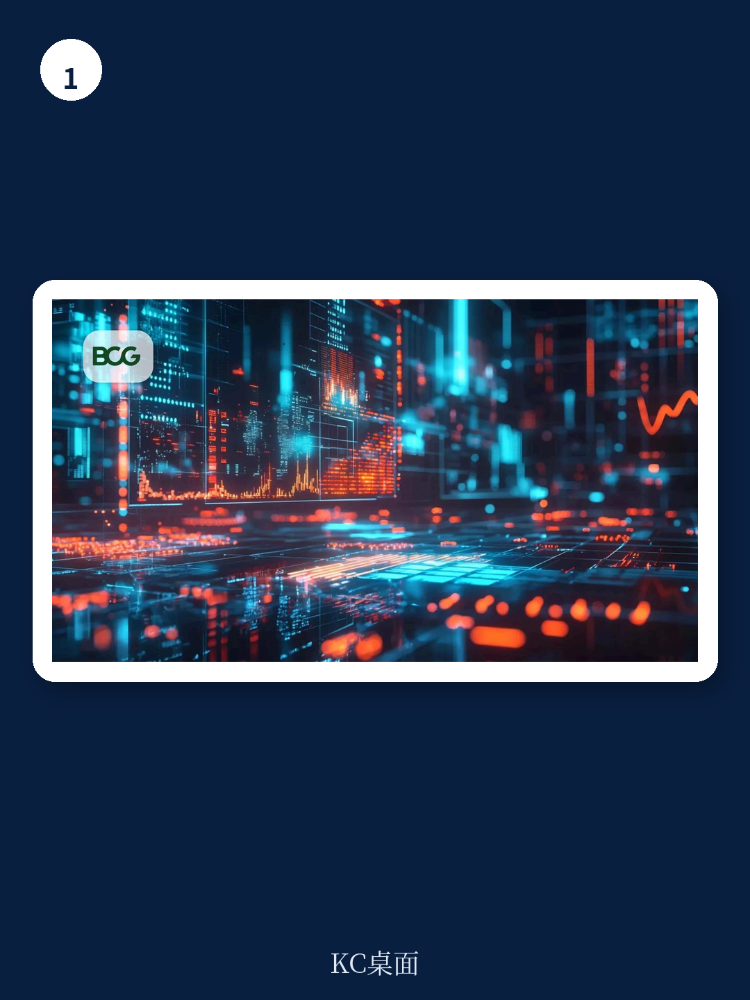

# 波士顿咨询：AI成本失控前，CFO必须学会管好“Token计价器”

当CEO开始追问AI投入到底换回了什么时，仅仅回答“我们用了很多模型”已经不够了。波士顿咨询最新研报的核心判断是：AI治理的第一波是关于“能不能用”，第二波——也就是现在正在发生的——是关于“划不划算”。而衡量这个问题的核心单位，不是GPU数量，不是API调用次数，而是Token。

Token是AI模型处理数据的基本计量单位。它在企业IT预算中曾经微不足道，但随着AI从实验走向生产，从开发者工具扩展到销售、营销、运营，Token账单正在以大多数财务负责人尚未意识到的方式爆炸式增长。BCG的两位董事总经理和一位合伙人在这篇2026年7月发布的报告中，给出了一个清晰的警告：传统的云成本管理框架FinOps，已经跟不上AI的消耗逻辑。

这不是一篇劝企业放弃AI的文章。恰恰相反，它认为那些率先建立起“Token成本管理操作系统”的公司，将在下一阶段获得真正的竞争优势。而那些还在把AI成本笼统地塞进IT预算、用“是不是在用”来评估投入的企业，很快会发现，AI的账本远比想象中复杂。

## 1. 传统FinOps管不了AI账单，因为Token消耗的逻辑完全不同

BCG在报告中明确指出，FinOps擅长的是暴露基础设施成本、分配责任、优化使用。但AI和传统SaaS软件有本质区别。传统SaaS的边际成本几乎为零——软件一旦授权，新增一个客户的成本微乎其微。AI推理改变了这条成本曲线：每一次客户交互，每一次模型调用，都在消耗Token，都在产生成本。

Token账单的复杂性在于，它不是一个简单的线性函数。一个简短的回答、一份文档的审核、一个长时间运行的Agent会话，在系统看来可能都只是一个“请求”，但各自的经济学完全不同。BCG梳理了四种相互作用的力量，它们使得传统软件和基础设施的预测模型完全失效：

第一，采用的广度和深度。用户从简单对话转向多步骤研究、代码生成、Agent部署和工作流编排时，Token成本会非线性上升。

第二，任务强度。一个短答案、一个文档审查、一个长时间运行的Agent会话，各自的经济学完全不同。

第三，上下文和循环。Agent会在每个循环中携带大量信息——指令、历史记录、检索文档、工具输出——这些信息往往被重复复制，消耗大量Token。

第四，模型组合。默认使用最新的前沿模型、最高的推理设置、最大的上下文窗口，这些设计选择对账单的影响巨大。反直觉的是，一个较弱的模型如果因为需要多次重试才能得到答案，其每次成功输出的成本可能高于一个能快速完成任务的更强模型。

> **KC评论：** 这里的核心洞察是，AI成本管理不能再沿用“用了多少资源”的思维，而必须转向“每个成功输出花了多少成本”。BCG提出的RoAI（AI投资回报率）公式——经济回报除以（人类智能成本+Token成本）——把Token成本放到了和人力成本同等重要的位置。完整报告里有一张关于“成本杠杆影响范围”的图表，展示了不同优化手段对AI账单效率的提升幅度，从5%到12%不等，值得仔细研究。

## 2. Token成本不能只归入IT预算，必须按三种类型分别记账

BCG在报告中提出了一个对CFO和CIO都极具操作性的框架：Token成本不应当全部归入IT预算，也不应当放在P&L的某一行。它们应该被分为三类，每类有不同的会计处理方式。

第一类是构建可复用能力的Token，类似于资本支出。当AI被用于设计Agent、跨职能部门重新设计工作流、以及运行自有的AI推理基础设施时，这些Token应该被视为投资。

第二类是运行内部工作的Token，属于运营费用。CFO可以为每个职能和工作流设定合理的预算，并由负责人对产出负责。

第三类是产品或客户交互中的Token，属于销售成本。这部分必须作为毛利率的一部分进行管理，因为它的影响会直接体现在产品利润上。

BCG特别强调了AI产品中的Token成本透明度问题。传统SaaS的优势在于规模效应——一旦软件授权，新增客户的成本几乎为零。AI推理改变了这条曲线：每次客户交互都带有运行模型的成本。管理层需要能够看到，吸收大规模推理对毛利率的影响，包括定价、使用量、模型架构、缓存和路由等因素。

> **KC评论：** 这个三分法实际上在挑战一个普遍存在的管理盲区：很多企业把AI成本全部视为IT支出，或者全部视为运营费用。BCG的框架要求企业根据Token的用途来区分其经济属性。报告里没有完全展开的是，这种分类方式对内部转移定价和部门绩效考核意味着什么——恰恰是这些细节决定了框架能否落地。

## 3. 建立“看见-塑造-证明”三层操作系统，比优化模型本身更重要

BCG提出了一个三层操作模型：看见（See）、塑造（Shape）、证明（Prove/Stop/Minimize）。这不是一个理论框架，而是一个可执行的流程。

“看见”阶段的核心是建立归因体系。每个实质性工作流都应该被分配一个负责人、一个职能归属、一个产品/内部使用的标签、一个P&L科目、一个模型、一个供应商，以及一个预期的产出。BCG建议设计一个仪表盘来跟踪这些指标，并给出了几个关键问题：哪些工作流消耗了最多的Token？它们产生了什么结果？每次成功输出的成本是多少？有多少支出有明确的负责人？内部运营费用和产品COGS各占多少？输入Token的缓存比例是多少？有多少工作默认使用了前沿模型？

“塑造”阶段聚焦于四个杠杆。第一，消除不必要的模型使用。很多早期Agent之所以存在，是因为它们构建速度快，而不是因为模型是合适的工具。结构化查询、基于规则的逻辑、运算、确定性策略检查，这些任务应该交给传统软件、API或可复用技能，而不是AI。第二，根据任务复杂度进行路由。将低复杂度的工作分配给较轻或开源模型，保留前沿模型用于真正困难的推理。第三，复用上下文和组件。提示词缓存和批处理可以大幅降低重复上下文和异步工作负载的成本。第四，培训员工的Token纪律。用户应该学会请求最小有用答案、约束输出长度、避免粘贴不必要的文档。

“证明”阶段是BCG框架中最容易被忽视但最关键的部分。领导者应该为消耗Token最多的工作流建立定期审查流程。每次审查都应该评估业务分子（产出）与完整分母（Token成本加上启动、审查、纠正、批准和操作工作流的人力时间）的比值。然后决定是扩大规模、优化、重新定义范围，还是停止工作流。

BCG举了一个软件工程的例子来说明为什么这种审查重要。一个Agent编码工作流可以以很小的Token成本产生大量输出，但代码行数是一个活动指标。分子应该计算实际被提交并通过审查的代码。分母应该包括规范、审查、纠正、测试和批准时间。同一个工作流可能是大幅正回报，也可能是负回报，具体取决于它产生了多少有用的、被接受的输出，以及消耗了多少人力。

## 4. 报告没有完全回答的关键问题：Token成本优化与企业创新节奏如何平衡

BCG的报告在操作层面给出了非常具体的建议，但有一个问题它没有完全展开：在Token成本受到严格管控的情况下，企业如何保持AI创新的速度和试错空间？

报告提到，企业可以在12个月内通过停止或减少可避免的支出、路由到正确的模型、缓存内容、应用正确的控制措施以及培训员工，来显著提高AI支出的效率。但这里有一个隐含的张力：严格的管理流程可能会抑制工程师和产品经理的探索意愿。如果每个工作流都需要经过“看见-塑造-证明”的审查，那些需要大量试错的前沿应用可能会被优先砍掉，而不是被鼓励。

BCG在报告中提到了“快速见效（months 1-3）、重点突破（months 3-6）、长期优化（months 6-12）”三个阶段，但并没有详细说明如何在成本管控和创新自由度之间画一条合理的线。这可能是企业在落地这个框架时最需要自己判断的部分。

## 5. 对读者的观察框架：从“AI是不是在用”转向“每个Token是否产生了可衡量价值”

综合BCG的分析，我们认为企业决策者可以用以下三个问题来快速评估自己所在组织的AI成本管理水平：

第一，AI成本是否已经被从IT预算中分离出来，按照资本支出、运营费用和销售成本分别核算？如果答案是否定的，说明财务管理的颗粒度还不够。

第二，每个使用AI的工作流是否有明确的负责人和预期产出？如果没有，说明归因体系尚未建立，支出处于“无主”状态。

第三，管理层是否定期审查AI工作流的“每次成功输出成本”？如果只关注活动量（如调用次数、生成代码行数），而不关注产出质量，说明治理框架还停留在表面。

BCG的这份报告提供了一套完整的工具包，但它更像是一张地图，而不是GPS。企业需要根据自己的业务场景、技术栈和风险偏好，在这张地图上找到自己的路径。

---

以上是波士顿咨询这份研报的核心解读。报告原文中还有更多细节，包括不同优化杠杆的具体影响幅度、三个阶段的时间规划、以及一个完整的成本管理仪表盘设计思路。这些内容在本文中无法一一展开。

如果你想获取这份报告的完整解读，包括原始图表、数据表格以及我们对每个操作层面的更详细拆解，欢迎加入我们的社群。每天，我们的AI agent会结合人工review，生成一份国际投行中文摘要与KC评论，约10-40页，涵盖当天最新数据图表合集。这些内容既方便你喂给AI做进一步分析，也方便你快速把握全球市场的动态和趋势。

Personal reading notes and learning share only. Not investment advice.

