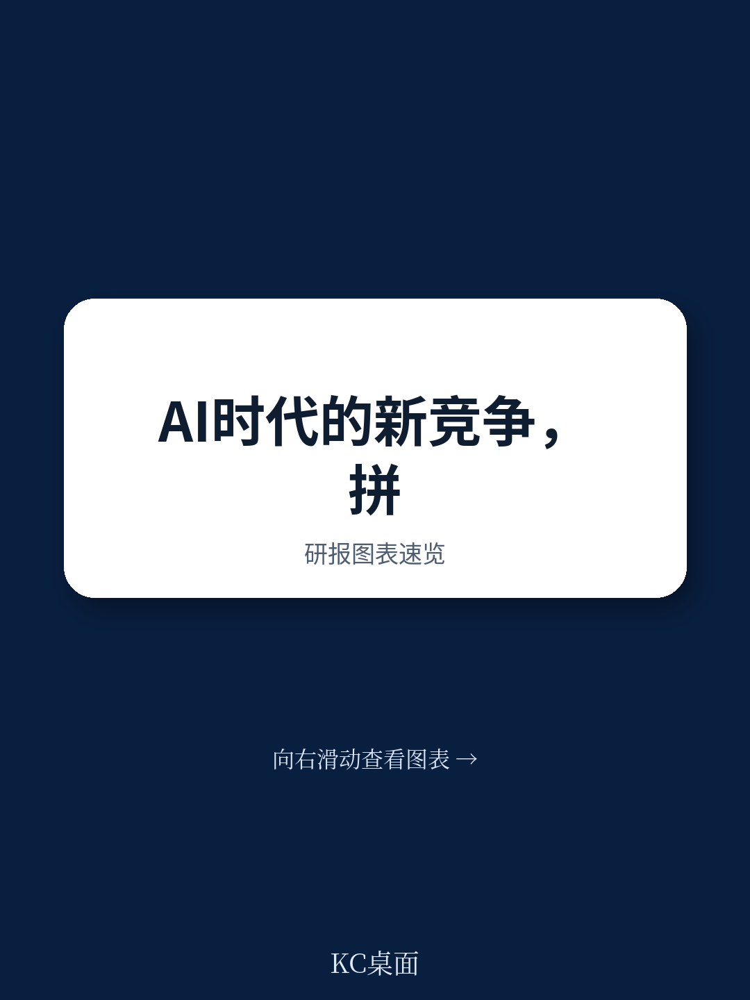
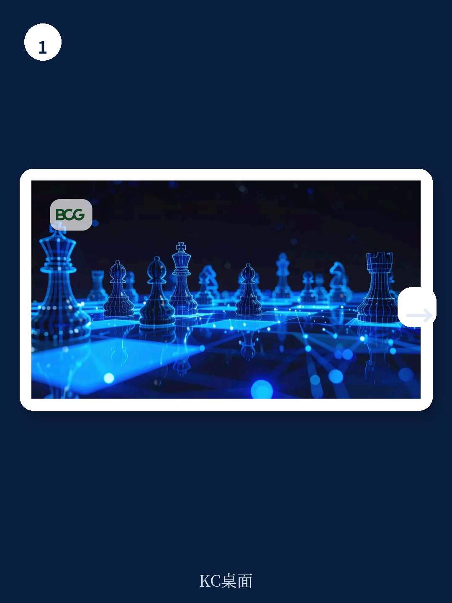
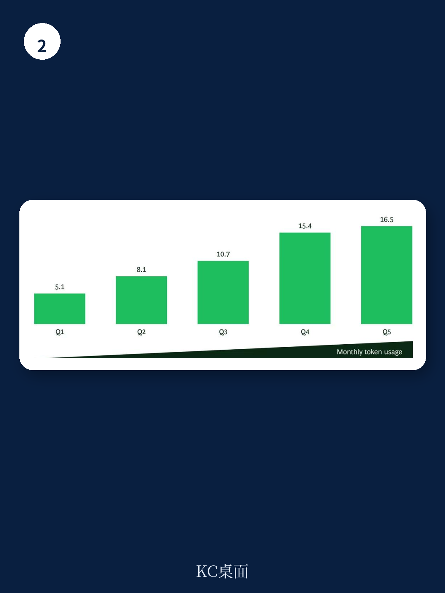

# 波士顿咨询：AI竞争已进入“Token时代”，增长差距正在拉大

一份来自波士顿咨询（BCG）的最新报告，提出了一个可能改变企业竞争逻辑的判断：我们正在进入“基于Token的竞争”时代。当AI模型在几乎所有领域都达到博士级知识水平时，智力变得可规模化、可获取。优势不再来自于拥有智力，而来自于比竞争对手更高效地将智力应用于商业问题。

波士顿咨询的分析显示，在107家年收入超过5亿美元的科技公司中，Token使用量最高的五分之一企业，其营收中位数同比增长率达到16.5%，而使用量最低的五分之一企业，这一数字仅为5.1%。这不是一个巧合，而是一个正在发生的结构性分化。

Token——AI模型的语言和货币——正在成为衡量企业竞争力的新标尺。就像1988年波士顿咨询首次提出“时间竞争”概念时那样，当速度成为制胜的新基础，如今Token消耗的效率正在重新定义赢家和输家。

> **KC评论：** 这份报告的核心洞察不在于“AI很重要”，而在于它提供了一个可量化的竞争框架。就像当年工厂用电量可以衡量工业化程度一样，Token消耗量正在成为衡量企业AI化程度的新指标。但关键在于，不是消耗得多就好，而是如何把Token转化为收入增长。报告提出了一个关键概念——ROInt（智能投资回报率），用来衡量人+Token的综合产出效率。完整报告中有详细的测算方法和行业对比数据。

## 1. 管理Token要像管理资本投资，而不是IT成本

波士顿咨询建议企业采用ROInt（Return on Intelligence）指标，将产出价值除以劳动力和Token的总成本。这个指标让企业能够在同一基础上比较完全不同的AI应用：客户服务自动化追求的是效率，软件工程或研发追求的是更快的创新和新的收入。

目前大多数企业只衡量劳动力节省，这会导致系统性地偏向更窄的AI应用场景，从而留下大量价值未被捕获。而那些只追求最大化Token消耗的企业，则会创造让员工钻空子的激励。

报告引用了英国消费品公司Reckitt的案例：通过将AI策略性地应用于营销、产品开发和研发等高价值流程，该公司实现了内容开发速度提升60%，研发周期缩短，原型制作减少，同时营销和创新产出质量更高。

## 2. Token使用量与企业增长之间存在可验证的正相关关系

这是报告最引人注目的实证发现。在107家样本公司中，Token消耗量最高的五分之一企业，营收中位数增速是最低五分之一企业的三倍多。而且这种差距不是短期的，而是随着AI模型本身变得更便宜、更快速、更智能，这种优势还会自我强化。

波士顿咨询称之为“持续增长飞轮”：当AI被策略性部署时，企业会学习如何更有效地在整个业务中应用这些优势。随着员工重新设计整个工作流程，构建新工具、新代理和审核机制，组织会学会如何更有效地将Token转化为价值。

> **KC评论：** 这里有一个关键假设需要验证：Token使用量和营收增长之间的因果关系。是AI高手企业本来就增长快，还是Token使用直接推动了增长？报告倾向于后者，但完整数据显示了更多细节——比如不同行业、不同规模企业的Token消耗模式差异，以及这种差距在12个月研究期内如何演变。这些图表在完整报告中。

## 3. 企业需要把AI责任从IT部门转移到战略规划或财务部门

CFO们在问：Token消耗的资金从哪里来？CTO们担心Token“超支”导致预算失控。AI卓越中心（CoE）的负责人需要在不知道Token使用或成本将如何演变的情况下制定明年预算。

波士顿咨询的解决方案是：将AI责任从IT部门转移出去。IT通常被视为成本中心，而AI应该被整合到战略规划、AI CoE或财务部门，成为工作完成方式的核心。这样做的目的是让企业能够抓住AI策略性部署时触发的持续增长飞轮。

报告以JPMorgan Chase的Coach AI平台为例：该行分阶段推出工具，先证明技术价值，让顾问在日常工作中学习使用。资产和财富管理CEO Mary Callahan Erdoes表示，目标是“消除员工日常生活中的无趣工作，让他们能够从事更高层次的增值工作”。顾问现在用AI研究内容和查找客户信息的速度提高了95%，从而有更多时间与客户进行有意义的对话。

## 4. 不要把人视为成本，Token是人才增强剂，不是替代品

波士顿咨询的立场非常明确：在大多数集成AI的工作流程中，人类负责启动、指导和完成工作。他们决定哪些问题值得解决，塑造提示词或工作流程，评估输出，运用判断力，并对结果负责。这就是ROInt指标同时包含人类智能成本和Token成本的原因。

报告警告说，过度强调替代的企业最终可能会后悔。Gartner预测，到2027年，一半因AI而裁减客服人员的公司将重新招聘。在其对321名客服和支持领导者的调查中，只有20%真正因为AI减少了员工。

Cloudflare的案例展示了另一种路径：CEO Matthew Prince在《华尔街日报》的专栏中提出，AI将减少对“衡量”角色的需求（包括中层管理和运营），同时增加专注于产品构建和客户互动员工的价值。Cloudflare裁减了衡量角色，同时加速招聘工程和面向客户的职能。

> **KC评论：** 这里有一个反直觉的洞察：削减人员不仅降低成本，还可能降低组织将AI输出转化为可信赖、可部署价值的能力。波士顿咨询之前的研究发现，50%-55%的工作岗位将被AI重塑，只有10%-15%可能被替代。这意味着“Token竞争”的赢家将是那些拒绝在投资AI和投资人才之间做错误选择的企业。完整报告中有关于哪些岗位最容易被重塑、哪些最可能被替代的详细分析。

## 5. 组织变革才是真正的瓶颈，技术已不是问题

报告揭示了一个令人警醒的数据：只有不到10%的员工以“代理式”方式使用AI——即委托AI代理规划并执行多步骤工作，而不仅仅是寻求答案或帮助完成离散任务。

采用率停滞的原因往往是人性的：员工可能不知道AI在哪里能创造价值，可能回归熟悉的常规工作而不是重新设计工作，或者可能因为感到AI威胁其核心专业知识或身份而抵制使用。

波士顿咨询认为，领导者需要直接、诚实地解决这些障碍。否则，Token消耗可能上升，但不会形成将Token转化为价值的行为。组织变革不是可有可无的附加项，而是战略本身。

## 6. 报告尚未完全回答的关键问题：Token竞争何时从科技行业外溢

这份报告的数据样本仅限于107家年收入超过5亿美元的科技公司。这引发了一个核心问题：Token竞争的逻辑是否适用于非科技行业？制造业、零售业、医疗保健、金融服务等行业的企业，如何衡量和优化Token消耗？

波士顿咨询提到了Reckitt（消费品）和JPMorgan Chase（金融）的案例，但这些只是个别例子。对于大多数传统行业的企业来说，Token消耗的测量、ROInt的核算、以及组织变革的路径，都还没有清晰的框架。

另一个未解问题是：Token消耗与企业增长之间的因果关系到底有多强？在科技行业，高增长企业可能本身就更有动力和能力投资AI，从而导致更高的Token消耗。报告提供的是相关性证据，但因果关系的证明需要更长时间的跟踪和更精细的控制实验。

> **KC评论：** 这两个问题正是加入社群可以继续深挖的方向。我们每天会由AI agent + 人工review生成国际投行中文摘要与KC评论，daily更新，约10-40页，也包含当天最新数据图表合集。完整报告中还有波士顿咨询关于Token消耗的行业分布、企业规模差异、以及不同AI应用场景的ROInt测算方法。这些图表和数据既方便喂给AI，也方便人工快速把握market dynamics。

---

Token竞争的时代已经到来。波士顿咨询的报告提供了一个清晰的框架：用ROInt衡量人+Token的综合产出效率；把AI责任从IT转移到战略规划；把人视为Token的增强剂而非替代品；把组织变革视为战略而非附加项。

但最大的问题仍然悬而未决：当Token消耗成为新的竞争标尺，你的企业准备好了吗？如果还没有，现在就是开始构建组织能力的时候了——不是明天，不是下个季度，就是现在。

加入社群，领取完整研报解读与原始图表，与同行一起探讨Token竞争时代的制胜之道。

Personal reading notes and learning share only. Not investment advice.

