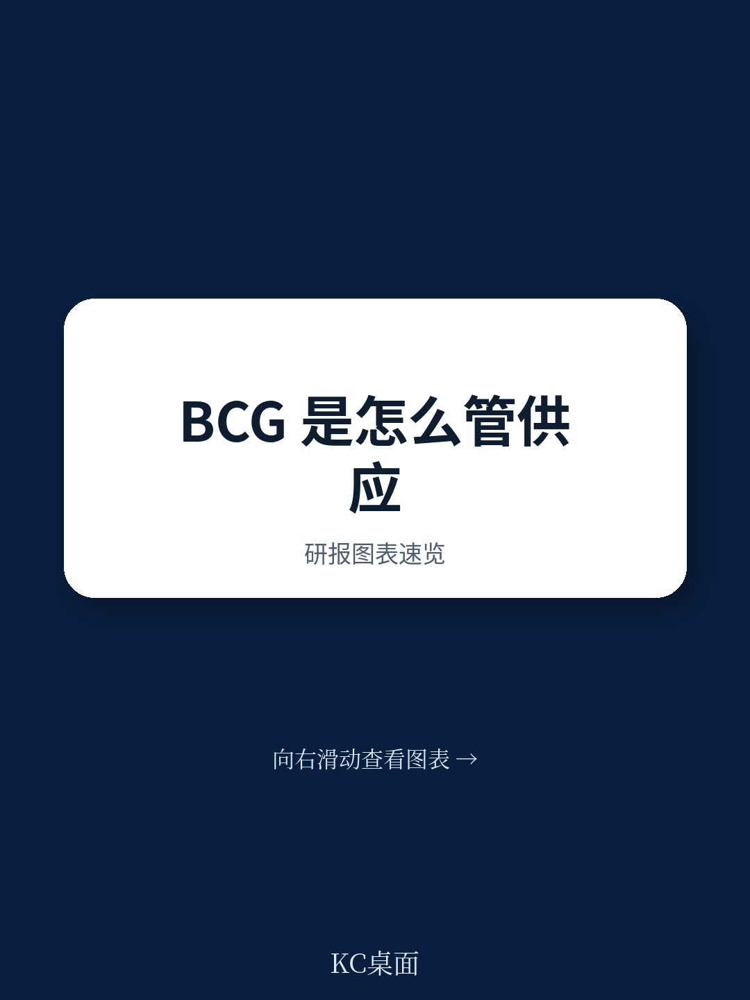

# 波士顿咨询：BCG报告揭示：供应链人权合规已成企业不可回避的硬约束

这份波士顿咨询（BCG）的《透明度法案》合规报告，表面上是一份法律要求的例行披露。但如果你只把它当作挪威分支机构的合规文件，可能会错过一个正在全球蔓延的重要信号：供应链人权尽职调查，正在从“企业社会责任”的软性倡议，转变为具有法律强制力的硬约束。

报告的核心判断是：BCG作为全球顶级咨询机构，已经将人权合规嵌入到供应商管理的全生命周期中，从合同模板到举报机制，形成了一套完整的闭环体系。这不仅是合规要求，更是对供应商的实质性筛选——无法满足这些标准的公司将逐渐被排除在BCG的供应链之外。

为什么这个信号现在值得关注？因为挪威《透明度法案》并非孤例。欧盟的《企业可持续发展尽职调查指令》（CSDDD）已于2024年通过，德国《供应链尽职调查法》已经生效，英国《现代奴隶制法案》持续施压。全球供应链的合规标准正在快速收敛，而BCG这份报告提供了一个观察“最佳实践”的窗口。

> **KC评论：** 这份报告最值得看的不是BCG如何合规，而是它揭示了“合规即竞争力”的新逻辑。当头部企业开始系统性地将人权条款嵌入供应商合同，并进行持续监控时，没有跟上节奏的企业将面临商业机会的流失。完整报告中对供应商行为准则的具体条款、风险评估的具体方法论，以及举报机制的运作细节，都值得仔细研读。

## 1. 合规已从“道德倡议”升级为“合同硬条款”，供应商必须做出选择

BCG报告中最具实质性的动作，是将《供应商行为准则》（SCOC）直接嵌入所有标准供应商合同模板。这不是一份可以随意忽视的附件，而是具有法律约束力的合同组成部分。

SCOC覆盖了四个核心领域：商业实践与道德、劳工实践与人权、环境法规与保护、以及资产、知识产权与数据保护。更重要的是，报告明确规定了供应商合规的报告流程，以及BCG对不合规行为的“潜在回应范围”——这意味着，违反SCOC的供应商可能面临合同终止、业务缩减甚至法律追索。

对于BCG的供应商而言，这不再是“最好做到”的建议，而是“必须做到”的前提。这种从“软性倡议”到“合同硬条款”的转变，正在全球供应链中加速蔓延。BCG作为管理咨询行业的标杆，其做法很可能被其他企业效仿，成为行业标准。

> **KC评论：** 对于为BCG或其他大型咨询公司提供服务的IT、设施管理、专业服务类企业，现在需要认真审视自己的劳工和人权合规体系。报告没有展开的是，SCOC的具体条款如何与挪威法律、欧盟法规以及供应商所在国的法律对接。这些细节在完整报告中有更详细的说明，对于理解合规的具体要求至关重要。

## 2. 低风险判断背后是精心设计的筛选机制，而非简单结论

BCG报告明确判断，其供应链“对人权或体面工作条件产生不利影响的风险总体较低”。但这个结论并非出于侥幸，而是建立在一套精心设计的供应商筛选机制之上。

报告指出，BCG主要与“大型、信誉良好的公司”合作，且供应商主要集中在挪威境内。挪威供应商之所以被视为低风险，是因为它们同样受《透明度法案》等法律的约束。这种“同类法律约束”的筛选逻辑，实际上将合规成本转移给了供应商——只有那些已经建立起合规体系的企业，才能进入BCG的供应商名单。

对于高风险行业或地理区域的供应商，BCG采取了额外的措施：明确传达期望，要求供应商确保自身拥有人权和体面工作条件的保障机制，并要求其预防或减轻任何风险。这种差异化的风险管理策略，使得BCG能够在保持供应链效率的同时，将合规风险控制在可接受范围内。

> **KC评论：** 低风险判断不等于不加监控。BCG强调“人权和尽职调查工作是一项持续的努力”，这意味着供应商需要定期接受评估。对于不在挪威境内的供应商，尤其是来自新兴市场的供应商，合规要求可能更为严格。完整报告中的风险评估方法论和供应商评估标准，是理解这一机制的关键。

## 3. 举报机制从“内部通道”升级为“供应链透明度工具”

BCG报告明确提供了两条举报渠道：内部举报机制（Speak Up Line）和监察员程序。但更值得关注的是，这些机制不仅面向BCG员工，也向外部开放——供应商的员工、客户以及任何相关方都可以通过这些渠道举报违规行为。

这意味着，BCG的供应链透明度不再依赖于供应商的单方面报告，而是引入了第三方监督机制。任何在BCG供应链中工作的人，如果发现人权或劳工权益受到侵害，都可以直接向BCG举报。这种“外部监督”机制，实际上大大降低了BCG的监控成本，同时提高了违规行为的发现概率。

对于供应商而言，这构成了真正的威慑。任何在BCG供应链中工作的人，都可能成为合规的“哨兵”。供应商需要确保自己的运营和供应链在任何环节都不存在人权或劳工权益的侵害，否则就可能面临来自内部的举报。

## 4. 报告尚未回答的关键问题：合规成本如何分摊，以及中小型供应商的生存空间

BCG这份报告虽然展示了成熟的人权合规体系，但它也留下了一些尚未完全回答的关键问题。

第一个问题是合规成本的分摊。建立和维护人权合规体系需要投入大量资源，包括供应商评估、合同条款审核、举报机制运营等。这些成本最终由谁承担？是BCG作为采购方承担，还是通过价格传导给供应商？对于大型供应商而言，这可能只是运营成本的一部分；但对于中小型供应商，尤其是来自新兴市场的供应商，这可能是一笔难以承受的额外支出。

第二个问题是中小型供应商的生存空间。BCG报告明确表示主要与“大型、信誉良好的公司”合作。这意味着，那些无法建立完善合规体系的中小型企业，将很难进入BCG的供应链。这种趋势可能会加速供应链的集中化，使得大型企业获得更多业务机会，而中小型企业则面临被边缘化的风险。

第三个问题是跨法域协调的复杂性。BCG的供应商来自不同国家，面临不同的法律环境。当挪威法律、欧盟指令、供应商所在国法律以及国际人权标准之间存在冲突时，如何确定优先适用顺序？报告对此没有给出明确答案。

## 5. 对读者的观察框架：从“合规成本”转向“合规竞争力”

基于BCG这份报告，我们可以提炼出一个新的观察框架：将供应链人权合规视为一种竞争力来源，而非纯粹的合规成本。

首先，合规体系可以作为供应商筛选的“过滤器”。那些已经建立起完善合规体系的企业，将更容易进入头部企业的供应商名单，获得稳定的业务来源。反之，那些合规体系薄弱的企业，将逐渐被排除在主流供应链之外。

其次，合规体系可以降低供应链风险。通过合同条款嵌入、持续监控和外部举报机制，企业可以更早地发现供应链中的人权风险，避免因供应商违规而引发的声誉损失甚至法律追索。

第三，合规体系可以成为差异化竞争的优势。在客户越来越关注供应链可持续性的背景下，拥有透明、合规的供应链管理体系的企业，更容易获得客户的信任和订单。BCG作为管理咨询公司，其自身的合规实践本身就是对其服务能力的最好证明。

> **KC评论：** 对于企业决策者而言，现在需要思考的不是“是否要建立人权合规体系”，而是“如何以最低成本建立有效的合规体系”。BCG的做法提供了参考，但每个企业需要根据自身行业、规模和供应链特点进行定制化设计。完整报告中的供应商行为准则、风险评估方法论和举报机制设计，是理解这一体系的关键要素。

## 6. 持续性合规的挑战：从“一次性评估”到“动态监控”

BCG报告强调，“人权和尽职调查工作是一项持续的努力”。这意味着，合规不是一次性的评估，而是需要持续监控和动态调整的过程。

报告指出，BCG“继续开发和评估我们的措施和评估标准，以捕捉我们的运营或供应商中可能存在的任何侵犯人权的风险”。这种动态调整的能力，是应对供应链复杂性和环境变化的关键。

然而，持续监控需要投入大量资源。对于许多企业而言，建立一次性的合规体系可能相对容易，但维持持续的监控和更新则更具挑战性。BCG作为全球顶级咨询公司，拥有足够的资源和专业团队来支持这一工作，但对于大多数企业而言，这可能需要外部专业服务机构的支持。

---

BCG这份报告揭示了一个清晰的趋势：供应链人权合规正在从“可选项”变为“必选项”。对于企业而言，现在需要认真审视自己的供应链合规体系，确保能够跟上这一趋势。

但正如我们前面所讨论的，合规体系的建立和维持并非易事。合规成本如何分摊？中小型供应商如何生存？跨法域冲突如何解决？这些问题在BCG的报告中并未完全回答，但它们是每个企业都需要面对的挑战。

如果你希望深入了解BCG的供应商行为准则具体条款、风险评估方法论、举报机制设计细节，以及如何在自身企业中落地这些最佳实践，欢迎加入我们的社群。每天，我们会由AI agent与人工review结合，生成国际投行与咨询机构的研报中文摘要与KC评论，daily更新，约10-40页，也包含当天最新数据图表合集。这套内容既方便你喂给AI做进一步分析，也方便你快速把握全球供应链合规的最新动态与市场趋势。在社群中，我们还将围绕这些未解问题展开深入讨论，共同探索合规与竞争力的平衡之道。

Personal reading notes and learning share only. Not investment advice.

