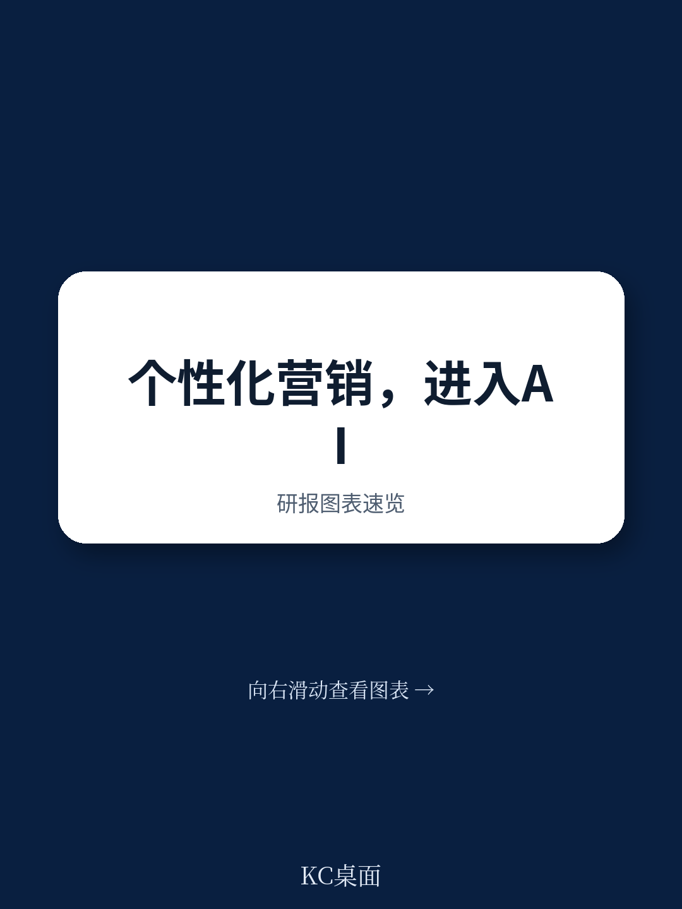
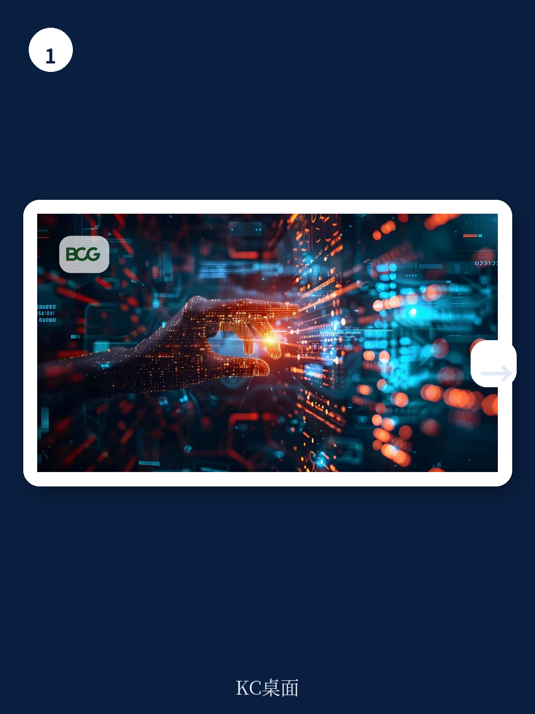

# 波士顿咨询：营销的终极形态，不是“旅程”而是“原子动作”

当一家企业还在为优化客户旅程而投入重金时，波士顿咨询（BCG）在最新研报中给出了一个颠覆性判断：**以“旅程”为核心的营销范式，其增长红利已经见顶。** 下一个十年的竞争，将围绕“原子动作”展开——由AI代理实时选择、排序和组合营销动作，而人类营销者的角色，将从旅程设计师转变为货架策展人。

这不是渐进式改良。这是一次营销底层操作系统的切换。对于任何依赖客户生命周期管理的企业，理解这一转变的紧迫性，可能决定了未来18个月是领跑还是掉队。

---

## 1. 旅程模型的困境：规模不经济与响应滞后

过去十年，“客户旅程”是营销组织最核心的构建块。它逻辑清晰、可执行，通过预设触点引导客户完成转化。但BCG指出，这套模型正在遭遇双重瓶颈。

第一，规模不经济。每新增一个细分客群、一次产品发布或一个新渠道，都需要新建一条旅程。当旅程数量从几十条膨胀到几百甚至上千条时，团队的管理能力被迅速摊薄。每条旅程的边际收益在下降，而维护成本却在指数级上升。

第二，响应滞后。旅程是预定义的。当客户在真实场景中遭遇意外事件——比如刚打完投诉电话，20分钟后打开App——旅程模型无法感知这种动态语境，仍会推送预设的促销信息。这不仅是体验的错配，更是信任的消耗。

BCG的核心洞察在于：**旅程模型把“决策单元”设得太大了。** 它试图用一条固定的路线图去覆盖所有可能性，而现实中的客户信号是碎片化、实时变化的。当决策单元从“整条旅程”缩小到“单个动作”，新的可能性才会打开。

> **KC评论：** 旅程模型的困境，本质上是“计划赶不上变化”。你花三个月设计了一条完美的旅程，但客户的行为在三个月里已经变了三次。BCG的建议看似技术化，实则是在问一个根本问题：我们能否让营销系统像自动驾驶一样，每秒都在根据路况做微调，而不是按一张死地图开到底？

## 2. 决策单元的三个进化阶段：从旅程到原子动作

BCG将NBA（Next-Best Action）的演进划分为三个阶段，每个阶段的核心差异在于“决策单元”和“营销者角色”的不同。

第一阶段：营销者编排的旅程。这是当前主流。营销者手动构建受众、设计流程、定义规则。决策单元是“旅程”本身。优势是可控，劣势是僵化。

第二阶段：模型优化的旅程。越来越多企业开始引入机器学习模型，在预设旅程内部优化分支选择、优惠推荐或信息排序。决策单元从“旅程”缩小到“旅程步骤”。模型在边界内做优化，但架构仍假设旅程是合理的组织方式。

第三阶段：代理组合的动作。这是BCG预测的终极形态。营销者的角色从设计旅程转变为“策展货架”——定义哪些资产可用、哪些约束适用。AI代理（Agent）负责从货架上选择、排序和组合原子动作，以适应实时的客户上下文。决策单元是“原子动作”。

**关键区别在于：** 第一阶段，人类决定一切；第二阶段，人类设定框架，模型填空；第三阶段，人类设定目标和边界，代理自主决策如何执行。这听起来激进，但BCG认为，技术栈已经就绪，真正的挑战是运营模式的转变。

## 3. 四个核心能力：货架、代理、工具与实验

实现代理原生NBA，需要构建四个相互关联的能力层。BCG强调，这不是在现有系统上“打补丁”，而是从底层设计一套支持AI代理自主推理和行动的系统。

第一，可组合货架。这是代理可以调用的资产库，分为三个粒度：原子资产（文案、图片、优惠模板）、编译通信（已组合好的邮件或推送）、微旅程（2-5步的短序列，如新品发布）。所有资产必须带有元数据标签——渠道兼容性、监管标志、有效期——供代理评估和选择。

第二，代理架构。这是决策的“大脑”。一个中央编排器响应客户事件，路由到专门代理：上下文代理负责整合客户全貌，资格检查代理负责合规，动作选择代理负责最优匹配，组合代理负责生成最终交互。代理之间不是固定流水线，而是按需协作。

第三，工具与状态管理。每个模型、数据源、渠道API都被暴露为可调用的工具。代理可以按需组合这些工具，而不是走预埋的管道。同时保持客户状态的持久记忆——之前发生了什么、客户偏好是什么、正在进行的通信有哪些。

第四，学习与优化。通过因果测试和增量实验，持续评估每个货架资产和代理决策的效果。BCG特别强调，**实验不是可选项，而是系统的核心引擎。** 没有持续的学习，代理只会重复过去的错误。

> **KC评论：** 这四个能力听起来像技术架构，但本质是管理逻辑的变革。货架解决的是“有什么可用”，代理解决的是“怎么选怎么组”，工具解决的是“怎么执行”，实验解决的是“怎么变好”。缺一个，系统就会退化回传统模式。完整报告里有详细的架构图和技术实现细节，读完你会理解为什么BCG说“没有丢弃的工作”——你今天的投资，明天可以直接被代理调用。

## 4. 一个真实的场景：为什么代理能避免“信任危机”

BCG用一个信用卡客服场景，生动展示了三阶段NBA的差异。

一位长期高消费的信用卡客户，刚刚打电话投诉了一笔欺诈交易，问题得到解决。20分钟后，他打开了银行的App。

第一阶段：旅程模型。App展示了一个预排的余额转移促销——这条旅程是在投诉电话之前就设计好的。在客户刚刚被验证了信任的时刻，推送一个促销信息，是典型的语境错配。

第二阶段：模型优化旅程。一个倾向模型根据“最近互动”规则，抑制了促销。但模型无法识别“欺诈案已解决”这一信号背后的情绪——这是一个重建信任的黄金时刻。

第三阶段：代理组合动作。编排器将App打开事件路由到上下文代理，后者整合了完整画面：欺诈案已解决、长期客户、高月消费、无前科。动作选择代理评估可用选项，选择了一条安全感信息，并配上一个免费的信用监控升级。组合代理在几秒内从货架上完成组装。实验层记录了这次交互的结果，用于优化下一次类似场景。

**这个案例的核心不是技术，而是“决策颗粒度”。** 代理之所以能做出更优选择，是因为它看到了旅程模型看不到的上下文，并且有足够灵活的工具去响应。

## 5. 报告没有完全回答的问题：治理、信任与组织惯性

BCG的研报提供了清晰的技术路线图，但有几个关键问题尚未完全展开，值得读者特别关注。

**第一，治理边界如何划定？** 代理可以自主决策，但哪些决策可以完全自动化，哪些必须保留人类审批？BCG提到“人类监督”，但没有给出具体的分级框架。在实际业务中，金融、医疗等强监管行业，合规风险可能成为代理落地的最大障碍。

**第二，客户信任如何建立？** 当客户发现自己在和一个AI代理互动，而不是一个遵循预设规则的系统，信任机制会发生什么变化？代理的决策透明度、可解释性和纠错机制，目前尚未被充分讨论。

**第三，组织惯性如何打破？** 营销团队习惯了“设计旅程”的工作方式。转向“策展货架”意味着技能结构的重塑——从创意执行转向数据标注、元数据管理和实验设计。BCG提到“操作模式需要重塑”，但如何推动这种文化转型，可能需要更长的实践验证。

**这些未解问题，恰恰是完整报告最有价值的部分。** BCG在五篇系列报告中，分别深入讨论了决策科学、组织结构和测量体系。如果你想理解代理原生营销的全貌，而不只是技术架构，建议直接阅读原文。

---

**加入社群，每日获取国际投行研报的中文深度解读。** 我们每天会由AI agent结合人工review，生成约10-40页的摘要与KC评论，涵盖高盛、摩根士丹利、BCG、麦肯锡等机构的最新报告，同时附带当天最新数据图表合集。既方便你快速把握市场动态，也适合直接喂给AI做进一步分析。在社群中，你还可以与数百位产业决策者和投资者一起，讨论这些研报背后的真实含义。

Personal reading notes and learning share only. Not investment advice.

