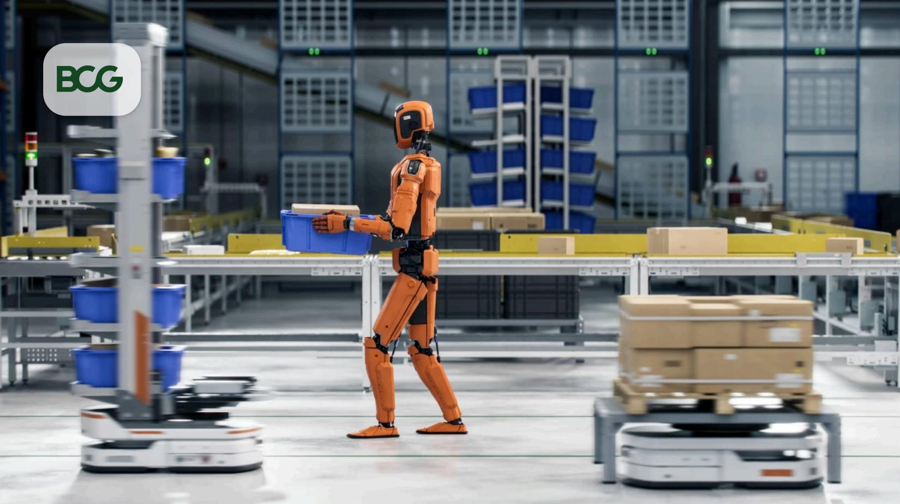

ARTIFICIAL INTELLIGENCE

# The CEO's Guide to Physical AI

ARTICLE MAY 12, 2026 5 MIN READ

## What's at Stake

CEOs who’ve never considered automation—or have yet to act on it—may be underestimating how much has changed in recent years. Thanks to advances in physical AI, robotics is entering a new era, expanding what can be automated across industries and supply chains. Robots can now see, adapt, and adjust in real time, reducing deployment costs and complexity, accelerating adoption, and raising the cost of standing still for companies that hesitate.

## What the Numbers Say

50%

Increase in the scope of work that can be automated compared to traditional robotics

70%

Reduction in
engineering time
needed to train robots

3x

Faster payback period for cutting-edge robotics investments (from 5–7 years to 1–3)

## What's Changed

Physical AI has rapidly become more flexible and capable as both the hardware and the AI have improved.

\- Tasks once seen as too variable or cost-prohibitive for automation are now in play.

\- Many robots can be trained in virtual, digital environments so they can “learn” how to do a job before being installed.

\- This accelerates deployment and eliminates the need for onsite training, which is often disruptive and expensive.

\- Upfront investment is falling fast: in traditional robotics, about 75% of costs come from system integration, setup, and engineering, but software-defined physical AI can cut those costs by more than half.

# Five CEO Moves to Capture Value from Physical AI

While some capabilities are improving quickly, such as perception powered by modern computer vision, other areas—like human-level dexterity and physical reasoning—remain stubbornly difficult for machines. For leaders, the opportunity lies in focusing on where physical AI can deliver value today. Here are five moves they can make now.

# Move #1: Assess Operational Inefficiencies with Next-Gen Physical AI in Mind

Leaders should know where physical AI is advancing—and where it still has a long way to go. The sci-fi vision of a do-it-all, C-3PO-style humanoid robot is still distant. And we are years away from machines that can reliably navigate new environments and pass the “coffee test.” $^{1}$ To clarify what’s newly deployable versus what’s still emerging, leaders can evaluate physical AI across four capabilities:

\- Visual Perception. These robots are enhanced with machine vision that enables them to recognize objects and positions, extending automation to new environments.

\- Dexterous Manipulation. Robots that unlock complex automation by fusing perception, understanding, and force to handle variable or deformed objects. The currently available models still require extensive training for specific tasks.

\- Workflow Planning. Still under development, these robots can be told what to achieve—not how—by interpreting human intent and generating the workflow to complete the task.

\- Reasoning. This is an envisioned future state of physical AI, characterized by robots that can reason how their actions will change their surrounding environment and then choose a path based on expected outcomes. It is the highest goal for humanoid-style consumer robots and remains elusive for now.

## Move #2: Think Holistically About How Workflows and Processes Must Evolve

Even state-of-the-art physical AI cannot replicate everything a human worker does. But it can often replace 50% of the tasks they perform and do them more efficiently and consistently. To maximize value, leaders can:

\- Define a value-chain-wide automation model guided by a holistic view of where automation makes the most impact. The most strategic deployments of physical AI will require a systemic revamp, where tasks that were previously done by one worker are redistributed across the line. For example, a robot may be able to complete the repetitive physical task of an individual worker on an assembly line but not the same worker's visual quality control.

Ensure every partial task that is automated has a corresponding process redesign to unlock measurable cost and productivity gains.

\- Design factories with robots in mind. While most companies are retrofitting human workspaces, the most significant gains will come from factories and warehouses designed and built for robots. Such factories never need to close. In some cases, the technology to achieve a robot-ready factory may not yet be available. But leaders who iterate and climb the innovation curve are more likely to unlock an advantage before their competitors.

## Move #3: Know Your Target Tech Architecture Before You Buy from Vendors

Approaching potential vendors without a solid plan for how to integrate their technology into your planned architecture could land you with an approach that matches the vendor's priorities rather than your company's needs.

\- Have a plan for integrating potential vendor systems across hardware, operating backbone, simulation training environment, and applications. Decide whether and where to codevelop technology or buy existing models. Determine how a new vendor system will integrate into your company’s existing IT infrastructure before you reach out.

\- Don’t drag your feet. Physical AI is a rapidly emerging industry, and there will be competition for specific technologies. Vendors are more likely to engage with companies that have identified novel, rewarding challenges—so leaders with a systemic plan in place are more likely to attract the best in class.

# Move #4: Plan for How Jobs Will Change Before They Do

Just as designing a new tech architecture before implementation is a must, so is planning ahead for how the workforce will need to evolve.

\- Decide which human roles will shift from the factory floor to supervising, training, and integrating robots. Evaluate which workers are best positioned to be reskilled to supervise new robotic systems. Your existing workforce has the advantage of already understanding your specific needs and processes, and employees can often be transitioned to new robot-managing roles with the right upskilling. Some new talent will also be needed, so have a plan in place to secure the top candidates to fill these roles.

\- Tell your workforce how their roles will evolve. Be transparent about the coming transition, communicating how roles will change. Workers who don’t know how their role will be impacted could fill that gap with fear, which can hamper adoption. For some workers, the transition will be welcome; an assembly line worker could have the opportunity to transition from repetitive tasks to a more rewarding job designing and managing the new automation systems.

## Move #5: Institute Strong Governance for Physical AI Systems

As with other forms of artificial intelligence, physical AI comes with safety and security challenges that require vigilant governance. As they deploy the technology within their companies, CEOs must:

\- Ensure robots won’t malfunction in ways that endanger the safety of their workforce and their operations.

\- Fully understand the cybersecurity implications of integrating physical AI. As machines become more autonomous, intelligent, and connected, they can become ripe targets for hackers and other hostile actors. CEOs must have a robust plan to mitigate physical AI cybersecurity risks and recover quickly if a robot or system is hacked.

\- Remember that cybersecurity risks extend to third-party vendors. As your supply chain adds more third parties, it introduces potential new entry points for attackers looking for weak links into your network. Ensure your vendors are vigilant—otherwise your company could end up paying the price.

## Final Gut Check

Physical AI has advanced significantly in recent years, and that momentum is likely to continue. CEOs who make smart choices now about where and when to deploy it, and do so responsibly, will not only be better positioned to unlock new levels of efficiency and value. They will also build scale and know-how that slower competitors will struggle to match.

## Featured Experts

  
Tilman Buchner  
Partner & Director
Munich

  
Mei-Jung Chen

Managing Director & Partner
Taipei

  
Daniel Küpper

Managing Director & Senior Partner
Cologne

[Non-textual symbol]

## ABOUT BOSTON CONSULTING GROUP

Boston Consulting Group bridges the gap between ambition and outcomes for the world's leading companies and organizations. We are built for this era of unprecedented change — bringing strategic clarity rooted in over 60 years of deep domain knowledge, combined with applied AI shaped by our practitioners. BCG works shoulder-to-shoulder with CEOs across industries and geographies to deliver transformative impact at scale: stronger returns, transferred capabilities, and change that sticks. For more information, visit bcg.com.

1 The “coffee test” is an informal benchmark in physical AI that asks whether a robot can autonomously prepare and serve a cup of coffee in an unfamiliar real-world environment. It encapsulates the challenge of integrating perception, manipulation, planning, and adaptability in unstructured settings as a proxy for general-purpose embodied intelligence.