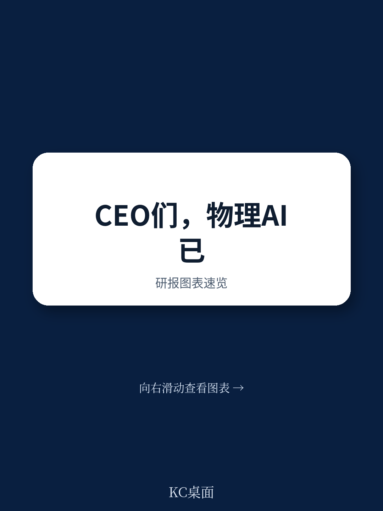
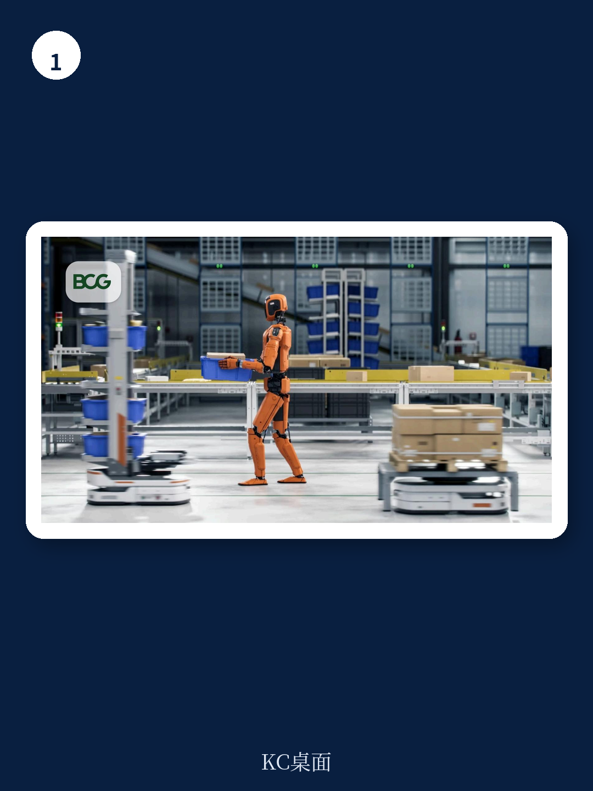

# 波士顿咨询：BCG：Physical AI的回报周期已从5-7年缩至1-3年，CEO们还在等什么？

当波士顿咨询（BCG）在一份面向CEO的指南中写下“50%可自动化工作范围扩大、工程时间减少70%、投资回报周期从5-7年缩短到1-3年”这三个数字时，它传递的信号绝不仅仅是技术进步。它意味着，物理AI（Physical AI）正在跨越一个关键的临界点——从“值得关注”到“必须行动”。

过去五年，多数产业决策者对工业自动化的认知还停留在“昂贵、僵化、只适合大规模重复生产”的传统机器人时代。但BCG这份报告的核心主张是：由于计算机视觉、虚拟训练环境和软件定义架构的突破，机器人正在变得“能看、能适应、能实时调整”。这直接降低了部署的复杂度和成本，也提高了不行动的机会成本。

对于任何管理着制造、仓储、物流或任何涉及物理操作流程的决策者而言，这不再是一个“要不要拥抱未来”的问题，而是一个“如何在对手之前完成系统重构”的问题。

## 1. 这轮变化真正考验的是企业能否把规模转化为议价权

BCG报告中最具冲击力的数字不是技术参数的提升，而是经济模型的改变。传统机器人投资回报周期通常在5到7年，而物理AI已将这一周期压缩至1到3年。这意味着，一个决定是否部署物理AI的决策，其财务影响在CEO的常规任期之内就会显现。

更关键的是成本结构的重构。报告指出，传统机器人约75%的成本来自系统集成、安装和工程调试。而软件定义的物理AI可以将这部分成本削减超过一半。这个数字背后是一个根本性的转变：自动化不再只是资本密集型巨头的游戏，那些能够快速决策、灵活试错的中型企业，也获得了参与竞争的资格。

> **KC评论：** 1-3年的回报周期意味着，即使一家企业现在才开始规划物理AI部署，在大多数CEO的三年任期考核期内，这笔投资已经可以回本并产生净收益。这不再是“为未来投资”的故事，而是“当下必须做的财务决策”。完整报告中对不同行业、不同规模企业的回报周期拆解，以及具体的成本构成图表，是决定你所在行业是否应该立即行动的关键参考。

## 2. 四个能力象限决定了哪些自动化现在就能做，哪些还要等

BCG将物理AI的能力拆解为四个层级：视觉感知、灵巧操作、工作流规划、推理能力。这种分类不是为了学术讨论，而是为了帮助CEO回答一个最实际的问题：哪些自动化现在就能落地，哪些还要再等几年？

报告明确指出，视觉感知已经进入可部署阶段，灵巧操作虽然可用但需要大量任务特定训练，工作流规划仍在开发中，而推理能力——即机器人能理解自身行为对环境的影响并据此选择路径——是“人形消费机器人”的终极目标，目前仍遥不可及。

这意味着，最现实的部署路径是从“看得见、拿得稳”的任务开始，而不是追逐科幻电影中全能人形机器人的幻象。那些声称能一步到位解决所有问题的供应商，其承诺与当前技术现实之间存在显著差距。

## 3. 机器人工厂永远不需要关灯，但改造现有工厂的技术尚未完全到位

BCG报告中对“设计为机器人而建的工厂”与“改造人类工作空间”的区分，是一个值得反复咀嚼的洞察。报告指出，为机器人设计的工厂可以“永不关闭”，而目前大多数公司所做的只是对人类工作空间的改造。

这个区分的含义远比表面上看到的更深远。如果一家企业只是在现有产线上加装机器人，它获得的效率提升是线性的。但如果它从零开始设计一个以机器人为核心的工厂，就有可能获得指数级的效率跃迁——因为整个流程的布局、物料流、信息流都可以为机器人的能力量身定制。

然而，报告也坦率地承认，“在某些情况下，实现机器人就绪工厂所需的技术可能尚未面世。”这意味着，CEO们需要同时推进两条线：一条是对现有流程进行“可逆改造”，通过局部部署积累经验和数据；另一条是持续追踪前沿技术，准备在关键节点到来时率先切换。

> **KC评论：** 这告诉我们，物理AI的部署不是一个“一次性项目”，而是一个“迭代学习的过程”。那些现在就开始改造的企业，即使初期效果有限，也在积累宝贵的运营数据和人才经验。这些“软资产”在技术成熟时，将成为难以复制的竞争壁垒。完整报告中对“改造型”与“新建型”两种路径的ROI对比模型，以及不同行业的最佳实践案例，值得每一位正在制定自动化路线图的读者深入研究。

## 4. 先想清楚技术架构再找供应商，否则你会被供应商的路线图绑架

BCG在Move #3中给出了一个看似反直觉的建议：在接触任何供应商之前，先规划好自己的技术架构。理由是，如果没有清晰的架构蓝图，企业很容易被供应商的优先级和产品路线图牵着走，最终得到的是一个服务于供应商利益而非企业需求的解决方案。

这个建议背后是物理AI行业当前的一个结构性特征：这是一个快速涌现的新兴产业，技术路线尚未收敛。不同的供应商在硬件、操作系统、仿真训练环境和应用层各有侧重。如果企业没有自己的架构判断，就可能在供应商锁定、数据孤岛和未来扩展性上付出巨大代价。

报告特别强调，供应商更愿意与那些“已经识别出新颖且有价值挑战”的公司合作。这意味着，一个有系统规划的企业，反而更容易吸引到最优秀的供应商资源。这形成了一个正向循环：越早思考架构，越容易获得优质合作，越能加速能力积累。

## 5. 工人最担心的不是被替代，而是不知道自己的角色会如何变化

BCG将劳动力转型列为五大行动之一，但其视角值得关注。报告指出，“不知道自己的角色将如何被影响的工人，会用恐惧来填补这个空白，而这会阻碍采用。”这句话点出了一个常被忽视的管理问题：技术部署的阻力往往不是来自技术本身，而是来自信息不透明导致的心理抗拒。

报告建议CEO们提前沟通角色变化，并且指出这种变化对部分工人来说可能是好消息——从重复性劳动转向更 rewarding 的自动化系统设计和管理工作。这不是空洞的安抚，而是基于一个现实：现有的工人已经理解企业的具体需求和流程，他们比外部人才更适合转型为机器人监督者。

> **KC评论：** 这里有一个报告没有完全展开的关键问题：当企业需要从“操作工”转型为“系统管理者”时，培训成本和时间周期是多少？哪些岗位的转型难度最低，哪些最高？这些细节直接影响着劳动力转型计划的可行性和时间表。完整报告中对不同岗位类型的转型路径分析，以及多家企业的实际案例，是制定人力资源规划时不可或缺的参考。

## 6. 网络安全风险正在从IT部门蔓延到物理世界，供应商管理成为新战场

BCG在Move #5中强调了一个容易被低估的风险：当机器变得更加自主、智能和互联时，它们会成为黑客和其他恶意行为者的“肥美目标”。这不仅仅是IT部门的问题，而是CEO级别的治理问题。

报告特别指出，网络安全风险会延伸到第三方供应商。随着供应链中增加更多第三方，它也引入了潜在的新攻击入口。这意味着，一家企业的物理AI安全水平，不仅取决于自身的防护能力，还取决于其供应商的安全意识和管理水平。

这个提醒在当前的地缘政治和供应链安全环境下尤为重要。对于那些正在考虑引入海外物理AI供应商的企业，供应商的网络安全标准、数据本地化策略以及应急响应能力，应该成为选型决策的核心维度之一，而不是事后才考虑的附加项。

## 行动框架：从“要不要做”转向“从哪里开始”

BCG这份报告的价值，不在于它描绘了一个多么宏大的未来，而在于它为CEO们提供了一个清晰的行动框架。五个行动步骤——评估运营低效点、整体思考流程再造、明确技术架构、规划劳动力转型、建立治理体系——构成了一个从认知到落地的完整闭环。

报告没有回避技术的不确定性。它坦率承认推理能力仍遥不可及，承认某些机器人工厂所需的技术尚未就绪，承认灵巧操作仍需大量训练。但这种坦诚反而增强了报告的可信度：它不是在推销一个完美的未来，而是在帮助决策者在不确定中找到确定的行动路径。

对于那些正在犹豫的CEO，BCG给出了一个明确的信号：物理AI的回报周期已经缩短到1-3年，而站在不动的成本正在快速上升。现在的问题已经不是“要不要做”，而是“从哪里开始，以及如何做得比别人更快、更系统”。

---

这份BCG报告只有5分钟阅读时长，但它涵盖的行业影响、竞争格局变化和具体行动指南，远不止于此。我们每天由AI agent与人工审核，从国际投行最新研报中提取核心判断与关键数据，生成约10-40页的中文摘要与KC评论，既方便喂给AI模型，也方便人工快速把握市场动态。如果你想获取这份报告的中文完整解读、原始图表，以及每日更新的国际投行摘要合集，欢迎加入我们的社群，与产业决策者一起持续追踪物理AI与自动化的最新趋势。

Personal reading notes and learning share only. Not investment advice.

