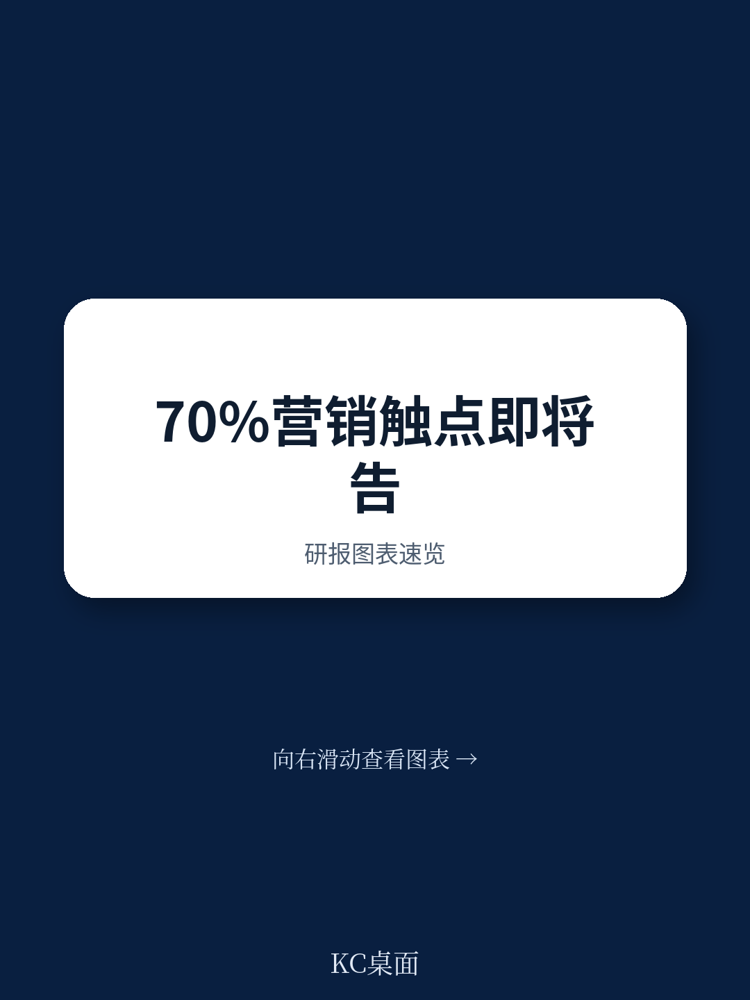

# 波士顿咨询：营销战役的终结，不是营销的终结

当一家咨询公司用“终结”这个词来定义一场变革，它不是在制造恐慌，而是在划清时代。波士顿咨询（BCG）在2026年7月发布的最新系列报告第四部分中，给出了一个明确且尖锐的判断：以“战役”和“日历”为核心的传统营销组织方式，正在走向终结。取而代之的，是一个由AI代理（Agent）驱动的、以“下一最佳行动”为逻辑的实时决策体系。

这不是一个渐进式的优化，而是一个结构性的替代。BCG的报告指出，在成熟模式下，70%到80%的客户触点将从预定义的营销战役，转向由AI代理从“可组合货架”上实时调取的个性化交互。这意味着，过去二十年里支撑品牌营销大厦的基石——从季度 campaign 规划、长周期创意制作，到层层审批的线性流程——都将被重新定义。

对于正在试图理解AI如何真正重塑商业的决策者来说，这份报告的价值不在于罗列技术趋势，而在于它清晰地拆解了“从哪开始改”和“改成什么样”。它回答了一个所有营销负责人此刻都该追问的问题：如果AI代理已经能自主决策，那我的组织应该做什么，又不该做什么？

## 1. 营销组织的核心单元，必须从“战役”切换为“货架”

BCG报告最核心的洞察，是揭示了两种完全不同的营销组织逻辑。传统模式下，营销工作的基本单元是“战役”。一个战役对应一个目标、一个受众群体、一套创意素材，然后被排上日历，按部就班地执行。这种模式假设所有决策都由人类做出，并通过将客户分群来管理复杂性。

而AI代理驱动的模式，将逻辑完全颠倒。系统不再从“我们要推什么”出发，而是从“这位客户此刻需要什么”出发。营销组织的核心任务，不再是规划下一个战役，而是持续构建、优化和填充一个“可组合货架”。货架上存放的不是完整的战役包，而是模块化的内容、优惠、体验片段。AI代理的任务，是根据实时客户上下文，从货架上挑选并组装出最合适的行动。

> **KC评论：** 这个转变的本质，是从“推”到“拉”的范式转换。传统营销是品牌把产品推向市场，而新模式下，系统根据客户信号“拉取”最合适的响应。你的组织是否已经准备好，把80%的精力从“想点子、做素材、排档期”转移到“设计货架、定义规则、监督代理”上？BCG报告里详细拆解了货架应该包含哪些模块，以及如何用“目标函数”来指导代理的挑选逻辑，这部分在完整报告中用图表做了清晰的展示。

## 2. 执行价值链必须重构，从60天到数小时的压缩并非科幻

报告明确指出，大多数大型企业的线性营销构建流程需要60到90天，涉及20人以上的多轮交接，最终只产出一套有限变体的战役素材。这个节奏和产出量，与AI时代实时、超个性化的需求完全脱节。

BCG提出的解决方案，是将执行价值链围绕“人类+AI代理”的配对进行重塑。这不是简单的自动化，而是对每个环节的重新设计。例如，一个“简报代理”可以综合分析过往表现和市场信号，在几小时内生成一份包含测试计划、目标标准和创意假设的草稿，而人类营销人员的工作从“从头撰写”变为“审核与精炼”。法律合规审查从串行关卡变为实时伴行。创意制作从数周压缩到数天。

报告引用的早期成果令人印象深刻：采用该模式的组织，周期缩短高达80%，内容产出实现指数级增长，而运营团队规模可缩减60%。更重要的是，那些被保留下来的角色——策略、策展、治理、持续学习——其价值反而被放大。

> **KC评论：** 这里最容易被忽视的是“持续学习循环”。BCG强调，这不是一个一次性的流程改造，而是一个必须内化为核心运营纪律的机制。你的营销团队是否建立了“设计实验-读取结果-反馈至货架”的闭环？如果没有，那么即使引入了AI工具，也只是用更快的速度重复错误。完整报告用一个零售银行副总裁的“一天”案例，生动展示了这个闭环如何在实际工作中运转。

## 3. 真正的治理挑战，是如何防止AI代理“过度优化”

当AI代理能够自主决策，一个关键问题浮出水面：谁来确保这些决策符合公司的整体战略，而不是某个单一产品线或短期KPI的最大化？

BCG将此问题提升到“企业决策治理”的高度。报告警告，如果缺乏跨企业的治理框架，每个产品线都把自己的优先级喂给系统，结果就是产品中心式的竞争，而非以客户为中心的协同。AI代理可能会过度推销某个利润率最高的产品，或为了短期转化率而牺牲客户终身价值。

治理框架需要承担两个核心职责。第一，定义并持续校准企业的“目标函数”——即决定系统应该优化什么的KPI层级、权重和估值。第二，建立跨企业的协调机制，确保所有代理（营销、服务、销售等）都在同一套规则下运作。这套规则包括客户接触频率上限、渠道偏好、品牌标准，以及当多个选项竞争同一客户时的优先级逻辑。

> **KC评论：** 这是整份报告最“反直觉”也最务实的部分。很多企业以为引入AI是为了更快决策，但BCG指出，真正决定成败的，是你给AI设定的“边界”。治理不是束缚，而是信任的前提。报告特别区分了“高频低风险”决策可由代理自主执行，而“发现货架空白”“检测目标函数需调整”“高价值客户互动”这三种情况，则必须提交人类审批。这个边界如何划定，是每个组织都绕不开的核心设计问题。

## 4. 报告尚未完全回答的关键问题：如何衡量这套系统的真正回报？

BCG坦承，这是一个五部分系列报告，而关于“衡量”的第五部分，尚未在本篇中展开。这恰恰是目前最让决策者困惑的领域。

传统营销的衡量框架——战役归因、渠道ROI、点击率——在AI代理实时、跨渠道、跨产品组合决策的新世界里，几乎完全失效。当一个客户在30秒内经历了由不同代理发起的邮件、推送和短信的连续交互，你如何判断是哪个动作真正促成了转化？当系统持续通过实验“学习”，你如何区分短期噪音和长期趋势？

报告提到“20%到40%的客户参与度和转化率提升”，以及“复合效应”——每一次触点和实验都让系统变得更聪明。但如何量化这个“复合效应”，如何建立一套与代理决策逻辑相匹配的归因模型，仍是悬而未决的挑战。这可能是整个转型中最需要独立判断和定制化设计的部分。

## 5. 决策者的观察框架：从三个维度评估你的组织是否准备好

基于BCG的分析，营销决策者可以从以下三个维度，快速评估自己的组织距离“代理原生”模式有多远，以及应该从何处入手。

第一，货架思维。你的团队是否已经将工作重心从“完成下一个战役”转移到“构建可复用的内容、优惠和体验组件”？是否有明确的机制来持续评估货架上哪些资产正在产生价值，哪些需要淘汰？

第二，流程闭环。从策略到内容到审批到投放，你的执行链条中，有多少环节是可以通过“人类+AI代理”的配对来加速的？你是否已经为“持续学习循环”设定了明确的节奏和责任归属？

第三，治理边界。你的企业是否已经建立了跨产品线的决策治理框架？是否明确界定了AI代理的自主决策范围，以及哪些战略决策必须保留给人类？目标函数是否被定期校准，以反映不断变化的业务优先级？

这三个维度，决定了你的组织是能驾驭这场变革，还是被它裹挟。

---

BCG的这份报告，本质上是在宣告一个时代的结束，并描绘另一个时代的轮廓。它没有给出所有答案——尤其是关于衡量和规模化挑战的部分，仍需要企业在实践中摸索。但它的价值在于，提供了一个清晰的、可执行的转型路线图：从战役到货架，从线性流程到人机协作，从产品中心治理到客户中心治理。

这些未解的问题，恰恰是接下来最值得深入探讨的方向。例如，当AI代理的决策速度远超人类监管的周期，治理框架如何保持实时有效？当货架上的资产数量从几十个增长到几万个，人类如何在不失去控制的前提下，保持对创意质量的判断力？

这些问题的答案，不会来自任何单一报告，而是来自那些敢于率先行动的组织的实践。我们每天都会通过AI agent和人工review，持续追踪包括BCG在内的国际顶级投行和咨询机构的最新报告，将其转化为10-40页的中文摘要与KC评论，并附上当天最新的数据图表合集。这份材料既方便喂给AI进行二次分析，也方便你快速把握全球市场的动态与洞见。如果你对上述任何一个未解问题有自己的思考，或者想获取包含完整图表和更详细拆解的原始报告解读，欢迎加入我们的社群，与同行者一起，把这场变革的方向盘握在自己手中。

Personal reading notes and learning share only. Not investment advice.

