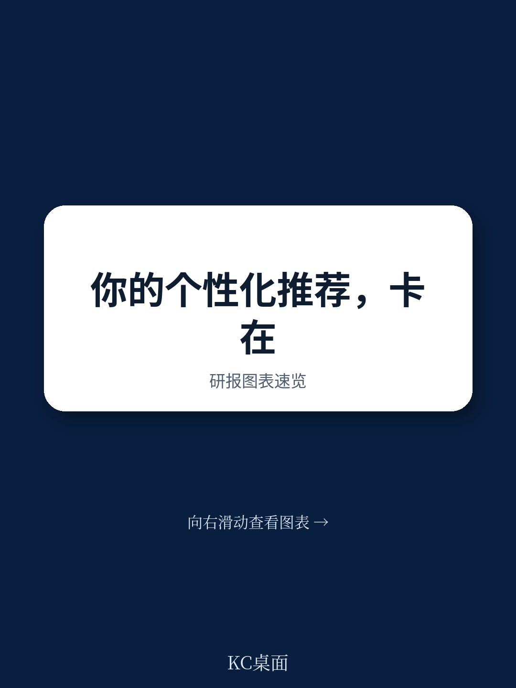

# 波士顿咨询：下一代个性化决策，关键不在算法而在组织架构

当一家信用卡发卡机构用传统模型筛选出“高余额、长 tenure”的客户来推送余额转账优惠时，一个被历史数据掩盖的真相浮出水面：新激活的中等余额客户，配合特定创意素材，响应率反而更高。这个发现，不是分析师做出来的，而是“上下文老虎机”自己探索出来的。

这份波士顿咨询（BCG）最新发布的系列报告第三部分，给出了一个对技术和商业决策者都极具冲击力的判断：下一代“最优下一步行动”（NBA）系统的科学基础已经就绪，但绝大多数企业连第一层都没用好。真正的瓶颈不是算法，而是组织架构和人才储备。

BCG 将 NBA 的决策科学分为三个层次：倾向性与 uplift 评分、上下文老虎机、以及基于基础模型的智能体推理。这三个层次不是递进关系，而是叠加关系。最有效的系统需要同时运行所有三层。但现实是，绝大多数企业连第一层都没有做到位。

> **KC评论：** 这份报告最值得读的部分，不是它描述了多么前沿的技术，而是它给出了一个非常务实的判断：先把自己的第一层做好，再谈升级。很多企业连“倾向性模型”和“uplift 模型”的区别都没搞清楚，就急着上大模型，这恰恰是 BCG 要纠正的误区。完整报告里有一张图清晰地展示了每一层能做什么、不能做什么，值得仔细看。

## 1. 第一层不是“能做就行”，而是“先做对”：20%到40%的营销预算正在被浪费

BCG 毫不客气地指出，大多数企业目前停留在第一层——倾向性与 uplift 评分。但即便在这一层，也存在着结构性的缺陷。

倾向性模型回答“这个客户有多大概率响应”，但回答不了“这个动作是否改变了客户的行为”。一个90%倾向性购买的人，可能本来就要买。如果此时推送折扣，等于白白牺牲利润。BCG 给出的数字非常具体：从倾向性模型升级到 uplift 模型的企业，通常会发现自己20%到40%的活跃项目几乎没有带来增量提升，只是捕捉了本来就会发生的意图。

这意味着什么？意味着大量营销预算被用于奖励已经决定购买的客户，而不是真正驱动增量转化。

这一层的升级并不需要大模型。它需要的是不同的训练数据（随机对照组或准实验设计）和不同的模型架构（T-learners、S-learners、Doubly Robust Learners）。BCG 的潜台词很清晰：先把自己的基础打牢，再谈升级。

> **KC评论：** 这个发现对于任何有大规模营销预算的企业来说，都是一个直接的 ROI 拷问。完整报告里详细对比了不同 uplift 模型架构的优缺点，以及如何在组织中落地随机对照实验。这些实操细节，文章里只能点到为止。

## 2. 第二层才是真正的“学习系统”：上下文老虎机如何发现人类从未写下的路径

如果说第一层是在已知的选项里做优化，那么第二层——上下文老虎机——则是在探索未知。

BCG 用一个信用卡发卡机构的例子清晰地展示了这一点。倾向性模型基于历史数据，知道高余额长 tenure 的客户响应最好。但上下文老虎机发现了一个历史数据从未揭示的组合：新激活的中等余额客户，在特定的创意素材配合下，响应率反而更高。为什么？因为这些客户正处于活跃评估期。倾向性模型从未探索过这个组合，但老虎机做到了，因为它生来就是为了探索。

关键区别在于“探索-利用”权衡。传统模型总是选择当前最佳猜测，而上下文老虎机会有意地将一部分决策分配给不确定性更高的动作，以学习它们的真实价值。BCG 特别指出，在大多数 NBA 场景中，Thompson 采样优于简单的 epsilon-greedy，因为它能自然适应不确定性：在不确定时多探索，在确信时多利用。

算法选择本身也有讲究。线性上下文老虎机可解释性强、计算效率高，但假设奖励函数是线性的。神经上下文老虎机能捕捉非线性交互，但计算成本更高。BCG 提出了一个务实方案：在批处理层使用神经奖励模型，然后蒸馏成更轻量的线性或树模型用于实时服务。

## 3. 第三层不是替代，而是“补位”：大模型的价值不在生成内容，而在判断

这是报告中关于大模型应用最冷静、最务实的论述。

BCG 明确表示，大模型（基础模型）在决策栈中的价值，不是内容生成，而是处理结构化模型无法触及的非结构化上下文。一个上下文老虎机可以优化成千上万的结构化信号（账户 tenure、交易频率、渠道偏好），但它无法理解客户最后一次服务聊天的语气，无法判断浏览序列是表示困惑还是比价，也无法权衡品牌战役的战略意图。

这些是判断问题，不是优化问题。

大模型智能体可以做到：它能用自然语言推理客户的处境、可用选项和可能结果。BCG 特别强调，第三层不是对第一、二层的替代，而是互补。当组织发现模型决策质量受限于非结构化上下文时，就应该考虑引入第三层。

但 BCG 也给出了一个非常诚实的判断：第一批平台的第三层押注正在出现，但还没有任何供应商能大规模部署完整的愿景。这既是风险，也是机会。

## 4. 真正的工程挑战：双轨架构如何让批处理与实时协同

报告最硬核的部分，是描述让第二层和第三层模型运转起来所需要的生产系统——双轨架构。

批处理优化层运行在24到48小时的节奏上。它的工作是预先计算策略、更新模型参数、解决组合层面的优化问题。这是系统回答战略问题的地方：“在当前货架组成、客户分布和业务约束下，如何在整个人群中最优地分配动作？”

BCG 特别点出了一个被忽视的环节：组合优化。如果没有组合层面的优化，实时层会为每个客户分配最佳动作，导致高价值优惠很快被易转化客户消耗殆尽，而更难触达的客户则被忽略。

实时服务层则在客户交互时刻运行，延迟通常低于100毫秒。它接收批处理层预先计算的策略和参数，并根据实时上下文进行调整。一个客户在批处理层被分配了“展示余额转账优惠”，但如果实时层检测到该客户刚刚完成了一次令人沮丧的客服交互，可能会改为推送服务补救信息。

BCG 的警告非常明确：试图构建纯实时系统而没有批处理优化的组织，会发现每个客户的局部最优决策无法转化为连贯的组合级策略。但只依赖批处理的组织，则会错过驱动最高增量价值的实时上下文。

> **KC评论：** 这是整份报告里对工程团队最具操作指导意义的部分。完整报告包含了一张清晰的架构图，展示了批处理层和实时层的具体分工、不同模型类型的部署位置，以及数据流动的路径。对于正在搭建或重构个性化系统的团队来说，这张图本身就是价值。

## 5. 报告没有完全回答的关键问题：冷启动与组织变革的节奏

BCG 承认了冷启动问题的存在。当新动作、新客户群或新上下文出现时，系统没有历史数据可以参考。报告中提到了一个优雅的解决方案：大模型提供推理后的“先验”，老虎机以此为起点进行受控探索。但这里有一个没有完全展开的问题——先验的质量如何保证？大模型的推理是否会引入偏差？

另一个未解问题是组织变革的节奏。BCG 在结尾明确指出，大多数营销分析团队不具备强化学习或老虎机优化的能力。大多数组织还没有构建起双轨架构。技术领导者现在开始建设基础设施，才能在未来领先。但“现在开始”到底意味着什么？是6个月、12个月还是24个月？不同规模、不同行业的企业，起点差异巨大。

这些正是完整报告后续部分要回答的。第四部分讨论营销组织如何围绕新运营模式进行重构，第五部分则从战役级归因转向智能体级测量。对于决策者来说，这些才是真正的落地指南。

---

**顺着这些未解问题继续往下读。**

完整报告（Part 1-3）包含了BCG对NBA系统四层结构性缺口的诊断、从人工编排到智能体编排的转变路径、双轨架构的详细设计图、以及不同算法选择的对比分析。我们的社群每天会由AI agent加人工review，生成国际投行与顶级咨询公司最新报告的中文摘要与KC评论，每日更新，约10-40页，包含当天最新数据图表合集。既方便喂给AI做二次分析，也方便人工快速把握市场动态。

如果你正在构建下一代个性化系统，或者正在评估大模型在营销场景中的真实价值，这份BCG系列报告值得完整阅读。

Personal reading notes and learning share only. Not investment advice.

