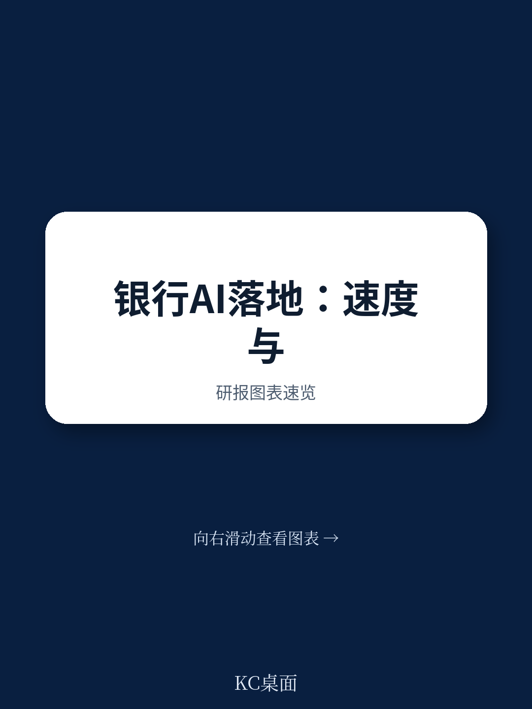

# 麦肯锡：银行对AI的“谨慎”正在变成一种竞争劣势

银行对生成式AI的拥抱，看似热烈，实则克制。麦肯锡与IACPM联合对44家全球金融机构的最新调研揭示了一个反直觉的结论：大多数银行在信贷业务中的AI部署，正卡在“试点”与“规模”之间的无人区。这份报告的核心判断是——银行面临的真正挑战，不是技术成熟度，而是组织在战略层面将AI从“效率工具”升级为“竞争杠杆”的意愿和能力。

## 1. 过半银行已将其列为优先级，但行动却停留在“尝试”阶段

调研显示，52%的金融机构已将生成式AI的采用列为首要任务，高层通过投资和招聘明确表达了对这一方向的承诺。这一数字本身并不令人意外。真正值得关注的是，即便有了顶层意志，实际落地进展依然缓慢。

报告将银行对AI的应用能力归纳为三类：摘要能力、内容生成能力和客户交互能力。目前，大多数机构的进展集中在“摘要”这一相对低风险的领域——例如早期预警系统和信贷决策支持。只有少数大型机构开始触及更复杂的工作流改造。

这种“高优先级、低执行力”的矛盾，反映出银行在AI战略上的结构性困境。高层喊话与一线落地之间，缺少一个能将战略意图转化为系统化行动的中层架构。

> **KC评论：** 银行不是不想用AI，而是不知道怎么用。这恰恰是麦肯锡报告的洞察价值所在——它把“为什么卡住”拆解成了可诊断的问题：是缺技能、缺框架，还是缺对复杂工作流重构的勇气？完整报告中有更细的用例分级和机构类型对比，值得读者仔细对照自身情况。

## 2. 区域银行反而领先于大型银行，这背后是组织灵活性的胜利

一个反直觉的数据是：在AI用例部署数量上，核心区域银行（资产1000-5000亿美元）居然领先于超大型银行。这打破了“越大越先进”的常规认知。

原因并不复杂。大型银行尽管资源充沛，但组织层级复杂、审批链条长、风险厌恶程度高，导致AI试点难以快速规模化。区域银行则相对灵活，决策链条短，试错成本低，反而能在特定场景中更快落地。

这是一个典型的“创新者窘境”在金融业的翻版。当技术变革需要组织变革配套时，体量本身可能成为阻力。麦肯锡报告虽然没有明说，但数据暗示了一个值得深思的方向：AI时代的竞争优势，可能更多来自组织的适应速度，而非资产规模。

## 3. “ROI不是首要考虑”背后，是银行对AI价值的认知盲区

调研中一个耐人寻味的发现是：半数受访机构并不将ROI视为AI用例优先级的核心考量。报告给出的解释是“早期难以量化财务影响”，但这可能掩盖了更深层的问题。

当机构无法量化AI的价值时，它们往往会陷入两种极端：要么过度乐观，将所有资源押注于少数“明星项目”；要么过度保守，让AI停留在“锦上添花”的边缘角色。真正的风险在于，这种模糊状态会让银行既无法做出果断投入，也无法及时止损。

报告也提到，那些过早强调ROI的机构，反而更容易在受挫后放弃；而那些坚持推进的机构，开始看到成效。这揭示了AI部署的一个关键规律：价值兑现往往需要经历一段“信任积累期”，在此之前，单纯的财务指标可能会误导决策。

> **KC评论：** 这其实是一个很实用的提醒。对于银行决策者来说，与其纠结“AI能省多少钱”，不如先问“AI能否帮我做出更好的信贷决策”。后者的价值一旦被验证，ROI自然浮现。完整报告中对不同规模银行的用例优先级排序，给出了具体的参照框架。

## 4. 模型验证和幻觉问题：卡住银行的不只是技术，更是治理框架

41%的受访者将“模型验证问题”列为AI部署的主要障碍。这并非纯粹的工程难题，而是银行在AI治理上的系统性缺失。

传统金融模型有完整的历史数据可供回测，有明确的监管标准可供参照。但生成式AI的输出具有概率性和不可重复性，现有的验证框架几乎无法适用。当信贷决策需要接近100%的准确性时，模型幻觉就成了难以容忍的风险。

报告指出，缺乏历史数据来评估模型性能，是验证困难的核心原因。这意味着，银行可能需要接受一种“新的验证范式”——从追求绝对准确，转向容忍可控误差、建立快速反馈和纠错机制。这不是技术妥协，而是治理思维的升级。

## 5. 报告尚未完全回答的关键问题：AI风险治理的“成本边界”在哪里

麦肯锡在报告中提出了一个全面的AI风险治理框架，涵盖数据安全、模型偏差、合规监管等多个维度，并引入了“设计师、工程师、治理者、用户”四大人设的操作模型。这套框架在逻辑上非常完备，但有一个关键问题没有充分展开：治理的成本边界在哪里。

如果每一层治理都要求“充分控制”，AI的部署成本和速度将受到严重制约。银行需要在风险容忍度与创新速度之间找到动态平衡点。报告提到了“基础设施层控制”和“基于代理原型的标准化控制”，但并未给出具体的成本-收益评估方法。这将是未来银行AI落地中必须面对的实践难题。

## 6. 给读者的观察框架：从“有无AI”转向“AI如何改变竞争结构”

阅读这份报告，最值得建立的思维框架不是“哪些银行在用AI”，而是“AI正在如何重塑信贷业务的价值链”。

麦肯锡的调研数据揭示了三个结构性变化：第一，AI正在将信贷决策从“经验驱动”转向“数据+模型驱动”，这意味着信审人员的角色将从判断者变为验证者；第二，AI在客户交互端的应用，正在改变关系经理的工作方式，从“个人关系维护”转向“数据辅助的精准服务”；第三，AI在早期预警系统中的应用，可能从根本上改变信用风险管理的时效性和预测能力。

这些变化不是线性的效率提升，而是对银行传统竞争优势——客户关系、信贷经验、风险判断——的重新定义。那些能够快速适应这种变化的机构，将在下一轮竞争中占据先机。

---

这份报告的核心价值，不在于给出了“AI在银行信贷中如何应用”的清单，而在于揭示了“为什么大多数银行还停留在试点阶段”的系统性原因。对于那些正在制定AI战略的金融机构决策者来说，读懂这份报告，比盲目追赶技术潮流更重要。

报告中的图表数据、不同规模银行的用例分布、以及AI治理的具体操作框架，都值得仔细研读。但更重要的是，报告留下了一个开放性问题：当AI从“工具”变成“基础设施”，银行的组织形态、人才结构和风险文化，需要做多大的调整？

如果你正在思考AI如何重塑你所在机构的竞争力，或者希望看到麦肯锡报告中那些未能完全展开的细分数据——比如不同地区银行的AI采用差异、具体用例的ROI测算框架、以及AI治理的最佳实践案例——欢迎加入我们的社群。这里每天由AI agent结合人工review，推送全球顶级投行和咨询机构的中文精华摘要，约10-40页，涵盖当天最新数据图表和深度解读。既适合喂给AI做二次分析，也适合决策者在15分钟内把握市场核心动态。我们在社群里继续讨论这些未解的问题。

Personal reading notes and learning share only. Not investment advice.

