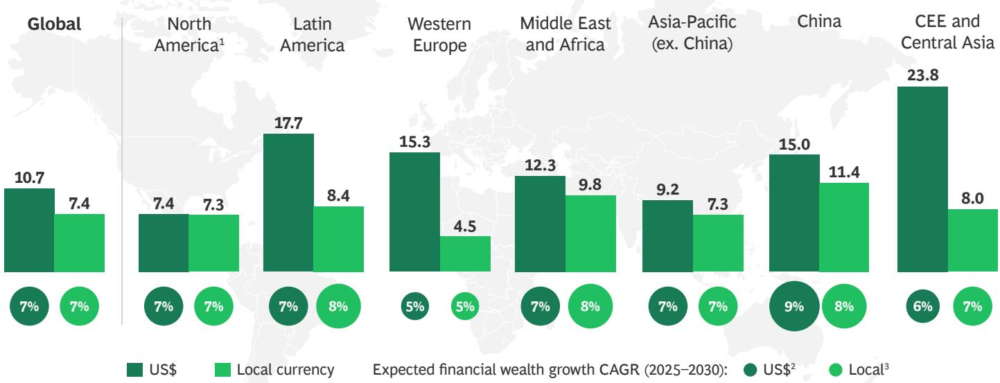
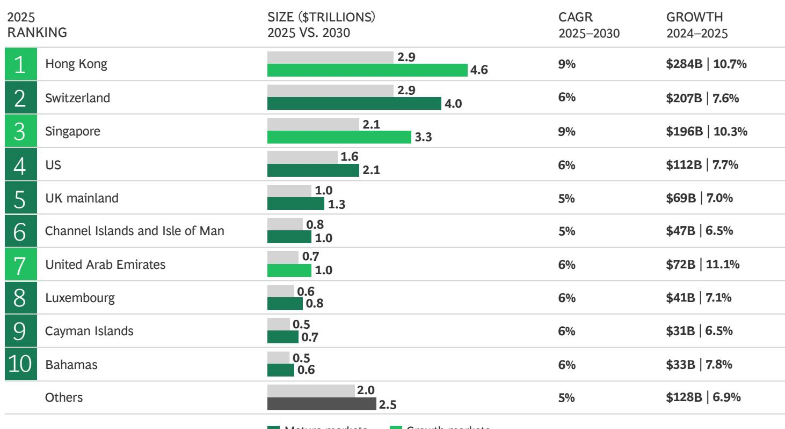
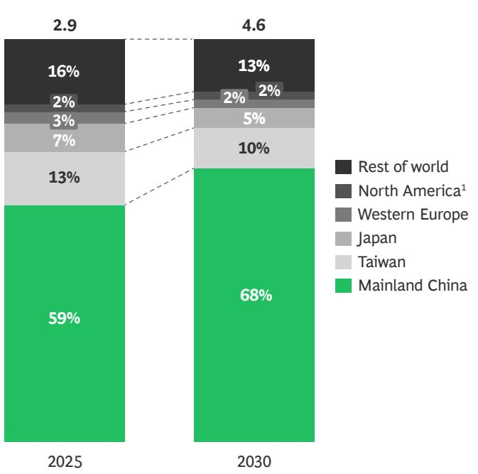
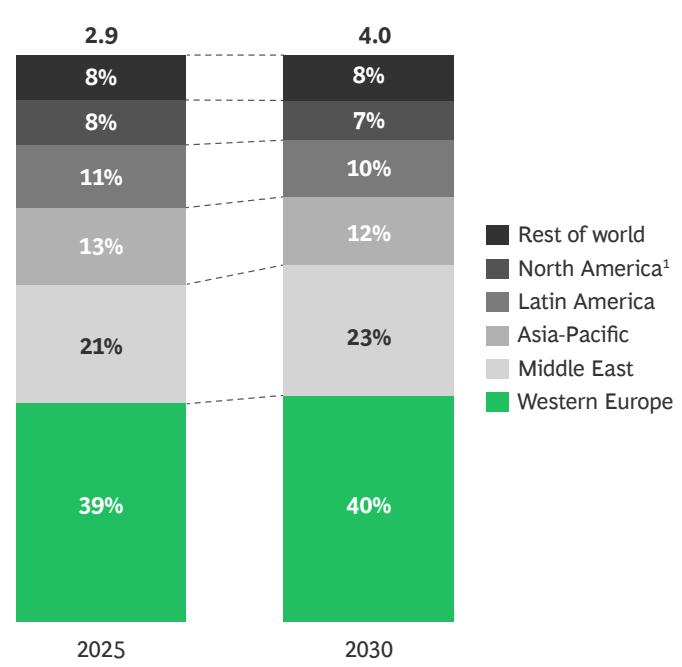
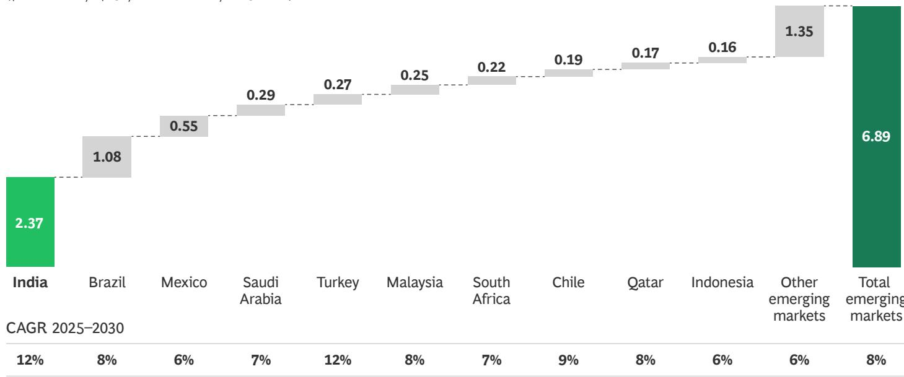
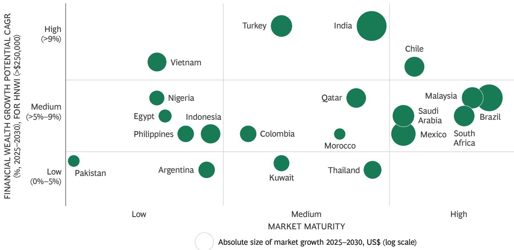
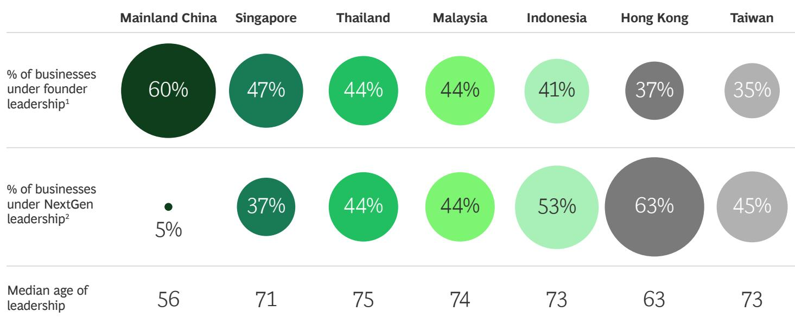
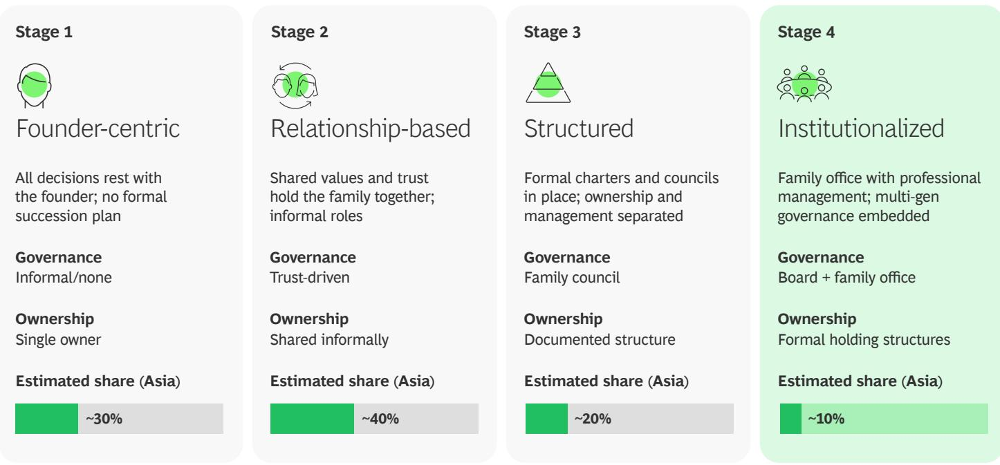
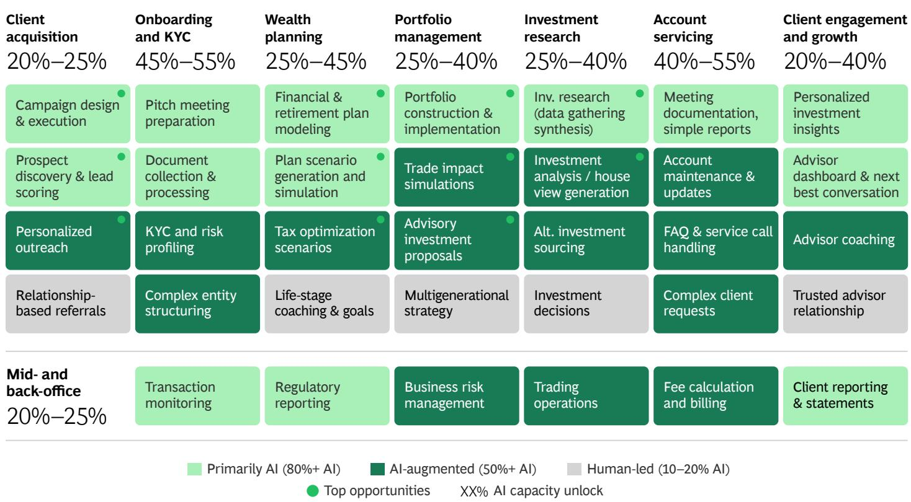

FINANCIAL INSTITUTIONS
GLOBAL WEALTH REPORT 2026
26TH EDITION

# The Great Reordering

May 2026

By Michael Kahlich, Daniel Kessler, Akin Soysal, Peter Czerepak, Renaud Fages, Dean Frankle, Mayank Jha, Wei Chuan Lim, Michael Boardman, Yves Robert-Charrue, Gloria Ong, Sam Kittross-Schnell, Omar Rahman, Felix Werner, and Nisha Mittal

Foreword

# Global financial wealth grew at its fastest level since 2021. But where wealth is growing, who holds it, and what it will take to serve clients well are changing rapidly.

This report examines four dimensions of that change. The first is geographic. Wealth creation continues to concentrate in a smaller number of regions and booking centers. Two hubs increasingly capture the bulk of cross-border flows. Firms that credibly straddle both clusters will command a structural advantage.

The second is the emerging market opportunity. Not counting China, roughly 10% of global financial wealth growth through 2030 will come from emerging markets, led by India, Brazil, and Mexico. The affluent and emerging high-net-worth (HNW) segment in these markets is among the least well served in the industry. Retail and corporate banks have the relationships and distribution reach to capture this opportunity but will need to change how they operate to do so.

The third is generational. Asia's first large-scale intergenerational wealth transfer is already underway, and the decisions families make in the coming decade about governance, leadership, ownership, and purpose will determine what gets passed on and how. Wealth managers that help families navigate the complexities of this transition will define the next era of the industry in the region.

The fourth is technological. AI is already drafting financial plans, automating compliance workflows, predicting client churn, and executing complex processes with minimal human intervention. The question now is whether firms are building around it or simply layering generative tools and agents onto existing processes. The difference between those two approaches will widen quickly.

Some of these topics have bearing on specific markets and segments. Together they show that wealth management is entering a period of immense change. The tools available to serve clients are being transformed. And the competitive positions that firms have taken for granted are under pressure in ways that were not visible even two years ago.

The four shifts this report describes are already influencing growth, profitability, and competitive position across the industry. Our hope is that senior leaders use it to take a hard look at where their firm is leading, where it is exposed, and whether its current pace of change is sufficient for what the market now demands.

## Contents

04 The Great Reshuffling of Financial Wealth

11 Where the Next Wave of Wealth Is Coming From

16 The Succession Reckoning

20 AI and the New Economics of

Wealth Management

24 About the Authors

# The Great Reshuffling of Financial Wealth

Against a backdrop of trade wars, tariff brinkmanship, and escalating geopolitical tension, global financial wealth rose 10.7% to \$333 trillion in 2025.

This is up 2 percentage points over the prior year—the highest rate of growth since 2021. (See Exhibit 1.) Including real assets, net wealth reached \$550 trillion, up 9.3%.

The gains were not evenly distributed. Equities surged 13.2% while real assets expanded 7.4%, pinched by high prices and rising supply in major developed markets. Gold was the standout, rising roughly 44%, driven by robust retail buying and a wave of central bank accumulation that reflects deepening unease about reserve currency stability.

Financial wealth is projected to grow at a 7% compound annual rate through 2030, though the pace of gains assumes an easing of geopolitical tensions and energy disruptions in the second half of 2026.

# Financial Wealth Rose 10.7% Globally, with Wide Variation Across Regions

FINANCIAL WEALTH GROWTH. 2024–2025 (%)

  
FINANCIAL WEALTH GROWTH (IN \$TRILLIONS) $^{2}$

<table><tr><td>Global</td><td></td><td>2024</td><td>2025</td><td>2030</td><td>Growth&#x27;24-&#x27;25</td><td>CAGR&#x27;25-&#x27;30</td></tr><tr><td rowspan="4">+32T</td><td>Financial assets</td><td>300.5</td><td>332.7</td><td>457.1</td><td>10.7%</td><td>7%</td></tr><tr><td>Liabilities</td><td>59.8</td><td>64.4</td><td>78.7</td><td>7.7%</td><td>4%</td></tr><tr><td>Real assets</td><td>261.9</td><td>281.3</td><td>335.2</td><td>7.4%</td><td>4%</td></tr><tr><td>Net wealth</td><td>502.6</td><td>549.6</td><td>713.6</td><td>9.3%</td><td>5%</td></tr></table>

Western Europe

<table><tr><td colspan="2">North America</td><td>2024</td><td>2025</td><td>2030</td><td>Growth&#x27;24–&#x27;25</td><td>CAGR&#x27;25–&#x27;30</td></tr><tr><td rowspan="4">+10.8T</td><td>Financial assets</td><td>145.1</td><td>155.9</td><td>214.3</td><td>7.4%</td><td>7%</td></tr><tr><td>Liabilities</td><td>22.2</td><td>23.0</td><td>28.4</td><td>3.4%</td><td>4%</td></tr><tr><td>Real assets</td><td>67.0</td><td>69.0</td><td>83.6</td><td>3.1%</td><td>4%</td></tr><tr><td>Net wealth</td><td>189.9</td><td>202.0</td><td>269.5</td><td>6.4%</td><td>6%</td></tr></table>

<table><tr><td rowspan="4">+8.3T</td><td>Financial assets</td><td>54.4</td><td>62.7</td><td>79.6</td><td>15.3%</td><td>5%</td></tr><tr><td>Liabilities</td><td>12.9</td><td>14.7</td><td>17.6</td><td>13.7%</td><td>4%</td></tr><tr><td>Real assets</td><td>62.6</td><td>70.6</td><td>81.7</td><td>12.8%</td><td>3%</td></tr><tr><td>Net wealth</td><td>104.1</td><td>118.6</td><td>143.7</td><td>14.0%</td><td>4%</td></tr></table>

CEE and Central Asia

<table><tr><td rowspan="4">+1.3T</td><td>Financial assets</td><td>5.3</td><td>6.6</td><td>8.6</td><td>23.8%</td><td>6%</td></tr><tr><td>Liabilities</td><td>1.0</td><td>1.3</td><td>1.6</td><td>26.5%</td><td>4%</td></tr><tr><td>Real assets</td><td>8.1</td><td>10.2</td><td>13.3</td><td>26.1%</td><td>5%</td></tr><tr><td>Net wealth</td><td>12.4</td><td>15.5</td><td>20.3</td><td>25.1%</td><td>6%</td></tr></table>

Latin America

<table><tr><td rowspan="4">+5.4T</td><td>Financial assets</td><td>36.1</td><td>41.5</td><td>62.8</td><td>15.0%</td><td>9%</td></tr><tr><td>Liabilities</td><td>11.3</td><td>12.0</td><td>13.2</td><td>6.0%</td><td>2%</td></tr><tr><td>Real assets</td><td>51.8</td><td>54.2</td><td>58.8</td><td>4.7%</td><td>2%</td></tr><tr><td>Net wealth</td><td>76.5</td><td>83.7</td><td>108.4</td><td>9.4%</td><td>5%</td></tr></table>

<table><tr><td rowspan="4">+1.3T</td><td>Financial assets</td><td>7.4</td><td>8.7</td><td>12.0</td><td>17.7%</td><td>7%</td></tr><tr><td>Liabilities</td><td>1.5</td><td>1.8</td><td>2.7</td><td>20.3%</td><td>8%</td></tr><tr><td>Real assets</td><td>10.1</td><td>11.6</td><td>14.3</td><td>14.2%</td><td>4%</td></tr><tr><td>Net wealth</td><td>16.0</td><td>18.5</td><td>23.6</td><td>15.2%</td><td>5%</td></tr></table>

Middle East and Africa

<table><tr><td rowspan="4">+1.0T</td><td>Financial assets</td><td>8.2</td><td>9.2</td><td>13.1</td><td>12.3%</td><td>7%</td></tr><tr><td>Liabilities</td><td>1.4</td><td>1.6</td><td>2.3</td><td>11.4%</td><td>7%</td></tr><tr><td>Real assets</td><td>11.3</td><td>12.1</td><td>15.9</td><td>6.9%</td><td>6%</td></tr><tr><td>Net wealth</td><td>18.1</td><td>19.7</td><td>26.7</td><td>9.0%</td><td>6%</td></tr></table>

Asia-Pacific (ex. China)

<table><tr><td rowspan="4">+4.1T</td><td>Financial assets</td><td>44.0</td><td>48.0</td><td>66.7</td><td>9.2%</td><td>7%</td></tr><tr><td>Liabilities</td><td>9.4</td><td>10.0</td><td>12.9</td><td>7.0%</td><td>5%</td></tr><tr><td>Real assets</td><td>51.1</td><td>53.7</td><td>67.5</td><td>5.1%</td><td>5%</td></tr><tr><td>Net wealth</td><td>85.7</td><td>91.7</td><td>121.3</td><td>7.0%</td><td>6%</td></tr></table>

Sources: BCG Expand Global Wealth Management Database 2026; BCG analysis.  
Note: CEE = Central and Eastern Europe.  
$^{1}$ US and Canada. $^{2}$ Wealth in local currency was converted into US at the year-end exchange rate across all time periods. $^{3}$ Wealth in local currency was converted into US using a constant exchange rate across all time periods.

## Where Wealth Is Scaling

Global financial wealth is expanding, but 2025 revealed a widening divide between regions generating wealth at scale through deep capital markets and those held back by policy uncertainty or weak economic fundamentals.

Asia-Pacific remained a key engine of growth, supported by its central role in the AI supply chain, from semiconductor exports in South Korea to accelerating data center investment across Southeast Asia, and strong equity market performance in Hong Kong and Japan. Mainland China led the region, with financial wealth expanding by 15% in 2025 and projected to grow at 9% annually through 2030. The rest of Asia-Pacific grew by 9.2%, with 7% annual growth expected over the same period. Trade barriers remain a risk, but the region is set to remain among the fastest-growing globally.

North America delivered a more measured rise of 7.4%, a step down from an exceptional 2024. A weaker US dollar offset strong equity gains, while performance remained concentrated in a narrow group of mega-cap technology stocks. That concentration leaves the market vulnerable to a correction if the AI capital expenditure cycle turns. Growth is expected to average around 7% annually through 2030, in line with global wealth.

Western Europe was the year's positive surprise, rising $15.3\%$ . This growth was supported by favorable currency movements and a persistently high household savings rate. Underlying equity market performance remained modest, driven by weaker economic momentum and limited exposure to high-growth sectors. Over the next five years, wealth creation in the region is expected to grow at an annual rate of $5\%$ .

In the Middle East and Africa, nominal wealth grew 12.3% in line with a broader rally in emerging markets. Accelerating economic diversification and strong investment activity in the Gulf States underpinned this growth, alongside robust GDP expansion across Sub-Saharan Africa. A 7% five-year CAGR shows real structural momentum, tempered by geopolitical uncertainty, uneven inflation, and the underdeveloped capital markets that still characterize much of the African continent.

## From Concentration to Clustering

Cross-border wealth rose 8.4% to \$15.7 trillion in 2025, lifted by strong market performance and heightened demand for geographical diversification. The top ten booking centers took almost 90% of new cross-border flows. (See Exhibit 2.) They also hold over 80% of existing stock. Concentration is not new in this industry, but it is intensifying.

## EXHIBIT 2

The Top Ten Booking Centers Dominate Cross-Border Flows  
  
Sources: BCG Expand Global Wealth Management Database 2026; BCG analysis.  
Note: Wealth in local currency was converted into US\$ at the year-end exchange rate across all time periods.

Sources: BCG Expand Global Wealth Management Database 2026; BCG analysis.
Note: Wealth in local currency was converted into US\$ at the year-end exchange rate across all time periods. Numbers may not sum to 100 due to rounding. $^{1}$ US and Canada.

For the first time, Hong Kong narrowly overtook Switzerland as the world's largest cross-border booking center. (See Exhibit 3.) Cross-border wealth rose $10.7\%$ to $\$2.9$ trillion, driven by mainland China flows and a vigorous stock market that delivered significant IPO activity and strong gains in benchmark-heavy internet platforms. With mainland flows representing over $60\%$ of assets under management, Hong Kong is cementing its role as China's gateway to global markets, though that same concentration ties its trajectory tightly to economic and regulatory developments on the mainland. Growth of around $9\%$ annually is projected through 2030.

Switzerland, also at \$2.9 trillion, grew 7.6%. Its client base is oriented toward Western European markets, with less exposure to the fast-growing market inflows that powered rivals, though that positioning may prove an advantage as geopolitical uncertainty reaffirms Switzerland's role as a core global booking center, attracting flight-to-safety flows from more volatile regions such as the Middle East. Growth is expected to average around 6% annually through 2030.

Singapore is positioned as the most diversified wealth hub in Asia, serving as a neutral conduit between Asian and Western capital markets. That role has made it a beneficiary of safe-haven flows amid US-China tensions. Regulatory stability, institutional credibility, and a strong wealth management ecosystem have attracted over 2,000 single family offices to the city-state as well as more than 100 independent wealth management firms. (See “Independent Wealth Managers Are a Rising Force.”) Cross-border wealth rose 10.3% in 2025 and should stay at around 9% annually over the next five years.

## EXHIBIT 3

Hong Kong Claims the Top Spot as the World’s Largest Booking Center
CROSS-BORDER WEALTH BY SOURCE MARKET (IN \$TRILLIONS)

Hong Kong  

Switzerland  

# Independent Wealth Managers Are a Rising Force

Independent wealth managers (IWMs) now control roughly a quarter of US HNW assets and sit in the high teens in Switzerland and Germany. They are also the fastest-growing channel in the UAE, India, and Singapore.

IWMs combine discretionary and advisory offerings, operate with lower client thresholds than private banks (around \$250,000 in many markets), and typically do not rely on a banking license or proprietary product platforms. This translates into distinct client advantages: open-architecture advice without pressure to push in-house

products, diversification across custodians, and integrated access to a broader range of services. IWMs also tend to see lower advisor turnover, longer client relationships, greater flexibility in executing bespoke investments, and a more personalized experience at lower wealth tiers. A \$10 million client may be entry level at a large bank, but a core relationship for an independent.

The channel's scale and growth trajectory vary considerably across markets, with emerging booking centers now outpacing mature ones by a wide margin. (See the exhibit.)

Independent Wealth Managers Enjoy Rapid Rates of Growth, Especially in Emerging Markets

<table><tr><td>MARKET</td><td>AUM ($BILLIONS, RANGE)</td><td>ESTIMATED CAGR (2022-2025)</td><td>FIRMS</td><td>DEFINITION</td></tr><tr><td>US</td><td>3.5K-4K</td><td>10%</td><td>8K-10K</td><td>SEC-registered investment advisors (excl. broker-tied hybrids, banks)</td></tr><tr><td>Switzerland</td><td>1K-1.1K</td><td>5%</td><td>1.3K-1.4K</td><td>FINMA-licensed EAMs/IAMs under FinIA</td></tr><tr><td>Canada</td><td>900-1.2K</td><td>6%-12%</td><td>300-400</td><td>Provincial portfolio manager registrants, private-client subset</td></tr><tr><td>UK</td><td>700-1K</td><td>6%</td><td>400-600</td><td>Financial Conduct Authority DFM/IFAs (excl. SJP, Quilter, banks)</td></tr><tr><td>Germany</td><td>450-550</td><td>8%</td><td>400-500</td><td>BaFin-licensed Vermögensverwalter (WpIG)</td></tr><tr><td>Italy</td><td>200-280</td><td>11%</td><td>200-300</td><td>Listed independents (Azimut), SCFs, MFOs</td></tr><tr><td>Hong Kong</td><td>200-250</td><td>&lt;2%</td><td>70-100</td><td>Non-bank SFC Type 9 EAMs serving private clients</td></tr><tr><td>France</td><td>150-250</td><td>5%</td><td>400-700</td><td>AMF SGPs and CGP cabinets with discretion</td></tr><tr><td>India</td><td>150-250</td><td>15%</td><td>700-1K</td><td>SEBI PMS + RIAs + MFOs + AIF Cat III</td></tr><tr><td>Singapore</td><td>150-200</td><td>12%</td><td>100-150</td><td>MAS-licensed EAMs and multifamily offices</td></tr><tr><td>UAE</td><td>100-150</td><td>20%-30%</td><td>100-120</td><td>DFSA/ADGM independent private-client firms</td></tr><tr><td>Brazil</td><td>100-120</td><td>5%</td><td>150-200</td><td>ANBIMA gestores de patrimônio (excl. escritórios)</td></tr></table>

Sources: BCG analysis; Industry experts.
Note: ADGM = Abu Dhabi Global Market; AIF = alternative investment fund; AMF = Autorité des Marchés Financiers; AUM: assets under management; BaFin: German Federal Financial Supervisory Authority; CGP: Conseiller en Gestion de Patrimoine; DFM: Discretionary Fund Manager; DFSA: Dubai Financial Services Authority; EAM = external asset manager; FCA: = Financial Conduct Authority; FINMA: Swiss Financial Market Supervisory Authority; IAM = independent asset manager; IFA = independent financial advisor; IWM = independent wealth manager; MAS: Monetary Authority of Singapore; MFOs = multi-family offices; PMS = portfolio management services; PWM = private wealth management; RIA = registered investment advisor; SCF= Società di Consulenza Finanziaria; SEC = Securities and Exchange Commission; SEBI = Securities and Exchange Board of India; SFC = Securities and Futures Commission; SGP = Société de Gestion de Portefeuille.

Margins are under pressure from compliance burdens, retrocession restrictions, and rising technology and cyber resilience requirements.

Where the Model Is Under Pressure

While we project growth to remain strong in many markets, independent IWMs now face challenges that disproportionately affect smaller players, particularly in mature markets.

Recruiting senior bankers and their books has become less economical in the US, UK, and Switzerland given tighter retention programs and non-competes; in Singapore, Dubai, and Brazil, the constraint is talent scarcity. Either way, hiring-led growth is harder and more expensive than it was.

The personal nature of the IWM model, long its greatest strength, is becoming a vulnerability. In mature markets, relationships tied to individual advisors often do not transfer as clients hand over wealth, and many next-generation clients choose a different advisor. Firm succession compounds the issue. Independent WMs are typically founder-driven, so when the senior advisor retires, many firms face a continuity question, often resolved through a sale or wind-down.

Margins are under pressure from compliance burdens, retrocession restrictions, and rising technology and cyber resilience requirements. Clients expect bank-grade reporting, mobile access, and AI-enabled interaction. Furthermore, emerging-market clients often set a higher bar than European clients accustomed to quarterly PDF statements.

As a consequence, custodian banks and platform providers are becoming de facto operating systems for sub-scale independent IWMs, bundling technology, reporting, regulatory expertise, and AI-enabled investment infrastructure. However, that relationship creates dependency and shifts the financial benefits upstream.

The net result is an increase in IWM consolidation. Private-equity-backed roll-ups dominate in the US and UK, with European examples emerging and platform-led consolidation taking hold in Brazil.

## Four Strategies That Are Working

IWMs have resilience on their side. Many of the pressures they face have been building for years, giving the industry time to respond. Through our interviews with IWM founders, custody banks, and association members, we have identified four models that show especially strong promise:

\- The Segment Specialist. Focuses on a specific demographic (Indian clients in Dubai, Chinese families in Singapore) or occupation (athletes, doctors, tech executives). Tight referral networks make client acquisition capital-efficient. Firms typically remain small and rely heavily on outsourcing.

\- The Large-Scale Consolidator. Acquires sub-scale firms, moves them onto a common platform, centralizes the investment office, and captures margins through back-office efficiency. This approach is the dominant scale play in the US and UK. Stronger players preserve advisor autonomy so the client experience remains local while the cost base is industrialized behind the scenes.

\- The Upmarket Multi-Family Office. Targets relationships at or above \$10 million, with deep investment capabilities and a multigenerational approach spanning tax, estate, philanthropy, governance, operating-business advisory, and deal access. In-house structuring is the differentiator, including bespoke certificates, co-investments, and club deals. Growth is referral-driven and deliberately measured.

\- The Digital Multi-Family Office. Extends the multi-family office model to the \$1 million to \$10 million segment through technology-driven portfolio construction, alternatives access, tax tools, and reporting. The bet is that AI and modern infrastructure can deliver much of the multi-family office experience at a fraction of the cost.

The most successful firms increasingly blend these models. For IWM principals, the question is not whether to specialize, but along which axis. Without clear positioning, sub-scale generalists are likely to be acquired or exit as founders retire.

For incumbent banks, the IWM channel is a structural competitor for high-net-worth and ultra-high-net-worth share. Banks must decide whether to support IWMs as custodians and partners or compete with them directly by building independent channels alongside the bank.

# Cross-border wealth rose 8.4% to \$15.7 trillion in 2025, lifted by strong market performance and heightened demand for geographical diversification.

The US slowed to 7.7% growth, reaching \$1.6 trillion as tariff uncertainty and a softer dollar dampened demand and reduced inflows from other regions. Latin American cross-border wealth remained a steady source of support. Over the next five years, growth is expected to average around 6% annually.

The UAE has been among the fastest-growing booking centers in recent years, with cross-border wealth increasing by 11.1% to \$721 billion in 2025. The rapid development of financial infrastructure in the Dubai International Financial Centre and the Abu Dhabi Global Market helped enable this rise, along with the country's appeal as a secondary domicile for international HNW individuals. Near-term risks remain elevated given regional tensions, with inflows potentially turning negative. Any projections for the Middle East carry an unusually high degree of uncertainty, and the following estimates should be read in that light. In a base case where conditions stabilize in the second half of the year, growth is expected to resume at around 6% annually, bringing cross-border wealth to more than \$900 billion by 2030.

In the UK, cross-border wealth grew 7.0% to around \$1 trillion in 2025, but changes to non-domicile and inheritance tax regimes are redirecting HNW outflows, and growth is expected to slow to around 5% annually through 2030.

Across booking centers, wealth creation is becoming more equity driven, favoring regions with strong capital markets and deep investment ecosystems. At the same time, geopolitical fragmentation is reinforcing the emergence of two hub networks, one anchored by Hong Kong and Singapore that serves mainland Chinese, Indian, and Southeast Asian capital, and one anchored by Switzerland, the US, and the UK, serving European, Middle Eastern, and Latin American wealth.

Booking centers that credibly straddle both clusters will command a structural premium, though achieving that position is a significant strategic undertaking and will not make sense for all market participants. The UAE's trajectory after the current conflict will be the clearest test of whether that positioning can survive geopolitical stress.

The forces driving wealth creation and those determining where wealth is booked are converging. That alignment is new, and it is accelerating. The centers that sit at the intersection of deep capital markets, political stability, and genuine cross-border reach are growing faster and making it harder for others to close the gap.

# Where the Next Wave of Wealth Is Coming From

All told, emerging markets will add \$12 trillion of financial wealth and account for roughly 10% of global wealth growth between now and the end of the decade.

Picture a 38-year-old software entrepreneur in Mumbai, a construction company owner in São Paulo, a logistics director in Ho Chi Minh City. Each has crossed the threshold from the mass-affluent middle class into a new financial reality, with half a million dollars, perhaps more, sitting largely in a bank deposit account, earning little, invested in almost nothing. Most have yet to find anyone who can support them in doing more with it.

All told, emerging markets will add \$12 trillion of financial wealth and account for roughly 10% of global wealth growth between now and the end of the decade. The affluent-and-above segment—individuals with over \$250,000 in financial wealth—is forecast to grow at an average of 8% annually in these markets through 2030, adding over 1 million dollar millionaires by 2030.

The growth is concentrated but broad. India alone will add more than \$2 trillion in total wealth by 2030, followed by Brazil at \$1 trillion and Mexico at \$600 billion. (See Exhibit 4.) Strong GDP growth, rising domestic savings rates, and expanding affluent and middle classes are all driving this acceleration. The wealth management ecosystem has yet to catch up, and that is where the opportunity lies.

Absolute increase in financial wealth in all emerging markets (\$TRILLIONS, >\$250,000 SEGMENT, 2025–2030)

# Emerging Markets Will Add Close to \$7 Trillion in Financial Wealth by 2030

  
Sources: BCG Expand Global Wealth Management Database 2026; BCG analysis.
Note: Wealth in local currency was converted into US\$ at the year-end exchange rate across all time periods.

## The Segment Nobody Is Serving

The most attractive segment for wealth managers is the affluent and emerging high-net-worth (HNW) tier, broadly defined as clients with \$250,000 to \$5 million in investable assets. In emerging markets, this group is large, growing fast, and structurally underserved. They have outgrown standard deposit products, particularly as interest rates fall, but do not yet qualify for the full-service models that international wealth managers reserve for larger clients. And the international players in many emerging markets are pulling back. Rising compliance costs, tighter cross-border requirements, and a broader push to reduce complexity have led global wealth managers to concentrate on clients with \$5 million and above, leaving the affluent and lower HNW segment increasingly to local players.

Local offerings, meanwhile, have not kept pace. Investment product shelves are often thin, provider choice is limited, and service models remain closer to retail banking than true wealth management. Clients with real investable assets and growing financial sophistication are looking for more, and in many markets not yet finding it.

How large the opportunity is will depend on market maturity. That in turn is shaped by the depth and financialization of local capital markets, the breadth of the local wealth management ecosystem, the sophistication of available investment products, and the quality of the regulatory and legal environment. We benchmarked these factors across the top 20 emerging markets to derive an overall maturity score, grouping countries along a spectrum from early-stage to more advanced.

Plotted against projected wealth growth, that spectrum shows that high-growth, low-maturity markets such as Vietnam offer the greatest potential to build new capabilities, while more developed markets like Brazil and Malaysia offer greater scale but demand more differentiated propositions to win. (See Exhibit 5.)

## EXHIBIT 5

High-Growth, Low-Maturity Markets Offer the Largest Untapped Financial Wealth Opportunity

Wealth growth versus financial market maturity across top 20 emerging markets $^{1}$

  
Source: BCG analysis 2025–2026.  
Note: HNWI = high-net-worth individual; wealth in local currency was converted into US\$ at the year-end exchange rate across all time periods. $^{1}$ Selection based on largest financial wealth growth potential among emerging markets (2025–2030).

## Two Players, One Race

Retail banks are well placed to capture the affluent and HNW opportunity in emerging markets. The top retail banks hold at least two-thirds of the total deposit base in most of these locales, maintain broad geographic reach, carry strong brand recognition, and already have relationships with the very clients they need to serve.

Yet many banks have been remarkably slow to convert those advantages into wealth management propositions. What passes for a premium offering at many emerging market banks often amounts to priority call center access, better credit cards, and lifestyle perks but little by way of investment products or financial advice. The deeper problem is structural. Frontline staff remain heavily incentivized around deposit collection. The motivation to move a client's savings off the balance sheet into investments rarely exists. The result is a service model that falls well short of what this segment demands.

Retail banks that build a serious wealth management proposition can drive both growth and profitability. Affluent and HNW clients typically represent less than 10% of their client base but contribute 40% to 50% of deposits. And even more cash is unbanked. Capturing a meaningful share of these assets could accelerate growth in fee revenues by more than 50% over five years. Because investment assets are largely off-balance-sheet, the incremental revenue and profit from wealth management improves return on equity without requiring significant additional capital. In an era of margin pressure and tighter lending growth, that is a compelling story.

## How Retail Banks Have Done It Before

South Africa and Brazil, today among the more sophisticated wealth management markets in their respective regions, built their ecosystems from a similar starting point—deposit-focused banking systems with thin investment offerings and revenues driven largely by lending. The transformation tracked the maturation of local capital markets. As the investable universe broadened, banks had something beyond deposits to offer clients, and the distribution scale of banks gave those markets a retail channel. The co-evolution of banks and capital markets is what made it work, and the pattern it produced is consistent enough to serve as a practical template for markets at an earlier stage.

The progression typically unfolds in three stages. (See Exhibit 6.) Banks start by defining their target client and building the basics. This means segmenting the retail base, establishing simple entry products, and putting in place the foundational risk and compliance framework. From there, the focus shifts to expanding the offering and scaling the client base, bringing in local equities and international investments, introducing portfolio-based advisory, and building out the digital and CRM infrastructure to support growth. The third stage is deeper differentiation, adding proprietary products, discretionary portfolio management, alternatives, and the data and automation capabilities that allow personalization at scale.

Getting the product and technology infrastructure right does not require building everything in-house. External partnerships—with asset managers for portfolio construction and digital brokers as white-label execution platforms—can accelerate time to market considerably. Alongside these scalable digital processes covering onboarding, risk profiling, suitability, and portfolio monitoring form the operational foundation. Over time, a clear buy-or-build framework for these core processes becomes increasingly important, allowing banks to sequence more advanced in-house capability as the franchise matures.

Speed matters more than completeness in the early stages. Initial offerings focus on what can be launched within six to 12 months, typically basic investment access and straightforward advisory. Defining a clear offering roadmap and target operating model from the outset keeps the build-out coherent as the range expands toward alternatives and structured products over time.

## EXHIBIT 6

Retail Banks Build Wealth Management Step by Step

<table><tr><td></td><td>Define target clients and build the basics</td><td>Expand offering and scale client base</td><td>Further differentiate clients and deepen investment capabilities</td></tr><tr><td>Coverage model</td><td>· Segment retail client base· Select top-performing retail RMs</td><td>· Attract new WM clients with structured sales process· Establish fully fledged talent strategy and incentive system</td><td>· Introduce further tiering of coverage model· Establish digital hybrid coverage model</td></tr><tr><td>Product offering</td><td>· Offer simple entry products and establish third-party product partnerships</td><td>· Expand local product universe· Introduce international investments and FX solutions</td><td>· Build/extend in-house asset management capabilities· Add alternative investments and exclusive opportunities</td></tr><tr><td>Investment advisory</td><td>· Provide standardized product-level advisory· Establish basic risk and compliance framework</td><td>· Introduce portfolio-based advisory· Establish in-house or outsourced CIO function</td><td>· Establish discretionary portfolio management offering· Establish differentiated service and pricing models for advisory</td></tr><tr><td>WM platform</td><td>· Establish end clients&#x27; securities custody and trading capabilities· Set up first key digital journeys</td><td>· Build scalable advisory tools, CRM, and portfolio management systems· Extend digital journeys</td><td>· Leverage data, analytics, and automation to scale personalization· Enable open architecture and third-party product integration</td></tr></table>

Source: BCG analysis.  
Note: CRM = customer relationship management; RM = relationship manager; WM = wealth management.

The most attractive segment for wealth managers is the affluent and emerging high-net-worth tier, which is large, growing fast, and structurally underserved.

## What Distinguishes Leading Banks

The banks pulling ahead are building capability in parallel with market development. They focus on a few key actions:

\- Anchor the proposition in trust. In markets where investment culture is still developing, clients need to feel confident that their bank is acting in their interest. Safety, transparency, and institutional credibility are what move clients from deposits to investments and what newer, faster-moving competitors find difficult to replicate at scale.

\- Redesign incentives around investment growth. The structural bias toward deposit collection is one of the most persistent obstacles to change. Shifting toward fee-generating, off-balance-sheet investment growth requires deliberate redesign of frontline incentives and sustained commitment from senior leadership.

\- Define the target segment sharply. Upper affluent and HNW clients want something meaningfully different from standard retail banking. The proposition needs to reflect that clearly, built around converting the existing client base rather than chasing new relationships.

\- Invest seriously in relationship managers. Moving from product sales to advisory requires significant upskilling, better tooling, and incentive alignment around assets under management. Retail relationship managers referring their best clients to dedicated wealth units also need to remain adequately incentivized. Without that, the referral model breaks down.

\- Continuously build out the product shelf and digital experience. A curated investment offering supported by strong digital journeys—onboarding, risk profiling, suitability, portfolio monitoring—is the operational backbone of a scalable wealth management business, and one that needs to keep pace with rising client expectations and a maturing market.

The emerging market wealth opportunity is large, accelerating, and underdeveloped. Retail banks have the relationships and trust to lead, provided they are willing to make the internal changes that wealth management requires. Independent wealth managers will continue to play a distinct role, leveraging their speed and product flexibility to serve more sophisticated client segments that traditional banks have yet to reach. The institutions that capture clients now, as wealth creation accelerates, will be best placed to deepen those relationships as financial sophistication follows.

# The Succession Reckoning

Succession is becoming more complex across wealth markets, as larger, more dispersed fortunes force families to make explicit choices about how wealth will be owned, governed, and carried forward.

Across Asia, an unprecedented generational transition is now underway. Decades of exceptional wealth creation have produced a concentration of first-generation fortunes with few historical parallels, and the founders who built them are approaching succession. How that wealth transfers will shape the trajectory of family enterprises and of the wealth management industry for generations to come.

Across Singapore, Malaysia, and Indonesia, 40% to 50% of major enterprises remain under founder leadership, with median leadership ages above 70. Mainland China is a notable exception, with a median leadership age of 56 and a younger wealth creation cycle, but the same reckoning lies ahead. (See Exhibit 7.) Asia as a whole is navigating this at scale for the first time.

The Top 20 Family-Owned Businesses in Asia Have a Median Leadership Age of over 70

  
Source: BCG analysis.  
$^{1}$ Chairperson/CEO or equivalent of current business. $^{2}$ Chairperson or equivalent of current business.

## Succession Has Become a Design Problem

For previous generations, succession was largely a question of who would inherit and how assets would be divided. Today it demands considerably more of families and wealth managers. Assets span multiple classes and jurisdictions. Families are more dispersed, with members living across geographies and pursuing ambitions that often have little to do with the founding enterprise.

The shift shows up most clearly in how the next generation approaches the business. For many founders, the company and the wealth are closely intertwined. Successors often see things differently. Some want to run the business, others do not. Many want room to pursue new ventures or invest more broadly. Founders are often slow to step back, while successors may not yet be ready for or interested in taking on operating roles. At the same time, the capabilities required to run modern businesses increasingly sit outside the family. The result is a gap between formal responsibility and real authority.

The same tension shows up in how assets are divided. Equal distribution across heirs remains the default in many families. It feels fair at the individual level, but it can fragment ownership, dilute control, and make governance more complex, especially when assets are illiquid or spread across jurisdictions.

These shifts change the nature of succession. It is less a single handover and more an extended process of design, with decisions about ownership, control, and purpose unfolding over time rather than being settled at a single point.

For many founders, the company and the wealth are closely intertwined. Successors often see things differently.

## What Distinguishes Families That Sustain Wealth

Families that sustain wealth across generations tend to take an active approach to succession, making explicit choices about how ownership, control, and decision making will evolve, rather than relying on default paths. Some families rely on shared values and close relationships, particularly when the business and the family remain relatively contained. Others introduce more formal governance as the family expands and assets become more complex. However, most are still only at the beginning stages. (See Exhibit 8.)

Regardless of structure, all families should align on core operating principles. Mechanisms can include charters that make values and expectations explicit, family councils that create forums for collective decision making, and structured dialogue that surfaces tensions before they create fractures.

It’s important also to segregate responsibilities. Family businesses are typically founded on a model in which ownership, control, and management are held by the same individuals. As businesses grow in scale and complexity, that model becomes harder to sustain. Separating these functions accelerates next-generation development and allows businesses to draw on professional expertise where it is needed most.

Succession planning must also include intangibles. Values, networks, reputation, and institutional knowledge shape how wealth is understood and exercised. Unlike financial assets, they don't transfer automatically. Successors need mentoring, early exposure to decision making, and involvement in governance to develop the judgment to steward what they inherit.

## EXHIBIT 8

## Most Families Remain in Early-Stage Wealth Governance

  
Source: BCG analysis.
Note: Illustrative estimates, families may exhibit characteristics of multiples stages simultaneously.

Families that sustain wealth across generations tend to take an active approach to succession, making explicit choices about how ownership, control, and decision making will evolve.

## The Expanding Mandate for Wealth Managers

Succession at this scale and complexity represents a significant opportunity for wealth managers. That opportunity extends well beyond traditional investment advisory, combining financial expertise with the ability to navigate the human dynamics of family transition.

\- Move from product providers to system architects. The most forward-looking wealth managers are helping families build the structures intergenerational wealth requires—ownership and control mechanisms suited to the family’s situation, cross-border tax and legal navigation, and governance frameworks tailored to the family’s stage and ambitions. Rather than addressing issues in isolation, they are building integrated systems that bring assets, governance, and long-term objectives into alignment.

Intergenerational transitions surface questions that many families struggle to raise internally, such as leadership succession, fairness, and what the wealth is ultimately for. Wealth managers who can work through those questions with families, help articulate shared values and long-term vision, and bridge the differences in perspective between founders and their successors are providing something that goes to the heart of whether a transition succeeds. Equally important is the investment in next-generation readiness: education, exposure to governance, access to networks, and the gradual development of the stewardship capabilities that successors will need to lead with confidence.

\- Differentiate on holistic capability. As the scope of intergenerational wealth advisory expands, so does the competitive field. Family offices, independent managers, and digital platforms are reshaping client expectations, and differentiation is shifting away from product access toward holistic capability and the ability to combine depth in financial expertise with a real understanding of family dynamics and long-term wealth stewardship. The best-positioned firms are those that can translate that combination into coherent systems that serve families across generations.

The decisions that will define Asia's wealth landscape for the next generation are being made right now—in family conversations that haven't happened yet, in governance structures that haven't been designed, in successions that are being deferred rather than planned. The advisors who help families engage with those decisions clearly and early will define what wealth management means in this region for decades to come.

What this moment calls for, from families and wealth managers alike, is a shift in orientation, from managing what exists to designing what endures. In Asia, where the scale and the stakes are unmatched, that has never mattered more.

# AI and the New Economics of Wealth Management

The AI-first wealth manager will expand capacity across the value chain and reshape the economics of advice without removing its human core.

Earlier this year, a single product announcement by a small US tech startup wiped more than \$140 billion off the market value of a handful of publicly traded wealth managers. The announcement was an AI-powered tax planning feature built into an advisor desktop. The market reaction was striking less for its scale than for what it signaled: investors have concluded that AI is not an incremental productivity story for this industry: it is a structural one.

Two years ago, large language models hallucinated frequently and were not considered reliable enough for client-facing applications. Today, AI is drafting financial plans, generating portfolio management rationales, automating compliance documentation, and executing complex workflows with minimal human intervention. The industry is only beginning to reckon with what this means.

## How AI Reshapes the Economics of Advice

Our client conversations suggest the AI-first organization is no longer aspirational. It's a mandate. The firms moving earliest are seeing the results across conversion rates, client satisfaction, costs, and revenue per advisor. (See Exhibit 9.)

How far this goes depends on which of two scenarios plays out. In a displacement scenario, agents all but replace the advisor. They handle portfolio construction, financial planning, tax optimization, and client communication at scale. Fees compress structurally, and competitive advantage shifts toward firms with the largest client volumes rather than the deepest relationships. Even at the higher end, a meaningful share of advisory value can be automated over time, and the advisor role, while it survives, becomes narrower and more specialized.

A more likely outcome is disruption rather than displacement. The AI-first wealth manager will expand capacity across the value chain and reshape the economics of advice without removing its human core.

Firms that capture these gains will face a choice about how to deploy them toward lower fees and broader client acquisition, toward higher advisor-to-client ratios and margin expansion, or toward richer services for existing clients. Research on social cognition suggests individuals can maintain roughly 150 meaningful relationships at one time. AI fundamentally changes that constraint, enabling advisors to scale coverage well beyond traditional limits, allowing a significant increase in clients by automating monitoring, servicing, and large parts of client engagement. There is a natural ceiling, and firms that focus purely on cost reduction will reach it faster than they expect. The more productive path is deploying released capacity toward higher-value service, deeper relationships, and clients that would previously have been uneconomical to serve.

If AI reduces client acquisition and servicing costs significantly, growth will no longer depend primarily on poaching relationship managers or pursuing acquisitions. Direct client acquisition becomes more economical, and firms that build those capabilities early will find themselves with a structural advantage that compounds over time.

## EXHIBIT 9

## AI-First Wealth Managers Will Capture Value Across Six Dimensions

## 10%–25%

Improved conversion rate
AI-powered lead scoring

## 5–15 p.p.

## Smarter targeting and retention

ML-driven lead scoring, churn prediction, and next-best-action prompts
industrialize acquisition and retention

Predictive, not reactive

NPS improvement
Better client experiences

## Superior client experience

Faster plans, real-time insights, AI-powered FAQ resolution, and proactive engagement create always-on advisory

Always on, personal

## 25%–30%

Capacity unlock potential
Planning, portfolio
management & servicing

## Personalized financial life

Automated portfolio drafting, AI rationales, and continuous tax optimization deliver custom portfolios for every client

Custom for all

## Broader client coverage

AI agents handle mass-affluent advisory at scale, allowing advisors to serve previously uneconomical segments

Scale without headcount

## +15%–20%

Revenue per advisor
Cross-sell, retention, capacity

## Higher-value advisors

With commoditized tasks automated, advisors shift to coaching, multigenerational planning, tax strategy, and complex lending

Advisor as strategist

## Structurally lower costs

Planning and portfolio mgmt (25%–30% of costs) plus servicing (10%–15%) are dramatically compressed

Cost advantage optionality

The compounding flywheel: Better efficiency enables better client experiences, which drives stronger cross-sell and retention—creating a flywheel competitors without end-to-end AI cannot easily replicate.

Sources: BCG analysis and modeling evaluating AI capabilities across wealth management workflows and impact seen in BCG industry experience. Note: ML = machine learning.

## A Divided Industry and the Operating Model Choice

AI is not affecting all parts of wealth management equally. It is beginning to separate models built on standardized, repeatable advice from those anchored in complex, trust-based relationships. Leaders need to rigorously assess whether their services are sufficiently bespoke and relationship-dependent to escape significant disruption. (See Exhibit 10.)

Firms that layer AI tactically on existing processes will see moderate near-term benefits. But the biggest payoff will go to true AI-first organizations, those that redesign workflows and processes around AI agents end to end. That effort takes more upfront investment, but these firms will capture impressive efficiency gains and outpace peers with lower pricing, greater profitability, and a richer, more customizable product and service portfolio.

Firms with unified data, modern architecture, and genuine organizational commitment can scale AI rapidly. Those with fragmented systems and siloed data will struggle to move beyond pilots regardless of how clearly they understand the opportunity. Advisors themselves will need to evolve accordingly, shifting from managing processes manually toward overseeing the AI agents that increasingly handle them, and focusing human judgment on the decisions that genuinely require it.

## EXHIBIT 10

AI Is Disrupting Much of the Wealth Management Value Chain  
  
Sources: BCG analysis and modeling evaluating AI capabilities across wealth management workflows and impact seen in BCG industry experience; percentages show estimated AI capacity unlock per stage.
Note: KYC = know your customer.

## Advisors will need to shift from managing processes manually toward overseeing the AI agents that handle them and focusing human judgment on the decisions that genuinely require it.

## Getting Ahead of AI Displacement

Wealth managers face a choice in how quickly they move: adapt incrementally or commit to an AI-first future. We believe the latter is ultimately more sustainable. These priorities define where to focus:

\- Map exposure across the value chain. Evaluate which parts of the value proposition are rules-based, templatized, and digital, and therefore most vulnerable to automation. Key questions include how much of what the firm does is truly bespoke and relationship-dependent, and how much relies on structured data and repeatable processes. Firms that understand their own exposure clearly will make better decisions about where to invest and where to defend.

\- Attack the highest-cost workflows. Financial planning, portfolio management, and compliance automation represent both the largest cost pools and the clearest near-term AI applications. Automated portfolio drafting, AI-generated rationales, knowledge assistants, and compliance automation should be scaled now. The time for piloting is over.

\- Rebuild the advisor experience around AI. Next-best-action prompts, retention alerts, automated documentation, and personalized outreach need to work as a unified system. Fragmented tools will not close the productivity gap, and advisors who are not fluent in working alongside AI agents will find themselves at a growing disadvantage.

\- Encode institutional knowledge into agents. Pairing top practitioners with engineers to build, govern, and refine AI agents is what separates differentiated capability from generic automation. The judgment of the best advisors needs to be embedded in the agents being built today. Without centralized ownership and evaluation against client outcomes, agent quality will fragment and competitive differentiation will erode.

To get the most out of agentic workflows, wealth managers should introduce a decoupled data layer that separates operational source systems such as core banking from data consumption. This layer should deliver real-time, API-accessible, curated data for AI agents, while ensuring all actions are governed by deterministic control layers such as transaction systems, rules engines, and workflows.

The wealth management industry has long assumed it sits safely on the relationship side of the automation line. The two scenarios in this chapter challenge that assumption. In one, the economics of advice get reshaped but the human core survives. In the other, the advisor becomes optional for a significant share of the market. Most firms are not yet building seriously for either.

## About the Authors

Michael Kahlich is a managing director and partner in BCG's Zurich office. You may contact him by email at kahlich.michael@bcg.com.

Daniel Kessler is a managing director and senior partner in BCG's Zurich office. You may contact him by email at kessler.daniel@bcg.com.

Akin Soysal is a managing director and partner in BCG's Zurich office. You may contact him by email at soysal.akin@bcg.com.

Peter Czerepak is a managing director and senior partner in BCG's Boston office. You may contact him by email at czerepak.peter@bcg.com.

Renaud Fages is a managing director and partner in BCG's Los Angeles office. You may contact him by email at fages.renaud@bcg.com.

Dean Frankle is a managing director and partner in BCG's London office. You may contact him by email at frankle.dean@bcg.com.

Mayank Jha is a managing director and partner in BCG's Mumbai office. You may contact him by email at jha.mayank@bcg.com.

Wei Chuan Lim is a managing director and senior partner in BCG's Singapore office. You may contact him by email at lim.weichuan@bcg.com.

Michael Boardman is a senior advisor in BCG's New York office. You may contact him by email at boardman.michael@advisor.bcg.com.

Yves Robert-Charrue is a senior advisor in BCG's Zurich office. You may contact him by email at robertcharrue.yves@advisor.bcg.com.

Gloria Ong is a managing director and partner in BCG's Singapore office. You may contact her by email at ong.gloria@bcg.com.

Sam Kittross-Schnell is a partner in BCG's Boston office. You may contact him by email at kittrossschnell.sam@bcg.com.

Omar Rahman is a principal in BCG's Zurich office. You may contact him by email at rahman.omar@bcg.com.

If you would like to discuss this report, please contact the authors.

Felix Werner is a project leader in BCG's Frankfurt office. You may contact him by email at werner.felix@bcg.com.

Nisha Mittal is a principal in BCG Expand's Gurugram-India office. You may contact her by email at nisha.mittal@bcgexpand.com.

## For Further Contact

## Acknowledgments

The authors sincerely thank the following BCG and affiliated colleagues for their valuable insights and contributions to this report:

Core operational and market sizing team: Denise Daelemans, Bhawna Jain, Grace Miu, Youssef Intabli, Aayushi Sah, Sevde Temiz, and Amit Parmar.

This year's Global Wealth Report was enriched with data and insights provided by BCG Expand, a wholly owned subsidiary of Boston Consulting Group.

## BCG

Boston Consulting Group partners with leaders in business and society to tackle their most important challenges and capture their greatest opportunities. BCG was the pioneer in business strategy when it was founded in 1963. Today, we work closely with clients to embrace a transformational approach aimed at benefiting all stakeholders—empowering organizations to grow, build sustainable competitive advantage, and drive positive societal impact.

Our diverse, global teams bring deep industry and functional expertise and a range of perspectives that question the status quo and spark change. BCG delivers solutions through leading-edge management consulting, technology and design, and corporate and digital ventures. We work in a uniquely collaborative model across the firm and throughout all levels of the client organization, fueled by the goal of helping our clients thrive and enabling them to make the world a better place.

For information or permission to reprint, please contact BCG at permissions@bcg.com. To find the latest BCG content and register to receive e-alerts on this topic or others, please visit bcg.com. Follow Boston Consulting Group on LinkedIn, Facebook, and X.

