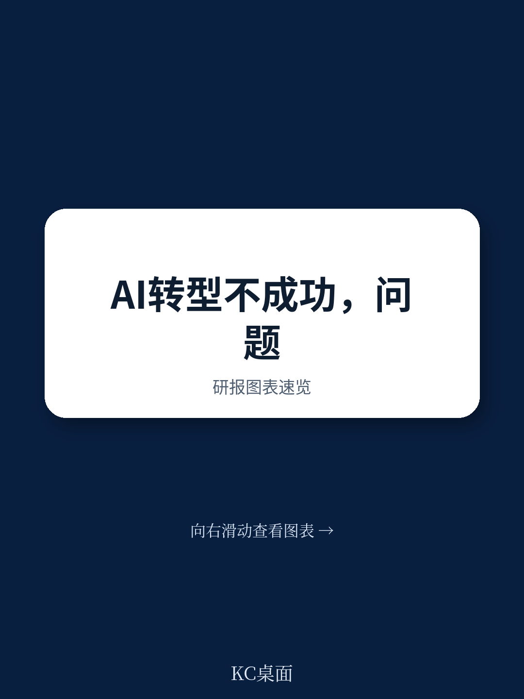

# 波士顿咨询：CEO们搞砸AI转型的五个共同死穴

AI的能力似乎无限，其变革潜力看似没有边界。但一个残酷的事实是，绝大多数CEO正在将这场技术革命搞砸。

波士顿咨询(BCG)最近一项研究给出了一个令人不安的数据：只有5%的公司能从AI中持续产生利润表(P&L)层面的实质影响，而大约60%的公司几乎没有看到任何实质性收益。这不是技术问题。这是转型纪律的溃败。

AI转型之所以比其他转型更棘手，在于它的两个独特属性：一是它能在早期快速展现成果，制造出“进展神速”的假象，而真正困难的工作——重新设计决策权、重塑专业知识应用方式、调整全价值链激励——却隐蔽且困难，常常被忽略。二是AI的大部分影响是间接的。它改善判断、生产力和洞察力，但这些财务效果是二阶的、脆弱的，除非被刻意捕获。

这种“早期可见性、系统性颠覆和间接价值”的组合，使AI转型天生就容易表现不佳。CEO们必须首先承认这一点，然后才能开始解决问题。

## 1. 碎片化试水是最大的价值陷阱

90%的公司至少在进行AI实验。但问题在于，他们停留在实验阶段太久，只迈出“婴儿步”，获取有限的效率提升。这些零散的努力缺乏实现持久P&L影响所需的规模和整合深度。

根据BCG的估算，约70%的AI价值潜力集中在核心业务流程工作流中——即决策、成本和结果交汇之处。碎片化试水不仅浪费资源，更致命的是，它让组织误以为自己“已在路上”，从而延迟了真正需要的根本性变革。

CEO必须亲自驱动AI努力，寻求对企业核心环节进行有目的、深层次的再造。仅仅提高某个环节的效率，与重新设计整个价值链，是完全不同的两件事。

> **KC评论：** 很多企业把AI当成“锦上添花”的工具，用它来优化一个客服流程或一个生产环节。但BCG的数据告诉我们，真正的价值藏在“雪中送炭”的地方——那些决定企业命脉的核心业务流。完整报告中，BCG详细拆解了如何从流程再造而非工具部署的视角来规划AI项目，这部分图表和案例值得深度阅读。

## 2. 低估投资规模，在“最后一公里”断粮

企业预计在2026年将AI支出翻倍，但许多CEO仍然低估了所需投资的真实规模。AI的影响本质上是跨职能的。它的触角远远超出技术部门，延伸到数据基础、整合、运营模式变革和员工赋能。

早期成功的幻觉常常导致领导者在转型完成前就限制资金投入。从70%的性能提升到95%——这意味着让影响变得结构化的“最后一英里”——需要不成比例的努力和投资，以强化数据基础、工业化流程、解决跨职能依赖关系，并嵌入负责任的AI和风险控制。令人印象深刻的结果掩盖了真实投资所需的规模。结果就是，在影响实现之前，现金流曲线断裂，努力失去了财务燃料。

CEO需要明白，AI转型不是一次性的项目预算，而是一项需要持续、高强度投入的长期承诺。它需要的努力、时间、艰难取舍和投资，远超大多数领导者的预期。

> **KC评论：** 这里有一个关键洞察：AI的早期成果会“欺骗”财务决策。当一个模型上线后，数据质量、流程整合、组织变革的后续投入往往被砍掉，因为管理层觉得“已经见效了”。但正是这些后续投入决定了AI能否从工具变成利润引擎。完整报告中有关于“现金流曲线断裂”的具体财务模型分析，对于理解AI投资的真实节奏非常有价值。

## 3. 没有“价值优先”的蓝图，效率提升不等于利润增长

AI项目经常失败，因为领导者没有从一开始就定义价值将如何被创造。相反，他们专注于职能或流程孤岛内可见的生产力改进。这些改进可能是真实的，但它们与收入增长、结构性成本削减、利润率扩张或资产负债表影响不是一回事。没有清晰的经济蓝图，运营改进就与财务表现脱节。

实践中，当没有明确的价值逻辑被定义时，预计价值的10%-20%通常在到达P&L之前就流失了。问题不在于AI缺乏潜力，而在于从局部效率到企业级影响的路径没有被设计出来。

CEO必须在开发任何AI项目之前就阐明一个“价值优先”的蓝图。这意味着要识别出将被影响的精确P&L和资产负债表科目，量化目标，并为每个价值来源分配明确的所有权。为了实现预期的财务收益，领导者必须绘制从每个受影响的工作流到实际实现价值的P&L科目之间的步骤和相互依赖关系。

这是财务架构的问题，不是技术部署的问题。CFO、财务部门和转型办公室应从第一天起就在定义价值逻辑和嵌入经济严谨性方面发挥核心作用。

## 4. 追踪“动作”而非“结果”，价值在无声中流失

即使有了价值优先的蓝图，许多领导者也未能建立所需的机制来长期交付和保护该价值。最初的雄心是清晰的，但执行纪律并非如此。没有嵌入绩效管理中的严格跟踪、预测和问责制，价值会悄无声息地流失。

最常见的失败是过度依赖运营指标。追踪仪表板上充斥着令人印象深刻的活跃度指标、生产力指标和工具采用率。然而，这些并不能自动转化为经济成果。当关键绩效指标(KPI)没有明确地与P&L影响挂钩时，领导者只能看到“动作”而非“绩效”。

后果是可以预见的。基线不明确。指标随时间变化。一次性的改进被误认为是结构性收益。没有与财务科目挂钩的前瞻性预测，管理层无法区分临时提升和可持续影响。信心下降，纠偏变得被动而非主动。

一个价值保护系统需要的不仅仅是报告。它需要治理。这种治理必须在一个正式的、多学科的转型办公室内进行——汇集财务、技术、运营、人力资源和风险——以协调执行、解决权衡并保持跨职能的问责制。与P&L挂钩的KPI必须在适当的领导层级进行定义和审查。每个价值杠杆的明确问责制必须嵌入激励和运营评审中。阶段门应作为决策检查点，以强制执行业务案例和运营计划的质量，并在部署额外资本之前确认运营改进正在转化为财务结果。

在这方面，AI转型与其他企业转型并无不同。价值必须在执行过程中得到保护。没有系统性的跟踪、有纪律的治理和经济上的问责，即使是设计良好的项目也会偏离轨道。

## 5. 忽略“人”的因素，组织惯性是最大的敌人

许多领导者认为，AI转型之所以困难，是因为技术复杂。实际上，主要障碍是组织性的。跨行业来看，对持续影响最重大的障碍根植于角色、激励、决策权和文化之中，而非算法或基础设施。

AI改变了工作的执行方式、决策的制定方式以及问责制的结构。它最大的影响不在于自动化孤立的任务，而在于重塑工作流程。这需要刻意重新设计角色、流程和绩效期望。BCG的“10-20-70原则”反映了这一现实：只有一小部分努力在于算法和技术；大部分在于赋能人员和组织以不同的方式运作。

培训和沟通是必要的，但远远不够。更深层的挑战在于超越渐进式的工具采用，转向一种“AI优先”的工作方式。个人使用并不能保证企业级的影响。有意义的结果来自于工作流程的根本性重新设计、管理层级的适应以及激励措施对新的行为方式的强化。没有这些结构性调整，组织就会退回到旧有的习惯，AI仍然只是一个附加品，而不是一个性能引擎。

## 报告尚未完全回答的关键问题：如何衡量“组织变革”的ROI？

BCG的报告清晰地指出了五个障碍，并给出了“AI领导者”的正确做法。但一个悬而未决的问题是：对于绝大多数处于转型早期或中期的企业来说，如何量化并追踪“组织变革”本身的投入产出比？

与购买算力或部署软件不同，重新设计角色、调整激励、改变决策权——这些“软性”投入的成本和收益都难以直接衡量。CEO如何说服董事会为这些看似模糊的变革持续投入？如何判断组织变革是否“到位”了，而不是仅仅在“做动作”？这可能是BCG报告之外，每一个决策者都需要自己回答的问题。

这份报告的价值，不在于提供了全新的技术知识，而在于它将AI转型拉回到了一个CEO和董事会最熟悉的框架：战略、投资、执行与组织纪律。它提醒所有人，AI不会自动改变你的公司，只有你驾驭一场纪律严明的转型的能力才能做到。

---

**关于这些未解问题的进一步探讨，以及BCG报告中关于“AI领导者”具体案例和财务模型的完整解读，我们已在社群中进行了深度汇编。欢迎扫码加入我们的交流群，与来自头部券商、PE/VC、投行、战略咨询等机构的朋友一起，持续追踪AI转型的真实战场与边际变化。每日更新，汇总国际主流叙事、数据与图表，观测这场变革的每一个关键信号。**

Personal reading notes and learning share only. Not investment advice.

