## BCG X | BCG

BCG AI RADAR 2026

## As AI Investments Surge, CEOs Take the Lead

## Survey methodology

2,360

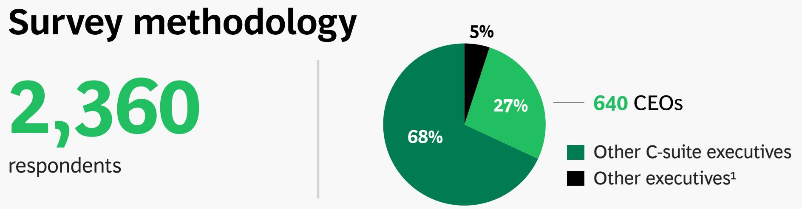

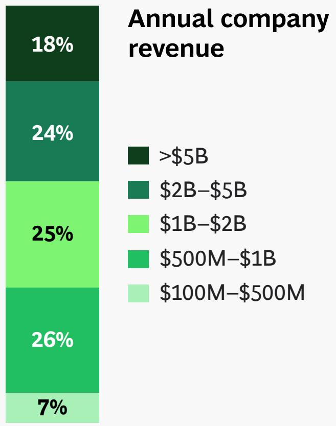  
Sources: BCG AI Radar Survey 2026 (n = 2,360); BCG analysis. $^{1}$ Executives who directly report to C-suite (EVP, SVP, VP, etc.).

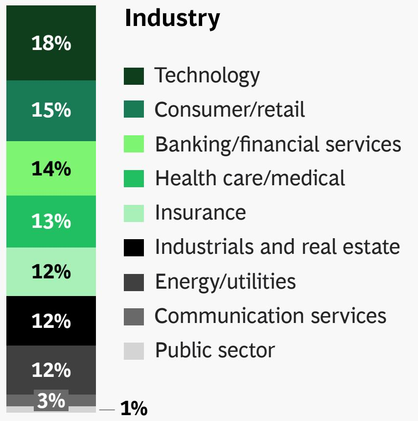  
Markets (number of respondents)

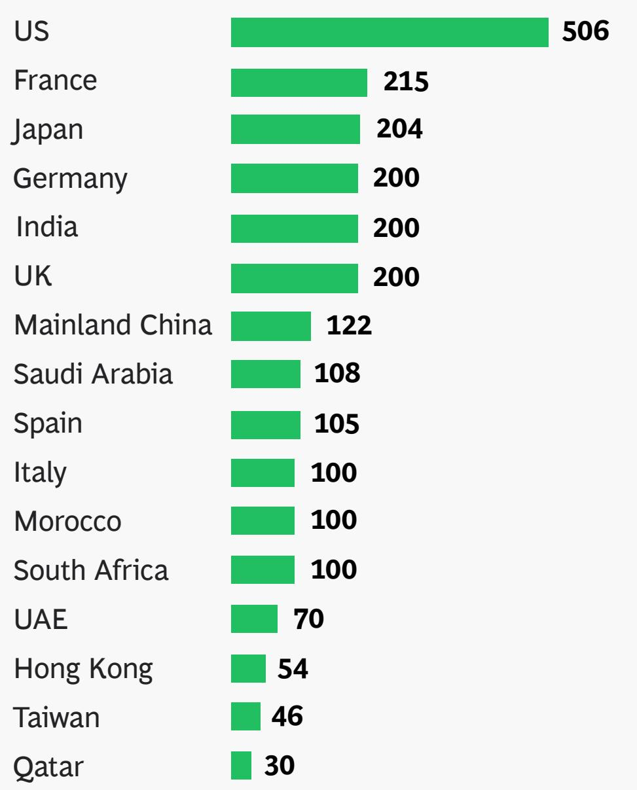

## Key takeaways

1

Corporate investments in AI have doubled since last year and are here to stay

94%

of CEOs say they will continue to invest even if it does not pay off in 2026

2

AI corporate transformation is moving from a CIO-led to a CEO-led initiative

72%

of CEOs say they are the main decision maker on AI in their organization

3

Three CEO archetypes emerge with Trailblazer CEOs leading end-to-end AI transformation

60%

of Trailblazers' AI budget will be spent on agentic AI

## Takeaway 1

Corporate investments in AI have doubled since last year and are here to stay

## 94%

of organizations
will continue their
investments even
if they do not pay
off in 2026

Only 6% of companies plan to pull back AI investments if current initiatives fall short

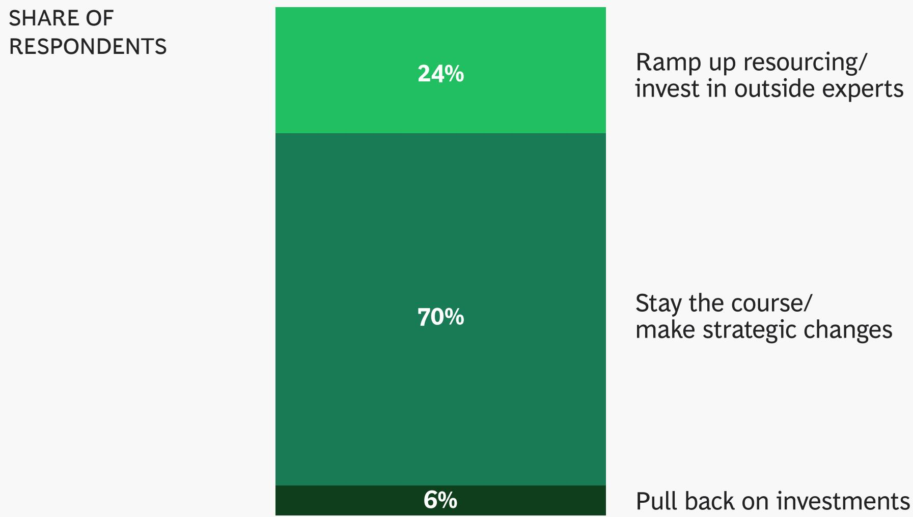  
Sources: BCG AI Radar 2026 Survey (n = 2,360); BCG analysis.  
Note: AI investments refer to all investments needed to realize the benefits from AI including but not limited to technology and infrastructure, data and architecture enablement, talent and upskilling, external partners, etc.  
Question: “What is the plan if your organization’s AI investments do not produce the desired financial impact in the next 12 months?”

Investment in AI as share of an organization’s revenue $(\%)$ 1

Investments in
AI is projected to
double in 2026

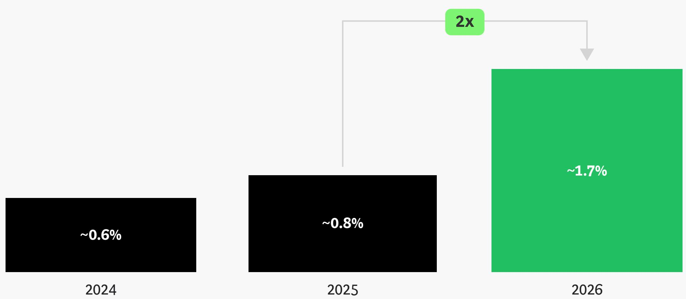  
Note: AI investments refer to all investments needed to realize the benefits from AI including but not limited to technology and infrastructure, data and architecture enablement, talent and upskilling, external partners, etc.  
Questions: “How much do you expect your organization to invest in AI in 2026?”, “What is the annual revenue range of your company or organization globally?” $^{1}$ The average base revenue of the underlying companies has remained almost the same.

INVESTMENT IN AI AS SHARE OF ANNUAL REVENUE

## All industries plan to increase their AI investments in 2026

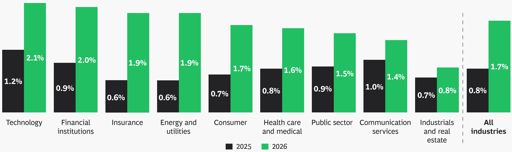  
Sources: BCG AI Radar 2026 Survey (n = 2,308 due to exclusion of “I don’t know” and blank responses); BCG analysis.  
Note: Consumer combines consumer/retail and travel/tourism industries. Public sector combines government/public sector and education industries. Communication services combines advertising/marketing, media, and telecom industries. Industrials and real estate combines manufacturing, industrial goods, automotive, transportation, agriculture, and real estate industries.  
Question: "How much do you expect your organization to invest in AI in 2026?"

<table><tr><td rowspan="9">Data privacy and cybersecurity remain the primary concern</td><td colspan="2">Top three AI concerns remain the same, but their share is declining</td></tr><tr><td>Share of respondents</td><td>Change vs. 2025</td></tr><tr><td>Data privacy and cybersecurity risks</td><td>-12pp</td></tr><tr><td>Lack of control or understanding of AI decisions</td><td>-7pp</td></tr><tr><td>Regulatory or compliance challenges</td><td>-5pp</td></tr><tr><td colspan="2">And a few other concerns have become more prominent</td></tr><tr><td>Technological failure</td><td>+6pp</td></tr><tr><td>Environmental impact of AI</td><td>+10pp</td></tr><tr><td>Geopolitical instability</td><td>+8pp</td></tr></table>

Sources: BCG AI Radar 2026 Survey (n = 2,360), BCG AI Radar 2025 Survey (n = 1,803); BCG analysis. Question: “What are the top three risks you are most concerned about when it comes to AI?”

## Agentic AI introduces both opportunity and risk in cybersecurity

9% of leaders view cybersecurity as the biggest threat from agentic AI

32% of leaders view cybersecurity as the biggest opportunity of agentic AI

## Automation

Scale

System access

New targets

Can search for weaknesses and break without rest

Learning

Can send many fake messages and frauds to many users

If taken over, can change settings, move data, or turn off protection

AI systems can be hacked

Can learn which attacks work and keep improving them

Can watch systems continuously and react to problems quickly

59%

Can check huge amounts of logs/alerts that humans would miss

Can repeatedly follow security steps quickly and correctly

of leaders view it
as both a threat and
an opportunity

Can regularly check accounts, passwords, and settings for issues

Can learn which attacks appear and keep improving defense

## Takeaway 2

## AI corporate transformation is moving from a CIO-led to a CEO-led initiative

72%

of CEOs say they are the main decision maker on AI in their organization

2x last year

## 82%

## are more optimistic about AI's potential for ROI this year than last year

## Half of CEOs surveyed believe their job stability depends on getting AI strategy right

50%

## CEOs show stronger conviction in AI than their executive counterparts

Expect major role disruption in the organization by 2030 $^{6}$

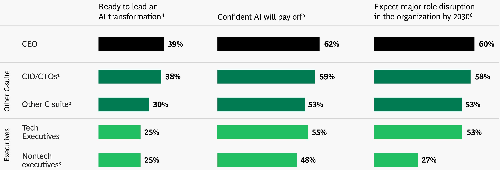  
Sources: BCG AI Radar 2026 Survey (n = 2,360); BCG analysis.  
$^{1}$ Includes Chief Data Officer, Chief Digital Officer, Chief AI Officer, and Chief Analytics Officer. $^{2}$ Includes Chief Financial Officer, Chief Strategy Officer, and other C-suite roles who report to the CEO. $^{3}$ Includes VP-level roles reporting into CXOs. $^{4}$ “How confident are you in your ability to lead your organization through an AI transformation that will deliver a positive return on investment?”, Replies for “Very confident.” $^{5}$ “Which of the following best reflects how you feel about investing in AI?”, Replies for “Confident AI will pay off.” $^{6}$ “To what extent do you agree with the following: By 2030, more than half the roles in your organization, including the C-suite, will be gone or transformed by AI.”

CEOs in the
East are more
confident AI
will pay off

Sources: BCG AI Radar 2026 Survey (n = 640 for CEOs); BCG analysis.

Question: “Which of the following best reflects how you feel about investing in AI?”, Replies “Confident that AI will pay off.”

$^{1}$ Greater China includes mainland China, Hong Kong, and Taiwan. $^{2}$ Middle East and Africa includes Morocco, Qatar, Saudi Arabia, South Africa, and the UAE. $^{3}$ Europe includes France, Germany, Italy, and Spain.

Global East
SHARE OF CEOS CONFIDENT THAT AI WILL PAY OFF

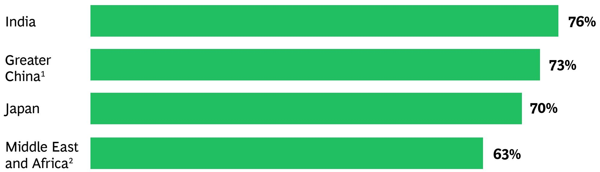  
Global West
SHARE OF CEOS CONFIDENT THAT AI WILL PAY OFF

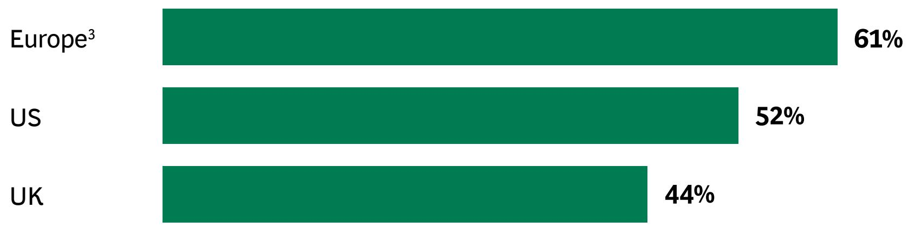

## CEOs in Asia express confidence, while those in the West feel pressure

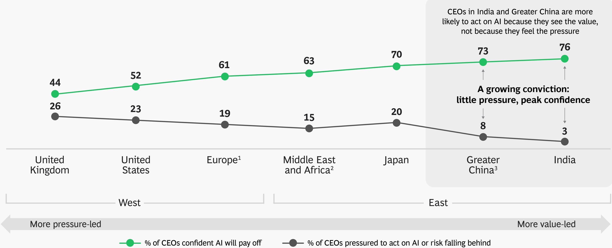  
Sources: BCG AI Radar 2026 Survey (n = 640 for CEOs); BCG analysis.  
Question: “Which of the following best reflects how you feel about investing in AI?”, Replies “Confident that AI will pay off” and “Pressured to act or risk falling behind.”  
$^{1}$ Europe includes France, Germany, Italy, and Spain. $^{2}$ Middle East and Africa includes Morocco, Qatar, Saudi Arabia, South Africa, and the UAE. $^{3}$ Greater China includes mainland China, Hong Kong, and Taiwan.

\~90%

of CEOs believe AI agents will enable their organizations to report measurable ROI in 2026

# CEOs have committed >30%

of their organization's AI investment for 2026 to agentic AI

## Agentic AI is taking on multiple roles, changing how companies organize work

"To what extent do AI applications occupy the following roles for people in your functional area?"

SHARE OF ORGANIZATIONS

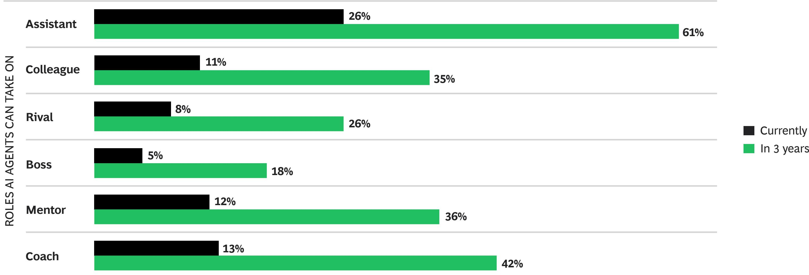  
Sources: BCG-MIT Sloan Management Review report, 2025 (n = 2,102); BCG analysis.  
Note: Respondents who answered “strongly agree” or “agree” to the question.

AI systems work
independently from
humans

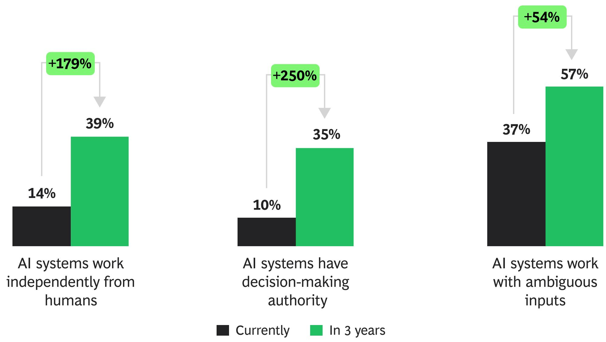

## As AI systems increasingly gain autonomy, leaders must develop adaptable governance structures

58%

of leading
organizations
expect a change in
governance and
decision rights due
to AI

"To what extent do you agree with the following statements about your organization?"

AI systems work
with ambiguous
inputs

## 90% of CEOs believe that by 2028 AI will significantly transform what success looks like

Staying competitive

Building competitive advantage

Deploy AI in
everyday tasks

Reshape critical
workflows and
functions

Invent new business
models and revenue
streams

## Takeaway 3

## Three CEO archetypes emerge with Trailblazer CEOs leading end-to-end AI transformation

## Three CEO archetypes emerge from the survey data $^{1}$

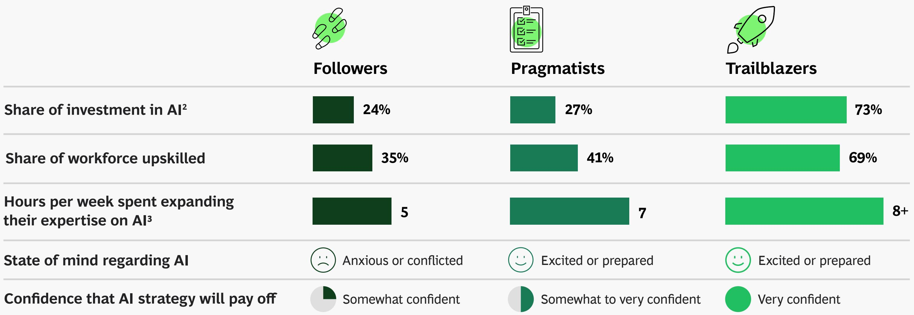  
Sources: BCG AI Radar 2026 Survey (n = 640 for CEOs); BCG analysis.  
$^{1}$ K-means clustering analysis reveals the five key variables that differentiate CEOs. These variables are used to define the three CEO archetypes. $^{2}$ Investments in AI as a part of the organization's transformational budget in 2026. $^{3}$ Includes all forms of engagement, not just formal training but also discussions, briefings, demos, and direct exploration of tools.

## Trailblazers emerge, but nearly all CEOs are focused on AI

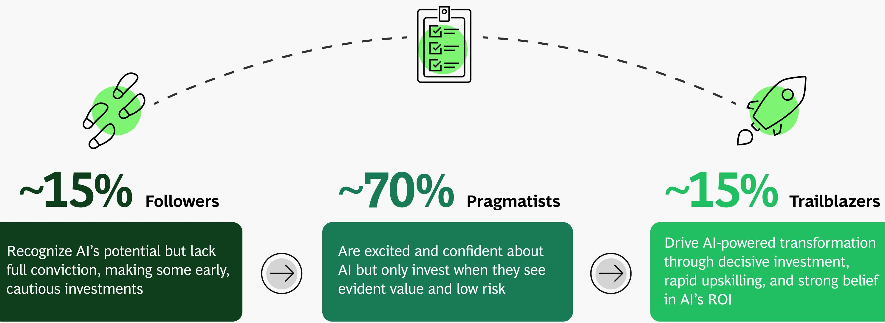

## \~15% Followers

Recognize AI's potential but lack full conviction, making some early, cautious investments

Are excited and confident about AI but only invest when they see evident value and low risk

## \~15% Trailblazers

Drive AI-powered transformation through decisive investment, rapid upskilling, and strong belief in AI's ROI

Increasing levels of confidence, investments, workforce upskilling, pressure to deliver, and excitement/preparedness

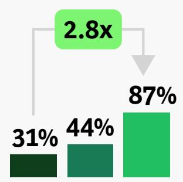

Trailblazer CEOs create a positive flywheel by prioritizing, investing, and upskilling the organization in AI

## 1. Make AI and agentic AI a top priority

Having “accelerate AI” as their top priority

## 5. Track measurable ROI from AI

Feeling “very confident” their AI strategy will pay off

## 2. Deepen AI literacy

Spending more than six hours a week expanding their expertise on AI

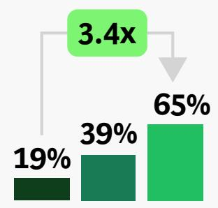

## 3. Invest capital at scale

Investing more than \$50M in AI in 2026

## 4. Upskill their organization

Upskilling more than half of their workforce

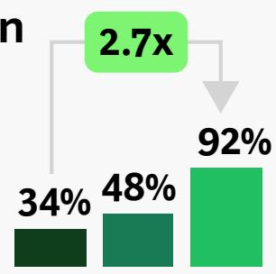

## "End-to-end AI transformation is one of our greatest opportunities to succeed with AI agents in the next 12 months"

SHARE OF RESPONSES FROM CEOS THAT AGREE

## Trailblazer CEOs are twice as likely to apply agentic AI end-to-end

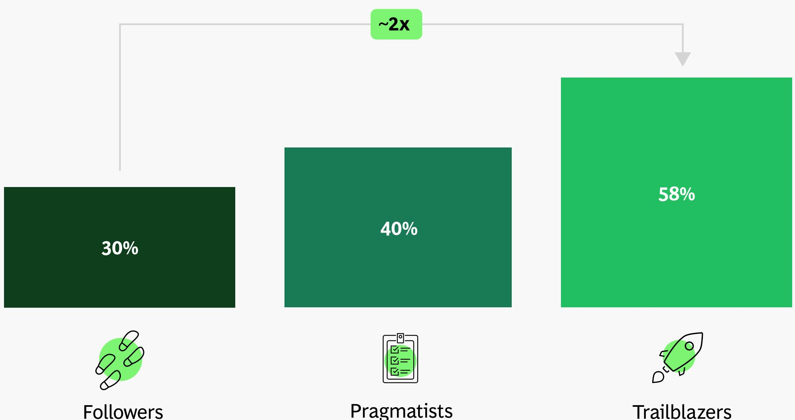  
Followers  
Pragmatists  
Trailblazers

Trailblazer CEOs
see value in AI
agents and invest
significantly

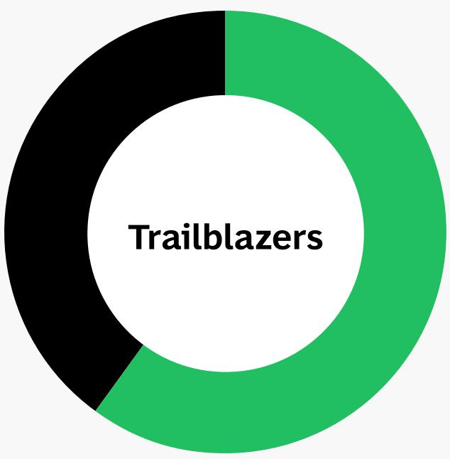

Trailblazers

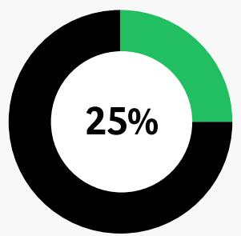  
Pragmatists

\~60%

of their AI budget is currently being spent on agentic AI

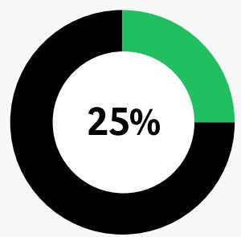  
Followers

## Trailblazers invest twice as much in upskilling their workforce

\~60%

of their organization's AI budget is allocated to upskilling and retraining current workforce on $\mathsf{AI}^1$

\~70%

of their workforce has been upskilled/reskilled on AI $^{2}$

VS

27%

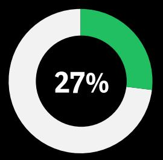

Pragmatists

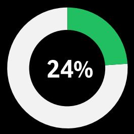

24%

Followers

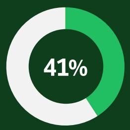

41%

Pragmatists

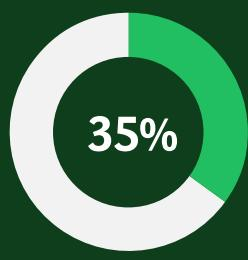

35%

Followers

Sources: BCG AI Radar 2026 Survey (n = 640 for CEOs); BCG analysis.

$^{1}$ “Approximately what percent of your overall AI budget is being allocated to upskill and retrain your current workforce on AI?” $^{2}$ “What share of your workforce has been upskilled/reskilled for AI?”

## Trailblazers see significant impact and returns from their investments in AI

## Foxconn

Over \$400M targeted savings identified from a scalable AI operating model and AI platform deployed across more than 200 factories

## Reckitt

Quality output doubled through an end-to-end AI-driven workflow reinvention in marketing, cutting routine activities by up to 90%

## CEOs must act decisively to execute their AI agenda

1. Make AI your key priority
Position the organization to be the disruptor, not the disrupted.

5. Track measurable ROI from AI
Track AI's impact to drive sustainable ROI over time.

2. Deepen AI literacy
Expand individual AI fluency to effectively lead transformations.

3. Commit investments at scale
Invest decisively across end-to-end
business functions.

4. Upskill the organization
Upskill the workforce to optimize productivity, creativity, and judgment.

## In summary

Corporate investment in AI is here to stay...

94%

will continue to invest
even if it does not pay off
in 2026

1.7%

of an organization's revenue is dedicated to AI investment

2x

increase in projected AI investments from 2025

AI transformation is moving from a CIO-led initiative to a CEO-led strategy...

72%

of CEOs say they are the main decision maker on AI, 2x last year

50%

of CEOs believe their job depends on getting AI right

90%

of CEOs believe AI agents will enable their companies to see measurable ROI this year