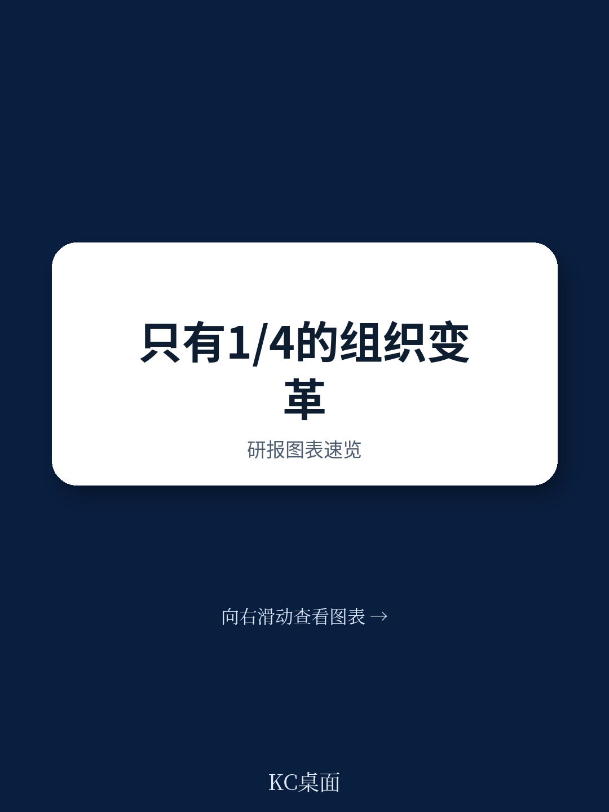
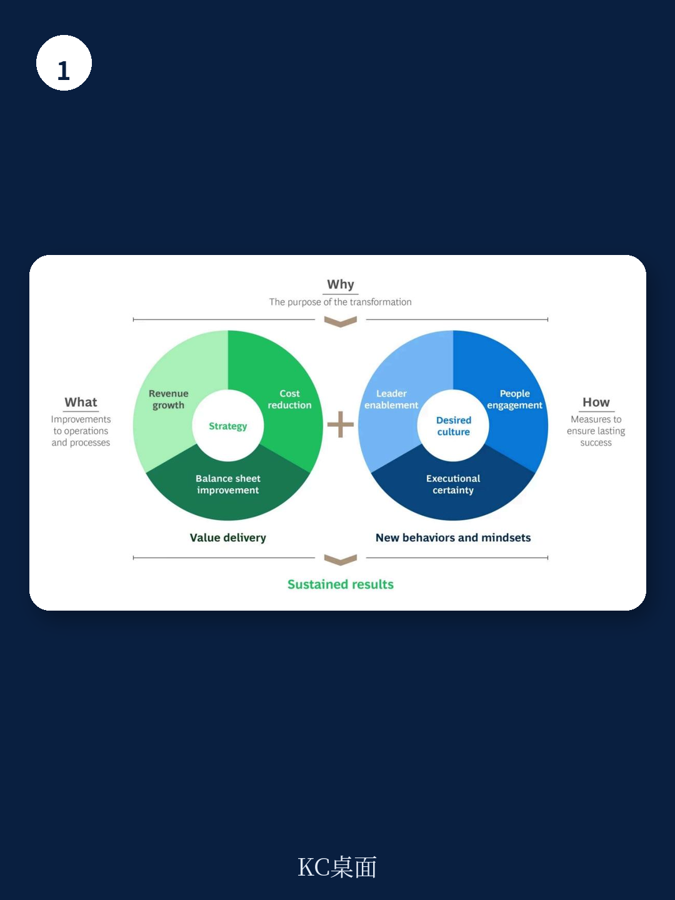

# 波士顿咨询：企业转型的成败，终于被拆解到了“人”这一层

企业转型的失败率，远比多数高管愿意承认的要高。波士顿咨询（BCG）的最新研究给出了一个冷峻的数字：只有大约四分之一的组织转型，能够同时捕获短期与长期价值。换言之，四分之三的努力，要么中途折戟，要么昙花一现。

但这份报告的价值，不在于重复“转型很难”这个共识，而在于它找到了那四分之一的成功者与其余失败者之间最关键的差异。答案不在战略蓝图，不在技术工具，也不在组织架构的调整——而在于一个长期被低估、被简化为“沟通培训”或“文化口号”的变量：人。

BCG 的结论是：那些将行为科学原则系统性地嵌入转型全过程的企业，其股东总回报（TSR）比同行高出 15%。这并非软性的“员工关怀”，而是一个可量化、可复制的竞争优势来源。本文基于这份研报，拆解其核心洞察，并追问那些报告没有完全展开的深层问题。

## 1. 转型失败的根源不是战略错误，而是对“人的惯性”的漠视

所有转型都试图回答三个问题：为什么转（Why）、转什么（What）、怎么转（How）。绝大多数企业在前两个问题上投入了不成比例的资源——宏大的愿景、精准的财务目标、详尽的业务组合调整。但问题恰恰出在第三个环节：How。

BCG 的研究指出，转型本质上依赖人们改变行为的意愿。然而，人类天生厌恶变化。这不是态度问题，而是认知机制。行为科学告诉我们，人们在面对不确定性和额外认知负荷时，会本能地退回旧有模式。因此，无论“为什么”多么动人，“转什么”多么合理，如果“怎么转”的设计忽视了这一人性底层逻辑，转型就注定在落地阶段被消耗殆尽。

这意味着，企业需要将“人”从转型的被动接受者，转变为主动参与者。这不是一句口号，而是一套可操作的方法论。报告给出了四个具体维度：领导者赋能（Leader Enablement）、员工参与（People Engagement）、执行确定性（Executional Certainty）与目标文化（Desired Culture）。这四个维度共同构成了一个 MECE 的分析框架，也是那 15% TSR 溢价的来源。

> **KC评论：** 很多管理者误以为“人”的问题就是“激励”或“培训”。但 BCG 的框架更底层：它指向的是认知负荷、决策权模糊、文化惯性这些结构性障碍。如果你正在主导一场转型，不妨先问自己：我的团队是否清晰知道“什么不变”？这往往比“什么变”更能消除焦虑。完整报告里有一张关于“Why-What-How”的三角模型图，值得反复对照。

## 2. 领导者赋能的关键不是授权，而是让“为什么”穿透组织

在 BCG 的框架中，领导者赋能被放在首位，但这并非传统意义上的“高层支持”或“一把手工程”。报告强调，转型领导者必须能够持续、一致地传达一个“变革理由”（Case for Change），这个理由不仅要解释“什么会变”，更要明确“什么不会变”。

后者往往被忽略。当组织陷入不确定性时，员工最恐惧的不是改变本身，而是对稳定部分的丧失。一个优秀的变革理由，实际上是在划定一个安全区，让团队知道哪些核心能力、流程或价值观是转型的基石而非目标。这能有效降低认知负荷，让员工将精力从“防御”转向“参与”。

此外，报告指出，领导者需要超越传统的命令-控制模式，转向一种更富有同理心的领导方式，即整合“头脑、心灵与双手”。头脑代表逻辑与战略，心灵代表情感与认同，双手代表行动与执行。三者缺一不可。这要求企业不仅为领导者设定明确的角色与决策权，还要将短期与长期激励，与领导者个人及团队的整体转型成果挂钩。

## 3. 员工参与的本质，是管理组织的“认知负荷”

“沟通”是转型中最常见的词汇，但也是最容易被形式化的环节。BCG 的洞察在于，员工参与的核心不是“告知”，而是“减负”。

企业在转型期往往同时推进多项举措，这会导致员工面临巨大的认知负荷——信息过载、任务冲突、角色模糊。报告建议，企业必须进行“影响评估”（Impact Assessment），系统性地识别转型对关键利益相关者造成的潜在负担，并主动采取措施降低认知负荷。例如，通过清晰的沟通路线图、月度简报、全员大会和脉冲调查（Pulse Check），让员工不仅了解进展，更感到自己被倾听。

值得关注的是，报告引用了一家全球领先饮料公司的案例。该公司通过高频次沟通和脉冲调查，实现了超过 95% 的员工理解转型目的，超过 80% 的员工对转型给予正面评价，且这一比例随时间持续上升。这并非偶然，而是系统设计的结果。

> **KC评论：** 你可能会觉得“多开会、多发邮件”就能解决沟通问题。但 BCG 的数据表明，真正有效的参与，是让员工感到“我的努力被看见、被反映、甚至被庆祝”。这需要从单向的信息推送，转向双向的反馈闭环。完整报告里关于“变革冠军”（Change Champions）的机制设计，以及如何通过庆祝小胜利来构建转型动力，是值得细读的部分。

## 4. 执行确定性：用“阶段门”机制对抗宏大叙事的虚幻感

转型最怕的，是“雷声大雨点小”。BCG 给出的解药是“执行确定性”，其核心机制是“阶段门”（Stage Gate）方法论。

这并非新鲜概念，但 BCG 将其与“转型办公室”（Transformation Office）结合，形成了一套严密的治理结构。转型办公室负责建立明确的治理规则、组织结构和问责机制。所有转型举措必须通过阶段门，分步推进、逐步验证，确保原始目标始终现实可行。同时，实时的报告机制提供单一事实来源，消除关于转型进度的混乱信息。

这套机制的价值在于，它将宏大的转型叙事，拆解为一个个可追踪、可验证的微观行动。当每个团队都清楚自己的“下一道门”是什么时，焦虑转化为行动，不确定性转化为确定性。报告中的饮料公司案例显示，其转型涵盖了 24 个国家、9 个工作组、超过 4000 项举措，正是依靠这套治理结构才得以保持秩序。

## 5. 报告未完全回答的关键问题：文化究竟如何被量化？

BCG 将“目标文化”列为第四个要素，并指出转型只有在根本改变组织文化时才算成功。报告建议通过诊断工具，评估当前文化、运营模式、领导风格和工作方式，并让领导者通过行为示范来推动新文化的落地。

然而，这里存在一个报告没有完全展开的深层问题：文化改变的效果如何被量化？报告提到了“可量化的指标”，但没有给出具体的框架或案例。文化是组织中最具韧性的部分，其改变往往滞后于业务指标。如果企业无法在转型中期看到文化的“进展信号”，很容易在文化改变的漫长周期中失去耐心，转而退回到旧有的行为模式。

这或许是所有转型中最隐蔽的风险：当业务指标开始好转时，人们可能会误以为“文化已经改变”，从而放松了对新行为的持续强化。而一旦外部压力消失，旧文化可能迅速回潮。报告没有深入探讨如何建立“文化改变的早期预警系统”，这恰恰是读者在读完报告后最需要自行探索的方向。

> **KC评论：** 文化是转型的“最后一公里”，也是最难被度量的。BCG 提出的诊断和领导行为示范是起点，但真正的挑战在于：如何区分“表面服从”与“真正内化”？完整报告中关于“行为嵌入日常流程”的讨论，提供了一些线索，但这个问题本身，值得在更广泛的实践中持续追问。

## 6. 为决策者提供的观察框架：从“四要素”出发，审视你的转型健康度

基于 BCG 的框架，决策者可以建立一个简单的自我诊断模型，用来评估正在进行的或即将启动的转型项目：

第一，检查“变革理由”是否同时回答了“什么不变”。如果团队只清楚要变什么，却不清楚哪些根基不能动，转型的阻力会显著增大。

第二，评估“认知负荷”。当前组织内同时推进了多少项变革？员工是否感到信息过载或角色冲突？如果是，需要立即通过影响评估来减负。

第三，验证“阶段门”机制是否存在且被严格执行。转型办公室是否拥有足够的权威？举措是否被拆解为可验证的步骤？如果没有，转型很可能陷入“大跃进”式的无序推进。

第四，追问“文化指标”。除了财务和运营指标，是否设定了关于领导行为、员工反馈、协作模式的可量化文化目标？如果没有，文化改变将沦为空洞的口号。

这份报告的价值，不在于提供了什么惊天动地的颠覆性结论，而在于它把“人”这个最容易被泛化的变量，拆解成了可诊断、可执行、可衡量的四个维度。对于正在经历或即将启动转型的企业而言，它提供了一份难得的“操作手册”。但手册的每一页，都需要结合自身情境去填充细节。

---

我们正在持续跟踪全球头部咨询公司与投行的最新研报，并尝试将其转化为可操作的洞察。如果你对 BCG 这份报告的完整图表、案例细节以及更多关于“行为科学在转型中的应用”的延伸资料感兴趣，欢迎加入我们的社群。这里汇聚了来自头部券商、PE/VC、投行、并购、hedge fund、资管机构、战略咨询、智库等领域的从业者，每日更新，汇总国际主流叙事、数据与图表，观测边际变化。扫码交流，获取更多国际信源汇编与深度评论。

Personal reading notes and learning share only. Not investment advice.

