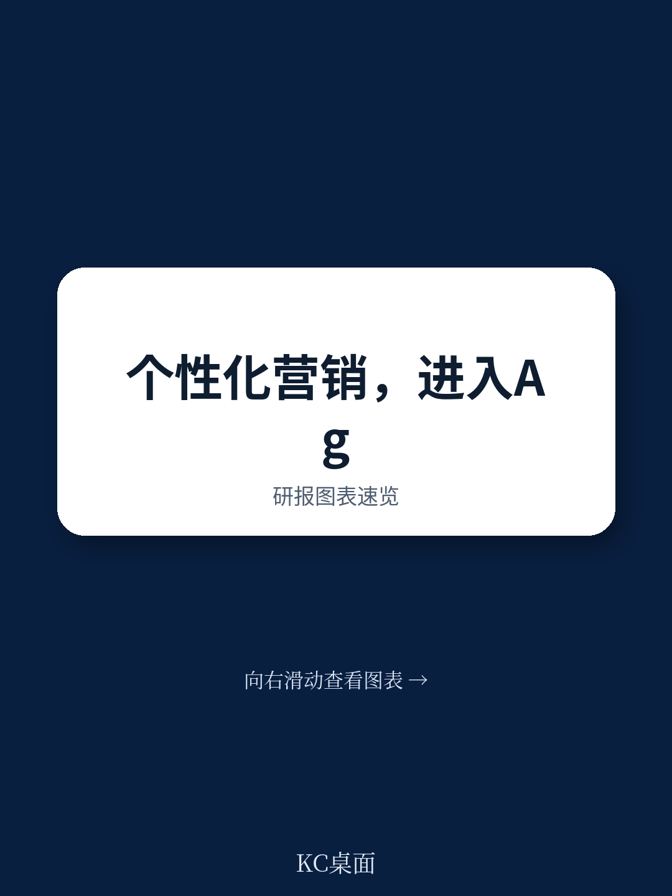
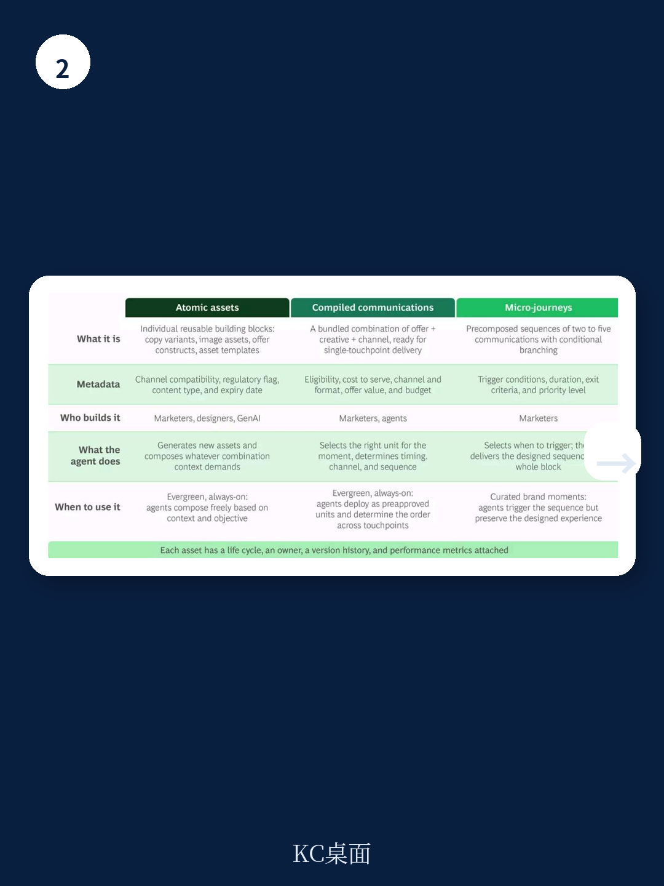

# 波士顿咨询：营销的“旅程”时代已死，“代理”时代已来

当大多数企业还在费力优化客户旅程的每一步时，一份来自波士顿咨询的最新报告抛出了一个颠覆性的判断：以“旅程”为核心的个人化策略，其增长红利已经见顶。未来12到18个月，决定企业营销效率分野的关键，不再是设计更长的旅程，而是转向由AI代理实时编排的“原子化动作”。

这份报告的核心主张清晰而锐利：营销决策的单位，必须从“旅程”切换到“动作”。这不是技术的渐进改良，而是架构的根本重构。对于任何在营销上投入巨大、却感觉ROI越来越难提升的组织，这份报告提供了一个不容忽视的战略预警和行动路线图。

## 1. 旅程模式的增长已触顶，其结构性缺陷无法通过优化修补

过去十年，“客户旅程”是营销组织的黄金法则。通过精心设计从认知到购买的每一步，企业能够系统性地转化用户。波士顿咨询的报告明确指出，这套模式在今天的环境中已经“平台化”——它的效能增长曲线已经趋于平缓。

原因在于，旅程模式是一个“确定性”的架构。它假设用户会按照预设的路径前进，但现实是：渠道爆炸式增长，客户信号在实时涌现，可用的内容、优惠和体验组合呈指数级膨胀。为了覆盖更多场景，企业不得不创建成百上千条旅程，但每一条新旅程都需要手动设计、测试和部署。这导致一个悖论：试图通过增加旅程数量来提升覆盖率，反而让营销团队的管理负担超出了其承载能力。

**所以呢？** 对于任何依赖大规模营销的企业，继续在现有旅程框架内修修补补，投入产出比将加速递减。这不是运营效率的问题，而是架构天花板的问题。下一阶段的增长，不可能通过“优化”当前模式来实现。

## 2. 下一代营销架构的决策单元，将从“旅程步骤”变为“原子动作”

波士顿咨询将营销决策的演进分为三个时代。第一代是“人工编排的旅程”，决策单元是整个旅程。第二代是“模型优化的旅程”，决策单元是旅程中的单个步骤，但架构依然以旅程为组织原则。第三代，即报告所说的“代理时代”，决策单元变成了“原子动作”。

这个转变是根本性的。在第三代架构中，AI代理不再受限于预定义的旅程分支。它们从一个“可组合货架”上实时选择、排序和组合最小的营销单元——一段文案、一张图片、一个优惠、一个微旅程。营销人员的角色，也相应地从“旅程设计师”转变为“货架策展人”和“目标设定者”。

> **KC评论：** 这意味着，未来的营销系统更像一个“乐高积木池”，而不是一条“装配流水线”。代理根据当下的客户上下文，用积木拼出最合适的交互。对读者而言，关键洞察是：你的组织是否已经开始将内容、创意和优惠模块化、标签化？如果你的内容库还是一片“大杂烩”，代理时代的大门对你就是关闭的。完整报告中关于“可组合货架”的三层颗粒度划分——原子资产、编译通讯、微旅程——值得深入研读，它直接决定了你的架构起点。

## 3. 投资路径是累积而非替代：今天为第二代构建的组件，是第三代架构的基石

一个容易让决策者感到宽慰的结论是：迈向代理时代的投资并不是“推倒重来”。波士顿咨询强调，投资路径是累积性的。今天为第二代（模型优化旅程）构建的每一个组件——数据平台、模型API、内容管理系统——都可以直接映射为第三代中代理可以调用的“工具”。

这意味着，企业不必等待一个完美的蓝图再行动。关键原则是“模块化”。任何今天新建的模型、集成或数据源，都应该以API优先的方式暴露，并附带清晰的元数据。报告指出，一个组织能否在12个月内适应代理架构，还是需要多年的平台重建，区别就在于今天的设计是否考虑了模块化。

**所以呢？** 这个判断给出了一个明确的投资优先级和安全感。企业可以立即着手优化现有系统，但必须带着“未来代理将如何调用它”的视角。那些继续建设封闭、紧耦合系统的公司，将在未来12-18个月面临巨大的架构转换成本。

## 4. 代理架构的核心是一套“推理-行动-连接-学习”的系统，而非单一智能体

报告花了大量篇幅拆解代理原生NBA（Next-Best Action）所需的四项能力，它们构成一个完整的系统，而非一个简单的“AI插件”：

- **可组合货架：** 内容、创意的模块化仓库，是代理行动的素材库。
- **代理架构：** 一个中心协调器与多个专业代理（上下文代理、资格检查代理、行动选择代理、组合代理）组成的系统，它们相互协作而非固定顺序执行。
- **工具与状态管理：** 所有模型、数据源、渠道接口都被封装成“工具”，代理可以按需调用。同时，系统维护一个持续更新的客户状态记忆。
- **学习与优化：** 一个因果测试引擎，持续评估每个货架资产和代理决策的效果。

> **KC评论：** 这不是一个“一个AI搞定所有事”的简单故事。它更像一个精密的“操作系统”，其中每个代理都是专业化的微服务。对技术决策者而言，报告中最值得关注的不是概念，而是Exhibit 5中的架构图——它展示了代理如何通过Model Context Protocol (MCP) 发现和调用工具。这张图是理解“模块化”如何落地的关键。完整报告中对这个架构的拆解，是任何计划自建或采购营销AI平台团队的必读内容。

## 5. 报告尚未完全回答的关键问题：组织与治理的“再发明”

波士顿咨询坦诚地指出了最大的挑战：技术已经广泛可用，真正的瓶颈在于“营销运营模式的再造”。报告提出了几个尖锐的问题，但并未给出完整的答案——这恰恰是读者需要深入思考的部分。

例如，哪些决策应该完全交给代理？哪些必须保留人类审批？当代理系统每天执行数百万次决策时，治理和风控如何规模化？当营销人员从“活动运营者”变成“系统架构师”，他们的能力模型、KPI和职业路径应该如何重塑？报告提到了“单代理用例试点”作为起点，但并未详细展开如何从试点过渡到全组织规模化的具体路径。

**所以呢？** 这些问题意味着，代理时代的真正门槛不在于技术，而在于“人”和“流程”的变革。率先拥抱技术的组织，将面临一个“先发优势”与“试错成本”并存的关键窗口期。如何设计一个既能激发代理创造力、又能防止其越界的治理框架，将是未来12-18个月所有营销高管必须亲自回答的课题。

## 6. 一个极端的“反事实”案例：当信任被破坏时，旅程模式如何失效

报告提供了一个极具说服力的场景：一位信用卡客户致电投诉一笔欺诈交易，问题圆满解决。20分钟后，他打开银行的App。在旅程模式中，App可能依然显示一个预定的余额转账优惠，完全无视客户刚刚经历了一场信任危机。而在代理时代，系统会识别出这是“重建信任”的关键时刻，自动推送一条安全确认信息和免费的信用监控升级。

这个案例的价值在于，它揭示了旅程模式的根本盲点：它无法感知“上下文”，尤其是那些非结构化的、情绪性的、时间敏感的上下文。代理的能力，正是将这种上下文转化为实时的、最合适的行动。对于银行、保险、电信等高度依赖信任的高价值行业，这个场景的启示是决定性的。那些继续依赖静态旅程的公司，将在这些“关键时刻”持续失分，而他们甚至不会意识到自己失去了什么。

---

这份报告的真正价值，不在于它描绘了一个遥远的未来，而在于它提供了一个清晰的“现在该做什么”的路线图。从构建可组合货架、模块化工具层，到启动因果测试，再到试点单代理用例，每一步都有明确的当前价值和未来意义。对于营销负责人而言，最危险的决策不是“选错技术”，而是“继续等待”。

关于代理架构的测量体系、组织重组方案，以及更深层的决策科学，报告还有后续三部分尚未发布。这些内容将直接回答“如何衡量代理效率”和“如何重组团队”等实操问题。

**如果你想获取这份完整报告的原文图表、以及我们后续对系列报告（决策科学、组织重构、测量体系）的持续解读，欢迎扫码加入社群。** 在这里，我们每日更新和汇总国际主流信源与数据，汇聚了来自头部券商、PE/VC、投行、战略咨询和产业一线的朋友，共同观测和讨论这些边际变化。期待与你交流。

Personal reading notes and learning share only. Not investment advice.

