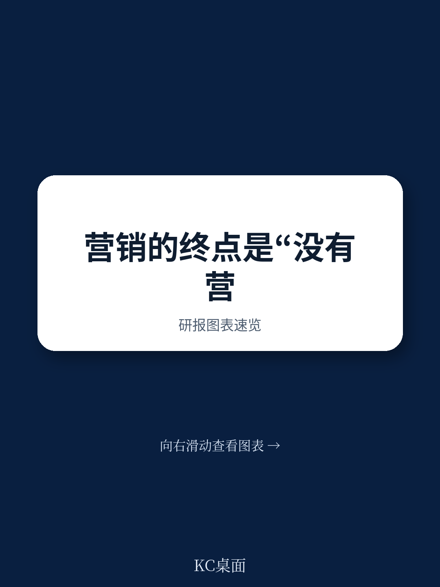

# 波士顿咨询：营销战役的终结，不是营销的终结

如果你还认为营销的核心是“策划一场漂亮的战役”，那么波士顿咨询公司（BCG）这份最新报告，可能会让你重新审视整个职业的底层逻辑。

BCG 在这份题为《The End of Marketing Campaigns as We Know It》的报告中，提出了一个直接且尖锐的判断：以“战役”和“日历”为核心的传统营销组织方式，正在走向终结。取而代之的，是一套由 AI 智能体（Agent）驱动的、以“下一最优行动”为核心的实时响应系统。

这并非一个渐进式的优化，而是一次对营销执行价值链的彻底重构。报告的核心洞察在于，技术本身已不再是瓶颈，真正的挑战在于改变“人”的工作方式、组织的协作逻辑，以及企业的决策治理体系。

这份报告的价值，不在于描绘一个遥远的未来图景，而在于给出了一个可操作、可量化的转型路径。它告诉你，从今天起，你的团队结构和日常节奏，应该发生怎样的变化。

## 1. 70%到80%的客户触点，将不再由“战役”驱动

BCG 报告中最具冲击力的一个数字是：在成熟的智能体原生模式下，70%到80%的客户触点将从预定义的营销战役，转向由 NBA 驱动的实时交互。这意味着，“战役”将从营销工作的核心单元，退化为只服务于品牌大事件、产品首发或合规通讯等少数例外场景的“特例”。

传统营销的逻辑是：先有目标，再有受众，然后是创意，最后是排期。一切围绕“日历”展开。而智能体原生的 NBA 完全颠倒了这个逻辑：系统从每一个具体的客户出发，实时从“可组合货架”上抓取最合适的行动。预定义的受众消失了，取而代之的是实时的上下文定位。

> **KC评论：** 这里的关键不在于“战役”会消失，而在于营销团队的核心工作流发生了根本性迁移。过去，你的团队花 80% 的时间在“计划”和“执行”战役；未来，这 80% 的时间将转向“构建和优化货架”。你的价值不再体现在你策划了多精妙的战役，而在于你为智能体提供了多好的“弹药”和“规则”。报告中对“构建侧”与“交付侧”的分离描述，是理解这一转变的钥匙。

## 2. 从60天到几小时：执行价值链的“降维打击”

BCG 的报告毫不留情地指出了传统营销流程的痛点：从策略制定到战役上线，平均需要 60 到 90 天，涉及 20 多人，经过无数次交接，最终只产出有限变体的一套素材。这种节奏和吞吐量，与今天的需求格格不入。

而新的执行价值链，通过“人类+AI 智能体”的结对工作模式，实现了指数级的效率提升。报告给出了一个具体的场景：一个“简报智能体”可以在几小时内，将过去的绩效数据和市场信号综合成一份包含测试目标、KPI 和创意假设的草案。营销人员的工作，不再是“从零开始写简报”，而是“优化和精炼智能体产出的简报”。法律和合规审查也从串行关卡变成了实时协作。

结果是惊人的。报告引用的数据显示，采用这一模式的组织，周期时间缩短了高达 80%，内容生产从数月压缩到数天。更关键的是，执行团队规模可以减少 60%，但留下的角色——策略、策展、治理和持续学习——其价值被无限放大。

> **KC评论：** 请仔细品味“周期时间缩短80%”和“团队减少60%”这两个数字。它们不是孤立的效率提升，而是在宣告一种新的竞争壁垒的形成。当你的竞争对手可以用几小时完成你几周的工作，并且产出更精准、更多样时，你现有的所有营销节奏和预算分配模型，都需要被重新审视。报告中对“智能体-营销者小组”的描绘，是理解这种新组织形态的最小单元。

## 3. 决策治理：防止AI“跑偏”的最后一道防线

当 AI 智能体被赋予了在毫秒间做出海量决策的自主权，一个关键问题浮现：谁来确保这些决策符合公司的整体战略，而不是某个产品线的短期利益？

BCG 报告将此问题提升到了“企业决策治理”的高度。这是整份报告中最具战略深度的部分。治理的核心是两个职责：一是定义并持续校准企业的“目标函数”——即一组决定“优化什么”以及“如何权衡不同行动”的 KPI 权重体系。二是跨业务线的协调，防止不同部门为了各自的 KPI 而对同一个客户发起相互冲突的营销攻势。

报告特别强调，治理不是一次性的设定，而是一个“始终在线”的功能。商业优先级会变化，季度业绩压力与客户长期价值之间永远存在张力。一个跨企业的治理机构必须定期（至少每季度）审视并重新校准这些输入，确保每一次 AI 的自主决策，都反映公司当前的战略意图。

> **KC评论：** 这是报告中最容易被忽视，但却是最具前瞻性的部分。它回答了所有 CEO 和 CMO 最担心的问题：“如果 AI 为了转化率，把最贵的产品推给了最不适合的客户怎么办？” 答案不是取消 AI 的自主权，而是建立一个比 AI 决策更高级的“治理系统”。这个系统由人类设定边界和原则，AI 在边界内自由驰骋。报告中对“低风险高频决策”与“高价值单次决策”中人类与AI权限划分的描述，是构建这一系统的实操指南。

## 4. 报告尚未完全回答的关键问题：治理架构的落地成本与组织阻力

BCG 报告清晰地描绘了“应该做什么”，但对于“如何做到”的细节，尤其是在大型、复杂的传统组织中，这种治理架构的落地成本和可能遭遇的组织阻力，着墨不多。

例如，建立一个跨产品线、跨职能的“决策治理委员会”，本身就需要极高的政治智慧和权力协调。谁拥有最终的话语权？是首席营销官，首席增长官，还是首席数据官？当不同业务线的 KPI 权重需要调整时，背后的利益博弈如何化解？

此外，报告提到了“智能体-营销者小组”的敏捷结构，但并未深入讨论，这种结构如何与传统的矩阵式汇报关系和年度预算周期进行衔接。一个以“天”为迭代周期的敏捷小组，如何在一个以“季度”或“年”为考核周期的组织中生存并获得资源？这些是报告留给读者的、需要结合自身企业实际去填补的空白。

## 5. 给你的观察框架：从三个维度审视你的组织

基于 BCG 的这份报告，你可以从以下三个维度，为自己的组织进行一次快速体检：

第一，货架的丰富度与模块化程度。你的团队今天生产的营销内容、优惠和体验，是否可以被拆解成足够细小的、可被 AI 实时调用的模块？你是在“建造一座大教堂”，还是在“制造乐高积木”？

第二，执行周期的敏感度。从提出一个营销想法到它被客户看到，你的组织需要多久？这个时间差，就是你与智能体原生竞争者之间的竞争劣势。你需要识别出流程中那些最耗时的“人工交接”和“串行审批”环节。

第三，决策治理的成熟度。你的公司是否有一个明确的、跨部门的机制来定义和调整“什么是最优”？当不同部门的利益冲突时，决策权在谁手里？你的 AI 系统（如果有的话）是在为客户的长期价值服务，还是在为某个部门的短期 KPI 打工？

这份报告的价值，在于它把“AI 改变营销”这个宏大叙事，拆解成了“货架”、“智能体-营销者小组”和“决策治理”三个可落地的模块。它没有贩卖焦虑，而是提供了一个清晰的、从“战役驱动”到“智能体驱动”的转型路线图。

然而，正如报告所暗示的，真正的挑战不在于技术，而在于人。如何让习惯了“策划战役”的团队，转型为“策展货架”的专家？如何让习惯了“60天周期”的流程，适应“几小时”的节奏？如何让习惯了“各自为战”的业务部门，接受一个统一的“决策治理”框架？这些问题的答案，无法从一份报告中直接获得，它们需要每一个营销领导者，在自己的组织中，通过实践和迭代去寻找。

---

关于治理架构的落地细节、智能体小组与传统组织的衔接方案，以及更多来自全球头部咨询公司的前沿营销洞察与实战案例，我们已在社群中进行了深度汇编与持续讨论。这里汇聚了来自头部券商、PE/VC、投行、并购、hedge fund、资管机构、战略咨询、智库等领域的从业者，每日更新国际主流叙事、数据与图表，观测行业边际变化。欢迎扫码加入交流，获取完整报告解读与原始图表。

Personal reading notes and learning share only. Not investment advice.

