FINANCIAL INSTITUTIONS
BCG FLAGSHIP REPORT

# The Future of Digital Assets

May 2026

By Chris Schmid, Inderpreet Batra, and Roy Choudhury

## Acknowledgements

Since its inception, the BCG Digital Asset Working Group has been an invaluable source of domain expertise, insight generation, and problem-solving on the most complex topics, as well as a strong foundation of collaboration driven by a shared commitment to delivering excellence to our global clients.

This flagship report would not have been possible without this collective depth of knowledge and the group's extensive work across the ecosystem, including Global Systemically Important Banks (G-SIBs), regional banks, fintechs, industry associations, and other key stakeholders.

We would like to thank the following individuals for their valuable contributions:

Markus Ampenberger
Managing Director and Partner
Munich

Carlos Bravo
Director BCG Vantage
Madrid

Frédéric Brugère
Managing Director and Partner
Paris

Kaj Burchardi
Platinion Managing Director
Amsterdam

David Chan
Managing Director and Partner
Hong Kong

João Paulo Curado
Managing Director and Partner
São Paulo

Assia Gardiner
Partner and Associate Director
Zurich

Sander van Loosbroek
Platinion Director
Amsterdam

Kunal Jhanji
Managing Director and Partner
London

Dr. Laurin Karl Frommann
Managing Director and Partner
Zurich

Yue Hong Zhang
Managing Director and Partner
Hong Kong

Bernhard Gehra
Managing Director and Senior Partner
New York

Dr. Bernhard Kronfellner
Partner and Associate Director
Vienna

Tibor Mérey
Managing Director and Partner
Vienna

Arjun Nath
Partner and Associate Director
Toronto

Alexander Paddington
Managing Director and Partner
New York

Urs Rahne
Managing Director and Partner
Berlin

Christian N. Schmid
Managing Director and Senior Partner
Munich

Humza Samad
Partner
London

Gonzalo Troncoso Fuentes
Managing Director and Partner
Santiago

Pascal Vogt
Partner and Director
Cologne

Max Zevin
Managing Director and Partner
New York

Ivana Zupa
Managing Director and Partner
Zurich

New York, May 18, 2026
Chris Schmid, Inderpreet Batra, Roy Choudhury

## Preface

## There is almost no day without another headline and report to be published about digital assets.

This report aims at something different: providing an in-depth reading for financial services executives wanting to learn about the concepts, contentions, threats, and opportunities that this new technology brings to financial markets.

Rather than presenting a linear narrative, this report is structured to help decision-makers engage with digital assets from multiple vantage points. It starts with a Framing chapter that establishes a common language—defining the three core domains of digital assets (digital money, tokenized RWAs, and crypto) and sizing their current and potential economic relevance. This chapter is intended as a foundation: readers less familiar with the space may choose to start there, while others can use it as a reference point.

The report then moves into a BoD View, focusing on the strategic questions that matter under uncertainty. This includes the core benefits and controversies of digital assets, the structural tensions they introduce, and a set of four forward-looking scenarios. These scenarios are not predictions, but rather tools to think through how market structure, regulation, and adoption could evolve—and what that means for banks’ revenue pools, balance sheets, and competitive positioning.

Building on this, the Executive Committee View translates these scenarios into concrete implications across businesses. It examines digital money, tokenized assets, and crypto in more detail, and then walks through impacts by business line—from personal and corporate banking to asset management and capital markets. This chapter also provides a view on regulation across jurisdictions, helping readers understand how uneven policy development shapes strategic choices.

The report then shifts into functional deep dives. The CRO View explores how risk changes in programmable, always-on markets, highlighting new control points and governance requirements. The CTO View focuses on how to build and scale digital asset capabilities, outlining key architectural decisions, operating model implications, and sequencing considerations.

Finally, the report concludes with a Ten-Step Guide to Managing Digital Assets, offering a structured set of actions for leadership teams. This section synthesizes the insights into a ten-step guide designed to help banks navigate uncertainty, define their strategic posture, and execute in a disciplined way.

Readers can approach this report sequentially or selectively, depending on their role and priorities. Board members may focus on board-level perspectives and “So What,” executive teams on the Executive Committee View and functional leaders on CRO View and CTO View. Taken together, the chapters are designed to provide not just an understanding of digital assets, but also a framework for acting on them.

Although we encourage executives to take the time for an in-depth reading, the following is a seven-page bullet-style summary about “what you need to know,” followed by the detailed report.

## Contents

04 Preface
06 Report Essentials on Seven Pages
13 Framing: Digital Asset Classes and Market Sizing
Digital Money
Digital Real-World Assets (RWAs)
Crypto
16 BoD View: Digital Asset Benefits, Controversies, and Scenarios
The Promise of Digital Assets
Why Digital Assets Are Controversial: System-Level Fault Lines
Four Scenarios for Financial Market Decision-Makers
Potential Financial Outcomes and Inflection Points
Implications for BoD Decision-Making
24 Executive Committee View: Understanding and Acting on Digital Assets
Digital Money and a World of Contentions
Digital RWA: A Capital Markets Transformation
A Word on Crypto: Where the Volumes Are Today
Banking Business Lines: One Bank, Many Outcomes
Digital Asset Regulation: One World, Many Regimes
48 CRO View: Risk Control in Programmable, Always-On Markets
Digital Assets Change How Risk Arises and Propagates
Risks Become More Interdependent and Infrastructure-Driven
Digital Assets Create New Risks
A Deeper View: Control Points Matter

## Contents

From Rulebooks to Supervisory Practice
From Policy to Performance
What CROs Should Do Now

57 CTO View: Making It Happen
Five Core Technology Controversies in DLT for Financial Services
Seven Principles for CTO Strategies
Create a Capability Map
Operating Model Implications
Build vs. Partner vs. Buy: The Need for a Clear Decision Framework
How Should CTOs Think About Sequencing?

63 So What? A Ten-Step Guide to Managing Digital Assets

65 About the Authors

# The Future of Digital Assets

# One-page summary followed by a summary of six

## BOTTOM LINE

Digital assets should now be treated as a strategic infrastructure transition for banks, not as a niche innovation theme. The CEO task is not to predict the winning rail, but to keep the bank relevant, trusted, and in control as money, assets, and settlement become programmable.

## What is happening

Crypto is already a \~\$3 trillion asset class and stablecoins are \~\$300 billion. Digital real-world assets (RWAs) are still small today, but are also the category with the biggest structural relevance for banking over the next decade.

## Why it matters for banks

If digital assets scale quickly, pressure on transaction banking, Net Interest Income (NII), and legacy post-trade economics can become material. The risk is less about one product and more about losing client interface, balance-sheet relevance, and control of critical infrastructure.

## What management should do

Move from experimentation to strategic positioning. Quantify what is at risk, pick the ambition level by business line, and build the no-regret capabilities that preserve optionality: wallet/custody, risk controls, and a bank-grade digital asset platform.

## Numbers that matter

\- Today's market is dominated by crypto (\~\$3 trillion) and stablecoins (\~\$300 billion); Digital RWAs remain much smaller (\~\$30 billion publicly visible today).

\- In progressive scenarios, Digital RWAs could reach roughly 16% of global investable assets by 2035, varying by asset class.

\- In the report's rapid digital expansion scenario, banks could face \~10% smaller balance sheets, \~14% lower revenues, and \~30% lower profits by 2035 versus the no-digital-asset case.

## CEO implications now

\- This is a strategic and governance issue, not just an innovation issue.

\- The bank must decide where it wants to own the client interface, where it is willing to partner, and where it cannot afford to be a price taker.

\- The right near-term objective is optionality with discipline: learn early and scale only where economics and controls support it.

# Framing Digital Assets: Market Sizing and Growth

The three categories look similar from the outside, but their economics and strategic relevance are different.

<table><tr><td>ASSET CLASS</td><td>SIZE TODAY</td><td>WHERE VALUE IS CREATED TODAY</td><td>WHY IT MATTERS FOR A BANK</td></tr><tr><td>Crypto:Bitcoin, Ethereum, others</td><td>~$3 trillion market cap at the end of 2025; ~$90 billion revenue pool</td><td>Trading, derivatives, custody, prime services, staking</td><td>Commercially meaningful now, but cyclical and volatile. Banks should treat it as a client-driven revenue pool, not as the core transformation story.</td></tr><tr><td>Digital money:Stablecoins, Tokenized Deposits, Central Bank Digital Currency (CBDC)</td><td>Stablecoins ~$300 billion; tokenized deposits and CBDC still early</td><td>Crypto cash leg, store-of-value in emerging markets (EMs), early B2B and cross-border payments</td><td>This is the most immediate threat to payments, foreign exchange (FX), and deposit economics. The end state is likely coexistence across stablecoins, tokenized deposits, and CBDCs.</td></tr><tr><td>Digital Real-World Assets (RWAs):Tokenized securities, commodities, alternatives</td><td>~$30 billion visible today, mostly money market fund (MMF), strongest long-term growth potential</td><td>Repo, collateral mobility, tokenized funds, money market instruments</td><td>This is where banking relevance is deepest because tokenization can re-architect issuance, settlement, custody, servicing, and collateral usage.</td></tr></table>

## READ THE CURRENT MARKET CORRECTLY

Stablecoins matter, but today, roughly two-thirds of supply is currently tied to crypto trading and related DeFi activity; around a quarter is store-of-value demand (namely USD in EMs); only around a tenth is linked to real-economy payments, and growing fast. This means the strategic story is not yet mass retail disruption, but rather a transition from crypto-native use to broader payment, treasury, and settlement use cases.

## What is likely to scale first

\- Digital money for wholesale settlement, treasury, and cross-border use cases where legacy rails are slow, expensive, or fragmented.

\- Tokenized funds, repo, collateral, and short-dated fixed income where faster settlement and lower operational friction have clear economics.

\- Selective crypto services where client demand already exists and banks can add trust, governance, and integration.

## Four conditions for scale

\- Customer adoption: real user demand must move beyond pilots and niche segments.

\- Policy and regulation: clarity is increasingly the catalyst for institutional scale-up.

\- Technology infrastructure: banks need production-grade, not experimental, Distributed Ledger Technology (DLT) capabilities.

\- Interoperability: without it, tokenized money and tokenized assets remain fragmented point solutions.

## CEO TAKEAWAY

The long-term prize is not crypto trading; it is control of the next generation of money movement, asset servicing, and market infrastructure. The question is where your bank wants to participate in that stack.

# Threats and Opportunities for Banks

# The strategic answer is not “threat or opportunity”; it is both. Value shifts away from pure intermediation and toward interface, orchestration, and infrastructure.

## WHAT IS AT RISK STRUCTURALLY

Three forces work against incumbent banking economics: tokenization reduces the need for intermediaries; value shifts from banks toward non-bank platforms and asset managers; and parallel operation of legacy and tokenized rails creates temporary cost duplication.

<table><tr><td>BUSINESS LINE</td><td>MAIN THREAT</td><td>MOST RELEVANT OPPORTUNITY</td><td>ILLUSTRATIVE UPSIDE FROM THE REPORT</td></tr><tr><td>Retail &amp; wealth</td><td>Deposit leakage and client-interface disintermediation as wallets and crypto platforms become the primary interface for digitally native clients.</td><td>Win back the interface through bank wallets, custody, advice, on-/off-ramping, and lending against digital assets.</td><td>For an average G-SIB, ~$340 million-$600 million annual revenue upside as off-bank digital assets grow.</td></tr><tr><td>Corporate banking</td><td>Pressure on cross-border payments, FX spreads, and liquidity float as programmable money becomes a credible alternative rail.</td><td>Offer programmable treasury, stablecoin-enabled cross-border payments, and banking services for crypto-native firms.</td><td>For an average G-SIB, ~$200 million-$600 million annual revenue upside.</td></tr><tr><td>Asset management</td><td>Higher fee transparency and easier product comparison can compress unit margins over time.</td><td>Tokenized funds and alternatives can increase asset capture, improve mix, and expand distribution efficiency.</td><td>A $2 trillion asset manager could unlock roughly 15%-30% revenue uplift, or ~$1.2 billion-$2.5 billion.</td></tr><tr><td>Capital markets</td><td>Legacy post-trade, float, and servicing economics compress as settlement accelerates and automation increases.</td><td>Tokenized issuance, collateral mobility, repo, digital custody, and faster settlement improve capital velocity and return on equity (RoE).</td><td>Trading businesses could see up to ~4% RoE uplift, translating to ~$1 billion+ profit upside for an average G-SIB.</td></tr></table>

## What the scenarios imply

\- The future may be privately led, institution led, fragmented, or partially constrained. The key point is not to pick one end state with confidence, but rather to remain relevant across more than one plausible future.

\- The most exposed pools are transaction banking and NII. The largest upside pools are asset management, trading/collateral, and the trusted client interface.

## Strategic watch-outs

\- Do not confuse low current volume in Digital RWAs with low strategic significance. The timing is uncertain, but the direction of travel is meaningful.

\- Do not issue products without a network strategy. Tokenized deposits or Digital RWAs without interoperability risk becoming costly features, not strategic assets.

# Board of Director-Level Discussion on Strategy

Boards should frame digital assets as an issue of market structure, control points, and strategic optionality—not as a narrow product question.

## Principle 1: Neutrality is not neutral

Every decision—including not acting on digital assets—embeds a bet on future market structure, regulation, and the balance between private platforms and public institutions.

## Principle 2: Optimize for optionality

Boards should distinguish between no-regret capabilities, option-value investments, and franchise-threatening bets. The objective is not certainty; it is relevance across multiple plausible futures.

## Principle 3: Ambition must match capability

A bold narrative without governance, controls, and architecture will destroy credibility. The bank's digital asset posture must be consistent with its real risk appetite and delivery capacity.

<table><tr><td>BUSINESS LINE</td><td>MAIN THREAT</td></tr><tr><td>Where to compete</td><td>Decide which layers must be controlled by the bank: client interface, product layer, or infrastructure/control plane. Do not allow uncoordinated pilots to define strategy by default.</td></tr><tr><td>How bold to be</td><td>Choose an ambition archetype: defensive integrator, scaled participant, or infrastructure shaper. Different businesses can sit in different archetypes, but the choice must be explicit.</td></tr><tr><td>How to source capabilities</td><td>Be clear about where to build, where to partner, and where to buy. In DLT transitions, early clarity on this question prevents duplicated spend and lock-in.</td></tr><tr><td>How fast to move</td><td>Select the right posture by business line: first mover where standards and client relevance are at stake; fast follower where economics are attractive but uncertainty remains high.</td></tr><tr><td>How to govern</td><td>Assign clear executive accountability, set a board review cadence, and require quantified updates on revenues at risk, opportunities, capital effects, and control readiness.</td></tr></table>

## THE CORE STRATEGIC TENSION FOR A BOARD

Should the bank defend the existing franchise incrementally or reshape parts of it before others do? In infrastructure transitions, the biggest mistake is often not moving too early; it is moving too late, after the interface and standards have already shifted elsewhere.

# Risk and Technology Management

# In programmable, always-on markets, control points matter more than policy statements do. Scale will be limited by control effectiveness, not by ambition.

## Risk priorities for management

\- Anti-money laundering (AML) and sanctions become flow based and wallet centric. Screening only direct counterparties is not enough; banks need ongoing monitoring of wallet behavior and indirect exposure.

\- Custody is a first-order control risk. Legal responsibility, technical control of keys, and authority to move or freeze assets must align.

\- Smart contracts should be governed like high-risk models: tested before deployment, monitored continuously, and equipped with explicit pause, upgrade, or intervention authority.

\- Shared infrastructure creates new concentration risk. Bridges, cloud providers, node operators, analytics vendors, and common protocols can become systemic dependencies.

\- Always-on markets compress crisis timelines. Escalation rights, kill switches, and incident playbooks must work in real time, not only in paper form.

## Technology design principles

\- Treat DLT as infrastructure, not as a collection of isolated business pilots. Reuse platform capabilities across businesses.

\- Design multi-chain from the outset. Public and private rails will coexist, and lock-in to one ecosystem creates strategic dependency.

\- Build for regulatory reversibility; configurable controls, auditability, and clean migration paths matter as rules evolve.

\- Centralize platform ownership at group CTO/COO level while business units own prioritized use cases on top of the common control framework.

\- Keep the control plane in-house—policy, key management, contract governance, limits, evidence, and incident response—while partnering for standardized production engines where sensible.

## OPERATING MODEL STANDARD

No digital asset business should scale without bank-grade custody, executable compliance, tested resilience, and clear accountability over automated systems and third-party dependencies. In digital assets, controls sit inside the product, not around it.

## Build/partner/buy

\- Build only the parts that create strategic differentiation or that the bank cannot credibly outsource accountability for.

\- Partner by default for production engines, network connectivity, and standardized tooling where network effects or specialist capabilities matter.

\- Buy selectively when speed, licenses, talent, or distribution are more valuable than building from scratch—but only if integration into the bank control model is realistic.

## Sequencing rule

\- Start with abstraction and control, then add use cases where client demand and economics are clear, and only then expand ledger exposure gradually.

# Five Practical Steps to Get Going

The goal is to create strategic optionality with disciplined execution, not to launch the maximum number of pilots.

<table><tr><td>1</td><td>Quantify the economicsMove digital assets from abstraction to management information.</td><td>Within 90 days, quantify by business line: revenue pools at risk, revenue pools addressable, deposit and liquidity sensitivity, and the expected cost of dual rails. Use one base case and at least one alternative scenario.</td></tr><tr><td>2</td><td>Lock in the ambition and governanceDecide what kind of participant the bank wants to be.</td><td>Choose an ambition archetype for each relevant business line, appoint one accountable executive sponsor, and establish a board-level review cadence tied to scenario indicators and risk appetite.</td></tr><tr><td>3</td><td>Secure the client interface nowWin the first no-regret capability.</td><td>Prioritize secure wallet and custody capabilities, plus client-facing orchestration of on-/off-ramping, advice, and reporting. Doing so protects the relationship even when the underlying winning rail remains uncertain.</td></tr><tr><td>4</td><td>Industrialize 2–3 high-value use casesFocus investment where economics and relevance are strongest.</td><td>Typical candidates are cross-border treasury and programmable liquidity, tokenized funds and alternatives, repo/collateral mobility, and selective crypto services for existing clients. Avoid “tokenization in search of a problem.”</td></tr><tr><td>5</td><td>Build the bank-grade control planeMake scaling possible later.</td><td>Stand up the common DLT platform, key management, contract governance, AML tooling, reporting, partner framework, and exit paths. The first production use case should run on the same controls that later scale-up will depend on.</td></tr></table>

## WHAT GOOD LOOKS LIKE WITHIN 12 MONTHS

The bank has one coherent strategy, one accountable sponsor, a quantified economics view, a clear posture on stablecoins and tokenized deposits, wallet/custody capability either live or in flight, and at least one production use case operating on bank-grade controls. That is enough to preserve relevance without overcommitting capital too early.

## The CEO should review annually

\- Where does irrelevance risk now exceed execution risk?

\- Which regulatory or interoperability assumptions could break the strategy?

\- Are we preserving optionality, or quietly accumulating lock-in and dependency risk?

## One final message

\- Do not try to predict the single winning rail. The real objective is to remain systemically relevant regardless of whichever rail scales while ensuring that risk management and technology discipline evolve as fast as the opportunity set does.

# Headlines to Remember

Digital assets are currently dominated by cryptocurrency (\~\$3 trillion) and stablecoins (\~\$300 billion), dwarfing Digital RWAs (\~\$30 billion). However, the latter are poised for strong growth over the next decade toward \$88 trillion Digital RWAs by 2035 in a progressive scenario.

Cryptocurrency is where money is made today: \$3 trillion in assets with a margin-rich revenue pool of \~\$90 billion for trading and servicing (compared with \~\$400 billion of traditional bank and market infrastructure trading and servicing revenues for \$300 trillion of investable assets).

Stablecoins have reached \~\$300 billion market cap or 0.5% of global M2 money supply—significant enough to attract attention and poised for strong growth once the market has reached full regulatory clarity, which major jurisdictions are moving toward fast.

About \$195 billion (65%) of global stablecoins outstanding are linked to crypto trading activities, \~\$75 billion (25%) serve as store of value, and only \~\$30 billion (10%) are real economy payments float—growing fast, as we show in our analysis of the flows.

The discussion around deposit flight risk through stablecoins is real. However, absent a monetary regime change, \~15% of global M2 money supply, roughly \$9 trillion at current rates, can be seen as a natural upper limit for stablecoin adoption.

Digital RWAs, poised to tokenize 16% of investable assets by 2035 and varying by asset class, will transform capital markets, starting with post-trade and fixed income and upgrading the whole value chain over time.

The impact on banks is twofold: On the one hand, digital assets question many business models and even the current monetary system, with profound adverse impacts on bank financials and up to 15% of revenues and 30% of profits at risk by 2035. On the other hand, tokenization provides large “billion-dollar” opportunities across all lines of business, but most notably in Asset Management and Trading. For example, an average G-SIB can expect an up to 4% RoE uplift or \$1+ billion profit increase in Global Markets businesses.

## EXHIBIT 1

Digital Assets Context: Volumes and Growth of the Three Major Asset Classes

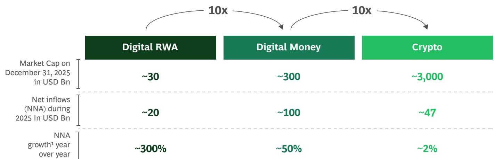  
Sources: rwa.xyz; cryptopolitan; BCG analysis. $^{1}$ Just net inflows, before asset performance.

# Framing: Digital Asset Classes and Market Sizing

# When financial industry decision-makers struggle with their digital asset strategies, they often put it down to the lack of a clear taxonomy or language to describe the many different products and business models.

Given those challenges, a good place to start is with a clear set of definitions and a review of where the market finds itself in 2026.

Digital money such as privately issued stablecoins and central bank digital currencies are digital forms of fiat currency, while digital RWAs are assets that are converted into digital tokens. Conversely, cryptocurrencies (crypto) are an entirely new asset class that is not backed by any asset. Below, we drill down into the characteristics and subclasses of each.

## Digital Money

The digital money landscape is currently dominated by private stablecoins, while public money (CBDCs) and bank-issued digital money (tokenized deposits) remain relatively minor but strategically important for a two-tiered monetary system comprising central and commercial banks.

Digital money refers to digitally native representations of monetary value used for payments, settlement, and liquidity management. They sit close to the core of the financial system and are sensitive to monetary stability and policy. The various forms of digital money may appear similar to each other, but they differ fundamentally in terms of issuers, governance, risk-bearing capacity, and regulatory treatment—differences that become decisive at scale.

Digital money comprises three subcategories:

## • Central bank digital currencies (CBDCs)

CBDCs are digitally represented liabilities of central banks, issued in retail and/or wholesale formats. They are designed to preserve public control over money while modernizing payments and settlement infrastructure. Retail CBDCs target consumers and attract more debate than wholesale CBDCs do because they touch everyday money, privacy, and the role of the state in citizens' financial lives. Finally, despite extensive pilots and a global policy focus, CBDCs remain economically modest in terms of outstanding balances, reflecting a cautious, policy-driven approach rather than a move to immediate scaling.

## - Tokenized deposits

Tokenized deposits are digital representations of commercial bank deposits that are claims on bank balance sheets and are issued within the existing banking framework, meaning they can support fractional banking and lending. We include deposit tokens in this category, as they are largely just a more DLT-native form of the same. These instruments have the potential to enable programmability (the ability to embed rules, logic, and automated action) and fast on-chain settlement, while preserving prudential safeguards. Economically, the category remains nascent, but many institutions are investing, with some of the largest banks such as J.P. Morgan and Citi developing capabilities at scale.

## - Stablecoins

Stablecoins are privately issued digital bearer instruments, typically referencing fiat currencies and designed to maintain stable value. Stablecoins function as digital cash equivalents and are widely used in crypto-native markets. They are also increasingly applied to payments and settlement use cases. With approximately \$300 billion in outstanding value at year-end 2025, compared with \$200 billion a year earlier, they are the dominant form of digital money. The market is highly concentrated, primarily in US dollar-denominated stablecoins issued by Tether and Circle, which both reflect strong network effects and trust dynamics.

## Digital Real-World Assets (RWAs)

Digital RWAs are economically insignificant today but have seen institutional pull, especially where tokenization solves problems such as settlement speed, collateral mobility, and distribution efficiency.

Digital RWAs are tokenized representations of assets existing outside blockchain technology, with legally enforceable claims linking tokens to underlying assets. Unlike digital money, their primary objective is not to serve as a medium of exchange, but rather to improve the efficiency, transparency, and distribution of capital markets assets, as well as custody and asset servicing.

The category includes the following:

\- Tokenized securities, such as bonds, funds, equities, and money-market instruments issued under existing securities laws to streamline issuance, settlement, and life cycle management.

\- Tokenized commodities, most notably precious metals such as gold, where custody, pricing, and legal structures are sufficiently standardized.

\- Tokenized alternatives, including real estate, private equity, private credit, and other alternatives.

In aggregate, the outstanding amount of digital RWAs is relatively small, with a total market capitalization in the order of about \$30 billion at year-end 2025. Some of this is hidden on private blockchains, but most can be seen on public permissionless blockchains. (See Table 1.) When set against about \$300 trillion of investable assets globally, the volume of digital RWAs is a relative drop in the ocean. Still, growth was rapid at about 300% in 2025.

Volumes and Growth of Digital RWA on Public Permissionless Chains $^{1}$

<table><tr><td>ASSET CLASS, IN $BILLIONS</td><td>2023</td><td>2024</td><td>2025</td><td>MARCH 2026</td></tr><tr><td>Tokenized Securities, t/o</td><td>0.8</td><td>4.4</td><td>12.0</td><td>15.0</td></tr><tr><td>US Treasury Debt (MMF)</td><td>0.8</td><td>3.9</td><td>8.8</td><td>10.9</td></tr><tr><td>Corporate Bonds</td><td>&lt;0.1</td><td>0.1</td><td>1.5</td><td>1.9</td></tr><tr><td>non-US Government Debt</td><td>&lt;0.1</td><td>0.1</td><td>0.8</td><td>1.1</td></tr><tr><td>Public Equity</td><td>&lt;0.1</td><td>0.3</td><td>0.8</td><td>0.9</td></tr><tr><td>Actively-Managed Strategies</td><td></td><td>&lt;0.1</td><td>0.1</td><td>&lt;0.1</td></tr><tr><td>Commodities</td><td>0.9</td><td>1.1</td><td>3.6</td><td>5.8</td></tr><tr><td>Tokenized Alternatives, t/o</td><td>0.3</td><td>0.2</td><td>5.6</td><td>5.7</td></tr><tr><td>Institutional Alternative Funds</td><td>0.3</td><td>0.2</td><td>2.6</td><td>2.3</td></tr><tr><td>Private Credit</td><td></td><td>&lt;0.1</td><td>2.4</td><td>2.8</td></tr><tr><td>Private Equity</td><td></td><td></td><td>0.4</td><td>0.3</td></tr><tr><td>Real Estate</td><td></td><td>&lt;0.1</td><td>0.3</td><td>0.3</td></tr><tr><td>Total Digital RWA</td><td>1.9</td><td>5.7</td><td>21.3</td><td>26.5</td></tr></table>

Source: RWA.xyz.

## Crypto

Crypto is economically significant and systemically visible, but it is also the most volatile digital asset and the least anchored to traditional valuation frameworks.

Crypto refers to native digital assets of public blockchains, such as Bitcoin and Ether. These assets are:

\- non-sovereign,

• not liabilities of identifiable issuers, and

• not claims on fiat money or RWAs.

The value of crypto is a function of scarcity, protocol utility, network effects, and investor belief, rather than cash flows or legal claims. As a result, crypto adheres to a fundamentally different economic logic than digital money and digital RWAs do.

At approximately \$3 trillion in market capitalization at year-end 2025, crypto remains by far the largest digital asset category, dominated by Bitcoin (around \$2 trillion) and Ether (around \$500 billion). Bitcoin’s growth dynamics are highly cyclical, sensitive to macro liquidity and risk appetite, and shaped by regulatory access and the availability of institutional investment products.

# BoD View: Digital Asset Benefits, Controversies, and Scenarios

## Few financial industry decision-makers still see digital assets as a niche phenomenon.

More often, they view them as a structural vector that is increasingly active in payments, capital markets, and market infrastructure. Some believe they represent a fundamental challenge to how money is issued, assets are settled, and trust is established. And most agree that their impacts are currently outstripping the speed at which governance frameworks are evolving.

For boards of directors (BoDs), the task in formulating digital asset strategies is not to predict winners, but rather to maximize optionality—and to do that while keeping a firm grip on risk management and operational resilience. That said, decisions taken today amount to high-stakes bets on future market structures, regulatory regimes, and technological paths, and thus require informed discussion and oversight. The following are the key topics we have seen on C-suite agendas:

## The Promise of Digital Assets: Speed, Efficiency, Programmability, and Inclusion

Despite persistent debate over their legitimacy, digital assets continue to attract investment and institutional engagement. The primary reason is that underlying DLT manifestly enables market efficiency and structural improvements that are difficult to achieve with legacy infrastructure.

Some of the benefits could be, and in some cases are, achieved through other technologies. However, DLT is a multipurpose technology, with the power to upgrade financial infrastructure in multiple ways at the same time. A comparable is the introduction of the iPhone in 2007, which consolidated phone, entertainment, information, banking, and many other functions in one device.

## Core economic opportunities

Across categories, five recurring themes emerge:

## 1. Settlement speed

Near-instant settlement reduces counterparty risk, reconciliation costs, and capital tied up in buffers.

## 2. Balance sheet and collateral efficiency

Tokenization improves the mobility, reuse, and real-time valuation of collateral, with direct implications for liquidity and funding efficiency.

## 3. Programmability and automation

Business rules can be embedded directly into assets, enabling automated corporate actions, conditional payments, and compliance checks.

## 4. Global reach and distribution efficiency

Digital assets can be distributed globally with fewer intermediaries, reducing friction in cross-border finance and asset distribution.

## 5. Fractionalization and access expansion

Smaller denominations enable broader participation in assets previously accessible only to large institutions.

## Some illustrative use cases across categories

The themes associated with digital assets increasingly translate into tangible financial impacts. Below are some of the most important use cases and client benefits:

## • Payments and settlement

Stablecoins, tokenized deposits, and wholesale CBDCs enable near-real-time domestic and cross-border settlement. Benefits include lower counterparty risk, less trapped liquidity, and reduced reliance on correspondent banking layers.

\- Treasury and cash management for multinationals
Stablecoins, tokenized deposits, and wholesale CBDCs support cross-border treasury, cash pooling, and internal settlement, all of which improve visibility and control in managing global liquidity positions.

## - Atomic delivery-versus-payment and collateral mobility

Tokenized money and tokenized securities enable atomic delivery-versus-payment (DvP) settlement and rapid collateral recycling across products, venues, and jurisdictions, reducing margin requirements and settlement risk.

\- Issuance, asset servicing, and corporate actions
Tokenized securities enable issuance, life cycle management, and corporate actions (for example, coupons, dividends, margin calls) to be automated and embedded directly into the asset.

\- Institutional distribution of investable instruments
Tokenized funds, government securities, and commodities facilitate more efficient global distribution of investable instruments. The result is faster time to market and lower operational friction in fund and product distribution.

\- Controlled access to alternative and illiquid assets
Tokenized securities enable operationally simpler access to private credit, infrastructure, other RWAs, and commodities, reducing administrative friction rather than merely fractionalizing ownership.

## Why Digital Assets Are Controversial: System-Level Fault Lines

Despite accelerating levels of adoption and investment, digital assets remain controversial. Most of the debate is grounded in the speculative nature of cryptocurrencies such as Bitcoin, which brought DLT technology into the mainstream. The speculative factor is less relevant in the context of digital money and digital RWAs.

That said, there are some deeper controversies that apply across the board. Some are system level and others are institution level, but they all stem from how digital assets challenge the architecture, economics, and governance of the status quo. They also sit the heart of why digital assets provoke such strong and conflicting emotions. (See Exhibit 2.) Moreover, we are convinced that they are unlikely to be resolved anytime soon. Below, we examine eight major points of debate in more detail.

## The core tension: replumbing the existing system versus building a new one

At the heart of the digital asset debate lies a fundamental ambiguity: is DLT a better way to run the existing financial system or is it the foundation for something fundamentally different? In some respects, DLT appears to be a superior plumbing layer. It improves settlement speed, reconciliation, and transparency but leaves the institutional structure of finance largely intact. In other respects, it suggests a more fundamental transformation, creating new market structures that bypass incumbents, intermediaries, and even national infrastructures.

If poorly managed, ambiguity creates strategic jeopardy. If DLT is merely evolutionary, investments can be paced, modular, and integrated gradually. On the other hand, if it is foundational, delayed engagement risks the threat of structural irrelevance.

The most relevant board-level questions are, how do you create optionality for different outcomes and how much optionality can you afford?

## System-Level Fault Lines: Controversies and Tensions

## The Core Tension: Replumbing the Existing System vs. Building a New One

## System-level

Code-Based Democratization vs. Institutional Trust and Protection

Standards, Coordination, and Interoperability

System Stability and Resilience

Institution-level

Incumbents vs. New Entrants: Defend the core or embrace?

Investment Burden and Economic Viability: Who Pays?

Pace of Change and Timing Risk: How fast and how much to invest?

The Meta-Level Question: What is the end state?

Source: BCG analysis.

## System-level tensions

Code-based democratization versus institutional trust and protection

The central promises of digital assets include broader access, automation, and transparency through code. Meanwhile, traditional finance is built on institutional trust, discretionary judgment, and legal accountability. Are these values compatible?

Code-based systems reduce ambiguity and human discretion, but they also restrict flexibility, which is necessary to navigate crises, exceptions, and unforeseen events. Democratization without safeguards risks shifting complexity and losses to less-insulated market participants. It also undermines legitimacy and invites regulatory backlash.

The key question for boards is how to build the necessary safeguards as they invest.

## Standards, coordination, and interoperability

Finance is inherently global, while regulation, supervision, and legal finality remain mostly national. Digital assets expose this mismatch. Without aligned standards for settlement finality, custody, identity, and compliance, interoperability remains partial at best. Early technical or legal design choices risk becoming path dependent, locking the system into fragmented or suboptimal architectures once adoption scales.

This creates a long-term business risk: building a globally fragmented financial infrastructure is not economical because the necessary scale effects will not materialize.

## System stability and resilience

DLT promises real-time transparency and reduced settlement risk. In parallel, it introduces new dynamics that challenge existing stability frameworks. Instant settlement can increase procyclicality; automated liquidation mechanisms can amplify stress; and shared infrastructure layers—protocols, validators, interoperability bridges—can become new systemic nodes.

Regulators are rightly concerned that new forms of “too big to fail” infrastructure could create financial stability risks outside traditional oversight.

## Institution-level tensions

The strategic playing field is not fixed. Its shape differs depending on the point of view of individual institutions. On that basis, there can be no single playbook for digital asset engagement. Instead, banks and other market participants must consider a range of parameters based on their own priorities:

## Incumbents versus new entrants

DLT simultaneously lowers and raises barriers to entry. It enables new entrants to bypass legacy infrastructure, but also favors institutions with scale, consumer trust, regulatory expertise, and balance sheet strength.

This duality creates a strategic dilemma for incumbents: whether to defend existing franchises incrementally or actively reshape them before others do. In other words, defend the core or reinvent it?

## Investment burden and economic viability: who pays?

DLT-based systems often promise lower long-term costs and higher levels of efficiency, but they require significant upfront investment in technology, governance, compliance, and integration.

Crucially, many benefits are systemic, while costs are borne at the institutional level. This creates a collective action problem in which each participant benefits most when others invest first. But there is a risk of coordination failure if nobody invests enough to reach scale, even if the system would be better off collectively.

The question for boards is where to partner, buy, or build themselves.

## Pace of change and timing risk

Early movers gain informational advantages and may have influence over standards but bear higher execution, regulatory, and reputational risk. Also, they incur increased costs when investing “for the team.” Late movers preserve capital but risk dependency, loss of relevance, and vendor lock-in.

Historically, value creation in financial infrastructure transitions has accrued to fast followers with strong balance sheets and sufficient scale to absorb learning costs.

Where can you be, and do you want to be, a first mover versus fast follower or late adopter?

## The meta-level question: What is the end state?

All these tensions ultimately collapse into a single unresolved question:

Is DLT a better plumbing layer for the same financial system, a fundamentally new financial architecture, or a permanent parallel system?

This question remains open, but all investment decisions implicitly bet on an answer, whether acknowledged or not. The persistence of this uncertainty explains why digital assets continue to generate both momentum and resistance, and why forward-looking decision-makers are likely to adopt scenario-based approaches rather than linear forecasting as they consider their strategy.

## Four Scenarios for Financial Market Decision-Makers

The evolution of digital assets will not follow a linear path, largely because it is subject to many influences: technological progress, solutions for interoperability, regulatory endorsement, geopolitics, and, most importantly, consumer adoption creating network effects for a larger scale-up.

Instead, it is likely to unfold across a small number of distinct but plausible futures, shaped by the interaction of market forces, regulation, technology, and trust. The scenarios below describe four potential end states, each uniquely resolving today's tensions and carrying materially different implications for financial institutions, regulators, and clients. (See Exhibit 3.)

Scenarios 1 and 3 in the exhibit assume rapid adoption of digital assets, with roughly 16% of investable assets tokenized by 2035 and digital money reaching significant volumes. The difference between the two lies in the manner of expansion. In scenario 1, it is privately led, with stablecoins becoming a significant source of digital money. In scenario 3, it is institution led, with tokenized deposits and wholesale CBDC playing the major role.

Scenario 2 implies digital adoption in a fragmented multi-track system, with prolonged regulatory fragmentation that slows adoption and limits interoperability. Finally, scenario 4 represents a backlash in which digital assets are constrained: in short, a base case for a world without digital assets.

You can find the detailed assumptions for these scenarios in the later section “Scenarios: where threats meet opportunities.”

## Four Scenarios on the End State of Digital Assets

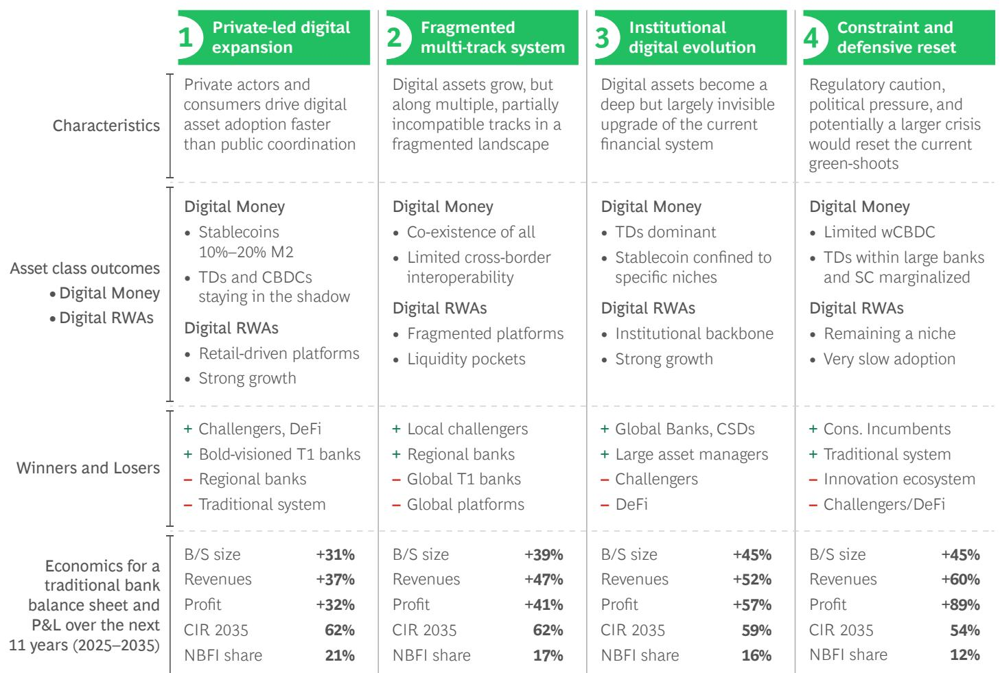

Source: BCG analysis.

## Potential Financial Outcomes and Inflection Points

Taken together, the scenarios suggest that the future of digital assets is unlikely to be binary. Each scenario resolves today's tensions differently, creating distinct distributions of value, risk, and control.

That said, while financial market participants can benefit in many ways, it is reasonable to think that the long-term net effect will be significant pressure on business models, revenue pools, margins, costs, and profits. $^{2}$ (See Exhibit 4.)

We see three overarching pressure points:

1. Tokenization shifts value to issuers and consumers with less need for intermediaries. On that basis, all scenarios for digital asset growth are net negative for current industry revenues.

2. Tokenization accelerates the secular trend of value migration from banks to non-bank financial institutions (NBFIs). If the total market compresses, banks compress even more.

3. Tokenization requires significant infrastructure investment and operation of dual rails, which create additional pressure on profit pools.

In scenario 1, rapid digital expansion, our assessment leads to a reasonable expectation of the following financial impacts by 2035 compared with the base case (Scenario 4 by 2035):

• 10% smaller bank balance sheets

• 14% less bank revenues

Result: Significantly Different Outcome for Banks by Scenario
Development of total global banking revenues, after value migration, in different scenarios
Banks’ Global Revenues (USD Tr)

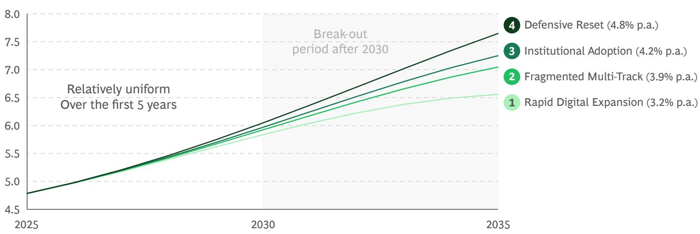  
Sources: BCG Banking Pools; Industry Data; BCG analysis.

• 9% market share lost to NBFIs

• 8 ppt higher Cost-to-Income Ratio (CIR)

• 30% less profits versus base case

The model illustrates the threat of missed banking value creation over the next decade and an erosion in client relevance.

However, there are many opportunities for individual banks and the industry in aggregate (see section on Banking Business Lines: One Bank, Many Outcomes).

Banks can introduce new services to compete with non-banks; improve cost, capital, and liquidity efficiency; and draw out significant value. For the average G-SIB with a large bank-owned asset manager, a bottom-up analysis illustrates very sizeable opportunities, despite the headwinds previously described:

\- . Banks can introduce new services to compete with non-banks; improve cost, capital, and liquidity efficiency; and draw out significant value. For the average G-SIB with a large bank-owned asset manager, a bottom-up analysis illustrates very sizeable opportunities, despite the headwinds previously described: \$340 million–\$600 million personal banking revenue upside, driven primarily by recapturing retail and wealth trading as well as lending on crypto assets, which currently lies largely with non-banks

\- \$200 million–\$600 million of annual corporate banking revenue upside, driven by capturing new opportunities in treasury solutions, stablecoin-enabled cross-border payments, banking services for crypto-native firms, and crypto IPO/ECM/advisory revenues

\- Unlocking a 15%–30% revenue uplift (\$1.2 billion–\$2.5 billion) for a \$2 trillion asset manager by increasing asset capture, enhancing product mix, and scaling distribution efficiency

\- Up to 4% higher RoE for trading businesses, translating into a \$1+ billion profit opportunity, driven by higher asset turnover, materially lower capital intensity from faster settlement and netting, and structural cost reductions through automation, despite compressed unit margins

But what would it take for digital assets to scale? What are the inflection points? Our base case is that development will be incremental at first but will accelerate across four dimensions: customer adoption, policy and regulation (which has seen significant advancement over the past 12 months), technological infrastructure, and interoperability. (See Exhibit 5.)

Finally, for boards and senior management, the challenge is not to select the “right” scenario, but rather to recognize which future state is favored by current thinking, and to ensure that the organization retains sufficient optionality to remain relevant across multiple outcomes.

## What Needs to Happen? | Four Key Conditions Required for Digital Assets to Scale

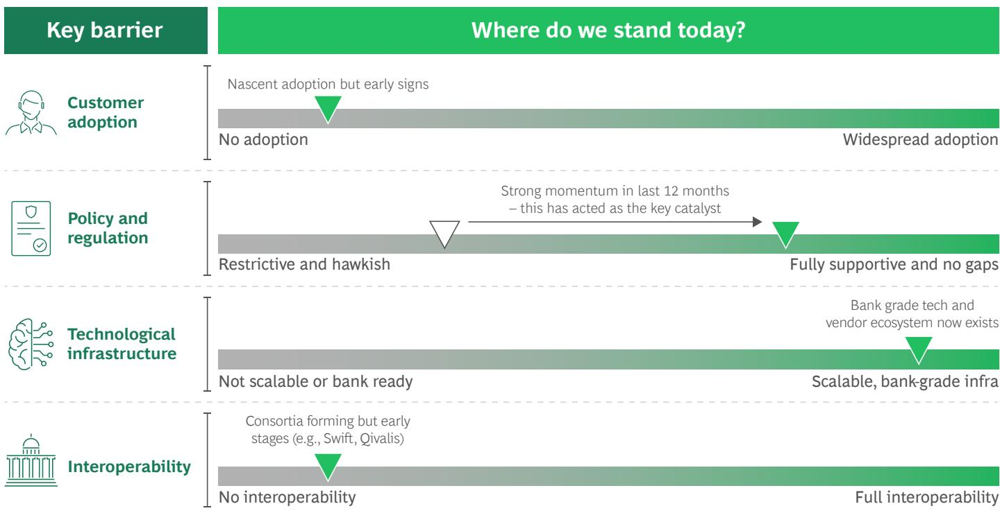  
Source: BCG analysis.

## Implications for BoD Decision-Making

The future is uncertain, but the question for boards is no longer whether to engage, but how to plan for and potentially oversee a structural transition to a new system.

Every choice on digital assets, including the choice to delay action, embeds implicit bets about future market structure, regulatory convergence, and the balance between private platforms and public institutions. Even neutrality cannot be neutral. Thus, leading institutions surface and test their assumptions explicitly.

Scenarios: Because outcomes are uncertain and path dependent, board decisions cannot be based on market forecasts alone. Instead, they need scenario-based analysis, which can help them distinguish between no-regret capabilities, option-value investments, and actions that could threaten the franchise. The overarching objective should be to preserve strategic flexibility across multiple plausible futures.

Risk Management: Digital assets compress operational, market, compliance, and reputational risks into faster-moving control points. Board oversight must therefore ensure clear accountability, authority over automated systems, and the availability of crisis playbooks that are

adapted to real-time, programmable markets. A key preoccupation should be to avoid new forms of hidden concentration and dependency risk.

External Posture: A bank's digital asset posture sends strong signals to regulators, clients, talent, and investors. Misalignment between ambition, capability, and risk appetite undermines credibility. Thus, boards must play a critical role in ensuring that innovation narratives are matched by governance discipline and institutional readiness.

Ultimately, digital assets require boards to move from passive oversight to active steering. Success will not be achieved by the most aggressive or most cautious, but by those investing early to learn and maintain control, and those avoiding bets that jeopardize an institution's long-term trust and stability.

When asked how this transition can be financed while potentially maintaining dual rails for many years to come, we point to narratives around this problem from other industries, namely the transformation of the telecom industry over the past 30+ years.

# Technology Transitions as Parallel Runs The Telecommunications Experience

The telecommunications transition from circuit-switched voice to packet-switched IP networks unfolded over more than two decades—a powerful analogy to financial institutions’ potential dual-rail challenge. Voice-over-IP gained commercial traction in the late 1990s, but large incumbents did not initiate structural migration programs until the early-to-mid 2000s. For example, BT launched its 21st Century Network program in 2004, aiming to migrate multiple legacy networks onto a unified IP core. Yet, even then, the transition was not a replacement but a parallel run: circuit- and packet-switched networks coexisted for well over 15 years.

Customer demand was the decisive catalyst. Enterprises sought integrated voice and data services, global connectivity, and lower costs. Consumers asked for broadband internet. IP networks enabled these capabilities flexibly and at lower marginal cost. However, regulatory obligations, emergency calling requirements, and the installed base of customer equipment made abrupt transformation impossible.

Throughout the 2000s and 2010s, operators ran both infrastructures concurrently, funding IP investments from stable legacy voice revenues. In the UK, the formal circuit switch-off was scheduled for 2025, nearly 20 years after large-scale IP migration began. The telco experience demonstrates that, in mission-critical, regulated network industries, superior technology drives gradual migration, not immediate replacement.

# Executive Committee View Understanding and Acting on Digital Assets

This chapter takes the discussion one level further, creating a foundation for more detailed executive-committee-type discussions and decisions.

We discuss the different types of digital assets in more detail and extend the scenarios from the BoD View chapter individual business lines. Finally, we outline the current regional differences in digital asset regulations and supervisory regimes.

## Digital Money and a World of Contentions

The current dominant form of digital money is stablecoins, which are mostly pegged to the US dollar. After strong growth in 2025, the stablecoin market cap has reached roughly \$300 billion, which is still a minor amount when set against the global money supply of \$57 trillion, but big enough to matter. That said, when considering digital money, the right question to ask is not, “Stablecoins, yes or no?” Instead, executive teams should focus on the following:

\- Which form of digital money is the preferred settlement asset for what use cases?

\- How do they protect the franchise while capturing the benefits of tokenized money?

\- Where is real value being delivered today and potentially tomorrow?

What are the contentions? At their core, monetary systems are based on who issues “money” and what backs it. The modern two-tier monetary system is based on central bank money as the ultimate settlement asset and public backstop and commercial bank money (deposits) for credit creation through maturity transformation, but which also serves as the dominant transaction medium, kept at par through regulation, infrastructure, and central bank liquidity support.

Stablecoins, instead, revive an old idea: narrow banking or full-reserve money.

A typical fiat-backed stablecoin issuer promises redemption at par and backed by high-quality liquid asset (HQLA) reserves against the issued tokens, much like an old-fashioned traveler's check, but with always-on infrastructure and atomic settlement.

For private and corporate clients, stablecoins' narrow-banking promise offers the following:

\- Cash-like peer-to-peer payments without intermediaries

\- Global reach, 24x7 settlement, transfers, and finality beyond banking hours

\- Programmable functions such as escrow, conditional release, and automated reconciliation embedded into the tokens

\- Store of value via a dollar-like instrument in which domestic inflation, FX controls, and correspondent frictions are material

However, traditional critique of narrow banking maps directly onto stablecoins at scale:

\- Disintermediation risk. If transaction balances migrate from deposits to stablecoins, deposit volumes may fall and credit capacity will shrink or migrate to capital markets.

\- “Cash-in-advance” constraint. Stablecoins require upfront funding for issuance; they do not generate settlement liquidity like the two-tiered banking system can, and this undermine market elasticity.

\- Singleness and integrity challenges. If multiple private tokens trade at slightly different prices and circulate on rails on which compliance controls are uneven, “one dollar equals one dollar” and “no questions asked” acceptance can weaken.

This is the heart of the system-level question: stablecoins benefit the consumer in many ways, but they also question the current monetary architecture and may introduce different, less-known risks.

In its June 2025 Annual Economic Report, the Bureau of Industry and Security (BIS) said that tokenization can be transformative, but that stablecoins “fall short” as the mainstay of a future monetary system when assessed in terms of singleness, elasticity, and integrity. BIS instead advocates a next-generation architecture built on a trilogy comprising tokenized central bank reserves, tokenized commercial bank money, and tokenized government bonds on a “unified ledger.”

There is a contrarian view, often expressed by decentralized finance (DeFi) builders, that BIS mistakenly assesses stablecoins in the context of a bank-centric ideal, rather than open networks in which singleness, elasticity, and integrity are achieved in different ways. In that context, the argument is that the BIS idea of a “unified ledger” is based on a vision of closed, permissioned silos, which slow innovation and add geopolitical chokepoints, whereas public chains already offer global interoperability.

Next to this systemic debate, there are more contentions in the geopolitical sphere, for example, around the potential “dollarization” of economies through dollar-denominated stablecoins, which could threaten monetary sovereignty. Another debate is the role of stablecoins in sovereign financing, through holding short-term treasuries as reserve assets. Notably, Tether was the third-largest foreign US T-bill holder as of December 2025, as illustrated in Table 2.

## Stablecoins, tokenized deposits, CBDCs: Which will prevail and why?

Our base case is that all three forms of digital money will coexist. Absent a monetary regime change, the volume of stablecoins will be limited, while tokenized deposits and CBDCs will require significant coordination and shared infrastructure upgrades to scale. The exact outcome, however, remains a matter of conjecture. Below we examine the pros and cons of each asset:

## Stablecoins: private, bearer-like tokens on public rails

While there are material concerns around stablecoins, they also provide a tangible value promise to consumers, and issuers. These are some areas in which they can naturally win:

\- Slow and expensive payments, with lots of intermediaries, where there are no established instant payment networks. For example, G7-to-EM payment flows are worth about \$40 trillion–\$60 trillion and are wholesale dominated, providing a substantial opportunity.

\- Agentic micropayments are a plausible wedge for stablecoins, not because traditional rails cannot support them, but because stablecoins are better suited to cross-border, always-on, low-ticket, programmable transactions.

\- Composability in on-chain markets (crypto and digital RWA market-making, exchanges, DeFi), where stablecoins are the dominant settlement leg today.

Ranking of Non-US Holders of US T-Bills

<table><tr><td>RANK</td><td>FOREIGN HOLDER</td><td>T-BILLS, $ BILLIONS</td><td>SHARE OF TOTAL</td></tr><tr><td>1</td><td>Cayman Islands</td><td>154.5</td><td>10.87%</td></tr><tr><td>2</td><td>Japan</td><td>139.2</td><td>9.80%</td></tr><tr><td>3</td><td>Tether (USDT)</td><td>122.3</td><td>8.61%</td></tr><tr><td>4</td><td>Luxembourg</td><td>103.3</td><td>7.27%</td></tr><tr><td>5</td><td>Ireland</td><td>99.6</td><td>7.01%</td></tr><tr><td>6</td><td>Belgium</td><td>84.1</td><td>5.92%</td></tr><tr><td>7</td><td>United Kingdom</td><td>79.1</td><td>5.56%</td></tr><tr><td>8</td><td>Switzerland</td><td>58.9</td><td>4.15%</td></tr></table>

Source: US Treasury Department, Tether.

Stablecoins are most beneficial wherever parties are not connected through efficient payment rails or already interact on public chains, such as in crypto trading.

## Tokenized deposits: commercial bank money re-platformed but with two disadvantages

Tokenized deposits aim to keep deposits economically the same while shifting representation and transfer mechanics through DLT. In other words, tokenizing a deposit claim does not, by itself, change its fundamental nature as a claim on the balance sheet of a credit institution.

From a two-tier system perspective, tokenized deposits are attractive because they can preserve both the regulated perimeter (prudential rules, conduct, resolution) and singleness when designed to settle in central bank money (a core BIS preference versus bearer stablecoins).

Still, there are two strategically decisive disadvantages that should be explicit in any board-level discussion:

1. Counterparty risk (by design). A tokenized deposit is still an exposure to an issuing bank. Retail deposit insurance and bank resolution regimes mitigate this for many customers, but wholesale and cross-border holders may not benefit symmetrically, and perceptions can shift quickly under stress.

2. Interoperability and fragmentation. Without common standards, governance, and settlement arrangements, tokenized deposits can easily become bank-specific “walled gardens.” This is not an academic concern, as tokenization initiatives often start as closed-loop networks. However, scaling requires either robust interbank interoperability or a shared venue (for example, a unified ledger) where different forms of tokenized money and assets can be exchanged synchronously. As prominent examples, project Agora from BIS and Partior, a commercial bank consortium, aim to develop solutions for this problem.

Tokenized deposits are most beneficial for large-transaction banks. Use cases include internal bank settlements and wholesale payments where both payors and payees are clients of the same bank. Most activity to date has been at-large institutions such as J.P. Morgan and Citi.

For smaller banks, there is an affordability question around building new infrastructure when the benefits may be limited absent a new “unified ledger” as envisioned by BIS.

## CBDC: public money in digital form with wholesale and/or retail formats

CBDCs are central bank liabilities in digital form. A 2024 BIS survey shows that 85 out of 93 surveyed central banks were engaged in CBDCs in some way. But while the first live applications are emerging, including a Chinese retail CBDC called e-CNY and the Swiss wholesale CBDC (project Helvetia), no use case has yet been adopted at scale.

For banks, the highest-impact CBDC pathway is not a universal mass retail instrument (rCBDC) displacing bank deposits, but the tokenization and programmability of wholesale central bank money (wCBDC) on top of an already central bank-centric settlement core. Key benefits include the following:

\- Atomic settlement, as in stablecoins and tokenized deposits

\- Interest payments at central bank rates as a key benefit versus stablecoins

\- The risk-free nature of central bank money as a key advantage versus tokenized deposits

A factual argument against CBDCs is that the current US administration has restricted the establishment of a USD CBDC, which questions the global interoperability of CBDCs.

## Which form of digital money will prevail?

The simple answer: all three will coexist. The honest answer: we do not know exactly how.

Even in a scenario where stablecoins would gain strong adoption, their volumes would be naturally capped at around 15% of M2 money supply, whereas central bank and commercial bank money would still dominate the monetary system. Absent a fundamental system change where stablecoins would become legal tender, pay interest, and be protected by an insurance scheme, this is a maximum to be expected.

Conversely, there is a scenario in which the current system, including global correspondent banking, would be modernized end to end through CBDCs and tokenized deposits, which would offer many of the advantages of stablecoins and confine them to more narrow use cases. The BIS “unified ledger” approach has this intention.

There are also geopolitical and sovereignty considerations. Mainland China has banned stablecoins, and India's currency controls effectively ban them too. If stablecoins have no presence in two of the four largest economies in the world—and two of the fastest-growing ones—then the promise of global adoption will never be realized.

# Why 15% of M2 Money Supply Represents a Maximum Stablecoin Equilibrium

A stablecoin share of roughly 15% of M2 (or \$9 trillion at 2025 levels) can be understood as a natural equilibrium between payment utility, yield incentives, credit needs, and policy tolerance.

Fiat-backed stablecoins are zero or low yield, fully backed, and non-credit creating. They function as highly efficient payment instruments but do not fund lending or perform maturity transformation. Economically, they sit between cash and MMFs.

Cash provides the lower bound. Across advanced economies, it typically represents 5%–10% of M2. Despite being universally accepted and risk free, its zero yield limits holdings. Stablecoins remove storage frictions and are more efficient for digital payments, so they can exceed cash, but not by multiples.

MMFs provide the upper bound. They are liquid, yield-bearing, near-par instruments, yet even in developed markets they typically account for \~15%–20% of M2-like aggregates, especially when focusing on retail balances. The reason is structural: MMFs are investment vehicles, not payment instruments. They compete for surplus balances, not for transaction money.

Stablecoins invert this trade-off. They are superior for payments but inferior as a store of value. As a result, they primarily absorb transactional and precautionary balances, not long-term savings. Once holdings exceed what households and corporates need for working capital and buffers, opportunity cost dominates and funds migrate into yield-bearing assets.

A second constraint comes from the credit system. As stablecoins displace deposits, bank funding tightens and credit becomes more expensive. Higher lending rates and spreads attract capital into alternative credit channels, further reducing the relative attractiveness of holding large non-yielding balances. This creates a self-correcting feedback loop.

Taken together, these forces imply a stable mid-teens equilibrium. Stablecoins can meaningfully improve payments and capture a share of money holdings above cash levels, but they are constrained by yield dynamics, credit requirements, and institutional structure. At around 15% of M2, they reshape payments and bank funding without fundamentally displacing the broader monetary system.

## Real value delivered today

Tokenized deposits and CBDCs are generally still being piloted, while stablecoins have reached a first level of critical mass at which tangible economic value is being delivered. (See Table 3.)

Our analysis suggests that the majority of stablecoins ( $\sim$ 65%) are being used in crypto trading or related DeFi activities. The second largest bucket is the “store of value” use case in emerging markets, accounting for about 25% of the total. Only about 10% of current stablecoin supply is float tied to real economy payments.

Exploring the flow rather than the “stock,” we estimate that raw stablecoin transfers exceeded \$62 trillion in 2025. That said, the total was about \$4.2 trillion after removing non-economic activity (bots, protocol mechanics, routing), and only about \$350 billion–\$550 billion reflected observable bilateral payments for goods and services. Within those payments, B2B was the largest segment (\~40%) and was growing rapidly. Consumer-to-consumer payments were also growing fast. Crypto-linked card payments, such as Coinbase card and others, were not included in this, and are comparably small, yet also growing fast. (See Exhibit 6.)

Compared with total global payments, these are tiny numbers, but they are rising fast.

## Should banks issue stablecoins?

The temptation is real. At scale, stablecoin issuers capture attractive economics associated with customer float, transaction activity, and—most importantly—the yield on reserve assets. Tether is often cited as proof that a “payments wrapper” can become a highly profitable treasury business. It is estimated that Tether made a surreal \$98 million in profit per employee in 2024.

Yet, issuing stablecoins is far from being a conventional product launch. A single bank will rarely have the distribution power to foster broad acceptance of its coin across wallets, exchanges, merchants, and cross-border corridors. Without network effects, the coin risks becoming a proprietary instrument that sits idle or trades with friction. There are already many of these “insignificant stablecoins” and the current market structure, dominated by Tether and Circle, suggests a “winner-takes-most” outcome.

There is a stronger rationale for bank issuance as a consortium or industry utility play. Reasons to pursue this strategy are threefold: (1) to create a hedge for a potential stablecoin market outcome, (2) to use bank distribution power, a key economic factor in issuer profits, and (3) to share costs and risks. These benefits are strategic, creating options rather than a short-term business case.

In the meantime, the higher-return priority would be the customer interface: offer secure, bank-grade wallets and orchestration that enable clients to hold their digital assets with the bank. Customer wallets serve a real client need today and create value regardless of which money instrument wins.

## TABLE 3

Stablecoin Usage Today: Analyzing the “Stock”

<table><tr><td>USE CASE BUCKET</td><td>SC VALUE ($ BILLION)</td><td>SHARE</td><td>ASSUMPTIONS</td></tr><tr><td>Crypto market “cash leg” and collateral</td><td>120–180</td><td>40%–60%</td><td>Exchange balances ($69 billion observable) plus off-exchange trading inventory (OTC, market makers, custodians, derivatives margin)</td></tr><tr><td>DeFi liquidity &amp; on-chain credit</td><td>25–50</td><td>8%–17%</td><td>Lending/borrowing, DEX liquidity, perps margin, vaults (Ave alone is &gt;$16 billion supplied)</td></tr><tr><td>Real-economy payments</td><td>15–35</td><td>5%–12%</td><td>Working balances for B2B settlement, remittances, merchant/PSP float; assuming 15–30 payments velocity</td></tr><tr><td>Store-of-value/“digital dollar” holdings (esp. EM)</td><td>50–100</td><td>17%–33%</td><td>Households/SMEs/corporates holding stablecoins as dollar exposure and as an alternative to fragile local money; also relates to cross-border net flows</td></tr><tr><td>Other/mixed</td><td>5–25</td><td>2%–8%</td><td>Fragmented use cases: small-scale tokenized settlement experiments, platform ecosystems, gaming, etc.</td></tr><tr><td>Total</td><td>~300</td><td>100%</td><td>Total Stablecoin Market Cap Dec 2025</td></tr></table>

Sources: Various, BCG analysis.

Stablecoin Payments Today: Analyzing the “SC Payments Flow”

USD B, Jan 2025 to Dec 2025

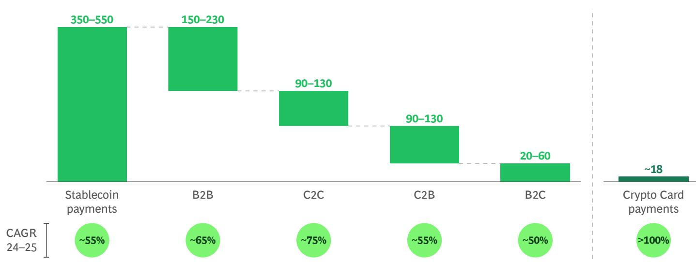  
Sources: Allium database; Artemis Jan 26 report; BCG analysis.

## What next? From rail competition to platform competition

In the next phase of the market's evolution, the center of gravity is likely to shift from “which token” to which settlement platform and who governs it. Below are some headline expectations:

## 1. Regulation will channel stablecoin use into defined perimeters

BIS emphasizes in its Annual Economic Report 2025, chapter III, the need to channel legitimate use cases into the regulated monetary system without undermining financial stability. Expect continued regulatory tightening around:

\- the ability to pay yields or yield-like rewards,

\- issuer reserve composition and segregation,

• redemption rights and liquidity management,

\- capital needs,

\- potential volume caps,

• operational resilience, and

\- financial crime controls.

For banks, the strategic message is that regulatory clarity tends to accelerate adoption by reducing legal and operational ambiguity, but it also compresses “unregulated arbitrage” business models.

2. Tokenized deposits will require an interoperability agenda, not just a product launch
For most banks, tokenized deposits will not be scaled on branding alone. The critical path will run through:

\- common standards (identity, messaging, smart-contract controls),

\- shared ledger for deposit tokens to be swapped atomically, and

\- settlement arrangements with central bank money/CBDCs.

In effect, the BIS vision of a “unified ledger” is a blueprint for solving exactly this interoperability and singleness challenge on a systemic scale. Likewise, the Financial Stability Board has highlighted that tokenization benefits depend on interoperability and that bridge-like third parties introduce additional risk when interoperability is not native.

3. Capital market models are the likely “inflection zone” The most strategically important battleground for banks is wholesale settlement in the capital markets value chain, including the following:

• DvP in tokenized securities

\- PvP in FX

• Collateral management and intraday liquidity

In that world, the choice of settlement asset is not cosmetic: the use of commercial bank money (tokenized deposits), stablecoins, or CBDCs will undermine the system's economic profile, especially under stress.

4. In the long term, the user experience will hide the rail; value will accrue to orchestration
In mature digital money systems, end users will not choose “stablecoin versus deposit token versus CBDC.” Instead, they will decide on:

\- a trusted provider,

\- a compliance and identity wrapper, and

\- a promise of availability, cost, and finality.

Banks that win will orchestrate across rails: account-to-account, Real-Time Gross Settlement, instant payments, tokenized money networks, and, where appropriate, public-chain settlement, without importing unacceptable integrity risk. However, in the shorter term, decision-makers can start the process of moving forward. The box below shows a potential agenda.

## An Illustrative Board Agenda Digital Money Decisions for the Next 6–18 Months

## 1. Define a digital money target state by domain (not a single enterprise posture).

Cross-border treasury, capital markets settlement, high-value institutional payments, and certainly retail payments will not converge on identical instruments.

2. Offer wallets to your clients—they currently have them with others.

A significant share of adults have crypto wallets separate from their primary banks. Offering wallets to clients allows you to provide value-add services such as FX and others.

## 3. Explicitly formulate your view on tokenized deposits: "product" versus "network strategy."

If you do not represent one of the largest banks globally, a tokenized deposit without interoperability is likely to be a feature. In that context, an interoperability roadmap is the right strategy.

4. Choose your approach toward stablecoins: embrace, allow, or wait.
Issue bank-led stablecoins with others as a hedge, work with third-party stablecoins, or wait and observe.

5. Reassess liquidity and run-risk assumptions in tokenized environments.

Tokenization can reduce counterparty risk via atomic settlement, but it can also increase prefunding needs and impact liquidity dynamics. These are board-level balance sheet issues.

## 6. Engage with central bank/industry tokenization initiatives (especially wholesale).

The governance and standards choices made now will determine whether banks are infrastructure shapers or price takers in the next settlement stack.

## Digital RWA: A Capital Markets Transformation

It is not a stretch to say that digital RWAs represent a fundamental rearchitecting of capital markets: the same underlying securities and real assets, but issued, held, transferred, and serviced through new digital rails. Unlike digital money, digital RWAs are investment instruments—bonds, funds, structured credit, commodities, and alternatives—whose ownership and life cycle events are represented and executed in tokenized form.

The distinction matters because the value creation mechanisms differ. Digital money's primary job is to provide a unit of account and settlement finality (the cash leg). Digital RWAs' job, conversely, is to simplify the “asset leg” across issuance, transfer, custody and asset servicing. Yet, the two innovations reinforce each other: tokenized assets without tokenized settlement leave frictions at the cash interface, while tokenized cash without tokenized assets is a faster pipe connected to slow, batch-based post-trade processes and vice versa. (See Exhibit 7.)

The combined proposition is atomic DvP and near-real-time finality. By compressing settlement timelines from days to minutes (T+0), digital RWAs reduce reconciliation processes, operational breaks, and failed settlements. They also

mitigate the need for prefunding, margin buffers, and intraday credit. Programmability accentuates the transformation: compliance checks, transfer restrictions, coupons, redemptions, distributions, and corporate actions can be executed as rules embedded in the instrument rather than as manual, exception-driven processes.

Importantly, digital RWA is not a single product category, but an infrastructure transition. Adoption is already clustering where there is economic value (collateral mobility, repo settlement, tokenized funds), while more complex asset classes (notably public equities) are lagging behind due to legal, governance, and market infrastructure dependencies. For incumbents, the strategic question is less about whether tokenization happens and more about where in the value chain to participate, as well as how to capture value as the rails evolve from pilots to shared market infrastructure.

## EXHIBIT 7

## Momentum | We Are Starting to See the Digital Assets Flywheel Spin

## Stablecoin: \~\$300BN and growing

• Live already with \~\$300BN market capitalization

\- Regulation is developing and has attracted active participation from market players

## CBDC: Different views by markets

\- >90% of central banks are studying applications of CBDCs

\- Some countries have banned CBDCs while others are actively pursuing

Tokenized Money

Tokenized finance flywheel

## Tokenized deposits: Live for corporates across several large FIs

\- >5 global banks tested and some went live; e.g., HSBC, J.P. Morgan, Citi, DBS, Deutsche Bank, Standard Chartered, BNY

Sources: RWA.xyz, BCG analysis.

√ Ready for scale adoption

Emerging with initial scale, but growing

## Fixed Income: Largest category

L Assessment in progress (e.g., pilots, internal use)

\- \~\$10B tokenized US Treasuries (MMF)

\- \~\$2B Corp. Bonds

\- \~\$1B non-US Gov. Debt

## Commodities: Explosive growth in 25

\- \~\$1BN in Jan-25 to \~\$4BN in Jan-26

• Primarily Gold offerings today

## Equities: Offerings being developed

Tokenized RWAs & VAs

\- \~\$800M in total tokenized value

• NYSE, NASDAQ developing offerings

## Alternatives: \~\$5BN AUM & growing

\- Private Credit, Private Equity

• Real Estate

Collateral & Repo: Already live and adoption growing

• J.P. Morgan and Broadridge have live platforms for tokenized repos

## Poised for growth

Over the next decade, our base case is for digital RWAs to scale from today's early pockets of production into a meaningful share of global investable assets. Our progressive digital asset scenarios assume that about $16\%$ of investable real-world assets will be represented in tokenized form by 2035, with significant variations by asset class. (See Exhibit 8.)

Three forces are shaping this trajectory:

## 1. Clear, monetizable efficiency gains

The short-term value pools sit in post-trade. Faster and more predictable settlement and improved collateral velocity reduce both cost and balance sheet intensity.

## 2. Maturing institutional rails

Privacy-enabled, interoperable networks (for example, Canton) and production-grade repo/collateral platforms reduce technology and operating model risks that held back earlier pilots.

3. Regulatory normalization of digital settlement assets
Digital asset legislation in the US boosts the likelihood that tokenized cash legs can scale, which is a prerequisite for widespread DvP with tokenized securities.

Outcomes will differ by asset class, with MMF, securitized debt, and corporate bonds at the vanguard, while government bonds and equities face challenges, as outlined in Table 4.

The progress of these asset classes is unlikely to be linear. Instead, growth will probably accelerate when tokenized cash, legal certainty, and interoperability converge—and when a few “utility” use cases (collateral and fund tokens) become broadly accepted as market infrastructure rather than bespoke projects.

## EXHIBIT 8

Digital RWAs Are Expected To Experience Very Strong Growth
Progressive scenarios mounting to 16% of total RWAs by 2035

Digital RWA projection (In USD trillion)

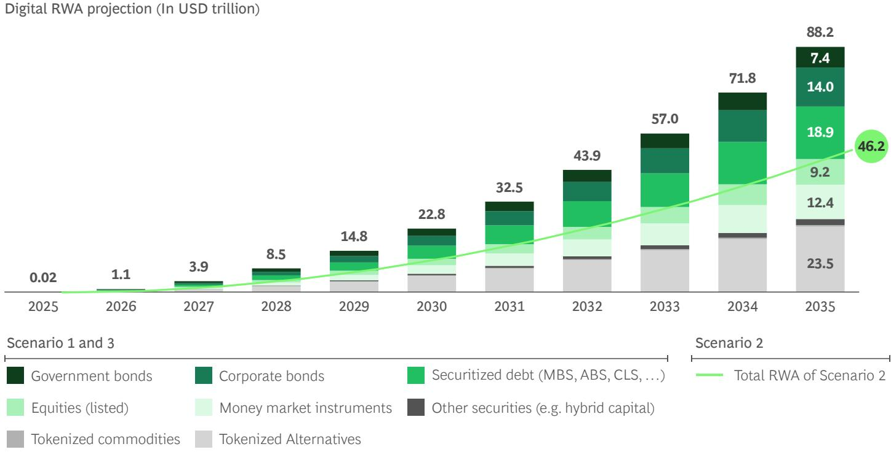  
Source: BCG analysis.

"I do believe we're just at the beginning of the tokenization of all assets, from real estate to equities to bonds—across the board." LARRY FINK ON CNBC, OCT 14, 2025

Asset Class Tokenization Potential by 2035 (Estimated)

<table><tr><td>ASSET CLASS</td><td>PENETRATION (%)</td><td>RATIONALE</td></tr><tr><td>Government bonds</td><td>3%-5%</td><td>Highly standardized, politically sensitive, CCP-anchored; tokenization limited to bills, repos, and selected wholesale pilots</td></tr><tr><td>Corporate bonds</td><td>10%-15%</td><td>Strong case in private placements, EMTNs, short-dated issuance; public benchmarks migrate slowly</td></tr><tr><td>Securitized debt (MBS, ABS, CLOs, etc.)</td><td>20%-30%</td><td>Structuring complexity, life cycle events, and opacity make this one of the strongest candidates</td></tr><tr><td>Equities (listed)</td><td>3%-7%</td><td>Governance, market structure, and exchange incumbency constrain adoption; limited to private-to-public transition and niche venues</td></tr><tr><td>Money market instruments</td><td>25%-40%</td><td>Operationally intensive, balance-sheet heavy, already short-dated and institutional—prime for on-chain issuance</td></tr><tr><td>Other securities (hybrid capital, etc.)</td><td>15%-25%</td><td>Bespoke terms and lower liquidity favor programmable issuance</td></tr><tr><td>Commodity funds</td><td>40%-50%</td><td>Strong growth in tokenized precious metals observable for a crypto-savvy customer base</td></tr><tr><td>Alternatives</td><td>25%-35%</td><td>Increasing accessibility of alternatives for a larger client base, tokenization of new assets (private credit, real estate)</td></tr></table>

Source: BCG analysis.

## Capital markets promise

While tokenization touches every stage of the capital markets value chain, its largest economic impact currently sits downstream, in settlement and clearing, custody, and asset servicing. (See Exhibit 9.) For banks, there can be tangible benefits:

\- For a global bank with \$100 billion in daily repo volume, \$150 million–\$300 million in savings through reduced idle collateral and accelerated settlement cycles.

\- For \$100 billion in investment-grade bond issuance, \$40 million–\$60 million of annual savings through fewer intermediaries and automated issuance, settlement, and compliance via smart contracts.

\- For a real estate fund with \$5 billion in assets under management (AUM), savings of \$100 million–\$150 million over five years through automated administration. Additionally, \$500 million–\$1 billion in new capital via fractional ownership and broader investor access.

In primary markets, digital RWAs enable native on-chain issuance of bonds, funds, private assets, and structured products. Issuance cycles shorten, servicing logic can be embedded directly into the instrument, and cross-border distribution becomes technically simpler. The economic substance of the asset does not change, but the issuance process becomes faster, cheaper, and more standardized. (See Exhibit 10.)

In secondary markets, tokenization enables 24/7 trading, fractional ownership, and peer-to-peer transfers subject to compliance rules. This can boost turnover and accessibility, particularly in less-liquid assets. However, liquidity fragmentation across venues and chains will remain a structural risk unless interoperability and standards converge.

The core inflection point lies in settlement and clearing. Atomic DvP using tokenized cash enables near-instant settlement, materially reducing counterparty exposure, margin requirements, and prefunding needs. Settlement, clearing, and custody functions partially converge, challenging traditional Central Counterparty (CCP) and Central Securities Depository (CSD) models and releasing capital previously tied up in settlement buffers.

Custody evolves from recordkeeping toward control, governance, and digital risk management. Secure key management, access control, and operational resilience become central capabilities. Asset servicing is transformed through programmability: coupons, redemptions, corporate actions, capital calls, and compliance checks can be automated at the asset level, reducing reconciliation, manual intervention, and error rates.

Across the value chain, digital RWAs enable real-time collateral optimization, improved intraday liquidity management, and balance sheet compression. Faster settlement improves collateral velocity and reduces regulatory capital consumption. Assets become more portable across trading, treasury, and financing functions, tightening the integration between capital markets and balance sheet management.

# Capital Markets | Meaningful Use Case Across the Trading Life Cycle

Estimated Efficiencies Across Use Cases $^{1}$ per Bank  
Impact Assessment of DLT Across Trade Life Cycle

<table><tr><td></td><td>Primary Markets</td><td>Secondary Trading</td><td>Clearing &amp; Settlement</td><td>Custody</td><td>Asset Servicing</td></tr><tr><td>Overall DLT Impact</td><td>Medium</td><td>Medium</td><td>High</td><td>High</td><td>High</td></tr><tr><td>Workflow Efficiency</td><td>Medium</td><td>Low</td><td>High</td><td>High</td><td>High</td></tr><tr><td>Financial Opportunity &amp; Value Creation</td><td>High</td><td>High</td><td>High</td><td>High</td><td>High</td></tr><tr><td>Incremental Risk Mitigation</td><td>Low</td><td>Low</td><td>High</td><td>Medium</td><td>Medium</td></tr></table>

$^{1}$ Digital Twin use cases.
Source: GFMA Report 2025.

<table><tr><td colspan="2">Estimated Liabilities Across 500 C$m Per Bank</td></tr><tr><td>Investment Grade Bonds</td><td>$40M–$60M per 100B of issuance</td></tr><tr><td>Real Estate</td><td>$100M–$150M for a RE fund with $50B in AUM (over 5Y)</td></tr><tr><td>Collateral &amp; Liquidity Management</td><td>$150M–$300M per year for a bank with $100B in repo volume</td></tr><tr><td>Trade Finance &amp; Working Capital</td><td>$2B–$4B Per year for a firm with $50B in trade volume</td></tr><tr><td>Treasury and Cash Management</td><td>$55M–$140M Per year for firm w/ $1B cash &amp; $10B in payments</td></tr></table>

## EXHIBIT 10

Digital RWA Use Cases Along the Capital Markets Value Chain  
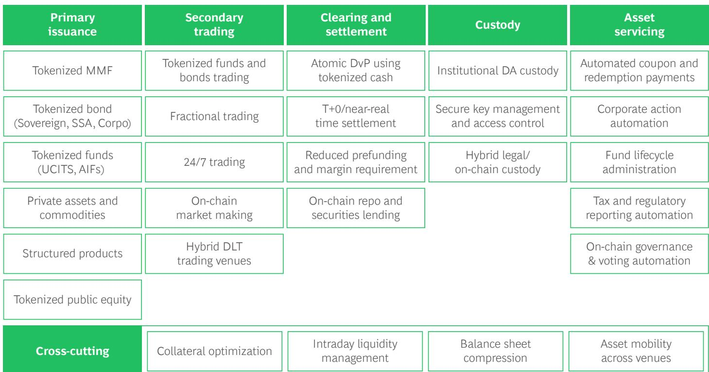  
Source: BCG experience.

## Real value delivered today

Tokenization is already delivering measurable value in high-ROI use cases, where the asset is standardized, the life cycle is simple, and existing operational pain is acute. Two areas of activity stand out: repo and collateral management, and tokenized funds. The following are some examples:

## 1. Repo and collateral management at scale

## - Broadridge Distributed Ledger Repo (DLR) & Canton Network

Broadridge's DLR is one of the clearest illustrations of tokenization improving collateral mobility and repo processing on the Canton Network Blockchain. Built on Digital Asset's DAML/Canton technology and connected to the Canton Network, DLR positions repo settlement within a broader interoperable digital asset ecosystem. Broadridge reported January 2026 average daily volumes of \$365 billion (totaling \$7.3 trillion for the month) and 508% year-on-year growth, highlighting continued scaling of tokenized real-asset settlement in repo and demonstrating production-grade institutional adoption.

## - Kinexys (J.P. Morgan) Tokenized Collateral Network (TCN)

J.P. Morgan's TCN focuses on transferring collateral ownership without necessarily moving the underlying asset in its native ledger, with the goal of reducing manual processing and improving the transparency of collateral ownership.

## 2. First movers in tokenized funds

## - BlackRock – BUIDL (2024)

Launched in March 2024 on Ethereum via Securitize, positioned as an institutional-grade tokenized MMF. Expanded to multiple blockchains to broaden distribution.

\- Franklin Templeton – FOBXX (“Benji”) (2021) Launched in 2021 as the first US-registered fund using blockchain-enabled recordkeeping. Offered via the “Benji” platform as an on-chain MMF token.

## - WisdomTree – Digital Funds via Prime/Connect (2023)

Launched tokenized fund offerings in 2023, distributed through its Prime (retail) and Connect (institutional) platforms. Focus on multi-chain access and integrated digital distribution.

## • J.P. Morgan – MONY (2024)

Introduced in 2024 as a tokenized MMF exposure within its Onyx/Kinexys platform. Designed for institutional liquidity, collateral, and on-chain treasury use cases.

We expect these use cases to scale further, creating the foundations for broader tokenization across capital markets. Indeed, we believe that tokenized funds are poised to become the next standardized and scaled version of investable assets (such as Exchange Traded Funds, or ETFs). This will create more significant opportunities, which may shape financial markets for years to come.

## What to expect next

Digital RWAs will not scale as isolated “point solutions,” but rather as progressively connected market infrastructure across three layers: settlement assets, issuance assets, and market structure integration. The direction of travel is clear, but the speed will depend on resolving settlement cash design, legal certainty, and institutional interoperability in parallel.

## Likely in 0–36 months:

\- Settlement asset scaling. Tokenized MMFs and high-quality collateral (for example, US Treasuries) expand as yield-bearing settlement instruments in repo, margining, and collateral optimization workflows.

\- Collateral mobility networks. Buy side, sell side, and Financial Market Infrastructures (FMIs) connect programmable collateral pools, improving reuse, margin efficiency, and cross-platform liquidity management.

\- Hybrid post-trade integration. DvP models link tokenized rails with CCPs and CSDs, preserving netting efficiency while improving automation and capital velocity.

## In 3–10 years:

\- Fixed income industrialization. Corporate bonds and structured credit benefit from programmable cash flows, automated servicing, and tighter integration with funding markets.

\- Tokenized mutual funds as the next evolution of ETFs. Broader tokenization of mutual funds and private funds, transforming transfer agency and fund servicing economics.

\- Secondary market evolution. Regulated venues gradually incorporate tokenized issuance and servicing, with hybrid execution models dominating initially.

\- Equity tokenization as structural reform. Public equities require legal recognition of on-chain registers and alignment with governance and exchange frameworks, implying slower adoption.

Digital RWAs will first modernize collateral and settlement economics and then reshape issuance and market structure.

## A Word on Crypto: Where the Volumes Are Today

Cryptocurrency remains the largest and most economically mature segment of the digital asset ecosystem, even after the sharp valuation correction that left total market capitalization at roughly \$3 trillion at the end of 2025. What distinguishes crypto from stablecoins and tokenized RWAs is not stability or balance-sheet efficiency, but revenue intensity. The global annual revenue pool is estimated at \~\$90 billion, which is significant when set against \~\$400 billion traditional 2025 trading revenues (\$268 billion bank trading plus \~\$130 billion market infrastructure revenues) Unlike traditional capital markets, where revenues are tied primarily to issuance and long-term asset allocation, crypto economics are driven by trading velocity, volatility, leverage, and 24/7 global market structure. Annual revenue yield relative to crypto market capitalization is therefore structurally high at 2%–4% of assets.

For banks, the relevant issue is not the value of the total industry pool but the potential of relevant addressable segments. Accessible revenue streams for regulated financial institutions include the first four: Trading, Crypto Derivatives, Custody & Prime Services, and Staking Services. Taken together, these segments represent an addressable pool in the order of \$\~55 billion globally. Banks possess structural advantages in institutional client relationships, regulatory credibility, risk management, and collateral optimization, particularly as institutional participation increases and clients demand integration between crypto exposures and traditional balance sheet and treasury frameworks.

Strategically, crypto is a trading-driven, cyclical revenue opportunity rather than a classical balance sheet asset class. Earnings are volatility dependent and can contract sharply in downturns, but revenue intensity during active market phases materially exceeds that of most traditional asset classes. Banks therefore face three core choices:

1. Determine their desired participation model: an agency-led approach focused on execution and custody with limited balance sheet risk; a prime model incorporating financing and derivatives; a distribution-led model leveraging third-party platforms; or a more capital-intensive full-stack model.

2. Second, define their risk appetite and capital allocation boundaries, particularly in light of regulatory treatment and operational complexity.

3. Third, clarify whether their participation is defensive, retaining client relationships and wallet share, or offensive, seeking incremental growth.

In sum, cryptocurrency remains the only digital asset segment that has already scaled into a multi-tens-of-billions revenue pool. While volatile and structurally distinct from traditional finance, it represents a commercially meaningful domain. The strategic challenge for banks is disciplined participation: capturing client-driven revenue pools without importing disproportionate balance sheet, regulatory, or reputational risk.

<table><tr><td>REVENUE COMPONENT</td><td>REVENUE (2025, $)</td><td>ASSUMPTIONS</td></tr><tr><td>Centralized Exchange Trading</td><td>$30 bn–$50 bn</td><td>Based on leading exchange disclosures (for example, Binance ~$13 billion–$20 billion). Scaled to global market using total exchange activity and platform market size, reflecting dominant role of CEX trading</td></tr><tr><td>Crypto Derivatives (Futures, Options, Perps)</td><td>$8 bn–$12 bn</td><td>Derived from total derivatives trading volumes (CME + offshore venues) and applying a blended take rate of ~3–4 basis points (bps) across institutional and retail flows</td></tr><tr><td>Custody &amp; Prime Services</td><td>$2 bn–$4 bn</td><td>Based on ~$600 billion–$700 billion crypto assets under custody and typical fee levels (~30–60 bps), including custody, financing, and institutional prime services</td></tr><tr><td>Staking Services</td><td>$2 bn–$3 bn</td><td>Anchored in disclosed staking revenues (for example, Coinbase ~$0.7 billion) and scaled across exchanges and staking providers globally</td></tr><tr><td>Miner/Validator Revenue</td><td>$12 bn–$15 bn</td><td>Sum of network issuance and fees: Bitcoin mining (~$10 billion–$12 billion) and Ethereum staking rewards (~$2 billion–$3 billion), representing core protocol security incentives</td></tr><tr><td>On-Chain Transaction Fees (L1/L2)</td><td>$7 bn–$10 bn</td><td>Based on ~$6 billion–$7 billion transaction fees in 2024 across major chains, with moderate growth into 2025 driven by increased usage and activity</td></tr><tr><td>DeFi Protocol Fees (AMMs, Lending, DEXs)</td><td>$6 bn–$8 bn</td><td>Based on user-paid fees across DeFi protocols (~$6+ billion), including trading, lending, and liquidity provision revenues</td></tr><tr><td>Other Fees (for example, Listing, NFTs, Advertising etc.)</td><td>$3 bn–$5 bn</td><td>Residual category includes listing fees, NFT marketplace revenues, and ancillary monetization across platforms</td></tr><tr><td>Total</td><td>$69 bn–$107 bn</td><td>Sum of all components above</td></tr></table>

Source: BCG analysis, binance, hashcodex, forbes, exponential, coingecko, and others.

## Banking Business Lines: One Bank, Many Outcomes

In the section Four Scenarios for Financial Market Decision-Makers, we introduced four potential scenarios on the future of digital assets and their impact on the financial industry as a whole and banks specifically. In this chapter, we extend these scenarios to their effect on individual banking business lines.

Additionally, we illustrate the opportunities that arise through digital assets. Scenarios are static and take certain assumptions. However, individual banks, and banks collectively, can capture opportunities and influence outcomes during this dynamic industry evolution.

## Scenarios: Where threats meet opportunities

To recap, the scenarios presented in the BoD View chapter illustrate three forces that may affect banks negatively:

1. Tokenization shifts value to issuers and consumers with less need for intermediaries, creating pressure on fees and margins (before the fee opportunity for novel services).

2. Tokenization accelerates the secular trend of value migration from traditional banks to NBFIs (before bank actions to regain market share).

3. Tokenization requires significant infrastructure investment and operation of dual rails, which amounts to an additional cost pressure (before capturing tokenization cost opportunities).

On the next page is a summary of the high-level assumptions that lead to the four scenarios. Scenario 4 represents a ceteris paribus without significant rollout of digital assets. (See Exhibit 11.)

Banking revenue pools will be affected in a differentiated way. Broadly speaking, asset and wealth management revenue pools will grow stronger in a world with digital assets, and capital market revenue pools will stay the same (but with a very different underlying dynamic), while transaction banking revenues will face the biggest pressure, followed by the NII-business.

The following graph illustrates the different outcomes in global revenue pool growth across the business lines over the period of the next 11 years, 2025–2035. (See Exhibit 12.)

Combined with the potential shift of business to NBFIs as well as the required investments into building and maintaining dual rails, this can lead to adverse outcomes for banks.

However, tokenization also provides ample opportunities for many banks to offer their clients new services, thereby reaching new clients, diversifying into new business models, and operating more efficiently as a bank.

The following is a non-comprehensive view of potential opportunities for banks expanding their offerings to clients and taking advantage of tokenization efficiencies on their own. Highlighted are the use cases that are often prioritized. (See Exhibit 13.)

The quantification and prioritization of these use cases can be materially different between banks, depending on their business footprint, client segments served, business models, and geographical presence. Hence, it is a key exercise for every bank to do this assessment.

## Personal banking for retail and wealth: Facilitating secure access

In Europe, digital assets are no longer peripheral. In many cases, they are already embedded in client portfolios. For example, a BlackRock October 2025 survey (“The next wave of crypto investors”) across 14 European markets shows that, on average, 22% of European investors hold cryptocurrency, with significantly higher penetration in leading markets such as Portugal (43%), the Netherlands (40%), Switzerland (34%), and Spain (29%). In absolute terms, this translates into roughly 25 million European adults owning crypto assets. Importantly, these assets are typically not custodied by traditional banks, but rather are held by exchanges, fintech wallets, or DeFi platforms.

## Value Shifts to Issuers and Consumers

Difference of global “banking services” revenue pool 2035 to Scenario 4, in USD billions

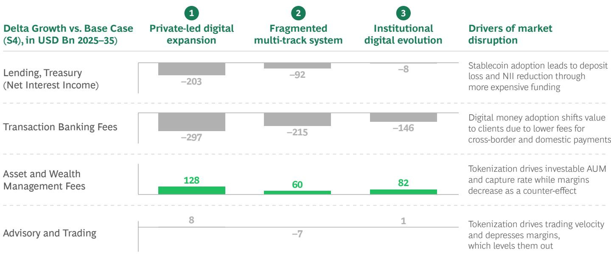  
Sources: BCG Banking Pools; Industry Data; BCG analysis.

## EXHIBIT 12

Key Scenario Assumptions: Details

<table><tr><td>Dimension</td><td>1 Rapid digital expansion</td><td>2 Fragmented, multi-track</td><td>3 Institutional evolution</td><td>4 Defensive reset</td><td>Assumption</td></tr><tr><td>Stablecoin volumes 2035</td><td>~USD 13 tr (Max of ~15% M2)</td><td>USD 6 tr</td><td>&lt; USD 1 tr</td><td>negligible</td><td>Private and consumer action drives stablecoin adoption</td></tr><tr><td>Digital RWA volumes 2035</td><td>~USD 88 tr (16% of RWA)</td><td>~USD 46 tr (9% of RWA)</td><td>~USD 87 tr (16% of RWA)</td><td>negligible</td><td>Digital RWA are driven by Disruptors and/or Institutions</td></tr><tr><td>Payment fees compression 2023–35</td><td>19%</td><td>14%</td><td>10%</td><td>-</td><td>Value is moving to clients and issuers along payment margin compression</td></tr><tr><td>Payment value migr. to NBFI, lost share</td><td>24%</td><td>12%</td><td>17%</td><td>-</td><td>Payment volumes migrate to emerging NBFI payment players</td></tr><tr><td>Total RWA growth 2025–35, p.a.</td><td>5.9%</td><td>5.6%</td><td>5.9%</td><td>5.5%</td><td>Tokenization drives total RWAs through capital efficiency and new issuance</td></tr><tr><td>AM/WM AUM capture of total RWA, 2035</td><td>56%</td><td>54%</td><td>55%</td><td>53%</td><td>Tokenization allows to capture a larger share of RWAs to become investable</td></tr><tr><td>AM/WM avg. margin on AUM 2035 in bps</td><td>37.8 bps</td><td>38.5 bps</td><td>38.5 bps</td><td>39.0 bps</td><td>Tokenized asset classes come with lower fees than traditional</td></tr><tr><td>AM/WM value migr. to NBFI, lost share</td><td>15%</td><td>5%</td><td>-</td><td>-</td><td>AM/WM AUM move to standalone Asset Managers and other NBFI platforms</td></tr><tr><td>Trading velocity increase 2025–35</td><td>7.9%</td><td>6.6%</td><td>7.8%</td><td>5.1%</td><td>Tokenized assets come with significantly higher velocity (like ETFs)</td></tr><tr><td>Trading margin compression</td><td>20%</td><td>10%</td><td>20%</td><td>-</td><td>Tokenized assets come with significantly lower trading margins</td></tr><tr><td>Trading value migr. to NBFI, lost share</td><td>19%</td><td>14%</td><td>9%</td><td>4%</td><td>Tokenization reinforces secular trend toward NBLPs, SIs, and other platforms</td></tr><tr><td>IT cost increase 2025–35 p.a.</td><td>7.0%</td><td>7.7%</td><td>6.0%</td><td>3.0%</td><td>Investing and maintaining dual rails comes at significant IT cost</td></tr></table>

Source: BCG scenario analysis.

## Opportunities I Many Use Cases for Banks Across Lines of Business

Digital asset use cases for Banks by lines of business

Non-exhaustive  
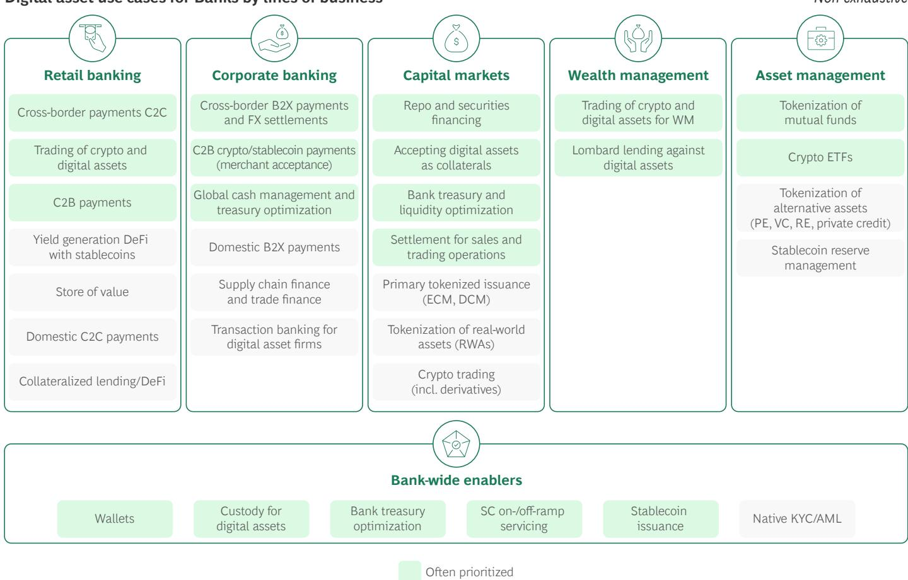  
Source: BCG analysis.

For personal banking franchises, this is the starting point: clients already hold digital assets, but mostly outside the bank's perimeter. That is the first opportunity.

The threats are structural. First, deposit disintermediation risk increases as clients shift liquidity into crypto, stablecoins, tokenized MMFs, and on-chain yield strategies. Even if balances remain modest relative to total deposits, the marginal dollar lost is economically relevant because it erodes low-cost, sticky funding that underpins maturity transformation. Programmable and portable digital money also raises deposit beta and accelerates switching dynamics, compressing net interest margins. Second, there is the threat of interface disintermediation. Wallet providers and crypto platforms may increasingly become the primary financial interface for digitally native segments. Younger cohorts over-index in crypto adoption, meaning relationship formation is increasingly outside the banking system. The long-term risk is not just funding leakage but also loss of affluent, high-lifetime-value clients.

Yet, if banks respond strategically, the opportunity is equally material. The most immediate defensive move is wallet and custody provision. Bank-issued or bank-controlled wallets allow clients to hold crypto, stablecoins, deposit tokens, and tokenized securities within a regulated environment. Integrating these assets into the existing mobile banking interface repositions the bank as the trusted aggregation layer. Custody becomes the trust anchor, offering security, inheritance handling, tax reporting, and regulatory compliance that self-custody and offshore platforms struggle to provide. The objective must be to bring external digital assets back inside the advisory and balance sheet perimeter of trusted banks.

Beyond defense, digital assets expand the product shelf. Tokenization lowers operational friction in distributing alternatives, private credit, infrastructure, or real estate to a broader client base through fractionalization and greater reach.

For banks, the personal banking opportunity in digital assets lies primarily in recapturing client assets currently held in non-bank wallets. Starting from a \$3 trillion end-2025 crypto asset base, and assuming that an average G-SIB with 30 million–40 million retail and wealth clients is linked to roughly \$40 billion of that pool and is able to recapture 20%, this translates into around \$80 million of annual incremental revenue across three main levers: retail trading (\~\$65 million), wealth trading (\~\$9 million), and Lombard lending (\~\$4 million).

Looking ahead, the opportunity could expand materially as digital RWAs increase the stock of tokenized assets held outside the banking system. If the off-bank digital asset pool grows by an additional \$10 trillion–\$2 trillion over the coming years, the same logic scales to roughly \$340 million–\$600 million of incremental annual revenue per year.

Crucially, digital assets can boost wallet share. Instead of leaving crypto exposure as execution-only positions held elsewhere, banks can embed digital assets into discretionary mandates, model portfolios, and managed wrappers. Economics shift from product-layer margins (which will likely compress due to transparency and standardized rails) to advice, portfolio construction, and scalable platform servicing. Additional revenue pools will emerge though services including on-/off-ramp fees, digital asset custody and safekeeping, and digital asset-backed Lombard lending, where digital assets are used as collateral.

Operating models can also benefit. Tokenized life cycle management reduces manual reconciliation, automates corporate actions, and embeds compliance into programmable rails, lowering cost-to-serve per position and enabling scalable servicing of smaller tickets.

In aggregate, margins per product may tighten and balance sheet economics could face pressure.

On the other hand, volumes, wallet share, and platform economics may expand. The strategic question for personal banking is thus not whether to defend deposits but whether to redesign the client interface and balance sheet for programmable money. The winning model will integrate a wallet, regulated custody, advisory overlay, and managed exposure, transforming digital assets from leakage risks to structural growth levers.

## Corporate banking: Manage your clients' liquidity

For large corporates, digital assets are not yet a mainstream treasury instrument, with few CFOs and treasurers publicly articulating a shift toward programmable money. But the required infrastructure is maturing rapidly. Fintech and crypto-native platforms offer 24/7 cross-border settlement, near-instant FX conversion, and programmable conditional payments. As regulatory clarity, accounting treatment, and risk frameworks stabilize, these capabilities may become increasingly relevant for corporate treasury. For transaction banking franchises, the implication is clear: digital money represents a credible alternative infrastructure for cross-border payments, FX transactions, and liquidity management. If adoption materializes at scale, fee pools will be exposed.

The most immediate threat lies in cross-border B2B payments and FX. Stablecoin-based settlement can reduce reliance on correspondent banking chains, compress FX spreads, and diminish float income. Atomic or near-instant settlement reduces the structural need for pre-funded nostro balances and intermediated liquidity buffers. If global stablecoin networks or platform-based providers gain traction, banks risk disintermediation in some of their highest-margin transaction flows. Even partial migration could structurally narrow spreads in international payments and FX execution.

Cash management and operating deposits represent a second pressure point. If corporates gain scalable access to tokenized MMFs, on-chain liquidity pools, or programmable internal sweeping tools, operating balances may become more mobile. The economic value of payment cut-off times and intraday float could decline, and deposit beta could increase. While a wholesale migration away from bank deposits is unlikely in the near term, the optionality created by programmable money will weaken the structural stickiness of transaction balances over time.

For an average G-SIB with a \$200 billion payment flow in emerging market corridors and roughly 1,000 Large multinational corporation clients, digital assets represent a \$200 million–\$600 million annual corporate-banking revenue upside.

The largest opportunities are treasury solutions and programmable liquidity (\~\$60 million–\$225 million), where banks can monetize real-time cash visibility, automated sweeping, conditional payments, ERP/TMS integration, and stablecoin-enabled cross-border payments, especially developed-to-emerging-market corridors (\~\$50 million–\$170 million), through payment orchestration, FX conversion, compliance, and connectivity fees. Additional upside comes from banking services for crypto-native firms (\~\$75 million–\$175 million) and episodic crypto IPO/ECM/advisory revenues (\~\$10 million–\$50 million).

The core opportunity, therefore, is proactive capturing of future rails and treasury economics before clients move to non-banking players.

That said, digital assets open multi-faceted opportunities for corporate banking. In cross-border B2X payments, banks can reposition themselves as orchestrators rather than processors. By offering regulated tokenized deposits or connectivity to stablecoin networks, banks can embed programmable features such as escrow, milestone-based release, and conditional settlement into corporate workflows. Monetization would shift from pure spread capture toward liquidity optimization, embedded FX services, and Application Programming Interface-based (API-based) treasury integration.

Global cash management could also be upgraded. Real-time liquidity visibility across entities and currencies, automated sweeping and pooling, and reduced trapped liquidity through faster settlement can strengthen bank advisory roles. If banks integrate programmable rails into treasury management systems and ERP environments, they can deepen client engagement by providing liquidity intelligence, intraday optimization, and collateral mobility as value-added services.

A further growth vector lies in providing banking services to the digital asset ecosystem. Exchanges, token issuers, and infrastructure providers require regulated payment accounts, safeguarded client money structures, fiat on-/off-ramps and, potentially, stablecoin reserve management. Corporate banking can position itself as the compliant backbone of this ecosystem, capturing new fee pools adjacent to traditional transaction services.

Economically, unit payment margins and FX spreads are likely to compress as transparency and alternative rails boost competitive pressure. Deposit stickiness may weaken at the margins. However, transaction velocity, API-driven services, and treasury optimization revenues can offset this pressure. The strategic question for corporate banking is whether it remains a processor of transactions on legacy rails or evolves into an orchestrator of programmable global liquidity. Institutions that control tokenized connectivity, treasury integration, and compliance infrastructure will be better positioned to shift from spread-based economics to scalable platform economics.

## Asset management: Turning tokenization into structural growth

For asset managers, tokenization is not a defensive story, but rather a structural growth story. Digital RWAs do not simply represent a new technical wrapper for existing funds; they transform the scalability of product manufacturing, the accessibility of private assets, and the economics of distribution and servicing. The core effect will be an expansion of the addressable AUM base and a higher share of assets captured in scalable, fee-bearing structures.

For a representative large asset manager with approximately \$2 trillion AUM, split roughly 60% institutional and 40% wealth/retail, and a blended fee of around 40 bps, annual revenues are about \$8 billion. However, the economic footprint is larger: such a manager is typically linked to \$3 trillion–\$4 trillion of client assets, including custody and brokerage holdings that are not currently captured in fee-bearing structures. Tokenization expands this economic base and improves monetization across multiple levers.

Migrating even 5%–10% of off-book assets into tokenized fund wrappers can add \$100 billion–\$200 billion AUM, or \$400 million–\$800 million revenues. Second, product mix shifts toward alternatives, enabled by fractionalization and scalable distribution, can increase blended fees by 5–10 bps, translating into \$1 billion–\$2 billion in revenues. Third, AUM expansion from increased asset velocity and newly investable assets can add \$400 million–\$800 million. Finally, new servicing and distribution fees from tokenized fund infrastructure contribute \$150 million–\$400 million.

In aggregate, these effects imply a 15%–30% revenue uplift, equivalent to \$1.2 billion–\$2.5 billion annually, driven not by new clients or alpha, but by improved capture, mix, and scalability of the existing asset base.

The first driver is structural growth in investable RWA volumes. Tokenization improves settlement speed, reduces prefunding and collateral buffers (releasing investable assets), and lowers life cycle friction in issuance and transfer. Particularly in credit, structured products, and physical assets, where operational complexity has historically constrained turnover, these effects increase both the stock and velocity of investable assets. The result is not just more efficient markets but also potentially a structurally larger universe of assets that can be manufactured, packaged, and managed.

The second driver is productization and accessibility, especially in alternatives. Tokenization enables fractionalization, lower minimum subscription sizes, and more systematic life cycle management. This is often framed as “retailization,” but the more meaningful unlock lies in institutional and wealth channel scalability. Lower operational friction makes it economically viable to distribute private credit, infrastructure, real estate, or structured exposures into discretionary mandates, model portfolios, and standardized fund vehicles. Alternatives can move from bespoke allocations for the top of the book to more broadly integrated portfolio building blocks. This would support deeper penetration of higher-fee asset classes across both institutional and wealth segments, expanding AUM without fundamentally changing investment strategy.

The third and often underappreciated lever is capture rate. Today, a significant share of global securities is held in custody-only formats, namely direct brokerage accounts, segregated mandates, or fragmented holdings outside managed wrappers. Tokenization lowers the operational barrier to packaging these exposures into scalable vehicles. Fractional ownership, programmable transfer restrictions, and automated life cycle handling make it easier and more economical to wrap assets into funds, managed accounts, and model portfolios. In effect, a larger proportion of the total asset base can migrate from non-fee-bearing custody formats into structured, fee-generating asset management mandates. This migration alone would structurally lift revenue capture, even without overall market growth.

The fourth driver is the expansion of the service stack. Tokenized share classes can embed eligibility rules, jurisdictional transfer restrictions, reporting logic, and potentially settlement connectivity directly into the instrument. While asset managers might not charge separately for “compliance,” embedding these functions can reduce reliance on fragmented transfer agent infrastructure and manual reconciliation processes. It can also strengthen control over product administration, distribution connectivity, and investor servicing. Economically, this would shift the manager’s role from pure product manufacturer toward platform operator, owning not only the investment strategy but also a greater share of the operational and distribution plumbing. The benefit would be higher wallet share, greater asset stickiness, and improved bargaining power in distribution relationships.

These dynamics can lead to a broader economic model

## An Analogy How ETFs shaped the market

The ETF evolution illustrates how structural wrapper innovation can reshape an industry without changing the underlying assets. For nearly a decade after the launch of SPDR in 1993, growth was steady but modest, with global assets still below \$100 billion by 2000. The inflection came once ETFs were integrated into institutional distribution: model portfolios, advisory platforms, and retirement accounts. Thereafter, adoption accelerated: global ETF AUM expanded from roughly \$400 billion in 2005 to \$7 trillion by 2020 and around \$11 trillion–\$12 trillion by 2025. In US equities, ETFs today frequently account for 40%–50% of daily trading volume.

Crucially, incumbents initially underestimated ETFs because they appeared economically redundant: an S&P 500 ETF delivered the same exposure as an index mutual fund would. What was overlooked was the structural advantage of

shift. Fee transparency and comparability would likely compress product-level basis points over time. However, tokenization would enable asset managers to scale more efficiently and control more of the end-to-end value chain.

The net effect would be a trade-off: unit margins tighten, but volumes expand and operating leverage strengthens. Structural AUM growth, higher penetration of alternatives, and improved capture rates could outweigh fee compression for scaled players. The question is thus not whether to tokenize existing funds but whether to use tokenization to expand the investable universe, migrate more assets into managed structures, and assume greater control of the servicing stack. For asset managers that execute this shift effectively, digital assets represent an opportunity for structural value expansion.

## Capital markets: Stronger trading businesses

Our steady-state modelling indicates that digital RWAs can produce a structurally positive RoE outcome of up to 4% for trading businesses, but the magnitude will depend on settlement design. (See Exhibit 14.)

As discussed in the previous chapters, aggregate trading revenue pools are expected to remain broadly stable as higher trading frequency and improved capital velocity are offset by tighter spreads and more transparency. The value creation therefore does not stem from top-line expansion, but rather from efficiency gains, capital intensity effects, and liquidity mechanics.

intraday liquidity, in-kind creation/redemption, tax efficiency, and exchange-based tradability. The innovation was not the asset, it was the operating model.

Importantly, early adopters disproportionately captured the upside. First movers State Street, iShares (now BlackRock), and Vanguard today control roughly 75%–80% of global ETF assets. Scale created self-reinforcing advantages: tighter spreads, deeper liquidity, model portfolio inclusion, and lower unit costs. As assets became concentrated, second-order market structure effects emerged, reshaping securities lending, collateral usage, derivatives activity, and portfolio construction. ETFs ultimately evolved from a product into core infrastructure, demonstrating how wrapper innovation can drive exponential growth and durable market concentration.

# Capital Markets | Impact on Trading Businesses Generally positive and depending on settlement mechanism

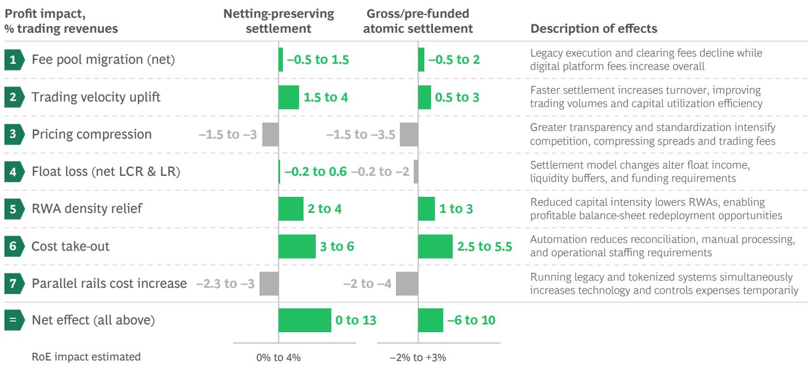  
Source: BCG analysis.

For an average G-SIB with \$15 billion trading revenues and \$35 billion of tied equity, a higher RoE is a very significant value lever (every 1% of RoE corresponds to additional \$350 million trading profit). A maximum of 4% RoE uplift increases profit by \$1.4 billion, equivalent to additional \$6 billion–\$7 billion of revenue.

This illustrates that trading is the banking discipline in which tokenization delivers some of the most significant benefits. Hence, it is not a surprise that this is also the area where we already see some of the largest use cases in production.

Adoption will not occur uniformly. Cash-like instruments, tokenized MMFs, short-dated credit, and repo will become operationally simpler given standardized documentation and shorter life cycles. Corporate bonds and securitized products will follow. Public equities will remain more complex due to company law, exchange regulation, shareholder rights, and CSD-based registries. The transition will thus be progressive, beginning in fixed income and collateral-intensive segments before extending across post-trade infrastructure.

For banks, the revenue effects will be two-sided. New fee pools will emerge in tokenized issuance, digital custody, smart-contract life cycle management, and collateral mobility. At the same time, legacy post-trade revenues will compress as reconciliation intensity falls, servicing spreads narrow, and pricing power declines on standardized rails. Float economics, particularly in clearing and custody-heavy models, will come under pressure as settlement accelerates.

Cost and operating leverage are immediate levers. Straight-through-processing reduces break rates and manual intervention, so fragmented systems can be simplified over time. While parallel rails deepen near-term complexity, steady-state cost bases should decline.

Balance sheet effects are central to this perspective. Under a netting-preserving (NP) settlement model, shorter exposure windows and improved collateral mobility reduce RWA density and free liquidity, offsetting much of the float drag. Under a prefunded or gross atomic (GA) model, weaker netting raises intraday liquidity needs and funding carry, tempering capital efficiency gains. The net outcome will therefore be model dependent.

Digital RWAs ultimately reallocate value within capital markets. Margins compress, cost bases automate, and capital becomes more productive. Advantage shifts from manual intermediation and float reliance toward infrastructure control, programmable servicing, and balance sheet velocity. The strategic choice for capital markets franchises is whether to fully remain operators of legacy workflows or to also position themselves at the center of programmable issuance, settlement, and collateral infrastructure.

# Liquidity and Funding Effects in Tokenized Trading

Liquidity and funding effects depend on whether tokenized markets preserve today's multilateral netting efficiency. In an NP scenario, tokenization accelerates settlement but retains CCP-style or batch netting. As a result, gross trading activity increases without proportionally lifting liquidity requirements. Settlement balances and collateral buffers decline as exposures shorten and settlement fail risk falls. Although banks lose some settlement float, a significant share is recaptured through Liquidity Coverage Ratio (LCR) and Leverage Ratio (LR) relief, allowing HQLAs to be redeployed or wholesale funding to be avoided. The net effect on trading P&L would therefore be close to neutral or mildly positive.

## Digital Asset Regulation: One World, Many Regimes

Digital assets are close to being pervasive in the global financial system, but even nominally equal products do not always manifest in the same way. Why? Because, while regulators are converging on a shared set of objectives, they are doing so through idiosyncratic regimes, perimeters, and supervisory postures. For market participants, this creates challenges around regulatory fragmentation and operations.

## Policy intent is broadly aligned

In contrast, a GA settlement scenario weakens multilateral netting and increases intraday liquidity requirements. Trades settle individually, requiring larger prefunding buffers, higher intraday credit capacity, and additional collateral management. The liquidity buffers carry an opportunity cost and may raise funding needs, particularly for high volume trading desks. Consequently, the liquidity line becomes a structural drag, reducing some of the capital efficiency gains from tokenization and compressing overall economic benefits.

Global regulators are aligning around a common set of regulatory objectives. In most jurisdictions, these are not yet fully realized, but they define the direction of travel. Here are four widely held policy themes:

Monetary policy transmission and financial stability.
Regulators are increasingly concerned with how digital assets (particularly stablecoins) interact with the banking system, payments flows, and monetary aggregates. Key focus areas include deposit substitution, run dynamics, pro-cyclicality, and the potential amplification of stress through always-on digital money. The concern underpins regulatory initiatives including stablecoin reserve rules, restrictions on remuneration, and limits on scale and usage.

Market integrity and consumer protection. Authorities expect clear disclosure, fair marketing, safeguards against market abuse, and mechanisms to address poor customer outcomes. As digital assets move from the margins to more central roles in payments and settlement, regulator tolerance for opaque risk transfer and asymmetric information is waning.

Robust AML/Countering the Financing of Terrorism (CFT) and sanctions controls. Across jurisdictions, digital assets are no longer treated as exceptions. If value moves, it is expected to be monitored. Regulators emphasize indirect exposure, network effects, and the ability to intervene in real time, particularly where digital assets are connected with traditional financial institutions.

Operational resilience in always-on services. With digital asset markets operating 24/7 and execution automated, regulators expect the same levels of resilience as in traditional critical financial infrastructure, including incident management, recoverability, and third-party risk oversight.

These objectives are applied across the full digital asset value chain, including issuance, distribution, custody and safeguarding, transfer and redemption, and governance. However, translation into enforceable rules remains uneven and, in many jurisdictions, incomplete.

## Regulatory divergence is structural rather than temporary

If regulatory intent is converging, why does fragmentation persist? Mainly because structural factors are at play. Digital assets sit at the intersection of multiple legal domains, including payments, securities, banking, commodities, data, and technology. Jurisdictions anchor regulation in different domains, leading to divergent perimeters and supervisory ownership. Some rely on comprehensive, ex ante rulebooks; others lean into supervision and enforcement to define boundaries in practice.

Divergence is also shaped by policy priorities. Some jurisdictions prioritize financial stability and consumer protection, while others emphasize innovation and competitiveness, or focus on monetary sovereignty. These priorities materially affect how regulators approach retail access, self-custody, DeFi interactions, and cross-border servicing.

Finally, regulatory uncertainty is not simply a function of “rules still being written.” In several areas, it reflects unresolved policy trade-offs that are unlikely to shift anytime soon. For market participants, this means designing not for a single global end state but rather for a persistent multi-regime reality.

## Four regulatory archetypes

In practice, most regulatory approaches can be defined by one of four key archetypes. (See Exhibit 15.) These explain not only why rules differ, but also what firms should expect in terms of clarity, consistency, and enforcement risk:

1. Market-driven models rely on extending legacy securities, banking, and payments laws rather than imposing comprehensive purpose-built rules. Supervisory guidance and perimeters shape outcomes, while AML, sanctions, and consumer protection are enforced through existing mandates. In practice, product classification and licensing expectations may remain fluid for the time being. This model preserves flexibility but can create elevated interpretive variability during transition. Proponents include the US (transitioning), Canada, and Brazil.

2. Bespoke regime models establish dedicated digital asset legislation that defines regulated activities, authorization categories, and prudential standards. The regulatory perimeter is set through statute rather than the extension of legacy law. Licensing, governance, disclosure, and resilience requirements are codified in detail. The model offers greater upfront clarity and scalability but often entails prescriptive obligations. Proponents include the EU, Japan, and the UK (phased rollout).

3. Competitive hub models combine structured digital asset licensing with explicit strategies to attract international firms and capital. Clear authorization pathways are paired with supervisory oversight and strong AML and governance expectations. Market entry is under defined conditions, with scrutiny increasing as firms scale or systemic relevance grows. The model balances competitiveness with regulatory credibility. Proponents include Singapore, Switzerland, Hong Kong, and the United Arab Emirates.

4. Sovereign-controlled models restrict or ring-fence private crypto activity while prioritizing state-led digital finance initiatives, including CBDCs. Policy emphasizes monetary sovereignty, financial stability, and capital flow oversight. Private token trading may be limited, with innovation primarily through government-directed programs. The model reduces certain domestic exposures but may constrain private-sector development. Mainland China has adopted this approach.

Most jurisdictions adopt elements of more than one archetype. Still, for market participants, an archetype lens can help them anticipate supervisory behavior, rather than focusing solely on statutory requirements. Of course, archetypes can change and national approaches evolve from one archetype to another over time.

## When tokens become financial infrastructure, regulators raise the bar

Stablecoin regulation is among the most developed aspects of digital asset regulation globally, but it remains politically contested. Across jurisdictions, there are several common design features: a permissioned issuer perimeter; the need for high-quality and liquid reserve assets; segregation and safeguarding of collateral assets; credible redemption at par; and governance and disclosure obligations. Regimes differ most on calibration factors, including who may issue, the range of eligible reserve assets, the treatment of yield, redemption mechanics under stress, and the extent to which stablecoins can circulate freely across markets and platforms.

The EU’s Markets in Crypto Assets Regulation (MiCA) is an archetype of a prescriptive framework. It requires authorization for e-money token (EMT) issuers, fully segregated reserve backing, enforceable redemption at par, and stricter obligations for tokens deemed “significant.” MiCA also prohibits EMT issuers from paying interest, reflecting concerns about monetary policy transmission and financial stability.

## Digital Asset Regimes Can Follow One of the Four Regulatory Archetypes

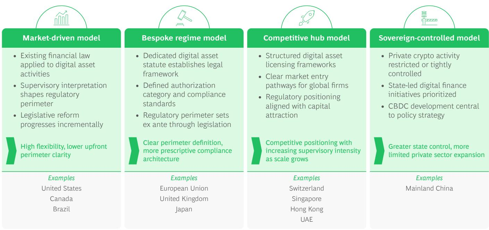  
Source: BCG analysis.

In the US, the debate has shifted from legislative design to implementation. The GENIUS framework defines issuer categories and reserve standards and restricts yield at the issuer level, while the Office of the Comptroller of the Currency has begun operationalizing supervision. The remaining fault line, reflected in early 2026 negotiations around the CLARITY Act, is whether yield or reward mechanisms should be permitted elsewhere in the ecosystem, given concerns about deposit substitution and bank disintermediation.

Two issues are particularly controversial, both in the US and globally:

1. Whether stablecoins can pay a yield. This acts as a proxy for deeper questions around deposit substitution, run dynamics, and issuer business-model sustainability.

2. What constitutes acceptable backing assets and liquidity management under stress, including reserve composition, concentration, and redemption assumptions, reflecting divergent monetary and financial stability priorities.

These debates matter beyond stablecoins. They highlight a growing regulatory commitment to functional equivalence: where a digital instrument performs the economic function of a regulated activity, it will be treated as such, regardless of technological form. The perimeter is tightening, and within it, supervisory intensity increasingly scales in line with substitutability and market relevance.

A distinct but related dynamic arises once digital instruments become structurally embedded in funding, collateral, or settlement flows. At that point, the supervisory focus shifts from classification and disclosure to resilience and systemic risk management. Tokenized RWAs illustrate this pathway. While legally securities, their growing role in liquidity and collateral chains can make their operational design and redemption mechanics systemically relevant, triggering infrastructure-grade expectations around intervention authority, stress testing of redemption and liquidity flows, operational resilience, and governance and change management.

In short, scale transforms the regulatory purview. What begins as product regulation can evolve into systemic supervision as digital instruments mature.

## Jurisdictional Snapshots: Major Markets Taking Distinct Regulatory Paths

<table><tr><td>United States</td><td>The US is moving from debate to implementation, with federal legislation advancing on payment stablecoins while broader market structure reform remains contested. Stablecoin proposals define issuer categories and reserve standards and restrict issuer-level yield, while negotiations continue over the treatment of other digital assets and reward mechanisms. Oversight is fragmented across the Securities and Exchange Commission (SEC), Commodity Futures Trading Commission, banking regulators, and state authorities.</td></tr><tr><td>European Union</td><td>Through MiCA, the EU has a harmonized framework for crypto asset issuance and related services, including specific regimes for stablecoins. The trade-off is high levels of prescription and the need for significant implementation efforts. As a result, Europe is becoming a “design-to-the-rulebook” market: scalable for compliant models, unforgiving toward partial compliance.</td></tr><tr><td>United Kingdom</td><td>The UK is moving toward a tailored, end-to-end regulatory regime for digital assets, with a clear emphasis on bringing economically significant activities into the regulatory perimeter. The direction of travel is toward high standards of governance, safeguarding, and operational resilience, with a particular focus on the ability to intervene credibly under stress. Models that cannot demonstrate control and recoverability at scale will struggle to secure long-term regulatory acceptance.</td></tr><tr><td>Switzerland</td><td>Switzerland largely integrates digital assets into existing financial market regulation, using a principles-based approach combined with strong supervisory scrutiny. Following a federal consultation on strengthening the legal basis for stablecoins and crypto services, policymakers are considering targeted legislative adjustments to enhance legal certainty and align with international standards. The regime favors high-quality, transparent structures over rapid experimentation.</td></tr><tr><td>Canada</td><td>Canada’s digital asset landscape remains measured and cautious, with rules evolving to strengthen investor protection, transparency, and custody standards. The direction of travel is toward integrating digital assets into mainstream financial norms, rather than rapid market liberalization.</td></tr><tr><td>Singapore</td><td>Singapore maintains a licensing-led regime for digital payment token services, with a strong focus on AML controls and safeguarding customer assets, including recent amendments that add user protection and financial stability requirements. A stablecoin framework is also in place.</td></tr><tr><td>Hong Kong</td><td>Hong Kong is building a regulated digital asset hub, combining clear licensing for core activities with high expectations on compliance, governance, and risk control. Recent steps to formalize stablecoin frameworks and support broader tokenization reinforce this approach.</td></tr><tr><td>UAE</td><td>The UAE features multiple regulators with explicit licensing pathways across key centers such as Dubai and Abu Dhabi, combining a pro-hub posture with increasingly formalized rulebooks on AML, governance, and third-party dependencies.</td></tr><tr><td>India</td><td>India maintains a cautious approach to regulation amid stringent taxation, expanding compliance and reporting requirements, and ongoing policy debate. While private crypto activity is not prohibited, regulatory uncertainty remains high, and firms should assume a conservative, compliance-heavy operating environment.</td></tr><tr><td>Mainland China</td><td>Mainland China follows a sovereignty-first approach, prioritizing state-led digital money and maintaining tight restrictions on private crypto activity. The operating environment is policy-driven and largely settled, requiring conservative assumptions and limited scope for private-market models.</td></tr></table>

## Executive Takeaways

## Navigating jurisdictional divergence in digital asset regulation

Given that meaningful global alignment remains unlikely, firms should prioritize perimeter clarity, control resilience, and structural flexibility.

## 1. Regulatory perimeters diverge by market

Even where policy intent is similar, jurisdictions differ on asset classification and activity scope—particularly for custody, brokerage, staking/lending, stablecoins, and DeFi control tests. Misalignment creates real licensing risk.

Action: Maintain a jurisdiction-by-jurisdiction perimeter map, linking each product and activity to required permissions, with product gating to prevent inadvertent unlicensed activity.

## 2. Supervisory expectations are converging, but prescriptiveness and depth vary

Across markets, expectations are tightening around licensing, AML/CFT, custody safeguards, governance, and stablecoin design. What differs is not direction but prescriptiveness and supervisory intensity.

Action: Build to a global minimum control standard that satisfies the most conservative regulator in scope, then layer jurisdiction-specific adjustments as required.

## 3. Cross-border fragmentation is structural rather than transitional

Digital asset activity is global; supervision remains national. Divergence in cross-border permissions, monitoring obligations, and systemic access will persist.

Action: Design a modular operating model (with a flexible entity structure, booking and custody options, parameterized controls, and contingency planning) so you can ring-fence, re-route, or exit markets as rules evolve.

# CRO View: Risk Control in Programmable, Always-On Markets

## Digital Assets Change How Risk Arises and Propagates

Digital assets do not represent a fundamentally new category of risk. But they do introduce new risks and reconfigure existing risks in ways that present challenges to traditional risk management and compliance frameworks.

For decades, risk management in banking has relied on a stable set of implicit operating assumptions: customer identity is known and institutionally anchored, transactions can be paused, reversed, or unwound, markets operate within defined hours, and controls are executed primarily within regulated intermediaries. Digital assets challenge these. Transactions are executed on shared, programmable infrastructure; markets operate continuously; settlement is often near-instant and irreversible; and control execution is distributed across issuers, distributors, custodians, protocols, and technology providers.

The reason this shift is material is because it is no longer confined to pilots or niche markets. Indeed, it is playing out at scale, particularly in stablecoins, tokenized asset infrastructure, and institutional trading/custody. Tokenized instruments are already being used for cross-border payments, repo settlement, intraday liquidity management, and collateral mobility, with transaction volumes rising fast. For example, stablecoins (\$T, \$C) regularly see daily

transfer volumes in the tens of billions of dollars. At the same time, execution is automated and final, settlement is atomic, transactions are irreversible by design, and control logic is embedded directly into code.

The combination of scale, irreversibility, and programmability fundamentally alters how risk materializes. Errors that once related to individual transactions can now propagate across markets in seconds. Controls that relied on ex post intervention lose effectiveness. Risk management should therefore shift upstream into design choices, governance structures, and escalation mechanisms.

The practical consequence is a compression of risk timelines. In digital asset models, operational weaknesses, whether rooted in technology, governance, or compliance execution, can translate directly into market disruption and reputational damage, often before traditional escalation mechanisms can respond. What once unfolded sequentially now unfolds simultaneously, straining risk frameworks designed for slower, institution-centric systems.

As a result, CROs must translate the firm's own risk appetite into controls that can operate in programmable, always-on environments while showing how those controls support regulatory outcomes such as financial stability, market integrity, and customer protection.

## Risks Become More Interdependent and Infrastructure-Driven

To manage digital asset risk effectively, decision-makers need to anchor the discussion in familiar risk language. The good news is that digital assets do not invalidate standing risk taxonomies—but they do stress, reshape, and extend them. Thus, the most common pitfall is not unknown risks, but misclassification, underweighting, or thinking that risks will manifest as they do in traditional finance.

A defining characteristic of digital asset markets is the interconnectedness of risk domains. Traditional risk categories, including market, credit, operational, and compliance risk, remain relevant but are less likely to materialize independently. Instead, digital assets compress and entangle risk domains, allowing one type of failure to convert rapidly and directly into another.

Technology risk is a good example because it can behave like a market risk trigger. Failures in smart contracts, wallet infrastructure, or settlement logic can force automated liquidations, interrupt redemption mechanisms, or freeze transfers—often without a human “pause” between the

failure and market impact. This dynamic is materially different from legacy IT outages in which manual intervention, circuit breakers, and operational workarounds typically slow propagation.

Similarly, AML or sanctions failures increasingly translate into liquidity and franchise risk. Once compliance weaknesses are identified, loss of banking access, forced delistings, or withdrawal freezes can rapidly follow, even in the absence of direct financial losses. Custody failures illustrate this compression: a single breakdown can simultaneously trigger legal, operational, and prudential consequences, leading to risk exposures in client asset protection, insolvency exposure, and duty of care. In digital assets, custody functions as a systemic control risk rather than a contained operational sub-risk, as in traditional finance.

These dynamics explain why a purely functional view of risk is insufficient. Risk in digital asset markets is best understood by how it arises and propagates, rather than by where it is booked. (See Exhibit 16.)

## EXHIBIT 16

## Digital Asset Alter Risk Transmission, Dependency Structures, and Control Points

Key risk are fundamentally unchanged, but amplified...

Several core risks persists—but in digital asset models, they move faster, become more coupled, and are amplified:

## Market Risk

Market Risk
Market movements propagate faster across fragmented venues

## Liquidity Risk

Shifts within minutes rather than days, particularly in confidence-driven environments

## Conduct Risk

Conduct failures and AML/sanctions breaches surface publicly and immediately, triggering rapid counterparty de-risking or supervisory attention

The risks are familiar in definition—but they behave differently under continuous trading, automated execution, and irreversible settlement

Source: BCG analysis.

## ...while some risks are structurally reconfigured

Other risks retain their labels—but change in substance due to how digital asset infrastructure operates:

## Operational Risk

Extends beyond internal processes into cyber-operational and protocol risk driven by code, infrastructure, and external dependencies

## Third-Party Risk

Shifts into ecosystem and protocol dependency, relying on multi-party networks vs. bilateral outsourcing

## Model Risk

Moves into smart contracts and oracles, where executable code and external data feeds replace human judgment

## Compliance Risk

Reflects programmability and automation, with AML, sanctions, and conduct requirements embedded in transaction logic

Discretion decreases while scale/speed increase—raising both the likelihood and severity of control failures

Familiar risk with altered dynamics

## Digital Assets Create New Risks

Digital assets introduce new categories of risk that arise from technological features without close analogues in traditional finance. (See Exhibit 17.) These risks are new because they reflect structural shifts in how control is exercised and enforced.

One such category is protocol governance risk. Decision-making authority over upgrades, parameter changes, or emergency interventions may be decentralized, contractually constrained, or ambiguously allocated—yet, these decisions directly impact asset behaviors and client outcomes. Another category is interoperability and bridge risks from mechanisms that move assets between otherwise separate blockchain networks. Shared protocols and cross-chain mechanisms create new systemic nodes where failures can cascade across markets, platforms, and asset classes.

## EXHIBIT 17

# The Rise of Digital Assets Brings New Risk Management Challenges, as Familiar Risks Behave Differently, and New Risk Vectors Emerge

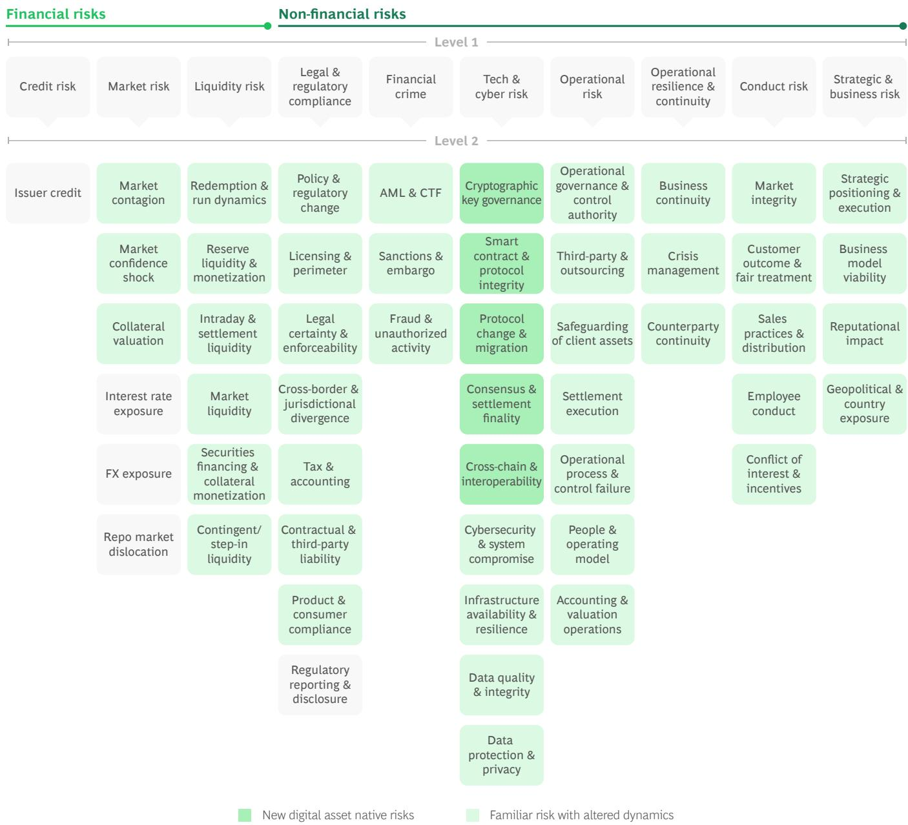

A third category is irreversibility and finality risk. Atomic settlement and immutable ledgers remove traditional remediation options. Errors, once executed, cannot be unwound, shifting the burden of risk management toward ex ante design and governance.

These risks matter because they often determine whether effective control is possible at all. Where governance is unclear, interoperability is fragile, or finality is absolute, traditional risk mitigants lose relevance.

## A Deeper View: Control Points Matter

Digital assets are exposed to a broad range of risks, but outcomes are typically determined by a limited number of critical control points. At these points, legal, operational, technological, and governance dimensions converge. When failure occurs, remediation is constrained and consequences escalate rapidly.

## Financial crime is concentrated, high-impact, and scaling fast

Financial crime risk is uniquely consequential in digital asset markets because it converts control failures directly into liquidity, franchise, and market-access risks, often before any balance-sheet impact materializes. Indeed, AML and sanctions failures rarely remain contained. Instead, they trigger loss of market access, forced product restrictions, withdrawal freezes, and, in more severe cases, market exits. These consequences often materialize before any direct financial loss occurs, suggesting that AML capability is a good leading indicator of broader risk exposure.

The scale and structure of illicit activity show that it is not marginal, but concentrated and economically significant. Stablecoins now account for \~84% of illicit on-chain transaction volume globally, $^{1}$ reflecting a shift toward payment-like, dollar-denominated rails. At the same time, crypto-related fraud represents only \~10% of reported fraud incidents but \~50% of total losses, $^{2}$ indicating disproportionately high economic impact per event. Within crypto-related fraud, \~71% of losses stem from investment scams, $^{2}$ highlighting concentration in scalable, industrialized typologies.

A key reason for high financial crime risk is the wallet-based nature of digital asset activity. Traditional AML frameworks are anchored in identity-based accounts where customer identity, transaction authority, and asset movement are institutionally bundled. Digital asset

markets break this logic. Assets are held and transferred through wallets, which may be hosted by regulated intermediaries or by end users. In self-hosted scenarios, there is no institution that “owns” the account, and full Know Your Customer (KYC) coverage across all participants is often infeasible.

## A new lens on AML and compliance

In 2023, the US Treasury's Office of Foreign Assets Control sanctioned Tornado Cash, a decentralized mixing service, for allegedly facilitating over \$7 billion in illicit transactions, including funds linked to North Korean cyber actors. The action did not focus solely on direct customer onboarding failures, but rather on the role of wallet flows and protocol-level activity in enabling sanctions evasion. Several exchanges and infrastructure providers were forced to block, freeze, or offboard accounts linked, even indirectly, to sanctioned wallet addresses, demonstrating how exposure of several transaction “hops” away can trigger compliance consequences. The case also led to criminal charges against developers and heightened scrutiny of wallet-level screening and mixer exposure. The takeaway is that, in digital asset markets, AML and sanctions risk arises through transaction flows and ecosystem connectivity, and failure to monitor indirect exposure can quickly translate into market access and enforcement risk.

US Department of the Treasury. (2023, August 23). Treasury sanctions Tornado Cash for facilitating illicit finance. https://home.treasury.gov/news/press-releases/jy0916

This distinction fundamentally alters how AML must be conducted. (See Exhibit 18.) Risk is no longer concentrated at onboarding, but in the movement of value across wallets and networks. Identity remains relevant, but it is no longer sufficient. Alongside customer profiles, wallet behavior, transaction context, clustering patterns, and network relationships become primary risk signals, augmented by geolocation and access point indicators where reliably available.

This challenge is compounded by an execution gap. While global regulatory frameworks are expanding, enforcement remains uneven. The Financial Action Task Force (FATF) has reported that \~99 jurisdictions have implemented or are implementing Travel Rule requirements (mandating the exchange of sender and beneficiary information for digital asset transfers), yet \~60% have not taken supervisory or enforcement action. $^{3}$ As a result, illicit activity can scale within formally regulated environments where controls exist on paper but are not yet operationally effective.

# What Changes Is How Risk Is Detected, Assessed, and Acted Upon

## AML shifts from customer-centric to flow-centric risk assessment:

In digital asset markets, risk is concentrated in transaction patterns rather than static account relationships. This requires participants to combine customer risk profiles with real-time transaction behaviors, rather than treating them as separate control layers

## Decision-making moves from periodic monitoring to continuous intervention:

Near instant and irreversible settlement compresses the AML decision window. Controls must increasingly operate pre- or intra-transaction, supported by real-time analytics, 24/7 escalation, and clearly defined intervention authority

## Exposure becomes indirect and recursive:

Sanctions and illicit finance risk frequently arise several transaction hops away from the immediate counterparty, through mixers, bridges, liquidity pools, and layered transaction structures. Screening only direct counterparties leaves blind spots

AML and financial crime controls are among the most mature risk management tools in banking. The challenge when it comes to digital assets does not stem from unclear rules, but rather from fundamentally different execution conditions. The objectives remain unchanged: regulators expect institutions to apply AML/CFT and sanctions requirements consistently, identify and mitigate both direct and indirect exposure, maintain auditability, and report issues promptly. Accountability continues to rest with senior management.

Digital assets also introduce structurally new constraints on AML controls. Indeed, full KYC coverage in secondary markets is often infeasible. Regulators increasingly expect institutions to compensate intelligently through wallet risk scoring, enhanced provenance analysis, and tighter controls at issuance, redemption, and conversion points.

Sanctions enforcement is another operational and legal challenge. On-chain transactions cannot be rejected once executed. Effective sanctions compliance therefore depends on custody as well as ledger-level intervention capabilities, asset segregation mechanisms, and clear governance to maintain freezes over time.

Finally, retrospective breaches are inevitable. New intelligence, improved analytics, or updated sanctions lists routinely highlight problems. Institutions are judged on the speed, transparency, and credibility of their responses once risks are identified. What “good” looks like is therefore not a function of static rule compliance but of dynamic risk management. We have seen that leading digital asset AML programs share several characteristics:

\- Risk-based design that combines customer risk profiles with real-time, transaction-level signals

\- Dynamic risk scoring and rule calibration that adapt to changing behaviors and network exposures

\- Explicit coverage of indirect and downstream exposures across wallets and protocols

\- Executable freezing and restriction mechanisms at custody and ledger levels

\- Timely, detailed regulatory reporting supported by audit-ready data lineage

\- Clear accountability despite distributed execution, with continuous feedback loops from suspicious activity report/suspicious transaction report (SAR/STR) outcomes into control design.

Together, these elements distinguish AML frameworks that merely document compliance from those that remain effective operating at scale, at speed, and under stress.

## Custody failures escalate into solvency and governance crises

In digital asset markets, custody is a first-order systemic control risk. In short, control of private keys determines control of assets, with immediate legal and operational consequences and direct balance sheet implications under stress.

Unlike traditional custody, where asset ownership, recordkeeping, and safekeeping are legally and operationally separate, digital asset custody brings these elements together. Errors, compromises, and governance failures translate directly into loss events, often without the possibility of reversal.

A critical distinction in digital asset custody is between legal custody, technical control, and instruction authority. An institution may be the legal custodian of record, while technical control of assets—through private keys, upgrade rights, or transaction authorization logic—resides with a technology provider or protocol. In stress scenarios, regulators increasingly look through formal labels to assess who can actually move, freeze, or recover assets.

Where legal responsibility and technical control are misaligned, custody failures tend to escalate rapidly into questions of client asset protection, solvency exposure, and duty of care. This creates a fundamentally different risk profile.

For now, regulatory treatment of digital asset insolvency is uneven across jurisdictions and largely untested in stress scenarios. Asset segregation depends not only on legal constructs but also on technical implementation—key architecture, access controls, and transaction authorization logic. Operational mistakes, such as misconfigured signing rights or flawed recovery procedures, can have immediate and irreversible consequences.

## Crypto hack risks rising

The first half of 2025 saw more than \$3 billion stolen across 119 crypto hacks, with centralized exchanges accounting for more than half of total losses. Many incidents involved compromises in private key management, approval logic, or internal custody controls rather than blockchain protocol failures. In high-profile exchange breaches, losses translated immediately into liquidity pressure, user withdrawals, and reputational damage, with limited recovery rates.
Global Ledger. (2025). Gone Fast: Laundering Timing Report – H1 2025.

Responsibility is further complicated in multi-party models involving sub-custodians, technology providers, and shared infrastructure. In such arrangements, execution may be distributed, but accountability remains concentrated. CROs and CCOs are therefore expected to understand not only who holds assets but also who can move them, under what conditions, and whether compliance and safeguarding obligations can be enforced.

Supervisory attention increasingly reflects this reality. Custody failures are treated less as isolated operational incidents and more as breakdowns in governance, control design, and client asset protection. For custodians, the implication is clear: they need to elevate digital asset custody to the same level of scrutiny as systemically important payments or settlement infrastructure.

## Smart contract errors can trigger market-wide disruptions

Programmability through smart contracts shifts risk upstream, which means that design and governance decisions are binding determinants of outcomes. Smart contracts sit at the intersection of technology, operations, and risk modeling. They automate execution, reduce friction, and enable actions such as coupon payments. But they remove discretion precisely at the moments when it has historically mattered most.

From a risk perspective, smart contracts are like executable financial models. They encode assumptions, thresholds, and behaviors that determine outcomes automatically and at scale. Coding errors, parameter miscalibration, or unanticipated interactions between contracts can produce systematic effects similar to those considered in model risk management—without the buffers traditionally provided by human review or discretionary intervention.

The model-like characteristics of smart contracts mean supervisors often expect governance, validation, and change management standards to be comparable to those applied to certain high-risk models. Thus, upgradeability, emergency controls, parameter changes, and kill-switch mechanisms are core risk controls. The absence of clear authority to intervene, whether due to decentralized governance structures, contractual ambiguity, or organizational indecision, will be a significant driver of loss severity.

## Dangers in contract logic

In 2025, malicious approval exploits accounted for approximately \$1.5 billion in losses, nearly half of total stolen funds. These incidents were not primarily coding bugs; they were design and governance weaknesses in contract approval logic and key management structures.

Once deployed, smart contracts execute automatically, scaling losses before human intervention is possible. Loss severity depends less on detection speed and more on whether pause functions, upgrade authority, and emergency controls have been embedded ex ante.

Global Ledger. (2025). Gone Fast: Laundering Timing Report – H1 2025.

Dependence on external data introduces an additional layer of risk. Errors or manipulation can propagate rapidly across automated systems, triggering liquidations, freezes, or incorrect settlements. Equally, oracles that provide pricing, reference data, or event triggers effectively become part of the control environment.

For CROs, the implication is clear: smart contracts must be governed like high-risk models rather than static IT assets. This requires pre-deployment validation, continuous monitoring, controlled change management, and technically enforceable escalation and intervention authority, which should all be integrated into the broader risk framework.

## Shared infrastructure failures could amplify market contagion

Interoperability concentrates risk at shared infrastructure layers, creating new contagion channels beyond the control of individual institutions. Indeed, interoperability layers such as bridges, shared settlement protocols, and common execution environments function as force multipliers for both efficiency and risk. While they enable liquidity mobility and scale, they also create new points of concentration at which failures can cascade across markets.

In practice, these dependencies mean that stress originating in one platform or protocol can propagate rapidly through liquidity pools, collateral arrangements, and settlement rails—often beyond the perimeter of any single regulated entity. The complicating impacts on risk management are easy to see. Institutions may rely on a number of custodians, node operators, cloud providers, analytics vendors, or protocol developers, creating dependencies that are often opaque, difficult to substitute, and concentrated across the industry.

Rather than seeing shared layers as elements of traditional outsourcing, regulators have begun to view them as emerging financial market infrastructure. The concern is not merely vendor risk, but also the potential emergence of “too-big-to-fail” digital infrastructure outside established oversight regimes.

## In always-on markets, crisis response speed determines survival

Always-on markets and automated execution compress decision windows. Thus, governance speed and intervention authority are decisive determinants of crisis outcomes. In digital asset markets, time itself becomes a risk factor. Atomic settlement and automation accelerate stress propagation, while intervention is constrained not only by system design (for example, time locks, governance votes, upgrade mechanics) but also by organizational processes such as escalation paths, committee approvals, decision rights, and crisis playbooks.

In stress scenarios, several dynamics occur. Liquidity can move rapidly across platforms and automated liquidation may amplify price moves. Infrastructure outages, whether in the blockchain, node, or cloud layer, can halt transfers or trap assets. Governance uncertainty can delay decisive action precisely when speed matters most.

Traditional crisis playbooks assume time for diagnosis, coordination, and approval. But in digital asset markets, delay is a powerful vector. Effective crisis management thus requires real-time monitoring that feeds directly into escalation processes. Market participants need circuit breakers, throttles, and activity restrictions. They should also pre-define decision rights and grant clear authority to intervene across automated systems and external dependencies (third-party or ecosystem components that can amplify, constrain, or block crisis response). These would include blockchain networks, oracles, custody providers, liquidity venues, and stablecoin issuers.

## Multi-party ecosystems heighten governance and accountability expectations

In digital asset models, governance quality directly determines risk outcomes. This is because execution is distributed, but accountability is not. The three lines of defense remain conceptually valid, but with caveats. Technology decisions embed risk choices. Business design determines control feasibility. Compliance execution depends on external protocols and vendors.

## Governance in focus

In 2024–2025, the SEC's civil action against Coinbase centered not only on product classification but also on governance, control oversight, and senior management responsibility for operating an allegedly unregistered securities exchange. The litigation focused on whether leadership knowingly allowed certain activities to proceed without sufficient regulatory clarity, placing governance and decision accountability at the center of supervisory scrutiny. Similarly, enforcement actions against several US crypto platforms have emphasized board-level oversight failures rather than purely technical breaches.

University of Cincinnati Law Review. (2025, April 16). The Future of Cryptocurrency Regulation: The Outcome of SEC v. Coinbase. https://uclawreview.org/2025/04/16/the-future-of-cryptocurrency-regulation-the-outcome-of-sec-v-coinbase/

At the same time, accountability still sits with decision-makers. Regulators continue to look to boards and senior management to own outcomes, even where execution is distributed across ecosystems. Leading institutions should address this tension, explicitly establishing clear ownership of digital asset architecture and governance, credible step-in authority, and escalation rights over automated systems, as well as ensuring board-level visibility into implicit bets, residual risks, and dependency concentrations. Governance quality is itself a risk control.

Where governance is ambiguous, for example, in relation to who can intervene in automated systems, risks can increase. This is why supervisors increasingly assess governance arrangements as indicators of risk outcomes.

## From Rulebooks to Supervisory Practice: Regulatory Standards Defined in Real Time

In many jurisdictions, enforcement practice is running ahead of formal rulemaking. Supervisors are increasingly using registration requirements, governance expectations, and AML program assessments as de facto perimeter-setting tools. Weak controls are treated as material risks, regardless of whether specific activities are explicitly prohibited in statute.

Despite differences in rules, regulators across jurisdictions have been consistent in intent. Indeed, supervisory behavior points to a clear trajectory for risk and compliance function assessment in practice. A key principle is that governance and ownership are a priority. That means authorities are less focused on narrow questions of classification and more focused on who owns risk, who has authority to intervene, and how decisions are escalated in periods of stress. Distributed execution does not dilute accountability.

Crucially, supervisors increasingly recognize that not all risks in digital asset markets can be pre-mapped or controlled ex ante. New technologies, new market structures, and new stress dynamics inevitably produce failures that sit outside predefined control frameworks. Again, decision authority becomes a fundamental control in its own right. Supervisors therefore place growing emphasis on whether institutions have clearly defined intervention mechanisms—including pause, parameter adjustment, or activity restriction capabilities where technically feasible, and transparent governance in areas where intervention is structurally limited.

In addition, resilience and recoverability are important. Supervisors expect institutions to demonstrate that digital asset operations can be stabilized, contained, and recovered after incidents. This applies whether the incidents are triggered by technology failures, liquidity stress, or financial crime. While resilience frameworks have long incorporated recovery processes, digital asset markets elevate recovery speed, intervention authority, and containment capacity to first-order supervisory concerns.

Another key trend is that evidence-based supervision is replacing formalistic compliance. Policies and frameworks remain necessary, but they are no longer sufficient. Institutions are expected to show how controls operate in practice—how alerts are handled, how decisions are documented, and how interventions are executed across on-chain and off-chain systems.

The implication is clear. Regulation in digital assets is necessarily principles based, for the simple reason that detailed rules often cannot keep pace with technological change. Enforcement, however, is increasingly outcome driven. Institutions are judged on what happens when controls are tested rather than whether every scenario was foreseen.

Supervisors are also expanding their focus into secondary market activity, interoperability layers, and ecosystem dependencies. Activities that historically sat outside the core banking perimeter are now viewed as potential sources of systemic risk.

For CROs and CCOs, one simple message rings true: You cannot treat regulatory implementation solely as a reactive exercise. Instead, you must be proactive, translating evolving regulation into internal standards ahead of formal precedents. Waiting for clarity is increasingly a risk in itself.

## From Policy to Performance: Compliance Becomes Control Effectiveness Under Stress

Digital assets expose the limits of compliance models built primarily around preventive, identity-based controls, which in digital asset use cases are often structurally constrained. For example, full KYC is not always feasible in secondary markets, and transactions cannot be rejected once settled on-chain. Activity extends beyond direct customer relationships and regulated intermediaries. Compliance frameworks that rely predominantly on prevention therefore struggle to deliver effective control. As a result, compliance effectiveness in digital asset models depends less on prevention and more on detection and response.

Leading institutions are re-balancing their compliance standards accordingly. Preventive controls remain critical where they can be embedded by design—for example, in issuance logic, redemption rules, or permissioned access. But continuous monitoring becomes the primary lever, particularly through on-chain analytics, which can be applied off-chain. Responsive controls such as intervention, escalation, and containment are increasingly decisive for outcomes.

A common supervisory theme across jurisdictions is the shift from policy completeness to control executability. Regulators are less interested in whether a control exists on paper than in whether it can be executed under stress, across on-chain and off-chain systems, during market volatility, and in coordination with third parties.

This places new emphasis on integration, automation, and evidence capture. In practice, three rules of thumb stand out:

\- Controls must be technically and operationally executable, not just documented.

\- Authority must be explicit: kill switches, escalation rights, and intervention mechanisms must be clearly defined, tested, and understood across the organization.

\- Evidence must be audit ready: data lineage, decision logs, and intervention records should withstand supervisory scrutiny.

In short, compliance that cannot be executed under stress is no longer defensible.

## What CROs Should Do Now: Make Risk and Compliance a Growth Enabler, Not a Late-Stage Constraint

Patchwork risk and compliance approaches can work at small scale, but they are liable to malfunction once digital asset activity reaches a level where automation, third-party dependencies, and cross-border exposure become structural. At that point, ad hoc fixes can increase complexity and supervisory concern.

Digital assets do not require a new philosophy of risk and compliance. But they do require a new operating discipline. Institutions that succeed will be those in which governance, escalation, and intervention mechanisms function under speed and uncertainty.

Ultimately, risk and compliance functions will determine whether digital asset businesses can scale sustainably. They are a growth factor in themselves. (See Exhibit 19.) Institutions that design for control early preserve optionality and credibility later. But those that defer integration may find that regulatory constraints set limits on business potential.

## EXHIBIT 19

## What CROs and CCOs Should Do Now: Make Risk and Compliance a Growth Enabler, Not a Late-Stage Constraint

## Phase 1 (0–3 Months): Risk Foundation

Enable initial digital asset activity with minimum viable, defensible control

\- Define digital asset risk model and guardrails (key exposures, risk appetite, “no go” boundaries)

\- Align with regulatory requirements for initial use cases (jurisdiction-specific constraints, licensing perimeter)

\- Implement minimum viable controls (AML/KYC adaptation, custody & wallet controls, transaction controls, intervention capabilities)

\- Establish governance and decision rights (clear ownership, escalation, who decides vs who acts)

\- Ensure end-to-end control chains operate (detect-decide-act working in practice)

Source: BCG analysis.

## Phase 2 (4–12 Months): Controls Scaling

Transition from minimum viable to scalable, integrated risk management

\- Enhance and automate control capabilities (analytics, monitoring, real-time response)

\- Integrate risk into core systems and processes (wallet-level tracking, enterprise reporting, system integration)

\- Industrialize control execution and response (consistent detection, decision, execution at scale)

\- Strengthen third-party and infrastructure risk management (custodians, blockchain infrastructure, protocols, concentration risk, fallback options)

## Phase 3 (13–24+ Months): Full Institutionalization

Institutionalize controls and interventionauthority for LT scale

\- Embed digital asset exposures into capital, liquidity, and stress frameworks (treatment in capital models, liquidity buffers, stress scenarios)

\- Institutionalize governance and assurance (3LoD maturity, independent testing, crisis playbooks)

\- Scale regulatory capabilities across jurisdictions and evolving frameworks (multi-jurisdiction alignment, evolving requirements, standardized reporting, ecosystem risk)

# CTO View: Making It Happen

# For CTOs, digital assets mark not just a new area of responsibility but also an entirely new remit.

As IT infrastructure migrates from internal systems to shared networks and smart contracts, CTOs must not only integrate a range of new products, but also ensure that technology operations can keep pace. Businesses that benefit most will treat DLT as core infrastructure, and design stacks and processes for a multi-ledger market. Critically, they will also make sure they protect DLT keys (the sole means of securing, authorizing, and validating transactions) and maintain a firm grip on risk management and governance.

## Five Core Technology Controversies in DLT for Financial Services

Digital assets place DLT at the core of financial services and require technology choices that go well beyond incremental upgrades. They also demand trade-offs across controls, risk, and scalability, with the best options often diverging across use cases and over time. CTOs should see their roles not as identifying a winning model, but as defining coherent positions across tensions and ensuring consistency between architecture, operating model, and sourcing decisions. Below we highlight some key dilemmas:

## 1. Public versus private (permissionless versus permissioned)

CTOs may feel that they need to choose between public and private DLT, but the distinction is becoming less binary. Rather than picking a network type upfront, it is increasingly common to select specific behaviors (privacy, permissions, interoperability, or composability) and adopt platforms that combine these characteristics as needed. For instance, a bank might deploy a permissioned Ethereum Layer 2 rollup for internal settlement—keeping transaction data private and access restricted to approved counterparties—but still anchor the final state to the public Ethereum main net for security and interoperability.

The same institution could then use cross-chain bridges to interact with tokenized assets on other networks. The choice is not “public or private” but which combination of privacy, access control, and connectivity is demanded by each use case.

Increasingly, networks support privacy-preserving, permissioned workflows while remaining interoperable across participants. Public networks often enable specialized blockchains to operate with different privacy characteristics (some fully transparent, others with restricted visibility or encrypted transaction data) while remaining connected through common interoperability standards such as the inter-blockchain communication protocol (IBC).

The bottom line is that digital financial markets are evolving fast toward a multi-chain environment, driven by regulatory requirements, asset class differences, and legacy infrastructure. Moreover, individual blockchains are building their own ecosystems, encompassing distinct user bases, applications, and liquidity pools. For that reason, many market participants are reluctant to lock in any single ledger too early and risk future flexibility. They are finding that a more productive approach is to assemble the right mix of control, connectivity, scale, and performance for each use case.

An example of this pick-and-mix approach in action is Deutsche Börse's D7 platform, which uses DLT to issue, settle, and custody digital securities while remaining integrated with Clearstream's CSD and central bank money infrastructure. In the same vein, many central banks anticipate a scenario in which multiple chains link through interoperability rather than a single platform. For example, the Bank for International Settlements' Project Agorá brings together seven central banks to assess how tokenized commercial bank deposits on different DLT platforms can interoperate with wholesale CBDCs—rather than requiring all participants to adopt one chain.

In a fragmented on-chain universe, the key challenge for CTOs will be to combine safe multi-chain operations with consistent controls and visibility.

## 2. Shared interoperability vs. proprietary control

Interoperability across digital asset networks is an evolving challenge. Again, many banks are exploring ways to balance connectivity with institutional control.

When it comes to settlement, where interoperability is most critical, many institutions favor a collegiate approach. Several shared settlement platforms provide consortium-owned infrastructure, which enable settlement without transferring assets across independent ledgers via external bridges. Third-party bridge solutions are also available, but these often concentrate custody and operational risk. In parallel, some banks are running pilots to evaluate a range of alternative interoperability models, but no single approach is yet dominant across regulated use cases.

## 3. On-chain versus off-chain data and logic

In regulated finance, neither data nor logic can be fully on-chain because of constraints around data privacy, reporting, and compliance. Below, we drill down into current best practice in balancing the two dimensions:

Data. Leading institutions are generally placing only data that must be shared and independently provable on-chain—such as balances, state changes, and timestamps—while keeping sensitive information off-chain and linked via hashes. In practice, on-chain and off-chain data often need to be synchronized. The Financial Action Task Force's (FATF's) Travel Rule exemplifies this: token transfers execute pseudonymously on-chain while compliance requires parallel off-chain customer data exchange. Frameworks including the Digital Asset Securities Control Principles (DASCP) make clear that CTOs should consider oracle risk, because off-chain inputs influence on-chain outcomes.

Logic. Smart contracts suit deterministic, consensus-critical rules, such as transfer limits. Processes requiring judgment—for example, relating to KYC or sanctions screening—should remain off-chain. In the Monetary Authority of Singapore’s AS Project Guardian, exploring asset tokenization, the on-chain smart contract enforced a simple deterministic rule: deposit tokens can only interact with approved addresses, while the judgment-based process of verifying and approving those addresses should be handled off-chain using verifiable credentials.

Again, the biggest area of risk is the on-/off-chain boundary. When smart contracts depend on external systems, oracles become critical control points. Swift uses Chainlink to enable banks to access tokenized assets through existing messaging infrastructure. The approach cuts integration risk by allowing institutions to connect to on-chain assets without replacing trusted, battle-tested communication channels. The World Bank's CBDC prototype is similar, deploying on-chain smart contracts for token issuance and transfer rules, while relying on off-chain systems for identity verification and policy decisions, with oracles bridging the two layers.

## 4. Token standards versus bespoke models

Token standards define how tokens behave and integrate with wallets, custody platforms, and exchanges as well as other tokens, enabling broad support across those systems. In practice, most regulated tokens extend a common base standard with additional compliance and control logic. Circle's USDC is a good example: it is ERC-20 compatible at the interface level, ensuring broad ecosystem support, while layering on blacklisting, plausibility, and upgradeability for compliance and operational control.

Custom token models may capture regulated asset complexity better but introduce risks around security, integration, and fragmentation. The more scalable approach is to extend a widely adopted base standard only as far as the use case requires, keeping bespoke logic minimal and auditable.

## 5. Security versus programmability

Programmability adds value but introduces security risk because additional code logic and access points, as well as external dependencies, expand the attack surface. Thus, the goal in regulated systems should be to balance controlled programmability with operational flexibility.

In MAS Project Guardian, J.P. Morgan's deposit token applied programmable restrictions so that public-chain deployments operated under permission controls. Circle's \$C includes the ability to freeze addresses for compliance purposes when required. And some stablecoin issuers even allow remote coin burn in an illegal holder's wallet if authorities provide a legal title. For bank technology leaders, the message is clear: treat smart contracts and key management as critical infrastructure and keep the settlement core minimal and robust.

Most DLT security decisions are custody decisions: who holds keys, how signatures are authorized, what happens if a key is compromised, and how fast one can intervene. Wallet architecture (hardware security module [HSM] and/or multi-party computation [MPC], segregation of duties, policy-based signing, transaction simulation, break-glass procedures) belongs in the same risk conversation as smart contract audits.

## Seven Principles for CTO Strategies

The debate around how best to operate and secure on-chain activities complicates CTO decisions on digital assets. But making the right choices is vital for successful rollout. Without a clear strategy, market participants risk falling into a black hole of isolated pilots and fragmented architectures. To avoid such a fate, CTOs should start with a basic set of principles designed to translate technology trade-offs into actionable strategies across business lines, asset classes, and jurisdictions. With these in place, CTOs can establish guardrails that allow them to scale digital asset capabilities while maintaining control, managing risk, and reducing dependence on any single vendor or ecosystem.

## Principle 1: DLT is infrastructure, not a product

CTOs should treat DLT as shared infrastructure, with a reusable platform layer owned by one team. Scale comes from the reuse of common capabilities such as identity, key management, transaction controls, monitoring, and integration. Banks should invest early in a secure and compliant platform layer, or risk accumulating expensive and fragile one-off builds.

## Principle 2: Multi-chain by design

Decision-makers should assume that multiple chains will coexist across asset classes and markets. Public and private networks will run in parallel for the foreseeable

future. Thus, the platform should be chain agnostic, with abstraction and interoperability built in so new chains can be added without redesigning the system.

## Principle 3: Regulatory reversibility and upgradeability

Rules and supervisory expectations will evolve. DLT platforms must be equipped to support changes in permissions, controls, reporting, and scope without disrupting client assets. This requires configurable controls, safe upgrade paths, migration options, and strong auditability.

## Principle 4: Client-facing simplicity, internal complexity

Clients should see a familiar banking experience, not ledger complexity. Hide network, token, and workflow operations behind clear products, clean APIs, and standard processes. Without strong abstraction and operating discipline, complexity will surface at the client interface.

## Principle 5: Architect control and accountability

DLT shifts control across code, keys, networks, and third parties. Banks must clearly define who controls deployments, upgrades, keys, emergency actions, and exception handling, and how external dependencies are governed. To support resilience, CTOs should seek to design control and accountability into the architecture from day one.

## Principle 6: Standards first, customization only as last resort

Standards make scale possible. Common approaches to tokens, identity, messaging, controls, and interoperability reduce cost and fragmentation. Thus, custom designs should be an exception and launched only after careful thought. CTOs should adopt, and even help shape, standards early, while enforcing discipline on bespoke solutions that create long-term complexity.

## Principle 7: Architectural flexibility by design

The digital asset world is still evolving. Blockchain networks upgrade, standards mature, liquidity shifts, and regulatory expectations move. A scalable bank architecture must be built for change: applying layered, modularized design and decoupling products from any single chain, custody model, vendor stack, or smart contract framework. The implication is clear: CTOs should design for portability (clean interfaces, abstraction, migration paths, and data portability) and make “exit” a primary requirement in every platform decision. This is different from “multi-ledger by design.” Multi-ledger is the operating reality. Flexibility is the ability to switch, extend, or retreat without re-platforming.

## Create a Capability Map

To translate these principles into operational capabilities, CTOs need a clear capability map that separates what must be stable and controlled from what can be more flexible and subject to experimentation or innovation. A capability map can provide a structure for decision-making and responsibilities and can help CTOs distinguish solid foundations from more fluid elements. It should be deliberately layered, with lower layers designed to resist change and carry higher risk. Upper layers can then evolve faster and absorb most business and client-facing change.

## Layer 1: Ledger layer (plural) & conventional systems

This layer represents the foundational distributed and conventional systems (for example, public and private blockchains, DLTs, core banking and securities systems) that maintain records of ownership, transactions, and other data across digital and traditional assets.

## Layer 2: Ledger abstraction, interoperability & integration

CTOs can abstract underlying ledgers and integrate them with external systems to enable interoperability across blockchains, legacy infrastructure, and third-party platforms while shielding higher layers from complexity. Integration is not just connectivity; it enables reuse of capabilities and components such as security, key management, and monitoring. In addition, it often requires changes in existing system data, processes, and controls to manage token life cycle events and 24/7 operations.

## Layer 3: Smart contract & automation

A smart contract and automation layer will enable programmable business logic and automation through smart contracts and rule engines, supporting conditional execution, workflow automation, and composability with internal and external services.

## Layer 4: Asset & token services

Asset and token services provide core capabilities to create, manage, and life cycle digital assets and tokenized instruments, including issuance, custody, transfer, settlement, and corporate actions across asset classes.

## Layer 5: Risk, compliance & control

The risk and compliance layer embeds end-to-end risk management, compliance, and control capabilities to ensure that digital asset activities meet regulatory, financial crime, operational, and governance requirements across jurisdictions.

## Layer 6: Application & client channels

Application and client channels deliver user-facing applications and interfaces that enable corporates, financial institutions, partners, and end users to access and manage digital asset services across web, mobile, APIs, and embedded finance.

## There's a Minimum Set of Capabilities Required to Issue a Stablecoin; Additional Capabilities Can Be Built on Top to Enable New Business Models

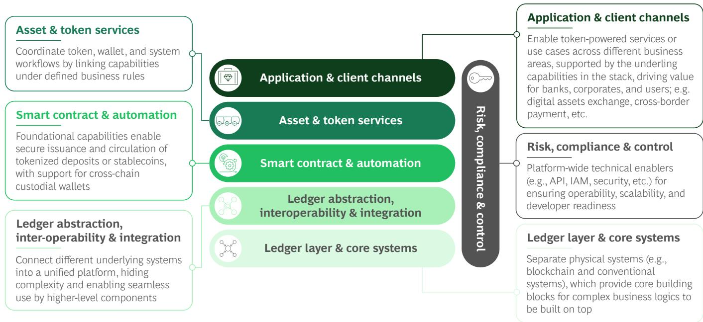

## Operating Model Implications

DLT-based solutions require deliberate design, robust processes, and disciplined operations. As control responsibilities extend into code, keys, networks, and external parties, risk can surface in new and less familiar ways. This makes the operating model as critical as the underlying architecture. Here are three key implications:

## Governance: DLT architecture ownership should be at the group CTO/COO level

DLT platforms span multiple products, legal entities, and jurisdictions. Thus, it does not make sense for each business line to make its own chain choice and design its own controls. Doing so would lead to duplicated wallets, inconsistent security models, and fragile integrations. In addition, DLT-related capability and capacity are often scarce, suggesting that centralized ownership is the best option. On the other hand, close alignment with business needs argues for decentralized delivery. A useful compromise is to create a strong centralized unit to design, build, and operate the basics and in parallel to operate decentralized teams in business units that can identify and own the most relevant use-case implementations.

## Talent: A bank can buy platforms but cannot outsource accountability

In DLT, seemingly insignificant technical choices around how keys are held, contracts are upgraded, transactions are monitored, and cross-ledger moves are controlled can predicate significant risks and costs. Keys held in an HSM with multi-signature governance add upfront complexity but dramatically reduce the risk of unauthorized transactions, whereas a simpler single-key setup may save time initially but create a single point of compromise. Similarly, smart contracts that are upgradeable via a proxy pattern offer flexibility to fix bugs and adapt to regulation, but require ongoing governance and audit processes, while immutable contracts are cheaper to maintain but may force costly redeployments if requirements change.

Banks need “thin but strong” capabilities—that is, engineers who can challenge vendors, audit designs, run incident playbooks, and track protocol changes. They can lead vendors and accelerate delivery while keeping core competence and accountability in-house. Where components are commoditized—such as node hosting or standard APIs—banks can rely on third-party providers.

## Resilience: DLT nodes are critical infrastructure with the same standards as payment systems

DLT pushes more activity into always-on environments and increases an organization's dependence on external networks, shared utilities, and automated execution. Those realities raise the bar on resilience. Nodes, signing services, monitoring, and integration gateways should be operated with the same discipline as high-criticality payment infrastructure. Table stakes are 24/7 monitoring, strict change controls, clear recovery procedures, tested failover, and strong cyber and operational controls. The goal is simple: once real money is running on DLT, production, rather than piloting, should be fully established.

## EXHIBIT 20

## Comparison of Governance Options

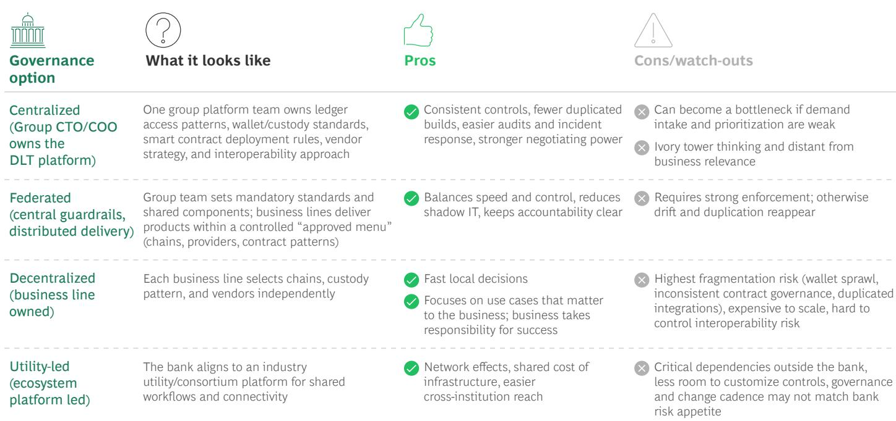  
Source: BCG analysis.

## Build vs. Partner vs. Buy: The Need for a Clear Decision Framework

Most leading banks should see reuse of core systems (identity, entitlements, treasury, risk, reconciliation, reporting) as the baseline. That means extending existing technology but also making select components “token aware.” The real sourcing decision is what you build, partner for, or acquire around the core to move fast without creating a fragile digital island.

Build: Build only where the capability is a long-term differentiator or where the bank cannot credibly outsource accountability. In practice, this would be the “control plane” (policy, entitlements, limits, auditability) and the abstraction layer that enables switching rails when the ecosystem shifts. Building also makes sense when the external market lacks production-grade maturity (resilience, change management, incident response, regulated operations). J.P. Morgan’s continued investment in its blockchain platform (rebranded as Kinexys) reflects a decision to own core infrastructure rather than rely on third parties.

Partner: Leading banks partner for components that are becoming standardized or where network effects matter more than proprietary advantage. Typical elements would include tokenization platforms, custody/settlement connectivity, stablecoin rails, and specialist compliance tooling. Partnering also fits “brownfield” realities: most value comes from connecting DLT workflows into existing bank controls and client channels. The market now offers production-grade building blocks at both technology and operating service levels. The result is a lower barrier to moving from pilots to real production solutions. A good rule of thumb is to partner for production engines but keep architecture, controls, and exit options in-house. PayPal is a useful reference: it retains distribution and customer experience but relies on a PY\$ setup regulated issuer (Paxos) for issuance and reserve management.

Buy: Acquisition should not be about buying blockchain broadly. Rather, it should be about buying a specific capability (licenses, talent, product maturity, distribution, or integration IP) efficiently when timing matters and the market is consolidating. But it only works if you can speedily integrate the purchase into your operating model and controls. Stripe's acquisition of Bridge is a good example of buying stablecoin infrastructure to accelerate productization, rather than building every component from scratch. Taken together, ecosystem selection plus mature building blocks can compress delivery timelines, contingent on retaining the control plane (keys, policy, contract governance) in-house.

## How Should CTOs Think About Sequencing?

For many banks, the bottleneck is not core DLT build but rather integration, controls, and operating readiness. Sequencing matters because DLT programs often fail in two ways: staying stuck in an isolated pilot or scaling too fast on unstable foundations. The goal should be to build capabilities in a sequence that preserves control, keeps options open, and adds complexity only when there is a clear business case. The following are five principles to bear in mind:

## 1. Start with a ledger-agnostic platform and controls as a foundation

Begin by implementing the parts that enable you to operate safely across multiple ledgers and connect into existing systems. These parts will include a multi-ledger wallet, key management, policy controls, monitoring, audit evidence, and integration patterns. If this foundation is not ledger agnostic, every new use case on a new ledger becomes a one-off build and you accumulate technical and operational debt quickly.

## 2. Add tokenization where client demand exists

Tokenize where there is clear client demand and a positive business case. Prioritize use cases where faster settlement, better collateral mobility, or improved distribution create measurable value. This will keep the program commercially grounded and prevent “tokenization in search of a problem.”

## 3. Never lock into a single ecosystem

Assume that no single network, vendor, or standard will apply to all assets and all regions. Retain portability by using standards, maintaining clear exit paths, and designing interfaces so you can add or switch ledgers without rewriting the stack. Lock-in creates both technology risk and strategic risk in vendor and ecosystem negotiations.

## 4. Design for a world that stays fragmented longer than expected

Plan for parallel rails and slow convergence. Multiple ledgers, forms of digital money, and regulatory regimes will coexist for years. Architect for interoperability and operational coexistence from day one, including reconciliation, reporting, and consistent controls across environments. Doing so will insulate you against regrets when the market evolves unevenly.

## 5. Expand ledger exposure gradually

Treat ledger exposure like you would forging new market infrastructure connections. Start with limited scope, clear limits, and strong operational oversight. Deepen exposure step by step as controls, resilience, and incident responses mature. Avoid big bang launches that force you to learn under stress.

# So What? A Ten-step Guide to Managing Digital Assets

## As the industry matures, discussions around digital assets become less about innovation and more about market structure.

The scenarios outlined in the BoD View chapter suggest that the coming years will see outcomes ranging from incremental modernization to material value migration away from banks. Impacts will span the balance sheet, infrastructure, risk, technology, and client interface.

For CEOs, the question is thus not whether to engage, but rather how to lead effectively through structural uncertainty. The following steps may support formulation of a potential roadmap:

## 1. Make an explicit strategic choice

Start by selecting a base-case scenario and identify at least one alternative scenario to remain viable in. Digital asset strategy must be scenario robust, not scenario dependent. Explicitly define whether your ambition is defensive participation, scaled competition, or infrastructure shaping.

## 2. Quantify what is at risk—and what is addressable

Undertake business-line analyses to model three numbers:

• Revenue pools at risk (payments, FX, post-trade, NII)

\- Revenue pools addressable (custody, issuance, collateral, prime, tokenized funds)

\- Capital and liquidity effects under tokenized settlement models

The analyses should include deposit beta sensitivity, RWA density shifts, and dual-rail cost burdens. Without quantified exposure, digital assets will remain abstract.

## 3. Decide where to compete in the stack

Across the stack, CEOs must determine where the bank must control versus where it can partner:

\- Client interface: wallets, on-/off-ramps, advisory integration

\- Product layer: stablecoin posture (issue, partner, allow), tokenized deposits, tokenized funds

\- Infrastructure layer: settlement networks, collateral mobility platforms, interoperability standards

A strategic error would be a fragmented approach: multiple pilots without architectural coherence.

## 4. Protect the core while building the future

This publication makes clear that programmable money transforms deposit dynamics and liquidity velocity. CEOs should reassess the following:

\- Liquidity stress assumptions in 24/7 markets

\- Intraday funding requirements under a GA settlement

• Collateral mobility impacts on treasury strategy

Parallel rails will exist for years. The challenge will be to prevent cost duplication and margin erosion during the transition.

## 5. Elevate risk and custody to first-order strategy

Custody, smart contract governance, and AML execution can be growth constraints if underbuilt. CEOs should ensure the following:

\- Clear intervention authority (kill switches, escalation rights)

\- Wallet-based AML and sanctions monitoring capabilities

\- Explicit governance over key management and smart contract upgrades

In digital asset markets, your ability to scale revenue is constrained by the design of your control framework, not just by demand or capital. In traditional banking, controls sit around the product. In programmable markets, controls sit inside the product. That changes everything.

## 6. Architect for optionality, not prediction

CTOs must grapple with multi-chain coexistence and regulatory reversibility. CEOs must require:

\- modular, ledger-agnostic architecture,

\- vendor exit paths, and

\- configurable compliance controls.

Strategic lock-in to a single chain, issuer, or ecosystem converts uncertainty into structural dependency risk.

## 7. Sequence with discipline

Avoid two common failure modes: isolated pilots and uncontrolled scaling. A disciplined sequencing approach:

\- 0–12 months. Establish unified DLT governance, offer secure client wallets, join at least one institutional network, and clarify stablecoin/tokenized deposit posture.

\- 12–36 months. Scale custody and collateral use cases, integrate tokenized assets into wealth mandates, and industrialize first capital markets workflows.

\- 3–5 years. Optimize balance sheet usage through tokenized collateral and rationalize legacy post-trade infrastructure where scale permits.

Speed matters, but architectural integrity matters more.

## 8. Align governance with automation speed

Digital asset execution compresses risk timelines. CEOs should:

\- assign a single accountable executive sponsor (CEO/COO-level),

• centralize DLT platform ownership, and

\- institute a board-level review cadence tied to scenario monitoring.

Governance fragmentation in programmable markets fosters risk propagation.

## 9. Choose your ambition archetype

Three viable models emerge from this report:

\- Defensive integrator protects client interface and focus on custody and orchestration.

\- Scaled participant competes on issuance, collateral, and prime while managing balance sheet exposures.

\- Infrastructure shaper invests to influence settlement networks and interoperability standards.

Drift between models is the highest-risk posture. If a bank does not deliberately choose its digital asset ambition and incrementally adds activities without strategic coherence, it accumulates risk faster than revenue. Drift is not neutral; it is unmanaged exposure.

## 10. Revisit core assumptions annually

The evolution of digital assets will be path dependent. CEOs should annually revisit five interrogatories:

\- Where does irrelevance risk now exceed execution risk?

\- Which regulatory or interoperability assumptions could break our strategy?

\- Are we infrastructure price takers or price setters?

\- Does our liquidity model hold-in atomic settlement stress?

\- Are we preserving optionality or accumulating hidden lock-in?

Digital assets are not a product cycle; they are a structural transition akin to the telecom dual-rail migration discussed earlier. Banks will operate legacy and tokenized infrastructure in parallel for years. Margins on traditional intermediation will compress, but new value pools will emerge around orchestration, programmable servicing, and balance-sheet velocity.

The CEO mandate is clear: do not attempt to predict the winning rail. Instead, ensure that you remain systemically relevant regardless of which rail scales. Strategic clarity, quantified economics, disciplined architecture, and governance that matches automation speed will determine which banks shape the next settlement stack—and which merely connect to it.

## About the Authors

Chris Schmid is a Senior Partner and Global Leader. He leads BCG's Global Banking business. You may contact him by email at schmid.christian@bcg.com.

Roy Choudhury is a Senior Partner and Regional Leader. He leads BCG's CIB business in North America. You may contact him by email at choudhury.roy@bcg.com.

Inderpreet Batra is a Senior Partner and Global Leader. He leads BCG's Payments and Fintech business. You may contact him by email at batra.inderpreet@bcg.com.

## For Further Contact

If you would like to discuss this report, please contact the authors.

## BCG

Boston Consulting Group partners with leaders in business and society to tackle their most important challenges and capture their greatest opportunities. BCG was the pioneer in business strategy when it was founded in 1963. Today, we work closely with clients to embrace a transformational approach aimed at benefiting all stakeholders—empowering organizations to grow, build sustainable competitive advantage, and drive positive societal impact.

Our diverse, global teams bring deep industry and functional expertise and a range of perspectives that question the status quo and spark change. BCG delivers solutions through leading-edge management consulting, technology and design, and corporate and digital ventures. We work in a uniquely collaborative model across the firm and throughout all levels of the client organization, fueled by the goal of helping our clients thrive and enabling them to make the world a better place.

