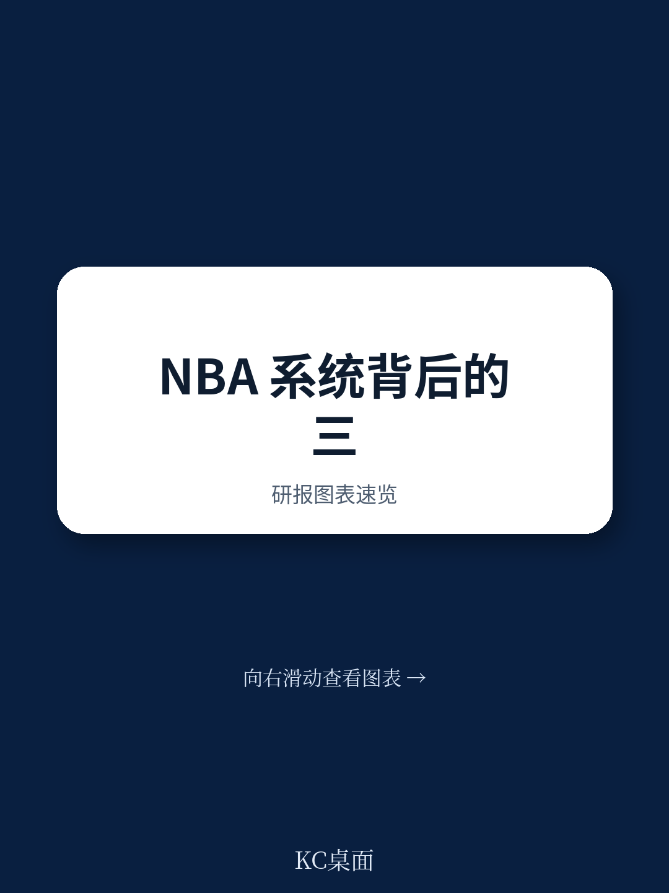
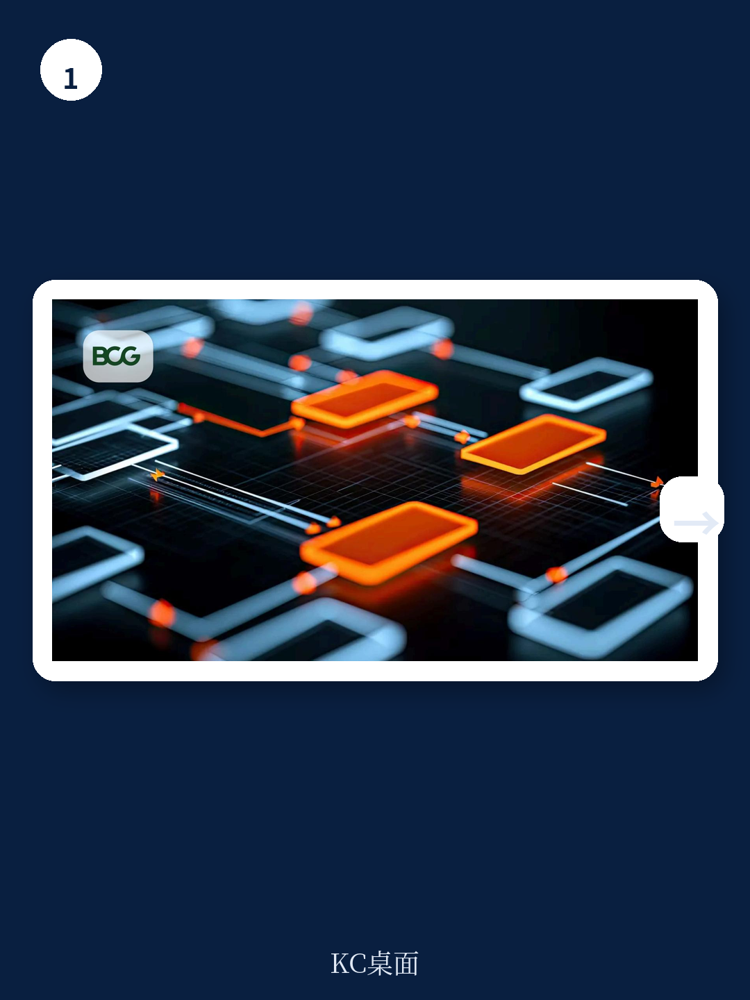
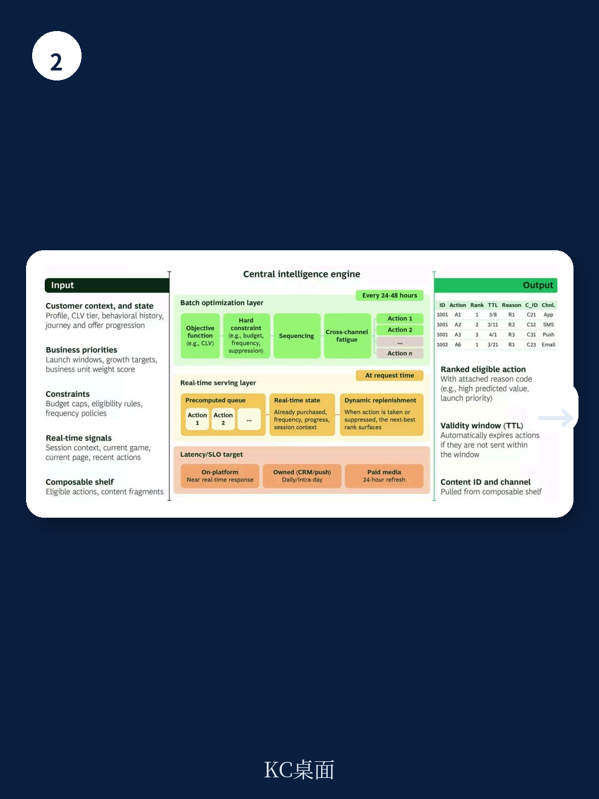

# 波士顿咨询：下一代“最佳下一步行动”不是算法升级，是决策架构的重构

绝大多数企业当前部署的“最佳下一步行动”系统，本质上仍是一个更聪明的排序器。它根据历史数据，给每个客户打一个响应概率分，然后选出分数最高的那个动作。波士顿咨询在最新发布的系列研究报告第三部分中，提出了一个截然不同的判断：这套范式正在触及天花板。真正能带来下一轮增长差异的，不是把模型从XGBoost换成Transformer，而是从根本上重构营销决策的架构——从“预测并排序”转向“探索、推理与组合”。

这份报告的核心洞察在于，未来有效的NBA系统需要同时运行三层决策引擎：倾向性评分、情境化Bandit算法，以及基于基础模型的智能体推理。这三层不是演进关系，而是叠加关系。大多数企业目前只运行了第一层，而真正拉开差距的能力，藏在后两层。

## 1. 倾向性模型的三个结构性局限，决定了它无法承载下一阶段个性化

波士顿咨询的报告直接点明了当前主流做法的天花板。倾向性模型，即便是加入了增量建模的Uplift模型，也存在三个无法通过调参或增加特征来解决的结构性问题。

第一，它们无法提供真正的“处方”建议。一个倾向性模型能告诉你“客户A有90%的概率会响应”，但它回答不了“这个响应是因为你的动作，还是客户本来就要买”。报告指出，转向Uplift模型的企业通常会发现自己20%到40%的活跃营销项目几乎没有带来任何增量效果，它们只是在捕获本来就会发生的意图。这意味着大量营销预算被浪费在了“奖励已转化意图”上。

第二，它们无法发现新的组合。倾向性模型只能在一个预设的动作空间内做排序。如果营销人员定义了15个优惠，模型就只在这15个里面挑。它永远无法发现，把一个小额优惠与某个特定内容框架、在一个非标准时间、通过特定渠道组合起来，效果会超过所有预设选项。当可组合的资产库膨胀到数百个原子资产、数千种可能组合时，这个限制会成为硬约束。

第三，它们无法处理序列决策。倾向性模型把每次决策当作独立事件。它不考虑“今天发这个优惠会改变明天的最优选择”。但真实的客户旅程是一个多步骤的互动过程，当前动作会塑造未来的选项。

> **KC评论：** 这一点对于任何从事营销分析或CRM的朋友都值得细读。报告中提到的20%-40%的浪费比例并非耸人听闻，它揭示了一个普遍存在的“虚假相关性”陷阱。当你的模型只看到“高响应率”，却无法区分“因果”与“相关”时，你其实是在为客户的既定意图买单。完整报告中对Uplift模型的几种实现路径（T-Learner, S-Learner, Doubly Robust Learner）有更详细的拆解和对比，是理解如何从“预测”走向“因果推断”的关键章节。

## 2. 情境化Bandit的关键价值，在于系统开始从自己的决策中学习

波士顿咨询认为，从倾向性模型升级到情境化Bandit，是组织从“回放历史模式”转向“从自身决策中学习”的关键一步。

Bandit算法的核心差异在于引入了“探索-利用”权衡。系统会故意分配一部分决策给那些确定性较低的选项，以获取信息来学习它们的真实价值，而不是永远利用当前的最佳估计。报告特别指出，在大多数NBA场景中，Thompson采样法优于简单的epsilon-greedy方法，因为它能自然地根据不确定性调整探索率：在信息少的地方多探索，在信息多的地方多利用。

报告用一个信用卡发卡机构的例子生动说明了这一点。一个倾向性模型会告诉你，高余额、长账龄的客户对余额转账优惠响应最好。但一个情境化Bandit可能会发现，历史数据从未揭示的一个组合：当搭配特定的创意文案时，那些刚激活、余额中等的持卡人，因为正处于积极评估产品的阶段，响应率反而更高。倾向性模型永远不会探索这个组合，因为它被设计成只从历史数据中学习；而Bandit会，因为它生来就是为了探索。

> **KC评论：** 这个例子揭示了Bandit最核心的商业价值——发现“你不知道你不知道”的好策略。对于电商、金融、旅游等高频互动行业，这意味着系统能够自动捕捉那些数据稀疏但价值极高的“蓝海”场景。完整报告中还详细讨论了Bandit层内部的算法选择：价值函数方法与策略梯度方法各自的适用场景。对于正在搭建第一个Bandit层的团队，报告建议默认从价值函数方法开始，仅在定价、折扣深度等连续优化维度上使用策略梯度方法。

## 3. 基础模型智能体解决的是“判断”问题，而非“优化”问题

这是波士顿咨询报告中最为前瞻性的部分。基础模型智能体在决策栈中的价值，不是替代倾向性模型或Bandit，而是处理它们无法触及的领域：非结构化或高度碎片化的数据。

一个情境化Bandit擅长在大量结构化信号（如账户时长、交易频率、渠道偏好）中做优化，但它无法理解客户最后一次客服聊天的语气，无法判断一个浏览序列是代表困惑还是比价，也无法评估一个品牌活动背后的战略意图。这些都是“判断”，不是“优化”。

基础模型智能体能够用自然语言推理客户的情况、可用的选项以及可能的结果。它能处理那些如果编码为结构化特征会成本高到不切实际的上下文信息。报告特别强调，智能体不取代Bandit；它决定何时采纳Bandit的量化建议，何时因为非结构化上下文改变了决策逻辑而覆盖它。

在可组合资产库膨胀到天文数字时，智能体的“组合推理”能力变得尤为关键。它不再进行暴力枚举，而是逻辑推导：“这个客户正处于信任修复期，所以应该将安全主题信息与价值强化优惠配对，跳过促销语言，使用应用内推送而非邮件等亲密渠道。”

## 4. 架构是胜负手：双轨制是让智能体决策落地的工程前提

波士顿咨询的报告提出了一个至关重要的工程架构观点：任何试图让智能体实时决策的系统，都必须建立“批处理优化”与“实时服务”的双轨架构。这不是一个技术细节，而是决定系统能否规模化、能否做出全局最优决策的工程前提。

批处理层以24-48小时为周期运行，负责预先计算策略、更新模型参数，并求解组合层面的优化问题。它回答的是战略性问题：在当前的资产库、客户分布和业务约束下，如何在整个客户群体中最优地分配动作？如果不做这一层，实时层会为每个客户分配最优动作，结果就是高价值优惠很快被用在对易于转化的客户上，而更难触达的客户群却被饿死。

实时服务层则在客户互动的瞬间运行，延迟通常要求在100毫秒以内。它接收批处理层预计算的策略和参数，并根据实时上下文进行调整。基础模型智能体主要运行在实时层，负责组合推理，但批处理层计算出的策略和预算作为其“护栏”。这个分离至关重要，它防止了智能体做出局部最优但全局次优的决策。

> **KC评论：** 这一点对于任何正在规划或升级个性化系统的技术负责人来说，是整份报告中最值得反复咀嚼的段落。很多组织在尝试引入实时AI决策时，往往低估了批处理层面的组合优化问题。结果是，单点看起来聪明的决策，在全局层面造成了资源错配和预算枯竭。完整报告中对批处理层的算法选择——混合整数线性规划与拉格朗日松弛法的各自适用场景和局限性——有非常工程化的讨论，这通常是理论文章不会触及的实操细节。

## 5. 报告尚未完全回答的关键问题：组织准备度与冷启动的规模效应

波士顿咨询的报告在技术层面阐述得相当透彻，但它也坦诚地指出了当前阶段最大的瓶颈不是技术，而是组织。

报告指出，大多数营销分析团队不具备强化学习或Bandit优化的专业能力。大多数组织尚未建立起双轨架构。技术领导者现在就开始建设基础设施、招聘相关人才、进行试点，将有机会在向智能体原生NBA的转型中领先。

然而，报告对两个关键问题着墨不多，而这恰恰是实践中最大的挑战。第一，组织如何重构？从“营销人员编排旅程”到“智能体组合动作”，意味着营销团队的角色、技能组合和决策流程需要根本性重塑。这不仅是技术团队的升级，更是整个营销组织的变革。第二，冷启动的规模效应如何量化？报告提到了智能体可以为Bandit提供“推理先验”，从而加速新动作的学习，但并未给出在不同规模、不同复杂度场景下，这种加速能带来多少具体的商业价值增量。这仍然是需要验证的假设。

## 6. 留给决策者的观察框架：从三个维度评估你的NBA系统

基于波士顿咨询的这份报告，决策者可以用一个三层的观察框架来审视自身现状与机会。

第一层，你的系统是否具备“因果推断”能力？如果你当前的NBA系统仍然只依赖倾向性评分，那么你很可能正在浪费20%-40%的预算。优先升级到Uplift模型，这是投入产出比最高的第一步。

第二层，你的系统是否在“从自己的决策中学习”？如果你仍然依赖A/B测试和人工分析来更新模型，那么你的学习周期是以周或月为单位的。引入情境化Bandit，可以将学习周期压缩到天甚至小时级别，并自动发现人类未曾预设的优化组合。

第三层，你的系统架构是否支持“智能体+双轨”？如果你已经开始考虑利用大语言模型来提升个性化体验，那么请先审视你的工程架构。没有批处理优化层的实时智能体，很可能带来灾难性的预算失控。双轨架构是让智能体决策既聪明又可控的工程前提。

这份报告提供的不是一个即插即用的解决方案，而是一张技术路线图。它清晰地指出了从当前主流做法到下一代系统的路径，以及每个阶段必须解决的核心问题。对于正在规划未来2-3年营销技术栈的首席营销官和首席技术官来说，这份报告的价值在于提供了一个系统性的决策框架，帮助他们在技术浪潮中做出有依据的选择。

完整报告中还包含了对Bandit层奖励函数设计的深入讨论、价值函数方法与策略梯度方法的详细对比，以及关于如何为强化学习选择代理奖励变量的关键建议。这些内容对于正在搭建或优化NBA系统的技术团队，是不可或缺的实操指南。

---

**关于更多未解问题的深度讨论，以及完整报告中的原始图表与数据解读，欢迎扫码加入社群。这里汇聚了来自头部券商、PE/VC、投行、战略咨询、智库等机构的朋友，每日更新国际主流叙事与边际变化，期待与你交流。**

Personal reading notes and learning share only. Not investment advice.

