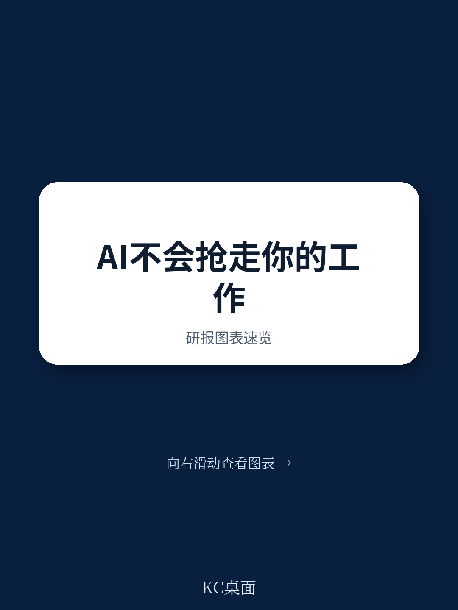
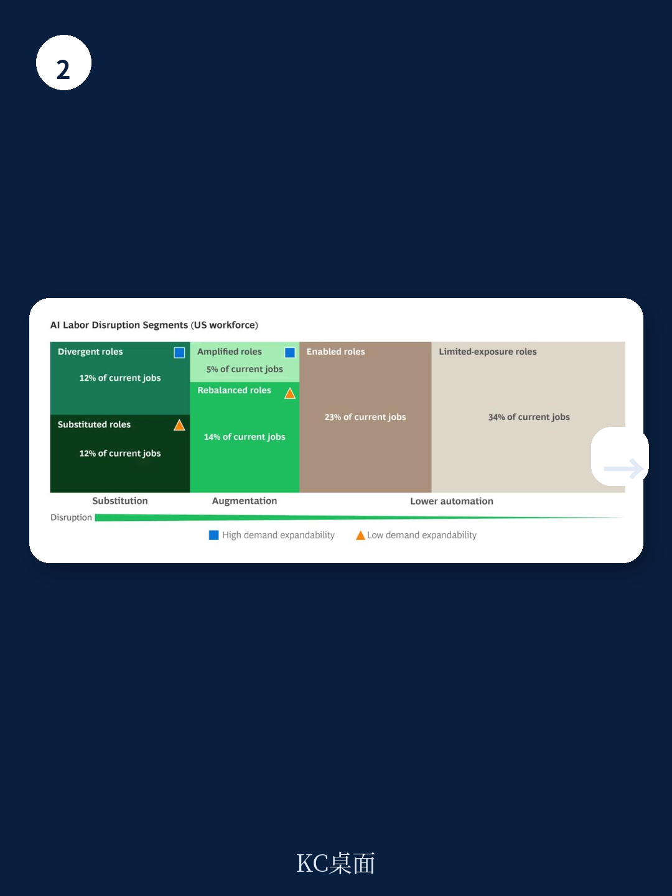

# 波士顿咨询：波士顿咨询揭示AI就业悖论，软件工程师反而因AI需求增长

未来两到三年，美国50%到55%的岗位将被AI重塑。这个数字来自波士顿咨询（BCG）旗下Henderson Institute最新发布的研报。但真正值得关注的不是这个比例本身，而是它背后的判断：AI对就业的影响，不是简单的“替代”与“被替代”的二选一，而是一场关于岗位定义、工作方式和价值分配的系统性重构。这份报告基于微观经济模型，将AI对劳动力市场的影响拆解为替代、增强和需求扩张三种力量，并给出了一个对CEO们极具操作性的框架。它提醒我们，那些急于裁员以换取短期效率的公司，很可能正在为竞争对手铺路。

**KC评论：** 这份报告的核心洞察在于，它把AI对就业的影响从“有多少岗位会消失”这个焦虑问题，转向了“哪些岗位会被重新定义，以及企业如何管理这种转变”。对于决策者来说，这是一个更具建设性的视角。

## 1. 近六成岗位的自动化潜力低于平均水平，AI不会成为“万能替代者”

报告首先计算了美国所有岗位的平均任务自动化潜力——40%。这意味着，如果一个岗位中超过40%的任务可以被当前AI能力自动化，那么它才进入需要重点关注的区间。而结果令人意外：57%的岗位自动化潜力低于这个阈值。这些岗位高度依赖人类的身体在场、动手操作或持续的人际互动，AI对它们的颠覆性影响有限。这包括大量需要物理接触的医疗护理、需要现场判断的维修技工、以及依赖情感共鸣的咨询顾问等。

**KC评论：** 这一结论直接反驳了“AI将取代一切白领工作”的极端叙事。报告通过任务层面的微观分析，揭示了一个关键事实：许多看似“知识密集”的工作，其核心价值恰恰在于那些难以被结构化、需要人类判断和情感投入的部分。对于企业而言，这意味着在考虑AI部署时，首先应该识别哪些岗位是“低自动化潜力”的，避免在不必要的领域浪费资源。

## 2. AI是“增强器”还是“替代者”？取决于两个核心维度

对于那43%的高自动化潜力岗位，BCG提出了一个关键问题：AI会替代人类，还是增强人类？答案取决于两个维度：一是岗位对“人类判断与情感互动”的依赖程度，二是工作流程的“结构化与可重复性”程度。

以呼叫中心代表和软件工程师为例。呼叫中心代表的工作流程高度结构化，AI可以端到端处理大部分重复性咨询，因此AI倾向于替代。而软件工程师的核心价值在于系统设计、架构权衡和将业务需求转化为技术方案，这些需要持续的人类判断，AI更多是加速代码生成和测试，扮演增强角色。报告指出，软件工程岗位在ChatGPT推出后的三年里，总人数仍在稳步增长，这正是增强效应与需求扩张共同作用的结果。

## 3. 需求的可扩张性是决定就业总量的“隐藏变量”

报告引入了一个容易被忽视但至关重要的因素——需求的可扩张性。当AI降低交付成本后，如果市场对该产出的需求是弹性的、有增长空间的，那么总产出和就业总量可能不降反升。这就是经济学中的“杰文斯悖论”：资源效率的提升反而可能导致其使用量增加。

软件工程是典型例子：企业对数字产品和自动化的需求几乎无限，AI降低开发成本后，企业会“生产更多软件”，从而维持甚至增加工程师数量。而呼叫中心则相反，客户咨询量受限于客户基数和服务频次，需求相对固定，AI带来的效率提升会直接减少所需人员。

**KC评论：** 这个“需求可扩张性”的框架，是整份报告最值得CEO们反复琢磨的部分。它意味着，在评估AI对某个部门的就业影响时，不能只看任务自动化率，还必须判断该领域是否存在未被满足的需求。如果存在，那么AI带来的成本下降可能反而创造新的就业机会。报告没有完全展开的是，如何量化不同行业的需求弹性，以及哪些因素（如监管、技术瓶颈）会限制这种扩张。

## 4. 六类岗位的“命运”各不相同，企业需要差异化策略

基于自动化潜力和需求可扩张性，BCG将岗位分为六大类，并给出了针对性的管理建议。其中最关键的是：

- **增强型岗位（5%的当前岗位）**：如软件工程师、高级律师。AI增强人类，需求扩张，就业稳定甚至增长。企业应优先保留和培养这类人才，投资于AI工具和培训。
- **分散型岗位（15%的当前岗位）**：如市场数据分析师。AI替代部分任务，但需求扩张，岗位数量可能减少但不会消失。企业需要设计加速发展通道，帮助员工向更高技能职责转型。
- **替代型岗位（10%的当前岗位）**：如呼叫中心代表。AI替代大部分任务，需求固定，岗位数量将显著减少。企业应尽早规划人员转型路径，而非简单裁员。
- **赋能型岗位（12%的当前岗位）**：如销售代表。AI增强工作，但需求不扩张，效率提升直接转化为人员精简。企业应聚焦于将AI嵌入日常工作流程，建立广泛的AI素养。

这份分类框架的价值在于，它让CEO们能够从“一刀切”的焦虑中走出来，针对不同部门制定差异化的AI部署和人才策略。

## 5. 报告尚未完全回答的关键问题：企业如何衡量“增强”的ROI？

尽管报告给出了清晰的框架，但它也坦诚地指出了几个尚未解决的关键问题。其中之一是：当AI增强人类工作时，如何量化这种增强带来的投资回报率（ROI）？不同于替代型岗位可以通过减少人力成本直接计算收益，增强型岗位的收益往往体现在更快的创新速度、更高的决策质量或更好的客户体验上，这些指标难以直接归因于AI。报告暗示，企业需要建立新的绩效评估体系，将“更高阶技能是否转化为可衡量的产出质量提升”作为核心指标。

**KC评论：** 这个问题触及了AI落地的核心难点。许多公司购买了AI工具，但无法证明它带来了多少实际价值。报告没有给出简单答案，但提供了一个思考方向：ROI的衡量可能需要从“节约了多少成本”转向“创造了多少新的价值”，而这要求企业重新定义其核心业务指标。

## 6. 给决策者的观察框架：从“AI叙事”到“人才战略”

报告的最终落脚点，是为CEO们提供一个可操作的行动框架。它强调，AI的部署顺序和信号传递至关重要。如果企业首先在高度替代的岗位上部署AI，可能会在短期内获得效率提升，但也会制造一个士气低落的环境，导致员工抵制后续的增强型AI部署。正确的做法是：先向员工传达“AI主要是关于价值创造，而非替代”的叙事，然后从增强型岗位开始试点，让员工看到AI如何帮助他们做得更好，从而为后续的变革铺平道路。

这份报告揭示了一个更深层的真相：AI时代的竞争，本质上是人才管理能力的竞争。那些能够将AI部署与员工发展有机结合的企业，将获得结构性优势；而那些只看到替代机会的企业，可能会在效率提升的同时，失去最宝贵的组织能力和人才储备。

**KC评论：** 报告的结论虽然基于美国数据，但其分析框架和战略建议对中国企业同样具有高度参考价值。尤其是在当前中国制造业和服务业面临人力成本上升、数字化转型加速的背景下，如何避免“为了AI而AI”的陷阱，如何识别自身业务中的“需求可扩张性”领域，如何设计员工技能升级路径，都是亟待思考的问题。报告中的六类岗位分类和差异化策略，完全可以作为中国企业制定AI战略的起点。

---

这份报告只是BCG Henderson Institute关于AI与劳动力市场系列研究的一个切片。它提供了清晰的框架和有力的数据，但正如报告自身所言，它没有考虑宏观经济波动、地缘政治以及未来AI技术突破的影响。这些变量如何与报告中的模型相互作用，恰恰是理解AI长期影响的关键。

在每天更新的国际信源汇编中，我们会把这份报告放回当天全球投行、咨询公司和国际机构的主线里，整理成中文摘要、KC评论和图表合集。无论是喂给AI进行追问，还是人工快速扫描市场动态，这套日更汇编都能帮助你高效捕捉全球主流叙事的边际变化。这里汇聚了头部券商、PE/VC、投行、并购、对冲基金、资管机构、战略咨询和智库的朋友，我们期待与你交流。

Personal reading notes and learning share only. Not investment advice.

